# AUTOMARIZA — Catálogo de proyectos

<!-- catalog:meta {"generated": "2026-10-05", "version": "1.0", "brand": "AUTOMARIZA", "motto": {"es": "La R es de Razonamiento", "en": "The R stands for Reasoning"}, "language": "es-ES", "totals": {"suites": 10, "sistemas": 14, "herramientas": 65, "procesosEnProduccion": 113}, "suites": [{"slug": "suite-infraestructura", "name": "Suite de infraestructura y fiabilidad", "tools": ["supervisor-procesos", "panel-supervisores", "detector-procesos-caidos", "copias-seguridad-mensajeria", "vigilante-termico-cpd", "aviso-camaras-caidas", "monitor-disponibilidad-push", "buzon-reportes-ticket"]}, {"slug": "suite-compras", "name": "Suite de compras", "tools": ["mesa-documentos-proveedores", "buscador-multimayorista", "buscador-stock-mayorista-europeo", "radar-tarifas-proveedor", "sincronizador-costes-portal", "agente-ia-correos-ofertas", "detector-compras-caras", "mas-vendidos-produccion", "estadisticas-gasto-compras", "conversor-divisas-compra", "vigilante-precios-cero", "buscador-incidencias-compras"]}, {"slug": "suite-costes-margenes", "name": "Suite de costes y márgenes", "tools": ["motor-costes-margenes", "asistente-ia-costes", "vigilancia-precios-ordenes", "actualizador-margenes-familia"]}, {"slug": "suite-produccion", "name": "Suite de producción", "tools": ["planificador-produccion", "digitalizacion-pruebas", "plan-pedidos-enviables", "asignador-preproduccion", "laboratorio-benchmarks", "kpis-produccion", "analitica-rma", "inventario-rotacion-componentes", "cambios-masivos-ordenes", "cambios-masivos-escandallos", "traspaso-entre-ordenes", "vigia-documentacion-id", "seguimiento-retrasos-pedidos", "planificador-oficina"]}, {"slug": "suite-stock", "name": "Suite de stock y alertas", "tools": ["analizador-stock-series", "buscador-universal-erp", "web-stock", "monitor-series-duplicadas", "valor-inventario", "stock-inmovilizado-segunda-mano", "alertas-stock", "trazabilidad-movimientos-stock", "informes-programados-correo"]}, {"slug": "suite-portal-b2b", "name": "Suite del portal B2B de clientes", "tools": ["gestor-catalogo-equipos", "sustitucion-componentes-eol", "margenes-portal", "categorias-precio-masivas", "feed-stock-clientes"]}, {"slug": "suite-administracion", "name": "Suite de administración y finanzas", "tools": ["facturas-vencidas-proveedores", "facturas-vencidas-clientes", "tarifas-clientes", "trazabilidad-series-compra", "buscador-componentes-albaranes", "bot-digitalizacion-albaranes"]}, {"slug": "suite-comercial-marketing", "name": "Suite comercial y marketing", "tools": ["agente-comercial-whatsapp", "analizador-comercial-producto", "leads-resumenes-correo", "sincronizacion-suscriptores", "informe-campanas-correo", "gestor-programa-creadores", "clasificador-buzon-compartido", "organizador-correos-ia"]}, {"slug": "suite-atencion", "name": "Suite de atención al cliente", "tools": ["bot-atencion-telegram-discord", "difusion-anuncios", "autorol-bienvenida", "tickets-departamentos", "filtro-soporte-serie", "descargas-contrasena-rotativa"]}, {"slug": "suite-conocimiento", "name": "Suite de conocimiento y productividad", "tools": ["portal-herramientas", "gestor-documental-ia", "tareas-nota-voz", "guias-interactivas", "generador-guias-video", "cambio-masivo-modelo-ia", "directorio-proveedores-ia"]}], "featured": ["supervisor-procesos", "motor-costes-margenes", "planificador-produccion", "gestor-documental-ia", "portal-herramientas", "tareas-nota-voz", "buscador-multimayorista", "digitalizacion-pruebas"]} -->

## Visión general

Este catálogo documenta el software que AUTOMARIZA ha diseñado y construido para un fabricante de estaciones de trabajo y servidores que monta bajo pedido. No es una colección de scripts sueltos: es un **ecosistema** de unas noventa herramientas que comparten datos, acceso, estética y forma de trabajar, y que hoy sostiene buena parte de la operación diaria de la empresa, de las compras a la atención posventa.

**Cifras del ecosistema:**
- **10 suites**, **14 sistemas** y **65 herramientas** documentadas con ficha propia.
- Alrededor de **113 procesos en producción** repartidos en **tres máquinas**: desarrollo, granja de cálculo y un nodo de alarma y proxy.
- Un **supervisor propio** arranca, vigila y reinicia los procesos.
- Otro proceso comprueba desde fuera que los tres supervisores siguen vivos.

**Cómo está construido.** El corazón de los datos es el **ERP** de la empresa (SQL Server): artículos, stock, números de serie, órdenes de fabricación, compras, ventas y cartera. Alrededor gira el **portal B2B**, donde los clientes profesionales configuran y compran sus equipos. Casi todas las herramientas son aplicaciones web en **Python y Flask** que leen el ERP con consultas parametrizadas. Las pocas que escriben lo hacen en transacción, con foto previa, historial y opción de deshacer.

**Piezas comunes:**
- un **login único** con contraseñas cifradas y permisos por herramienta;
- un **portal** que abre cada herramienta en un escritorio web con inicio de sesión automático;
- un único **estilo visual** (grafito con un solo color de acción);
- **guías interactivas** dentro de cada herramienta;
- **correo directo** para avisos;
- **mensajería** (Discord y Telegram) como canal de alertas y de atención.

**La «R» de Razonamiento.** La inteligencia artificial está donde aporta, y casi siempre en **local**: un modelo de lenguaje de unos 27B parámetros, un modelo de vectores y Whisper para la voz corren en una GPU propia de 48 GB. Con ellos:
- se describen y se buscan documentos por significado;
- se convierten notas de voz en tareas con plan;
- se redactan notas de CRM a partir del correo;
- se clasifican buzones que aprenden de cada corrección;
- se analizan costes y desviaciones;
- se generan guías a partir de vídeos.

La IA en la nube se reserva para lo que ya es público, como el agente comercial de WhatsApp o los textos del catálogo, y siempre con una segunda pasada que valida la respuesta contra datos reales. La regla de fondo es que **la IA propone y el código comprueba**: compatibilidades de piezas, enlaces, permisos y cifras se verifican de forma determinista antes de que nada llegue a una persona.

**Qué problemas resuelve.** En un fabricante bajo pedido, cada equipo es un pequeño proyecto: hay que comprar al mejor precio entre varios mayoristas, calcular costes y márgenes reales, planificar qué se puede montar con el stock que hay, probar cada máquina y documentar esas pruebas, vender, cobrar y dar soporte. Cada suite ataca uno de esos frentes:
- **compras** y **costes y márgenes**;
- **producción** y **stock**;
- **portal B2B**, **administración**, **comercial y marketing** y **atención al cliente**;
- **conocimiento**, que une todo lo anterior;
- y, por debajo de todo, la **infraestructura**.

**Principios que se repiten.**
1. **Solo lectura por defecto.** Cuando hay que escribir, se hace en transacción, con relectura y foto previa.
2. **Avisar de cambios, no de estados.** Una alerta se dispara cuando algo pasa de bien a mal, no cada cinco minutos mientras siga mal.
3. **Nada se pierde.** Hay papeleras, versiones, historiales y copias rotativas en todas partes.
4. **El usuario no tiene que aprender el ERP.** Cada herramienta habla el idioma de quien la usa.
5. **Lo crítico se vigila solo:** procesos, temperatura del centro de datos, cámaras y copias.

**Cómo leer este documento.** Cada suite abre con una visión de conjunto, seguida de las fichas de sus herramientas; las ocho **destacadas** se cuentan con más profundidad. El código es real, recortado y con nombres internos generalizados. Las cifras reales son técnicas (frecuencias, umbrales, tamaños), nunca de negocio, y los ejemplos de las animaciones son inventados.

## Mapa del ecosistema

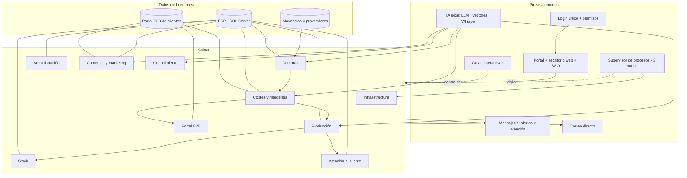

## Índice

- **Suite de infraestructura y fiabilidad** (`suite-infraestructura`) — Lo que mantiene en pie más de cien automatizaciones sin que nadie tenga que vigilarlas
  - Supervisor de procesos ★ (`supervisor-procesos` · sistema)
  - Panel de supervisores (`panel-supervisores` · herramienta)
  - Detector de procesos caídos (`detector-procesos-caidos` · herramienta)
  - Copias de seguridad cifradas a la nube de mensajería (`copias-seguridad-mensajeria` · herramienta)
  - Vigilante térmico de la sala de servidores (`vigilante-termico-cpd` · herramienta)
  - Aviso de cámaras caídas (`aviso-camaras-caidas` · herramienta)
  - Monitor de disponibilidad y avisos push (`monitor-disponibilidad-push` · herramienta)
  - Buzón de reportes con ticket (`buzon-reportes-ticket` · herramienta)
- **Suite de compras** (`suite-compras`) — Todo lo que necesita un departamento de compras para comprar mejor, más rápido y sin errores
  - Mesa de procesado de documentos de proveedores (`mesa-documentos-proveedores` · herramienta)
  - Buscador multimayorista ★ (`buscador-multimayorista` · sistema)
  - Buscador de stock de un mayorista europeo (`buscador-stock-mayorista-europeo` · herramienta)
  - Radar de tarifas de proveedor (`radar-tarifas-proveedor` · herramienta)
  - Sincronizador de costes con el portal (`sincronizador-costes-portal` · herramienta)
  - Agente IA de correos de ofertas (`agente-ia-correos-ofertas` · herramienta)
  - Detector de compras por encima de su media (`detector-compras-caras` · herramienta)
  - Más vendidos en producción (`mas-vendidos-produccion` · herramienta)
  - Estadísticas de gasto de compras (`estadisticas-gasto-compras` · herramienta)
  - Conversor de precios de compra por divisa (`conversor-divisas-compra` · herramienta)
  - Vigilante de precios de compra a cero (`vigilante-precios-cero` · herramienta)
  - Buscador de incidencias de compras (`buscador-incidencias-compras` · herramienta)
- **Suite de costes y márgenes** (`suite-costes-margenes`) — Saber de verdad cuánto cuesta lo que fabricas y cuánto ganas con lo que vendes
  - Motor de costes y márgenes ★ (`motor-costes-margenes` · sistema)
  - Asistente IA de costes (`asistente-ia-costes` · herramienta)
  - Vigilancia de precios en órdenes de producción (`vigilancia-precios-ordenes` · herramienta)
  - Actualizador de márgenes por familia (`actualizador-margenes-familia` · herramienta)
- **Suite de producción** (`suite-produccion`) — Del pedido al equipo probado y enviado: qué se puede fabricar, qué falta, quién lo prepara y cómo salió
  - Planificador de producción con stock real ★ (`planificador-produccion` · sistema)
  - Digitalización de pruebas con doble firma ★ (`digitalizacion-pruebas` · sistema)
  - Plan de pedidos enviables (`plan-pedidos-enviables` · herramienta)
  - Asignador de preparación de material (`asignador-preproduccion` · herramienta)
  - Laboratorio de benchmarks (`laboratorio-benchmarks` · herramienta)
  - KPIs de producción (`kpis-produccion` · herramienta)
  - Analítica de incidencias y garantías (RMA) (`analitica-rma` · herramienta)
  - Inventario de sistemas y rotación de componentes (`inventario-rotacion-componentes` · herramienta)
  - Cambios masivos en órdenes de fabricación (`cambios-masivos-ordenes` · herramienta)
  - Cambios masivos de escandallos (`cambios-masivos-escandallos` · herramienta)
  - Traspaso de artículos entre órdenes (`traspaso-entre-ordenes` · herramienta)
  - Vigía de documentación de I+D (`vigia-documentacion-id` · herramienta)
  - Seguimiento de retrasos en pedidos (`seguimiento-retrasos-pedidos` · herramienta)
  - Planificador visual de oficina 2D/3D (`planificador-oficina` · herramienta)
- **Suite de stock y alertas** (`suite-stock`) — Saber qué hay, dónde, cuánto vale, qué no se mueve y qué está mal registrado, sin preguntar a nadie
  - Analizador de stock y números de serie (`analizador-stock-series` · herramienta)
  - Buscador universal del ERP (`buscador-universal-erp` · herramienta)
  - Web de control de stock por número de serie (`web-stock` · herramienta)
  - Monitor de números de serie duplicados (`monitor-series-duplicadas` · sistema)
  - Valor de inventario con fotos diarias (`valor-inventario` · herramienta)
  - Stock inmovilizado con salida a segunda mano (`stock-inmovilizado-segunda-mano` · herramienta)
  - Alertas de stock personalizadas (`alertas-stock` · herramienta)
  - Trazabilidad de movimientos de stock (`trazabilidad-movimientos-stock` · herramienta)
  - Informes programados por correo (`informes-programados-correo` · sistema)
- **Suite del portal B2B de clientes** (`suite-portal-b2b`) — Gestionar el catálogo, los precios y el stock que ven los clientes en el portal, de forma masiva y segura
  - Gestor del catálogo de equipos (`gestor-catalogo-equipos` · herramienta)
  - Sustitución masiva de componentes descatalogados (`sustitucion-componentes-eol` · herramienta)
  - Márgenes del portal por tipo de cliente (`margenes-portal` · herramienta)
  - Cambio masivo de categoría de precio (`categorias-precio-masivas` · herramienta)
  - Feed de stock para clientes (`feed-stock-clientes` · herramienta)
- **Suite de administración y finanzas** (`suite-administracion`) — Pagos, cobros, tarifas, trazabilidad documental y papeles digitalizados, bajo control y con avisos
  - Seguimiento de facturas de proveedores por pagar (`facturas-vencidas-proveedores` · herramienta)
  - Seguimiento de facturas de clientes por cobrar (`facturas-vencidas-clientes` · herramienta)
  - Corrección masiva de tarifas de clientes (`tarifas-clientes` · herramienta)
  - Trazabilidad de números de serie de compra (`trazabilidad-series-compra` · herramienta)
  - Buscador de artículos en albaranes de venta (`buscador-componentes-albaranes` · herramienta)
  - Bot de digitalización de albaranes y visor (`bot-digitalizacion-albaranes` · sistema)
- **Suite comercial y marketing** (`suite-comercial-marketing`) — Un vendedor de IA en WhatsApp, notas de CRM escritas solas, campañas medidas y creadores de contenido bajo control
  - Agente comercial de IA en WhatsApp (`agente-comercial-whatsapp` · sistema)
  - Analizador comercial por producto (`analizador-comercial-producto` · herramienta)
  - Notas de CRM automáticas desde el correo (`leads-resumenes-correo` · herramienta)
  - Sincronización de clientes con email marketing (`sincronizacion-suscriptores` · herramienta)
  - Informe mensual de campañas y engagement (`informe-campanas-correo` · herramienta)
  - Gestor del programa de creadores de contenido (`gestor-programa-creadores` · sistema)
  - Clasificador del buzón compartido que aprende (`clasificador-buzon-compartido` · herramienta)
  - Organizador de correos con IA (experimento) (`organizador-correos-ia` · herramienta)
- **Suite de atención al cliente** (`suite-atencion`) — Los clientes escriben por Telegram o Discord; el equipo responde desde un único sitio, por departamento y con el número de serie verificado
  - Bot de atención por departamentos (Telegram ↔ equipo) (`bot-atencion-telegram-discord` · sistema)
  - Difusión de anuncios a todos los clientes (`difusion-anuncios` · herramienta)
  - Bienvenida y rol automático en la comunidad (`autorol-bienvenida` · herramienta)
  - Tickets por departamento con formulario (`tickets-departamentos` · herramienta)
  - Filtro de soporte por número de serie (`filtro-soporte-serie` · herramienta)
  - Descargas con contraseña rotativa (`descargas-contrasena-rotativa` · herramienta)
- **Suite de conocimiento y productividad** (`suite-conocimiento`) — Un solo portal para todas las herramientas, los documentos que se responden solos y las tareas que se dictan por voz
  - Portal de herramientas con escritorio web e inicio de sesión único ★ (`portal-herramientas` · sistema)
  - Gestor documental con IA local ★ (`gestor-documental-ia` · sistema)
  - Gestor de tareas por nota de voz ★ (`tareas-nota-voz` · sistema)
  - Sistema de guías interactivas reversibles (`guias-interactivas` · herramienta)
  - Generador de documentación a partir de vídeos (`generador-guias-video` · herramienta)
  - Cambio masivo del modelo de IA en todo el código (`cambio-masivo-modelo-ia` · herramienta)
  - Directorio de proveedores con consulta en lenguaje natural (`directorio-proveedores-ia` · herramienta)

★ = destacado.

---

<!-- project:begin slug="suite-infraestructura" -->
## Suite de infraestructura y fiabilidad

```json ficha
{
  "slug": "suite-infraestructura",
  "name": "Suite de infraestructura y fiabilidad",
  "kind": "suite",
  "parent": null,
  "tools": ["supervisor-procesos", "panel-supervisores", "detector-procesos-caidos", "copias-seguridad-mensajeria", "vigilante-termico-cpd", "aviso-camaras-caidas", "monitor-disponibilidad-push", "buzon-reportes-ticket"],
  "department": ["it", "direccion"],
  "category": "infra",
  "lifecycle": "activo",
  "status": "produccion",
  "evolvedFrom": "Un fichero .bat que mataba todos los procesos de Python y volvía a abrir unos treinta bots, cada uno en su propia ventana de consola",
  "tagline": { "es": "Lo que mantiene en pie más de cien automatizaciones sin que nadie tenga que vigilarlas", "en": "What keeps more than a hundred automations running without anyone having to watch them" },
  "summary": { "es": "Un supervisor propio arranca, vigila y reinicia todos los programas de la empresa; un detector independiente confirma las caídas y avisa; las copias de seguridad salen cifradas cada noche y la sala de servidores, las cámaras y las máquinas críticas avisan solas cuando algo va mal.", "en": "An in-house supervisor starts, watches and restarts every company program; an independent detector confirms outages and raises alerts; backups leave encrypted every night, and the server room, cameras and critical machines alert on their own when something goes wrong." },
  "problem": { "es": "Con decenas de bots, webs internas y procesos programados repartidos en varias máquinas, un fallo silencioso podía pasar días sin detectarse: un bot caído no avisa de que está caído.", "en": "With dozens of bots, internal web apps and scheduled jobs spread across several machines, a silent failure could go unnoticed for days: a crashed bot does not report that it has crashed." },
  "solution": { "es": "Una capa de fiabilidad en tres niveles: un supervisor por máquina que gestiona procesos, un vigilante externo que comprueba a los supervisores y una red de avisos (correo, Discord, notificaciones push) para todo lo físico: temperatura, cámaras y equipos.", "en": "A three-level reliability layer: one supervisor per machine that manages processes, an external watcher that checks the supervisors, and an alert network (email, Discord, push notifications) for everything physical: temperature, cameras and machines." },
  "howItWorks": [
    { "title": { "es": "Arranque automático", "en": "Automatic start" }, "text": { "es": "Al encender el servidor, Windows lanza un vigilante diario que abre el supervisor; el supervisor arranca todos los procesos habilitados, uno a uno.", "en": "When the server boots, Windows launches a daily watchdog that opens the supervisor; the supervisor starts every enabled process, one at a time." } },
    { "title": { "es": "Vigilancia continua", "en": "Continuous watching" }, "text": { "es": "Cada 30 segundos el supervisor comprueba si cada proceso sigue vivo y si debe estar encendido según su horario.", "en": "Every 30 seconds the supervisor checks whether each process is still alive and whether it should be running according to its schedule." } },
    { "title": { "es": "Confirmación externa", "en": "External confirmation" }, "text": { "es": "Un detector independiente entra en los paneles de las tres máquinas cada 20 segundos y solo avisa tras tres fallos seguidos.", "en": "An independent detector logs into the panels of the three machines every 20 seconds and only alerts after three consecutive failures." } },
    { "title": { "es": "Protección de datos", "en": "Data protection" }, "text": { "es": "Cada madrugada se comprime y cifra el trabajo de cada máquina y se sube troceado a un canal privado de mensajería.", "en": "Every night each machine's work is compressed, encrypted and uploaded in chunks to a private messaging channel." } }
  ],
  "features": [
    { "es": "Supervisor web con métricas de CPU, RAM, disco, red y GPU en tiempo real", "en": "Web supervisor with real-time CPU, RAM, disk, network and GPU metrics" },
    { "es": "Reinicio diario programado y pausa de 24 h tras una caída para no entrar en bucle", "en": "Scheduled daily restart and a 24-hour cooldown after a crash to avoid restart loops" },
    { "es": "Panel único que muestra los supervisores de las tres máquinas", "en": "Single panel showing the supervisors of the three machines" },
    { "es": "Detector de caídas con triple comprobación y avisos agrupados", "en": "Outage detector with triple check and grouped alerts" },
    { "es": "Copias diarias cifradas AES-256, troceadas y con reanudación", "en": "Daily AES-256 encrypted backups, split into parts and resumable" },
    { "es": "Vigilancia térmica de la sala de servidores con gráficas bajo demanda", "en": "Server-room thermal monitoring with on-demand charts" },
    { "es": "Avisos por correo de cámaras caídas y recuperadas", "en": "Email alerts for cameras going down and coming back" },
    { "es": "Notificación push al móvil si una máquina crítica lleva más de una hora caída", "en": "Push notification to a phone if a critical machine has been down for over an hour" }
  ],
  "automations": [
    { "trigger": "al iniciar Windows", "action": { "es": "Arranca el vigilante diario, que abre el supervisor", "en": "Starts the daily watchdog, which opens the supervisor" } },
    { "trigger": "cada 30 s", "action": { "es": "El supervisor revisa procesos y horarios", "en": "The supervisor checks processes and schedules" } },
    { "trigger": "cada 20 s", "action": { "es": "El detector externo consulta los tres supervisores", "en": "The external detector polls the three supervisors" } },
    { "trigger": "a las 03:00", "action": { "es": "Reinicio ordenado de todos los procesos", "en": "Orderly restart of every process" } },
    { "trigger": "a las 04:30", "action": { "es": "Copia de seguridad cifrada de cada máquina", "en": "Encrypted backup of each machine" } },
    { "trigger": "cada minuto", "action": { "es": "Lectura de los sensores de temperatura", "en": "Temperature sensors are read" } },
    { "trigger": "cada 2 min y en cada cambio", "action": { "es": "Revisión del estado de las cámaras", "en": "Camera status check" } }
  ],
  "integrations": ["Windows", "Discord", "Telegram", "Correo Office 365", "Home Assistant", "Pushover", "IA local (Ollama)"],
  "ai": { "used": true, "where": { "es": "Asistente integrado en el supervisor que contesta preguntas sobre los logs y el estado del sistema", "en": "Assistant built into the supervisor that answers questions about logs and system state" }, "local": true, "models": ["cualquier modelo instalado en Ollama, elegido por el usuario"] },
  "users": { "es": "Responsable de sistemas y desarrollo; los avisos llegan también a dirección", "en": "Systems and development lead; alerts also reach management" },
  "stack": ["python", "flask", "windows", "discord", "telegram", "email", "pushover", "ollama", "pynvml", "nvidia"],
  "stackOther": ["psutil", "Server-Sent Events", "py7zr", "discord.py", "python-telegram-bot", "Home Assistant REST API"],
  "metrics": [
    { "label": { "es": "Procesos supervisados en la máquina principal", "en": "Processes supervised on the main machine" }, "value": "97 entradas (más de 110 procesos contando sub-lanzadores)", "real": true },
    { "label": { "es": "Máquinas con supervisor propio", "en": "Machines with their own supervisor" }, "value": "3", "real": true },
    { "label": { "es": "Frecuencia de comprobación del detector externo", "en": "External detector check frequency" }, "value": "cada 20 s, aviso tras 3 fallos", "real": true },
    { "label": { "es": "Pausa tras una caída", "en": "Cooldown after a crash" }, "value": "24 h", "real": true }
  ],
  "businessValue": { "es": "Convierte un ecosistema artesanal de scripts en algo que se comporta como un servicio profesional: se arranca solo, se recupera solo y avisa antes de que alguien note el fallo.", "en": "Turns a hand-made ecosystem of scripts into something that behaves like a professional service: it starts itself, recovers itself and alerts before anyone notices the failure." },
  "complexity": 7,
  "impressiveness": 9,
  "featured": false,
  "sensitivity": "media",
  "visualLoop": { "es": "Tres servidores laten en verde; uno se pone rojo, el detector lo comprueba tres veces, suena una campana y llega un aviso al móvil; el servidor vuelve a verde.", "en": "Three servers pulse green; one turns red, the detector checks it three times, a bell rings and an alert reaches a phone; the server turns green again." },
  "notes": "Se han omitido nombres de máquinas, direcciones, puertos y canales. Las tres máquinas se describen como 'desarrollo', 'granja de render' y 'alarma y proxy'. Solo se dispone del código de la máquina de desarrollo."
}
```

### Qué es
Es la capa que sostiene todo lo demás. En la empresa funcionan a la vez más de un centenar de procesos: webs internas, bots de Discord y Telegram, agentes de IA, vigilantes de precios, informes programados… Ninguno sirve de nada si se cae a las dos de la madrugada y nadie se entera hasta el día siguiente. Esta suite reúne las herramientas que hacen que todo eso se arranque, se vigile, se recupere y se respalde sin intervención humana.

Tiene ocho piezas:

| Herramienta | Papel |
|---|---|
| **Supervisor de procesos** | Arranca, para, reinicia y monitoriza cada programa de una máquina, con panel web en tiempo real |
| **Panel de supervisores** | Reúne en una sola pantalla los supervisores de las tres máquinas |
| **Detector de procesos caídos** | Vigila a los vigilantes desde fuera y avisa solo de caídas confirmadas |
| **Copias de seguridad a la nube de mensajería** | Copia diaria cifrada y troceada de cada máquina |
| **Vigilante térmico de la sala de servidores** | Lee sensores de temperatura y reconstruye el historial de alertas |
| **Aviso de cámaras caídas** | Convierte el estado de las cámaras en correos de caída y de recuperación |
| **Monitor de disponibilidad y avisos push** | Ping a equipos críticos y aviso al móvil si una máquina lleva una hora caída |
| **Buzón de reportes con ticket** | Formulario para que cualquiera reporte un fallo con adjuntos y número de ticket |

### El problema que resuelve
Antes de esta suite, el arranque era un `.bat` que mataba **todos** los procesos de Python del equipo y volvía a abrir cada bot en su propia ventana de consola. No había forma de saber qué estaba vivo y qué no. Si un bot fallaba, su ventana se cerraba y ya está. Tampoco había horarios ni registros, y había que reiniciar a mano. Un reinicio generalizado cada 24 horas era la única «estrategia» de recuperación.

Había, además, problemas físicos que dependían de que alguien mirara: la temperatura de la sala de servidores, las cámaras de la alarma o las máquinas de la granja de render.

### Cómo se usa
1. El responsable de sistemas entra en el panel web del supervisor con su contraseña.
2. Ve, arriba, el estado de la máquina: CPU, RAM, disco, red, GPU y los procesos que más consumen.
3. Debajo, una tabla con todos los programas: estado, etiqueta del departamento, horario, consumo, tiempo encendido y número de reinicios.
4. Desde ahí puede arrancar, parar, reiniciar o poner en mantenimiento cualquier proceso, abrir su log en vivo o preguntar a la IA qué está pasando.
5. Si quiere ver las tres máquinas a la vez, abre el panel de supervisores.
6. Para todo lo demás no tiene que hacer nada: los avisos llegan solos al correo, a Discord o al móvil.

### Qué hace solo
- **Al iniciar Windows** se lanza un vigilante que, cada 24 horas, relanza el supervisor.
- **Cada 30 segundos** el supervisor detecta procesos muertos, los marca como caídos y respeta los horarios de cada uno.
- **A las 03:00** hace un reinicio ordenado de todo.
- **Cada 2 segundos** toma una muestra del sistema y la empuja al navegador sin que este tenga que preguntar.
- **Cada 20 segundos** el detector externo entra en los tres supervisores y compara estados.
- **A las 04:30** cada máquina comprime, cifra y sube su copia de seguridad.
- **Cada minuto** se leen los sensores de temperatura; **cada 2 minutos** se repasan las cámaras; **cada 5 y 10 minutos** se comprueba la disponibilidad de equipos críticos.

### Cómo funciona por dentro
La arquitectura tiene tres niveles que se vigilan entre sí:

1. **Nivel de proceso.** El supervisor lanza cada programa como un hijo suyo, con su carpeta de trabajo, la salida capturada línea a línea y la ventana oculta. Así siempre sabe su identificador de proceso y puede leer lo que imprime.
2. **Nivel de máquina.** El vigilante de Windows garantiza que el supervisor esté vivo y lo relanza a diario.
3. **Nivel de red.** El detector externo consulta la API de cada supervisor como si fuera un usuario. Si el supervisor entero cae, el detector lo nota porque falla el inicio de sesión.

Varias herramientas usan **Discord como bus de estados**: el nombre de un canal de voz se convierte en una etiqueta viva («Equipo 🟢 10h25m UPTIME», «Cámara DOWN»). Unos bots escriben esos nombres y otros los leen, de modo que el propio servidor de Discord es a la vez panel visual y fuente de datos.

### Interfaz
La pieza visual principal es el panel del supervisor, de tema oscuro, con indicadores circulares, gráficas en vivo y una tabla de procesos con colores por estado. El panel de supervisores muestra tres marcos, uno por máquina. El resto de herramientas no tienen pantalla propia: viven en Discord (canales, mensajes y gráficas), en el correo y en el móvil.

### Inteligencia artificial
El supervisor lleva un asistente que usa un modelo local a través de Ollama. Cuando le preguntas, recibe como contexto el log que tienes abierto, las estadísticas del sistema y la lista de procesos, y tiene instrucciones de no inventarse nada que no esté en ese contexto. Ningún dato sale de la red de la empresa.

### Fiabilidad y seguridad
- Los paneles están protegidos con contraseña.
- Las copias van cifradas con AES-256 antes de salir de la máquina.
- Las escrituras de estado son atómicas: se escribe un fichero temporal y luego se renombra, para que un apagón no deje un JSON a medias.
- Los avisos solo se lanzan con **cambios reales de estado** y tras confirmación, para evitar la fatiga de alertas.

### Qué aporta a una empresa
- Las automatizaciones dejan de ser frágiles.
- Se acaban los «¿por qué no ha llegado el informe de hoy?».
- Una sola persona puede mantener un parque de más de cien procesos.
- Los incidentes físicos (calor, cámaras, máquinas) se detectan en minutos y no en horas.

### Retos técnicos resueltos
- **Matar árboles de procesos en Windows.** Al parar un bot hay que parar también sus hijos (por ejemplo, un bot de Node que lanza un navegador). El supervisor recorre el árbol con `psutil` y escala de *terminate* a *kill*.
- **Evitar bucles de reinicio.** Un proceso que se cae nada más arrancar no se relanza 2.000 veces: entra en una pausa de 24 horas.
- **Falsos positivos.** El detector externo exige tres fallos seguidos antes de declarar una caída y avisa también de la recuperación, con su duración.
- **Subidas grandes a una API con límites.** Las copias se trocean en partes de 45 MB, se reanudan desde la última parte confirmada y respetan los tiempos de espera que impone la API.

### Evolución
- **v0:** un `.bat` con unos treinta `start` y un `taskkill` general cada 24 horas.
- **v1:** un supervisor web con estado en JSON.
- **v2 (actual):** horarios por plantillas, etiquetas por departamento, pausa tras caídas, métricas del sistema y de GPU en tiempo real con Server-Sent Events, histórico diario de 35 días y asistente IA.

El siguiente paso natural es unificar los tres supervisores en uno con agentes remotos, en lugar de tres paneles enmarcados en uno.

### Diagrama
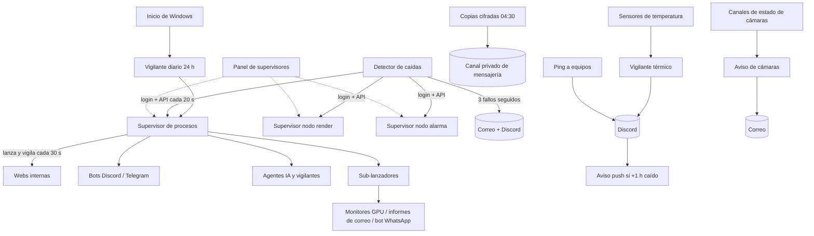

### Código
```python title="01 — El detector solo avisa cuando una caída se confirma tres veces seguidas"
if decision == "down":
    consecutive_failures += 1
    if consecutive_failures >= FAILURES_TO_CONFIRM and prev_status != "down":
        node_state["scripts"][key] = {
            "status": "down",
            "consecutive_failures": consecutive_failures,
            "last_seen": now_iso(),
            "down_since": now_iso(),
        }
        events.append({"type": "script_down", "node": node_name,
                       "name": sc["name"], "down_since": now_iso()})
elif decision == "up" and prev_status == "down" and down_since:
    recovery = datetime.now(timezone.utc).astimezone() - datetime.fromisoformat(down_since)
    events.append({"type": "script_recovery", "node": node_name, "name": sc["name"],
                   "down_hours": recovery.total_seconds() / 3600})
```

### Animación
```json animacion
{
  "duration": 10,
  "aspect": "16:9",
  "concept": { "es": "Tres niveles de vigilancia que se cubren entre sí: proceso, máquina y red", "en": "Three monitoring levels covering each other: process, machine and network" },
  "elements": [
    { "id": "srv1", "type": "servidor", "label": "Desarrollo", "position": "izquierda" },
    { "id": "srv2", "type": "servidor", "label": "Render", "position": "centro" },
    { "id": "srv3", "type": "servidor", "label": "Alarma", "position": "derecha" },
    { "id": "radar", "type": "icono", "label": "Detector", "position": "arriba-centro" },
    { "id": "movil", "type": "movil", "label": "Aviso", "position": "abajo-derecha" },
    { "id": "nube", "type": "icono", "label": "Copia cifrada", "position": "abajo-izquierda" },
    { "id": "termo", "type": "icono", "label": "24,1 °C", "position": "abajo-centro" }
  ],
  "beats": [
    { "t": 0.5, "action": "aparecen los tres servidores latiendo en verde, cada uno con un contador «97 procesos» (dato real del principal)" },
    { "t": 1.8, "action": "una onda cian sale del detector y toca los tres servidores cada 20 s (acelerado)" },
    { "t": 3.0, "action": "un proceso del servidor central se vuelve rojo; aparece un contador «fallo 1/3»" },
    { "t": 4.0, "action": "el contador sube a 2/3 y 3/3 con dos ondas más del detector" },
    { "t": 5.0, "action": "una campana ámbar vibra; un sobre y un mensaje de Discord vuelan hacia el móvil: «🚨 Caída confirmada (datos de ejemplo)»" },
    { "t": 6.5, "action": "el supervisor relanza el proceso; vuelve a verde y llega «✅ Recuperado tras 0,2 h»" },
    { "t": 8.0, "action": "la luna aparece, un reloj marca 04:30 y de cada servidor sale un paquete con candado que viaja a la nube troceado en partes" },
    { "t": 9.3, "action": "el termómetro muestra 24,1 °C en verde; todo queda en calma con el lema «Se arranca solo. Se cura solo. Avisa solo.»" }
  ],
  "sampleData": { "nota": "todo inventado y marcado como ejemplo salvo el número de procesos" },
  "palette": "oscuro #05070a, ámbar #f2a93b (sistema), cian #5cc8d6 (datos), verde #52d18e (ok), rojo #ef5b4c (alerta)"
}
```
<!-- project:end -->

<!-- project:begin slug="supervisor-procesos" -->
## Supervisor de procesos

```json ficha
{
  "slug": "supervisor-procesos",
  "name": "Supervisor de procesos",
  "kind": "sistema",
  "parent": "suite-infraestructura",
  "tools": [],
  "department": ["it"],
  "category": "infra",
  "lifecycle": "activo",
  "status": "produccion",
  "evolvedFrom": "Un .bat que mataba todos los procesos de Python y relanzaba unos treinta bots en ventanas de consola sueltas",
  "tagline": { "es": "Un panel de control que arranca, vigila y resucita casi cien programas a la vez", "en": "A control panel that starts, watches and revives almost a hundred programs at once" },
  "summary": { "es": "Es el «director de orquesta» de la empresa: desde una web se ve qué programa está encendido, cuánto consume, si se ha caído y por qué. Los arranca solos al encender el servidor, respeta horarios, los reinicia cada noche y, si uno falla, lo aparta 24 horas para que no entre en bucle.", "en": "It is the company's 'conductor': a web page shows which program is running, how much it consumes, whether it has crashed and why. It starts them automatically when the server boots, respects schedules, restarts them every night and, if one fails, sets it aside for 24 hours so it does not loop." },
  "problem": { "es": "Gestionar casi cien scripts a mano es imposible: no se sabe cuáles están vivos, cuáles fallan en silencio, cuánto consume cada uno ni qué han escrito antes de morir.", "en": "Managing almost a hundred scripts by hand is impossible: you cannot tell which are alive, which fail silently, how much each consumes or what they printed before dying." },
  "solution": { "es": "Un servidor web en Python que lanza cada script como proceso hijo, captura su salida, mide sus recursos, aplica horarios y reglas de recuperación y lo enseña todo en tiempo real en un panel con asistente de IA.", "en": "A Python web server that launches each script as a child process, captures its output, measures its resources, applies schedules and recovery rules, and shows everything in real time on a panel with an AI assistant." },
  "howItWorks": [
    { "title": { "es": "Registrar un programa", "en": "Register a program" }, "text": { "es": "Se le da nombre, ruta, descripción, etiquetas de departamento y, si hace falta, un horario.", "en": "You give it a name, path, description, department tags and, if needed, a schedule." } },
    { "title": { "es": "Arranque automático", "en": "Automatic start" }, "text": { "es": "Al iniciar, el supervisor lanza todos los programas habilitados con 1,5 s de separación para no saturar la máquina.", "en": "On startup the supervisor launches every enabled program 1.5 s apart so the machine is not overloaded." } },
    { "title": { "es": "Vigilancia", "en": "Watching" }, "text": { "es": "Cada 30 s detecta procesos muertos, los marca como caídos, guarda el código de salida y les pone una pausa de 24 h.", "en": "Every 30 s it detects dead processes, marks them as crashed, stores the exit code and gives them a 24-hour cooldown." } },
    { "title": { "es": "Horarios", "en": "Schedules" }, "text": { "es": "Si un programa tiene horario (oficina, nocturno, fin de semana…), lo enciende y apaga solo.", "en": "If a program has a schedule (office hours, night, weekend…), it is switched on and off automatically." } },
    { "title": { "es": "Panel en vivo", "en": "Live panel" }, "text": { "es": "Cada 2 s se empuja al navegador el estado del sistema, de la GPU y de cada proceso, sin que la página tenga que preguntar.", "en": "Every 2 s the system, GPU and per-process state is pushed to the browser without the page having to ask." } }
  ],
  "features": [
    { "es": "Arrancar, parar, reiniciar y poner en mantenimiento cada programa", "en": "Start, stop, restart and put each program in maintenance mode" },
    { "es": "Iniciar o detener todos con un clic", "en": "Start or stop everything with one click" },
    { "es": "Logs en vivo por programa, con pestañas, autoscroll y buffer de 500 líneas", "en": "Live per-program logs with tabs, autoscroll and a 500-line buffer" },
    { "es": "Horarios con plantillas: oficina, nocturno, fin de semana, intensivo y 24/7", "en": "Schedules with templates: office, night, weekend, intensive and 24/7" },
    { "es": "Etiquetas de colores por departamento y filtros por estado", "en": "Colour tags per department and status filters" },
    { "es": "CPU, RAM e hilos de cada proceso con minigráficas", "en": "CPU, RAM and threads per process with sparklines" },
    { "es": "Indicadores de CPU, RAM, disco, red, E/S de disco y cada GPU (uso, memoria, temperatura, consumo, ventilador)", "en": "CPU, RAM, disk, network, disk I/O and per-GPU gauges (usage, memory, temperature, power, fan)" },
    { "es": "Histórico diario de métricas durante 35 días, con intervalo de muestreo ajustable en caliente", "en": "35-day daily metrics history with a sampling interval adjustable on the fly" },
    { "es": "Reordenación de la lista arrastrando filas", "en": "Drag-and-drop reordering of the list" },
    { "es": "Asistente de IA local que responde sobre el log abierto, las estadísticas y los programas", "en": "Local AI assistant that answers about the open log, statistics and programs" }
  ],
  "automations": [
    { "trigger": "al arrancar", "action": { "es": "Resetea estados heredados y lanza todos los programas habilitados", "en": "Resets inherited states and launches every enabled program" } },
    { "trigger": "cada 30 s", "action": { "es": "Detecta caídas, aplica la pausa y enciende o apaga según el horario", "en": "Detects crashes, applies cooldowns and switches programs on/off by schedule" } },
    { "trigger": "cada 2 s", "action": { "es": "Muestrea sistema, GPU y procesos y lo emite por Server-Sent Events", "en": "Samples system, GPU and processes and streams it via Server-Sent Events" } },
    { "trigger": "cada 30 s (configurable de 5 s a 1 h)", "action": { "es": "Guarda una muestra compacta en el histórico del día", "en": "Stores a compact sample in the day's history" } },
    { "trigger": "a las 03:00", "action": { "es": "Para todo y vuelve a arrancar lo habilitado", "en": "Stops everything and restarts what is enabled" } },
    { "trigger": "a medianoche", "action": { "es": "Abre un fichero de métricas nuevo y borra los de más de 35 días", "en": "Opens a new metrics file and deletes those older than 35 days" } }
  ],
  "integrations": ["Windows", "GPU NVIDIA (NVML / nvidia-smi)", "IA local (Ollama)"],
  "ai": { "used": true, "where": { "es": "Chat lateral: el usuario elige el modelo y marca qué contexto enviar (log activo, estadísticas, lista de programas); la respuesta llega en streaming", "en": "Side chat: the user picks the model and ticks which context to send (active log, statistics, program list); the answer streams in" }, "local": true, "models": ["seleccionable entre los modelos instalados en Ollama"] },
  "users": { "es": "Responsable de sistemas y desarrollo", "en": "Systems and development lead" },
  "stack": ["python", "flask", "windows", "pynvml", "nvidia", "ollama", "llm"],
  "stackOther": ["psutil", "Server-Sent Events", "subprocess", "threading", "Canvas 2D (gráficas propias sin librerías)"],
  "metrics": [
    { "label": { "es": "Programas registrados", "en": "Registered programs" }, "value": "97", "real": true },
    { "label": { "es": "Ciclo de vigilancia", "en": "Watch cycle" }, "value": "30 s", "real": true },
    { "label": { "es": "Refresco del panel", "en": "Panel refresh" }, "value": "2 s por SSE (respaldo por sondeo a 2,5 s)", "real": true },
    { "label": { "es": "Pausa tras caída", "en": "Crash cooldown" }, "value": "24 h", "real": true },
    { "label": { "es": "Histórico de métricas", "en": "Metrics history" }, "value": "35 días", "real": true },
    { "label": { "es": "Líneas de log en memoria por programa", "en": "In-memory log lines per program" }, "value": "500", "real": true }
  ],
  "businessValue": { "es": "Una sola persona puede operar un parque de casi cien automatizaciones como si fuera un servicio gestionado: ve los fallos al momento, sabe qué ha impreso el programa antes de caer y no tiene que reiniciar nada a mano.", "en": "One person can operate almost a hundred automations as if they were a managed service: failures are visible instantly, you can read what the program printed before dying and nothing needs a manual restart." },
  "complexity": 7,
  "impressiveness": 9,
  "featured": true,
  "sensitivity": "baja",
  "visualLoop": { "es": "Una tabla de programas con puntitos verdes latiendo; uno se vuelve rojo con «Pausa 23 h 59 min», el log se abre solo mostrando el error y la IA lo resume en una burbuja.", "en": "A table of programs with pulsing green dots; one turns red with 'Cooldown 23 h 59 min', the log opens showing the error and the AI summarises it in a bubble." },
  "notes": "La contraseña del panel, la ruta del intérprete y el puerto se han omitido. El supervisor es compatible hacia atrás con un formato antiguo del fichero de configuración, que migra automáticamente con copia de seguridad."
}
```

### Qué es
Es una aplicación web, escrita en Python con Flask, que hace de **sistema de gestión de procesos** para todo el software de la empresa. Cada bot, web interna, agente de IA o vigilante programado se registra en el supervisor con su ruta. A partir de ahí, el supervisor se encarga de que esté vivo cuando debe estarlo y apagado cuando no, de enseñar lo que imprime y de medir lo que consume.

Viene a ser un **PM2 o un systemd hecho a medida para Windows**, pero con cosas que esas herramientas no traen de serie: horarios con plantillas, etiquetas por departamento, monitorización de GPU, histórico diario de métricas y un asistente de IA que lee los logs contigo.

### El problema que resuelve
La empresa fue acumulando automatizaciones hasta llegar a casi un centenar en una sola máquina. Al principio se arrancaban con un `.bat` lleno de `start` que abría una ventana negra por bot. Eso tenía cinco problemas graves:

1. **Invisible.** No había forma de saber, sin abrir ventana por ventana, qué seguía vivo.
2. **Sin memoria.** Cuando un bot moría, su ventana se cerraba y el error se perdía con ella.
3. **Sin control fino.** Para reiniciar un bot había que matar *todos* los procesos de Python.
4. **Sin horarios.** Programas que solo tenían sentido en horario de oficina corrían 24/7.
5. **Bucles de fallo.** Si algo se rompía al arrancar, la única opción era reintentarlo a mano una y otra vez.

### Cómo se usa
1. **Entrar.** Se abre el panel desde el navegador y se introduce la contraseña.
2. **Mirar el estado de la máquina.** Arriba hay indicadores circulares de CPU, RAM y disco; tarjetas de red y de E/S de disco; un indicador por cada GPU con uso, memoria, temperatura, consumo y ventilador; gráficas en vivo de los últimos minutos y la lista de los ocho procesos que más CPU consumen. Cada gráfica tiene un botón «⤢» que abre su histórico del día completo, con selector de fecha.
3. **Buscar un programa.** Una barra de búsqueda filtra por nombre, ruta o descripción. Hay botones para ver solo los que están en marcha, parados, caídos o en mantenimiento, y chips de colores para filtrar por departamento: compras, producción, stock, web apps, automatización, monitorización…
4. **Leer la tabla.** Cada fila muestra el nombre, las etiquetas, el estado («▶ Corriendo», «■ Detenido», «🔴 Caído», «🛠️ Mantenimiento»), el horario, la CPU y la RAM con una minigráfica, el tiempo encendido y el número de reinicios.
5. **Actuar.** Los botones de cada fila arrancan, paran, reinician o ponen el programa en mantenimiento. El icono 📜 abre su log en una pestaña del panel lateral, con lectura en vivo y autoscroll.
6. **Preguntar a la IA.** Debajo de los logs hay un chat. Se elige un modelo de los instalados y se marcan las casillas de contexto: «Log activo», «Estadísticas» y «Scripts». Se pregunta en lenguaje normal: «¿por qué se ha caído este bot?» o «¿qué está comiéndose la CPU?».
7. **Añadir un programa.** Con «+ Nuevo script» se rellena el nombre, la ruta, la descripción y las etiquetas, y se elige entre «🌍 24/7» o «🕐 Programado». En modo programado se puede partir de una plantilla o construir reglas a mano (días de la semana + hora de inicio + hora de fin).
8. **Ordenar.** Las filas se arrastran para cambiar el orden. El orden se guarda.

### Qué hace solo
- **Al arrancar**, todo lo que el fichero de configuración marca como «en marcha» se considera heredado de una ejecución anterior: se pone a «parado» y después se arrancan, uno a uno, los programas habilitados. Así nunca se queda colgado un estado falso.
- **Cada 30 segundos** recorre todos los programas:
  - si el proceso ha terminado, lo marca como **caído**, guarda el código de salida y la hora, y fija una **pausa de 24 horas**;
  - si el proceso se ha perdido (un huérfano que ya no existe), hace lo mismo;
  - si el programa está habilitado y su horario dice que debería estar encendido, lo enciende; si dice que debería estar apagado, lo apaga.
- **Cada 2 segundos** toma una muestra de la máquina y de cada programa y la deja preparada para todos los navegadores conectados.
- **Cada 30 segundos** (ajustable desde la propia web entre 5 s y 1 h) guarda una versión compacta de esa muestra en el fichero del día.
- **A las 03:00** para todos los programas, espera 5 segundos y arranca de nuevo los habilitados. Esto limpia fugas de memoria y conexiones colgadas.
- **A medianoche** empieza un fichero de métricas nuevo y borra los de más de 35 días.

### Cómo funciona por dentro
**Lanzamiento.** Cada programa se lanza con `subprocess.Popen` usando siempre el mismo intérprete de Python. El directorio de trabajo es la carpeta del propio script, para que sus rutas relativas funcionen. La ventana va oculta (`CREATE_NO_WINDOW`) y la salida estándar y la de error se redirigen a una tubería. Se fuerzan `PYTHONUNBUFFERED=1` y `PYTHONIOENCODING=utf-8` para que los logs lleguen al momento y sin caracteres rotos. Un hilo por proceso lee esa tubería línea a línea, le pone fecha y la guarda en un `deque` circular de 500 líneas.

**Parada.** Parar un proceso en Windows no es trivial: un bot de Node puede haber abierto un navegador, que a su vez tiene sus propios procesos. El supervisor obtiene todos los descendientes con `psutil`, les pide que terminen, espera 2 segundos y mata a los que sigan vivos.

**Estado persistente.** Todo se guarda en un JSON con dos claves: `scripts` y `tags`. Cada programa tiene `name`, `path`, `enabled`, `status`, `pid`, `started_at`, `restarts`, `last_error`, `last_crash`, `cooldown_until`, `schedule`, `auto_managed`, `tags`, `description` y `order`. Si el supervisor encuentra un fichero en el formato antiguo, hace una copia de seguridad, lo migra al nuevo esquema y crea las etiquetas por defecto.

**Horarios.** Un horario es una lista de reglas `{days, start_time, end_time}`. Para saber si un programa debe estar encendido se convierte el día de la semana de Python (lunes = 0) a la convención de la interfaz (domingo = 0) y se comprueba si alguna regla del día incluye la hora actual.

**Tiempo real.** Un hilo de fondo prepara cada 2 segundos un único JSON con el sistema y todos los programas. El endpoint `/api/stream` es un flujo Server-Sent Events que solo envía datos cuando ese JSON ha cambiado, así que cien pestañas abiertas no multiplican el trabajo. En el navegador hay un vigilante: si en 5 segundos no llega el primer mensaje, pasa a sondeo cada 2,5 segundos y lo indica con una píldora «Actualización periódica». Cuando el flujo vuelve, recupera el modo «En vivo».

**CPU por proceso sin bloquear.** `psutil` necesita dos lecturas separadas en el tiempo para calcular el porcentaje de CPU. El supervisor guarda el objeto `Process` de cada programa en una caché: la primera llamada «ceba» la medición y las siguientes devuelven el valor real sin esperar.

**GPU.** Al arrancar intenta usar NVML (`pynvml`). Si no está, pasa a `nvidia-smi` en formato CSV. Si tampoco hay GPU NVIDIA, la sección de GPU no aparece y nada falla.

### Interfaz
- **Barra superior:** título del nodo, reloj en vivo, píldora de conexión («En vivo», «Actualización periódica», «Reconectando…»), botones «▶ Iniciar todos» y «■ Detener todos» y «Salir».
- **Monitor del sistema:** tarjetas con anillos SVG que se rellenan según el porcentaje (CPU en azul, RAM en morado, disco en cian), tarjetas de red (subida en verde, bajada en azul) y de E/S de disco, y un anillo naranja por GPU.
- **Gráficas:** líneas dibujadas a mano sobre `<canvas>`, sin librerías externas: CPU y RAM, red y GPU. Al lado, la lista de los procesos que más CPU consumen.
- **Pie del sistema:** nombre del equipo, tiempo encendido y hora de arranque.
- **Panel de control:** botones «+ Nuevo script», «🏷️ Etiquetas» y «⟳ Refrescar», buscador, filtros de estado y chips de etiquetas.
- **Tabla + barra lateral:** a la izquierda la tabla de programas; a la derecha el panel de logs con pestañas y, debajo, el chat de IA con su selector de modelo y las casillas de contexto.
- **Ventanas emergentes:** alta o edición de programa (con constructor de horarios), gestión de etiquetas (con una paleta de 15 colores) e histórico diario (con ◀ ▶, selector de fecha, botón «Hoy» y ajuste del intervalo de guardado).
- **Notificaciones** emergentes para cada acción.

### Inteligencia artificial
El chat no tiene memoria de servidor: el navegador envía los últimos mensajes (hasta 12) y un bloque de **contexto** construido en ese momento con el texto del log abierto, las estadísticas actuales y la lista de programas con su estado. El servidor antepone un *system prompt* que obliga al modelo a contestar en español, de forma breve, **«basándote SOLO en el contexto»** y a reconocer cuándo no sabe algo. La respuesta se reenvía en streaming desde Ollama. La IA no ejecuta acciones: solo explica y orienta.

### Fiabilidad y seguridad
- Acceso con contraseña, de la que solo se guarda el hash.
- Al cerrar el supervisor (Ctrl+C, señal de terminación o cierre normal) se detienen ordenadamente todos los programas.
- La pausa de 24 h evita que un programa defectuoso consuma CPU arrancando sin parar. Al reiniciarlo a mano, la pausa se borra.
- El modo mantenimiento saca un programa de la gestión automática sin borrarlo.
- Los ficheros de métricas se escriben de forma atómica (temporal + renombrado).
- El detector de caídas externo vigila al propio supervisor, de modo que tampoco el vigilante es un punto único de fallo.

### Qué aporta a una empresa
- **Visibilidad total:** en una pantalla se ve el estado de todo el software interno.
- **Diagnóstico inmediato:** el log de los últimos segundos antes de una caída está a un clic, y la IA ayuda a interpretarlo.
- **Ahorro de recursos:** los programas de oficina se apagan por la noche solos.
- **Menos dependencia de una persona:** cualquiera con acceso puede reiniciar un servicio sin tocar la consola.
- **Capacidad de crecer:** añadir una automatización nueva es rellenar un formulario.

### Retos técnicos resueltos
- **Estados fantasma tras un reinicio brusco.** Al arrancar, ningún «en marcha» guardado se da por bueno.
- **Codificación en Windows.** Las salidas con tildes y emojis rompían los logs. Se resolvió forzando UTF-8 en el entorno del hijo y con `errors='replace'` al leer.
- **Un único productor para muchos consumidores.** El hilo de muestreo genera un solo JSON y todos los navegadores lo leen bajo un cerrojo.
- **Histórico que sobrevive a reinicios.** Si el supervisor se reinicia a media tarde, recupera las muestras ya guardadas de ese día.
- **Intervalo configurable sin reiniciar.** El hilo de muestreo recalcula en cada vuelta cada cuántas muestras tiene que guardar.

### Evolución
1. `.bat` con `taskkill /F /IM python.exe` y treinta `start`, en bucle cada 24 horas.
2. Primer supervisor web con estado en JSON, arranque, parada y logs.
3. Horarios, plantillas, etiquetas, mantenimiento, pausa tras caídas y migración automática del formato.
4. **Versión actual:** monitorización del sistema y de GPU por SSE, histórico diario de 35 días, gráficas propias y chat con IA local.

Siguientes pasos: alertas nativas desde el propio supervisor (hoy las da el detector externo), reinicios con *backoff* exponencial en lugar de una pausa fija, y un supervisor central con agentes en cada máquina.

### Diagrama
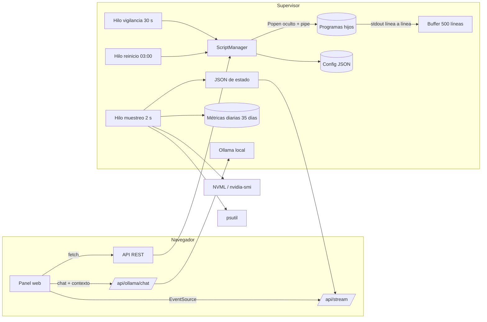

### Código
```python title="01 — Vigilancia: un proceso muerto pasa a 'caído' con pausa de 24 h; después se aplica el horario"
for script_id, script in list(self.scripts.items()):
    if script['status'] == 'running' and script_id in self.processes:
        process = self.processes[script_id]['process']
        if process.poll() is not None:
            now = datetime.now()
            script['status'] = 'crashed'
            script['pid'] = None
            script['last_error'] = f"Proceso terminó con código {process.poll()}"
            script['last_crash'] = now.isoformat()
            script['cooldown_until'] = (now + timedelta(hours=CRASH_COOLDOWN_HOURS)).isoformat()
            del self.processes[script_id]

    if script['enabled'] and script.get('auto_managed', True):
        should_be_running = is_script_in_schedule(script.get('schedule'))
        is_running = script['status'] == 'running'
        if should_be_running and not is_running:
            self.start_script(script_id, auto=True)   # respeta la pausa
        elif not should_be_running and is_running:
            self.stop_script(script_id, auto=True)
self.save_config()
```

```python title="02 — Parar de verdad en Windows: se termina todo el árbol de procesos y se remata lo que siga vivo"
parent = psutil.Process(process.pid)
children = parent.children(recursive=True)
for child in children:
    try:
        child.terminate()
    except Exception:
        pass
process.terminate()
gone, alive = psutil.wait_procs(children + [parent], timeout=2)
for p in alive:
    try:
        p.kill()
    except Exception:
        pass
if process.poll() is None:
    process.kill()
```

```python title="03 — Tiempo real sin multiplicar trabajo: el flujo SSE solo emite cuando el estado ha cambiado"
@app.route('/api/stream')
@login_required
def stream():
    def generate():
        last = None
        yield ': conectado\n\n'
        while True:
            with _broadcast_lock:
                current = _latest_broadcast
            if current != last:
                yield f"data: {current}\n\n"
                last = current
            time.sleep(1)
    response = Response(stream_with_context(generate()), mimetype='text/event-stream')
    response.headers['Cache-Control'] = 'no-cache'
    response.headers['X-Accel-Buffering'] = 'no'
    return response
```

```python title="04 — El asistente solo puede contestar con lo que ve en pantalla"
system_prompt = (
    "Eres el asistente integrado del supervisor de procesos. "
    "Responde en español, de forma breve, directa y práctica, "
    "basándote SOLO en el contexto que se te da a continuación sobre el estado actual del "
    "sistema y los scripts. Si te preguntan algo que no está en el contexto, dilo claramente "
    "en vez de inventarte datos.\n\n"
    f"CONTEXTO ACTUAL:\n{context or '(sin contexto adicional para esta pregunta)'}"
)
payload = {'model': model,
           'messages': [{'role': 'system', 'content': system_prompt}] + messages[-12:],
           'stream': True}
```

### Animación
```json animacion
{
  "duration": 12,
  "aspect": "16:9",
  "concept": { "es": "De un caos de ventanas negras a un panel que se cuida solo", "en": "From a chaos of black console windows to a panel that looks after itself" },
  "elements": [
    { "id": "consolas", "type": "ventana", "label": "30 consolas sueltas", "position": "centro" },
    { "id": "panel", "type": "ventana", "label": "Supervisor de procesos", "position": "centro" },
    { "id": "gauges", "type": "grafico", "label": "CPU · RAM · GPU", "position": "arriba" },
    { "id": "tabla", "type": "tabla", "label": "97 programas", "position": "izquierda" },
    { "id": "log", "type": "ventana", "label": "📜 Log en vivo", "position": "derecha-arriba" },
    { "id": "ia", "type": "chat", "label": "🤖 Asistente IA", "position": "derecha-abajo" },
    { "id": "reloj", "type": "icono", "label": "03:00", "position": "arriba-derecha" }
  ],
  "beats": [
    { "t": 0.4, "action": "decenas de ventanas negras de consola se amontonan y parpadean; una se cierra sola sin avisar" },
    { "t": 1.6, "action": "las ventanas se encogen y se ordenan en filas de una tabla limpia con puntos verdes latiendo" },
    { "t": 2.8, "action": "arriba se rellenan los anillos: CPU 34 %, RAM 61 %, GPU 12 % (datos de ejemplo); las líneas de las gráficas avanzan a la izquierda" },
    { "t": 4.0, "action": "una fila «Bot de alertas (ejemplo)» cambia a 🔴 Caído; aparece la etiqueta «Pausa 23 h 59 min»" },
    { "t": 5.2, "action": "se abre una pestaña de log con la última línea en rojo: «ConnectionResetError» (ejemplo)" },
    { "t": 6.4, "action": "en el chat se escribe «¿por qué se ha caído?» y la IA responde por streaming: «La conexión con la base de datos se cortó; reinícialo cuando vuelva»" },
    { "t": 7.8, "action": "se pulsa ⟳ Reiniciar: la pausa desaparece y el punto vuelve a verde; el contador de reinicios sube en 1" },
    { "t": 9.0, "action": "un reloj avanza a 03:00; todas las filas se apagan en cascada y se vuelven a encender de arriba abajo a intervalos de 1,5 s" },
    { "t": 10.5, "action": "se arrastra una fila a otra posición y se queda fija; aparece un aviso «Orden actualizado»" },
    { "t": 11.5, "action": "zoom out: el panel queda en calma con todas las filas en verde" }
  ],
  "sampleData": { "nota": "porcentajes, nombres de programa y errores inventados; 97 programas es el dato real" },
  "palette": "oscuro #05070a, ámbar #f2a93b (sistema), cian #5cc8d6 (datos), verde #52d18e (ok), rojo #ef5b4c (alerta)"
}
```
<!-- project:end -->

<!-- project:begin slug="panel-supervisores" -->
## Panel de supervisores

```json ficha
{
  "slug": "panel-supervisores",
  "name": "Panel de supervisores",
  "kind": "herramienta",
  "parent": "suite-infraestructura",
  "tools": [],
  "department": ["it"],
  "category": "infra",
  "lifecycle": "activo",
  "status": "produccion",
  "evolvedFrom": null,
  "tagline": { "es": "Las tres salas de máquinas en una sola pantalla", "en": "All three machine rooms on a single screen" },
  "summary": { "es": "Una página que muestra a la vez los paneles de control de las tres máquinas de la empresa, para no tener que ir abriendo pestañas.", "en": "A page that shows the control panels of the company's three machines at once, so you do not have to open tab after tab." },
  "problem": { "es": "Cada máquina tiene su propio supervisor; comprobar las tres obligaba a recordar tres direcciones y abrir tres pestañas.", "en": "Each machine has its own supervisor; checking all three meant remembering three addresses and opening three tabs." },
  "solution": { "es": "Una mini-aplicación web que incrusta los tres supervisores en marcos, con nombre y descripción de cada nodo.", "en": "A mini web app that embeds the three supervisors in frames, with each node's name and description." },
  "howItWorks": [
    { "title": { "es": "Lista de nodos", "en": "Node list" }, "text": { "es": "La configuración define nombre, descripción y dirección de cada supervisor.", "en": "The configuration defines each supervisor's name, description and address." } },
    { "title": { "es": "Plantilla", "en": "Template" }, "text": { "es": "La página recorre esa lista y pinta un marco por nodo.", "en": "The page loops over that list and renders one frame per node." } },
    { "title": { "es": "Uso", "en": "Use" }, "text": { "es": "Desde cada marco se puede iniciar sesión y operar el supervisor como si estuviera abierto aparte.", "en": "From each frame you can log in and operate the supervisor as if it were open on its own." } }
  ],
  "features": [
    { "es": "Vista simultánea de los tres supervisores", "en": "Simultaneous view of the three supervisors" },
    { "es": "Añadir un nodo nuevo es añadir una línea de configuración", "en": "Adding a new node is adding one configuration line" },
    { "es": "Accesible desde el portal interno de herramientas", "en": "Reachable from the internal tools portal" }
  ],
  "automations": [],
  "integrations": ["Supervisores de proceso de cada nodo"],
  "ai": { "used": false, "where": { "es": "", "en": "" }, "local": true, "models": [] },
  "users": { "es": "Responsable de sistemas", "en": "Systems lead" },
  "stack": ["python", "flask"],
  "stackOther": ["iframes", "Jinja2"],
  "metrics": [ { "label": { "es": "Nodos mostrados", "en": "Nodes shown" }, "value": "3", "real": true } ],
  "businessValue": { "es": "Reduce a un vistazo la comprobación diaria de toda la infraestructura.", "en": "Reduces the daily infrastructure check to a single glance." },
  "complexity": 1,
  "impressiveness": 3,
  "featured": false,
  "sensitivity": "baja",
  "visualLoop": { "es": "Tres miniaturas de paneles oscuros se colocan una al lado de otra y sus puntos de estado laten en verde a la vez.", "en": "Three dark panel thumbnails slide next to each other and their status dots pulse green together." },
  "notes": "Herramienta mínima (unas 40 líneas). Las direcciones de los nodos se han omitido."
}
```

### Qué es
Una página web muy sencilla que funciona como **«mural» de los tres supervisores de procesos**: el de la máquina de desarrollo, el de la granja de render y el del nodo de alarma y proxy inverso. Cada uno aparece en un marco con su nombre y una descripción.

### El problema que resuelve
El software de la empresa no vive en una sola máquina. Cada nodo tiene su propio supervisor y, sin este panel, comprobar el estado global era ir abriendo direcciones de una en una.

### Cómo se usa
1. Se abre el panel desde el portal interno de herramientas.
2. Se ven los tres supervisores a la vez.
3. Si alguno pide contraseña, se entra desde el propio marco. A partir de ahí se puede operar igual que en su pestaña.

### Qué hace solo
Nada por sí mismo: es una vista. La vigilancia activa de los tres nodos la hace el **detector de procesos caídos**.

### Cómo funciona por dentro
Flask sirve una plantilla Jinja que recibe una lista de diccionarios `{id, name, desc, url}` y genera un `<iframe>` por elemento. No guarda datos ni se conecta a nada más.

### Interfaz
Cabecera con el título del panel y una rejilla de tres marcos grandes, cada uno con su rótulo («Desarrollo», «Render», «Alarma / proxy»).

### Inteligencia artificial
No usa.

### Fiabilidad y seguridad
No duplica credenciales: cada supervisor mantiene su propio inicio de sesión dentro del marco.

### Qué aporta a una empresa
Un punto de entrada único a la operación de varias máquinas, sin tener que montar todavía un supervisor central.

### Retos técnicos resueltos
Ninguno complejo. Es una solución intencionadamente pequeña para un problema pequeño.

### Evolución
Es un paso intermedio. La evolución lógica es un supervisor central con agentes en cada máquina.

### Diagrama
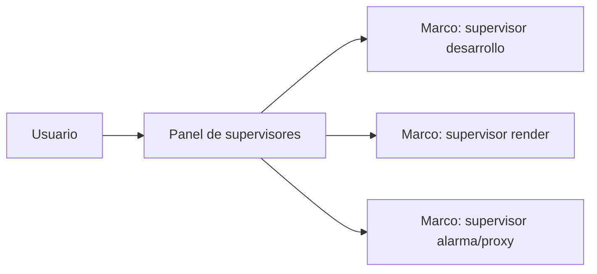

### Código
```python title="01 — Toda la configuración: una lista de nodos que la plantilla convierte en marcos"
LAUNCHERS = [
    {"id": "frame1", "name": "Supervisor Desarrollo", "desc": "Nodo de desarrollo", "url": os.environ["NODO_DESARROLLO_URL"]},
    {"id": "frame2", "name": "Supervisor Render",     "desc": "Granja de render",  "url": os.environ["NODO_RENDER_URL"]},
    {"id": "frame3", "name": "Supervisor Alarma",     "desc": "Alarma y proxy",    "url": os.environ["NODO_ALARMA_URL"]},
]

@app.route("/")
def index():
    return render_template("index.html", launchers=LAUNCHERS)
```

### Animación
```json animacion
{
  "duration": 6,
  "aspect": "16:9",
  "concept": { "es": "Tres pantallas se convierten en una", "en": "Three screens become one" },
  "elements": [
    { "id": "p1", "type": "ventana", "label": "Desarrollo", "position": "izquierda" },
    { "id": "p2", "type": "ventana", "label": "Render", "position": "centro" },
    { "id": "p3", "type": "ventana", "label": "Alarma", "position": "derecha" }
  ],
  "beats": [
    { "t": 0.5, "action": "tres pestañas de navegador sueltas flotan desordenadas" },
    { "t": 2.0, "action": "se alinean y encajan dentro de un único marco «Panel de supervisores»" },
    { "t": 3.5, "action": "los puntos de estado de las tres laten en verde a la vez" },
    { "t": 5.0, "action": "un cursor pasa por encima de los tres y aparece el texto «Un vistazo»" }
  ],
  "sampleData": { "nota": "sin datos" },
  "palette": "oscuro #05070a, ámbar #f2a93b, cian #5cc8d6, verde #52d18e, rojo #ef5b4c"
}
```
<!-- project:end -->

<!-- project:begin slug="detector-procesos-caidos" -->
## Detector de procesos caídos

```json ficha
{
  "slug": "detector-procesos-caidos",
  "name": "Detector de procesos caídos",
  "kind": "herramienta",
  "parent": "suite-infraestructura",
  "tools": [],
  "department": ["it"],
  "category": "infra",
  "lifecycle": "activo",
  "status": "produccion",
  "evolvedFrom": "Versiones previas que leían la página HTML de los supervisores; la actual consulta su API",
  "tagline": { "es": "El vigilante que vigila a los vigilantes", "en": "The watcher that watches the watchers" },
  "summary": { "es": "Cada 20 segundos entra en los paneles de las tres máquinas, mira qué programas se han caído y, solo cuando lo confirma tres veces seguidas, avisa por correo y por Discord. También avisa cuando vuelven, diciendo cuánto tiempo estuvieron caídos.", "en": "Every 20 seconds it logs into the panels of the three machines, checks which programs have crashed and, only once confirmed three times in a row, alerts by email and Discord. It also reports recoveries and how long the outage lasted." },
  "problem": { "es": "Un supervisor puede detectar que un programa ha muerto, pero no puede avisar si el que muere es él mismo o toda la máquina. Y avisar de cada parpadeo genera ruido que acaba ignorándose.", "en": "A supervisor can tell a program has died, but cannot alert if it is the one dying, or the whole machine. And alerting on every blip creates noise that ends up ignored." },
  "solution": { "es": "Un proceso independiente que hace login en cada supervisor, lee su API, mantiene un estado propio con contadores de fallos y agrupa los cambios en un único aviso por ciclo.", "en": "An independent process that logs into each supervisor, reads its API, keeps its own state with failure counters and groups changes into a single alert per cycle." },
  "howItWorks": [
    { "title": { "es": "Login y lectura", "en": "Login and read" }, "text": { "es": "Abre una sesión HTTP con cada supervisor y pide la lista de programas con su estado.", "en": "Opens an HTTP session with each supervisor and requests the list of programs and their state." } },
    { "title": { "es": "Clasificación", "en": "Classification" }, "text": { "es": "Cada programa se clasifica como «arriba», «caído» o «ignorar» (parado a propósito o en mantenimiento).", "en": "Each program is classified as 'up', 'down' or 'ignore' (deliberately stopped or in maintenance)." } },
    { "title": { "es": "Confirmación", "en": "Confirmation" }, "text": { "es": "Un programa (o un panel entero) solo pasa a caído tras tres lecturas malas consecutivas.", "en": "A program (or an entire panel) is only declared down after three consecutive bad readings." } },
    { "title": { "es": "Aviso agrupado", "en": "Grouped alert" }, "text": { "es": "Todas las caídas o recuperaciones del ciclo se envían en un solo correo HTML y un solo mensaje de Discord, agrupadas por máquina.", "en": "All outages or recoveries in a cycle go out as a single HTML email and a single Discord message, grouped by machine." } }
  ],
  "features": [
    { "es": "Vigila tres máquinas a la vez", "en": "Watches three machines at once" },
    { "es": "Triple confirmación antes de avisar", "en": "Triple confirmation before alerting" },
    { "es": "Distingue caída, parada intencionada y mantenimiento", "en": "Tells a crash from an intentional stop and from maintenance" },
    { "es": "Detecta también la caída del panel completo", "en": "Also detects the whole panel going down" },
    { "es": "Aviso de recuperación con duración de la caída", "en": "Recovery alert with outage duration" },
    { "es": "Correo HTML y mensaje de Discord troceado para respetar el límite de longitud", "en": "HTML email and a Discord message split to respect length limits" },
    { "es": "Estado persistente: sobrevive a sus propios reinicios", "en": "Persistent state: survives its own restarts" }
  ],
  "automations": [
    { "trigger": "cada 20 s", "action": { "es": "Revisa los tres supervisores", "en": "Checks the three supervisors" } },
    { "trigger": "3 fallos seguidos", "action": { "es": "Declara la caída y avisa por correo y Discord", "en": "Declares the outage and alerts via email and Discord" } },
    { "trigger": "primera lectura buena tras una caída", "action": { "es": "Avisa de la recuperación con las horas caídas", "en": "Reports the recovery with hours of downtime" } }
  ],
  "integrations": ["Supervisores de proceso (API)", "Correo Office 365", "Discord"],
  "ai": { "used": false, "where": { "es": "", "en": "" }, "local": true, "models": [] },
  "users": { "es": "Responsable de sistemas (recibe los avisos)", "en": "Systems lead (receives alerts)" },
  "stack": ["python", "rest", "email", "discord"],
  "stackOther": ["requests.Session", "JSON de estado con escritura atómica"],
  "metrics": [
    { "label": { "es": "Intervalo de comprobación", "en": "Check interval" }, "value": "20 s (3 por minuto)", "real": true },
    { "label": { "es": "Fallos para confirmar", "en": "Failures to confirm" }, "value": "3", "real": true },
    { "label": { "es": "Tiempo mínimo hasta el aviso", "en": "Minimum time to alert" }, "value": "≈ 1 minuto", "real": true }
  ],
  "businessValue": { "es": "Ninguna caída pasa desapercibida, ni siquiera la del propio sistema de vigilancia, y los avisos son tan fiables que nadie los ignora.", "en": "No outage goes unnoticed, not even of the monitoring system itself, and alerts are reliable enough that nobody ignores them." },
  "complexity": 5,
  "impressiveness": 6,
  "featured": false,
  "sensitivity": "baja",
  "visualLoop": { "es": "Un radar barre tres servidores; uno parpadea en rojo, un contador sube 1/3, 2/3, 3/3 y sale un sobre; luego vuelve a verde y llega «Recuperado tras 0,4 h».", "en": "A radar sweeps three servers; one blinks red, a counter climbs 1/3, 2/3, 3/3 and an envelope flies out; then it turns green and 'Recovered after 0.4 h' arrives." },
  "notes": "Credenciales de acceso a los paneles, canal de Discord y direcciones omitidos."
}
```

### Qué es
Un proceso de fondo que actúa como **monitor externo de los supervisores de procesos**. No arranca ni para nada: observa y avisa. Al estar fuera de los supervisores, puede detectar lo que estos no pueden contar: que el supervisor entero se ha caído, que una máquina no responde o que un programa lleva un rato en estado de caída.

### El problema que resuelve
- **Quién vigila al vigilante.** Si el supervisor de una máquina deja de responder, nadie lo dice.
- **Ruido.** Un programa puede aparecer como caído durante unos segundos mientras se reinicia. Avisar de eso cada vez llena la bandeja de correo de falsas alarmas y acaba en que nadie lee las verdaderas.
- **Contexto.** Saber que algo cayó no basta: hay que saber cuándo, en qué máquina y cuánto tiempo estuvo así.

### Cómo se usa
No tiene interfaz. El responsable de sistemas solo recibe:
- un correo HTML con el asunto «🚨 CAÍDAS CONFIRMADAS (triple check) | panel=X | scripts=Y» y una tabla por máquina;
- el mismo resumen en un canal de Discord;
- y, cuando se resuelve, un «✅ RECUPERACIONES» con cuántas horas estuvo caído cada elemento.

### Qué hace solo
Cada 20 segundos, para cada una de las tres máquinas:
1. Crea una sesión HTTP e inicia sesión en el supervisor.
2. Si el login o la API fallan, suma un fallo **al panel**. Al tercero, declara el panel caído.
3. Si responde, recorre los programas y decide para cada uno:
   - **ignorar** si está deshabilitado (mantenimiento) o parado a propósito;
   - **arriba** si está en marcha;
   - **caído** si el supervisor lo marca como caído.
4. Para los caídos lleva un contador; al llegar a tres, genera un evento de caída con la hora.
5. Para los que vuelven a estar arriba después de una caída, genera un evento de recuperación con la duración.
6. Al final del ciclo, si hay eventos, monta un solo aviso y lo manda por los dos canales.

### Cómo funciona por dentro
- **Clave de estado:** `máquina::id::nombre`, para que dos programas con el mismo nombre en máquinas distintas no se mezclen.
- **Estado en disco:** un JSON con `panel_status`, `panel_consecutive_failures` y `panel_down_since` por máquina, más un diccionario con el estado de cada programa. Se escribe de forma atómica (fichero temporal y renombrado) tras revisar cada máquina.
- **Decisión tolerante:** el estado se interpreta tanto por el valor bruto de la API como por el texto y el color que el supervisor asocia a cada estado. Así sigue funcionando aunque cambie la presentación.
- **Mensajes largos:** Discord limita la longitud de cada mensaje, así que el resumen se trocea en bloques y se envía por partes.
- **Logs de diagnóstico:** cada ciclo registra cuántos programas devolvió la API, las tres primeras filas en bruto y cada decisión. Sirve para depurar cambios de formato.

### Interfaz
No tiene pantalla. Las «pantallas» son el correo HTML (tarjetas rojas para caídas y verdes para recuperaciones, agrupadas por máquina) y el mensaje de Discord con viñetas por máquina.

### Inteligencia artificial
No usa. Es deliberadamente determinista: un sistema de alertas no debe depender de un modelo.

### Fiabilidad y seguridad
- La triple confirmación elimina casi todos los falsos positivos de reinicios normales.
- Los programas parados a propósito no generan alertas.
- El propio detector está registrado en el supervisor, de modo que si cae, el supervisor lo resucita, y viceversa.
- Las credenciales de acceso al panel no se exponen en los avisos.

### Qué aporta a una empresa
Cubre el hueco clásico de los sistemas de vigilancia caseros: **avisar cuando el que vigila también se cae**. Y lo hace sin generar ruido, que es lo que hace que una alerta se tome en serio.

### Retos técnicos resueltos
- **Distinguir caída de parada.** El supervisor usa estados distintos para cada caso y el detector los trata de forma diferente.
- **Recuperaciones con duración.** Se guarda `down_since` en el estado persistente y se resta al recuperarse, aunque el detector se haya reiniciado entre medias.
- **Un aviso por ciclo.** Los eventos se acumulan y se mandan juntos: si caen diez programas porque una máquina se ha reiniciado, llega un correo y no diez.

### Evolución
Las primeras versiones leían el HTML del panel con técnicas de scraping. La versión actual (4.x) consulta directamente la API JSON del supervisor, incluye la triple comprobación, los correos HTML y los logs de diagnóstico.

### Diagrama
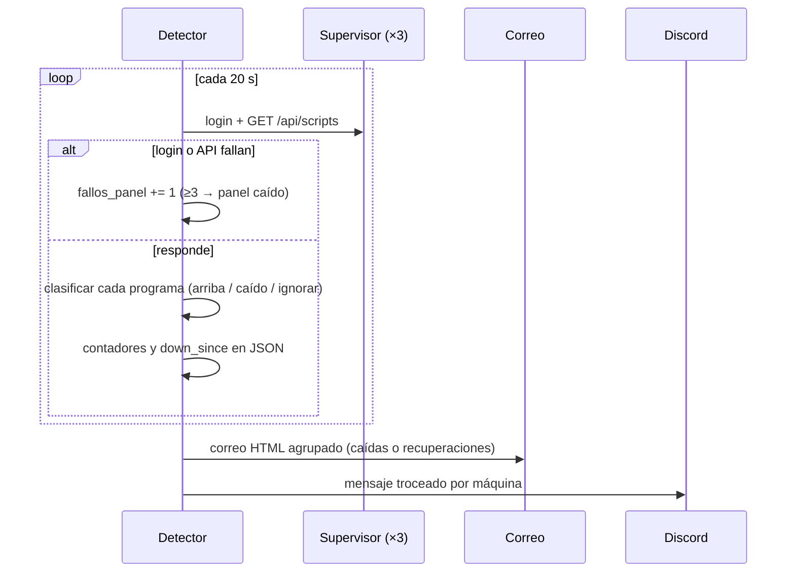

### Código
```python title="01 — Clasificación tolerante: mantenimiento y paradas intencionadas no son caídas"
def decide_status(script):
    if not script.get("enabled", True):
        return "ignore"                       # en mantenimiento
    text = script.get("status_text", "").lower()
    css = script.get("status_class", "").lower()
    raw = script.get("raw_status", "").lower()
    if "mant" in text or "maintenance" in css:
        return "ignore"
    if raw == "running" or "running" in css or "🟢" in text:
        return "up"
    if raw == "crashed" or "crashed" in css or "🔴" in text:
        return "down"
    if raw == "stopped" or "stopped" in css or "⏸️" in text:
        return "ignore"                       # parado a propósito
    return None
```

### Animación
```json animacion
{
  "duration": 6,
  "aspect": "16:9",
  "concept": { "es": "Solo avisa cuando está seguro", "en": "It only alerts when it is sure" },
  "elements": [
    { "id": "radar", "type": "icono", "label": "Detector", "position": "centro" },
    { "id": "srvs", "type": "servidor", "label": "3 máquinas", "position": "derecha" },
    { "id": "correo", "type": "correo", "label": "🚨 CAÍDAS CONFIRMADAS", "position": "abajo" }
  ],
  "beats": [
    { "t": 0.5, "action": "un radar cian gira y cada vuelta ilumina tres servidores" },
    { "t": 1.8, "action": "un programa del segundo servidor parpadea en rojo; aparece «1/3», luego «2/3», luego «3/3»" },
    { "t": 3.4, "action": "sale un sobre rojo con «🚨 CAÍDAS CONFIRMADAS · scripts=1» y un mensaje de Discord a la vez" },
    { "t": 4.8, "action": "el programa vuelve a verde y sale un sobre verde «✅ Recuperado tras 0,4 h» (ejemplo)" }
  ],
  "sampleData": { "nota": "nombres y duraciones inventados" },
  "palette": "oscuro #05070a, ámbar #f2a93b, cian #5cc8d6, verde #52d18e, rojo #ef5b4c"
}
```
<!-- project:end -->

<!-- project:begin slug="copias-seguridad-mensajeria" -->
## Copias de seguridad cifradas a la nube de mensajería

```json ficha
{
  "slug": "copias-seguridad-mensajeria",
  "name": "Copias de seguridad cifradas a la nube de mensajería",
  "kind": "herramienta",
  "parent": "suite-infraestructura",
  "tools": [],
  "department": ["it"],
  "category": "infra",
  "lifecycle": "activo",
  "status": "produccion",
  "evolvedFrom": null,
  "tagline": { "es": "Cada noche, todo el trabajo de cada máquina cifrado y a salvo fuera de la oficina", "en": "Every night, each machine's work encrypted and safe off-site" },
  "summary": { "es": "A las 04:30 comprime con contraseña la carpeta de trabajo de la máquina, la trocea en partes y la sube a un canal privado de Telegram. Si se corta internet a mitad, retoma desde la última parte subida.", "en": "At 04:30 it compresses the machine's work folder with a password, splits it into parts and uploads them to a private Telegram channel. If the connection drops halfway, it resumes from the last uploaded part." },
  "problem": { "es": "El código y los datos de más de cien automatizaciones vivían en el disco de un servidor; un fallo de disco o un ransomware significaba perderlo todo.", "en": "The code and data of over a hundred automations lived on one server's disk; a disk failure or ransomware meant losing everything." },
  "solution": { "es": "Copia diaria automática, cifrada con AES-256, troceada en partes de 45 MB y almacenada fuera de la empresa en un canal privado con temas por máquina, con panel web para lanzarla a mano y ver su estado.", "en": "Automatic daily backup, AES-256 encrypted, split into 45 MB parts and stored off-site in a private channel with one topic per machine, with a web panel to trigger it manually and check its status." },
  "howItWorks": [
    { "title": { "es": "Recorrido", "en": "Scan" }, "text": { "es": "Recorre la carpeta de trabajo, comprueba qué ficheros se pueden leer y apunta los bloqueados.", "en": "Walks the work folder, checks which files are readable and lists the locked ones." } },
    { "title": { "es": "Compresión cifrada", "en": "Encrypted compression" }, "text": { "es": "Crea un archivo 7z cifrado con nombre de máquina y fecha.", "en": "Creates an encrypted 7z archive named after the machine and date." } },
    { "title": { "es": "Troceado", "en": "Splitting" }, "text": { "es": "Si pasa de 45 MB, lo divide en partes numeradas .part001, .part002…", "en": "If larger than 45 MB, splits it into numbered parts .part001, .part002…" } },
    { "title": { "es": "Subida con reanudación", "en": "Resumable upload" }, "text": { "es": "Sube cada parte, guarda el identificador del mensaje confirmado y, si algo falla, reintenta con espera creciente sin repetir lo ya subido.", "en": "Uploads each part, stores the confirmed message ID and, on failure, retries with growing backoff without re-uploading what is done." } }
  ],
  "features": [
    { "es": "Programado a diario a las 04:30", "en": "Scheduled daily at 04:30" },
    { "es": "Cifrado AES-256 en el propio archivo comprimido", "en": "AES-256 encryption inside the archive itself" },
    { "es": "Partes de 45 MB para respetar el límite de la API", "en": "45 MB parts to stay within the API limit" },
    { "es": "Reintentos infinitos con backoff exponencial (5 s → 5 min)", "en": "Infinite retries with exponential backoff (5 s → 5 min)" },
    { "es": "Reanudación por partes tras un corte", "en": "Part-level resume after an interruption" },
    { "es": "Respeta los avisos de límite de peticiones de la API", "en": "Honours the API's rate-limit responses" },
    { "es": "Registro de ficheros omitidos por estar bloqueados", "en": "Log of files skipped because they were locked" },
    { "es": "Panel web con login para lanzar una copia manual y ver la última", "en": "Web panel with login to trigger a manual backup and see the last one" },
    { "es": "Mismo programa desplegado en las tres máquinas, cada una en su tema", "en": "Same program deployed on all three machines, each in its own topic" }
  ],
  "automations": [
    { "trigger": "a las 04:30", "action": { "es": "Copia completa, cifrada, troceada y subida", "en": "Full backup, encrypted, split and uploaded" } },
    { "trigger": "manual", "action": { "es": "Botón «Ejecutar backup» en el panel", "en": "'Run backup' button on the panel" } }
  ],
  "integrations": ["Telegram (canal privado con temas)"],
  "ai": { "used": false, "where": { "es": "", "en": "" }, "local": true, "models": [] },
  "users": { "es": "Responsable de sistemas", "en": "Systems lead" },
  "stack": ["python", "flask", "telegram", "windows"],
  "stackOther": ["py7zr", "python-telegram-bot", "schedule", "asyncio"],
  "metrics": [
    { "label": { "es": "Frecuencia", "en": "Frequency" }, "value": "diaria, 04:30", "real": true },
    { "label": { "es": "Tamaño de parte", "en": "Part size" }, "value": "45 MB", "real": true },
    { "label": { "es": "Máquinas cubiertas", "en": "Machines covered" }, "value": "3", "real": true },
    { "label": { "es": "Espera máxima entre reintentos", "en": "Max retry backoff" }, "value": "300 s", "real": true }
  ],
  "businessValue": { "es": "Una copia externa, cifrada y diaria por coste prácticamente cero, que se completa sola aunque la conexión sea inestable.", "en": "A daily, encrypted, off-site backup at virtually zero cost that completes on its own even over an unstable connection." },
  "complexity": 5,
  "impressiveness": 6,
  "featured": false,
  "sensitivity": "media",
  "visualLoop": { "es": "Una carpeta se comprime en un cubo con candado, se corta en láminas numeradas y cada lámina vuela a la nube; una se cae, espera y vuelve a intentarlo hasta entrar.", "en": "A folder compresses into a padlocked cube, gets sliced into numbered sheets and each flies to the cloud; one drops, waits and retries until it gets in." },
  "notes": "Contraseña de cifrado, token del bot, identificador del canal y rutas omitidos. Se recomienda complementarla con una segunda copia en otro soporte."
}
```

### Qué es
Un servicio de copias de seguridad hecho a medida que usa un **canal privado de Telegram como almacenamiento externo**. Cada máquina tiene una copia del programa y sube su copia a un tema distinto del mismo canal, con etiquetas `#backup #<máquina> #<fecha>`, de modo que es fácil encontrar la copia de cualquier día.

### El problema que resuelve
Todo el trabajo (código, configuraciones, JSON de estado, plantillas, informes) estaba en el disco de cada servidor. Sin copia externa, un disco roto o un cifrado malicioso habría borrado años de automatizaciones. Las soluciones comerciales costaban dinero y había que mantenerlas; esta funciona sola y no cuesta nada.

### Cómo se usa
1. Normalmente, no hay que hacer nada: corre cada noche.
2. Si se quiere una copia en el momento, se entra al panel web con contraseña y se pulsa «Ejecutar backup».
3. El panel muestra la última copia: fecha, tipo (manual o automática), estado (en curso, correcta o con error) y número de ficheros omitidos.
4. Para restaurar se descargan las partes del canal, se unen y se descomprime el archivo con la contraseña.

### Qué hace solo
A las 04:30, cuando nadie trabaja y casi no hay ficheros abiertos:
1. Recorre la carpeta de trabajo saltándose las ocultas.
2. Prueba a abrir cada fichero. Los que están bloqueados por otro proceso se apuntan como omitidos y se guardan en un log local.
3. Comprime todo en un `.7z` **cifrado**.
4. Si el archivo pesa más de 45 MB, lo parte en trozos y borra el original.
5. Sube las partes en orden, con una pausa de 3 segundos entre ellas. La primera lleva un mensaje con la máquina, la fecha, el tipo, el número de partes y si hubo ficheros omitidos.
6. Al terminar borra los temporales y limpia el estado de reanudación.

### Cómo funciona por dentro
- **Cerrojo de ejecución:** una variable protegida por `Lock` impide que una copia manual y una programada se pisen.
- **Estado de reanudación:** un JSON guarda, por sesión de copia, qué partes ya están confirmadas y con qué identificador de mensaje. Si el proceso se reinicia a mitad, las partes ya subidas se saltan.
- **Reintentos:** cada parte se reintenta indefinidamente. Si la API pide esperar, se respeta ese tiempo más un margen. Si es un error de red o un tiempo agotado, se espera `5 s × 2^(intento-1)` con un máximo de 5 minutos.
- **Doble límite de tiempo:** la llamada de envío tiene sus propios tiempos de lectura y escritura y, además, va envuelta en `asyncio.wait_for` para que nunca se quede colgada.
- **Planificador:** la librería `schedule` dispara la copia a la hora fijada desde un hilo, mientras Flask sirve el panel.

### Interfaz
Una pantalla de acceso y un panel con la tarjeta de la última copia, el botón de copia manual, el botón de salir y un estado en JSON consultable. Estilo oscuro sencillo con un indicador giratorio mientras hay una copia en curso.

### Inteligencia artificial
No usa.

### Fiabilidad y seguridad
- El cifrado se aplica **antes** de que los datos salgan de la máquina.
- El canal es privado y cada máquina escribe en su propio tema.
- Una copia solo se da por buena cuando la API devuelve el identificador de mensaje de cada parte.
- Los ficheros que no se han podido copiar quedan documentados, sin abortar la copia entera.

### Qué aporta a una empresa
Cumple la regla básica de tener una copia fuera del edificio, cifrada y diaria, sin contratar un servicio ni depender de que alguien se acuerde.

### Retos técnicos resueltos
- **Límite de tamaño por fichero** de la API: resuelto troceando.
- **Conexiones inestables y subidas de horas:** resuelto con reanudación por partes y reintentos con backoff.
- **Ficheros en uso en Windows:** resuelto probando a abrirlos antes y apuntando los bloqueados, en lugar de que la compresión falle a mitad.

### Evolución
Empezó como copia de una sola máquina y se desplegó después en las tres, cada una con su nombre de nodo y su tema en el canal. Pendiente: una política de retención automática y una prueba periódica de restauración.

### Diagrama
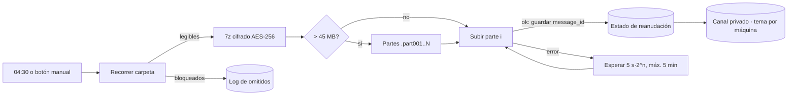

### Código
```python title="01 — Cada parte se reintenta hasta que la API confirma el mensaje, con espera creciente"
while True:
    intento += 1
    try:
        with open(archivo, "rb") as f:
            mensaje = await asyncio.wait_for(
                bot.send_document(chat_id=os.environ["BACKUP_CHAT"], document=f,
                                  caption=caption_parte, message_thread_id=TOPIC_ID,
                                  read_timeout=120, write_timeout=120, connect_timeout=30),
                timeout=150)
        if mensaje and mensaje.message_id:
            return mensaje.message_id
        raise Exception("La API no devolvió message_id válido")
    except RetryAfter as e:
        await asyncio.sleep(int(e.retry_after) + 5)        # la API pide esperar
    except (TimedOut, NetworkError, asyncio.TimeoutError, Exception):
        await asyncio.sleep(min(5 * 2 ** (intento - 1), 300))  # 5 s → 5 min
```

### Animación
```json animacion
{
  "duration": 6,
  "aspect": "16:9",
  "concept": { "es": "Una caja fuerte que viaja por partes", "en": "A safe that travels in pieces" },
  "elements": [
    { "id": "carpeta", "type": "archivo", "label": "Trabajo de la máquina", "position": "izquierda" },
    { "id": "cubo", "type": "icono", "label": "7z 🔒 AES-256", "position": "centro" },
    { "id": "nube", "type": "chat", "label": "Canal privado · #backup", "position": "derecha" }
  ],
  "beats": [
    { "t": 0.5, "action": "un reloj marca 04:30 y la carpeta se comprime en un cubo con candado" },
    { "t": 1.8, "action": "el cubo se corta en cinco láminas .part001…005 (ejemplo)" },
    { "t": 3.0, "action": "las láminas vuelan al canal; la 3 rebota con «⚠️ red», espera 10 s y vuelve a intentarlo" },
    { "t": 4.6, "action": "las cinco quedan apiladas en el canal con ✅ y la etiqueta «#backup #nodo #fecha»" }
  ],
  "sampleData": { "nota": "número de partes y error inventados" },
  "palette": "oscuro #05070a, ámbar #f2a93b, cian #5cc8d6, verde #52d18e, rojo #ef5b4c"
}
```
<!-- project:end -->

<!-- project:begin slug="vigilante-termico-cpd" -->
## Vigilante térmico de la sala de servidores

```json ficha
{
  "slug": "vigilante-termico-cpd",
  "name": "Vigilante térmico de la sala de servidores",
  "kind": "herramienta",
  "parent": "suite-infraestructura",
  "tools": [],
  "department": ["it"],
  "category": "infra",
  "lifecycle": "activo",
  "status": "produccion",
  "evolvedFrom": null,
  "tagline": { "es": "La temperatura de la sala de servidores, minuto a minuto, en un canal de chat", "en": "The server room's temperature, minute by minute, in a chat channel" },
  "summary": { "es": "Un bot de Discord que lee los sensores de temperatura del pasillo frío y del pasillo caliente de la sala de servidores, publica cada cambio y, con un comando, dibuja gráficas de todas las alertas de temperatura de las GPU en el periodo que elijas.", "en": "A Discord bot that reads the cold-aisle and hot-aisle temperature sensors of the server room, posts every change and, on command, plots every GPU temperature alert in the period you choose." },
  "problem": { "es": "Una subida de temperatura en una sala con muchas GPU puede degradar o apagar las máquinas; los datos existían en la domótica, pero nadie los miraba ni había forma rápida de ver su historial.", "en": "A temperature rise in a room full of GPUs can degrade or shut down machines; the data existed in the home-automation system, but nobody looked at it and there was no quick way to see its history." },
  "solution": { "es": "Llevar la telemetría al canal donde el equipo ya trabaja y añadir comandos que convierten el historial en máximas por hora y en gráficas por máquina y GPU.", "en": "Bring the telemetry into the channel where the team already works and add commands that turn the history into hourly maxima and per-machine, per-GPU charts." },
  "howItWorks": [
    { "title": { "es": "Lectura", "en": "Reading" }, "text": { "es": "Cada minuto pide a la domótica el estado de los dos sensores y publica el valor si ha cambiado.", "en": "Every minute it asks the home-automation system for both sensors and posts the value if it changed." } },
    { "title": { "es": "!maxima", "en": "!maxima" }, "text": { "es": "Descarga el historial desde el lunes y devuelve la máxima de cada hora.", "en": "Downloads the history since Monday and returns each hour's maximum." } },
    { "title": { "es": "!alertas", "en": "!alertas" }, "text": { "es": "Un menú desplegable (última hora, 24 h, semana o rango personalizado) lee el canal de alertas y genera una gráfica por máquina con cada GPU.", "en": "A dropdown (last hour, 24 h, week or custom range) reads the alert channel and draws a chart per machine with each GPU." } }
  ],
  "features": [
    { "es": "Lectura de sensores cada minuto, publicando solo cambios", "en": "Sensor reading every minute, posting only changes" },
    { "es": "Comando de máximas por hora desde el lunes", "en": "Hourly-maximum command since Monday" },
    { "es": "Menú interactivo de intervalos con ventana de rango personalizado", "en": "Interactive interval menu with a custom-range dialog" },
    { "es": "Extrae lecturas de GPU de los mensajes de alerta con expresiones regulares", "en": "Extracts GPU readings from alert messages with regular expressions" },
    { "es": "Gráficas con pandas y matplotlib enviadas como imagen", "en": "Charts with pandas and matplotlib sent as images" },
    { "es": "Informe semanal de alertas", "en": "Weekly alert report" }
  ],
  "automations": [
    { "trigger": "cada minuto", "action": { "es": "Publica las lecturas nuevas de los sensores", "en": "Posts new sensor readings" } },
    { "trigger": "lunes a las 08:00", "action": { "es": "Resumen semanal de alertas con gráficas", "en": "Weekly alert summary with charts" } }
  ],
  "integrations": ["Home Assistant (API REST)", "Discord"],
  "ai": { "used": false, "where": { "es": "", "en": "" }, "local": true, "models": [] },
  "users": { "es": "Equipo de sistemas", "en": "Systems team" },
  "stack": ["python", "discord", "apis", "rest"],
  "stackOther": ["discord.py (vistas, selects y modales)", "pandas", "matplotlib"],
  "metrics": [
    { "label": { "es": "Sensores vigilados", "en": "Monitored sensors" }, "value": "2 (pasillo frío y pasillo caliente)", "real": true },
    { "label": { "es": "Frecuencia de lectura", "en": "Reading frequency" }, "value": "1 min", "real": true }
  ],
  "businessValue": { "es": "Prevenir paradas y averías de hardware caro detectando antes los problemas de climatización, y tener evidencia histórica para hablar con el técnico de climatización.", "en": "Prevent downtime and expensive hardware damage by spotting cooling problems early, and keep historical evidence for the HVAC technician." },
  "complexity": 4,
  "impressiveness": 5,
  "featured": false,
  "sensitivity": "baja",
  "visualLoop": { "es": "Un termómetro sube de 23 a 27 °C, se publica un mensaje en el chat y, al escribir !alertas, aparece una gráfica de líneas por GPU.", "en": "A thermometer climbs from 23 to 27 °C, a chat message is posted and, after typing !alertas, a line chart per GPU appears." },
  "notes": "El informe semanal depende de que la tarea de 24 h coincida con las 08:00; queda como mejora pasarlo a un disparo por hora exacta. Dirección de la domótica, token y canales omitidos."
}
```

### Qué es
Un bot de Discord que hace de **puente entre la domótica de la sala de servidores y el chat del equipo**. Lee dos sensores, el del pasillo frío (aire que entra a los equipos) y el del pasillo caliente (aire que sale), y además sabe interpretar las alertas de temperatura de GPU que otros sistemas publican en un canal.

### El problema que resuelve
En una sala con muchas GPU trabajando a la vez, un fallo de climatización se traduce en minutos en temperaturas peligrosas. La domótica ya medía, pero:
- nadie miraba su panel;
- ver qué pasó «el martes por la tarde» exigía navegar por historiales;
- las alertas de GPU estaban dispersas en cientos de mensajes de un canal.

### Cómo se usa
- **Mirar el canal de logs:** cada vez que un sensor cambia aparece «🕒 fecha — sensor → 24,1 °C».
- **Escribir `!maxima`:** el bot devuelve, para cada sensor, la temperatura máxima de cada hora desde el lunes.
- **Escribir `!alertas`:** aparece un desplegable con «Última hora», «Últimas 24 h», «Esta semana» y «Personalizado». Con la última opción se abre una ventana para escribir el inicio y el fin. El bot informa de cuántos mensajes ha leído y cuántas alertas ha encontrado, y publica una gráfica por máquina con una línea por GPU.

### Qué hace solo
- Cada minuto, lectura de los dos sensores. Solo publica si la marca de «último cambio» es distinta de la anterior, para no repetir valores.
- Los lunes, un informe semanal de alertas con sus gráficas.

### Cómo funciona por dentro
1. **Domótica:** dos llamadas REST, `/api/states/<sensor>` para el valor actual y `/api/history/period` para el historial con filtros por entidad.
2. **Historial de alertas:** se descarga **todo** el canal de alertas a un JSON temporal, incluido el texto de los mensajes y los títulos, descripciones y campos de los *embeds*. Después se parte el texto por el marcador «🚨 ALERTA DE TEMPERATURA ALTA 🚨» y de cada bloque se extraen la máquina, la hora y las líneas «🔥 GPU n: xx °C». Se filtran por rango y se borra el JSON.
3. **Gráficas:** los datos se pasan a un `DataFrame`, se pivotan por hora y GPU y se dibuja una figura por máquina, que se envía como PNG desde memoria, sin tocar el disco.

### Interfaz
Todo ocurre dentro de Discord: mensajes de texto, un menú desplegable, una ventana emergente con dos campos de fecha e imágenes de gráficas.

### Inteligencia artificial
No usa.

### Fiabilidad y seguridad
- Si la domótica responde «no autorizado», el bot no inunda el canal con errores: deja de intentarlo en ese ciclo.
- El volcado del canal es temporal y se borra después de usarlo.

### Qué aporta a una empresa
Telemetría de infraestructura crítica integrada en la herramienta de comunicación diaria, con análisis histórico instantáneo y sin comprar ninguna plataforma de monitorización.

### Retos técnicos resueltos
- **Alertas sin formato estructurado:** se reconstruyen a partir de texto libre y de *embeds* con expresiones regulares tolerantes.
- **Interfaz rica dentro del chat:** se usan componentes nativos de Discord (vista, desplegable y modal) en lugar de comandos con parámetros difíciles de recordar.

### Evolución
Siguientes pasos: umbrales propios con aviso al móvil, guardar las lecturas en una base de datos de series temporales y mover el informe semanal a un disparador exacto.

### Diagrama
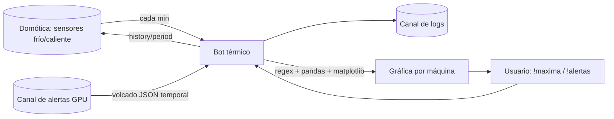

### Código
```python title="01 — De texto libre a datos: extraer máquina, hora y temperatura de cada GPU de una alerta"
def parse_alert_block(txt: str) -> dict:
    machine, atime, readings = None, None, []
    for line in txt.splitlines():
        l = line.strip()
        if l.lower().startswith("máquina:"):
            machine = l.split(":", 1)[1].strip()
        elif l.lower().startswith("hora:"):
            try:
                atime = datetime.fromisoformat(l.split(":", 1)[1].strip())
            except ValueError:
                pass
        elif l.startswith("🔥"):
            m = re.match(r"🔥\s*GPU\s*(\d+):\s*([\d.]+)°C", l)
            if m:
                readings.append((int(m.group(1)), float(m.group(2))))
    return {"machine": machine, "time": atime, "readings": readings}
```

### Animación
```json animacion
{
  "duration": 6,
  "aspect": "16:9",
  "concept": { "es": "La sala de servidores te habla por el chat", "en": "The server room talks to you in chat" },
  "elements": [
    { "id": "termo", "type": "icono", "label": "Pasillo caliente", "position": "izquierda" },
    { "id": "chat", "type": "chat", "label": "#temperatura", "position": "centro" },
    { "id": "graf", "type": "grafico", "label": "GPU 0-3", "position": "derecha" }
  ],
  "beats": [
    { "t": 0.5, "action": "el termómetro sube de 23,4 a 27,8 °C (ejemplo) y se tiñe de ámbar" },
    { "t": 1.8, "action": "en el chat aparece «🕒 14:05 — pasillo caliente → 27,8 °C»" },
    { "t": 3.0, "action": "alguien escribe «!alertas» y se despliega un menú; se elige «Últimas 24 h»" },
    { "t": 4.4, "action": "«Mensajes escaneados: 1.240, alertas: 6» y aparece una gráfica con cuatro líneas de colores, una por GPU" }
  ],
  "sampleData": { "nota": "temperaturas y recuentos inventados" },
  "palette": "oscuro #05070a, ámbar #f2a93b, cian #5cc8d6, verde #52d18e, rojo #ef5b4c"
}
```
<!-- project:end -->

<!-- project:begin slug="aviso-camaras-caidas" -->
## Aviso de cámaras caídas

```json ficha
{
  "slug": "aviso-camaras-caidas",
  "name": "Aviso de cámaras caídas",
  "kind": "herramienta",
  "parent": "suite-infraestructura",
  "tools": [],
  "department": ["it", "direccion"],
  "category": "seguridad",
  "lifecycle": "activo",
  "status": "produccion",
  "evolvedFrom": null,
  "tagline": { "es": "Si una cámara de seguridad se apaga, te enteras en el momento; y cuando vuelve, también", "en": "If a security camera goes dark you know instantly, and when it comes back, too" },
  "summary": { "es": "Un bot que vigila los canales de estado de las cámaras, cada uno con un nombre que dice si la cámara está activa o caída. Cuando una cae, manda un correo; cuando se recupera, otro. Recuerda el último estado para no repetir avisos aunque se reinicie.", "en": "A bot that watches the camera status channels, each named to show whether the camera is up or down. When one goes down it emails; when it recovers, it emails again. It remembers the last state so it never repeats alerts, even after a restart." },
  "problem": { "es": "El estado de cada cámara ya se mostraba en el nombre de un canal de chat, pero nadie mira canales todo el día: una cámara podía estar caída días sin que se supiera.", "en": "Each camera's status was already shown in a chat channel name, but nobody watches channels all day: a camera could stay down for days unnoticed." },
  "solution": { "es": "Interpretar esos nombres, guardar el último estado conocido y convertir solo los cambios reales en correos a los responsables.", "en": "Parse those names, store the last known state and turn only real state changes into emails to the people in charge." },
  "howItWorks": [
    { "title": { "es": "Eventos en tiempo real", "en": "Real-time events" }, "text": { "es": "Cuando se renombra, crea o borra un canal de la categoría de cámaras, el bot lo procesa al instante.", "en": "When a channel in the camera category is renamed, created or deleted, the bot handles it instantly." } },
    { "title": { "es": "Revisión de refuerzo", "en": "Safety-net sweep" }, "text": { "es": "Además, cada 2 minutos repasa toda la categoría por si se perdió algún evento.", "en": "In addition, every 2 minutes it sweeps the whole category in case an event was missed." } },
    { "title": { "es": "Interpretación", "en": "Parsing" }, "text": { "es": "«Entrada 3d 21h20m» significa activa; «Entrada DOWN», caída.", "en": "'Entrance 3d 21h20m' means up; 'Entrance DOWN' means down." } },
    { "title": { "es": "Aviso", "en": "Alert" }, "text": { "es": "Solo si el estado cambia respecto al guardado se envía correo de caída o de recuperación.", "en": "Only if the state differs from the stored one is a down or recovery email sent." } }
  ],
  "features": [
    { "es": "Detección instantánea por eventos y revisión periódica de seguridad", "en": "Instant event-driven detection plus a periodic safety sweep" },
    { "es": "Estado persistente con escritura atómica", "en": "Persistent state with atomic writes" },
    { "es": "Sin avisos duplicados tras reinicios", "en": "No duplicate alerts after restarts" },
    { "es": "Primer arranque silencioso: guarda la línea base sin avisar", "en": "Silent first start: stores the baseline without alerting" },
    { "es": "Log rotativo de 5 MB × 5", "en": "Rotating 5 MB × 5 log" },
    { "es": "Configuración externa en JSON", "en": "External JSON configuration" }
  ],
  "automations": [
    { "trigger": "al renombrarse un canal de cámara", "action": { "es": "Evalúa el cambio y avisa si procede", "en": "Evaluates the change and alerts if needed" } },
    { "trigger": "cada 2 min", "action": { "es": "Revisa todas las cámaras", "en": "Sweeps all cameras" } }
  ],
  "integrations": ["Discord", "Correo Office 365"],
  "ai": { "used": false, "where": { "es": "", "en": "" }, "local": true, "models": [] },
  "users": { "es": "Responsables de instalaciones y dirección", "en": "Facilities managers and management" },
  "stack": ["python", "discord", "email", "cctv"],
  "stackOther": ["discord.py", "asyncio.to_thread", "RotatingFileHandler"],
  "metrics": [
    { "label": { "es": "Revisión de refuerzo", "en": "Safety sweep" }, "value": "cada 120 s", "real": true },
    { "label": { "es": "Tipos de aviso", "en": "Alert types" }, "value": "2 (caída y recuperación)", "real": true }
  ],
  "businessValue": { "es": "La seguridad física deja de depender de que alguien mire una pantalla: cualquier cámara apagada genera un aviso con hora exacta.", "en": "Physical security no longer depends on someone watching a screen: any camera going dark triggers an alert with the exact time." },
  "complexity": 4,
  "impressiveness": 5,
  "featured": false,
  "sensitivity": "media",
  "visualLoop": { "es": "Una cuadrícula de cámaras en verde; una pasa a «DOWN», sale un sobre rojo; minutos después vuelve con un contador de actividad y sale un sobre verde.", "en": "A grid of green cameras; one switches to 'DOWN' and a red envelope flies out; minutes later it returns with an uptime counter and a green envelope follows." },
  "notes": "Número de cámaras, ubicaciones, remitente, destinatarios y canales omitidos. Se ha descrito de forma genérica para no revelar la instalación de seguridad."
}
```

### Qué es
Un bot que convierte un **panel visual pasivo**, unos canales de chat cuyos nombres reflejan el estado de cada cámara, en un **sistema de avisos activo por correo**.

### El problema que resuelve
Otro sistema ya publicaba el estado de cada cámara como nombre de un canal de voz. Era cómodo para echar un vistazo, pero inútil como alerta: si nadie abría el chat, una cámara caída podía pasar desapercibida mucho tiempo.

### Cómo se usa
No requiere uso. Los responsables reciben:
- «⚠️ Cámara caída: *nombre*», con el canal y la hora de detección;
- «✅ Cámara recuperada: *nombre*», con la hora de recuperación.

### Qué hace solo
- Escucha tres eventos de Discord: canal renombrado, creado y borrado. Solo atiende a los de la categoría de cámaras.
- Cada 2 minutos repasa la categoría completa.
- Mantiene `estado_camaras.json` con nombre de canal, nombre limpio de la cámara, estado y fecha del último cambio.

### Cómo funciona por dentro
- **Interpretación del nombre con tres expresiones regulares:**
  - una quita el emoji inicial;
  - otra detecta un «DOWN» al final (caída);
  - otra quita el contador de actividad del final («3d 21h20m», «45m»…) para obtener el nombre limpio.
- **Comparación con el estado guardado:**
  - si el estado no cambia (por ejemplo, solo ha subido el contador de actividad), no se avisa, aunque se actualiza el nombre guardado;
  - si la cámara pasa a caída, se avisa;
  - si pasa de caída a activa, se avisa de la recuperación;
  - si no había estado previo y la cámara está activa, es el primer arranque y no se avisa.
- **Concurrencia:** un `asyncio.Lock` protege el estado, porque pueden coincidir un evento y la revisión periódica. El correo se envía en un hilo aparte con `asyncio.to_thread` para no bloquear el bot.
- **Correo:** envío directo por el servidor de correo corporativo, con TLS si está disponible.

### Interfaz
No tiene. Sus salidas son correos de texto claros, pensados para leerse en el móvil.

### Inteligencia artificial
No usa.

### Fiabilidad y seguridad
- Escritura atómica del estado (fichero temporal y `os.replace`).
- Si el JSON se corrompe, arranca vacío y lo registra en vez de caerse.
- Si borran un canal, la cámara se retira del estado y no queda un aviso fantasma.

### Qué aporta a una empresa
Cierra el ciclo de la videovigilancia: no basta con tener cámaras, hay que saber cuándo dejan de grabar.

### Retos técnicos resueltos
- **El contador cambia a cada momento y el estado no.** El bot ignora el contador para comparar.
- **Eventos perdidos durante reconexiones:** cubiertos por la revisión de refuerzo.

### Evolución
Siguientes pasos: aviso push además del correo y agrupar varias caídas simultáneas en un solo mensaje.

### Diagrama
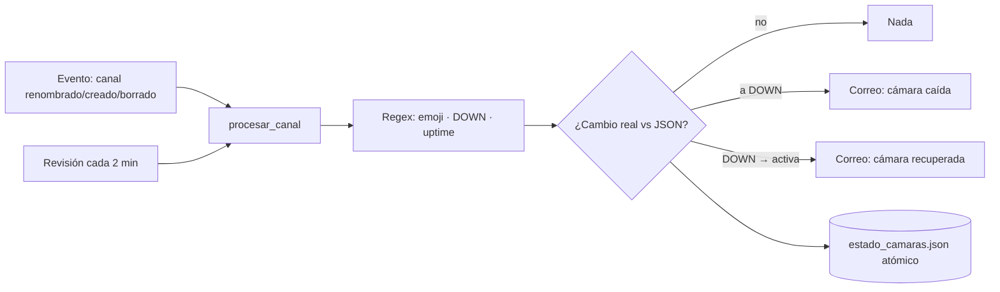

### Código
```python title="01 — Del nombre de un canal a un estado: «Entrada 3d 21h20m» → activa, «Entrada DOWN» → caída"
_RE_EMOJI_INICIAL = re.compile(r"^[^\w]+", re.UNICODE)
_RE_DOWN = re.compile(r"\bDOWN\b\s*$", re.IGNORECASE)
_RE_UPTIME = re.compile(r"\s*(?:\d+\s*d)?\s*(?:\d+\s*h)?\s*\d+\s*m\s*$", re.IGNORECASE)

def parsear_estado_canal(nombre_canal: str):
    nombre = _RE_EMOJI_INICIAL.sub("", nombre_canal.strip()).strip()
    if _RE_DOWN.search(nombre):
        camara = _RE_DOWN.sub("", nombre).strip()
        return "down", (camara or nombre)
    camara = _RE_UPTIME.sub("", nombre).strip()
    return "up", (camara or nombre)
```

### Animación
```json animacion
{
  "duration": 6,
  "aspect": "16:9",
  "concept": { "es": "Un panel que no se mira se convierte en una alarma que llega sola", "en": "A panel nobody watches becomes an alarm that arrives on its own" },
  "elements": [
    { "id": "grid", "type": "camara", "label": "Cámaras (ejemplo: 6)", "position": "izquierda" },
    { "id": "bot", "type": "bot", "label": "Vigía", "position": "centro" },
    { "id": "mail", "type": "correo", "label": "Aviso", "position": "derecha" }
  ],
  "beats": [
    { "t": 0.5, "action": "seis iconos de cámara en verde con contadores «3d 21h», «12h 04m»… (ejemplo)" },
    { "t": 1.8, "action": "una cámara cambia a «Patio DOWN» en rojo (nombre inventado)" },
    { "t": 2.8, "action": "el bot la detecta y sale volando un sobre «⚠️ Cámara caída: Patio · 02:14»" },
    { "t": 4.3, "action": "la cámara vuelve a verde con «0h 3m» y sale un sobre verde «✅ Cámara recuperada»" }
  ],
  "sampleData": { "nota": "nombres y horas inventados" },
  "palette": "oscuro #05070a, ámbar #f2a93b, cian #5cc8d6, verde #52d18e, rojo #ef5b4c"
}
```
<!-- project:end -->

<!-- project:begin slug="monitor-disponibilidad-push" -->
## Monitor de disponibilidad y avisos push

```json ficha
{
  "slug": "monitor-disponibilidad-push",
  "name": "Monitor de disponibilidad y avisos push",
  "kind": "herramienta",
  "parent": "suite-infraestructura",
  "tools": [],
  "department": ["it"],
  "category": "infra",
  "lifecycle": "activo",
  "status": "produccion",
  "evolvedFrom": null,
  "tagline": { "es": "Los equipos críticos convertidos en semáforos del chat, con aviso al móvil si uno lleva una hora caído", "en": "Critical machines turned into chat traffic lights, with a phone alert if one has been down for an hour" },
  "summary": { "es": "Dos bots que trabajan juntos. El primero hace ping a los equipos críticos y renombra un canal de voz por equipo con su estado y cuánto tiempo lleva así. El segundo lee esos nombres en las máquinas de render y, si una lleva una hora o más caída, manda una notificación push al móvil del responsable.", "en": "Two bots working together. The first pings critical machines and renames one voice channel per machine with its state and how long it has been that way. The second reads those names for the render machines and, if one has been down for an hour or more, sends a push notification to the person in charge." },
  "problem": { "es": "Las máquinas de render y algunos equipos auxiliares fallan de vez en cuando; enterarse tarde significaba horas de trabajo perdidas.", "en": "Render machines and some auxiliary devices fail from time to time; finding out late meant hours of lost work." },
  "solution": { "es": "Un tablero visible en el chat (nombre del canal = estado + duración) y una escalada automática al móvil solo cuando la caída es prolongada.", "en": "A board visible in chat (channel name = state + duration) and automatic escalation to a phone only when the outage is prolonged." },
  "howItWorks": [
    { "title": { "es": "Ping", "en": "Ping" }, "text": { "es": "Cada 10 minutos se hace un ping a cada equipo de la lista.", "en": "Every 10 minutes each device on the list is pinged." } },
    { "title": { "es": "Rótulo vivo", "en": "Live label" }, "text": { "es": "El canal pasa a llamarse «Equipo 🟢 10h25m UPTIME» o «Equipo 🔴 0h03m DOWNTIME»; el contador se reinicia en cada cambio.", "en": "The channel is renamed 'Machine 🟢 10h25m UPTIME' or 'Machine 🔴 0h03m DOWNTIME'; the counter resets on each change." } },
    { "title": { "es": "Escalada", "en": "Escalation" }, "text": { "es": "Cada 5 minutos otro bot lee los canales de las máquinas de render; si ve «DOWNTIME» de 1 h o más, manda un push una sola vez.", "en": "Every 5 minutes another bot reads the render-machine channels; if it sees DOWNTIME of 1 h or more it sends one push notification." } },
    { "title": { "es": "Rearme", "en": "Re-arm" }, "text": { "es": "Cuando la máquina vuelve a verde, el aviso se rearma para la siguiente caída.", "en": "When the machine is green again, the alert re-arms for the next outage." } }
  ],
  "features": [
    { "es": "Ping multiplataforma (Windows o Linux) sin bloquear el bot", "en": "Cross-platform ping (Windows or Linux) without blocking the bot" },
    { "es": "Duración del estado actual en el propio nombre del canal", "en": "Current-state duration shown in the channel name itself" },
    { "es": "Escalada al móvil con umbral de 1 h", "en": "Phone escalation with a 1-hour threshold" },
    { "es": "Un solo aviso por caída (sin spam)", "en": "One alert per outage (no spam)" }
  ],
  "automations": [
    { "trigger": "cada 10 min", "action": { "es": "Ping y renombrado de canales", "en": "Ping and channel renaming" } },
    { "trigger": "cada 5 min", "action": { "es": "Lectura de canales de render y push si DOWNTIME ≥ 1 h", "en": "Read render channels and push if DOWNTIME ≥ 1 h" } }
  ],
  "integrations": ["Discord", "Pushover"],
  "ai": { "used": false, "where": { "es": "", "en": "" }, "local": true, "models": [] },
  "users": { "es": "Responsable de la granja de render y de sistemas", "en": "Render-farm and systems lead" },
  "stack": ["python", "discord", "pushover"],
  "stackOther": ["asyncio subprocess", "aiohttp"],
  "metrics": [
    { "label": { "es": "Intervalo de ping", "en": "Ping interval" }, "value": "10 min", "real": true },
    { "label": { "es": "Umbral de escalada", "en": "Escalation threshold" }, "value": "1 h", "real": true },
    { "label": { "es": "Máquinas de render vigiladas", "en": "Render machines watched" }, "value": "4", "real": true }
  ],
  "businessValue": { "es": "Las máquinas que producen dinero (render, cálculo) no se quedan paradas una noche entera sin que nadie lo sepa.", "en": "Revenue-producing machines (rendering, compute) are not left idle a whole night without anyone knowing." },
  "complexity": 3,
  "impressiveness": 5,
  "featured": false,
  "sensitivity": "baja",
  "visualLoop": { "es": "Una lista de canales de voz con semáforos y contadores que avanzan; uno se pone rojo, su contador llega a 1h00m y vibra un móvil.", "en": "A list of voice channels with traffic lights and running counters; one turns red, its counter reaches 1h00m and a phone vibrates." },
  "notes": "Direcciones de los equipos, identificadores de canal y claves del servicio push omitidos."
}
```

### Qué es
Son dos pequeños bots que siguen el mismo patrón: **usar el nombre de un canal de Discord como panel de estado**. Uno escribe el estado (ping → nombre del canal) y el otro lo lee para escalar las caídas largas al móvil.

### El problema que resuelve
Algunas máquinas, en especial las de render, trabajan durante horas sin supervisión. Si una se cuelga por la noche, por la mañana se ha perdido una noche de producción. Al mismo tiempo, un aviso al móvil por cada microcorte sería insoportable.

### Cómo se usa
- **Para mirar:** basta con abrir el servidor de Discord. En la lista de canales se ve, por ejemplo, «Render-02 🟢 31h12m UPTIME» o «NAS 🔴 0h20m DOWNTIME».
- **Para reaccionar:** si llega un push «🚨 Máquina de render caída: lleva caída 1h05m», hay que ir a revisarla.

### Qué hace solo
1. **Bot de ping:** cada 10 minutos lanza `ping` a cada equipo (1 paquete, 1 s de espera) como subproceso asíncrono. Si el estado cambia, reinicia el contador. Después calcula horas y minutos desde el último cambio y renombra el canal.
2. **Bot de escalada:** cada 5 minutos lee el nombre de cada canal de render. Si contiene 🔴 y el patrón `NhMm DOWNTIME` con N ≥ 1 y todavía no ha avisado, manda el push y marca «avisado». Si ve 🟢 de nuevo, desmarca.

### Cómo funciona por dentro
- El ping usa los parámetros nativos de cada sistema operativo (`-n 1 -w 1000` en Windows y `-c 1 -W 1` en Unix) y solo mira el código de salida.
- El push se envía con una petición HTTP al servicio de notificaciones, dirigida a un solo dispositivo.
- Los estados viven en memoria y el contador se reconstruye desde el arranque. Al ser una vista de estado, perder el contador en un reinicio no tiene consecuencias graves.

### Interfaz
La lista de canales de voz de Discord y una notificación en el móvil.

### Inteligencia artificial
No usa.

### Fiabilidad y seguridad
- El umbral de una hora filtra los reinicios y cortes cortos.
- La bandera «avisado» evita repetir el push mientras la caída continúa.
- Si un canal no existe, se registra un aviso en el log sin romper el bucle.

### Qué aporta a una empresa
Monitorización con escalada por niveles (verlo → recibir un aviso) con dos scripts de cien líneas y sin licencias.

### Retos técnicos resueltos
- **No bloquear el bot mientras se hace ping:** se usa `asyncio.create_subprocess_exec`.
- **Comunicar dos bots sin base de datos:** el nombre del canal es el mensaje.

### Evolución
Es el embrión del patrón que después se aplicó a las cámaras y a otros canales de estado. Lo siguiente sería consultar el estado real de los servicios (no solo el ping) y llevar un histórico de disponibilidad.

### Diagrama
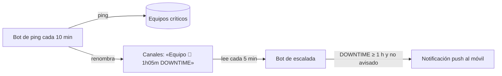

### Código
```python title="01 — Escalada: solo un aviso por caída y solo si ya dura una hora"
pattern = re.compile(r"(\d+)h(\d+)m\s+DOWNTIME")
for ch in CHANNELS:
    name = client.get_channel(ch["id"]).name
    if "🔴" in name:
        m = pattern.search(name)
        if m and int(m.group(1)) >= 1 and not notified[ch["name"]]:
            await send_push(f"{ch['name']} lleva caída {m.group(1)}h{m.group(2)}m.")
            notified[ch["name"]] = True
    elif "🟢" in name and notified[ch["name"]]:
        notified[ch["name"]] = False          # rearmar para la próxima caída
```

### Animación
```json animacion
{
  "duration": 6,
  "aspect": "16:9",
  "concept": { "es": "El chat como semáforo; el móvil, solo cuando importa", "en": "Chat as a traffic light; the phone only when it matters" },
  "elements": [
    { "id": "lista", "type": "chat", "label": "Canales de estado", "position": "izquierda" },
    { "id": "movil", "type": "movil", "label": "Push", "position": "derecha" }
  ],
  "beats": [
    { "t": 0.5, "action": "cuatro canales «Render-0x 🟢 31h12m UPTIME» con contadores avanzando (ejemplo)" },
    { "t": 2.0, "action": "Render-04 pasa a «🔴 0h05m DOWNTIME»; el contador corre rápido: 0h20m, 0h45m" },
    { "t": 3.6, "action": "al llegar a 1h00m vibra el móvil: «🚨 Render-04 lleva caída 1h00m»" },
    { "t": 5.0, "action": "vuelve a 🟢 y la campana del móvil se rearma con un ✔" }
  ],
  "sampleData": { "nota": "nombres y tiempos de ejemplo" },
  "palette": "oscuro #05070a, ámbar #f2a93b, cian #5cc8d6, verde #52d18e, rojo #ef5b4c"
}
```
<!-- project:end -->

<!-- project:begin slug="buzon-reportes-ticket" -->
## Buzón de reportes con ticket

```json ficha
{
  "slug": "buzon-reportes-ticket",
  "name": "Buzón de reportes con ticket",
  "kind": "herramienta",
  "parent": "suite-infraestructura",
  "tools": [],
  "department": ["it", "compras"],
  "category": "web",
  "lifecycle": "activo",
  "status": "produccion",
  "evolvedFrom": null,
  "tagline": { "es": "Cualquiera puede reportar un fallo en un minuto y recibe un número de ticket", "en": "Anyone can report a problem in a minute and gets a ticket number" },
  "summary": { "es": "Un formulario web sencillo donde un compañero describe un problema con una herramienta, adjunta capturas y lo envía. El sistema le asigna un número de ticket, lo guarda y manda un correo al responsable con el usuario en copia, de modo que al contestar ya hablan directamente.", "en": "A simple web form where a colleague describes a problem with a tool, attaches screenshots and submits it. The system assigns a ticket number, stores it and emails the person in charge with the user in CC, so replying starts the conversation directly." },
  "problem": { "es": "Los fallos llegaban por pasillo, chat o llamada, sin capturas ni orden, y se perdían.", "en": "Problem reports arrived by word of mouth, chat or phone, without screenshots or order, and got lost." },
  "solution": { "es": "Un canal único, con campos obligatorios, numeración correlativa y correo con respuesta directa al usuario.", "en": "A single channel with mandatory fields, sequential numbering and an email that replies straight to the user." },
  "howItWorks": [
    { "title": { "es": "Rellenar", "en": "Fill in" }, "text": { "es": "Correo de contacto, nombre opcional, asunto y explicación de qué pasaba y qué se esperaba.", "en": "Contact email, optional name, subject and an explanation of what happened and what was expected." } },
    { "title": { "es": "Adjuntar", "en": "Attach" }, "text": { "es": "Capturas, logs o documentos (hasta 64 MB en total).", "en": "Screenshots, logs or documents (up to 64 MB in total)." } },
    { "title": { "es": "Enviar", "en": "Send" }, "text": { "es": "Se asigna el número de ticket y sale el correo «[Ticket #N] asunto».", "en": "A ticket number is assigned and a '[Ticket #N] subject' email goes out." } }
  ],
  "features": [
    { "es": "Numeración correlativa persistente", "en": "Persistent sequential numbering" },
    { "es": "Múltiples adjuntos de cualquier tipo", "en": "Multiple attachments of any type" },
    { "es": "Usuario en copia y como dirección de respuesta", "en": "User in CC and as Reply-To" },
    { "es": "Correo en texto y HTML", "en": "Email in plain text and HTML" },
    { "es": "Histórico consultable de reportes", "en": "Searchable report history" },
    { "es": "Envío de correo robusto: prueba varios servidores de destino del dominio y usa TLS si está disponible", "en": "Robust sending: tries several of the domain's mail exchangers and uses TLS when available" }
  ],
  "automations": [ { "trigger": "manual (al enviar el formulario)", "action": { "es": "Crea el ticket y envía el correo", "en": "Creates the ticket and sends the email" } } ],
  "integrations": ["Correo Office 365"],
  "ai": { "used": false, "where": { "es": "", "en": "" }, "local": true, "models": [] },
  "users": { "es": "Cualquier empleado", "en": "Any employee" },
  "stack": ["python", "flask", "email"],
  "stackOther": ["dnspython"],
  "metrics": [ { "label": { "es": "Tamaño máximo de envío", "en": "Max upload size" }, "value": "64 MB", "real": true } ],
  "businessValue": { "es": "Cada incidencia queda registrada, numerada y con la información necesaria para resolverla a la primera.", "en": "Every issue is logged, numbered and comes with the information needed to fix it first time." },
  "complexity": 3,
  "impressiveness": 3,
  "featured": false,
  "sensitivity": "baja",
  "visualLoop": { "es": "Un formulario se rellena solo, se suelta una captura encima y aparece una pegatina «Ticket #128».", "en": "A form fills itself in, a screenshot is dropped on it and a 'Ticket #128' sticker appears." },
  "notes": "Destinatarios y remitente omitidos."
}
```

### Qué es
Una pequeña web de soporte interno. No pretende ser un gestor de incidencias completo: es la mínima pieza que **ordena la entrada de problemas** y la convierte en un correo bien estructurado.

### El problema que resuelve
Los avisos de fallo llegaban del tipo «oye, que el programa ese no va», sin captura, sin saber qué máquina ni qué se estaba haciendo. Resolverlos exigía un ida y vuelta de preguntas.

### Cómo se usa
1. Se abre la web («🎫 Sistema de Reportes»).
2. Se rellena:
   - el correo de contacto;
   - el nombre (opcional);
   - el **asunto del problema** (ejemplo del propio formulario: «No me abre el lanzador de benchmarks en la máquina X»);
   - **qué pasa**, con la sugerencia «cuenta qué estabas haciendo, qué esperabas que pasara y qué ha pasado».
3. Se adjuntan archivos si se quiere.
4. Se envía y se recibe el número de ticket.

### Qué hace solo
Al enviar el formulario:
1. Valida el correo, el asunto y el mensaje.
2. Lee los adjuntos en memoria.
3. Incrementa el contador y guarda el reporte (solo con los nombres de los adjuntos, no los binarios).
4. Compone el correo «[Ticket #N] asunto» con el usuario en copia y como dirección de respuesta.
5. Lo envía probando varios servidores de destino del dominio.

### Cómo funciona por dentro
- **Almacenamiento:** un JSON con `counter` y `reportes`.
- **Correo robusto:**
  - se resuelven los registros MX del dominio con `dnspython`;
  - se añade el patrón de host de entrada del proveedor de correo y el host principal configurado;
  - se intenta cada host y cada una de sus IP en el puerto 25, con `EHLO` y `STARTTLS` si se anuncia;
  - el primero que responde se usa para enviar.
- **Mensaje:** `multipart/mixed` con una parte alternativa (texto y HTML) más los adjuntos.

### Interfaz
Tarjeta oscura con el formulario, una zona de adjuntos y una sección de histórico con mensajes de estado («Sin reportes aún», «Error al cargar el histórico»).

### Inteligencia artificial
No usa.

### Fiabilidad y seguridad
- Límite de tamaño de subida.
- Los adjuntos no se guardan en el servidor: solo viajan en el correo.
- Si ningún servidor de correo responde, el usuario recibe un error claro en lugar de un falso «enviado».

### Qué aporta a una empresa
Pasa de «me lo dijeron por el pasillo» a un registro trazable y numerado, con la información que hace falta desde el primer mensaje.

### Retos técnicos resueltos
Envío fiable sin credenciales de buzón: se descubren y prueban en cascada los servidores de entrada del dominio.

### Evolución
Siguientes pasos: estados (abierto, en curso, cerrado) y respuesta desde la propia web.

### Diagrama
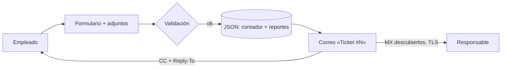

### Código
```python title="01 — Descubrir los servidores de entrada del dominio y probar en cascada hasta que uno acepte"
def discover_mx(domain):
    hosts = []
    try:
        answers = dns.resolver.resolve(domain, 'MX')
        hosts += [str(r.exchange).rstrip('.') for r in sorted(answers, key=lambda r: r.preference)]
    except Exception:
        pass
    return hosts

def connect_smtp_any(hosts, port=25):
    for host in hosts:
        for ip in resolve_host_ips(host):
            try:
                server = smtplib.SMTP(host=ip, port=port, timeout=30)
                server.ehlo()
                if server.has_extn('STARTTLS'):
                    server.starttls(); server.ehlo()
                return server
            except Exception:
                continue
    return None
```

### Animación
```json animacion
{
  "duration": 6,
  "aspect": "16:9",
  "concept": { "es": "Del «oye, no va» a un ticket con todo lo necesario", "en": "From 'hey, it's broken' to a ticket with everything needed" },
  "elements": [
    { "id": "form", "type": "formulario", "label": "Nuevo reporte", "position": "centro" },
    { "id": "captura", "type": "archivo", "label": "captura.png", "position": "izquierda" },
    { "id": "correo", "type": "correo", "label": "[Ticket #128]", "position": "derecha" }
  ],
  "beats": [
    { "t": 0.5, "action": "el formulario se rellena: asunto «No abre el informe de ventas» (ejemplo)" },
    { "t": 2.0, "action": "una captura vuela desde la izquierda y cae en la zona de adjuntos" },
    { "t": 3.2, "action": "se pulsa Enviar y aparece una pegatina ámbar «Ticket #128»" },
    { "t": 4.5, "action": "sale un correo hacia el responsable con el usuario en copia" }
  ],
  "sampleData": { "nota": "número de ticket y asunto inventados" },
  "palette": "oscuro #05070a, ámbar #f2a93b, cian #5cc8d6, verde #52d18e, rojo #ef5b4c"
}
```
<!-- project:end -->

---

<!-- project:begin slug="suite-compras" -->
## Suite de compras

```json ficha
{
  "slug": "suite-compras",
  "name": "Suite de compras",
  "kind": "suite",
  "parent": null,
  "tools": ["mesa-documentos-proveedores", "buscador-multimayorista", "buscador-stock-mayorista-europeo", "radar-tarifas-proveedor", "sincronizador-costes-portal", "agente-ia-correos-ofertas", "detector-compras-caras", "mas-vendidos-produccion", "estadisticas-gasto-compras", "conversor-divisas-compra", "vigilante-precios-cero", "buscador-incidencias-compras"],
  "department": ["compras"],
  "category": "automatizacion",
  "lifecycle": "activo",
  "status": "produccion",
  "evolvedFrom": "Hojas de cálculo manuales, copiar y pegar tarifas de proveedor y un compilador de precios que mantenía a mano otra persona",
  "tagline": { "es": "Todo lo que necesita un departamento de compras para comprar mejor, más rápido y sin errores", "en": "Everything a purchasing department needs to buy better, faster and without mistakes" },
  "summary": { "es": "Doce herramientas que cubren el ciclo de compra completo: leer las tarifas de los proveedores, buscar stock y precio en siete mayoristas a la vez, actualizar costes en el ERP con un semáforo de subidas, vigilar compras caras o precios a cero, analizar el gasto y preguntar a una IA por las ofertas que llegan por correo.", "en": "Twelve tools covering the full purchasing cycle: reading supplier price lists, searching stock and price across seven wholesalers at once, updating ERP costs with a price-rise traffic light, watching for expensive purchases or zero prices, analysing spend and asking an AI about offers that arrive by email." },
  "problem": { "es": "Un departamento de compras de una empresa que fabrica equipos informáticos trabaja con decenas de proveedores, cientos de tarifas al año en formatos distintos, varias divisas y miles de referencias. Todo pasaba por Excel y por la memoria de las personas.", "en": "The purchasing team of a company that builds computers deals with dozens of suppliers, hundreds of price lists per year in different formats, several currencies and thousands of part numbers. Everything went through Excel and people's memory." },
  "solution": { "es": "Una cadena de herramientas conectadas: la tarifa entra por una mesa de procesado, se normaliza, se compara con el ERP, se revisa con semáforo e IA y se aplica; mientras tanto, vigilantes automáticos avisan de anomalías y los buscadores responden en segundos.", "en": "A chain of connected tools: the price list enters through a processing desk, gets normalised, compared with the ERP, reviewed with a traffic light and AI, and applied; meanwhile automatic watchers flag anomalies and search tools answer in seconds." },
  "howItWorks": [
    { "title": { "es": "Entrada", "en": "Intake" }, "text": { "es": "La tarifa del proveedor se arrastra a la mesa de procesado, que reconoce de qué proveedor es y la convierte a un formato estándar cruzado con el ERP.", "en": "The supplier's price list is dropped onto the processing desk, which recognises the supplier and converts it to a standard format matched against the ERP." } },
    { "title": { "es": "Revisión", "en": "Review" }, "text": { "es": "El radar de tarifas compara cada precio nuevo con el actual y pinta un semáforo; la IA redacta el resumen.", "en": "The tariff radar compares each new price with the current one and paints a traffic light; the AI writes the summary." } },
    { "title": { "es": "Aplicación", "en": "Apply" }, "text": { "es": "Con un clic se actualiza el coste en el ERP y queda en el histórico.", "en": "One click updates the cost in the ERP and stores it in the history." } },
    { "title": { "es": "Vigilancia", "en": "Watch" }, "text": { "es": "Vigilantes revisan cada pocos segundos o cada noche precios a cero, compras por encima de la media y stock que vuelve.", "en": "Watchers check every few seconds or every night for zero prices, purchases above average and stock coming back." } },
    { "title": { "es": "Decisión", "en": "Decision" }, "text": { "es": "Buscadores y paneles de estadísticas ayudan a decidir a quién comprar y cuánto.", "en": "Search tools and statistics panels help decide who to buy from and how much." } }
  ],
  "features": [
    { "es": "Procesado de unas 30 tarifas de fabricante distintas con detección automática del formato", "en": "Processing of about 30 different manufacturer price lists with automatic format detection" },
    { "es": "Búsqueda simultánea de stock y precio en 7 mayoristas, en euros", "en": "Simultaneous stock and price search across 7 wholesalers, in euros" },
    { "es": "Semáforo de variaciones de precio y análisis IA antes de tocar el ERP", "en": "Price-change traffic light and AI analysis before touching the ERP" },
    { "es": "Detección diaria de compras por encima de su media histórica", "en": "Daily detection of purchases above their historical average" },
    { "es": "Aviso por correo cuando un coste de última compra pasa a cero", "en": "Email alert when a last-purchase cost drops to zero" },
    { "es": "Chat con IA local sobre los correos de ofertas de proveedores", "en": "Local-AI chat over supplier offer emails" },
    { "es": "Estadísticas de gasto por familia, proveedor y marca con preguntas en lenguaje natural", "en": "Spend statistics by family, supplier and brand with natural-language questions" }
  ],
  "automations": [
    { "trigger": "cada 30 s (configurable)", "action": { "es": "Vigilancia de precios de compra a cero", "en": "Zero purchase price watch" } },
    { "trigger": "cada hora", "action": { "es": "Refresco de los catálogos de mayoristas y comprobación de alertas de stock", "en": "Wholesaler catalogue refresh and stock alert check" } },
    { "trigger": "a las 00:00", "action": { "es": "Análisis IA de compras anómalas nuevas", "en": "AI analysis of new anomalous purchases" } },
    { "trigger": "día y hora elegidos", "action": { "es": "Envío de listas programadas de part numbers con mejor precio y stock", "en": "Scheduled part-number lists sent with best price and stock" } }
  ],
  "integrations": ["ERP (SQL Server)", "Correo Office 365", "Microsoft Graph (correo)", "SFTP y HTTP de mayoristas", "BCE (tipos de cambio)", "IA local (Ollama)"],
  "ai": { "used": true, "where": { "es": "Resúmenes ejecutivos de tarifas, veredictos sobre compras caras, chat sobre correos de ofertas, preguntas sobre estadísticas y sobre resultados de búsqueda", "en": "Executive summaries of price lists, verdicts on expensive purchases, chat over offer emails, questions about statistics and search results" }, "local": true, "models": ["qwen3 (familia Qwen, ~27B) vía Ollama"] },
  "users": { "es": "Equipo de compras (4-6 personas) y dirección", "en": "Purchasing team (4-6 people) and management" },
  "stack": ["python", "flask", "sqlserver", "erp", "ollama", "qwen", "llm", "excel", "email", "apis", "etl"],
  "stackOther": ["paramiko (SFTP)", "openpyxl", "xlsxwriter", "Microsoft Graph", "cryptography (Fernet)", "ThreadPoolExecutor"],
  "metrics": [
    { "label": { "es": "Herramientas en la suite", "en": "Tools in the suite" }, "value": "12", "real": true },
    { "label": { "es": "Mayoristas consultados a la vez", "en": "Wholesalers queried at once" }, "value": "7", "real": true },
    { "label": { "es": "Procesadores de tarifa de fabricante", "en": "Manufacturer price-list processors" }, "value": "≈ 30", "real": true }
  ],
  "businessValue": { "es": "Menos horas de copiar y pegar, menos errores al meter precios, compras al mejor precio con stock real y alertas antes de que un error de coste llegue a una venta.", "en": "Fewer copy-paste hours, fewer pricing mistakes, purchases at the best price with real stock, and alerts before a cost mistake reaches a sale." },
  "complexity": 8,
  "impressiveness": 9,
  "featured": false,
  "sensitivity": "media",
  "visualLoop": { "es": "Un Excel de proveedor entra por la izquierda, atraviesa un escáner, se convierte en una tabla con semáforos y un botón «Aplicar» lo manda al ERP; a la derecha, siete logotipos genéricos de mayorista responden con precio y stock.", "en": "A supplier spreadsheet enters from the left, passes a scanner, becomes a traffic-light table and an 'Apply' button sends it to the ERP; on the right, seven generic wholesaler logos answer with price and stock." },
  "notes": "Los nombres de mayoristas, fabricantes y personas se han omitido. El nº de personas del equipo es aproximado y puede eliminarse."
}
```

### Qué es
La suite de compras es el conjunto de herramientas que usa el equipo de compras de una empresa que fabrica y vende equipos informáticos profesionales (estaciones de trabajo, servidores, componentes). Cubre todo el ciclo:

1. **Entra la información:** tarifas de fabricantes y mayoristas, ofertas por correo, catálogos con stock.
2. **Se decide:** a quién comprar, a qué precio y con qué stock.
3. **Se registra:** costes en el ERP, divisas, sincronización con el portal de clientes.
4. **Se vigila:** compras caras, precios a cero, incidencias.
5. **Se analiza:** gasto por familia, proveedor y marca; productos más usados.

| Herramienta | Para qué sirve |
|---|---|
| **Mesa de procesado de documentos de proveedores** | Arrastrar tarifas y que se procesen solas con el script correcto |
| **Buscador multimayorista** ⭐ | Precio y stock de un artículo en 7 mayoristas a la vez |
| **Buscador de stock de un mayorista europeo** | Consulta rápida del catálogo de dos almacenes de un mayorista |
| **Radar de tarifas de proveedor** | Comparar una tarifa con el ERP con semáforo e IA y aplicarla |
| **Sincronizador de costes con el portal** | Copiar los costes del ERP a la base de datos del portal B2B |
| **Agente IA de correos de ofertas** | Preguntar a una IA por las ofertas que llegan al correo |
| **Detector de compras por encima de su media** | Encontrar albaranes de compra con precio anómalo |
| **Más vendidos en producción** | Qué componentes se montan más, filtrando lo que no interesa |
| **Estadísticas de gasto** | Gasto por familia, proveedor y marca, con preguntas a la IA |
| **Conversor de precios por divisa** | Recalcular costes en euros desde USD u otras divisas, con vuelta atrás |
| **Vigilante de precios a cero** | Aviso inmediato si un coste de última compra queda a cero |
| **Buscador de incidencias de compras** | Buscar en el histórico de incidencias y dejar notas |

### El problema que resuelve
- Cada fabricante manda su tarifa con un formato distinto: varias pestañas, celdas combinadas, columnas que cambian de nombre, precios en euros o en dólares.
- Comparar precio y stock entre mayoristas implicaba abrir siete portales web.
- Un precio mal introducido en el ERP se arrastraba a los escandallos, a los márgenes y a las ventas.
- Las ofertas importantes se perdían entre cientos de correos.
- El análisis del gasto dependía de que alguien montara una tabla dinámica.

### Cómo se usa
El día a día de una persona de compras:
1. Llega una tarifa nueva: la arrastra a la **mesa de procesado**, que propone el script adecuado y genera el Excel normalizado.
2. Abre el **radar de tarifas**, sube ese Excel, revisa el semáforo (rojo si sube más de un 20 %), lee el resumen de la IA y aplica.
3. Para un pedido urgente, busca el part number en el **buscador multimayorista** y elige el más barato con stock.
4. Si algo no está disponible, deja una **alerta de stock** y le llegará un correo cuando entre.
5. Recibe por correo, sin pedirlos, los avisos del **vigilante de precios a cero** y del **detector de compras caras**.

### Qué hace solo
- Refresca cada hora el catálogo de los siete mayoristas y revisa las alertas de stock.
- Envía listas programadas de part numbers por correo el día y la hora elegidos.
- Cada noche, la IA analiza las compras anómalas nuevas.
- Cada 30 segundos (configurable) comprueba si algún coste ha caído a cero.
- Borra a los 7 días la caché de correos cargados por el agente de ofertas.

### Cómo funciona por dentro
Todas las herramientas comparten un patrón:
- **Flask** como servidor web interno;
- **SQL Server** del ERP vía `pyodbc`, siempre con consultas parametrizadas;
- **JSON** con escritura atómica para su propio estado;
- **correo corporativo por envío directo** (sin buzón ni contraseña);
- un **modelo local de la familia Qwen** servido por Ollama para la IA.

El inicio de sesión se comparte con el resto del ecosistema: todas leen en **solo lectura** el mismo fichero de usuarios del portal interno, y cada herramienta guarda en un `acceso.json` propio quién puede entrar (un administrador lo marca con una casilla).

### Interfaz
Tema oscuro con acento naranja común a todo el ecosistema, tablas con filtros y botones de exportación a Excel o CSV, y una guía interactiva paso a paso en cada pantalla.

### Inteligencia artificial
La IA se usa siempre como **analista que explica**, nunca como algo que decide o escribe en el ERP:
- resume una tarifa;
- da un veredicto sobre una compra cara;
- contesta preguntas sobre unos resultados o unos correos concretos.

Todos los *prompts* le prohíben inventar precios o part numbers que no estén en los datos que recibe.

### Fiabilidad y seguridad
- Cambios en el ERP con copia previa y vuelta atrás (divisas, precios).
- Credenciales de correo de cada usuario cifradas con una clave por persona.
- Listas negras de part numbers que nunca se tocan.
- Alertas que solo se rearman cuando hay datos fiables (un mayorista caído no provoca falsos avisos).

### Qué aporta a una empresa
- Horas semanales ahorradas en tareas mecánicas.
- Compras más baratas, porque siempre se compara.
- Errores de coste detectados antes de que lleguen a una factura de venta.
- Conocimiento del gasto que antes no existía.

### Retos técnicos resueltos
- Normalizar decenas de formatos de tarifa sin plantillas fijas, localizando columnas por sinónimos.
- Mantener en memoria catálogos de cientos de miles de líneas y buscar en ellos en milisegundos.
- Comparar precios de mayoristas en distintas divisas con el tipo de cambio oficial del día.
- Detectar «lo nuevo» (una compra cara nueva, un precio que acaba de pasar a cero) sin repetir avisos antiguos.

### Evolución
El origen fue una colección de scripts sueltos que se ejecutaban a mano y un «compilador» de precios que mantenía otra persona. Se pasó a un lanzador web de scripts, de ahí a una mesa con subida inteligente y aprendizaje, y alrededor fueron naciendo los buscadores, vigilantes y analizadores.

### Diagrama
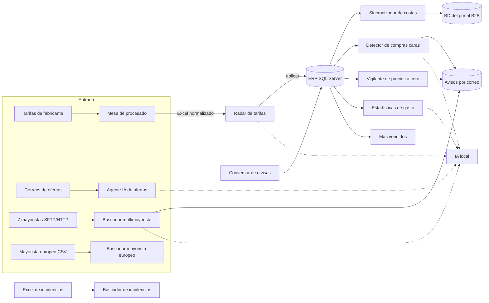

### Código
```python title="01 — El semáforo que decide cuánto miedo da una subida de precio"
def nivel_semaforo(variacion):
    if variacion is None:
        return 'unknown'    # el precio anterior era 0: no se puede calcular
    if variacion > 20:
        return 'danger'     # subida crítica
    if variacion > 10:
        return 'warning'    # subida a vigilar
    if variacion >= -10:
        return 'ok'
    if variacion >= -20:
        return 'info'       # bajada moderada
    return 'negative'       # bajada fuerte (¿error de tarifa?)
```

### Animación
```json animacion
{
  "duration": 10,
  "aspect": "16:9",
  "concept": { "es": "El ciclo de compra entero, de la tarifa al ERP, con vigilantes alrededor", "en": "The whole purchasing cycle, from price list to ERP, with watchers around it" },
  "elements": [
    { "id": "excel", "type": "archivo", "label": "tarifa_fabricante.xlsx", "position": "izquierda" },
    { "id": "mesa", "type": "ventana", "label": "Mesa de procesado", "position": "centro-izquierda" },
    { "id": "radar", "type": "tabla", "label": "Radar de tarifas", "position": "centro" },
    { "id": "erp", "type": "servidor", "label": "ERP", "position": "derecha" },
    { "id": "mayoristas", "type": "icono", "label": "7 mayoristas", "position": "arriba-derecha" },
    { "id": "campana", "type": "correo", "label": "Avisos", "position": "abajo-derecha" }
  ],
  "beats": [
    { "t": 0.5, "action": "un Excel con pestañas de colores cae sobre la mesa; aparece «Reconocido: fabricante X · confianza alta» (ejemplo)" },
    { "t": 2.0, "action": "sale un Excel limpio de 6 columnas que viaja al radar" },
    { "t": 3.2, "action": "el radar llena una tabla: 212 verdes, 9 ámbar, 3 rojos «+24 %» (datos de ejemplo)" },
    { "t": 4.6, "action": "una burbuja de IA escribe «3 subidas críticas en memorias; revisar antes de aplicar»" },
    { "t": 5.8, "action": "se pulsa «Aplicar» y los precios fluyen al ERP con un check verde" },
    { "t": 7.0, "action": "arriba, siete iconos de mayorista se encienden a la vez y devuelven precio y stock en euros" },
    { "t": 8.2, "action": "abajo, una campana suena: «Precio de última compra a cero en 1 artículo» (ejemplo)" },
    { "t": 9.3, "action": "plano final: todo el flujo iluminado con el texto «Comprar mejor, sin copiar y pegar»" }
  ],
  "sampleData": { "nota": "nombres de fabricante, recuentos y porcentajes inventados" },
  "palette": "oscuro #05070a, ámbar #f2a93b (sistema), cian #5cc8d6 (datos), verde #52d18e (ok), rojo #ef5b4c (alerta)"
}
```
<!-- project:end -->

<!-- project:begin slug="mesa-documentos-proveedores" -->
## Mesa de procesado de documentos de proveedores

```json ficha
{
  "slug": "mesa-documentos-proveedores",
  "name": "Mesa de procesado de documentos de proveedores",
  "kind": "herramienta",
  "parent": "suite-compras",
  "tools": [],
  "department": ["compras"],
  "category": "automatizacion",
  "lifecycle": "activo",
  "status": "produccion",
  "evolvedFrom": "Un lanzador web de scripts con subida de un documento cada vez",
  "tagline": { "es": "Arrastra las tarifas de tus proveedores y la herramienta sabe sola qué hacer con cada una", "en": "Drop your suppliers' price lists and the tool knows what to do with each one" },
  "summary": { "es": "Una web donde el equipo de compras arrastra a la vez muchos Excel, CSV o PDF de proveedores. La herramienta comprueba que no estén dañados, adivina qué script de procesado corresponde a cada uno, los ejecuta todos con un botón y entrega los Excel resultantes, listos para comparar con el ERP. Aprende de cada acierto.", "en": "A web page where the purchasing team drops many supplier Excel, CSV or PDF files at once. The tool checks they are not broken, guesses which processing script each needs, runs them all with one button and delivers the resulting spreadsheets, ready to compare with the ERP. It learns from every success." },
  "problem": { "es": "Hay unos 30 scripts distintos, uno por fabricante o tarifa, y elegir el correcto, pasarle el archivo y saber si había salido bien requería conocimientos técnicos.", "en": "There are about 30 different scripts, one per manufacturer or price list, and choosing the right one, passing it the file and knowing whether it worked required technical knowledge." },
  "solution": { "es": "Una mesa de trabajo que valida cada documento, reconoce el script por la estructura del fichero y por lo aprendido, ejecuta en lote, traduce los errores a lenguaje humano y une los resultados.", "en": "A workbench that validates each document, recognises the script from the file structure and from what it has learned, runs in batch, translates errors into plain language and merges the results." },
  "howItWorks": [
    { "title": { "es": "Arrastrar", "en": "Drop" }, "text": { "es": "Se sueltan todos los documentos del día en la zona de subida.", "en": "All of the day's documents are dropped on the upload area." } },
    { "title": { "es": "Revisar la propuesta", "en": "Check the proposal" }, "text": { "es": "Cada documento muestra el script propuesto, el nivel de confianza y el porqué, o el problema que tiene el archivo.", "en": "Each document shows the proposed script, the confidence level and why, or what is wrong with the file." } },
    { "title": { "es": "Ejecutar", "en": "Run" }, "text": { "es": "Un botón ejecuta todo el lote en paralelo con logs en vivo.", "en": "One button runs the whole batch in parallel with live logs." } },
    { "title": { "es": "Descargar o reintentar", "en": "Download or retry" }, "text": { "es": "Cada tarjeta dice «Listo · N filas» con su descarga, o explica el fallo y permite reintentar con otro script.", "en": "Each card says 'Done · N rows' with its download, or explains the failure and allows retrying with another script." } },
    { "title": { "es": "Unir", "en": "Merge" }, "text": { "es": "Opcionalmente, todos los Excel del lote se unen en uno solo.", "en": "Optionally, all the batch's spreadsheets are merged into one." } }
  ],
  "features": [
    { "es": "Subida múltiple por arrastre", "en": "Multi-file drag-and-drop upload" },
    { "es": "Detección de archivos vacíos, temporales de Excel, dañados, protegidos con contraseña o con extensión falsa", "en": "Detection of empty, Excel temp, corrupted, password-protected or fake-extension files" },
    { "es": "Reconocimiento del script con cuatro niveles de evidencia y nivel de confianza", "en": "Script recognition with four levels of evidence and a confidence level" },
    { "es": "Memoria de aprendizaje con ventana «Lo que ha aprendido» y botón para olvidar", "en": "Learning memory with a 'What it has learned' window and a forget button" },
    { "es": "Ejecución concurrente de scripts .py, módulos, .ps1, .bat o .exe", "en": "Concurrent execution of .py, modules, .ps1, .bat or .exe" },
    { "es": "Logs en vivo por Server-Sent Events y guardados en disco", "en": "Live logs over Server-Sent Events, also saved to disk" },
    { "es": "Diagnóstico de errores traducido a lenguaje sencillo", "en": "Error diagnosis translated into plain language" },
    { "es": "Unión de Excel del mismo formato", "en": "Merging of same-format spreadsheets" },
    { "es": "Biblioteca de botones de script editable (sin tocar código)", "en": "Editable library of script buttons (no code changes)" },
    { "es": "Tipo de cambio USD/EUR consultable desde la propia web", "en": "USD/EUR exchange rate available from the page itself" },
    { "es": "Parada segura de procesos en Windows", "en": "Safe process stopping on Windows" }
  ],
  "automations": [ { "trigger": "al soltar archivos", "action": { "es": "Validación y propuesta de script inmediatas", "en": "Immediate validation and script proposal" } } ],
  "integrations": ["ERP (SQL Server) a través de los scripts", "Tipo de cambio público"],
  "ai": { "used": false, "where": { "es": "No usa un modelo de lenguaje: el reconocimiento es un sistema de puntuación con aprendizaje por ejemplos", "en": "No language model: recognition is a scoring system that learns from examples" }, "local": true, "models": [] },
  "users": { "es": "Personas del departamento de compras sin conocimientos técnicos", "en": "Non-technical purchasing staff" },
  "stack": ["python", "flask", "excel", "csv", "pdf", "windows"],
  "stackOther": ["openpyxl", "xlrd", "subprocess", "Server-Sent Events"],
  "metrics": [
    { "label": { "es": "Scripts de procesado disponibles", "en": "Available processing scripts" }, "value": "≈ 30", "real": true },
    { "label": { "es": "Formatos de entrada admitidos", "en": "Accepted input formats" }, "value": "xlsx, xlsm, xls, csv, txt, pdf, json, xml", "real": true },
    { "label": { "es": "Umbral de similitud para reutilizar lo aprendido", "en": "Similarity threshold to reuse learned matches" }, "value": "45 %", "real": true }
  ],
  "businessValue": { "es": "Personas sin perfil técnico procesan en minutos lotes de tarifas que antes exigían a un programador, y saben exactamente qué documento falla y por qué.", "en": "Non-technical staff process batches of price lists in minutes that used to need a programmer, and know exactly which document failed and why." },
  "complexity": 7,
  "impressiveness": 7,
  "featured": false,
  "sensitivity": "baja",
  "visualLoop": { "es": "Cinco archivos caen en una bandeja; cada uno se convierte en una tarjeta con «Script: fabricante X · confianza alta»; uno se pone rojo «Excel protegido con contraseña»; se pulsa «Procesar todo» y las tarjetas pasan a «Listo · 214 filas».", "en": "Five files drop onto a tray; each becomes a card reading 'Script: manufacturer X · high confidence'; one turns red 'Password-protected Excel'; 'Process all' is pressed and the cards change to 'Done · 214 rows'." },
  "notes": "Los nombres de fabricantes de los scripts se han omitido. Cada script genera un Excel con el formato estándar Part_Number | Nombre | Price | Moneda | EAN | EOL, que luego consume el radar de tarifas."
}
```

### Qué es
Es el «punto de entrada» de los datos de proveedores. Empezó siendo un lanzador web de scripts: una biblioteca de botones, cada uno asociado a un script de procesado, con un formulario para subir un archivo y pasárselo. Hoy su pestaña principal es la **subida inteligente**, una mesa de trabajo pensada para que personas sin perfil técnico procesen muchos documentos a la vez sin equivocarse.

Detrás hay unos **30 procesadores de tarifa**, uno por fabricante o tipo de lista. Cada uno sabe leer el formato de su proveedor:
- varias pestañas;
- cabeceras en filas distintas;
- nombres de producto en celdas combinadas que hay que arrastrar hacia abajo;
- part numbers con variantes «-» y «+»;
- precios en distintas divisas.

Todos producen la misma salida: un Excel con `Part_Number | Nombre | Price | Moneda | EAN | EOL`, ya cruzado con el maestro de artículos del ERP. Hay también un procesador «multimayorista» que, a partir de los artículos del ERP, construye un Excel con una hoja por mayorista y una hoja resumen con colores.

### El problema que resuelve
- Elegir entre 30 scripts el adecuado para cada archivo.
- Saber si un archivo venía mal: protegido con contraseña, descargado a medias o el temporal `~$` de Excel.
- Entender un error técnico («PermissionError», «KeyError: 'Price in EUR'»).
- Procesar de uno en uno cuando llegan diez tarifas el mismo día.

### Cómo se usa
1. Se abre la pestaña **Subida inteligente** (la predeterminada).
2. Se arrastran todos los documentos.
3. La mesa los analiza al momento y muestra una tarjeta por documento:
   - **✅ con propuesta:** «Script: *nombre* · confianza alta», y el motivo, por ejemplo «ya lo usaste antes con un documento parecido (3 veces)» o «el nombre del archivo es del proveedor X, que solo tiene este script»;
   - **⚠️ con duda:** confianza media o baja, con un desplegable de candidatos;
   - **❌ con problema:** «El Excel está protegido con contraseña. Ábrelo, quita la contraseña y guárdalo de nuevo como .xlsx».
4. Se pulsa el botón de ejecutar el lote.
5. Cada tarjeta se actualiza en vivo:
   - «Listo · 214 filas» con su botón de descarga;
   - o «Ha terminado, pero no ha encontrado nada (0 filas)», con la explicación «normalmente es porque este documento no es para este script…» y un botón **Reintentar** para elegir otro.
6. Si se quiere, **Unir Excel del lote** junta todos los resultados en un solo fichero.
7. En **Lo que ha aprendido** se ve la memoria y se puede olvidar una entrada.

Los modos antiguos (individual y lote manual) siguen disponibles para usuarios avanzados.

### Qué hace solo
- Al soltar un archivo: lo valida y le calcula una «huella».
- Al terminar un procesado con éxito (al menos una fila): **aprende** la asociación huella → script.
- Durante la ejecución: retransmite el log en vivo y lo guarda en disco.

### Cómo funciona por dentro
**Huella del documento.** Se lee lo mínimo imprescindible:
1. Los primeros bytes. Un `.xlsx` real empieza por `PK` porque es un ZIP. Si empieza por `D0 CF 11 E0`, es un contenedor OLE: un Excel cifrado con contraseña o en formato antiguo.
2. Las pestañas y las cabeceras de columna, es decir, **la estructura y no los productos**, para que dos tarifas del mismo proveedor en meses distintos tengan la misma huella.
3. Las palabras del nombre del archivo, sin tildes, sin palabras vacías y sin «eur» o «xlsx».

**Reconocimiento en cuatro niveles**, de más a menos fiable:
1. **Memoria aprendida.** Se compara la huella con las guardadas. Si la similitud es de 0,45 o más, se puntúa con 60 + 40 × similitud.
2. **Reglas semilla por pestañas.** Si el archivo tiene exactamente las pestañas que caracterizan a un proveedor: 95 puntos.
3. **Reglas semilla por nombre.** Si el nombre del archivo casa con un patrón conocido: unos 88 puntos.
4. **Palabras del nombre con peso por rareza.** Cada palabra del archivo que aparece en el nombre, proveedor o fichero de un script suma `log(1 + N/df)`, donde `df` es el número de scripts que contienen esa palabra. Una palabra que aparece en todos los scripts no suma nada; una que aparece en uno solo suma mucho. Si el ganador destaca claramente (el doble que el segundo) y el proveedor solo tiene un script, se da como seguro.

El mejor candidato es «confianza alta» si supera 85 puntos y no hay empate técnico (otro a menos de 3 puntos).

**Ejecución.** Cada script se lanza como subproceso. Se detecta el tipo (Python, módulo, PowerShell, `.bat` o ejecutable) y la ruta del archivo se inserta donde el script tenga `{file}` o se añade al final. Para parar se usa `taskkill /F /T`, que mata el árbol entero. Los scripts imprimen dos líneas convenidas, `[OK] Archivo generado: ruta` y `[OK] Filas: N`, que la mesa lee para mostrar la descarga y el número de filas.

**Diagnóstico.** Se lee el log y se traducen los patrones conocidos: archivo abierto en Excel, sin conexión con el ERP, columna inesperada, 0 filas…

### Interfaz
- Pestañas «Subida inteligente», «Individual» y «Lote manual».
- Zona de arrastre grande.
- Tarjetas por documento con estado de color e indicador LED pulsante mientras se procesa.
- Panel de «Documentos generados» con descarga y borrado (con confirmación).
- Biblioteca de botones de script editable desde la propia web.
- Diseño oscuro con acento naranja y animaciones suaves que se desactivan si el sistema pide reducir el movimiento.
- Guía interactiva integrada.

### Inteligencia artificial
No usa un modelo de lenguaje, y es deliberado: el reconocimiento tiene que ser rápido, explicable («por qué te propongo esto») y estable. El «aprendizaje» es memoria basada en ejemplos con medida de similitud.

### Fiabilidad y seguridad
- Borrar un botón de la biblioteca **no** borra el script del disco.
- Solo se aprende de ejecuciones con éxito real (al menos una fila), para que un error no «enseñe» una asociación incorrecta.
- Los archivos problemáticos nunca se ejecutan: se explica el problema antes.
- Cada ejecución guarda su log.

### Qué aporta a una empresa
El conocimiento técnico (qué script va con qué archivo) queda dentro de la herramienta y deja de estar en la cabeza de una persona. Cualquiera del equipo puede procesar las tarifas del día.

### Retos técnicos resueltos
- **Detectar Excel cifrados sin abrirlos:** por la firma de bytes.
- **Reconocer un documento aunque cambien sus datos:** la huella usa la estructura, no el contenido.
- **Explicar decisiones:** cada propuesta lleva su porqué en lenguaje humano.
- **Convivencia de modos:** la mesa nueva se añadió sin romper los modos antiguos que ya se usaban.

### Evolución
1. Scripts sueltos ejecutados desde la consola.
2. Lanzador web: biblioteca de botones, subida de un archivo y logs en vivo.
3. Lote manual: varios archivos, asignando el script a mano.
4. **Subida inteligente** (actual): validación, reconocimiento con aprendizaje, ejecución en lote, diagnóstico y unión.

### Diagrama
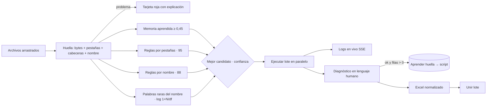

### Código
```python title="01 — Lo primero es saber si el archivo está mal, antes de intentar procesarlo"
if base.startswith("~$"):
    fp["problems"].append("Es un archivo temporal de Excel (empieza por «~$»), no el documento de verdad. "
                          "Cierra Excel y sube el archivo original.")
    return fp
if size == 0:
    fp["problems"].append("El archivo está vacío (0 KB). Vuelve a descargarlo del correo.")
    return fp
with open(path, "rb") as fh:
    head = fh.read(8)
if fp["ext"] in (".xlsx", ".xlsm"):
    if head.startswith(b"\xd0\xcf\x11\xe0"):          # contenedor OLE = cifrado o formato antiguo
        fp["problems"].append("El Excel está protegido con contraseña (o guardado en formato antiguo). "
                              "Ábrelo, quita la contraseña y guárdalo de nuevo como .xlsx.")
        return fp
    if not head.startswith(b"PK"):                      # un .xlsx real es un ZIP
        fp["problems"].append("El archivo dice ser Excel pero no lo es (o está dañado).")
        return fp
```

```python title="02 — Palabras raras pesan más: cómo el nombre del archivo vota por un script"
keys = {s["id"]: _script_key_tokens(s) for s in scripts}
n = max(1, len(keys))
raw = {}
for t in fp.get("name_tokens") or []:
    if len(t) < 3:
        continue
    df = [sid for sid, k in keys.items() if t in k]
    if not df or len(df) == n:          # palabra que no discrimina
        continue
    w = math.log(1 + n / len(df))       # cuanto más rara, más pesa
    for sid in df:
        raw[sid] = raw.get(sid, 0.0) + w
```

### Animación
```json animacion
{
  "duration": 6,
  "aspect": "16:9",
  "concept": { "es": "Suelta los archivos; la mesa sabe qué hacer con cada uno", "en": "Drop the files; the desk knows what to do with each" },
  "elements": [
    { "id": "bandeja", "type": "ventana", "label": "Subida inteligente", "position": "centro" },
    { "id": "files", "type": "archivo", "label": "5 tarifas", "position": "izquierda" },
    { "id": "out", "type": "archivo", "label": "LOTE_unido.xlsx", "position": "derecha" }
  ],
  "beats": [
    { "t": 0.5, "action": "cinco archivos caen en la bandeja y se convierten en tarjetas" },
    { "t": 1.6, "action": "cuatro muestran «confianza alta» con su motivo; una se pone roja: «Excel protegido con contraseña»" },
    { "t": 3.0, "action": "se pulsa «Procesar todo»: los LED de las tarjetas laten en naranja y corren líneas de log" },
    { "t": 4.4, "action": "las tarjetas pasan a «Listo · 214 filas», «Listo · 87 filas»… (ejemplo) y se unen en un Excel a la derecha" }
  ],
  "sampleData": { "nota": "nombres y recuentos inventados" },
  "palette": "oscuro #05070a, ámbar #f2a93b, cian #5cc8d6, verde #52d18e, rojo #ef5b4c"
}
```
<!-- project:end -->

<!-- project:begin slug="buscador-multimayorista" -->
## Buscador multimayorista

```json ficha
{
  "slug": "buscador-multimayorista",
  "name": "Buscador multimayorista",
  "kind": "sistema",
  "parent": "suite-compras",
  "tools": [],
  "department": ["compras", "comercial"],
  "category": "datos",
  "lifecycle": "activo",
  "status": "produccion",
  "evolvedFrom": "Un buscador de un único mayorista que descargaba y releía su CSV en cada búsqueda",
  "tagline": { "es": "Escribe un código de producto y en un segundo ves precio y stock en siete mayoristas, en euros", "en": "Type a product code and in a second see price and stock across seven wholesalers, in euros" },
  "summary": { "es": "Un buscador que mantiene en memoria los catálogos completos de siete mayoristas, los refresca solo cada hora y responde al instante quién tiene un producto, a qué precio (convertido a euros con el cambio oficial del día) y con cuánto stock. Además busca listas enteras, vigila productos agotados, manda listados programados por correo, guarda la evolución de precios y tiene una IA a la que preguntar por los resultados.", "en": "A search tool that keeps the full catalogues of seven wholesalers in memory, refreshes them every hour and instantly answers who has a product, at what price (converted to euros at the day's official rate) and with how much stock. It also searches whole lists, watches out-of-stock products, emails scheduled lists, keeps price history and has an AI you can ask about the results." },
  "problem": { "es": "Para saber dónde comprar un componente había que entrar en siete portales, cada uno con su buscador, su formato y su moneda, y anotar en un Excel. Con cien referencias en un presupuesto, era una mañana entera.", "en": "To find where to buy a component you had to log into seven portals, each with its own search, format and currency, and note everything in a spreadsheet. With a hundred items in a quote, it took a whole morning." },
  "solution": { "es": "Descargar automáticamente los catálogos de todos los mayoristas (SFTP, HTTP, Excel, scraping con sesión), normalizarlos a un único modelo, indexarlos en memoria por part number, SKU y EAN, y ofrecer búsqueda, lotes, alertas, listas programadas, histórico e IA en una sola web.", "en": "Automatically download every wholesaler catalogue (SFTP, HTTP, Excel, session-based scraping), normalise them to one model, index them in memory by part number, SKU and EAN, and offer search, batches, alerts, scheduled lists, history and AI in a single web app." },
  "howItWorks": [
    { "title": { "es": "Descarga e indexado en segundo plano", "en": "Background download and indexing" }, "text": { "es": "Un hilo por mayorista descarga su catálogo cuando la caché caduca (1 h), lo convierte y lo deja en memoria con diccionarios de acceso directo.", "en": "One thread per wholesaler downloads its catalogue when the cache expires (1 h), converts it and keeps it in memory with direct-access dictionaries." } },
    { "title": { "es": "Búsqueda", "en": "Search" }, "text": { "es": "Se escribe un part number, un EAN o palabras sueltas en cualquier orden; los siete índices se consultan en paralelo y se ordenan por relevancia.", "en": "You type a part number, an EAN or loose words in any order; the seven indexes are queried in parallel and ranked by relevance." } },
    { "title": { "es": "Precios comparables", "en": "Comparable prices" }, "text": { "es": "Lo que viene en dólares u otra moneda se pasa a euros con el tipo oficial del Banco Central Europeo del día, guardando el original.", "en": "Anything in dollars or another currency is converted to euros with the day's official European Central Bank rate, keeping the original." } },
    { "title": { "es": "Lote", "en": "Batch" }, "text": { "es": "Se pega una lista de hasta 500 códigos y se obtiene, para cada uno, la mejor oferta con stock y un Excel comparativo.", "en": "Paste a list of up to 500 codes and get, for each, the best offer with stock and a comparison spreadsheet." } },
    { "title": { "es": "Vigilancia", "en": "Watch" }, "text": { "es": "Alertas que avisan por correo cuando un producto agotado vuelve a tener stock, y listas que se envían solas el día y la hora elegidos.", "en": "Alerts that email you when an out-of-stock product is back, and lists that send themselves on the chosen day and time." } }
  ],
  "features": [
    { "es": "7 mayoristas en paralelo: SFTP (con alternativa automática), CSV por HTTP, Excel diario y portal con inicio de sesión", "en": "7 wholesalers in parallel: SFTP (with automatic fallback), CSV over HTTP, daily Excel and a login-based portal" },
    { "es": "Índices en memoria por part number, SKU y EAN con búsqueda exacta O(1)", "en": "In-memory indexes by part number, SKU and EAN with O(1) exact lookup" },
    { "es": "Búsqueda por palabras en cualquier orden con 5 niveles de relevancia", "en": "Any-order word search with 5 relevance levels" },
    { "es": "Conversión a euros con el tipo diario del BCE (caché de 6 h)", "en": "Conversion to euros with the ECB daily rate (6-hour cache)" },
    { "es": "Barra de estado por mayorista: al día, descargando, con error o usando la última copia buena", "en": "Per-wholesaler status bar: up to date, downloading, error or using the last good copy" },
    { "es": "Búsqueda masiva de hasta 500 códigos con «mejor precio con stock» y Excel comparativo", "en": "Batch search of up to 500 codes with 'best price in stock' and comparison spreadsheet" },
    { "es": "Alertas de vuelta a stock por correo, sin falsos avisos si un mayorista está caído", "en": "Back-in-stock email alerts, without false alarms when a wholesaler is down" },
    { "es": "Listas programadas por días de la semana y hora, editables en caliente", "en": "Scheduled lists by weekday and time, editable on the fly" },
    { "es": "Histórico de las últimas 100 búsquedas y evolución de precio por término (hasta 1.000 puntos)", "en": "History of the last 100 searches and price evolution per term (up to 1,000 points)" },
    { "es": "Tendencia de precio: subiendo, bajando o estable, con mínimo y máximo históricos", "en": "Price trend: rising, falling or stable, with historical min and max" },
    { "es": "Preguntas a la IA sobre los resultados de la búsqueda actual", "en": "AI questions about the current search results" },
    { "es": "Login compartido del ecosistema, permisos por usuario y protección CSRF", "en": "Shared ecosystem login, per-user permissions and CSRF protection" }
  ],
  "automations": [
    { "trigger": "cada hora por mayorista", "action": { "es": "Descarga y reindexado del catálogo; si falla, reintento cada 10 min", "en": "Catalogue download and reindex; on failure, retry every 10 min" } },
    { "trigger": "cada hora", "action": { "es": "Revisión de alertas de stock y aviso por correo", "en": "Stock alert check and email notification" } },
    { "trigger": "cada 20 s", "action": { "es": "Comprobación de listas programadas que tocan ahora", "en": "Check for scheduled lists due now" } },
    { "trigger": "cada 6 h", "action": { "es": "Refresco del tipo de cambio oficial", "en": "Official exchange-rate refresh" } }
  ],
  "integrations": ["SFTP de mayoristas", "HTTP/CSV de mayoristas", "Portal web de un mayorista (sesión)", "BCE (XML de tipos de cambio)", "Correo Office 365", "IA local (Ollama)"],
  "ai": { "used": true, "where": { "es": "Responde preguntas («¿cuál es la opción más barata con stock inmediato?») usando solo los resultados de la búsqueda actual", "en": "Answers questions ('which is the cheapest option with immediate stock?') using only the current search results" }, "local": true, "models": ["qwen3 (~27B) vía Ollama"] },
  "users": { "es": "Equipo de compras y comerciales que preparan presupuestos", "en": "Purchasing team and salespeople preparing quotes" },
  "stack": ["python", "flask", "ollama", "qwen", "llm", "csv", "excel", "email", "apis", "etl", "dataProcessing"],
  "stackOther": ["paramiko", "WinSCP (alternativa)", "certifi", "ThreadPoolExecutor", "openpyxl", "xml.etree"],
  "metrics": [
    { "label": { "es": "Mayoristas integrados", "en": "Integrated wholesalers" }, "value": "7", "real": true },
    { "label": { "es": "Caducidad de la caché de catálogo", "en": "Catalogue cache lifetime" }, "value": "1 h", "real": true },
    { "label": { "es": "Reintento tras error de descarga", "en": "Retry after download error" }, "value": "10 min", "real": true },
    { "label": { "es": "Máximo de códigos por lote", "en": "Max codes per batch" }, "value": "500", "real": true },
    { "label": { "es": "Resultados por mayorista", "en": "Results per wholesaler" }, "value": "100 (ordenados por relevancia)", "real": true },
    { "label": { "es": "Tamaño de un catálogo grande", "en": "Size of a large catalogue" }, "value": "≈ 140.000 artículos", "real": true }
  ],
  "businessValue": { "es": "Convierte una mañana de consultas en segundos, asegura que se compara siempre con todos los proveedores y en la misma moneda, y avisa sola cuando un producto agotado vuelve, lo que se traduce en compras más baratas y presupuestos más rápidos.", "en": "Turns a morning of lookups into seconds, guarantees every purchase is compared across all suppliers in the same currency, and alerts automatically when an out-of-stock product returns, which means cheaper purchases and faster quotes." },
  "complexity": 8,
  "impressiveness": 9,
  "featured": true,
  "sensitivity": "media",
  "visualLoop": { "es": "Se escribe «threadripper 9980x» y siete tarjetas de mayorista se iluminan a la vez; una corona dorada aparece sobre la más barata con stock; un chip «USD → EUR» gira en una de ellas.", "en": "Someone types 'threadripper 9980x' and seven wholesaler cards light up at once; a golden crown appears over the cheapest in stock; a 'USD → EUR' chip spins on one of them." },
  "notes": "Los nombres de los siete mayoristas, sus direcciones y credenciales se han omitido. El ejemplo de búsqueda usa un producto público genérico."
}
```

### Qué es
Es el **comparador de proveedores** de la empresa. Integra en una sola web los catálogos de siete mayoristas de componentes y equipos informáticos. Cada uno publica su catálogo de una forma distinta:

| Tipo de origen | Cómo se obtiene |
|---|---|
| Fichero comprimido en un servidor SFTP | Conexión SFTP y descompresión del ZIP |
| CSV en un servidor SFTP | SFTP; si la librería falla, se recurre automáticamente a un cliente externo |
| CSV descargable por HTTP | Petición HTTP con cabeceras de navegador |
| Excel que se sobrescribe cada día en un SFTP | SFTP y lectura de columnas por sinónimos |
| Portal web con usuario y contraseña | Sesión HTTP con inicio de sesión y descarga |

Todo se transforma a un **registro común**: proveedor, part number, SKU, EAN, producto, marca, precio, moneda, stock e imagen. Después se indexa en memoria.

### El problema que resuelve
Comprar bien exige comparar. Sin esta herramienta, preparar el material de un presupuesto con 50 o 100 referencias suponía:
- entrar en siete portales, cada uno con su usuario;
- buscar cada referencia siete veces;
- pasar a euros lo que venía en dólares (un mayorista tiene unos 140.000 artículos en USD que, antes de la conversión, se comparaban como si fueran euros);
- y repetirlo todo al día siguiente porque el stock cambia.

### Cómo se usa
**🔍 Buscador**
1. Se escribe un part number («BX8071513700K»), un EAN o palabras en cualquier orden («9980x threadripper»).
2. Aparecen los resultados de los siete mayoristas, primero las coincidencias exactas, con foto, proveedor, part number, nombre, stock y precio en euros. Si el precio venía en otra moneda, se muestran también el original y el tipo de cambio.
3. Arriba hay un **resumen comparativo**: 🏆 mejor precio, 📦 mayor stock y 🏪 dónde está disponible.
4. Se puede filtrar por precio mínimo y máximo, por proveedor o por texto, y exportar a CSV o Excel.
5. En **Preguntar** se escribe, por ejemplo, «¿cuál es la opción más barata con stock inmediato?» y la IA responde citando proveedor, part number y precio.

**📦 Búsqueda masiva**
1. Se pegan hasta 500 part numbers separados por comas.
2. Para cada uno se obtiene ✅ encontrado o ❌ no encontrado, el mejor precio **con stock real** (o el más barato sin stock, como referencia), su proveedor y su foto.
3. **Descargar Excel del lote** genera un libro con la comparativa.
4. **Guardar como lista programada** convierte ese lote en un envío periódico.

**🔔 Alertas de stock**
- Se introduce un part number exacto y un correo. Cuando cualquier mayorista tenga stock, llega un correo «✅ Stock disponible: *PN*» con una tabla por proveedor.

**📅 Listados programados**
- Se crea una lista (nombre, correo, días de la semana, hora) y se le añaden part numbers. Cada día elegido, a esa hora, llega un Excel con el mejor precio y el stock de cada código.
- Las listas se editan en caliente: se añaden o quitan códigos sin recrearlas, se ejecutan al momento con «▶ Ejecutar ahora» o se desactivan.

**📊 Historial y 📈 evolución**
- Últimas 100 búsquedas.
- Para cada término buscado alguna vez, la serie de su mejor precio, con precio inicial, actual, mínimo, máximo, variación y tendencia.

**Barra de estado:** muestra cada mayorista en verde (al día), girando (descargando), naranja (usando la última copia buena, con su fecha) o rojo (error, con botón **Reintentar**).

### Qué hace solo
- **Indexadores:** un hilo por mayorista. Cuando su caché tiene más de 1 hora, descarga, reindexa y anota el resultado. Si falla, no vuelve a intentarlo hasta 10 minutos después, para no machacar un servidor caído. Si arranca sin datos (por ejemplo, tras el reinicio nocturno) y la descarga falla, indexa la última copia en disco y lo marca en naranja con la fecha.
- **Alertas:** cada hora, después de la carga inicial, revisa cada alerta activa. Si hay stock y no ha avisado, envía el correo y marca «avisado». Solo se **rearma** (para avisar en la próxima vuelta a stock) si el producto se ha agotado **y todos los mayoristas tienen datos al día**. Así, un mayorista caído no provoca un segundo aviso falso.
- **Listas:** cada 20 segundos mira si alguna lista toca en el minuto actual (día y hora) y no se ha ejecutado hoy.
- **Tipos de cambio:** descarga el XML diario del BCE y lo cachea 6 horas.
- **Nombres de producto:** cada búsqueda va rellenando una caché part number → nombre, que sirve para que las listas muestren nombres aunque hoy nadie tenga stock.

### Cómo funciona por dentro
**Índices en memoria.** Cada catálogo se parsea **una sola vez** al descargarse y se guarda como:
- `records`: la lista de registros, cada uno con un campo `_idx` que concatena y normaliza todos sus textos;
- `by_pn`, `by_sku` y `by_ean`: diccionarios de código normalizado → registros, para búsqueda exacta instantánea.

Las búsquedas **nunca descargan**: solo leen la memoria, protegida por un `RLock`. Así un mayorista lento no bloquea a nadie.

**Relevancia.** Cada palabra del término tiene que aparecer en algún sitio del registro, en cualquier orden. Después se puntúa:

| Nivel | Condición | Etiqueta |
|---|---|---|
| 0 | El PN, SKU o EAN es idéntico al término | exacta |
| 1 | Algún código empieza por el término | código |
| 2 | Algún código contiene el término | código |
| 3 | El texto contiene el término seguido | texto |
| 4 | Están todas las palabras, en otro orden | texto |

Se ordena de forma estable y se recortan 100 resultados por mayorista. El «mejor precio» del lote, el Excel comparativo y el histórico usan las exactas si las hay, para no recomendar un accesorio que solo **menciona** el producto en su descripción.

**Columnas por sinónimos.** El Excel de un mayorista no tiene formato documentado, así que cada campo se busca por una lista de sinónimos de cabecera: `partnumber`, `partno`, `pn`, `mpn`, `vendorpartnumber`… para el PN; `ean`, `ean13`, `gtin`, `upc`… para el EAN. Los sinónimos de menos de 4 letras solo casan exactos y el resto también por inclusión. Cada columna se asigna una sola vez.

**Seguridad de transporte.** Cuando un mayorista empezó a servir su certificado TLS sin el intermedio, en lugar de desactivar la verificación se incrustó el certificado intermedio público y se combinó con el almacén estándar. Las descargas a disco se escriben como `.descargando` y se renombran al final, para que un corte nunca deje una caché a medias.

**Concurrencia.** Las búsquedas en los siete índices se lanzan en paralelo con `ThreadPoolExecutor`. Los lotes procesan hasta 8 términos a la vez y después se reordenan al orden original.

### Interfaz
- **Cabecera:** el título «🔍 Buscador de mayoristas», la barra de estado de mayoristas con un chip de color por cada uno y las pestañas Buscador, Búsqueda masiva, Alertas, Listados programados e Historial.
- **Resultados:** tabla con foto, proveedor (cada mayorista con su color), part number en monoespaciada, nombre, stock y precio, más un indicador de coincidencia (exacta, código o texto). Hay vista de tabla y de tarjetas, filtros de precio mínimo y máximo, paginación y «✕ Limpiar filtros».
- **Resumen comparativo:** tres tarjetas, 🏆 mejor precio, 📦 mayor stock y 🏪 disponible en.
- **Panel de IA:** caja «Preguntar» con el ejemplo «¿cuál es la opción más barata con stock inmediato?».
- **Correos:** HTML oscuro con borde naranja y una tabla por proveedor.

### Inteligencia artificial
Al preguntar, se envían al modelo local hasta 60 resultados de la búsqueda actual (proveedor, part number, producto, marca, precio, moneda y stock) y un *system prompt* que le obliga a responder **únicamente** con esos datos, sin conocimiento externo sobre precios o stock, y a decirlo si la respuesta no se deduce. Es útil para preguntas comparativas que a una persona le costaría ver en una tabla de 300 filas.

### Fiabilidad y seguridad
- Login con el usuario común del ecosistema, que se lee en solo lectura. Un administrador decide quién entra desde la pantalla de usuarios. Todas las llamadas que modifican datos llevan un token CSRF, que la página añade automáticamente a cada petición.
- Un mayorista caído no rompe las búsquedas: se marca en la barra y se usa su última copia buena.
- Los avisos de stock no se repiten ni se disparan por datos incompletos.
- Nunca se desactiva la verificación TLS.
- La consola se reconfigura para no caerse con emojis en codificaciones antiguas de Windows (un fallo real que tumbaba el indexado).

### Qué aporta a una empresa
- **Ahorro directo:** cada compra se compara con todo el mercado de mayoristas.
- **Velocidad comercial:** el material de un presupuesto de 100 líneas se valora en segundos.
- **Menos roturas de stock:** las alertas avisan cuando vuelve un producto escaso.
- **Visibilidad de precios:** la evolución por producto ayuda a decidir si comprar ya o esperar.
- **Cero dependencia de portales:** nadie tiene que recordar siete usuarios ni siete interfaces.

### Retos técnicos resueltos
1. **Siete formatos y protocolos distintos** normalizados a un único modelo de datos.
2. **Catálogos grandes en memoria** con búsqueda exacta O(1) y búsqueda libre con relevancia.
3. **Monedas mezcladas:** conversión oficial y trazable (se guardan el original, el tipo y la fecha).
4. **Fallos parciales:** cada proveedor vive en su propio hilo con su estado. La interfaz explica qué le pasa a cada uno y permite reintentar.
5. **Alertas sin falsos positivos:** se rearman solo con datos completos.
6. **Certificados mal configurados en un servidor externo:** se resolvieron de forma segura, sin bajar la guardia.

### Evolución
- **v1:** un buscador de un solo mayorista que releía el CSV en cada búsqueda.
- **v2-v3:** varios mayoristas en secuencia.
- **v4:** índices en memoria, búsqueda paralela, historial, IA, lotes y listas programadas.
- **v5 (actual):** séptimo mayorista por SFTP con Excel, login y permisos, conversión a euros con el BCE, barra de estado con reintento, relevancia por palabras y uso de la última copia buena.

Siguientes pasos: guardar los índices en una base local para arrancar en frío más rápido y alertas por umbral de precio.

### Diagrama
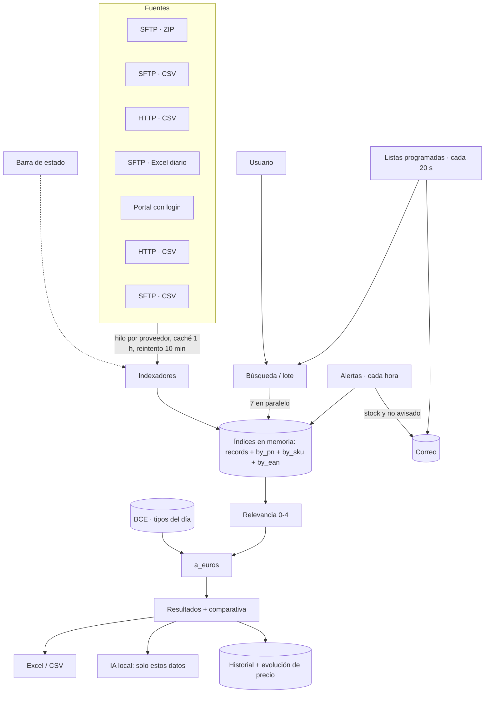

### Código
```python title="01 — Relevancia: cada palabra debe aparecer, y los códigos idénticos van primero"
def _buscar_en_indice(provider_key, termino):
    termino_norm = normalizar_busqueda(termino)
    palabras = [p for p in (normalizar_busqueda(t) for t in termino.split()) if p]
    with INDEX_LOCK:
        registros = PROVIDER_INDEX.get(provider_key, {}).get('records', [])
    puntuados = []
    for r in registros:
        idx = r.get('_idx', '')
        if termino_norm not in idx and not all(p in idx for p in palabras):
            continue
        codigos = [c for c in (normalizar_busqueda(r.get('part_number')),
                               normalizar_busqueda(r.get('sku')),
                               normalizar_busqueda(r.get('ean'))) if c]
        if termino_norm in codigos:                          nivel = 0   # exacta
        elif any(c.startswith(termino_norm) for c in codigos): nivel = 1
        elif any(termino_norm in c for c in codigos):        nivel = 2
        elif termino_norm in idx:                            nivel = 3
        else:                                                nivel = 4   # palabras en otro orden
        puntuados.append((nivel, r))
    puntuados.sort(key=lambda x: x[0])                       # estable
    return [_resultado_publico(r, 'exacta' if n == 0 else 'codigo' if n <= 2 else 'texto')
            for n, r in puntuados[:MAX_RESULTADOS_POR_PROVEEDOR]]
```

```python title="02 — Todo en euros, sin perder el rastro: precio original, moneda, tipo y fecha"
def a_euros(reg):
    moneda = (reg.get('moneda') or 'EUR').strip().upper()
    if moneda == 'EUR':
        return reg
    precio = parsear_precio(reg)
    if precio <= 0:
        return dict(reg, moneda='EUR', moneda_original=moneda)
    fx = obtener_tipos_cambio()                     # XML diario del BCE, caché 6 h
    tasa = fx['tasas'].get(moneda)
    if not tasa:                                    # sin cambio: no se compara con los de EUR
        return dict(reg, precio='', moneda='EUR', precio_original=reg.get('precio'),
                    moneda_original=moneda, sin_conversion=True)
    return dict(reg, precio=str(round(precio / tasa, 2)), moneda='EUR',
                precio_original=reg.get('precio'), moneda_original=moneda,
                tipo_cambio=tasa, fecha_cambio=fx.get('fecha'))
```

```python title="03 — Alertas que no mienten: solo se rearman si todos los mayoristas tienen datos al día"
for alerta in alertas:
    if not alerta.get('activa', True):
        continue
    pn, email = alerta['part_number'].strip(), alerta['email'].strip()
    ya_avisado = alerta.get('avisado', False)
    con_stock = buscar_pn_exacto(pn)
    if con_stock and not ya_avisado:
        if enviar_email_alerta(email, pn, con_stock):
            alerta['avisado'] = True
            alerta['ultima_alerta'] = ahora
    elif not con_stock and ya_avisado and not proveedores_sin_datos_al_dia():
        alerta['avisado'] = False      # un mayorista caído no provoca un segundo aviso
    alerta['ultima_revision'] = ahora
```

### Animación
```json animacion
{
  "duration": 11,
  "aspect": "16:9",
  "concept": { "es": "Siete portales en una sola caja de búsqueda", "en": "Seven portals in a single search box" },
  "elements": [
    { "id": "buscador", "type": "formulario", "label": "🔍 threadripper 9980x", "position": "arriba-centro" },
    { "id": "may", "type": "servidor", "label": "Mayorista A…G", "position": "abajo (fila de 7)" },
    { "id": "res", "type": "tabla", "label": "Resultados", "position": "centro" },
    { "id": "corona", "type": "icono", "label": "🏆 Mejor precio con stock", "position": "centro-derecha" },
    { "id": "fx", "type": "icono", "label": "USD → EUR (BCE)", "position": "derecha" },
    { "id": "ia", "type": "chat", "label": "Preguntar", "position": "abajo-derecha" },
    { "id": "mail", "type": "correo", "label": "✅ Stock disponible", "position": "abajo-izquierda" }
  ],
  "beats": [
    { "t": 0.4, "action": "fila de siete servidores genéricos con chips de estado: seis verdes y uno naranja «copia de ayer»" },
    { "t": 1.4, "action": "se teclea «threadripper 9980x» letra a letra en la caja de búsqueda" },
    { "t": 2.4, "action": "siete rayos cian salen a la vez hacia los servidores y vuelven en menos de un segundo" },
    { "t": 3.4, "action": "la tabla se llena; las filas con etiqueta «exacta» suben arriba con una animación de reordenación" },
    { "t": 4.6, "action": "en una fila, un chip «$ 9.899» gira y se convierte en «8.452 € · BCE» (datos de ejemplo)" },
    { "t": 5.8, "action": "aparece una corona dorada sobre «Mayorista C · 8.199 € · stock 4» (ejemplo)" },
    { "t": 7.0, "action": "en el panel de IA se escribe «¿la más barata con stock inmediato?» y responde citando proveedor y precio" },
    { "t": 8.4, "action": "transición a la pestaña Búsqueda masiva: 120 códigos pegados se procesan en ráfaga y sale un Excel" },
    { "t": 9.6, "action": "un sobre «✅ Stock disponible: PN-EJEMPLO» vuela desde abajo: una alerta se ha cumplido" },
    { "t": 10.5, "action": "zoom out con el texto «7 mayoristas · 1 búsqueda · en euros»" }
  ],
  "sampleData": { "nota": "precios, stock, nombres de mayorista y códigos inventados" },
  "palette": "oscuro #05070a, ámbar #f2a93b (sistema), cian #5cc8d6 (datos), verde #52d18e (ok), rojo #ef5b4c (alerta)"
}
```
<!-- project:end -->

<!-- project:begin slug="buscador-stock-mayorista-europeo" -->
## Buscador de stock de un mayorista europeo

```json ficha
{
  "slug": "buscador-stock-mayorista-europeo",
  "name": "Buscador de stock de un mayorista europeo",
  "kind": "herramienta",
  "parent": "suite-compras",
  "tools": [],
  "department": ["compras"],
  "category": "datos",
  "lifecycle": "activo",
  "status": "produccion",
  "evolvedFrom": null,
  "tagline": { "es": "Consulta rápida del catálogo de dos almacenes europeos de un mismo mayorista", "en": "Quick lookup of a wholesaler's catalogue in two European warehouses" },
  "summary": { "es": "Una web mínima que descarga al momento los catálogos de dos almacenes (en dos países) de un mayorista especializado y busca en ellos por código exacto o por nombre y marca.", "en": "A minimal web page that downloads on demand the catalogues of a specialist wholesaler's two warehouses (in two countries) and searches them by exact code or by name and brand." },
  "problem": { "es": "Este mayorista publica su tarifa en dos ficheros con formatos distintos según el almacén; consultarlos suponía abrir dos CSV enormes.", "en": "This wholesaler publishes its price list as two files with different formats per warehouse; checking them meant opening two huge CSVs." },
  "solution": { "es": "Descargar ambos CSV, buscar primero coincidencias exactas por SKU, EAN o código de fabricante y, si no hay, buscar de forma flexible en nombre y marca.", "en": "Download both CSVs, look first for exact SKU, EAN or manufacturer-code matches and, failing that, search flexibly in name and brand." },
  "howItWorks": [
    { "title": { "es": "Buscar", "en": "Search" }, "text": { "es": "Se escribe un código o un texto.", "en": "Type a code or text." } },
    { "title": { "es": "Descarga y lectura", "en": "Download and parse" }, "text": { "es": "Se descargan los dos CSV y se leen con su separador y sus columnas.", "en": "Both CSVs are downloaded and parsed with their own separator and columns." } },
    { "title": { "es": "Resultados por almacén", "en": "Results per warehouse" }, "text": { "es": "Se muestran por separado, indicando en qué campo coincidió.", "en": "Shown separately, stating which field matched." } }
  ],
  "features": [
    { "es": "Coincidencia exacta normalizada (sin espacios ni guiones) en SKU, EAN y código de fabricante", "en": "Normalised exact match (no spaces or dashes) on SKU, EAN and manufacturer code" },
    { "es": "Búsqueda flexible en producto y marca", "en": "Flexible search in product and brand" },
    { "es": "Página de depuración para ver cómo se interpretó una búsqueda", "en": "Debug page to see how a search was interpreted" }
  ],
  "automations": [],
  "integrations": ["CSV por HTTP del mayorista"],
  "ai": { "used": false, "where": { "es": "", "en": "" }, "local": true, "models": [] },
  "users": { "es": "Equipo de compras", "en": "Purchasing team" },
  "stack": ["python", "flask", "csv"],
  "stackOther": ["requests"],
  "metrics": [ { "label": { "es": "Almacenes consultados", "en": "Warehouses queried" }, "value": "2", "real": true } ],
  "businessValue": { "es": "Respuesta en segundos sobre un proveedor especializado que no está en el buscador multimayorista.", "en": "Answers in seconds about a specialist supplier that is not in the multi-wholesaler search." },
  "complexity": 2,
  "impressiveness": 3,
  "featured": false,
  "sensitivity": "baja",
  "visualLoop": { "es": "Dos banderas genéricas de almacén; una búsqueda las ilumina a la vez y aparecen dos columnas de resultados.", "en": "Two generic warehouse flags; a search lights both and two result columns appear." },
  "notes": "Precursor sencillo del buscador multimayorista; se mantiene porque este proveedor no está integrado en él. Hay un script auxiliar de descarga multiproveedor que se reutilizó después en el buscador grande."
}
```

### Qué es
Una herramienta pequeña y directa para consultar el catálogo de **un mayorista europeo especializado** que tiene dos almacenes en dos países, cada uno con su propio fichero de tarifa.

### El problema que resuelve
Los dos ficheros tienen columnas y separadores distintos y miles de filas. Buscar un producto en ellos con Excel era lento y propenso a errores.

### Cómo se usa
1. Se abre la web.
2. Se escribe un SKU, un EAN, un código de fabricante o un texto (producto o marca).
3. Se ven los resultados de cada almacén por separado, con el campo en el que coincidió: SKU, EAN, MPN, producto o marca.

### Qué hace solo
Nada programado: descarga los ficheros al buscar, así que los datos siempre están al día.

### Cómo funciona por dentro
- Normalización del término: mayúsculas, sin espacios ni guiones.
- Primero se busca la **coincidencia exacta** en los campos de código. Si no la hay, se busca el **texto contenido** en el nombre y la marca.
- Cada almacén tiene su función de lectura porque los formatos no coinciden.

### Interfaz
Un buscador y dos bloques de resultados, más una ruta de depuración que muestra cómo se interpretó el término.

### Inteligencia artificial
No usa.

### Fiabilidad y seguridad
Si un fichero no se puede descargar, lo indica en ese almacén sin romper el otro.

### Qué aporta a una empresa
Un acceso rápido a un proveedor de nicho, sin esperar a integrarlo en el sistema grande.

### Retos técnicos resueltos
Leer dos variantes del mismo catálogo con columnas distintas.

### Evolución
Fue la primera prueba del concepto «buscar en catálogos de proveedor desde una web». Su descargador multiproveedor (SFTP, HTTP y scraping) es el germen del buscador multimayorista.

### Diagrama
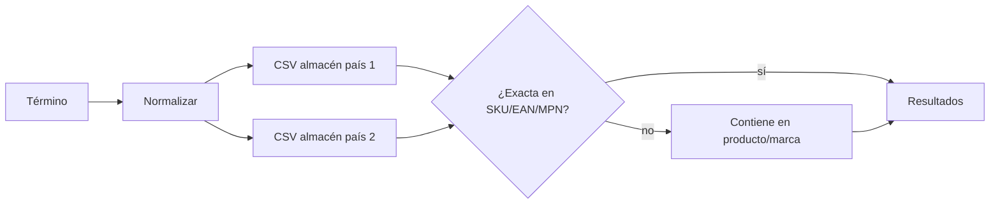

### Código
```python title="01 — Primero lo exacto en códigos; si no, lo aproximado en textos"
termino_norm = normalizar_busqueda(termino_busqueda)          # mayúsculas, sin espacios ni guiones
for row in csv.DictReader(StringIO(csv_text), delimiter=';'):
    campos_exactos = [('sku', row.get('sku', '')), ('ean', row.get('EAN', '')), ('mpn', row.get('mpn', ''))]
    campos_flexibles = [('producto', row.get('product', '')), ('marca', row.get('brand', ''))]
    encontrado, campo_match = False, ''
    for nombre_campo, valor_campo in campos_exactos:          # 1) exacto en códigos
        if normalizar_busqueda(valor_campo) == termino_norm:
            encontrado, campo_match = True, nombre_campo.upper()
            break
    if not encontrado:                                         # 2) contenido en nombre o marca
        for nombre_campo, valor_campo in campos_flexibles:
            if termino_norm in normalizar_busqueda(valor_campo):
                encontrado, campo_match = True, nombre_campo.upper()
                break
    if encontrado:
        resultados.append({'sku': row.get('sku', ''), 'producto': row.get('product', ''),
                           'stock': row.get('Stock', '0'), 'campo_coincidente': campo_match})
        if len(resultados) >= 100:                             # límite por almacén
            break
```

### Animación
```json animacion
{
  "duration": 6,
  "aspect": "16:9",
  "concept": { "es": "Un proveedor, dos almacenes, una búsqueda", "en": "One supplier, two warehouses, one search" },
  "elements": [
    { "id": "q", "type": "formulario", "label": "Buscar", "position": "arriba" },
    { "id": "a1", "type": "tabla", "label": "Almacén país 1", "position": "izquierda" },
    { "id": "a2", "type": "tabla", "label": "Almacén país 2", "position": "derecha" }
  ],
  "beats": [
    { "t": 0.5, "action": "se escribe «CASE-EJEMPLO-01»" },
    { "t": 2.0, "action": "dos columnas se llenan a la vez; una fila muestra la etiqueta «SKU»" },
    { "t": 3.5, "action": "en la otra columna la coincidencia se marca «PRODUCTO» (búsqueda flexible)" },
    { "t": 5.0, "action": "aparece el texto «2 almacenes · 1 búsqueda»" }
  ],
  "sampleData": { "nota": "códigos inventados" },
  "palette": "oscuro #05070a, ámbar #f2a93b, cian #5cc8d6, verde #52d18e, rojo #ef5b4c"
}
```
<!-- project:end -->

<!-- project:begin slug="radar-tarifas-proveedor" -->
## Radar de tarifas de proveedor

```json ficha
{
  "slug": "radar-tarifas-proveedor",
  "name": "Radar de tarifas de proveedor",
  "kind": "herramienta",
  "parent": "suite-compras",
  "tools": [],
  "department": ["compras"],
  "category": "ia",
  "lifecycle": "activo",
  "status": "produccion",
  "evolvedFrom": null,
  "tagline": { "es": "Sube la tarifa del proveedor y ve al instante qué ha subido, cuánto y si es peligroso, antes de tocar el ERP", "en": "Upload the supplier's price list and instantly see what went up, by how much and whether it is dangerous, before touching the ERP" },
  "summary": { "es": "Compara cada precio de una tarifa de proveedor con el coste actual del ERP, colorea las variaciones como un semáforo, excluye los artículos en lista negra, pide a una IA local un resumen ejecutivo y, tras la revisión, actualiza los costes en euros y en dólares en el ERP dejando todo en un histórico con gráficas.", "en": "Compares every price in a supplier list with the ERP's current cost, colours the changes like a traffic light, skips blacklisted items, asks a local AI for an executive summary and, after review, updates costs in euros and dollars in the ERP, keeping everything in a history with charts." },
  "problem": { "es": "Actualizar costes a ciegas metía en el ERP subidas del 40 % por un error de la tarifa, y nadie lo veía hasta que salía un presupuesto con margen negativo.", "en": "Updating costs blindly let 40 % jumps caused by a price-list error into the ERP, and nobody noticed until a quote came out with a negative margin." },
  "solution": { "es": "Un paso de revisión obligatorio entre la tarifa y el ERP: semáforo de variaciones, lista negra, IA que señala lo crítico, selección manual de qué importar y registro de cada actualización.", "en": "A mandatory review step between the list and the ERP: change traffic light, blacklist, AI pointing out what is critical, manual selection of what to import and a log of every update." },
  "howItWorks": [
    { "title": { "es": "Subir el Excel", "en": "Upload the spreadsheet" }, "text": { "es": "El Excel normalizado (part number, nombre, precio, moneda, EAN, EOL) y el tipo de cambio EUR/USD del día.", "en": "The normalised spreadsheet (part number, name, price, currency, EAN, EOL) and the day's EUR/USD rate." } },
    { "title": { "es": "Cruce con el ERP", "en": "ERP match" }, "text": { "es": "Cada part number se busca en cascada en el código principal, el secundario y el del proveedor.", "en": "Each part number is looked up in cascade by the main, secondary and supplier code." } },
    { "title": { "es": "Semáforo", "en": "Traffic light" }, "text": { "es": "Rojo si sube más de un 20 %, ámbar entre 10 y 20 %, verde entre -10 y +10 %, azul si baja entre 10 y 20 % y morado si baja más de un 20 %.", "en": "Red above +20 %, amber +10-20 %, green -10 to +10 %, blue -10 to -20 %, purple below -20 %." } },
    { "title": { "es": "Análisis IA", "en": "AI analysis" }, "text": { "es": "La IA escribe en directo un resumen con alertas críticas, impacto y recomendaciones.", "en": "The AI streams a summary with critical alerts, impact and recommendations." } },
    { "title": { "es": "Confirmar", "en": "Confirm" }, "text": { "es": "Se desmarcan los que no se quieren y se aplican el resto; queda un registro con el detalle.", "en": "Untick what you do not want and apply the rest; a detailed record is kept." } }
  ],
  "features": [
    { "es": "Semáforo de cinco niveles de variación", "en": "Five-level change traffic light" },
    { "es": "Conversión EUR ↔ USD y actualización de las dos monedas en el ERP", "en": "EUR ↔ USD conversion and update of both currencies in the ERP" },
    { "es": "Lista negra de part numbers que nunca se actualizan, con buscador", "en": "Searchable blacklist of part numbers that are never updated" },
    { "es": "Detección de artículos que no existen en el ERP", "en": "Detection of items that do not exist in the ERP" },
    { "es": "Resumen ejecutivo IA en streaming", "en": "Streaming AI executive summary" },
    { "es": "Histórico de actualizaciones con detalle por artículo", "en": "Update history with per-item detail" },
    { "es": "Gráficas de evolución del coste de uno o varios part numbers", "en": "Cost-evolution charts for one or more part numbers" }
  ],
  "automations": [],
  "integrations": ["ERP (SQL Server)", "IA local (Ollama)"],
  "ai": { "used": true, "where": { "es": "Resumen ejecutivo del lote: alertas críticas (> 20 %), impacto estimado, recomendaciones y artículos a revisar, en un máximo de 300 palabras", "en": "Batch executive summary: critical alerts (> 20 %), estimated impact, recommendations and items to review, in up to 300 words" }, "local": true, "models": ["qwen3 (~27B) vía Ollama, temperatura 0,25"] },
  "users": { "es": "Equipo de compras", "en": "Purchasing team" },
  "stack": ["python", "flask", "sqlserver", "erp", "ollama", "qwen", "llm", "excel"],
  "stackOther": ["openpyxl", "bcrypt", "Server-Sent Events", "Chart.js"],
  "metrics": [
    { "label": { "es": "Umbral de subida crítica", "en": "Critical rise threshold" }, "value": "> 20 %", "real": true },
    { "label": { "es": "Niveles del semáforo", "en": "Traffic-light levels" }, "value": "5 + sin datos + lista negra", "real": true }
  ],
  "businessValue": { "es": "Ningún error de tarifa llega al ERP sin que alguien lo haya visto en rojo; se protege el margen de todo lo que se fabrica y se vende después.", "en": "No price-list error reaches the ERP without someone seeing it in red; it protects the margin of everything built and sold afterwards." },
  "complexity": 6,
  "impressiveness": 8,
  "featured": false,
  "sensitivity": "baja",
  "visualLoop": { "es": "Un Excel se abre en tabla; una línea de escaneo cian la recorre y las filas se tiñen de verde, ámbar y rojo; una burbuja de IA dice «2 subidas críticas en memorias».", "en": "A spreadsheet opens as a table; a cyan scan line sweeps it and rows turn green, amber and red; an AI bubble says '2 critical rises in memory'." },
  "notes": "Los precios se actualizan artículo a artículo con su propia confirmación: un error en uno no detiene el resto, y queda en el detalle del histórico."
}
```

### Qué es
Es la **aduana entre las tarifas de los proveedores y el ERP**. Recibe el Excel normalizado que produce la mesa de procesado, lo compara con los costes que el ERP tiene en ese momento y no deja que nada se actualice sin pasar por una revisión visual y, si se quiere, por la opinión de una IA.

### El problema que resuelve
Un coste mal actualizado tiene un efecto en cadena:
- el escandallo del equipo sale mal;
- el margen calculado es falso;
- el comercial vende por debajo de coste;
- y se descubre semanas después.

Las causas típicas son una tarifa con el precio en dólares marcado como euros, un cero de más o un producto equivocado.

### Cómo se usa
1. Se entra con el usuario común del ecosistema. Hace falta tener categoría de compras o ser administrador.
2. Se sube el Excel e se indica el tipo de cambio EUR/USD.
3. Se abre la **vista previa**, una tabla con:
   - part number, nombre, coste actual en el ERP, precio nuevo, moneda y variación %;
   - un **color de semáforo** por fila;
   - un estado: ok, no existe en el ERP o en lista negra.
4. Se pulsa **Analizar con IA** y el resumen se escribe en directo.
5. Se desmarcan las filas que no se quieren importar y se pulsa **Confirmar**.
6. Se consulta el resultado en **Historial**, donde cada aplicación tiene usuario, fecha, tipo de cambio, actualizados, errores y detalle.
7. En **Gráficas** se elige uno o varios part numbers y un rango de fechas para ver cómo ha evolucionado su coste.
8. En **Lista negra** se añaden o quitan part numbers protegidos.

### Qué hace solo
Nada programado: es una herramienta de revisión bajo demanda.

### Cómo funciona por dentro
- **Lectura:** columnas fijas A-F (part number, nombre, precio, moneda, EAN, EOL). Se salta la cabecera y las filas vacías.
- **Búsqueda en cascada en el ERP:** primero el código principal del artículo, después el código secundario y por último el código de proveedor. Así se encuentran artículos dados de alta con distintas convenciones.
- **Precio actual:** se lee el coste de última compra en la moneda que corresponda.
- **Divisas:** si la tarifa viene en USD, el precio en euros es precio / cambio y el de dólares es el original. Si viene en euros, al revés. Se actualizan **las dos** tablas de coste del ERP (la general en euros y la de divisa en dólares).
- **Importables:** solo los que existen en el ERP y no están en la lista negra.
- **IA:** se resumen los datos (totales, críticos, avisos, variación media, top 10 subidas y top 5 bajadas) y se envía un *prompt* con formato fijo en cinco apartados. La respuesta se transmite en streaming con Server-Sent Events.
- **Aplicación:** un `UPDATE` por artículo con su `commit`. Si falla uno, se hace `rollback` de ese y se sigue con los demás. Todo se guarda en un histórico JSON.

### Interfaz
- **Panel:** subida del Excel y campo de tipo de cambio.
- **Vista previa:** tabla con chips de semáforo (rojo, ámbar, verde, azul y morado), casillas de importación y contadores arriba (importables, críticos, avisos, lista negra y errores).
- **Panel de IA:** el texto aparece palabra a palabra.
- **Historial:** listado de aplicaciones y página de detalle.
- **Gráficas:** líneas de evolución por part number, con selector múltiple y fechas.
- **Lista negra:** buscador con añadir y quitar.

### Inteligencia artificial
El modelo actúa como un **analista de compras** que recibe solo cifras agregadas y los extremos del lote. Se le pide un formato fijo:
1. resumen ejecutivo;
2. alertas críticas;
3. impacto estimado;
4. recomendaciones;
5. artículos a revisar.

Se usa una temperatura baja (0,25) y un máximo de unas 600 piezas de texto para que sea concreto. La IA no decide qué se aplica: lo decide la persona.

### Fiabilidad y seguridad
- Acceso restringido a compras y administración.
- La lista negra protege artículos con precios pactados o especiales.
- Los artículos que no existen en el ERP nunca se aplican.
- Cada actualización queda registrada con usuario, fecha y valores anteriores y nuevos.

### Qué aporta a una empresa
Un control de calidad sistemático sobre el dato más sensible de una empresa que fabrica: **el coste de los componentes**.

### Retos técnicos resueltos
- Encontrar el artículo correcto cuando los proveedores usan códigos distintos.
- Mantener coherentes dos monedas en dos tablas.
- Dar a la IA un contexto pequeño y útil en lugar de miles de filas.

### Evolución
Nació para sustituir la actualización manual de costes. El siguiente paso es aplicar en una única transacción con vuelta atrás completa, como ya hacen las herramientas de la suite de costes.

### Diagrama
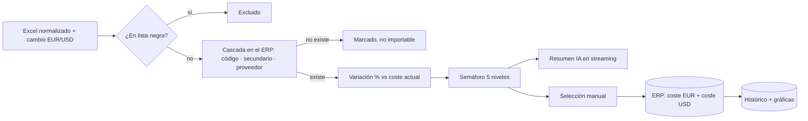

### Código
```python title="01 — Encontrar el artículo aunque el proveedor use otro código: búsqueda en cascada"
def buscar_codart(cursor, part_number):
    pn = str(part_number).strip()
    # Intento 1: código principal del artículo
    try:
        cursor.execute("SELECT RTRIM(codigo) FROM articulos WHERE codigo = ?", pn)
        row = cursor.fetchone()
        if row and row[0] and row[0].strip():
            return row[0].strip()
    except Exception:
        pass
    # Intento 2: código secundario
    try:
        cursor.execute("SELECT RTRIM(codigo) FROM articulos WHERE codigo_secundario = ?", pn)
        row = cursor.fetchone()
        if row and row[0] and row[0].strip():
            return row[0].strip()
    except Exception:
        pass
    # Intento 3: código del proveedor (misma estructura)
    ...
    return None
```

### Animación
```json animacion
{
  "duration": 6,
  "aspect": "16:9",
  "concept": { "es": "Una aduana con semáforo entre el proveedor y el ERP", "en": "A traffic-light customs gate between the supplier and the ERP" },
  "elements": [
    { "id": "excel", "type": "archivo", "label": "tarifa_normalizada.xlsx", "position": "izquierda" },
    { "id": "tabla", "type": "tabla", "label": "Vista previa", "position": "centro" },
    { "id": "ia", "type": "chat", "label": "IA", "position": "derecha-arriba" },
    { "id": "erp", "type": "servidor", "label": "ERP", "position": "derecha" }
  ],
  "beats": [
    { "t": 0.5, "action": "el Excel entra deslizándose desde la izquierda y se despliega en tabla" },
    { "t": 1.8, "action": "una línea de escaneo cian baja por la tabla; las filas se tiñen: 180 verdes, 12 ámbar, 2 rojas «+24 %» (ejemplo)" },
    { "t": 3.2, "action": "la burbuja de IA escribe «2 subidas críticas en memorias DDR5; revisar antes de aplicar»" },
    { "t": 4.6, "action": "se desmarcan las 2 rojas, se pulsa «Confirmar» y 192 filas viajan al ERP con un check verde" }
  ],
  "sampleData": { "nota": "recuentos y porcentajes inventados" },
  "palette": "oscuro #05070a, ámbar #f2a93b, cian #5cc8d6, verde #52d18e, rojo #ef5b4c"
}
```
<!-- project:end -->

<!-- project:begin slug="sincronizador-costes-portal" -->
## Sincronizador de costes con el portal

```json ficha
{
  "slug": "sincronizador-costes-portal",
  "name": "Sincronizador de costes con el portal",
  "kind": "herramienta",
  "parent": "suite-compras",
  "tools": [],
  "department": ["compras"],
  "category": "automatizacion",
  "lifecycle": "activo",
  "status": "produccion",
  "evolvedFrom": "Un «compilador» de precios que se mantenía a mano",
  "tagline": { "es": "Un botón que copia todos los costes del ERP a la base de datos del portal de clientes", "en": "One button that copies every cost from the ERP to the customer portal's database" },
  "summary": { "es": "Lee del ERP el coste medio y el de última compra de todos los artículos, los vuelca en la tabla que usa el portal B2B para calcular precios, genera un Excel con lo copiado y lo envía por correo.", "en": "Reads the average and last-purchase cost of every item from the ERP, writes them to the table the B2B portal uses to compute prices, generates a spreadsheet of what was copied and emails it." },
  "problem": { "es": "El portal de clientes calcula sus precios a partir de los costes, pero vive en otra base de datos; mantenerlos sincronizados dependía de un proceso manual de otra persona.", "en": "The customer portal computes its prices from costs but lives in another database; keeping them in sync depended on someone else's manual process." },
  "solution": { "es": "Una web con login restringido a compras que hace la copia completa en un clic, con justificante en Excel y aviso por correo.", "en": "A web page restricted to purchasing that performs the full copy in one click, with a spreadsheet receipt and an email notification." },
  "howItWorks": [
    { "title": { "es": "Entrar", "en": "Log in" }, "text": { "es": "Solo usuarios con la categoría de compras o administradores.", "en": "Only users in the purchasing category or admins." } },
    { "title": { "es": "Importar", "en": "Import" }, "text": { "es": "Se vacía la tabla de enlace del portal y se rellena con código, descripción, coste medio y coste de última compra de cada artículo.", "en": "The portal's link table is emptied and refilled with code, description, average cost and last-purchase cost for every item." } },
    { "title": { "es": "Justificante", "en": "Receipt" }, "text": { "es": "Se genera un Excel con todo lo copiado y se envía por correo junto al usuario y la hora.", "en": "A spreadsheet of everything copied is generated and emailed with the user and time." } }
  ],
  "features": [
    { "es": "Copia completa ERP → portal en una operación", "en": "Full ERP → portal copy in one operation" },
    { "es": "Limpieza de valores no numéricos o vacíos (se convierten en 0)", "en": "Cleaning of non-numeric or empty values (converted to 0)" },
    { "es": "Excel de justificante y correo de confirmación", "en": "Receipt spreadsheet and confirmation email" },
    { "es": "Acceso por categoría de usuario", "en": "Access by user category" }
  ],
  "automations": [ { "trigger": "manual", "action": { "es": "Sincronización completa con justificante", "en": "Full sync with receipt" } } ],
  "integrations": ["ERP (SQL Server)", "Base de datos del portal B2B (SQL Server)", "Correo Office 365"],
  "ai": { "used": false, "where": { "es": "", "en": "" }, "local": true, "models": [] },
  "users": { "es": "Equipo de compras", "en": "Purchasing team" },
  "stack": ["python", "flask", "sqlserver", "erp", "excel", "email", "etl"],
  "stackOther": ["pyodbc", "openpyxl", "bcrypt"],
  "metrics": [ { "label": { "es": "Campos sincronizados por artículo", "en": "Fields synced per item" }, "value": "4", "real": true } ],
  "businessValue": { "es": "Los precios que ve el cliente en el portal se calculan siempre sobre costes actuales, sin depender de una persona.", "en": "Prices customers see on the portal are always computed from current costs, without depending on one person." },
  "complexity": 3,
  "impressiveness": 4,
  "featured": false,
  "sensitivity": "baja",
  "visualLoop": { "es": "Dos bases de datos unidas por una tubería; al pulsar un botón fluyen miles de puntos de una a otra y sale un sobre con un Excel.", "en": "Two databases joined by a pipe; pressing a button sends thousands of dots across and an envelope with a spreadsheet pops out." },
  "notes": "Nombres de base de datos y tabla generalizados. La copia es completa (vaciar y rellenar), no incremental."
}
```

### Qué es
Un **puente de datos de un solo sentido** entre el ERP, donde viven los costes reales, y la base de datos del portal B2B de clientes, que usa esos costes y sus márgenes para calcular los precios que ve cada cliente.

### El problema que resuelve
Si los costes del portal se quedaban atrasados, el portal podía mostrar precios por debajo del coste real. La sincronización la hacía otra persona con un proceso manual, que era lento y dependía de su disponibilidad.

### Cómo se usa
1. Se entra con el usuario común (solo compras o administración).
2. Se pulsa **Importar precios**.
3. Al terminar se ve el total de artículos copiados y llega un correo «✅ Importación de Precios Completada» con el Excel adjunto.

### Qué hace solo
No tiene tareas programadas: la sincronización se lanza cuando el equipo de compras ha terminado de actualizar costes.

### Cómo funciona por dentro
1. Se abren dos conexiones, al ERP y a la base de datos del portal.
2. Se leen, para todos los artículos, el código, la descripción, el coste medio y el coste de última compra.
3. Se vacía la tabla de enlace del portal.
4. Se inserta artículo a artículo. Los valores nulos o no numéricos se convierten en 0.
5. Se genera el Excel y se envía el correo.

### Interfaz
Pantalla de acceso y un panel con un único botón y un indicador de progreso giratorio.

### Inteligencia artificial
No usa.

### Fiabilidad y seguridad
- Acceso por categoría de usuario.
- El ERP solo se lee.
- Cada sincronización deja un justificante por correo.

### Qué aporta a una empresa
Precios coherentes entre el sistema interno y lo que ve el cliente.

### Retos técnicos resueltos
Limpieza de datos heredados, como valores «NeuN» o nulos en campos de coste, antes de escribirlos en otra base de datos.

### Evolución
Sustituyó al compilador manual. Mejoras posibles: sincronización incremental y ejecución programada nada más terminar el radar de tarifas.

### Diagrama
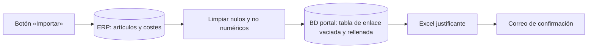

### Código
```python title="01 — Copia completa de costes del ERP a la tabla del portal, limpiando valores corruptos"
cur_erp.execute("SELECT codigo, descripcion, coste_medio, coste_ultima_compra FROM articulos")
articulos = cur_erp.fetchall()
cur_portal.execute("DELETE FROM enlace_costes")
conn_portal.commit()
for codigo, descripcion, coste_medio, coste_ultima in articulos:
    if coste_medio is None or str(coste_medio) == 'NeuN':
        coste_medio = 0
    coste_ultima = coste_ultima or 0
    cur_portal.execute("INSERT INTO enlace_costes VALUES (?, ?, ?, ?)",
                       (codigo, descripcion, coste_medio, coste_ultima))
conn_portal.commit()
```

### Animación
```json animacion
{
  "duration": 6,
  "aspect": "16:9",
  "concept": { "es": "Un clic mantiene al portal al día", "en": "One click keeps the portal up to date" },
  "elements": [
    { "id": "erp", "type": "servidor", "label": "ERP", "position": "izquierda" },
    { "id": "portal", "type": "servidor", "label": "Portal B2B", "position": "derecha" },
    { "id": "boton", "type": "icono", "label": "Importar", "position": "centro" }
  ],
  "beats": [
    { "t": 0.5, "action": "dos servidores separados; el del portal muestra precios en gris «desactualizados»" },
    { "t": 1.8, "action": "se pulsa «Importar» y fluye un río de puntos cian de izquierda a derecha" },
    { "t": 3.4, "action": "un contador sube hasta «12.480 artículos» (ejemplo)" },
    { "t": 4.8, "action": "el portal se vuelve verde y sale un sobre con un Excel" }
  ],
  "sampleData": { "nota": "recuento inventado" },
  "palette": "oscuro #05070a, ámbar #f2a93b, cian #5cc8d6, verde #52d18e, rojo #ef5b4c"
}
```
<!-- project:end -->

<!-- project:begin slug="agente-ia-correos-ofertas" -->
## Agente IA de correos de ofertas

```json ficha
{
  "slug": "agente-ia-correos-ofertas",
  "name": "Agente IA de correos de ofertas",
  "kind": "herramienta",
  "parent": "suite-compras",
  "tools": [],
  "department": ["compras"],
  "category": "ia",
  "lifecycle": "activo",
  "status": "produccion",
  "evolvedFrom": "Un organizador de correos por IA más general (archivado)",
  "tagline": { "es": "Pregúntale a tu bandeja de entrada qué proveedor te ofreció mejor precio la semana pasada", "en": "Ask your inbox which supplier offered you the best price last week" },
  "summary": { "es": "Cada persona de compras conecta su correo de Microsoft 365, elige carpetas y fechas y la herramienta carga esos correos. Después puede chatear con una IA local que responde citando de qué correo sale cada dato: precios, part numbers, ofertas y proveedores con los que conviene hablar.", "en": "Each buyer connects their Microsoft 365 mailbox, picks folders and dates, and the tool loads those emails. Then they can chat with a local AI that answers citing which email each fact comes from: prices, part numbers, offers and suppliers worth talking to." },
  "problem": { "es": "Los proveedores envían ofertas, listas y promociones por correo a diario. Encontrar «aquella oferta de GPU de hace dos semanas» o comparar tres ofertas era buscar a mano entre cientos de mensajes.", "en": "Suppliers send offers, lists and promotions by email every day. Finding 'that GPU offer from two weeks ago' or comparing three offers meant searching hundreds of messages by hand." },
  "solution": { "es": "Cargar un subconjunto controlado de correos (carpetas y fechas), limpiarlos, construir con ellos el contexto del modelo y mantener conversaciones guardadas sobre ellos.", "en": "Load a controlled subset of emails (folders and dates), clean them, build the model context from them and keep saved conversations about them." },
  "howItWorks": [
    { "title": { "es": "Conectar el correo", "en": "Connect mailbox" }, "text": { "es": "Se autoriza la cuenta con el código de dispositivo de Microsoft; el token se guarda cifrado con una clave propia del usuario.", "en": "The account is authorised with Microsoft's device-code flow; the token is stored encrypted with a per-user key." } },
    { "title": { "es": "Elegir carpetas y fechas", "en": "Choose folders and dates" }, "text": { "es": "Se seleccionan las carpetas de proveedores y un rango de fechas; la carga se hace en segundo plano con progreso y botón de parar.", "en": "Supplier folders and a date range are selected; loading runs in the background with progress and a stop button." } },
    { "title": { "es": "Preguntar", "en": "Ask" }, "text": { "es": "Se chatea con la IA; cada respuesta indica remitente, fecha y asunto de los correos usados.", "en": "You chat with the AI; each answer cites sender, date and subject of the emails used." } }
  ],
  "features": [
    { "es": "Multiusuario: cada persona con su propia cuenta de correo cifrada", "en": "Multi-user: each person with their own encrypted mailbox connection" },
    { "es": "Inicio de sesión con código de dispositivo (sin guardar contraseñas de correo)", "en": "Device-code sign-in (no mailbox passwords stored)" },
    { "es": "Carga por carpetas y rango de fechas, paginada y cancelable", "en": "Paginated, cancellable loading by folder and date range" },
    { "es": "Caché de correos por usuario que se borra sola a los 7 días", "en": "Per-user email cache auto-deleted after 7 days" },
    { "es": "Conversaciones guardadas, consultables y borrables", "en": "Saved, browsable and deletable conversations" },
    { "es": "Permisos de acceso gestionados por un administrador", "en": "Access permissions managed by an admin" }
  ],
  "automations": [ { "trigger": "cada 24 h", "action": { "es": "Limpieza de caché de correos de más de 7 días", "en": "Cleanup of email cache older than 7 days" } } ],
  "integrations": ["Microsoft Graph (correo)", "IA local (Ollama)"],
  "ai": { "used": true, "where": { "es": "Responde preguntas sobre los correos cargados, compara precios entre proveedores y resume ofertas, citando siempre el correo de origen", "en": "Answers questions about the loaded emails, compares supplier prices and summarises offers, always citing the source email" }, "local": true, "models": ["qwen3 (~27B) vía Ollama"] },
  "users": { "es": "Personas del departamento de compras", "en": "Purchasing staff" },
  "stack": ["python", "flask", "ollama", "qwen", "llm", "email", "rag"],
  "stackOther": ["Microsoft Graph", "OAuth 2.0 device code", "cryptography (Fernet)", "bcrypt"],
  "metrics": [
    { "label": { "es": "Contexto máximo de correos por pregunta", "en": "Max email context per question" }, "value": "≈ 28.000 caracteres, priorizando los más recientes", "real": true },
    { "label": { "es": "Historial de chat enviado al modelo", "en": "Chat history sent to the model" }, "value": "últimos 6 mensajes", "real": true },
    { "label": { "es": "Caducidad de la caché", "en": "Cache lifetime" }, "value": "7 días", "real": true }
  ],
  "businessValue": { "es": "Ninguna oferta interesante se pierde en la bandeja, y comparar propuestas de varios proveedores pasa de una tarde a una pregunta.", "en": "No interesting offer gets lost in the inbox, and comparing several suppliers' proposals goes from an afternoon to one question." },
  "complexity": 6,
  "impressiveness": 7,
  "featured": false,
  "sensitivity": "media",
  "visualLoop": { "es": "Una bandeja con cientos de sobres se comprime en una pila; alguien pregunta «¿quién ofreció las GPU más baratas?» y la IA responde con tres tarjetas de correo citadas.", "en": "An inbox with hundreds of envelopes compresses into a stack; someone asks 'who offered the cheapest GPUs?' and the AI answers with three cited email cards." },
  "notes": "Identificadores de aplicación en Microsoft, inquilino y cuentas omitidos."
}
```

### Qué es
Un **asistente de IA sobre el correo del equipo de compras**. No lee todo el buzón ni actúa por su cuenta: la persona elige qué carpetas y qué fechas quiere analizar, y a partir de ahí puede preguntar en lenguaje natural.

### El problema que resuelve
Las ofertas de proveedores llegan por correo en todos los formatos imaginables: tablas en el cuerpo, texto libre, promociones o listas de stock. La información valiosa (un precio puntual, un lote liquidado, un proveedor nuevo con buenas condiciones) se queda enterrada.

### Cómo se usa
1. **Conectar la cuenta (una sola vez).** La herramienta muestra un código y un enlace de Microsoft. Se introduce el código y se autoriza la lectura de correo. No se escribe ninguna contraseña en la herramienta.
2. **Elegir qué cargar.** Se marcan carpetas (por ejemplo, «Proveedores», «Ofertas») y fechas desde/hasta. Se pulsa cargar y se ve el progreso por carpeta. Se puede parar en cualquier momento.
3. **Preguntar.** Ejemplos:
   - «Haz un resumen de las ofertas de esta semana».
   - «¿Quién ha ofrecido memorias DDR5 y a qué precio?».
   - «Compara las ofertas de servidores de los proveedores A y B».
4. **Revisar conversaciones** anteriores, guardadas por usuario, o borrarlas.

### Qué hace solo
- Cada 24 horas borra los ficheros de caché de correos con más de 7 días y las carpetas de usuario vacías.
- La carga de correos corre en un hilo aparte para que la web siga respondiendo.

### Cómo funciona por dentro
- **Autenticación delegada:** se usa el flujo OAuth 2.0 de «código de dispositivo» con el permiso de solo lectura de correo y acceso sin conexión. El token de refresco se cifra con **Fernet**, usando una clave por usuario de la herramienta guardada en su propio fichero.
- **Carga:** llamadas paginadas a Microsoft Graph por carpeta con el filtro `receivedDateTime` entre las fechas elegidas, 200 mensajes por página. El cuerpo HTML se convierte a texto limpio. La clave de caché es un hash de usuario, carpetas y fechas, para no recargar lo mismo.
- **Contexto para la IA:** los correos se convierten en bloques «CORREO #n · carpeta · fecha · de · para · asunto · cuerpo» hasta unos 28.000 caracteres. Si no caben todos, se indica cuántos se han dejado fuera.
- **Prompt:** reglas explícitas:
  - responder en castellano;
  - indicar siempre proveedor, part number, descripción y precio;
  - extraer tablas;
  - comparar cuando sea posible;
  - **no inventar** part numbers ni precios;
  - citar remitente, fecha y asunto;
  - decirlo si no encuentra la información.

  Se incluyen los últimos 6 mensajes del chat. Si el modelo devuelve bloques de «pensamiento», se eliminan antes de mostrar la respuesta.

### Interfaz
- Pantalla de acceso.
- Panel de cuenta con el estado de la conexión, el código de dispositivo, probar y desconectar.
- Árbol de carpetas con casillas y selectores de fecha.
- Barra de progreso de la carga.
- Chat con lista de conversaciones a la izquierda.
- Panel de administración para dar o quitar acceso.

### Inteligencia artificial
Es un patrón tipo **RAG acotado**: en vez de indexar todo el buzón, la persona elige un subconjunto y ese subconjunto se mete en el contexto del modelo local. Así es predecible, rápido y privado: ningún correo sale de la empresa.

### Fiabilidad y seguridad
- Cada usuario solo ve sus propios correos y conversaciones.
- Tokens cifrados en reposo con una clave por usuario.
- Caché con caducidad automática.
- Acceso concedido explícitamente por un administrador.
- Páginas de error 404 y 500 propias, sin trazas técnicas expuestas.

### Qué aporta a una empresa
Convierte el correo, la principal fuente de información comercial de proveedores, en algo consultable y comparable.

### Retos técnicos resueltos
- Autenticación moderna sin guardar contraseñas.
- Límite de contexto del modelo, gestionado priorizando lo reciente e informando de lo que queda fuera.
- Varios usuarios simultáneos, con estado de carga por usuario.

### Evolución
Hereda la conexión a Microsoft 365 y el cifrado por usuario de un organizador de correos con IA anterior, más general, que se archivó. Esta versión se centra en un caso de uso concreto y de alto valor.

### Diagrama
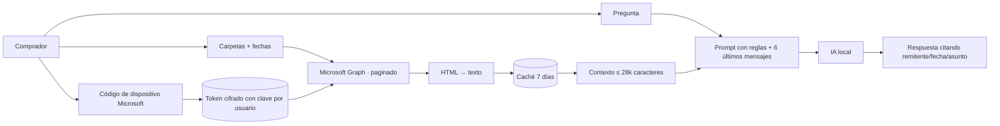

### Código
```python title="01 — Contexto acotado: los correos entran por orden hasta llenar el presupuesto, y se avisa de lo que queda fuera"
def build_email_context(emails, max_chars=28000):
    lines, total = [], 0
    for i, em in enumerate(emails):
        bloque = (f"\n{'═' * 60}\nCORREO #{i+1} | Carpeta: {em['carpeta']}\n"
                  f"Fecha: {em['fecha']}\nDe: {em['de_nombre']} <{em['de_email']}>\n"
                  f"Asunto: {em['asunto']}\n{'─' * 40}\n{em['cuerpo']}\n")
        if total + len(bloque) > max_chars:
            lines.append(f"\n[... {len(emails) - i} correos más no incluidos por límite de contexto ...]\n")
            break
        lines.append(bloque)
        total += len(bloque)
    return "".join(lines)
```

### Animación
```json animacion
{
  "duration": 6,
  "aspect": "16:9",
  "concept": { "es": "Tu bandeja de entrada responde preguntas", "en": "Your inbox answers questions" },
  "elements": [
    { "id": "inbox", "type": "correo", "label": "Bandeja (ejemplo: 340 correos)", "position": "izquierda" },
    { "id": "chat", "type": "chat", "label": "Agente de ofertas", "position": "derecha" }
  ],
  "beats": [
    { "t": 0.5, "action": "se marcan dos carpetas y un rango de fechas; una barra de carga avanza" },
    { "t": 2.0, "action": "los sobres se apilan y se comprimen en un bloque cian «contexto»" },
    { "t": 3.2, "action": "se escribe «¿quién ofreció las GPU más baratas?»" },
    { "t": 4.5, "action": "la IA responde con tres tarjetas: «Proveedor A · 12/09 · Oferta GPU · 1.890 €» (ejemplo)" }
  ],
  "sampleData": { "nota": "todo inventado" },
  "palette": "oscuro #05070a, ámbar #f2a93b, cian #5cc8d6, verde #52d18e, rojo #ef5b4c"
}
```
<!-- project:end -->

<!-- project:begin slug="detector-compras-caras" -->
## Detector de compras por encima de su media

```json ficha
{
  "slug": "detector-compras-caras",
  "name": "Detector de compras por encima de su media",
  "kind": "herramienta",
  "parent": "suite-compras",
  "tools": [],
  "department": ["compras", "direccion"],
  "category": "ia",
  "lifecycle": "activo",
  "status": "produccion",
  "evolvedFrom": null,
  "tagline": { "es": "Encuentra las compras que se pagaron más caras de lo normal y te explica por qué", "en": "Finds purchases that were paid above normal and explains why" },
  "summary": { "es": "Analiza todas las líneas de albaranes de compra, calcula para cada artículo su precio unitario medio histórico y marca las compras que lo superan por encima de un porcentaje. Una IA local revisa cada artículo con anomalías y da un veredicto, un diagnóstico, una causa probable y una acción. Cada noche busca casos nuevos y los manda por correo.", "en": "Analyses every purchase delivery-note line, computes each item's historical average unit price and flags purchases above it by a chosen percentage. A local AI reviews each item with anomalies and gives a verdict, diagnosis, probable cause and action. Every night it looks for new cases and emails them." },
  "problem": { "es": "Entre miles de compras es imposible ver a ojo que un componente se pagó un 35 % más caro que la media; ese sobrecoste pasa directo al margen.", "en": "Among thousands of purchases nobody can spot that a component was paid 35 % above average; that overspend goes straight into the margin." },
  "solution": { "es": "Estadística sencilla (media y umbral por artículo) para detectar, una IA para explicar y priorizar, y un panel de revisión para que una persona deje constancia de qué era correcto, anómalo o justificado.", "en": "Simple statistics (average and threshold per item) to detect, an AI to explain and prioritise, and a review panel where a person records whether it was correct, anomalous or justified." },
  "howItWorks": [
    { "title": { "es": "Filtrar", "en": "Filter" }, "text": { "es": "Por fecha de alta del artículo, por años de albarán y por el porcentaje a partir del cual una compra es anómala (10 % por defecto).", "en": "By item creation date, delivery-note years and the percentage above which a purchase is anomalous (10 % by default)." } },
    { "title": { "es": "Calcular", "en": "Compute" }, "text": { "es": "Precio unitario real de cada línea, (subtotal + portes) / cantidad, y su desviación sobre la media del artículo.", "en": "Real unit price per line, (subtotal + shipping) / quantity, and its deviation from the item's average." } },
    { "title": { "es": "Agrupar y ordenar", "en": "Group and sort" }, "text": { "es": "Por familia y artículo, los casos más críticos primero.", "en": "By family and item, most critical cases first." } },
    { "title": { "es": "Analizar con IA", "en": "AI analysis" }, "text": { "es": "Solo se reanalizan los artículos cuyos datos han cambiado (huella MD5).", "en": "Only items whose data changed are re-analysed (MD5 fingerprint)." } },
    { "title": { "es": "Revisar", "en": "Review" }, "text": { "es": "Cada línea se marca como correcta, anomalía o justificada, con nota; todo se exporta a CSV.", "en": "Each line is marked correct, anomaly or justified, with a note; everything exports to CSV." } }
  ],
  "features": [
    { "es": "Umbral de anomalía configurable por consulta", "en": "Per-query configurable anomaly threshold" },
    { "es": "Familias excluibles del análisis", "en": "Families can be excluded from analysis" },
    { "es": "Análisis IA incremental con huella de datos", "en": "Incremental AI analysis with data fingerprint" },
    { "es": "Veredicto estructurado: diagnóstico, causa probable y acción", "en": "Structured verdict: diagnosis, probable cause and action" },
    { "es": "Panel de seguimiento de revisiones y exportación a CSV", "en": "Review tracking panel and CSV export" },
    { "es": "Informe por correo con Excel por familia y casillas por albarán", "en": "Email report with per-family spreadsheet and per-note checkboxes" },
    { "es": "Ejecución automática diaria a medianoche", "en": "Automatic daily run at midnight" }
  ],
  "automations": [ { "trigger": "a las 00:00", "action": { "es": "Busca artículos con anomalías, analiza con IA los nuevos o cambiados y avisa por correo", "en": "Finds items with anomalies, AI-analyses new or changed ones and emails an alert" } } ],
  "integrations": ["ERP (SQL Server)", "Correo Office 365", "IA local (Ollama)"],
  "ai": { "used": true, "where": { "es": "Para cada artículo con compras anómalas, analiza proveedores, rangos de precio y fechas y devuelve VEREDICTO, DIAGNÓSTICO, CAUSA PROBABLE y ACCIÓN", "en": "For each item with anomalous purchases, analyses suppliers, price ranges and dates and returns VERDICT, DIAGNOSIS, PROBABLE CAUSE and ACTION" }, "local": true, "models": ["qwen3 (~27B) vía Ollama"] },
  "users": { "es": "Responsable de compras y dirección financiera", "en": "Purchasing manager and finance management" },
  "stack": ["python", "flask", "sqlserver", "erp", "ollama", "qwen", "llm", "excel", "email"],
  "stackOther": ["hashlib", "openpyxl"],
  "metrics": [
    { "label": { "es": "Umbral por defecto", "en": "Default threshold" }, "value": "10 % sobre la media", "real": true },
    { "label": { "es": "Frecuencia automática", "en": "Automatic frequency" }, "value": "diaria, 00:00", "real": true },
    { "label": { "es": "Estados de revisión", "en": "Review states" }, "value": "3 (correcto, anomalía, justificado)", "real": true }
  ],
  "businessValue": { "es": "Hace visibles los sobrecostes de compra, ayuda a renegociar con proveedores y deja trazabilidad de cada caso revisado, útil para auditoría interna.", "en": "Makes purchase overspend visible, helps renegotiate with suppliers and leaves an audit trail of every reviewed case." },
  "complexity": 6,
  "impressiveness": 7,
  "featured": false,
  "sensitivity": "media",
  "visualLoop": { "es": "Una nube de puntos de precio por artículo con una línea de media; algunos puntos sobresalen en rojo, una lupa los toca y aparece «Veredicto: sobreprecio puntual de proveedor B».", "en": "A scatter of price points per item with an average line; some stick out in red, a magnifier touches them and 'Verdict: one-off overprice from supplier B' appears." },
  "notes": "La media es aritmética simple por artículo sobre todo el histórico filtrado; no pondera por cantidad."
}
```

### Qué es
Un **auditor automático de precios de compra**. Recorre el histórico de albaranes de compra del ERP y busca, artículo a artículo, las líneas cuyo precio unitario está por encima de la media de ese mismo artículo. Después pone a una IA a explicar lo que ha encontrado.

### El problema que resuelve
Una compra cara puntual puede deberse a muchas cosas: una urgencia, un proveedor caro, un error al registrar el albarán o un cambio de mercado. Ninguna se ve si no se busca, y todas afectan al coste de lo que se fabrica.

### Cómo se usa
1. Se abre la herramienta y se eligen los filtros:
   - fecha de alta mínima del artículo (para centrarse en referencias recientes);
   - años de albarán;
   - porcentaje de anomalía (por ejemplo, 10 %).
2. Se pulsa **Analizar** y aparecen los resultados agrupados por familia. Dentro de cada familia, los artículos se ordenan con el peor caso primero y muestran la media, el umbral, el mínimo, el máximo, el número de líneas y el número de anomalías.
3. Al desplegar un artículo se ven sus líneas, con las anómalas arriba y en rojo, el porcentaje sobre la media, el proveedor, la fecha, la cantidad y el número de albarán.
4. Con **Analizar con IA** se ve el progreso (total, hechos, saltados por no tener cambios, errores). Cada artículo recibe su veredicto.
5. En cada línea se marca **Correcto / Anomalía / Justificado** y se añade una nota.
6. El panel de seguimiento muestra todas las revisiones y permite exportarlas a CSV.
7. Se puede enviar el informe por correo bajo demanda o probar el envío.

### Qué hace solo
Cada día, entre las 00:00 y las 00:02:
1. Recalcula las anomalías de todo el histórico con el umbral configurado.
2. Excluye las familias marcadas.
3. Manda a la IA solo los artículos con anomalías **cuyos datos han cambiado** desde el último análisis.
4. Si aparecen albaranes anómalos nuevos, envía un correo con un Excel por familia.

### Cómo funciona por dentro
- **Precio unitario real:** (subtotal de línea + portes imputados) / unidades servidas. Así se compara lo realmente pagado y no el precio de tarifa.
- **Anomalía:** precio unitario > media × (1 + umbral/100). Se guarda también el porcentaje sobre la media.
- **Clave de línea:** artículo + canal + ejercicio + número de albarán, para que las revisiones sobrevivan a recálculos.
- **Huella para la IA:** MD5 de la concatenación ordenada de clave, precio y cantidad de todas las líneas del artículo. Si la huella coincide con la del último análisis, se salta. Esto hace que el análisis diario sea barato.
- **Respuesta de la IA:** se le pide un formato línea a línea (`VEREDICTO: …`, `DIAGNÓSTICO: …`, `CAUSA PROBABLE: …`, `ACCIÓN: …`) y se interpreta con tolerancia a tildes.

### Interfaz
- Barra de filtros.
- Acordeón por familia y por artículo con chips de color según la gravedad.
- Tabla de líneas con botones de revisión.
- Barra de progreso de la IA.
- Panel de seguimiento con exportación.
- Pestaña de configuración: familias excluidas, umbral por defecto y destinatarios.

### Inteligencia artificial
El *prompt* da al modelo:
- la ficha del artículo (código, descripción, familia y fecha de alta);
- un resumen por proveedor (número de compras, anómalas y rango de precio);
- las 20 líneas anómalas más relevantes.

Le pide respuesta corta en español con los cuatro campos. La IA ayuda a priorizar («sobreprecio puntual de un proveedor», «posible error de registro», «subida general de mercado»), pero la decisión final la toma una persona.

### Fiabilidad y seguridad
- El ERP solo se lee.
- Las revisiones se guardan aparte, con su clave estable.
- El análisis es incremental para que el proceso nocturno no sature la GPU.
- La configuración tiene valores por defecto si el fichero falta o está dañado.

### Qué aporta a una empresa
Control del gasto con evidencia: qué se pagó de más, a quién, cuándo y si estaba justificado. Es la base para renegociar y para que no vuelva a pasar.

### Retos técnicos resueltos
- **Coste de la IA sobre miles de artículos:** resuelto con la huella de datos (solo se analiza lo nuevo o cambiado).
- **Comparar precios reales:** incluye portes y usa unidades servidas.
- **Interpretar texto libre del modelo de forma robusta:** se fija un formato por etiquetas.

### Evolución
Va por su quinta versión. Las versiones posteriores añadieron el análisis IA incremental, los informes por familia con casillas por albarán y las alertas diarias. Mejora posible: medias ponderadas por cantidad y ventanas móviles por trimestre.

### Diagrama
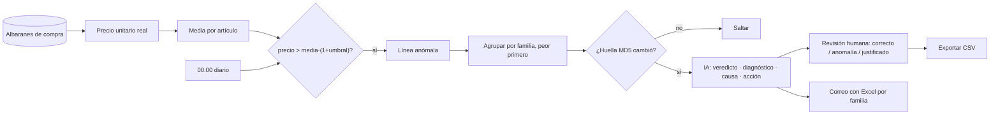

### Código
```python title="01 — Media por artículo, umbral y anomalías; los peores casos primero"
for cod_articulo, art in arts.items():
    lineas = art['lineas']
    vals = [l['precio_unit'] for l in lineas if l['precio_unit'] > 0]
    if not vals:
        continue
    avg = sum(vals) / len(vals)
    umbral = avg * (1 + pct / 100)
    for l in lineas:
        l['es_anomala'] = l['precio_unit'] > umbral
        l['pct_sobre_media'] = round((l['precio_unit'] / avg - 1) * 100, 2) if avg > 0 else 0
    art.update(avg_preuni=round(avg, 4), umbral=round(umbral, 4),
               n_anomalas=sum(l['es_anomala'] for l in lineas))
    art['lineas'] = sorted(lineas, key=lambda x: (0 if x['es_anomala'] else 1, -x['pct_sobre_media']))
```

```python title="02 — Solo se vuelve a preguntar a la IA si los datos del artículo han cambiado"
def calc_hash(lineas):
    data = "|".join(f"{l['rkey']}:{l['precio_unit']}:{l['tcant']}"
                    for l in sorted(lineas, key=lambda x: x['rkey']))
    return hashlib.md5(data.encode()).hexdigest()

new_hash = calc_hash(art['lineas'])
existing = ia_data['articulos'].get(cod_articulo)
if existing and existing.get('hash_datos') == new_hash:
    skipped += 1          # nada nuevo: se reutiliza el veredicto anterior
    continue
```

### Animación
```json animacion
{
  "duration": 6,
  "aspect": "16:9",
  "concept": { "es": "Los precios que se salen de la línea", "en": "Prices that stray from the line" },
  "elements": [
    { "id": "graf", "type": "grafico", "label": "Precio unitario por compra", "position": "centro" },
    { "id": "ia", "type": "chat", "label": "Veredicto IA", "position": "derecha" }
  ],
  "beats": [
    { "t": 0.5, "action": "aparecen puntos de precio de un artículo y una línea horizontal «media 412 €» (ejemplo)" },
    { "t": 1.8, "action": "una banda ámbar marca el umbral +10 %; dos puntos quedan por encima y se vuelven rojos «+34 %»" },
    { "t": 3.2, "action": "una lupa toca los puntos rojos y aparece la tarjeta «VEREDICTO: sobreprecio puntual · ACCIÓN: renegociar con proveedor B»" },
    { "t": 4.8, "action": "se marca «Justificado» en uno y «Anomalía» en otro; un contador de revisiones sube" }
  ],
  "sampleData": { "nota": "importes y porcentajes inventados" },
  "palette": "oscuro #05070a, ámbar #f2a93b, cian #5cc8d6, verde #52d18e, rojo #ef5b4c"
}
```
<!-- project:end -->

<!-- project:begin slug="mas-vendidos-produccion" -->
## Más vendidos en producción

```json ficha
{
  "slug": "mas-vendidos-produccion",
  "name": "Más vendidos en producción",
  "kind": "herramienta",
  "parent": "suite-compras",
  "tools": [],
  "department": ["compras", "comercial"],
  "category": "datos",
  "lifecycle": "activo",
  "status": "produccion",
  "evolvedFrom": null,
  "tagline": { "es": "Qué componentes se montan de verdad en los equipos, sin el ruido de los casos raros", "en": "Which components really go into the machines, without the noise of odd cases" },
  "summary": { "es": "Calcula los componentes más usados en las órdenes de fabricación de un periodo, permitiendo excluir clientes concretos y modelos de equipo que distorsionan el ranking, y filtrar por familia y subfamilia. Para cada componente dice qué clientes se lo llevan y exporta todo a Excel.", "en": "Computes the most-used components in the manufacturing orders of a period, letting you exclude specific customers and machine models that distort the ranking, and filter by family and subfamily. For each component it shows which customers take it and exports everything to Excel." },
  "problem": { "es": "Para planificar compras y stock hace falta saber qué se monta más, pero un pedido enorme de un solo cliente o un modelo especial lo distorsionan todo.", "en": "Planning purchases and stock requires knowing what is built most, but one huge order from a single customer or a special model distorts everything." },
  "solution": { "es": "Un ranking por unidades consumidas en producción con exclusiones guardables por cliente y por modelo, y el desglose de clientes por componente.", "en": "A ranking by units consumed in production with savable exclusions by customer and model, plus a customer breakdown per component." },
  "howItWorks": [
    { "title": { "es": "Periodo y filtros", "en": "Period and filters" }, "text": { "es": "Fechas (último año por defecto), familia, subfamilia y número de resultados (hasta 500).", "en": "Dates (last year by default), family, subfamily and number of results (up to 500)." } },
    { "title": { "es": "Exclusiones", "en": "Exclusions" }, "text": { "es": "Se eligen clientes y modelos de equipo que no deben contar.", "en": "Choose customers and machine models that should not count." } },
    { "title": { "es": "Ranking", "en": "Ranking" }, "text": { "es": "Componentes ordenados por unidades, con número de órdenes y clientes.", "en": "Components sorted by units, with order and customer counts." } },
    { "title": { "es": "Exportar", "en": "Export" }, "text": { "es": "Excel por familia o por subfamilia, con una columna de todos los clientes de cada componente.", "en": "Spreadsheet by family or subfamily, with a column listing every customer of each component." } }
  ],
  "features": [
    { "es": "Ranking configurable hasta 500 componentes", "en": "Configurable ranking up to 500 components" },
    { "es": "Exclusión de clientes y de modelos de equipo", "en": "Exclusion of customers and machine models" },
    { "es": "Configuraciones de filtros guardadas con nombre", "en": "Named saved filter configurations" },
    { "es": "Exportación a Excel por familia y por subfamilia, con hoja por grupo", "en": "Excel export by family and subfamily, one sheet per group" }
  ],
  "automations": [],
  "integrations": ["ERP (SQL Server)"],
  "ai": { "used": false, "where": { "es": "", "en": "" }, "local": true, "models": [] },
  "users": { "es": "Compras, dirección comercial y producto", "en": "Purchasing, sales management and product" },
  "stack": ["python", "flask", "sqlserver", "erp", "excel", "sqlCte"],
  "stackOther": ["openpyxl"],
  "metrics": [ { "label": { "es": "Máximo de resultados", "en": "Max results" }, "value": "500", "real": true } ],
  "businessValue": { "es": "Datos fiables para decidir qué tener en stock, qué negociar por volumen y qué configuraciones ofrecer como estándar.", "en": "Reliable data to decide what to stock, what to negotiate on volume and which configurations to offer as standard." },
  "complexity": 4,
  "impressiveness": 5,
  "featured": false,
  "sensitivity": "baja",
  "visualLoop": { "es": "Un ranking de barras horizontales; al tachar un cliente gigante, las barras se reordenan y aparece el verdadero top 10.", "en": "A horizontal bar ranking; striking out one giant customer reorders the bars and reveals the true top 10." },
  "notes": "Las unidades se calculan sobre líneas de órdenes de fabricación con cantidad real > 0."
}
```

### Qué es
Un analizador de **consumo real de componentes en producción**. No mide ventas de componentes sueltos: mide lo que se ha montado dentro de los equipos fabricados.

### El problema que resuelve
Los rankings ingenuos engañan. Un único cliente que pide 200 equipos iguales, o un modelo especial de una licitación, pueden hacer creer que un componente es «el más vendido» cuando no lo es para el resto del negocio.

### Cómo se usa
1. Se eligen las fechas, la familia y la subfamilia (opcionales) y cuántos resultados ver.
2. En los desplegables de **clientes** y **modelos** (descripciones de órdenes) se marcan los que se quieren excluir.
3. Se pulsa **Analizar** y aparece el ranking con código, descripción, familia, subfamilia, unidades, número de órdenes y número de clientes.
4. La combinación de filtros se puede **guardar con nombre** para repetir el análisis.
5. Se exporta a Excel por familia o por subfamilia. Cada grupo va en su hoja, con la lista completa de clientes de cada componente ordenada por unidades.

### Qué hace solo
Nada programado.

### Cómo funciona por dentro
- La consulta usa una **subconsulta en dos niveles**:
  - los filtros de cliente y modelo se aplican dentro, sobre la cabecera de la orden;
  - los de familia y subfamilia, fuera, sobre las columnas ya resueltas del maestro de artículos.

  Separarlos evita el clásico error de SQL Server «multi-part identifier could not be bound» al referenciar alias de `LEFT JOIN` en el mismo nivel.
- Todos los filtros van **parametrizados** (`?`), también las listas de exclusión, que generan su propia lista de marcadores.
- El mapa de clientes por componente se calcula aparte, agrupando por componente y cliente con la suma de unidades.

### Interfaz
Formulario de filtros con selectores múltiples buscables, tabla de ranking, gestor de configuraciones guardadas y botones de exportación.

### Inteligencia artificial
No usa.

### Fiabilidad y seguridad
Solo lectura del ERP y consultas parametrizadas.

### Qué aporta a una empresa
Decisiones de compra y de catálogo basadas en el uso real, no en impresiones.

### Retos técnicos resueltos
Filtros combinables en distintos niveles de una consulta compleja sin concatenar valores en el SQL.

### Evolución
Siguiente paso natural: comparar dos periodos y mostrar la tendencia de cada componente.

### Diagrama
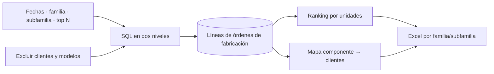

### Código
```python title="01 — Filtros en dos niveles para que SQL Server no se queje y todo vaya parametrizado"
params_inner, where_inner = [fecha_ini, fecha_fin], ""
params_outer, where_outer = [], ""
if excl_cli:
    where_inner += f" AND LTRIM(RTRIM(cab.cliente)) NOT IN ({','.join('?' * len(excl_cli))})"
    params_inner.extend(excl_cli)
if excl_esc:
    where_inner += f" AND LTRIM(RTRIM(cab.modelo)) NOT IN ({','.join('?' * len(excl_esc))})"
    params_inner.extend(excl_esc)
if cod_familia:
    where_outer += " AND sub.familia = ?"
    params_outer.append(cod_familia)
inner_sql = f"""
    SELECT LTRIM(RTRIM(lin.articulo)) AS COD_ARTICULO, lin.unidades, lin.orden,
           a.familia AS COD_FAMILIA, LTRIM(RTRIM(a.subfamilia)) AS COD_SUBFAMILIA
    FROM lineas_orden lin
    INNER JOIN cabeceras_orden cab ON lin.canal = cab.canal AND lin.ejercicio = cab.ejercicio AND lin.orden = cab.orden
    LEFT  JOIN articulos a ON LTRIM(RTRIM(lin.articulo)) = LTRIM(RTRIM(a.codigo))
    WHERE lin.unidades > 0 AND YEAR(cab.fecha) > 1900
      AND CONVERT(date, cab.fecha) >= ? AND CONVERT(date, cab.fecha) <= ?
      {where_inner}
"""
q = f"""
    SELECT TOP {top_n} sub.COD_ARTICULO, SUM(sub.unidades) AS TOTAL_VENDIDO, COUNT(DISTINCT sub.orden) AS NUM_ORDENES
    FROM ({inner_sql}) sub
    WHERE 1 = 1 {where_outer}
    GROUP BY sub.COD_ARTICULO ORDER BY TOTAL_VENDIDO DESC
"""
cur.execute(q, params_inner + params_outer)
```

### Animación
```json animacion
{
  "duration": 6,
  "aspect": "16:9",
  "concept": { "es": "El ranking de verdad aparece al quitar el ruido", "en": "The real ranking appears once the noise is removed" },
  "elements": [
    { "id": "bars", "type": "grafico", "label": "Top componentes", "position": "centro" },
    { "id": "chips", "type": "icono", "label": "Exclusiones", "position": "izquierda" }
  ],
  "beats": [
    { "t": 0.5, "action": "un ranking de barras dominado por un componente enorme" },
    { "t": 2.0, "action": "se tacha el chip «Cliente X (licitación)» (ejemplo)" },
    { "t": 3.2, "action": "la barra gigante encoge y las demás se reordenan con animación" },
    { "t": 4.6, "action": "se pulsa «Exportar» y sale un Excel con pestañas por familia" }
  ],
  "sampleData": { "nota": "clientes y componentes inventados" },
  "palette": "oscuro #05070a, ámbar #f2a93b, cian #5cc8d6, verde #52d18e, rojo #ef5b4c"
}
```
<!-- project:end -->

<!-- project:begin slug="estadisticas-gasto-compras" -->
## Estadísticas de gasto de compras

```json ficha
{
  "slug": "estadisticas-gasto-compras",
  "name": "Estadísticas de gasto de compras",
  "kind": "herramienta",
  "parent": "suite-compras",
  "tools": [],
  "department": ["compras", "direccion"],
  "category": "datos",
  "lifecycle": "activo",
  "status": "produccion",
  "evolvedFrom": null,
  "tagline": { "es": "En qué se va el dinero de compras, por familia, proveedor y marca, y pregúntaselo a la IA", "en": "Where purchasing money goes, by family, supplier and brand, and ask the AI about it" },
  "summary": { "es": "Carga las compras de un periodo y las organiza por familias, subfamilias, proveedores, artículos y marcas, con gráficas, tablas, Excel detallados y un chat en el que preguntar en lenguaje natural sobre esos datos.", "en": "Loads a period's purchases and organises them by family, subfamily, supplier, item and brand, with charts, tables, detailed spreadsheets and a chat to ask natural-language questions about the data." },
  "problem": { "es": "Saber cuánto se ha gastado en una familia o con un proveedor exigía consultas al ERP y tablas dinámicas hechas a mano.", "en": "Knowing how much was spent on a family or with a supplier required ERP queries and hand-made pivot tables." },
  "solution": { "es": "Una carga única por periodo a memoria y vistas preparadas para cada pregunta habitual, más una IA que razona sobre el resumen.", "en": "A single in-memory load per period and ready-made views for every common question, plus an AI that reasons over the summary." },
  "howItWorks": [
    { "title": { "es": "Cargar periodo", "en": "Load period" }, "text": { "es": "Se eligen fechas y se cargan todas las líneas de compra con su familia y subfamilia, mostrando el progreso.", "en": "Pick dates and load every purchase line with family and subfamily, showing progress." } },
    { "title": { "es": "Explorar", "en": "Explore" }, "text": { "es": "Familias, subfamilias, detalle por artículo, top de proveedores y marcas, con gráficas.", "en": "Families, subfamilies, per-item detail, top suppliers and brands, with charts." } },
    { "title": { "es": "Preguntar", "en": "Ask" }, "text": { "es": "Por ejemplo, «¿qué proveedor concentra el gasto en almacenamiento?».", "en": "For example, 'which supplier concentrates storage spend?'." } },
    { "title": { "es": "Exportar", "en": "Export" }, "text": { "es": "Excel por familias, subfamilias, proveedores, marcas o el detalle completo.", "en": "Spreadsheets by families, subfamilies, suppliers, brands or full detail." } }
  ],
  "features": [
    { "es": "Gasto, cantidad, nº de artículos, proveedores y albaranes por familia y subfamilia", "en": "Spend, quantity, item, supplier and delivery-note counts per family and subfamily" },
    { "es": "Top de proveedores con sus artículos", "en": "Top suppliers with their items" },
    { "es": "Análisis por marcas a partir de una lista de marcas subida por el usuario", "en": "Brand analysis from a user-uploaded brand list" },
    { "es": "Evolución mensual", "en": "Monthly evolution" },
    { "es": "Preguntas en lenguaje natural filtradas por familia o subfamilia", "en": "Natural-language questions filtered by family or subfamily" },
    { "es": "Cinco tipos de exportación a Excel", "en": "Five types of Excel export" }
  ],
  "automations": [],
  "integrations": ["ERP (SQL Server)", "IA local (Ollama)"],
  "ai": { "used": true, "where": { "es": "Responde preguntas sobre el periodo cargado usando un contexto con totales, hasta 40 familias, 80 subfamilias, 60 proveedores y 220 artículos ordenados por gasto", "en": "Answers questions about the loaded period using a context with totals, up to 40 families, 80 subfamilies, 60 suppliers and 220 items ordered by spend" }, "local": true, "models": ["qwen3 (~27B) vía Ollama"] },
  "users": { "es": "Responsable de compras y dirección", "en": "Purchasing manager and management" },
  "stack": ["python", "flask", "sqlserver", "erp", "ollama", "qwen", "llm", "excel", "dataProcessing"],
  "stackOther": ["openpyxl", "Chart.js"],
  "metrics": [ { "label": { "es": "Exportaciones disponibles", "en": "Available exports" }, "value": "5", "real": true } ],
  "businessValue": { "es": "Visibilidad inmediata del gasto para negociar con datos, detectar dependencias de un proveedor y controlar presupuestos.", "en": "Immediate spend visibility to negotiate with data, detect dependence on a supplier and control budgets." },
  "complexity": 5,
  "impressiveness": 6,
  "featured": false,
  "sensitivity": "media",
  "visualLoop": { "es": "Un donut de gasto por familias gira; al pulsar una porción se despliega en subfamilias y la IA escribe «El 62 % del gasto de almacenamiento se concentra en 2 proveedores».", "en": "A spend donut by family spins; clicking a slice expands into subfamilies and the AI writes '62 % of storage spend is concentrated in 2 suppliers'." },
  "notes": "No se publican cifras reales de gasto; los ejemplos visuales deben ser inventados."
}
```

### Qué es
El **cuadro de mando del gasto de compras**. Carga a memoria todas las líneas de albaranes de compra de un periodo y las agrega de todas las formas útiles para un responsable de compras.

### El problema que resuelve
Preguntas sencillas («¿cuánto hemos comprado de tarjetas gráficas este trimestre y a quién?») requerían consultas técnicas al ERP o tablas dinámicas manuales, que se quedaban obsoletas en cuanto entraba un albarán nuevo.

### Cómo se usa
1. Se elige un periodo y se pulsa **Cargar**. Una barra indica el avance: conectar, consultar, procesar los registros.
2. Aparecen los totales (gasto, cantidad, artículos, familias y proveedores) y las gráficas.
3. Se navega:
   - **Familias** → se pulsa una para ver sus **subfamilias** → se pulsa una subfamilia para ver sus artículos;
   - **Proveedores:** top por gasto, con sus artículos;
   - **Marcas:** se sube un fichero de texto con una marca por línea y se ve el gasto por marca y lo que queda sin marca reconocida.
4. En **Preguntar a la IA** se elige el filtro (todas las familias, o una familia o subfamilia concretas) y se escribe la pregunta.
5. Se exporta lo que se necesite.

### Qué hace solo
La carga se hace en un hilo en segundo plano, con estado consultable para que la página muestre el progreso.

### Cómo funciona por dentro
- Una consulta parametrizada por fechas une las líneas de compra con la cabecera del albarán, el proveedor, el artículo, la familia y la subfamilia.
- El resultado se guarda en una caché JSON local junto a sus metadatos (periodo, número de registros), así que la navegación posterior no vuelve a tocar el ERP.
- Las agregaciones (familias, subfamilias, proveedores, artículos y mensual) se calculan en Python con diccionarios y conjuntos, para contar artículos, proveedores y albaranes distintos.
- Las marcas se detectan buscando el nombre de cada marca de la lista dentro de la descripción del artículo.

### Interfaz
- Selector de fechas con barra de progreso.
- Tarjetas de totales.
- Gráficas de donut y de barras.
- Tablas desplegables familia → subfamilia → artículo.
- Panel de proveedores, panel de marcas con subida de lista y chat de IA.
- Barra de exportaciones.

### Inteligencia artificial
El *prompt* presenta al modelo como un experto en compras de una empresa fabricante de equipos informáticos y le prohíbe inventar datos. Le da los totales y los resúmenes por familias, subfamilias, proveedores y artículos, y le pide:
- responder en español de España;
- usar el formato de importe «1.234,56 €»;
- numerar los rankings;
- decirlo claramente si faltan datos.

### Fiabilidad y seguridad
- Solo lectura del ERP.
- Los datos cargados se quedan en el servidor interno.

### Qué aporta a una empresa
Las conversaciones con proveedores y con dirección pasan a hacerse con cifras al momento, no con estimaciones.

### Retos técnicos resueltos
- Dar contexto útil a la IA sin superar su ventana, mediante resúmenes jerárquicos con límites por nivel.
- Nombres de hoja de Excel únicos y válidos (máximo 31 caracteres, sin símbolos prohibidos).

### Evolución
Mejora prevista: comparar periodos y alertar de desviaciones de gasto.

### Diagrama
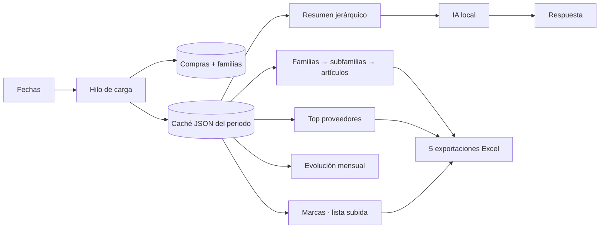

### Código
```python title="01 — Agregación jerárquica: cada familia sabe su gasto y cuántos artículos, proveedores y albaranes distintos tiene"
fams = {}
for rec in cache:
    cf, fn = fam_code(rec), fam_name(rec)
    sfkey = f"{cf}||{subfam_code(rec)}"
    f = fams.setdefault(cf, {"cod_familia": cf, "familia": fn, "g": 0.0, "c": 0.0,
                             "a": set(), "p": set(), "alb": set(), "subfamilias": {}})
    f["g"] += safe_float(rec.get('subtot'))
    f["c"] += safe_float(rec.get('tcant'))
    f["a"].add(clean_text(rec.get('cod_articulo')))
    f["p"].add(clean_text(rec.get('cod_proveedor')))
    f["alb"].add(f"{rec.get('can')}-{rec.get('ejercicio_alb')}-{rec.get('num_albaran')}")
    sf = f["subfamilias"].setdefault(sfkey, {"g": 0.0, "c": 0.0, "a": set(), "p": set(), "alb": set()})
    sf["g"] += safe_float(rec.get('subtot'))
```

### Animación
```json animacion
{
  "duration": 6,
  "aspect": "16:9",
  "concept": { "es": "Del total al detalle y a la pregunta", "en": "From total to detail to question" },
  "elements": [
    { "id": "donut", "type": "grafico", "label": "Gasto por familia", "position": "izquierda" },
    { "id": "chat", "type": "chat", "label": "Preguntar", "position": "derecha" }
  ],
  "beats": [
    { "t": 0.5, "action": "una barra de carga llega al 100 % y el donut se dibuja girando" },
    { "t": 1.8, "action": "se pulsa la porción «Almacenamiento» (ejemplo) y se abre en subfamilias" },
    { "t": 3.2, "action": "en el chat: «¿qué proveedor concentra este gasto?»" },
    { "t": 4.5, "action": "la IA responde con un ranking numerado «1. Proveedor A — 41 %…» (datos de ejemplo)" }
  ],
  "sampleData": { "nota": "todo inventado" },
  "palette": "oscuro #05070a, ámbar #f2a93b, cian #5cc8d6, verde #52d18e, rojo #ef5b4c"
}
```
<!-- project:end -->

<!-- project:begin slug="conversor-divisas-compra" -->
## Conversor de precios de compra por divisa

```json ficha
{
  "slug": "conversor-divisas-compra",
  "name": "Conversor de precios de compra por divisa",
  "kind": "herramienta",
  "parent": "suite-compras",
  "tools": [],
  "department": ["compras"],
  "category": "automatizacion",
  "lifecycle": "activo",
  "status": "produccion",
  "evolvedFrom": "Un formulario PHP antiguo con la misma fórmula, sin copia de seguridad",
  "tagline": { "es": "Recalcula en euros los costes de las familias que compras en dólares, y deshazlo si te equivocas", "en": "Recompute in euros the costs of families bought in dollars, and undo it if you got it wrong" },
  "summary": { "es": "Elige familias de artículos, una divisa y un tipo de cambio, y la herramienta recalcula en el ERP el coste en euros a partir del coste guardado en esa divisa. Antes de tocar nada guarda una foto de los valores anteriores y permite restaurarla; la restauración guarda a su vez otra foto, así que también se puede deshacer.", "en": "Pick item families, a currency and an exchange rate, and the tool recomputes the euro cost in the ERP from the cost stored in that currency. Before touching anything it saves a snapshot of the previous values and allows restoring it; restoring also saves a snapshot, so it can be undone too." },
  "problem": { "es": "Cuando el dólar se mueve, los costes en euros de lo que se compra en dólares quedan desfasados; la herramienta antigua aplicaba el cambio sin posibilidad de volver atrás.", "en": "When the dollar moves, euro costs of dollar-bought goods drift; the old tool applied the rate with no way back." },
  "solution": { "es": "La misma fórmula de siempre, migrada a una web moderna con validación, transacción, fotos antes y después, histórico y restauración.", "en": "The same formula as always, migrated to a modern web app with validation, transaction, before/after snapshots, history and restore." },
  "howItWorks": [
    { "title": { "es": "Elegir", "en": "Choose" }, "text": { "es": "Familias (casillas), divisa y tipo de cambio; la selección se recuerda para la próxima vez.", "en": "Families (checkboxes), currency and rate; the selection is remembered for next time." } },
    { "title": { "es": "Actualizar", "en": "Update" }, "text": { "es": "Coste en euros = coste en divisa ÷ tipo de cambio, en una sola transacción.", "en": "Euro cost = currency cost ÷ rate, in a single transaction." } },
    { "title": { "es": "Revisar", "en": "Review" }, "text": { "es": "Cada operación queda como una «foto» con el antes y el después, descargable en JSON.", "en": "Each operation is stored as a 'snapshot' with before and after, downloadable as JSON." } },
    { "title": { "es": "Restaurar", "en": "Restore" }, "text": { "es": "Un botón devuelve los valores anteriores, guardando antes otra foto de seguridad.", "en": "One button restores previous values, first saving another safety snapshot." } }
  ],
  "features": [
    { "es": "Selección múltiple de familias con validación contra el ERP", "en": "Multi-family selection validated against the ERP" },
    { "es": "Divisas leídas del propio ERP", "en": "Currencies read from the ERP itself" },
    { "es": "Interpretación tolerante del tipo de cambio (coma o punto decimal)", "en": "Tolerant rate parsing (comma or dot decimal)" },
    { "es": "Foto previa y posterior de cada artículo afectado", "en": "Before and after snapshot of every affected item" },
    { "es": "Restauración deshacible", "en": "Undoable restore" },
    { "es": "Bloqueo para que nunca coincidan dos operaciones sobre el ERP", "en": "Lock so that two ERP operations never overlap" }
  ],
  "automations": [],
  "integrations": ["ERP (SQL Server)"],
  "ai": { "used": false, "where": { "es": "", "en": "" }, "local": true, "models": [] },
  "users": { "es": "Equipo de compras", "en": "Purchasing team" },
  "stack": ["python", "flask", "sqlserver", "erp"],
  "stackOther": ["pyodbc", "decimal"],
  "metrics": [ { "label": { "es": "Operaciones deshacibles", "en": "Undoable operations" }, "value": "todas (incluida la restauración)", "real": true } ],
  "businessValue": { "es": "Costes alineados con la divisa real en segundos, con la tranquilidad de poder volver atrás si se teclea mal el cambio.", "en": "Costs aligned with the real currency in seconds, with the peace of mind of undoing a mistyped rate." },
  "complexity": 4,
  "impressiveness": 5,
  "featured": false,
  "sensitivity": "baja",
  "visualLoop": { "es": "Un dial «1 € = 1,09 $» gira; las tarjetas de familia cambian sus precios en cascada; aparece una cámara que hace «clic» (foto) y un botón «↶ Restaurar».", "en": "A dial '1 € = 1.09 $' turns; family cards update their prices in cascade; a camera goes 'click' (snapshot) and an '↶ Restore' button appears." },
  "notes": "Mantiene a propósito el comportamiento del formulario original (no recalcula tarifas de venta) para no cambiar resultados históricos."
}
```

### Qué es
Una herramienta pequeña pero crítica. Mantiene coherentes los **costes en euros** de los artículos que se compran en otra divisa: el ERP guarda su coste en la divisa original y en euros, y esta herramienta recalcula el de euros con el tipo de cambio que se le indique.

### El problema que resuelve
Existía un formulario antiguo con la misma fórmula, pero si alguien se equivocaba con el tipo de cambio (por ejemplo, 10,9 en lugar de 1,09), los costes quedaban mal y no había forma sencilla de recuperarlos.

### Cómo se usa
1. Se marcan las familias de artículos afectadas.
2. Se elige la divisa (la lista sale del ERP) y se escribe el tipo de cambio.
3. **Guardar** recuerda la configuración sin aplicar nada. **Actualizar** aplica el cambio.
4. Abajo aparece el histórico de operaciones: fecha, divisa, cambio, familias, número de artículos y estado.
5. En cualquier operación se puede descargar su foto en JSON o **Restaurar**.

### Qué hace solo
Nada programado.

### Cómo funciona por dentro
- **Fórmula** (la misma del sistema anterior): coste en euros = coste en divisa / cambio, para los artículos de las familias elegidas cuya ficha de divisa coincide con la seleccionada.
- **Transacción:** dentro de una transacción sin autocommit se leen los valores actuales de los artículos afectados, se ejecuta el `UPDATE` y se leen los valores nuevos. La foto con el antes y el después se escribe en disco **antes del commit**; si SQL falla, la foto se elimina y se hace rollback. Así nunca puede quedar un cambio aplicado sin su copia de seguridad.
- **Restauración:** antes de restaurar se crea una foto de seguridad del estado actual, de modo que la restauración también se puede deshacer. Después se escriben los valores «antes» de la foto elegida: coste y las seis tarifas de venta guardadas.
- **Concurrencia:** un cerrojo global impide dos operaciones a la vez sobre el ERP.
- **Validación:** las familias y la divisa deben existir en el ERP y el tipo de cambio debe ser un número positivo.

### Interfaz
- Formulario con la cuadrícula de familias (casillas), el selector de divisa y el campo de cambio.
- Botones Guardar y Actualizar.
- Tabla de histórico con descarga JSON y Restaurar.
- Mensajes claros de éxito o error.

### Inteligencia artificial
No usa.

### Fiabilidad y seguridad
- Todo cambio es reversible.
- Escrituras atómicas de los ficheros de foto.
- El histórico es la fuente de verdad de lo que se cambió y cuándo.

### Qué aporta a una empresa
Gestionar el riesgo de divisa en los costes sin miedo a romper el ERP.

### Retos técnicos resueltos
- Reproducir con exactitud el comportamiento del sistema anterior: se documentó qué hacía realmente (por ejemplo, qué casilla estaba desactivada) antes de migrarlo.
- Una restauración que se pueda deshacer.

### Evolución
Migrado desde un formulario PHP antiguo. El siguiente paso sería sugerir el tipo de cambio oficial del día, como ya hace el buscador multimayorista.

### Diagrama
```mermaid
flowchart LR
  U[Familias + divisa + cambio] --> V[Validar contra el ERP]
  V --> A[Foto ANTES]
  A --> T[UPDATE coste € = coste divisa ÷ cambio · transacción]
  T -->|ok| D[Foto DESPUÉS + histórico]
  T -->|error| RB[Rollback]
  D --> R[↶ Restaurar]
  R --> S[Foto de seguridad] --> W[Escribir valores ANTES]
```

### Código
```python title="01 — La fórmula de siempre, ahora dentro de una transacción con foto previa"
update_sql = f"""
    UPDATE a SET a.coste_ultima_compra = d.coste_ultima_compra / ?
    FROM articulos AS a
    INNER JOIN articulos_divisa AS d ON RTRIM(a.codigo) = RTRIM(d.codigo)
    WHERE RTRIM(a.familia) IN ({placeholders}) AND RTRIM(d.divisa) = ?
"""
with DB_OPERATION_LOCK:
    connection = get_connection()                 # autocommit=False
    cursor = connection.cursor()
    before = fetch_article_state_by_filters(cursor, families, currency)
    if not before:
        raise ValueError("No hay artículos que coincidan con las familias y la divisa seleccionadas.")
    cursor.execute(update_sql, [exchange_rate, *families, currency])
    after = fetch_article_state_by_filters(cursor, families, currency)
    snapshot = base_snapshot(operation="cambio_divisa", before=before, currency=currency,
                             families=family_metadata(families, available_families),
                             exchange_rate=format(exchange_rate, "f"))
    snapshot["despues"] = after
    # La foto se escribe ANTES del commit (si SQL falla, se elimina):
    # así no puede completarse un cambio sin haber generado antes su respaldo.
    saved_path = save_snapshot(snapshot)
    connection.commit()
    complete_snapshot(snapshot, after)
```

### Animación
```json animacion
{
  "duration": 6,
  "aspect": "16:9",
  "concept": { "es": "Cambiar la divisa con red de seguridad", "en": "Change currency with a safety net" },
  "elements": [
    { "id": "dial", "type": "icono", "label": "1 € = 1,09 $", "position": "izquierda" },
    { "id": "fams", "type": "tabla", "label": "Familias", "position": "centro" },
    { "id": "foto", "type": "icono", "label": "📸 Foto", "position": "derecha" }
  ],
  "beats": [
    { "t": 0.5, "action": "el dial gira de 1,07 a 1,09 (ejemplo)" },
    { "t": 1.8, "action": "una cámara hace clic: «Foto ANTES · 1.240 artículos» (ejemplo)" },
    { "t": 3.0, "action": "los precios de las familias marcadas cambian en cascada" },
    { "t": 4.4, "action": "aparece «↶ Restaurar» y al pulsarlo los valores vuelven atrás con otra foto de seguridad" }
  ],
  "sampleData": { "nota": "cambio y recuentos inventados" },
  "palette": "oscuro #05070a, ámbar #f2a93b, cian #5cc8d6, verde #52d18e, rojo #ef5b4c"
}
```
<!-- project:end -->

<!-- project:begin slug="vigilante-precios-cero" -->
## Vigilante de precios de compra a cero

```json ficha
{
  "slug": "vigilante-precios-cero",
  "name": "Vigilante de precios de compra a cero",
  "kind": "herramienta",
  "parent": "suite-compras",
  "tools": [],
  "department": ["compras", "administracion"],
  "category": "automatizacion",
  "lifecycle": "activo",
  "status": "produccion",
  "evolvedFrom": null,
  "tagline": { "es": "Si un artículo se queda con coste cero, te enteras en segundos", "en": "If an item's cost drops to zero, you know within seconds" },
  "summary": { "es": "Revisa sin parar los artículos del ERP y avisa por correo, con un Excel, cuando un coste de última compra pasa a cero o aparece un artículo nuevo sin coste. Guarda una línea base, un histórico de eventos y fotos, y si el correo falla lo deja en cola y lo reintenta.", "en": "Continuously checks ERP items and emails an alert with a spreadsheet when a last-purchase cost drops to zero or a new item appears with no cost. It keeps a baseline, an event history and snapshots, and if email fails it queues and retries." },
  "problem": { "es": "Un coste a cero hace que un equipo parezca más rentable de lo que es, que una venta salga con margen falso y que el inventario se valore mal; suele deberse a un error al registrar un albarán.", "en": "A zero cost makes a machine look more profitable than it is, makes a sale show a false margin and misvalues inventory; it is usually caused by a delivery-note entry mistake." },
  "solution": { "es": "Un vigilante que compara cada ciclo con el anterior y avisa solo de las transiciones nuevas a cero, configurable desde una web.", "en": "A watcher that compares each cycle with the previous one and alerts only on new transitions to zero, configurable from a web page." },
  "howItWorks": [
    { "title": { "es": "Línea base", "en": "Baseline" }, "text": { "es": "La primera vez guarda el estado de todos los artículos y envía un informe inicial con los que ya están a cero.", "en": "The first time it stores every item's state and sends an initial report of those already at zero." } },
    { "title": { "es": "Ciclo", "en": "Cycle" }, "text": { "es": "Cada N segundos vuelve a leer y compara: lo que antes no era cero y ahora sí, o lo nuevo que nace a cero, es una alerta.", "en": "Every N seconds it re-reads and compares: anything that was non-zero and now is, or a new item born at zero, is an alert." } },
    { "title": { "es": "Aviso", "en": "Alert" }, "text": { "es": "Correo con Excel de los cambios; si falla, queda en una bandeja de salida que se reintenta en cada ciclo.", "en": "Email with a spreadsheet of the changes; if it fails it goes to an outbox retried every cycle." } },
    { "title": { "es": "Configuración", "en": "Configuration" }, "text": { "es": "Desde la web: fecha de alta mínima, intervalo, destinatarios, familias excluidas y si los nulos cuentan como cero.", "en": "From the web: minimum creation date, interval, recipients, excluded families and whether nulls count as zero." } }
  ],
  "features": [
    { "es": "Detección de transiciones a cero (no repite lo ya conocido)", "en": "Detection of transitions to zero (does not repeat known ones)" },
    { "es": "Detección de artículos nuevos dados de alta con coste cero", "en": "Detection of new items created at zero cost" },
    { "es": "Recuento de recuperaciones (artículos que dejan de estar a cero)", "en": "Recovery count (items that stop being zero)" },
    { "es": "Línea base que se regenera sola si cambian los filtros, con copia de la anterior", "en": "Baseline regenerated automatically if filters change, keeping a copy of the previous one" },
    { "es": "Bandeja de salida de correos con reintentos", "en": "Email outbox with retries" },
    { "es": "Histórico de eventos y fotos descargables", "en": "Event history and downloadable snapshots" },
    { "es": "Botones de comprobar ahora, probar la base de datos, probar el correo y reiniciar la línea base", "en": "Buttons to check now, test database, test email and reset baseline" }
  ],
  "automations": [ { "trigger": "cada 30 s (configurable, mínimo 5 s)", "action": { "es": "Ciclo de vigilancia y reintento de correos pendientes", "en": "Watch cycle and pending-email retry" } } ],
  "integrations": ["ERP (SQL Server)", "Correo Office 365"],
  "ai": { "used": false, "where": { "es": "", "en": "" }, "local": true, "models": [] },
  "users": { "es": "Compras y administración", "en": "Purchasing and accounting" },
  "stack": ["python", "flask", "sqlserver", "erp", "excel", "email"],
  "stackOther": ["xlsxwriter", "threading.Event"],
  "metrics": [
    { "label": { "es": "Intervalo por defecto", "en": "Default interval" }, "value": "30 s", "real": true },
    { "label": { "es": "Tipos de evento", "en": "Event types" }, "value": "línea base, nuevo a cero, cambio a cero, recuperación", "real": true }
  ],
  "businessValue": { "es": "Corta de raíz uno de los errores más caros e invisibles de un ERP: el coste cero, que falsea márgenes, ventas e inventario.", "en": "Stops one of the most expensive and invisible ERP errors at the source: the zero cost that falsifies margins, sales and inventory." },
  "complexity": 5,
  "impressiveness": 6,
  "featured": false,
  "sensitivity": "baja",
  "visualLoop": { "es": "Una cuadrícula de precios late cada pocos segundos; uno cae a «0,00 €», se pone rojo y sale volando un sobre con un Excel.", "en": "A grid of prices pulses every few seconds; one drops to '0.00 €', turns red and an envelope with a spreadsheet flies out." },
  "notes": null
}
```

### Qué es
Un vigilante continuo con panel web que protege el maestro de artículos del ERP frente a un error concreto y muy dañino: que el **coste de última compra** se quede a **cero**.

### El problema que resuelve
Un coste a cero se cuela con facilidad: un albarán registrado sin precio, una importación incompleta, un artículo dado de alta sin coste. Y tiene consecuencias graves:
- márgenes de venta irreales;
- escandallos de equipo mal valorados;
- inventario infravalorado.

### Cómo se usa
1. Se abre el panel y se ve el estado: activo o en pausa, última comprobación, próxima estimada, total de artículos vigilados, cuántos están a cero ahora y correos pendientes.
2. En configuración se fijan la fecha de alta mínima de los artículos a vigilar, el intervalo, los destinatarios, las familias excluidas y si un valor nulo cuenta como cero.
3. Pestañas:
   - **Ceros actuales:** lista de artículos a cero ahora mismo;
   - **Eventos:** histórico de alertas, con su tipo;
   - **Fotos:** líneas base y copias, descargables.
4. Botones de utilidad: **Comprobar ahora**, **Probar base de datos**, **Probar correo** y **Reiniciar línea base**.

### Qué hace solo
En cada ciclo:
1. Reintenta los correos que quedaron pendientes.
2. Lee los artículos según los filtros.
3. Si los filtros han cambiado desde la última vez, guarda una foto de la línea base antigua y crea una nueva, para no avisar de «cambios» que solo son por el filtro.
4. Compara artículo a artículo con el estado anterior:
   - **nuevo y ya a cero** → alerta;
   - **antes distinto de cero y ahora cero** → alerta;
   - **antes cero y ahora no** → recuperación (se cuenta, no se avisa).
5. Si hay alertas, envía el correo con un Excel. Si falla, lo encola.
6. Guarda el estado y el evento.

### Cómo funciona por dentro
- Hilo de vigilancia con `threading.Event` para poder despertarlo al momento («Comprobar ahora») o pararlo limpiamente.
- Ficheros JSON con escritura atómica: configuración, estado, estado actual, eventos, bandeja de salida y fotos.
- La **firma de filtros** (fecha mínima, nulos como cero, familias excluidas) se guarda con el estado para detectar cambios de configuración.
- Los Excel se generan con `xlsxwriter`: uno para el informe inicial (línea base) y otro por alerta.

### Interfaz
- Panel con tarjetas de estado.
- Formulario de configuración con validación de fechas y correos.
- Tablas de ceros actuales y eventos.
- Lista de fotos con descarga.
- Botones de prueba.

### Inteligencia artificial
No usa.

### Fiabilidad y seguridad
- Nunca escribe en el ERP: solo lee.
- Un fallo de correo no pierde la alerta, que queda en la cola.
- Un cambio de filtros no genera alertas falsas.
- El hilo se arranca una sola vez y se detiene de forma ordenada al cerrar la aplicación.

### Qué aporta a una empresa
Control de calidad de datos en tiempo real sobre el campo que más impacto tiene en la rentabilidad calculada.

### Retos técnicos resueltos
- Avisar solo de lo nuevo, comparando estados con una clave estable por artículo.
- Entregas fiables de correo con cola de reintentos.
- Cambios de configuración sin ruido.

### Evolución
Siguiente paso: incluir en el aviso el albarán que provocó el cero, para ir directo a corregirlo.

### Diagrama
```mermaid
stateDiagram-v2
  [*] --> SinLineaBase
  SinLineaBase --> LineaBase: primer ciclo · foto + informe inicial
  LineaBase --> Ciclo: cada N s
  Ciclo --> Alerta: nuevo a cero / cambio a cero
  Ciclo --> LineaBase: filtros cambiados · foto de la anterior
  Alerta --> Correo
  Correo --> Ciclo: enviado
  Correo --> Cola: falla
  Cola --> Correo: reintento en el siguiente ciclo
```

### Código
```python title="01 — Solo las transiciones nuevas a cero son alerta; lo que vuelve a tener coste se cuenta como recuperación"
for code, current in current_map.items():
    previous = previous_map.get(code)
    current_is_zero = is_zero(current.get("coste_ultima_compra"), include_null)
    previous_is_zero = is_zero(previous.get("coste_ultima_compra"), include_null) if previous else False
    if current_is_zero and (previous is None or not previous_is_zero):
        newly_zero.append({
            "previous": previous,
            "current": current,
            "reason": "new_article_at_zero" if previous is None else "changed_to_zero",
        })
    elif previous is not None and previous_is_zero and not current_is_zero:
        recovered_count += 1
```

### Animación
```json animacion
{
  "duration": 6,
  "aspect": "16:9",
  "concept": { "es": "Un cero que no se escapa", "en": "A zero that does not slip through" },
  "elements": [
    { "id": "grid", "type": "tabla", "label": "Costes de artículos", "position": "centro" },
    { "id": "mail", "type": "correo", "label": "Alerta + Excel", "position": "derecha" }
  ],
  "beats": [
    { "t": 0.5, "action": "una cuadrícula de precios late con un pulso cada «30 s» (acelerado)" },
    { "t": 1.8, "action": "una celda «412,30 €» cae a «0,00 €» y se pone roja (ejemplo)" },
    { "t": 3.0, "action": "sale un sobre con un Excel «alerta_precios_cero» hacia la derecha" },
    { "t": 4.4, "action": "minutos después la celda vuelve a «409,90 €» y un contador «recuperados: 1» sube" }
  ],
  "sampleData": { "nota": "importes inventados" },
  "palette": "oscuro #05070a, ámbar #f2a93b, cian #5cc8d6, verde #52d18e, rojo #ef5b4c"
}
```
<!-- project:end -->

<!-- project:begin slug="buscador-incidencias-compras" -->
## Buscador de incidencias de compras

```json ficha
{
  "slug": "buscador-incidencias-compras",
  "name": "Buscador de incidencias de compras",
  "kind": "herramienta",
  "parent": "suite-compras",
  "tools": [],
  "department": ["compras"],
  "category": "documentos",
  "lifecycle": "activo",
  "status": "produccion",
  "evolvedFrom": null,
  "tagline": { "es": "Busca cualquier incidencia con un proveedor en años de informes diarios, y deja una nota", "en": "Search any supplier issue across years of daily reports, and leave a note" },
  "summary": { "es": "El departamento de compras lleva un Excel de incidencias con una pestaña por día. Esta web busca un texto (un pedido, un proveedor, un part number) en todas las pestañas de todos los años, muestra las filas encontradas con su fecha y permite dejar notas por fila, que se marcan como leídas. Además envía por correo el informe más reciente.", "en": "The purchasing department keeps an issues spreadsheet with one tab per day. This web page searches a text (an order, a supplier, a part number) across every tab of every year, shows matching rows with their date and lets people leave per-row notes that can be marked as read. It also emails the most recent report." },
  "problem": { "es": "Encontrar una incidencia antigua implicaba abrir el Excel de cada año e ir pestaña a pestaña.", "en": "Finding an old issue meant opening each year's spreadsheet and going tab by tab." },
  "solution": { "es": "Una búsqueda de texto completo sobre los Excel de la carpeta compartida, interpretando la fecha de cada pestaña, con notas colaborativas.", "en": "A full-text search over the shared folder's spreadsheets, parsing each tab's date, with collaborative notes." },
  "howItWorks": [
    { "title": { "es": "Elegir año y mes", "en": "Choose year and month" }, "text": { "es": "Los años salen de las carpetas de la unidad compartida; los meses, de las pestañas.", "en": "Years come from the shared-drive folders; months from the tabs." } },
    { "title": { "es": "Buscar", "en": "Search" }, "text": { "es": "Se escribe el texto y se obtienen las filas que lo contienen, con fecha, hoja y número de fila.", "en": "Type the text and get matching rows, with date, sheet and row number." } },
    { "title": { "es": "Anotar", "en": "Annotate" }, "text": { "es": "En cada fila se puede dejar una nota firmada; quedan como pendientes hasta que alguien las marca como leídas.", "en": "Each row can carry a signed note; notes stay pending until someone marks them read." } }
  ],
  "features": [
    { "es": "Búsqueda en todas las pestañas con fecha interpretada del nombre de la hoja", "en": "Search across all tabs with the date parsed from the sheet name" },
    { "es": "Resultados ordenados por fecha", "en": "Results sorted by date" },
    { "es": "Notas por fila con autor, fecha y estado de lectura", "en": "Per-row notes with author, date and read status" },
    { "es": "Vista de notas pendientes", "en": "Pending-notes view" },
    { "es": "Envío del informe más reciente por correo con comentarios añadidos", "en": "Email of the most recent report with added comments" }
  ],
  "automations": [],
  "integrations": ["Unidad compartida de red", "Correo Office 365"],
  "ai": { "used": false, "where": { "es": "", "en": "" }, "local": true, "models": [] },
  "users": { "es": "Equipo de compras", "en": "Purchasing team" },
  "stack": ["python", "flask", "excel", "email"],
  "stackOther": ["openpyxl (modo solo lectura)"],
  "metrics": [ { "label": { "es": "Primera fila de datos en cada pestaña", "en": "First data row in each tab" }, "value": "8", "real": true } ],
  "businessValue": { "es": "La memoria de incidencias con proveedores deja de estar enterrada en hojas diarias: se encuentra en segundos y se comenta en equipo.", "en": "The memory of supplier issues is no longer buried in daily sheets: it is found in seconds and discussed as a team." },
  "complexity": 3,
  "impressiveness": 4,
  "featured": false,
  "sensitivity": "baja",
  "visualLoop": { "es": "Un abanico de pestañas diarias se despliega; una búsqueda las recorre como un escáner y saca tres filas resaltadas con fecha; a una se le pega una nota amarilla.", "en": "A fan of daily tabs spreads out; a search sweeps them like a scanner and pulls out three highlighted rows with dates; a yellow note sticks to one." },
  "notes": "Ruta de la carpeta compartida omitida."
}
```

### Qué es
Un buscador sobre el **registro diario de incidencias de compras**: retrasos, material dañado, errores de envío, reclamaciones. El equipo lo mantiene en Excel con una pestaña por día y un fichero por año en una carpeta compartida.

### El problema que resuelve
Cuando un proveedor vuelve a fallar, o hay que reclamar algo de hace meses, hay que encontrar la incidencia original. Con cientos de pestañas diarias repartidas en varios años, eso era muy lento.

### Cómo se usa
1. Se elige el año (sale de las carpetas existentes) y, si se quiere, el mes.
2. Se escribe el término: número de pedido, proveedor, producto…
3. Se ven los resultados con fecha, hoja y fila, ordenados por fecha, con todas las columnas de la fila.
4. Con **Ver detalle** se abre la fila completa; con **Añadir nota** se deja un comentario con el nombre.
5. En **Notas pendientes** el responsable ve lo que nadie ha leído y lo marca como leído.
6. Desde una página interna se puede enviar por correo el último informe de incidencias, con un comentario.

### Qué hace solo
Nada programado.

### Cómo funciona por dentro
- Se abre cada Excel en modo solo lectura y se recorren sus hojas. El nombre de cada hoja se interpreta como fecha (se descartan las que no lo son). Se leen las filas desde la 8, donde empiezan los datos.
- La coincidencia es de texto contenido, sin distinguir mayúsculas, sobre la fila completa.
- Para el envío, el «informe más reciente» se localiza buscando la carpeta del año más alto y, dentro, el Excel de incidencias modificado más recientemente, ignorando los temporales `~$`.
- Las notas se guardan en un JSON con identificador, fecha, autor, fichero, hoja, fila, texto y estado de lectura.

### Interfaz
Buscador con selectores de año y mes, tabla de resultados, ventana de detalle y notas, y un panel de notas pendientes.

### Inteligencia artificial
No usa.

### Fiabilidad y seguridad
- Los Excel nunca se modifican: las notas viven aparte.
- Se ignoran los ficheros temporales de Excel abiertos por otra persona.

### Qué aporta a una empresa
Historial de incidencias consultable y colaborativo, sin cambiar la forma de trabajar del equipo, que sigue usando su Excel.

### Retos técnicos resueltos
Convertir un registro «humano» (una pestaña por día) en algo consultable sin obligar a migrarlo a una base de datos.

### Evolución
Siguiente paso: estadísticas de incidencias por proveedor y aviso automático cuando un proveedor acumula varias en poco tiempo.

### Diagrama
```mermaid
flowchart LR
  Q[Término + año/mes] --> F[(Excel por año en carpeta compartida)]
  F --> H[Pestañas = días · fecha del nombre]
  H --> R[Filas desde la 8 que contienen el término]
  R --> T[Resultados por fecha]
  T --> N[(Notas por fila · leídas/pendientes)]
  F --> L[Último informe] --> M[Correo con comentario]
```

### Código
```python title="01 — Cada pestaña es un día: se interpreta su nombre como fecha y se busca en sus filas"
for sheet_name in wb.sheetnames:
    sheet_date = parse_sheet_date(sheet_name)
    if not sheet_date:
        continue                                    # pestañas que no son días
    for row_idx, row in enumerate(wb[sheet_name].iter_rows(min_row=8, values_only=True), start=8):
        row_str = ' '.join(str(c) if c is not None else '' for c in row)
        if search_term.lower() in row_str.lower():
            results.append({'fecha': sheet_date.strftime('%d-%m-%Y'), 'fecha_sort': sheet_date,
                            'hoja': sheet_name, 'fila': row_idx,
                            'datos': [str(c) if c is not None else '' for c in row]})
```

### Animación
```json animacion
{
  "duration": 6,
  "aspect": "16:9",
  "concept": { "es": "Años de pestañas diarias, una búsqueda", "en": "Years of daily tabs, one search" },
  "elements": [
    { "id": "tabs", "type": "archivo", "label": "Incidencias por día", "position": "centro" },
    { "id": "nota", "type": "icono", "label": "📝 Nota", "position": "derecha" }
  ],
  "beats": [
    { "t": 0.5, "action": "cientos de pestañas se despliegan en abanico" },
    { "t": 1.8, "action": "se escribe «PED-1234» (ejemplo) y un escáner cian las recorre" },
    { "t": 3.0, "action": "salen tres filas resaltadas con fechas «03-02», «17-05», «22-09»" },
    { "t": 4.4, "action": "se pega una nota amarilla «Reclamado de nuevo» en una fila; un contador «pendientes: 1» se ilumina" }
  ],
  "sampleData": { "nota": "todo inventado" },
  "palette": "oscuro #05070a, ámbar #f2a93b, cian #5cc8d6, verde #52d18e, rojo #ef5b4c"
}
```
<!-- project:end -->

---

<!-- project:begin slug="suite-costes-margenes" -->
## Suite de costes y márgenes

```json ficha
{
  "slug": "suite-costes-margenes",
  "name": "Suite de costes y márgenes",
  "kind": "suite",
  "parent": null,
  "tools": ["motor-costes-margenes", "asistente-ia-costes", "vigilancia-precios-ordenes", "actualizador-margenes-familia"],
  "department": ["administracion", "direccion", "compras"],
  "category": "datos",
  "lifecycle": "activo",
  "status": "produccion",
  "evolvedFrom": "Scripts de solo lectura que exportaban márgenes a Excel por año y un analizador de márgenes con criterios que no cuadraban",
  "tagline": { "es": "Saber de verdad cuánto cuesta lo que fabricas y cuánto ganas con lo que vendes", "en": "Truly know what what you build costs and what you earn on what you sell" },
  "summary": { "es": "Cuatro herramientas que comparten un mismo núcleo de reglas de coste: corrigen los costes de órdenes de fabricación y ventas con simulación previa y vuelta atrás, calculan márgenes reales separando devoluciones y garantías, vigilan precios mal aplicados en producción y ajustan márgenes de venta por familia.", "en": "Four tools sharing one core of costing rules: they correct manufacturing-order and sales costs with prior simulation and rollback, compute real margins separating returns and warranties, watch for wrong prices applied in production and adjust sales margins by family." },
  "problem": { "es": "En una empresa que fabrica equipos con números de serie, el coste de cada equipo depende de lo que se pagó por cada pieza concreta; si las órdenes o las ventas guardan costes desactualizados, el margen que ve dirección es ficción.", "en": "In a company that builds serial-numbered machines, each machine's cost depends on what was paid for each specific part; if orders or sales keep outdated costs, the margin management sees is fiction." },
  "solution": { "es": "Un núcleo común que reconstruye la cadena compra → fabricación → venta por número de serie, y herramientas que lo usan para simular, aplicar, deshacer, analizar y vigilar con exactamente las mismas reglas.", "en": "A common core that rebuilds the purchase → manufacturing → sale chain by serial number, and tools that use it to simulate, apply, undo, analyse and watch with exactly the same rules." },
  "howItWorks": [
    { "title": { "es": "Reglas únicas", "en": "Single rules" }, "text": { "es": "Un módulo compartido define qué es el coste de una pieza, de una orden y de una línea de venta.", "en": "A shared module defines what the cost of a part, an order and a sales line is." } },
    { "title": { "es": "Corregir", "en": "Correct" }, "text": { "es": "El corrector simula los costes correctos, los aplica en una sola transacción y permite restaurarlos fila a fila.", "en": "The corrector simulates the right costs, applies them in a single transaction and allows row-level restore." } },
    { "title": { "es": "Analizar", "en": "Analyse" }, "text": { "es": "El analizador calcula márgenes reales, el nivel de confianza de cada coste y la calidad del dato.", "en": "The analyser computes real margins, each cost's confidence level and data quality." } },
    { "title": { "es": "Vigilar", "en": "Watch" }, "text": { "es": "Un vigilante encuentra precios disparados en órdenes de fabricación y líneas duplicadas.", "en": "A watcher finds runaway prices in manufacturing orders and duplicated lines." } },
    { "title": { "es": "Explicar", "en": "Explain" }, "text": { "es": "Un asistente IA común lee el expediente de cada línea y da un veredicto.", "en": "A shared AI assistant reads each line's file and gives a verdict." } }
  ],
  "features": [
    { "es": "Núcleo común de costes usado por varias aplicaciones", "en": "Common costing core used by several apps" },
    { "es": "Trazabilidad compra → orden → venta por número de serie", "en": "Purchase → order → sale traceability by serial number" },
    { "es": "Simular → aplicar → restaurar con detección de conflictos", "en": "Simulate → apply → restore with conflict detection" },
    { "es": "Clasificación de devoluciones, garantías y salidas sin venta con reglas e IA", "en": "Classification of returns, warranties and non-sale shipments with rules and AI" },
    { "es": "Recordatorios automáticos por cuatrimestre con calendario laboral", "en": "Automatic four-month-period reminders with working-day calendar" },
    { "es": "Asistente IA por lotes que analiza cientos de líneas en segundo plano", "en": "Batch AI assistant analysing hundreds of lines in the background" }
  ],
  "automations": [
    { "trigger": "cada minuto", "action": { "es": "Comprueba si toca enviar un recordatorio de cierre de cuatrimestre", "en": "Checks whether a period-close reminder is due" } },
    { "trigger": "cada hora (configurable)", "action": { "es": "Vigila precios anómalos nuevos en órdenes y corrige líneas duplicadas", "en": "Watches new anomalous prices in orders and fixes duplicated lines" } }
  ],
  "integrations": ["ERP (SQL Server)", "Correo Office 365", "IA local (Ollama)"],
  "ai": { "used": true, "where": { "es": "Asistente que analiza líneas concretas con su expediente leído del ERP y clasificación de albaranes dudosos (venta, garantía o salida sin venta)", "en": "Assistant that analyses specific lines with their file read from the ERP, and classification of doubtful delivery notes (sale, warranty or non-sale)" }, "local": true, "models": ["qwen3 (~27B) vía Ollama"] },
  "users": { "es": "Dirección, departamento financiero, administración y compras", "en": "Management, finance, accounting and purchasing" },
  "stack": ["python", "flask", "sqlserver", "erp", "ollama", "qwen", "llm", "excel", "email", "sqlCte"],
  "stackOther": ["pandas", "decimal", "xlsxwriter", "Chart.js", "Flask blueprints"],
  "metrics": [
    { "label": { "es": "Aplicaciones que comparten el núcleo", "en": "Apps sharing the core" }, "value": "2 (y el asistente IA común)", "real": true },
    { "label": { "es": "Umbral de revisión manual", "en": "Manual review threshold" }, "value": "variación > 30 % o coste > 130 % del precio de venta", "real": true },
    { "label": { "es": "Cambio mínimo que se propone", "en": "Minimum proposed change" }, "value": "medio céntimo", "real": true }
  ],
  "businessValue": { "es": "Margen real en lugar de margen aparente: decisiones de precio, de producto y de cliente tomadas sobre costes verificables, y la confianza de poder corregir el ERP sin miedo porque todo se puede deshacer.", "en": "Real margin instead of apparent margin: price, product and customer decisions made on verifiable costs, and the confidence to correct the ERP without fear because everything can be undone." },
  "complexity": 9,
  "impressiveness": 9,
  "featured": false,
  "sensitivity": "media",
  "visualLoop": { "es": "Una pieza con número de serie viaja de una factura de compra a una orden de fabricación y a una venta; en cada parada aparece su coste, y al final el margen cambia de «22 %» a «18 %» con una etiqueta «corregido».", "en": "A serial-numbered part travels from a purchase invoice to a manufacturing order to a sale; its cost appears at each stop, and in the end the margin changes from '22 %' to '18 %' with a 'corrected' tag." },
  "notes": "No se publican cifras reales de margen, coste ni ventas. Los porcentajes de las animaciones deben ser inventados."
}
```

### Qué es
Es el **sistema financiero-operativo** que convierte los datos del ERP en costes y márgenes fiables. Lo forman:

| Herramienta | Papel |
|---|---|
| **Motor de costes y márgenes** ⭐ | Corrector de costes de órdenes y ventas, analizador de márgenes y núcleo común de reglas |
| **Asistente IA de costes** | Chat y análisis por lotes sobre líneas concretas, compartido por las dos aplicaciones del motor |
| **Vigilancia de precios en órdenes** | Detecta precios aplicados muy por encima de la tarifa en órdenes de fabricación y corrige líneas duplicadas |
| **Actualizador de márgenes por familia** | Ajusta de forma masiva los precios de venta de una familia a partir del coste y un margen |

### El problema que resuelve
Una empresa que fabrica equipos por encargo compra piezas con número de serie a distintos precios a lo largo del año. Cuando monta un equipo, la orden de fabricación debería reflejar **lo que costó cada pieza concreta**, y la venta, **lo que costó ese equipo**. En la práctica:
- las órdenes se crean con precios de tarifa que luego cambian;
- las ventas se registran con costes que nunca se actualizan;
- muchos albaranes de salida no son ventas (sustituciones en garantía, préstamos, regalos), pero cuentan como si lo fueran.

Resultado: el margen calculado no es el real.

### Cómo se usa
- **Al cerrar cada cuatrimestre**, el sistema avisa a los responsables. Estos simulan la corrección de costes, la revisan, la aplican y, si algo sale mal, la deshacen.
- **Dirección y finanzas** consultan los márgenes reales por familia, cliente y comercial, junto con la calidad del dato.
- **Producción y administración** reciben avisos de precios anómalos en órdenes.
- **Compras y producto** ajustan márgenes de venta por familia cuando cambian las condiciones.

### Qué hace solo
- Recordatorios de cierre de cuatrimestre: aviso previo, aviso de cierre y seguimientos, solo en días laborables.
- Vigilancia periódica de precios en órdenes, que avisa solo de los casos nuevos.
- Corrección automática de líneas duplicadas en órdenes del año en curso.
- Reanudación de los análisis IA por lotes si la aplicación se reinicia.

### Cómo funciona por dentro
El corazón es el **núcleo común de costes**, una carpeta de módulos Python que importan las aplicaciones:

| Módulo | Qué hace |
|---|---|
| reglas de coste | Precio de compra, coste de orden y coste de referencia de una venta |
| simulación | Calcula, sin escribir nada, qué cambiaría y qué hay que revisar |
| trazas | Reconstruye la cadena completa de una línea |
| cadena | Componente web reutilizable que dibuja esa cadena |
| clasificación de albaranes | Decide si un albarán es venta, devolución/garantía, salida sin venta o dudoso |
| correo corporativo | Plantilla HTML compatible con Outlook |

Si se cambia una regla, cambia a la vez en todas las herramientas.

### Interfaz
Las aplicaciones comparten estética (oscura con acento naranja), menú para saltar de una a otra conservando el contexto («preparar estas líneas en el corrector») y guías interactivas en cada pantalla.

### Inteligencia artificial
La IA se usa en dos sitios:
1. el **asistente común**, que analiza líneas concretas con su expediente;
2. la **clasificación de albaranes dudosos**, cuando las reglas no bastan.

En ambos casos su opinión queda por debajo de la decisión de una persona del departamento financiero.

### Fiabilidad y seguridad
- Nada se escribe sin simulación previa.
- Una sola transacción por aplicación, con verificación de lo escrito.
- Copia de seguridad por fila y restauración que nunca pisa cambios posteriores.
- Permisos separados para simular y para aplicar.

### Qué aporta a una empresa
Cifras de rentabilidad defendibles ante dirección, bancos o auditores, y la capacidad de corregir errores históricos en el ERP sin riesgo.

### Retos técnicos resueltos
Ver la ficha del motor: concordancia exacta entre aplicaciones, restauración segura en una base de datos con disparadores propios, clasificación de devoluciones a partir de texto libre y rendimiento con miles de números de serie.

### Evolución
1. Primeros exportadores de márgenes a Excel por año, solo de lectura.
2. Reescritura tras una auditoría interna de criterios (qué es venta, qué es coste, cuándo se usa la cantidad real) y creación del núcleo común.
3. Asistente IA por lotes, flujo completo órdenes → ventas, y clasificación de devoluciones y garantías.

### Diagrama
```mermaid
flowchart TB
  subgraph Núcleo común
    R[Reglas de coste] --- SIM[Simulación] --- TR[Trazas compra→orden→venta] --- CL[Clasificación de albaranes] --- CO[Correo corporativo]
  end
  CORR[Corrector de costes] --> R & SIM & TR & CL & CO
  MAR[Análisis de márgenes] --> R & SIM & TR & CL & CO
  IA[Asistente IA común] --> CORR & MAR
  VIG[Vigilancia de precios en órdenes] --> ERP[(ERP)]
  AMF[Márgenes por familia] --> ERP
  CORR -->|simular · aplicar · restaurar| ERP
  MAR -->|solo lectura| ERP
```

### Código
```python title="01 — Las reglas que deciden cuándo un cambio necesita a una persona"
REVISAR_VARIACION = Decimal('0.30')        # el precio/coste cambia más de un 30 %
REVISAR_COSTE_SOBRE_PVP = Decimal('1.30')  # el coste supera en un 30 % al precio de venta
CAMBIO_MINIMO = Decimal('0.005')           # por debajo de medio céntimo no se propone cambio

def fuera_masivo(c):
    """El modo masivo nunca aplica las REVISAR ni las líneas de albaranes de devolución /
    sin venta / sin clasificar: esas solo se aplican eligiéndolas una a una."""
    return bool(c.get('revisar') or c.get('rma'))
```

### Animación
```json animacion
{
  "duration": 10,
  "aspect": "16:9",
  "concept": { "es": "Del margen aparente al margen real", "en": "From apparent margin to real margin" },
  "elements": [
    { "id": "compra", "type": "archivo", "label": "Albarán de compra · S/N", "position": "izquierda" },
    { "id": "orden", "type": "tabla", "label": "Orden de fabricación", "position": "centro-izquierda" },
    { "id": "venta", "type": "tabla", "label": "Venta", "position": "centro-derecha" },
    { "id": "kpi", "type": "grafico", "label": "Margen", "position": "derecha" },
    { "id": "nucleo", "type": "icono", "label": "Núcleo común", "position": "abajo-centro" }
  ],
  "beats": [
    { "t": 0.5, "action": "una pieza con etiqueta «S/N 0001» (ejemplo) sale de un albarán de compra con «412 €»" },
    { "t": 1.8, "action": "la pieza entra en una orden de fabricación que muestra «coste orden: 2.100 €» en gris (desactualizado)" },
    { "t": 3.0, "action": "el núcleo común emite un pulso ámbar y la orden se recalcula a «2.380 €»" },
    { "t": 4.2, "action": "el equipo sale en una venta; su coste pasa de «2.100 €» a «2.380 €»" },
    { "t": 5.4, "action": "el indicador de margen baja de «22 %» a «18 %» con la etiqueta «real» (datos de ejemplo)" },
    { "t": 6.6, "action": "un albarán con «RMA» en sus observaciones se separa a un lado: «no es venta»" },
    { "t": 7.8, "action": "aparece un botón «↶ Restaurar» con un candado: todo se puede deshacer" },
    { "t": 9.0, "action": "texto final: «Mismas reglas en todas partes»" }
  ],
  "sampleData": { "nota": "importes y porcentajes inventados" },
  "palette": "oscuro #05070a, ámbar #f2a93b (sistema), cian #5cc8d6 (datos), verde #52d18e (ok), rojo #ef5b4c (alerta)"
}
```
<!-- project:end -->

<!-- project:begin slug="motor-costes-margenes" -->
## Motor de costes y márgenes

```json ficha
{
  "slug": "motor-costes-margenes",
  "name": "Motor de costes y márgenes",
  "kind": "sistema",
  "parent": "suite-costes-margenes",
  "tools": [],
  "department": ["administracion", "direccion"],
  "category": "datos",
  "lifecycle": "activo",
  "status": "produccion",
  "evolvedFrom": "Exportadores de márgenes a Excel por año (solo lectura) y un primer corrector de precios sin copia de seguridad",
  "tagline": { "es": "Corrige los costes del ERP como un cirujano y calcula el margen real de cada venta", "en": "Corrects ERP costs like a surgeon and computes the real margin of every sale" },
  "summary": { "es": "Dos aplicaciones sobre un núcleo de reglas común. El corrector calcula qué coste deberían tener las líneas de órdenes de fabricación y de ventas según lo que costó cada pieza con número de serie, enseña el antes y el después, lo aplica en una sola transacción y permite restaurar fila a fila sin pisar cambios posteriores. El analizador calcula márgenes reales por familia, cliente y comercial, separando devoluciones, garantías y salidas sin venta, y muestra la calidad del dato.", "en": "Two apps on a common rules core. The corrector computes what cost manufacturing-order and sales lines should have based on what each serial-numbered part cost, shows before and after, applies it in one transaction and allows row-level restore without overwriting later changes. The analyser computes real margins by family, customer and salesperson, separating returns, warranties and non-sale shipments, and shows data quality." },
  "problem": { "es": "Los costes guardados en órdenes y ventas se quedaban desfasados respecto a lo que realmente costaron las piezas; además, muchas salidas de material no eran ventas, y todo ello falseaba el margen.", "en": "Costs stored in orders and sales drifted from what parts really cost; on top of that many shipments were not sales, and all of it distorted the margin." },
  "solution": { "es": "Reconstruir el coste desde el número de serie, simular antes de tocar, aplicar con garantías transaccionales, guardar copia por fila, separar lo que no es venta y medir la confianza de cada coste.", "en": "Rebuild cost from the serial number, simulate before touching, apply with transactional guarantees, keep a per-row backup, separate what is not a sale and measure each cost's confidence." },
  "howItWorks": [
    { "title": { "es": "Simular", "en": "Simulate" }, "text": { "es": "Se elige ejercicio y proceso: órdenes, ventas o el flujo completo encadenado. Se calcula, sin escribir nada, el precio propuesto para cada línea, la diferencia y si hay que revisarlo.", "en": "Pick a fiscal year and process: orders, sales or the full chained flow. The proposed price for each line, the difference and whether it needs review are computed without writing anything." } },
    { "title": { "es": "Revisar", "en": "Review" }, "text": { "es": "Se ve la tabla con antes, después, fuente del coste y motivo; se puede abrir la cadena compra → orden → venta de cualquier línea y preguntar a la IA.", "en": "A table shows before, after, cost source and reason; you can open the purchase → order → sale chain of any line and ask the AI." } },
    { "title": { "es": "Aplicar", "en": "Apply" }, "text": { "es": "Modo masivo (todo menos lo marcado para revisar y lo que no es venta) o manual (solo lo elegido); una sola transacción verificada y una copia JSON con el valor anterior de cada fila.", "en": "Bulk mode (everything except items flagged for review and non-sales) or manual (only what you pick); a single verified transaction and a JSON backup with each row's previous value." } },
    { "title": { "es": "Restaurar", "en": "Restore" }, "text": { "es": "Devuelve cada fila a su valor anterior solo si sigue con el que puso la aplicación; si alguien la tocó después, se lista como conflicto.", "en": "Each row goes back to its previous value only if it still holds the value the app wrote; if someone changed it later, it is listed as a conflict." } },
    { "title": { "es": "Analizar márgenes", "en": "Analyse margins" }, "text": { "es": "Ventas facturadas reales, coste verificado, margen por familia, cliente y comercial, devoluciones y garantías aparte, y KPIs de calidad del dato.", "en": "Real invoiced sales, verified cost, margin by family, customer and salesperson, returns and warranties apart, and data-quality KPIs." } }
  ],
  "features": [
    { "es": "Coste de pieza por número de serie: última compra válida en euros al cambio del día de compra", "en": "Per-part cost by serial number: last valid purchase in euros at the purchase-day rate" },
    { "es": "Coste de orden = suma de precio × cantidad real de sus líneas ÷ unidades fabricadas", "en": "Order cost = sum of price × real quantity of its lines ÷ units built" },
    { "es": "Coste de venta = coste unitario de su orden, o media de la última compra de sus series", "en": "Sale cost = its order's unit cost, or average last purchase of its serials" },
    { "es": "Simulación con marcas REVISAR (variación > 30 % o coste > 130 % del precio de venta)", "en": "Simulation with REVIEW flags (change > 30 % or cost > 130 % of selling price)" },
    { "es": "Flujo completo: corrige órdenes y vuelve a simular ventas con el coste nuevo de cada orden", "en": "Full flow: fixes orders and re-simulates sales with each order's new cost" },
    { "es": "Aplicación en una transacción con bloqueo de filas, relectura y verificación", "en": "Single-transaction apply with row locks, re-read and verification" },
    { "es": "Restauración por fila con detección de conflictos", "en": "Row-level restore with conflict detection" },
    { "es": "Clasificación de albaranes: devolución/garantía, salida sin venta, dudoso (IA) o venta", "en": "Delivery-note classification: return/warranty, non-sale, doubtful (AI) or sale" },
    { "es": "Panel de márgenes con comparativa con el año anterior, detalle al pinchar y evolución mensual", "en": "Margin panel with prior-year comparison, drill-down and monthly evolution" },
    { "es": "Nivel de confianza de cada coste (alta, media, baja, sin coste)", "en": "Confidence level of each cost (high, medium, low, none)" },
    { "es": "Pestaña de calidad del dato: sin coste, por debajo de coste, sin precio, orden desactualizada, cuadre con facturas", "en": "Data-quality tab: no cost, below cost, no price, outdated order, reconciliation with invoices" },
    { "es": "Recordatorios automáticos por cuatrimestre con calendario de festivos", "en": "Automatic four-month reminders with a holiday calendar" },
    { "es": "Correos al aplicar y restaurar, con los casos que debe mirar el departamento financiero", "en": "Emails on apply and restore, listing the cases finance should look at" },
    { "es": "Exportaciones a Excel por familia, subfamilia, ventas agrupadas, detalle y todo en un ZIP", "en": "Excel exports by family, subfamily, grouped sales, detail and everything in a ZIP" }
  ],
  "automations": [
    { "trigger": "cada minuto", "action": { "es": "Comprueba si hoy toca un aviso previo, de cierre o de seguimiento del cuatrimestre", "en": "Checks whether a pre-close, close or follow-up reminder is due today" } },
    { "trigger": "al aplicar o restaurar", "action": { "es": "Correo corporativo con resumen y casos para el departamento financiero", "en": "Corporate email with summary and cases for finance" } }
  ],
  "integrations": ["ERP (SQL Server)", "Correo Office 365", "IA local (Ollama)"],
  "ai": { "used": true, "where": { "es": "Clasifica los albaranes dudosos leyendo sus observaciones escritas a mano, y el asistente común analiza líneas concretas", "en": "Classifies doubtful delivery notes by reading their handwritten remarks, and the shared assistant analyses specific lines" }, "local": true, "models": ["qwen3 (~27B) vía Ollama"] },
  "users": { "es": "Departamento financiero, dirección y administración", "en": "Finance, management and accounting" },
  "stack": ["python", "flask", "sqlserver", "erp", "ollama", "qwen", "llm", "excel", "email", "sqlCte"],
  "stackOther": ["decimal", "pandas", "xlsxwriter", "Chart.js", "Flask blueprints", "CSRF tokens"],
  "metrics": [
    { "label": { "es": "Umbral de revisión por variación", "en": "Review threshold by change" }, "value": "30 %", "real": true },
    { "label": { "es": "Umbral de coste sobre precio de venta", "en": "Cost-over-price threshold" }, "value": "130 %", "real": true },
    { "label": { "es": "Cambio mínimo propuesto", "en": "Minimum proposed change" }, "value": "0,005 €", "real": true },
    { "label": { "es": "Cuatrimestres al año con recordatorio", "en": "Reminder periods per year" }, "value": "3", "real": true },
    { "label": { "es": "Caché del panel de márgenes", "en": "Margin panel cache" }, "value": "15 min por ejercicio", "real": true },
    { "label": { "es": "Concordancia ficha ↔ simulación verificada", "en": "Verified file ↔ simulation agreement" }, "value": "0 discrepancias en una muestra de 390 casos", "real": true }
  ],
  "businessValue": { "es": "El margen que se presenta a dirección deja de ser una estimación: cada euro de coste se puede rastrear hasta la factura de compra de la pieza, y cualquier corrección se puede deshacer sin riesgo para el ERP.", "en": "The margin presented to management stops being an estimate: every euro of cost can be traced back to the part's purchase invoice, and any correction can be undone with no risk to the ERP." },
  "complexity": 10,
  "impressiveness": 10,
  "featured": true,
  "sensitivity": "media",
  "visualLoop": { "es": "Una tabla de simulación con columnas «antes → después»; una fila REVISAR parpadea ámbar; al pulsar «Aplicar» una barra recorre fases (bloquear, escribir, verificar) y aparece una copia con candado; luego «↶ Restaurar» devuelve las filas excepto una que muestra «conflicto».", "en": "A simulation table with 'before → after' columns; a REVIEW row blinks amber; pressing 'Apply' runs a bar through phases (lock, write, verify) and a padlocked backup appears; then '↶ Restore' rolls rows back except one showing 'conflict'." },
  "notes": "No se publican cifras de margen ni importes reales. Las tablas del ERP se han generalizado. La restauración tiene en cuenta que el ERP registra cada cambio con disparadores propios."
}
```

### Qué es
Es el **sistema de verdad sobre costes y márgenes**. Lo forman dos aplicaciones web que se usan juntas:

1. **Corrector de costes de órdenes y ventas.** Recalcula y escribe en el ERP el coste correcto de las líneas de órdenes de fabricación (precio de cada componente) y de las líneas de venta (coste del equipo vendido).
2. **Analizador de márgenes y ventas.** Lee el ERP y calcula, con criterios auditados, cuánto se vende, cuánto cuesta y cuánto se gana, con qué fiabilidad y qué datos hay que arreglar.

Las dos se apoyan en un **núcleo común** de reglas, simulación, trazabilidad, clasificación de albaranes y correo. Así una línea tiene siempre el mismo coste de referencia en las dos. Están enlazadas: desde el analizador se puede «preparar en el corrector» un grupo de líneas con un clic, y desde el corrector, abrir el análisis del ejercicio.

### El problema que resuelve
Una auditoría interna de los cálculos anteriores encontró problemas típicos de cualquier empresa que fabrica:
- **Ventas infladas**, porque se contaban albaranes que no eran ventas (sustituciones en garantía, préstamos, regalos, material de uso interno) y anticipos.
- **Márgenes con líneas sin coste**, que aparecían con el 100 % de margen.
- **Coste de orden mal interpretado**, porque se usaba el total de la orden como si fuera unitario.
- **Divisas mal tratadas**, porque se reconvertían compras antiguas con el cambio de hoy.
- **Órdenes con costes de tarifa** que no reflejaban lo que costaron las piezas montadas.

Corregirlo a mano en el ERP, línea a línea, era inviable y peligroso.

### Cómo se usa
**Corrector de costes**
1. Se entra con el usuario común. Un administrador decide quién puede **simular** y quién puede **aplicar**.
2. Se elige el ejercicio y el proceso:
   - **Órdenes:** precio de cada línea de componente = media de la última compra de sus números de serie;
   - **Ventas:** coste de cada línea = coste unitario de su orden de fabricación o, si no tiene orden, media de la última compra de sus series;
   - **Flujo completo:** primero las órdenes y, encadenadas, las ventas con el coste nuevo de cada orden. Se ven los indicadores «X → Y».
3. **Simular**: corre en segundo plano con barra de fases y muestra:
   - líneas analizadas, cambios propuestos, cuántas marcadas **REVISAR**, cuántas sin precio de referencia, impacto total e impacto sin las de revisar;
   - una tabla con antes, después, diferencia, fuente del coste («ORDEN» o «COMPRA_SERIE»), motivo y marcas de devolución o salida sin venta.
4. Se puede pulsar cualquier línea para ver **«la cadena completa»**: cada número de serie con su compra (fecha, proveedor, precio), la orden donde se montó y la venta donde salió, con el valor actual y el que quedaría.
5. Se marcan líneas con casillas (Mayús + clic selecciona un tramo) y se pregunta al asistente IA.
6. **Aplicar**:
   - **masivo:** todo lo propuesto excepto REVISAR y lo que no es venta;
   - **manual:** solo las líneas elegidas, aunque sean de revisar.
7. **Historial**: cada aplicación con usuario, fecha, modo, filas cambiadas y omitidas, Excel y JSON descargables y botón **Restaurar**.

**Analizador de márgenes**
1. Se elige el ejercicio o un periodo rápido: este mes, este cuatrimestre, el anterior, este año.
2. Pestaña **Márgenes**:
   - venta facturada, coste y margen;
   - comparación con el mismo periodo del año anterior;
   - margen por familia, por cliente y por comercial;
   - venta por nivel de confianza del coste;
   - evolución mensual.

   Al pinchar en cualquier cifra se ve su detalle.
3. Pestaña **Ventas del periodo**: agrupadas por albarán y detalladas por cliente, con exportaciones.
4. Pestaña **Calidad del dato**: líneas sin coste, por debajo de coste, sin precio de venta, con coste dudoso, con **orden desactualizada** (la orden difiere más de un 10 % de lo que costaron sus piezas), sin clasificar, y cuadre con las facturas.
5. Pestaña **Devoluciones y garantías**: expedientes de devolución, salidas sin venta, lo enviado al fabricante y «entregado sin cobrar». Las decisiones las toma la IA o el departamento financiero, que puede reclasificar.
6. **Enviar revisión a financiero**: vista previa y envío de un correo con los casos que hay que revisar.

### Qué hace solo
- **Recordatorios por cuatrimestre.** El año se divide en tres cuatrimestres (enero-abril, mayo-agosto y septiembre-diciembre). Para cada uno se planifican:
  - un **aviso previo** N días antes del cierre;
  - un **aviso de cierre** el primer día laborable después del fin del cuatrimestre;
  - **seguimientos** cada N días, solo si órdenes o ventas siguen sin corregir.

  Nunca se envían en fin de semana ni en festivo nacional (incluidos Jueves y Viernes Santo, calculados a partir de la fecha de Pascua). Existe una fecha «activo desde» para no mandar avisos atrasados al ponerlo en marcha, y un registro de lo enviado.
- **Correos al aplicar y al restaurar**, con una sección de «casos para el departamento financiero».

### Cómo funciona por dentro
**1. Reglas de coste (núcleo común)**
- Precio de compra de una pieza: el que guarda el ERP en euros **al cambio del día de la compra**. Nunca se reconvierte con el cambio de hoy.
- Solo cuentan las compras válidas (precio > 0 y cantidad servida > 0, sin devoluciones). Las compras con fecha de entrada absurda (por ejemplo, mal tecleada en el año 6201) solo se usan si la serie no tiene otra compra.
- Las series se separan por coma o punto y coma y se comparan **exactas**, nunca por fragmentos de texto, que daban falsos positivos.
- Coste de una orden = Σ(precio × **cantidad real**) de sus líneas ÷ unidades que fabrica, buscando la orden por su clave completa.
- Coste de referencia de una venta: si viene de una orden que fabrica ese artículo, el coste unitario de la orden; si no, la media de la última compra de sus series.

**2. Simulación.** Se calcula todo en memoria con `Decimal`. Se marca **REVISAR** si el cambio supera el 30 % o si el coste supera el 130 % del precio de venta. No se proponen cambios de menos de medio céntimo.

**3. Aplicación (una transacción)**
1. Se leen y **bloquean** las filas afectadas.
2. Se comprueba que siguen con el valor que tenían en la simulación. Si no, se omiten con el motivo «ha cambiado desde la simulación».
3. Se escriben por su identificador interno de fila.
4. **Se releen** y se verifican. El ERP tiene disparadores propios que registran cada cambio, así que el recuento de filas afectadas no es fiable; si algo no coincide, se deshace todo.
5. En órdenes, se recalcula el valor total de cada orden tocada como suma real de sus líneas.
6. Se guarda la copia JSON con el antes y el después de cada fila y se confirma.

Existe un modo de prueba que hace todo y deshace al final.

**4. Restauración.** Para cada fila de la copia aún no restaurada:
- si **ya no existe**, conflicto;
- si **no tiene el valor que puso la aplicación** (alguien la ha tocado después), conflicto con «lo que puso la aplicación» y «el valor actual»;
- si no, se devuelve a su valor anterior.

El valor total de cada orden se deja exactamente como estaba si todas sus líneas han vuelto atrás y nadie lo tocó; si no, se recalcula. Nada creado después se toca. Una restauración puede ser parcial y completarse más tarde.

**5. Clasificación de albaranes.** Lo importante está escrito a mano en la cabecera del albarán: «su pedido», observaciones y observaciones internas. Se clasifica así:

| Tipo | Cuándo |
|---|---|
| **Devolución o garantía** | Lleva uno o varios números de expediente de devolución, en cualquiera de sus formas de escritura, o es de una cuenta de devoluciones de un fabricante |
| **Salida sin venta** | No está facturado y tiene una instrucción clara: no facturar, regalo, sorteo, uso interno, se tira, préstamo, sustitución… |
| **Dudoso** | No está facturado, no tiene número de expediente y tiene indicios (líneas a precio 0, «adelanto», «sustitución»…). Lo lee la IA |
| **Venta** | El resto |

Prioridad: decisión del departamento financiero > número o cuenta de devolución > frases claras > IA. Las decisiones se guardan con una **huella del texto**: si el albarán cambia, se vuelve a preguntar a la IA.

**6. Rendimiento.** Las consultas con miles de códigos se trocean en bloques (SQL Server admite un máximo de 2.100 parámetros por consulta). Los códigos con espacio duro invisible se consultan aparte, porque mezclarlos hacía que SQL Server dejara de usar el índice: la consulta pasaba de 0,3 s a 8 s.

### Interfaz
- **Corrector:**
  - selector de ejercicio y proceso (órdenes, ventas o flujo completo) y botón Simular con barra de fases;
  - tarjetas de resumen;
  - tabla con antes y después, marcas REVISAR (ámbar) y de devolución (morado), y casillas;
  - panel lateral del asistente IA;
  - modal «La cadena completa» con la línea de tiempo compra → orden → venta;
  - historial con Restaurar y página de administración de usuarios y recordatorios.
- **Analizador:**
  - cabecera con ejercicio y periodos rápidos;
  - pestañas Márgenes, Ventas, Calidad del dato y Devoluciones y garantías;
  - gráficas (margen por familia, evolución mensual, venta por confianza);
  - tablas ordenables con detalle;
  - botones «Márgenes (.xlsx)» y «Exportar todo (.zip)»;
  - casilla para que la IA lea los albaranes dudosos.

### Inteligencia artificial
- **Clasificación de dudosos:** la IA recibe el texto de cabecera y las líneas de cada albarán dudoso y responde con un tipo y un motivo. Se ejecuta en segundo plano por ejercicio y se puede seguir su avance.
- **Asistente común:** ver la ficha propia. Lee el expediente de las líneas marcadas (cada serie con su compra, la orden, la ficha del artículo y el historial de cambios) y da un veredicto OK, REVISAR o ERROR.

### Fiabilidad y seguridad
- Permisos separados: **acceso** (ver y simular), **aplicar** (aplicar y restaurar) y **revisión** (reclasificar devoluciones).
- Tokens CSRF en todas las operaciones que modifican.
- Clave de sesión propia generada en disco.
- Simulación obligatoria antes de aplicar. Una sola transacción, filas bloqueadas, relectura y verificación.
- Copias de seguridad por aplicación, con descarga en Excel y JSON.
- Restauración que respeta el trabajo posterior de otras personas.
- Verificado que la ficha de una línea y la simulación coinciden: 0 discrepancias en una muestra de 390 casos.

### Qué aporta a una empresa
- **Márgenes creíbles** por familia, cliente y comercial.
- **Separación de lo que no es negocio** (devoluciones, garantías, regalos, préstamos) del negocio real.
- **Corrección masiva segura** de errores históricos.
- **Disciplina de cierre**: recordatorios automáticos cada cuatrimestre.
- **Auditabilidad**: quién cambió qué, cuándo, con qué valores y cómo deshacerlo.

### Retos técnicos resueltos
1. **Restauración segura en presencia de cambios posteriores**, con conflictos explicados.
2. **Concordancia exacta entre aplicaciones**, gracias al núcleo común.
3. **Interpretar texto libre** (observaciones de albaranes) con expresiones regulares exhaustivas y una IA de respaldo con huella.
4. **Calendario laboral español** calculado en código, incluida la Pascua, sin dependencias externas.
5. **Rendimiento** con miles de series: troceo de parámetros y tratamiento especial de códigos con caracteres invisibles.
6. **Flujo encadenado:** las ventas se simulan con el coste que tendrían sus órdenes una vez corregidas.

### Evolución
1. Exportadores de márgenes de solo lectura, con salida a Excel y HTML por año.
2. Primer corrector de precios en órdenes y ventas, sin copia de seguridad.
3. Auditoría interna de criterios y reescritura completa: simular, aplicar y restaurar, login y permisos, correos corporativos y recordatorios.
4. Panel de márgenes nuevo y asistente IA.
5. Modos masivo y manual, flujo completo y trazas.
6. Núcleo común.
7. Devoluciones y salidas sin venta.

Siguientes pasos: un inicio de sesión único entre las dos aplicaciones y un cierre de cuatrimestre guiado paso a paso.

### Diagrama
```mermaid
flowchart LR
  subgraph ERP
    C[(Compras por serie)]
    O[(Órdenes de fabricación)]
    V[(Ventas / albaranes)]
  end
  subgraph Núcleo
    R[Reglas de coste]
    S[Simulación · REVISAR 30 %]
    T[Trazas]
    K[Clasificación devolución / sin venta]
  end
  C --> R
  O --> R
  V --> K
  R --> S
  S --> UI[Tabla antes → después]
  UI -->|masivo / manual| AP[Aplicar: bloquear · escribir · releer · verificar]
  AP --> O
  AP --> V
  AP --> BK[(Copia por fila)]
  BK --> RS[Restaurar si nadie lo cambió · si no, conflicto]
  RS --> O & V
  R & K --> MAR[Análisis de márgenes · confianza · calidad del dato]
  CAL[Calendario cuatrimestral + festivos] --> MAIL[(Recordatorios)]
  K -->|dudosos| IA[IA local]
```

### Código
```python title="01 — Aplicar con garantías: solo se escriben filas que no han cambiado y se verifica releyendo"
actuales = _leer_filas(cur, tabla, campos, [c['id_fila'] for c in elegidos])   # con bloqueo
a_escribir = []
for c in elegidos:
    fila = actuales.get(c['id_fila'])
    if fila is None:
        backup['omitidos'].append({'clave': clave(c), 'motivo': 'la fila ya no existe'}); continue
    if not all(_igual(fila[k], v) for k, v in previstos(c).items()):
        backup['omitidos'].append({'clave': clave(c), 'motivo': 'ha cambiado desde la simulación'}); continue
    a_escribir.append(c)
for c in a_escribir:
    cur.execute(f"UPDATE {tabla} SET {set_sql} WHERE id_fila = ?", *[Decimal(nuevos(c)[k]) for k in campos], c['id_fila'])
    backup['cambios'].append({'tabla': tabla, 'id_fila': c['id_fila'], 'antes': previstos(c), 'despues': nuevos(c)})
# El ERP tiene disparadores propios: el recuento de filas no es fiable, así que se relee
releidos = _leer_filas(cur, tabla, campos, [c['id_fila'] for c in a_escribir], bloquear=False)
for c in a_escribir:
    if not all(_igual(releidos.get(c['id_fila'], {}).get(k), v) for k, v in nuevos(c).items()):
        raise RuntimeError('Verificación fallida; no se ha modificado nada')   # rollback de todo
```

```python title="02 — Restaurar sin pisar a nadie: si la fila ya no tiene el valor que puso la app, es un conflicto"
for c in lista:
    fila = actuales.get(c['id_fila'])
    if fila is None:
        registro['conflictos'].append({'clave': c['clave'], 'motivo': 'la fila ya no existe'})
        continue
    if not all(_igual(fila[k], v) for k, v in c['despues'].items()):
        registro['conflictos'].append({
            'clave': c['clave'], 'motivo': 'se ha modificado después de aplicar',
            'puso_la_app': c['despues'], 'valor_actual': {k: _num(fila[k]) for k in campos}})
        continue
    cur.execute(f"UPDATE {tabla} SET {set_sql} WHERE id_fila = ?",
                *[Decimal(c['antes'][k]) for k in campos], c['id_fila'])
    registro['restaurados'].append(c['clave'])
```

```python title="03 — Calendario laboral sin dependencias: festivos nacionales + Jueves y Viernes Santo calculando la Pascua"
def _festivos(anio):
    a, b, c = anio % 19, anio // 100, anio % 100
    d, e = b // 4, b % 4
    g = (8 * b + 13) // 25
    h = (19 * a + b - d - g + 15) % 30
    i, k = c // 4, c % 4
    l_ = (32 + 2 * e + 2 * i - h - k) % 7
    m = (a + 11 * h + 19 * l_) // 433
    mes = (h + l_ - 7 * m + 90) // 25
    pascua = date(anio, mes, (h + l_ - 7 * m + 33 * mes + 19) % 32)
    fijos = [(1, 1), (1, 6), (5, 1), (8, 15), (10, 12), (11, 1), (12, 6), (12, 8), (12, 25)]
    return {date(anio, mm, dd) for mm, dd in fijos} | {pascua - timedelta(days=3), pascua - timedelta(days=2)}

def es_laborable(d):
    return d.weekday() < 5 and d not in _festivos(d.year)
```

```python title="04 — Coste de referencia de una venta: primero su orden de fabricación, si no, sus números de serie"
def coste_referencia_albaran(costes_orden, compras, can, ejercicio_ord, num_orden, cod_articulo, series):
    info = coste_orden_para(costes_orden, can, ejercicio_ord, num_orden)
    if info and info['total'] > 0:
        detalle = f"orden {info['eje']}/{info['num_orden']}: total {info['total']:.2f} / {info['cant']:.0f} ud"
        return info['unitario'], 'ORDEN', detalle
    precio, usadas, n = precio_por_series(compras, cod_articulo, series)
    if precio is not None:
        return precio, 'COMPRA_SERIE', f"{n}/{len(series)} series con compra"
    return None, '', ''
```

### Animación
```json animacion
{
  "duration": 12,
  "aspect": "16:9",
  "concept": { "es": "Simular, aplicar con red y poder deshacer: cirugía sobre el ERP", "en": "Simulate, apply with a net and be able to undo: surgery on the ERP" },
  "elements": [
    { "id": "sel", "type": "formulario", "label": "Ejercicio · Flujo completo", "position": "arriba-izquierda" },
    { "id": "tabla", "type": "tabla", "label": "Simulación antes → después", "position": "centro" },
    { "id": "cadena", "type": "ventana", "label": "La cadena completa", "position": "derecha" },
    { "id": "fases", "type": "grafico", "label": "Bloquear · Escribir · Verificar", "position": "abajo" },
    { "id": "copia", "type": "icono", "label": "Copia por fila 🔒", "position": "abajo-derecha" },
    { "id": "kpi", "type": "grafico", "label": "Margen real", "position": "arriba-derecha" }
  ],
  "beats": [
    { "t": 0.5, "action": "se elige «Flujo completo» y se pulsa Simular; una barra de fases avanza" },
    { "t": 1.8, "action": "la tabla se llena: 1.284 cambios propuestos, 37 REVISAR en ámbar, 12 devoluciones en morado (datos de ejemplo)" },
    { "t": 3.0, "action": "se pulsa una fila y a la derecha se dibuja la cadena: compra (S/N, proveedor, 412 €) → orden → venta, con «actual» y «quedaría»" },
    { "t": 4.6, "action": "se marcan tres filas y el asistente IA responde «OK · OK · REVISAR: la serie tiene dos compras con fechas imposibles»" },
    { "t": 6.0, "action": "se pulsa «Aplicar (masivo)»: la barra recorre «Bloqueando», «Escribiendo 1.235 filas», «Verificando»" },
    { "t": 7.4, "action": "aparece una copia con candado; el indicador de margen pasa de «21,4 %» a «18,7 %» con la etiqueta «real» (ejemplo)" },
    { "t": 8.8, "action": "días después, otra persona cambia una fila a mano (destello rojo)" },
    { "t": 10.0, "action": "se pulsa «↶ Restaurar»: todas las filas vuelven atrás excepto una que muestra «conflicto: modificada después»" },
    { "t": 11.3, "action": "plano final con el texto «Nada se pierde. Nada se pisa.»" }
  ],
  "sampleData": { "nota": "todos los recuentos, importes y porcentajes son inventados" },
  "palette": "oscuro #05070a, ámbar #f2a93b (sistema), cian #5cc8d6 (datos), verde #52d18e (ok), rojo #ef5b4c (alerta)"
}
```
<!-- project:end -->

<!-- project:begin slug="asistente-ia-costes" -->
## Asistente IA de costes

```json ficha
{
  "slug": "asistente-ia-costes",
  "name": "Asistente IA de costes",
  "kind": "herramienta",
  "parent": "suite-costes-margenes",
  "tools": [],
  "department": ["administracion", "direccion"],
  "category": "ia",
  "lifecycle": "activo",
  "status": "produccion",
  "evolvedFrom": null,
  "tagline": { "es": "Marca 300 líneas, pregúntale a la IA y vuelve más tarde a por el veredicto de cada una", "en": "Tick 300 lines, ask the AI and come back later for each one's verdict" },
  "summary": { "es": "Un asistente compartido por el corrector de costes y el analizador de márgenes. Para cada línea marcada lee del ERP su expediente completo y responde. Si son pocas, contesta en directo; si son muchas, las procesa una a una en segundo plano, con estimación de tiempo, veredicto por línea, resumen final y Excel. Se puede parar, reanudar y sobrevive a reinicios.", "en": "An assistant shared by the cost corrector and the margin analyser. For each ticked line it reads the full file from the ERP and answers. With few lines it replies live; with many it processes them one by one in the background, with a time estimate, per-line verdict, final summary and spreadsheet. It can be stopped, resumed and survives restarts." },
  "problem": { "es": "Revisar a mano por qué una línea tiene un coste raro exige mirar compras, órdenes, ventas e historial; con cientos de líneas, es inviable.", "en": "Manually checking why a line has an odd cost means looking at purchases, orders, sales and history; with hundreds of lines it is impossible." },
  "solution": { "es": "Automatizar la preparación del expediente desde el ERP y dejar que un modelo local lo lea línea a línea, con un planificador que comparte la única GPU de forma justa.", "en": "Automate preparing the file from the ERP and let a local model read it line by line, with a scheduler that shares the single GPU fairly." },
  "howItWorks": [
    { "title": { "es": "Marcar", "en": "Tick" }, "text": { "es": "En la tabla de cualquiera de las dos aplicaciones se marcan líneas (Mayús + clic marca un tramo) o se pulsa «preguntar por todas».", "en": "Tick lines in either app's table (Shift+click selects a range) or press 'ask about all'." } },
    { "title": { "es": "Expediente", "en": "File" }, "text": { "es": "Para cada línea se lee del ERP: cada serie con su compra (fecha, proveedor, precio, divisa), la orden, la ficha del artículo y el historial de cambios.", "en": "For each line the ERP is read: each serial with its purchase (date, supplier, price, currency), the order, the item card and change history." } },
    { "title": { "es": "Modo", "en": "Mode" }, "text": { "es": "Hasta 5 líneas o un texto normal: respuesta única en directo. 6 líneas o más, o un texto enorme: lote en segundo plano.", "en": "Up to 5 lines or normal text: single live answer. 6+ lines or huge text: background batch." } },
    { "title": { "es": "Resultado", "en": "Result" }, "text": { "es": "Cada línea recibe VEREDICTO (OK, REVISAR o ERROR), acción y resumen; al final, un resumen global y un Excel.", "en": "Each line gets VERDICT (OK, REVIEW or ERROR), action and summary; at the end, an overall summary and a spreadsheet." } }
  ],
  "features": [
    { "es": "Expediente automático leído del ERP en solo lectura", "en": "Automatic file read from the ERP, read-only" },
    { "es": "Respuesta en streaming que se puede parar", "en": "Streaming answer that can be stopped" },
    { "es": "Lotes en segundo plano con estimación «tiempo de la 1.ª línea × líneas que quedan»", "en": "Background batches with 'first-line time × remaining lines' estimate" },
    { "es": "Prioridad: las preguntas normales pasan por delante de los lotes", "en": "Priority: normal questions jump ahead of batches" },
    { "es": "Reanudación automática de lotes tras un reinicio", "en": "Automatic batch resume after a restart" },
    { "es": "Conversaciones públicas compartidas entre las dos aplicaciones, con autor por mensaje", "en": "Public conversations shared between both apps, with author per message" },
    { "es": "Papelera con restaurar y borrado definitivo solo para administradores", "en": "Recycle bin with restore and permanent deletion for admins only" },
    { "es": "Exportación a Excel de los resultados de un lote", "en": "Excel export of batch results" }
  ],
  "automations": [ { "trigger": "al arrancar la aplicación", "action": { "es": "Reanuda los lotes que quedaron a medias", "en": "Resumes unfinished batches" } } ],
  "integrations": ["ERP (SQL Server)", "IA local (Ollama)"],
  "ai": { "used": true, "where": { "es": "Analiza cada línea con su expediente y las reglas de las herramientas, y emite veredicto, acción y resumen", "en": "Analyses each line with its file and the tools' rules, and issues verdict, action and summary" }, "local": true, "models": ["qwen3 (~27B) vía Ollama, contexto de 24.576 tokens, sin modo de razonamiento"] },
  "users": { "es": "Departamento financiero y administración", "en": "Finance and accounting" },
  "stack": ["python", "flask", "ollama", "qwen", "llm", "sqlserver", "erp", "excel"],
  "stackOther": ["Flask blueprint", "threading.Condition", "JSONL", "urllib streaming"],
  "metrics": [
    { "label": { "es": "Umbral de modo lote", "en": "Batch-mode threshold" }, "value": "6 líneas o > 40.000 caracteres", "real": true },
    { "label": { "es": "Contexto fijo del modelo", "en": "Fixed model context" }, "value": "24.576 tokens", "real": true },
    { "label": { "es": "Aplicaciones que lo integran", "en": "Apps embedding it" }, "value": "2", "real": true }
  ],
  "businessValue": { "es": "Una revisión que llevaría días a una persona se convierte en un trabajo nocturno de la IA con un veredicto por línea, sin que ningún dato salga de la empresa.", "en": "A review that would take a person days becomes an overnight AI job with a verdict per line, without any data leaving the company." },
  "complexity": 8,
  "impressiveness": 8,
  "featured": false,
  "sensitivity": "baja",
  "visualLoop": { "es": "Una columna de 300 casillas se marca de golpe; aparece «≈ 2 h 10 min»; las líneas van recibiendo chips OK verdes, REVISAR ámbar y ERROR rojos; alguien hace una pregunta suelta y la cola cede el turno.", "en": "A column of 300 checkboxes gets ticked; '≈ 2 h 10 min' appears; lines receive green OK, amber REVIEW and red ERROR chips; someone asks a one-off question and the queue yields its turn." },
  "notes": "Se recomienda no pedirle recuentos exactos de tablas pegadas como texto (para eso está el Excel); está documentado en la propia herramienta."
}
```

### Qué es
Un **componente web reutilizable** (un *blueprint* de Flask con su JavaScript) que se monta dentro del corrector de costes y del analizador de márgenes. Las dos aplicaciones lo comparten: una conversación empezada en una se puede continuar en la otra.

### El problema que resuelve
Para decidir si un coste propuesto es correcto hay que mirar el contexto: ¿esa serie tiene dos compras?, ¿una tiene una fecha imposible?, ¿la orden fabrica otro artículo?, ¿alguien cambió el precio a mano la semana pasada? Hacerlo con cientos de líneas por cuatrimestre no es realista.

### Cómo se usa
1. En la tabla del corrector o del analizador se marcan líneas, o se pulsa «Preguntar a la IA por todas».
2. Se abre el panel del asistente con la estimación de tiempo y se escribe la pregunta (o se deja la predeterminada).
3. **Pocas líneas:** la respuesta se escribe en directo y se puede parar.
4. **Muchas líneas:** se crea un **lote**:
   - aparece la posición en la cola y el progreso «línea 37 de 300»;
   - cada línea terminada muestra su veredicto (OK, REVISAR o ERROR), la acción recomendada y un resumen, y se puede abrir la respuesta completa;
   - se puede **parar** y luego **reanudar** o **cerrar con el resumen de lo ya hecho**;
   - al terminar, un resumen global y un botón de Excel.
5. Las conversaciones aparecen en una lista pública con su autor. Se pueden eliminar (van a la papelera) y un administrador puede borrarlas definitivamente.

### Qué hace solo
- Un hilo de fondo procesa la cola de lotes de uno en uno.
- Al arrancar, cada aplicación reanuda **sus** lotes pendientes desde la línea donde iba.
- Mide el tiempo real de cada tipo de respuesta y lo usa para mejorar las estimaciones.

### Cómo funciona por dentro
- **Expediente:** para cada referencia validada (tipo y número de fila) se construye un texto con secciones: línea, series y compras, orden, artículo e historial de cambios. Se lee con las mismas reglas de coste que las herramientas.
- **Conocimiento fijo:** un bloque de texto con las reglas de las dos herramientas (qué es REVISAR, de dónde sale cada coste…) se antepone siempre.
- **Turno único (una GPU):** una clase con `threading.Condition` deja pasar una respuesta a la vez. Las preguntas normales (prioridad 0) pasan por delante de las líneas de lote (prioridad 1): el lote cede el turno entre línea y línea.
- **Streaming parable:** la respuesta se lee de Ollama en streaming. Cada medio segundo se comprueba si alguien ha pedido parar (mediante un fichero de señal, válido entre las dos aplicaciones). Al cerrar la conexión, el modelo deja de generar.
- **Lotes:** los resultados se guardan en JSONL línea a línea. Si la aplicación se reinicia, se sabe exactamente por dónde iba.
- **Estimación:** tiempo medido por línea × líneas que quedan + bloques de resumen.
- **Presupuesto de contexto:** se calcula cuánta conversación cabe (unos 3,2 caracteres por token) y se recorta lo más antiguo.
- **Veredicto:** se extraen las líneas `VEREDICTO:`, `ACCIÓN:` y `RESUMEN:` del texto, quitando el formato Markdown, y se normaliza a OK, REVISAR o ERROR.

### Interfaz
Panel lateral con lista de conversaciones, hilo de mensajes (cada uno con su autor), barra de progreso de lote con posición en cola, botones Parar, Reanudar y Cerrar con lo hecho, tabla de resultados por línea con chips de veredicto, botón Excel y papelera.

### Inteligencia artificial
Modelo local de la familia Qwen (~27B) con contexto fijo de 24.576 tokens; si cambiara, Ollama tendría que recargar el modelo. El modo de razonamiento interno está **desactivado**: con él, el modelo gastaba casi todos los tokens en «pensar» y cortaba la respuesta. Para preguntas de recuento exacto sobre tablas pegadas como texto, la herramienta recomienda el Excel, porque un modelo de lenguaje no cuenta filas con fiabilidad.

### Fiabilidad y seguridad
- Solo lectura del ERP.
- Identificadores de conversación validados con expresión regular (sin rutas arbitrarias).
- No se puede eliminar una conversación mientras la IA está respondiendo.
- Borrado definitivo solo para administradores.
- Un fallo en un lote nunca tumba el hilo de lotes.

### Qué aporta a una empresa
Escala la revisión experta: la IA hace la primera lectura de cientos de casos y la persona solo mira los marcados REVISAR o ERROR.

### Retos técnicos resueltos
- Compartir una sola GPU entre preguntas interactivas y lotes de horas sin bloquear a nadie.
- Parar una generación en curso desde otra aplicación.
- Reanudar trabajos largos tras reinicios.
- Estimaciones de tiempo honestas basadas en mediciones reales.

### Evolución
1. Chat simple.
2. Expediente automático.
3. Lotes con reanudación y estimación.
4. Papelera y conversaciones compartidas entre aplicaciones.

### Diagrama
```mermaid
flowchart LR
  T[Tabla: líneas marcadas] --> E[Expediente desde el ERP]
  E --> M{¿≤ 5 líneas?}
  M -->|sí| P0[Turno prioridad 0] --> S[Streaming parable] --> R[Respuesta]
  M -->|no| Q[(Cola de lotes · JSONL)]
  Q --> P1[Turno prioridad 1 · cede entre líneas]
  P1 --> L[Línea i → VEREDICTO / ACCIÓN / RESUMEN]
  L --> Q
  Q --> FIN[Resumen final + Excel]
  BOOT[Arranque] -->|reanudar pendientes| Q
```

### Código
```python title="01 — Una sola GPU, dos tipos de trabajo: las preguntas pasan por delante de los lotes"
class _Turno:
    """Una respuesta a la vez. Las preguntas normales (prioridad 0) pasan por delante
    de las líneas de los lotes (prioridad 1): el lote cede el turno entre línea y línea."""
    def __init__(self):
        self.cond = threading.Condition()
        self.ocupado = False
        self.esperando = [0, 0]

    def entrar(self, prio, parar=None):
        with self.cond:
            self.esperando[prio] += 1
            try:
                while self.ocupado or (prio == 1 and self.esperando[0] > 0):
                    if parar and parar():
                        return False
                    self.cond.wait(1.0)
                self.ocupado = True
                return True
            finally:
                self.esperando[prio] -= 1

    def salir(self):
        with self.cond:
            self.ocupado = False
            self.cond.notify_all()
```

### Animación
```json animacion
{
  "duration": 7,
  "aspect": "16:9",
  "concept": { "es": "Cientos de revisiones en cola, sin bloquear a nadie", "en": "Hundreds of reviews queued, without blocking anyone" },
  "elements": [
    { "id": "tabla", "type": "tabla", "label": "Líneas marcadas", "position": "izquierda" },
    { "id": "cola", "type": "icono", "label": "Cola · GPU", "position": "centro" },
    { "id": "res", "type": "tabla", "label": "Veredictos", "position": "derecha" }
  ],
  "beats": [
    { "t": 0.5, "action": "300 casillas se marcan con una ola; aparece «Estimado ≈ 2 h 10 min» (ejemplo)" },
    { "t": 2.0, "action": "las líneas entran una a una en la GPU y salen con chips OK (verde), REVISAR (ámbar), ERROR (rojo)" },
    { "t": 3.6, "action": "llega una pregunta suelta «¿por qué esta orden cuesta tanto?» y la cola se aparta para dejarla pasar" },
    { "t": 5.0, "action": "se pulsa Parar; luego Reanudar y continúa desde la línea 118" },
    { "t": 6.3, "action": "al final aparece un resumen y un botón Excel" }
  ],
  "sampleData": { "nota": "todo inventado" },
  "palette": "oscuro #05070a, ámbar #f2a93b, cian #5cc8d6, verde #52d18e, rojo #ef5b4c"
}
```
<!-- project:end -->

<!-- project:begin slug="vigilancia-precios-ordenes" -->
## Vigilancia de precios en órdenes de producción

```json ficha
{
  "slug": "vigilancia-precios-ordenes",
  "name": "Vigilancia de precios en órdenes de producción",
  "kind": "herramienta",
  "parent": "suite-costes-margenes",
  "tools": [],
  "department": ["produccion", "administracion"],
  "category": "automatizacion",
  "lifecycle": "activo",
  "status": "produccion",
  "evolvedFrom": "Un script de análisis puntual nacido de un caso real de precio disparado en una orden",
  "tagline": { "es": "Encuentra líneas de órdenes de fabricación con precios disparados y te avisa solo de las nuevas", "en": "Finds manufacturing-order lines with runaway prices and alerts you only about new ones" },
  "summary": { "es": "Analiza todas las líneas de órdenes de fabricación, compara el precio aplicado con el precio de referencia del artículo, clasifica la gravedad, explica cada fallo en una frase y genera un Excel por año. Puede quedarse vigilando y avisar por correo solo cuando aparece un fallo nuevo. Tiene un panel web para corregir en lote con copia de seguridad y para renumerar automáticamente líneas duplicadas.", "en": "Analyses every manufacturing-order line, compares the applied price with the item's reference price, classifies severity, explains each fault in one sentence and builds a spreadsheet per year. It can keep watching and email only when a new fault appears. A web panel allows batch fixes with backup and automatic renumbering of duplicated lines." },
  "problem": { "es": "Un precio mal tecleado o arrastrado de otra línea en una orden de fabricación infla el coste del equipo y nadie lo ve entre miles de líneas.", "en": "A mistyped or copied price in a manufacturing order inflates the machine's cost and nobody sees it among thousands of lines." },
  "solution": { "es": "Comparación sistemática con la referencia, umbrales doble (porcentaje y euros), explicación automática y vigilancia incremental por identificador de fila.", "en": "Systematic comparison with the reference, double thresholds (percentage and euros), automatic explanation and incremental watch by row ID." },
  "howItWorks": [
    { "title": { "es": "Analizar", "en": "Analyse" }, "text": { "es": "Para cada línea con cantidad real, precio aplicado frente a precio de referencia del artículo (por defecto, el de última compra).", "en": "For each line with real quantity, applied price vs the item's reference price (last purchase by default)." } },
    { "title": { "es": "Filtrar", "en": "Filter" }, "text": { "es": "Es incidencia si supera la referencia en más de un 15 % y en más de 5 € (configurable).", "en": "It is an issue if it exceeds the reference by over 15 % and over €5 (configurable)." } },
    { "title": { "es": "Clasificar y explicar", "en": "Classify and explain" }, "text": { "es": "MEDIO, ALTO (≥ 50 % o ≥ 100 €), CRÍTICO (≥ 100 % o ≥ 500 €) o SIN VERIFICAR, con un diagnóstico en lenguaje claro.", "en": "MEDIUM, HIGH (≥ 50 % or ≥ €100), CRITICAL (≥ 100 % or ≥ €500) or UNVERIFIED, with a plain-language diagnosis." } },
    { "title": { "es": "Vigilar", "en": "Watch" }, "text": { "es": "Cada hora repite el análisis y solo avisa de las filas que no estaban en el estado guardado.", "en": "Every hour it reruns and only alerts on rows not already in the saved state." } },
    { "title": { "es": "Corregir", "en": "Fix" }, "text": { "es": "Desde el panel se cambian precios o cantidades en lote, con foto previa y restauración.", "en": "From the panel prices or quantities are changed in batch, with prior snapshot and restore." } }
  ],
  "features": [
    { "es": "Umbral doble: porcentaje y diferencia mínima en euros", "en": "Double threshold: percentage and minimum euro difference" },
    { "es": "Cuatro niveles de gravedad, con colores en el Excel", "en": "Four severity levels, colour-coded in the spreadsheet" },
    { "es": "Diagnóstico automático que distingue fallo del precio aplicado y fallo del precio previsto", "en": "Automatic diagnosis telling applied-price faults from planned-price faults" },
    { "es": "Excel con hoja resumen, gráfico y una hoja por año", "en": "Spreadsheet with summary sheet, chart and one sheet per year" },
    { "es": "Modo vigilancia con avisos solo de lo nuevo", "en": "Watch mode alerting only on new issues" },
    { "es": "Detección y autocorrección de líneas duplicadas (misma orden y mismo número de línea)", "en": "Detection and auto-fix of duplicated lines (same order and line number)" },
    { "es": "Panel con login para revisar, aplicar cambios en lote, ver fotos y restaurar", "en": "Login panel to review, apply batch changes, view snapshots and restore" },
    { "es": "Modo demo con datos de ejemplo que sirve de autotest", "en": "Demo mode with sample data that doubles as a self-test" },
    { "es": "Lectura por bloques para no cargar millones de filas a la vez", "en": "Chunked reading to avoid loading millions of rows at once" }
  ],
  "automations": [
    { "trigger": "cada hora (configurable)", "action": { "es": "Reanálisis y correo solo con las incidencias nuevas", "en": "Re-analysis and email with new issues only" } },
    { "trigger": "cada ciclo", "action": { "es": "Renumeración automática de hasta 50 grupos de líneas duplicadas del año en curso", "en": "Auto-renumbering of up to 50 duplicated-line groups in the current year" } }
  ],
  "integrations": ["ERP (SQL Server)", "Correo Office 365"],
  "ai": { "used": false, "where": { "es": "Los diagnósticos se generan con reglas, no con un modelo", "en": "Diagnoses are rule-generated, not model-generated" }, "local": true, "models": [] },
  "users": { "es": "Responsable de producción y administración", "en": "Production and accounting leads" },
  "stack": ["python", "flask", "sqlserver", "erp", "excel", "email", "dataProcessing"],
  "stackOther": ["pandas", "openpyxl", "bcrypt", "argparse"],
  "metrics": [
    { "label": { "es": "Umbral de incidencia", "en": "Issue threshold" }, "value": "> 15 % y > 5 €", "real": true },
    { "label": { "es": "Gravedad crítica", "en": "Critical severity" }, "value": "≥ 100 % o ≥ 500 €", "real": true },
    { "label": { "es": "Intervalo de vigilancia por defecto", "en": "Default watch interval" }, "value": "3.600 s", "real": true }
  ],
  "businessValue": { "es": "Detecta en horas lo que antes se descubría al cerrar el año: costes de fabricación inflados por un error humano, con la explicación lista para corregirlo.", "en": "Catches within hours what used to surface at year-end: manufacturing costs inflated by human error, with the explanation ready for fixing." },
  "complexity": 7,
  "impressiveness": 7,
  "featured": false,
  "sensitivity": "baja",
  "visualLoop": { "es": "Una tabla de líneas de orden; un precio «3.990 €» junto a una referencia «399 €» se enciende en rojo CRÍTICO con la frase «posible cero de más»; sale un correo con solo esa línea.", "en": "A table of order lines; a price '€3,990' next to a reference '€399' lights up red CRITICAL with 'possible extra zero'; an email with only that line goes out." },
  "notes": "Nació a raíz de un caso real (un kit con precio disparado en una orden); el caso concreto no se publica."
}
```

### Qué es
Una herramienta de doble uso:
- **en línea de comandos**, analiza las órdenes de fabricación y genera un informe Excel;
- **como servicio**, vigila de forma continua y ofrece un panel web para revisar y corregir.

### El problema que resuelve
En una orden de fabricación cada componente lleva un precio. Si alguien teclea 3.990 € en lugar de 399 €, o arrastra el precio de otra línea, el coste del equipo se dispara, el margen se hunde y el error queda escondido entre miles de líneas.

### Cómo se usa
- **Informe puntual:** se ejecuta con opciones para filtrar un año, cambiar el umbral o la diferencia mínima, o elegir otro campo de referencia (por ejemplo, una tarifa). Se obtiene un Excel con:
  - hoja **RESUMEN**: totales, desglose por año y gráfico;
  - **una hoja por año**, con cada incidencia coloreada por gravedad y su diagnóstico.
- **Vigilancia:** se deja corriendo. La primera vez envía el informe completo y guarda qué incidencias conoce; después solo avisa de las nuevas, con un Excel que contiene **solo** esas líneas.
- **Panel web** (con login):
  - lista de incidencias con filtros y lista de duplicados;
  - selección de líneas para corregir precio, poner cantidad a cero o renumerar;
  - años vigilados configurables;
  - fotos de cada lote de cambios y restauración.
- **Demo:** genera un informe con datos ficticios, sin conectarse al ERP, para ver el formato o probar la vigilancia.

### Qué hace solo
- Cada hora (configurable) repite el análisis y compara por **identificador interno de fila**: un fallo ya avisado no se repite.
- En cada ciclo busca **grupos duplicados** (misma orden y mismo número de línea) del año en curso y los corrige:
  1. relee y bloquea el grupo;
  2. conserva en su número de línea la de mayor precio (y, en empate, la más antigua);
  3. renumera las demás al máximo actual de esa orden más un incremento, empezando por la de menor precio;
  4. si al escribir el grupo ya no está duplicado, no hace nada.

  Como máximo corrige 50 grupos por ciclo y avisa por correo de lo que ha corregido.

### Cómo funciona por dentro
- Lectura del ERP en **bloques** con un iterador, en solo lectura, para no cargar todas las líneas de golpe.
- El análisis se hace con pandas: precio de referencia del maestro, diferencia en euros y en %, máscara de umbrales y clasificación.
- **Diagnóstico con reglas:** si el precio *previsto* de la línea coincide con el maestro (±1 %) y el *aplicado* no, el fallo está en el precio aplicado («probablemente un error de introducción manual o un precio arrastrado de otra línea»). Si tampoco coincide el previsto, conviene revisar el artículo entero. Si la línea lleva comentario, se cita.
- Las líneas que no se pueden comprobar (artículo inexistente o sin referencia válida) se incluyen igualmente en la hoja de su año como **SIN VERIFICAR**, con el motivo.
- **Cambios desde el panel:** cada línea se aplica en su propia transacción y se crea una foto con el antes y el después de todo lo que salió bien. La restauración guarda antes otra foto, así que también se puede deshacer.
- Si falta la configuración, el script crea una con valores por defecto y se detiene para que se complete.

### Interfaz
- **Excel:** colores por gravedad (MEDIO amarillo, ALTO naranja, CRÍTICO rojo y SIN VERIFICAR gris) y un gráfico de barras por año.
- **Panel:** tabla de incidencias con filtros, pestaña de duplicados, barra de acciones en lote, selector de años vigilados y listado de fotos con Restaurar.

### Inteligencia artificial
No usa. Los diagnósticos se generan con reglas deterministas y explicables, a propósito.

### Fiabilidad y seguridad
- Conexión de lectura separada de la de escritura.
- Bloqueos de fila al corregir.
- Fotos antes y después y restauración deshacible.
- La autocorrección de duplicados es conservadora y está limitada por ciclo.
- El modo demo permite probar sin tocar el ERP.

### Qué aporta a una empresa
Un control de calidad continuo sobre el coste de fabricación, con explicaciones que cualquiera entiende y herramientas para corregir sin miedo.

### Retos técnicos resueltos
- Volumen: el análisis por bloques mantiene estable el consumo de memoria.
- Identidad estable de cada fallo por identificador de fila, para avisar solo de lo nuevo.
- Corrección automática y segura de duplicados en concurrencia con otros usuarios.

### Evolución
Empezó como un script de análisis puntual. Después se añadieron la vigilancia, el panel con login, la corrección en lote con fotos y la autocorrección de duplicados.

### Diagrama
```mermaid
flowchart LR
  ERP[(Líneas de órdenes)] -->|bloques, solo lectura| A[Precio aplicado vs referencia]
  A --> F{> 15 % y > 5 €?}
  F -->|sí| G[Gravedad + diagnóstico]
  F -->|sin referencia| SV[SIN VERIFICAR]
  G & SV --> X[Excel: resumen + hoja por año]
  G --> W{¿Fila ya conocida?}
  W -->|no| M[Correo solo con lo nuevo] --> ST[(Estado de vigilancia)]
  ERP --> D[Grupos duplicados] --> AC[Autocorrección conservadora] --> M
  P[Panel] --> CH[Cambios en lote] --> SN[(Fotos antes/después)] --> RS[Restaurar]
```

### Código
```python title="01 — Un diagnóstico que se entiende: ¿el fallo está en el precio aplicado o en el previsto?"
frase = (f"El precio aplicado en la línea ({precio_aplicado:,.2f} €) supera en {diferencia_eur:,.2f} € "
         f"(+{diferencia_pct:,.1f} %) el precio de referencia del artículo ({precio_referencia:,.2f} €).")
if precio_prev is not None and pd.notna(precio_prev) and precio_prev > 0:
    desv_prevista = abs(precio_prev - precio_referencia) / precio_referencia * 100 if precio_referencia else 0
    if desv_prevista <= 1.0:
        frase += (f" El precio previsto de la línea ({precio_prev:,.2f} €) SÍ coincide con el maestro, así que "
                  "el fallo está en el precio aplicado, probablemente un error de introducción manual "
                  "o un precio arrastrado de otra línea.")
    else:
        frase += (f" Ojo: el precio previsto ({precio_prev:,.2f} €) TAMPOCO coincide con el maestro, "
                  "conviene revisar el artículo completo.")
```

### Animación
```json animacion
{
  "duration": 6,
  "aspect": "16:9",
  "concept": { "es": "El cero de más que no se escapa", "en": "The extra zero that does not slip through" },
  "elements": [
    { "id": "tabla", "type": "tabla", "label": "Líneas de orden", "position": "centro" },
    { "id": "mail", "type": "correo", "label": "Solo lo nuevo", "position": "derecha" }
  ],
  "beats": [
    { "t": 0.5, "action": "filas de una orden con precio aplicado y referencia en columnas paralelas" },
    { "t": 1.8, "action": "una fila «3.990 € vs 399 €» se enciende en rojo CRÍTICO con el diagnóstico «error de introducción manual» (ejemplo)" },
    { "t": 3.2, "action": "dos filas con el mismo número de línea parpadean; una se renumera sola a «L+5»" },
    { "t": 4.6, "action": "sale un correo con un Excel que contiene solo la fila nueva" }
  ],
  "sampleData": { "nota": "importes inventados" },
  "palette": "oscuro #05070a, ámbar #f2a93b, cian #5cc8d6, verde #52d18e, rojo #ef5b4c"
}
```
<!-- project:end -->

<!-- project:begin slug="actualizador-margenes-familia" -->
## Actualizador de márgenes por familia

```json ficha
{
  "slug": "actualizador-margenes-familia",
  "name": "Actualizador de márgenes por familia",
  "kind": "herramienta",
  "parent": "suite-costes-margenes",
  "tools": [],
  "department": ["comercial", "compras", "direccion"],
  "category": "automatizacion",
  "lifecycle": "activo",
  "status": "produccion",
  "evolvedFrom": null,
  "tagline": { "es": "Cambia el margen de toda una familia de productos en todas sus tarifas de venta, con vuelta atrás", "en": "Change the margin of a whole product family across all its sales price lists, with rollback" },
  "summary": { "es": "Se elige una familia (y opcionalmente una subfamilia), se marcan los artículos y se indica el margen deseado para cada una de las seis tarifas de venta. La herramienta recalcula precio = coste × (1 + margen), guarda una foto completa previa, aplica, envía un Excel con el antes y el después y permite restaurar.", "en": "Pick a family (optionally a subfamily), tick items and set the desired margin for each of the six sales price lists. The tool recomputes price = cost × (1 + margin), saves a full prior snapshot, applies, emails a before/after spreadsheet and allows restore." },
  "problem": { "es": "Cambiar el margen de cientos de artículos en seis tarifas a mano en el ERP era lento y daba errores.", "en": "Changing the margin of hundreds of items across six price lists by hand in the ERP was slow and error-prone." },
  "solution": { "es": "Una operación masiva validada, con foto completa, informe por correo y vuelta atrás.", "en": "A validated bulk operation with full snapshot, email report and rollback." },
  "howItWorks": [
    { "title": { "es": "Filtrar", "en": "Filter" }, "text": { "es": "Familia y subfamilia; se cargan todos los artículos con su coste, precios y márgenes actuales de cada tarifa.", "en": "Family and subfamily; all items load with cost and current prices and margins per list." } },
    { "title": { "es": "Definir márgenes", "en": "Set margins" }, "text": { "es": "Para cada tarifa (A-F) que se quiera cambiar, el margen nuevo (0-500 %).", "en": "For each list (A-F) to change, the new margin (0-500 %)." } },
    { "title": { "es": "Aplicar", "en": "Apply" }, "text": { "es": "Foto completa, recálculo y actualización; los artículos sin coste se saltan y se informa de ellos.", "en": "Full snapshot, recompute and update; items without cost are skipped and reported." } },
    { "title": { "es": "Deshacer", "en": "Undo" }, "text": { "es": "Desde el historial, cualquier operación se restaura a su foto.", "en": "From the history, any operation is restored to its snapshot." } }
  ],
  "features": [
    { "es": "Seis tarifas de venta actualizables a la vez", "en": "Six sales lists updatable at once" },
    { "es": "Validación de márgenes (0-500 %) y de precios resultantes", "en": "Validation of margins (0-500 %) and resulting prices" },
    { "es": "Foto completa previa de precios y márgenes", "en": "Full prior snapshot of prices and margins" },
    { "es": "Excel profesional con columnas ANTES (rojo) y DESPUÉS (verde) enviado por correo", "en": "Professional spreadsheet with BEFORE (red) and AFTER (green) columns emailed" },
    { "es": "Historial con usuario y restauración", "en": "History with user and restore" },
    { "es": "Copia de seguridad del propio historial antes de escribirlo", "en": "Backup of the history file itself before writing it" }
  ],
  "automations": [],
  "integrations": ["ERP (SQL Server)", "Correo Office 365"],
  "ai": { "used": false, "where": { "es": "", "en": "" }, "local": true, "models": [] },
  "users": { "es": "Dirección comercial y producto", "en": "Sales and product management" },
  "stack": ["python", "flask", "sqlserver", "erp", "excel", "email"],
  "stackOther": ["openpyxl", "bcrypt"],
  "metrics": [ { "label": { "es": "Tarifas de venta por artículo", "en": "Sales lists per item" }, "value": "6", "real": true } ],
  "businessValue": { "es": "La política de precios se ejecuta en minutos y con red de seguridad, en lugar de horas de edición manual.", "en": "Pricing policy is executed in minutes with a safety net, instead of hours of manual editing." },
  "complexity": 4,
  "impressiveness": 5,
  "featured": false,
  "sensitivity": "baja",
  "visualLoop": { "es": "Seis deslizadores de margen (A-F); al mover el de la tarifa B, cientos de precios cambian en cascada y aparece un Excel con columnas rojas y verdes.", "en": "Six margin sliders (A-F); moving list B's slider makes hundreds of prices change in cascade and a red/green spreadsheet appears." },
  "notes": "La fórmula es margen sobre coste (markup), no margen sobre precio de venta."
}
```

### Qué es
Una herramienta de **política de precios**. En el ERP cada artículo tiene un coste de última compra y seis tarifas de venta (A-F), cada una con su precio y su porcentaje. Esta herramienta permite aplicar un margen nuevo a una familia entera de golpe.

### El problema que resuelve
Cuando cambian las condiciones del mercado o la estrategia comercial, hay que mover márgenes de familias completas. Hacerlo artículo a artículo y tarifa a tarifa era impracticable.

### Cómo se usa
1. Se entra con login y se abre el panel.
2. Se elige la familia y, opcionalmente, la subfamilia.
3. Se ve la tabla de artículos: coste, y precio y margen de cada tarifa.
4. Se marcan los artículos y se introducen los márgenes nuevos de las tarifas que se quieran cambiar.
5. Se pulsa **Actualizar** y se recibe el resultado (actualizados y errores), además de un correo con el Excel.
6. En **Historial** se ve cada operación y se puede **Restaurar**.

### Qué hace solo
Nada programado.

### Cómo funciona por dentro
1. Se valida que haya al menos una tarifa, márgenes entre 0 y 500 % y artículos seleccionados. Además se registra en el log como «operación crítica».
2. **Foto completa:** para cada artículo, el coste y los seis precios y márgenes actuales.
3. Para cada artículo con coste > 0, precio nuevo = coste × (1 + margen/100). Se descartan precios fuera de rango y se construye un `UPDATE` con los campos de las tarifas elegidas.
4. Commit si hay actualizados; Excel con la foto y los valores aplicados; correo; historial.
5. **Restaurar:** se escriben de nuevo los valores de la foto.

### Interfaz
Selectores de familia y subfamilia, tabla de artículos con casillas, seis campos de margen, resumen previo y botón Actualizar, e historial con Restaurar.

### Inteligencia artificial
No usa.

### Fiabilidad y seguridad
- Login.
- Validaciones de rango.
- Foto completa antes de tocar nada.
- Historial con su propia copia de seguridad y escritura segura.
- Informe por correo de cada operación.

### Qué aporta a una empresa
Aplicar cambios de precio con rapidez y con la tranquilidad de poder volver atrás.

### Retos técnicos resueltos
`UPDATE` dinámico según las tarifas elegidas, sin construir SQL con valores (todo parametrizado).

### Evolución
Siguiente paso: simulación previa del impacto en el margen medio de la familia antes de aplicar.

### Diagrama
```mermaid
flowchart LR
  F[Familia / subfamilia] --> T[Artículos con coste y 6 tarifas]
  T --> S[Selección + márgenes A-F]
  S --> V{Validar 0-500 %}
  V --> SN[(Foto completa)]
  SN --> U["Precio = coste × (1 + margen)"]
  U --> ERP[(ERP)]
  U --> XL[Excel ANTES/DESPUÉS] --> M[Correo]
  SN --> RB[Restaurar]
```

### Código
```python title="01 — Precio nuevo por tarifa a partir del coste, con un UPDATE construido solo con los campos elegidos"
for tarifa, margen in tarifas.items():                    # p. ej. {'A': 25.0, 'B': 18.0}
    nuevo_precio = precio_compra * (1 + margen / 100)
    if nuevo_precio <= 0 or nuevo_precio > 999999:
        errores.append(f"{codigo_art} Tarifa {tarifa}: precio calculado fuera de rango")
        continue
    updates += [f"precio_venta_{tarifa} = ?", f"margen_{tarifa} = ?"]
    params += [nuevo_precio, margen]
if updates:
    cursor.execute(f"UPDATE articulos SET {', '.join(updates)} WHERE codigo = ?", *params, codigo_art)
    actualizados += 1
```

### Animación
```json animacion
{
  "duration": 6,
  "aspect": "16:9",
  "concept": { "es": "Un deslizador mueve cientos de precios", "en": "One slider moves hundreds of prices" },
  "elements": [
    { "id": "sliders", "type": "formulario", "label": "Márgenes A-F", "position": "izquierda" },
    { "id": "tabla", "type": "tabla", "label": "Artículos de la familia", "position": "centro" },
    { "id": "xl", "type": "archivo", "label": "Cambios_Margenes.xlsx", "position": "derecha" }
  ],
  "beats": [
    { "t": 0.5, "action": "seis deslizadores; el de la tarifa B sube de 18 % a 22 % (ejemplo)" },
    { "t": 1.8, "action": "una cámara hace clic: «Foto completa»" },
    { "t": 3.0, "action": "la columna de precios B cambia en cascada de arriba abajo" },
    { "t": 4.4, "action": "sale un Excel con columnas ANTES (rojo) y DESPUÉS (verde), y aparece un botón «Restaurar»" }
  ],
  "sampleData": { "nota": "márgenes inventados" },
  "palette": "oscuro #05070a, ámbar #f2a93b, cian #5cc8d6, verde #52d18e, rojo #ef5b4c"
}
```
<!-- project:end -->

---

<!-- project:begin slug="suite-produccion" -->
## Suite de producción

```json ficha
{
  "slug": "suite-produccion",
  "name": "Suite de producción",
  "kind": "suite",
  "parent": null,
  "tools": ["planificador-produccion", "plan-pedidos-enviables", "asignador-preproduccion", "digitalizacion-pruebas", "laboratorio-benchmarks", "kpis-produccion", "analitica-rma", "inventario-rotacion-componentes", "cambios-masivos-ordenes", "cambios-masivos-escandallos", "traspaso-entre-ordenes", "vigia-documentacion-id", "seguimiento-retrasos-pedidos", "planificador-oficina"],
  "department": ["produccion"],
  "category": "plataforma",
  "lifecycle": "activo",
  "status": "produccion",
  "evolvedFrom": "Hojas de papel para las pruebas, Excel para planificar y consultas manuales al ERP",
  "tagline": { "es": "Del pedido al equipo probado y enviado: qué se puede fabricar, qué falta, quién lo prepara y cómo salió", "en": "From order to tested, shipped machine: what can be built, what is missing, who prepares it and how it went" },
  "summary": { "es": "Catorce herramientas para el taller: planifican qué órdenes se pueden montar hoy con el stock real, qué pedidos se pueden enviar, asignan la preparación del material, digitalizan las hojas de pruebas con doble firma, comparan rendimientos, miden productividad e incidencias, controlan la rotación de componentes y permiten cambios masivos seguros en órdenes y escandallos.", "en": "Fourteen tools for the workshop: they plan which orders can be built today with real stock, which orders can ship, assign material preparation, digitise test sheets with double signature, compare performance, measure productivity and incidents, track component rotation and allow safe bulk changes to orders and bills of materials." },
  "problem": { "es": "Un taller que monta equipos a medida necesita saber, en cada momento, qué puede fabricar con lo que hay en los almacenes, quién prepara qué y si cada equipo ha pasado sus pruebas; con el ERP solo, eso exigía consultas y papel.", "en": "A workshop that builds custom machines needs to know at any moment what it can build with what is in the warehouses, who prepares what and whether each machine passed its tests; with the ERP alone that meant queries and paper." },
  "solution": { "es": "Una capa de herramientas encima del ERP que calcula disponibilidad real, reparte trabajo, registra calidad y protege los cambios masivos con copias y avisos.", "en": "A layer of tools on top of the ERP that computes real availability, allocates work, records quality and protects bulk changes with backups and alerts." },
  "howItWorks": [
    { "title": { "es": "Planificar", "en": "Plan" }, "text": { "es": "El planificador dice qué órdenes se pueden montar ya, cuáles no, qué falta, cuándo llegará y qué se puede traer de otro almacén.", "en": "The planner says which orders can be built now, which cannot, what is missing, when it will arrive and what can be moved from another warehouse." } },
    { "title": { "es": "Preparar", "en": "Prepare" }, "text": { "es": "El asignador reparte la preparación del material a personas concretas con aviso por correo.", "en": "The allocator assigns material preparation to specific people with an email notice." } },
    { "title": { "es": "Probar", "en": "Test" }, "text": { "es": "Las pruebas de cada equipo se registran en plantillas digitales, se comparan con la IA y se firman dos veces.", "en": "Each machine's tests are recorded on digital templates, compared by AI and signed twice." } },
    { "title": { "es": "Medir", "en": "Measure" }, "text": { "es": "KPIs de producción y de incidencias muestran productividad, calidad y tendencias.", "en": "Production and incident KPIs show productivity, quality and trends." } }
  ],
  "features": [
    { "es": "Cálculo de stock disponible real por artículo y almacén (físico − comprometido − pedidos)", "en": "Real available stock per item and warehouse (physical − committed − orders)" },
    { "es": "Fecha realista de fabricación según las compras pendientes y su prioridad", "en": "Realistic build date based on pending purchases and their priority" },
    { "es": "Modo crisis que maximiza las órdenes montables reasignando componentes", "en": "Crisis mode maximising buildable orders by reallocating components" },
    { "es": "Plantillas de prueba configurables con doble firma y PDF corporativo", "en": "Configurable test templates with double signature and corporate PDF" },
    { "es": "Análisis de incidencias con MTTR, MTBF, Pareto e informes redactados por IA", "en": "Incident analysis with MTTR, MTBF, Pareto and AI-written reports" },
    { "es": "Cambios masivos en órdenes y escandallos con copia y correo", "en": "Bulk changes in orders and BOMs with backup and email" }
  ],
  "automations": [
    { "trigger": "cada 5 min", "action": { "es": "Recalcular el plan y avisar de órdenes nuevas producibles, perdidas o con traslados posibles", "en": "Recompute the plan and alert on newly buildable, lost or transferable orders" } },
    { "trigger": "cada hora", "action": { "es": "Revisar fechas límite de rotación de componentes y avisar", "en": "Check component rotation deadlines and alert" } },
    { "trigger": "periódico", "action": { "es": "Vigilar cambios en la carpeta de documentación de I+D y avisar", "en": "Watch for changes in the R&D documentation folder and alert" } }
  ],
  "integrations": ["ERP (SQL Server)", "Correo Office 365", "IA local (Ollama)"],
  "ai": { "used": true, "where": { "es": "Comparación de pruebas con el histórico del mismo modelo, validación de benchmarks e informes de incidencias", "en": "Comparison of tests with the same model's history, benchmark validation and incident reports" }, "local": true, "models": ["qwen3 (~27B)", "modelo pequeño (~3B) para validación rápida"] },
  "users": { "es": "Responsable de producción, técnicos de montaje y pruebas, logística y almacén", "en": "Production manager, assembly and test technicians, logistics and warehouse" },
  "stack": ["python", "flask", "sqlserver", "erp", "sqlCte", "ollama", "qwen", "llm", "pdf", "excel", "email"],
  "stackOther": ["reportlab", "openpyxl", "pandas", "python-docx"],
  "metrics": [
    { "label": { "es": "Herramientas en la suite", "en": "Tools in the suite" }, "value": "14", "real": true },
    { "label": { "es": "Refresco del plan de producción", "en": "Production plan refresh" }, "value": "cada 5 min", "real": true }
  ],
  "businessValue": { "es": "Más equipos montados a tiempo con el mismo stock, menos papel, trazabilidad completa de la calidad y decisiones de producción basadas en datos.", "en": "More machines built on time with the same stock, less paper, full quality traceability and data-driven production decisions." },
  "complexity": 9,
  "impressiveness": 9,
  "featured": false,
  "sensitivity": "media",
  "visualLoop": { "es": "Una fila de órdenes de fabricación; unas se encienden en verde «montable», otras rojas con «falta 1 GPU · llega el 14/10»; una flecha ámbar propone traer el componente de otro almacén y la orden pasa a verde.", "en": "A row of manufacturing orders; some light green 'buildable', others red 'missing 1 GPU · arrives 14/10'; an amber arrow proposes moving the part from another warehouse and the order turns green." },
  "notes": "No se publican volúmenes de producción ni nombres de clientes."
}
```

### Qué es
La suite que usa el **taller de montaje** de una empresa que fabrica estaciones de trabajo y servidores por encargo. Va desde la planificación hasta la calidad:

| Herramienta | Para qué |
|---|---|
| **Planificador de producción** ⭐ | Qué órdenes se pueden montar ya con el stock real, qué falta, cuándo y cómo |
| **Plan de pedidos enviables** | Qué pedidos de cliente están completos para enviar |
| **Asignador de preparación de material** | Repartir la preparación de piezas a personas concretas |
| **Digitalización de pruebas con doble firma** ⭐ | Hojas de test digitales, comparación con IA, PDF y firmas |
| **Laboratorio de benchmarks** | Registro, comparación y validación con IA de pruebas de rendimiento |
| **KPIs de producción** | Productividad por técnico y tiempos de fabricación |
| **Analítica de incidencias (RMA)** | Tasa de fallos, causas, MTTR, MTBF e informes de IA |
| **Inventario de sistemas y rotación de componentes** | Equipos internos y alertas para rotar piezas |
| **Cambios masivos de órdenes** | Sustituir un componente en muchas órdenes a la vez |
| **Cambios masivos de escandallos** | Lo mismo en las listas de materiales de los modelos |
| **Traspaso entre órdenes** | Mover artículos con su número de serie de una orden a otra |
| **Vigía de documentación de I+D** | Avisar de documentos nuevos o modificados |
| **Seguimiento de retrasos en pedidos** | Órdenes y pedidos con retraso |
| **Planificador visual de oficina** | Experimento de plano 2D/3D para organizar espacios |

### El problema que resuelve
- El ERP sabe qué hay en stock, pero no responde directamente a «¿qué puedo montar hoy?».
- Las pruebas de cada equipo se hacían en papel: se perdían, no se comparaban y no había firma.
- Cambiar un componente descatalogado en 80 órdenes abiertas era un trabajo manual de horas.
- No había métricas objetivas de productividad ni de calidad.

### Cómo se usa
- **Por la mañana**, el responsable de producción abre el planificador, ve las órdenes montables y las que no, y lanza traslados entre almacenes.
- **Almacén** recibe por correo las preparaciones asignadas.
- **Los técnicos** registran las pruebas de cada equipo en la plantilla digital y otro técnico firma la validación.
- **Dirección** consulta los KPIs y la analítica de incidencias.

### Qué hace solo
- El planificador recalcula cada 5 minutos y avisa por correo de las órdenes que se vuelven montables, de las que dejan de serlo (y por qué) y de los traslados nuevos posibles.
- El inventario de rotación revisa cada hora las fechas límite y manda recordatorios diarios cuando queda una semana.
- El vigía de I+D escanea su carpeta y avisa de cambios.

### Cómo funciona por dentro
Todas las herramientas leen el ERP (SQL Server) y casi todas solo lo leen. Las que escriben (cambios masivos, traspasos) lo hacen con copia de seguridad en Excel, registro de actividad y correo de aviso. El cálculo de stock disponible del planificador vive en un **núcleo de stock** compartido por la web, el monitor, los traslados y el modo crisis.

### Interfaz
Paneles oscuros con acento naranja, tablas con estados por color, ventanas modales de detalle y guías interactivas.

### Inteligencia artificial
- Compara cada registro de pruebas con los anteriores del mismo modelo para detectar desviaciones.
- Valida benchmarks.
- Redacta informes de análisis de incidencias por sección.

### Fiabilidad y seguridad
- Login común del ecosistema.
- Permisos de administración para crear plantillas, cambiar almacenes o asignar preparaciones.
- Copias de seguridad y registros de cada cambio.

### Qué aporta a una empresa
Producción más predecible, mejor uso del stock existente, calidad documentada y auditable, y menos horas administrativas en el taller.

### Retos técnicos resueltos
Ver las fichas propias: cálculo de disponibilidad con series y lotes, reparto de compras pendientes por prioridad, modo crisis de reasignación, doble firma con validación de identidad y comparaciones con IA contra el histórico.

### Evolución
1. Consultas sueltas y Excel.
2. Primeros paneles de planificación y de pruebas.
3. Núcleo de stock común, monitor con avisos, plantillas digitales con firma y analítica con IA.

### Diagrama
```mermaid
flowchart LR
  ERP[(ERP: órdenes, stock, pedidos, compras)] --> PL[Planificador]
  ERP --> PP[Plan de pedidos]
  PL --> TR[Traslados entre almacenes]
  PL --> MAIL[(Avisos)]
  PRE[Asignador de preparación] --> MAIL
  PL --> PRE
  PRE --> MONT[Montaje]
  MONT --> DIG[Pruebas digitales + doble firma]
  DIG --> IA[IA: comparar con histórico]
  DIG --> PDF[PDF + correo]
  MONT --> BEN[Laboratorio de benchmarks]
  ERP --> KPI[KPIs producción] & RMA[Analítica de incidencias]
  CMO[Cambios masivos órdenes / escandallos / traspasos] --> ERP
```

### Código
```python title="01 — La definición única de «disponible» que usan la web, el monitor, los traslados y el modo crisis"
# Artículo sin número de serie:
#   físico       = stock del almacén
#   comprometido = componentes de órdenes en curso + previsiones abiertas
#   pedidos      = pedidos de cliente abiertos (pedido − servido)
# Artículo con número de serie (por lote):
#   físico       = suma de lotes con stock > 0   (un lote negativo por un traspaso mal
#                  registrado no debe anular unidades reales de otros lotes)
# disponible = físico − comprometido − pedidos
# El modo crisis usa «físico − pedidos», porque precisamente reasigna lo comprometido.
# Todo va parametrizado (?): nunca se pegan códigos dentro del SQL.
```

### Animación
```json animacion
{
  "duration": 10,
  "aspect": "16:9",
  "concept": { "es": "Del stock disperso a equipos montados, probados y firmados", "en": "From scattered stock to built, tested and signed machines" },
  "elements": [
    { "id": "alm", "type": "servidor", "label": "Almacenes", "position": "izquierda" },
    { "id": "plan", "type": "tabla", "label": "Plan de producción", "position": "centro-izquierda" },
    { "id": "prep", "type": "correo", "label": "Preparación asignada", "position": "centro" },
    { "id": "test", "type": "formulario", "label": "Hoja de pruebas", "position": "centro-derecha" },
    { "id": "pdf", "type": "archivo", "label": "Informe firmado.pdf", "position": "derecha" }
  ],
  "beats": [
    { "t": 0.5, "action": "tres almacenes con piezas; una tabla de órdenes de fabricación aparece en gris" },
    { "t": 1.8, "action": "el plan se calcula: 6 órdenes verdes «montable», 4 rojas «falta 1 componente» (ejemplo)" },
    { "t": 3.0, "action": "una flecha ámbar propone «traer 2 uds del almacén B» y una orden roja pasa a verde" },
    { "t": 4.2, "action": "un sobre «Preparación asignada» vuela al técnico de almacén" },
    { "t": 5.6, "action": "el equipo montado pasa a una hoja de pruebas digital que se rellena sola con datos de la orden" },
    { "t": 7.0, "action": "la IA marca «temperatura GPU +8 % sobre la media del modelo» en ámbar" },
    { "t": 8.2, "action": "dos firmas aparecen una tras otra y se genera un PDF corporativo" },
    { "t": 9.3, "action": "texto final: «Planificado · Preparado · Probado · Firmado»" }
  ],
  "sampleData": { "nota": "recuentos y valores inventados" },
  "palette": "oscuro #05070a, ámbar #f2a93b (sistema), cian #5cc8d6 (datos), verde #52d18e (ok), rojo #ef5b4c (alerta)"
}
```
<!-- project:end -->

<!-- project:begin slug="planificador-produccion" -->
## Planificador de producción con stock real

```json ficha
{
  "slug": "planificador-produccion",
  "name": "Planificador de producción con stock real",
  "kind": "sistema",
  "parent": "suite-produccion",
  "tools": [],
  "department": ["produccion", "direccion"],
  "category": "datos",
  "lifecycle": "activo",
  "status": "produccion",
  "evolvedFrom": "Varias versiones previas del plan con cálculos de stock repetidos en cada pantalla",
  "tagline": { "es": "Te dice qué equipos puedes montar hoy, qué falta para los demás, cuándo llegará y qué puedes traer de otro almacén", "en": "Tells you which machines you can build today, what is missing for the rest, when it will arrive and what you can bring from another warehouse" },
  "summary": { "es": "Cruza todas las órdenes de fabricación pendientes con el stock disponible real de los almacenes de producción, en orden de prioridad. Separa las montables de las que no, explica qué componente falta, calcula una fecha realista según las compras pendientes, propone traslados entre almacenes y, en modo crisis, dice qué piezas mover de unas órdenes a otras para montar el máximo de equipos. Cada 5 minutos recalcula y avisa por correo de los cambios.", "en": "Crosses every pending manufacturing order with real available stock in production warehouses, in priority order. It separates buildable from non-buildable orders, explains which component is missing, computes a realistic date from pending purchases, proposes warehouse transfers and, in crisis mode, says which parts to move between orders to build as many machines as possible. Every 5 minutes it recalculates and emails the changes." },
  "problem": { "es": "El ERP muestra stock y órdenes por separado; saber qué se puede montar exige restar lo comprometido por otras órdenes y por pedidos de clientes, tener en cuenta números de serie y almacenes y respetar la prioridad. Hacerlo a mano cada día era imposible.", "en": "The ERP shows stock and orders separately; knowing what can be built requires subtracting what other orders and customer orders have committed, handling serial numbers and warehouses and respecting priority. Doing it by hand daily was impossible." },
  "solution": { "es": "Un núcleo de stock que calcula el disponible real con una única definición, un reparto por prioridad de stock y compras pendientes, un calculador de traslados globales, un modo crisis de reasignación y un monitor que avisa solo de lo que cambia.", "en": "A stock core computing real availability with a single definition, priority-based allocation of stock and pending purchases, a global transfer calculator, a crisis reallocation mode and a monitor that only alerts on what changes." },
  "howItWorks": [
    { "title": { "es": "Disponible real", "en": "Real availability" }, "text": { "es": "Por artículo y almacén: físico − comprometido por órdenes − pedidos de clientes, con tratamiento especial de artículos con número de serie.", "en": "Per item and warehouse: physical − committed by orders − customer orders, with special handling of serialised items." } },
    { "title": { "es": "Prioridad", "en": "Priority" }, "text": { "es": "Las órdenes se recorren por fecha y número; cada una consume lo que necesita y la siguiente ve lo que queda.", "en": "Orders are walked by date and number; each consumes what it needs and the next sees what is left." } },
    { "title": { "es": "Fecha realista", "en": "Realistic date" }, "text": { "es": "Las compras pendientes con fecha se reparten primero a la deuda ya existente y luego a cada orden en su turno; la orden es montable cuando llega su última pieza.", "en": "Pending dated purchases go first to existing debt and then to each order in turn; an order becomes buildable when its last part arrives." } },
    { "title": { "es": "Traslados", "en": "Transfers" }, "text": { "es": "Para las no montables, busca stock en otros almacenes con una bolsa global que se va descontando y propone movimientos completos o parciales.", "en": "For non-buildable orders it looks for stock in other warehouses with a global pool that is depleted as moves are proposed, full or partial." } },
    { "title": { "es": "Modo crisis", "en": "Crisis mode" }, "text": { "es": "Ignora la prioridad y busca montar el mayor número de equipos posible, diciendo qué componentes quitar a qué órdenes.", "en": "Ignores priority and aims to build as many machines as possible, saying which components to take from which orders." } }
  ],
  "features": [
    { "es": "Lista de órdenes montables y no montables con componentes que faltan", "en": "List of buildable and non-buildable orders with missing components" },
    { "es": "«Producible el…» con los pedidos de compra asignados y las unidades por delante", "en": "'Buildable on…' with assigned purchase orders and units ahead in the queue" },
    { "es": "Stock en otros almacenes y números de serie disponibles por almacén", "en": "Stock in other warehouses and available serial numbers per warehouse" },
    { "es": "Traslados globales: completos, parciales y sin mejora", "en": "Global transfers: complete, partial and no improvement" },
    { "es": "Modo crisis con plan detallado de reasignación (incluye series ya asignadas a órdenes en curso)", "en": "Crisis mode with detailed reallocation plan (including serials already in in-progress orders)" },
    { "es": "Pedidos de cliente pendientes que compiten por el mismo stock", "en": "Pending customer orders competing for the same stock" },
    { "es": "Órdenes ya en producción", "en": "Orders already in production" },
    { "es": "Configuración de almacenes de producción con permiso y registro de cambios", "en": "Production warehouse configuration with permission and change log" },
    { "es": "Foto del plan cacheada para que la web cargue al instante", "en": "Cached plan snapshot so the page loads instantly" },
    { "es": "Monitor con correos de órdenes nuevas, perdidas (con motivo) y traslados", "en": "Monitor emailing new, lost (with reason) and transferable orders" }
  ],
  "automations": [
    { "trigger": "cada 5 min", "action": { "es": "Recalcula la foto del plan y los traslados; compara con el ciclo anterior y avisa por correo", "en": "Recomputes the plan snapshot and transfers; compares with the previous cycle and emails" } },
    { "trigger": "botón «Recalcular ahora»", "action": { "es": "Recalcula en segundo plano (reutiliza la foto si tiene menos de 20 s)", "en": "Recomputes in the background (reuses the snapshot if under 20 s old)" } }
  ],
  "integrations": ["ERP (SQL Server)", "Correo Office 365"],
  "ai": { "used": false, "where": { "es": "No usa IA: es optimización determinista sobre datos del ERP", "en": "No AI: deterministic optimisation over ERP data" }, "local": true, "models": [] },
  "users": { "es": "Responsable de producción, almacén y dirección", "en": "Production manager, warehouse and management" },
  "stack": ["python", "flask", "sqlserver", "erp", "sqlCte", "email"],
  "stackOther": ["bcrypt", "CSRF tokens", "threading"],
  "metrics": [
    { "label": { "es": "Ciclo del monitor", "en": "Monitor cycle" }, "value": "5 min", "real": true },
    { "label": { "es": "Reutilización de la foto", "en": "Snapshot reuse" }, "value": "< 20 s", "real": true },
    { "label": { "es": "Definiciones de «disponible» en todo el sistema", "en": "Definitions of 'available' in the whole system" }, "value": "1 (núcleo común)", "real": true },
    { "label": { "es": "Verificación del núcleo", "en": "Core verification" }, "value": "resultados idénticos a la versión anterior en plan, traslados, crisis y monitor contra la base de datos real", "real": true }
  ],
  "businessValue": { "es": "Montar más equipos y antes con el mismo stock: se ve al instante qué está bloqueado, por qué y cómo desbloquearlo, y producción deja de depender de que alguien cruce datos a mano.", "en": "Build more machines sooner with the same stock: you instantly see what is blocked, why and how to unblock it, and production stops depending on someone cross-checking data by hand." },
  "complexity": 9,
  "impressiveness": 9,
  "featured": true,
  "sensitivity": "media",
  "visualLoop": { "es": "Una cola de órdenes ordenadas por fecha consume barras de stock de colores; las que quedan sin pieza se ponen rojas con un reloj «llega el 14/10»; una flecha de traslado entre dos almacenes las vuelve verdes; un botón rojo «MODO CRISIS» reordena todo para maximizar verdes.", "en": "A date-ordered queue of orders consumes coloured stock bars; those left without a part turn red with a clock 'arrives 14/10'; a transfer arrow between two warehouses turns them green; a red 'CRISIS MODE' button reorders everything to maximise greens." },
  "notes": "Nombres de almacenes, clientes y volúmenes omitidos."
}
```

### Qué es
Es la **herramienta de decisión diaria del taller**. Contesta, con datos del ERP actualizados cada pocos minutos, a cinco preguntas:
1. ¿Qué órdenes de fabricación puedo montar **ya**?
2. A las que no, ¿**qué** les falta?
3. ¿**Cuándo** podré montarlas, según lo que hay pedido a proveedores?
4. ¿Puedo **traer** lo que falta desde otro almacén?
5. Si hay una crisis de suministro, ¿cómo monto **el máximo de equipos** con lo que tengo?

### El problema que resuelve
En el ERP, el stock de un componente puede parecer suficiente cuando en realidad:
- ya está comprometido por órdenes en curso;
- está reservado por pedidos de clientes;
- o está en otro almacén.

Para artículos con número de serie, además, cuentan los lotes concretos. Y todo eso hay que aplicarlo **en orden de prioridad**: si la orden más antigua se lleva la última GPU, la siguiente ya no puede montarse. Sin herramienta, esto se resolvía con experiencia, Excel y llamadas al almacén.

### Cómo se usa
1. Se abre el **📋 Plan de Producción**. No hace falta iniciar sesión para consultarlo.
2. Se ven dos bloques:
   - **montables**: orden, fecha, cliente, modelo, pedido y componentes;
   - **no montables**: los componentes que faltan, cuántas unidades, el stock disponible y la fecha «producible el…» con los pedidos de compra que la cubrirán y cuántas unidades van por delante.
3. En cada componente que falta:
   - **📦 Stock en otros almacenes** muestra dónde hay disponible;
   - **🔢 Números de serie disponibles** lista los lotes concretos de un almacén.
4. **⚠️ Órdenes con mayor prioridad** explica qué órdenes anteriores se están llevando el stock.
5. **🚚 Traslados globales** propone los movimientos entre almacenes que completan más órdenes:
   - **completas**: el traslado deja la orden montable;
   - **parciales**: mejora la orden, pero no la completa;
   - **sin mejora**: no hay nada que mover.
6. **🛒 Pedidos pendientes de clientes** muestra la demanda que compite por el mismo stock.
7. **🚨 MODO CRISIS**: el plan para la máxima producción sin prioridades, con la lista de qué quitar a qué orden para completar otra.
8. **🔄 Recalcular ahora** fuerza un cálculo inmediato. Cuando el monitor tiene datos más nuevos que los que se están viendo, aparece **🆕 Ver datos nuevos**.
9. **⚙ Almacenes** define los almacenes de producción. Para cambiarlos hay que iniciar sesión y tener el permiso, que concede un administrador desde **👥 Permisos**. Cada cambio queda registrado.

### Qué hace solo
Cada 5 minutos el monitor:
1. Calcula **una sola foto** del plan (montables, no montables, en producción y traslados), que también sirve a la web.
2. La compara con la foto anterior:
   - órdenes que **se vuelven montables** → correo positivo;
   - órdenes que **dejan de ser montables** → las clasifica: si arrancaron (pasaron a «en curso»), es una buena noticia; si siguen pendientes pero ya no tienen stock, es una **alarma** con el motivo; si se completaron o cancelaron, no se avisa;
   - **traslados** posibles nuevos → correo con la tabla de movimientos y el stock consumido.
3. Guarda el estado para el siguiente ciclo.

### Cómo funciona por dentro
**Núcleo de stock (definición única)**
- Artículo normal:
  - físico = stock del almacén;
  - comprometido = componentes de órdenes en curso sin previsión + lo pendiente de órdenes con previsión abierta;
  - pedidos = pedidos de cliente abiertos (pedido − servido).
- Artículo con número de serie: físico = suma de los lotes con stock > 0. Un lote con stock negativo por un traspaso mal registrado no anula unidades reales de otros lotes.
- disponible = físico − comprometido − pedidos.
- Se genera como **CTE de SQL** parametrizable por almacenes y artículos, y la consumen el plan, las alternativas, los traslados, la crisis y el monitor. Los parámetros se trocean por debajo del límite de SQL Server.

**Reparto por prioridad.** Una consulta trae todas las líneas de componentes de las órdenes pendientes, ya ordenadas por fecha, orden, canal y ejercicio. Cada línea sabe si su componente está cubierto y cuántas unidades faltan después de repartir el stock en ese orden.

**Fecha realista.** Para cada artículo se forma una cola de compras pendientes **con fecha prevista**, ordenada por llegada. Primero se consume la **deuda previa** (disponible negativo: órdenes en curso y pedidos de clientes van por delante). Después, cada orden pendiente, en su orden de prioridad, consume lo que le falta. Cada línea obtiene la fecha de llegada de su última unidad, los pedidos asignados y las unidades por delante. La orden es montable cuando llega **su última pieza**. Si alguna pieza no tiene compra con fecha, no se inventa ninguna fecha.

**Traslados globales.**
1. Se ordenan las órdenes no montables por prioridad.
2. Se crea una **bolsa global** de stock disponible por componente y almacén alternativo.
3. Cada orden toma de la bolsa lo que puede. La bolsa se descuenta y la siguiente orden ve lo que queda, así que nunca se propone mover dos veces la misma pieza.
4. Se clasifica cada orden en completa, parcial o sin mejora, y se calcula el stock restante.

**Modo crisis.**
1. Se calcula el stock físico menos los pedidos (sin descontar lo comprometido, que es justo lo que se va a reasignar).
2. Se forma la bolsa de números de serie, restando la demanda de pedidos de cliente.
3. Se incorporan las series que ya están dentro de órdenes en curso, porque se pueden «robar».
4. Se ordenan las órdenes por **menos componentes faltantes primero**.
5. Algoritmo voraz: cada orden toma stock libre y, si no basta, quita componentes a órdenes con menos posibilidades, registrando exactamente qué lote o cuántas unidades salen de dónde.

**Foto cacheada.** La web lee un JSON calculado por el monitor, así que la página carga al instante aunque el cálculo tarde. El recálculo manual reutiliza la foto si tiene menos de 20 segundos.

### Interfaz
- Cabecera con el título, botones de almacenes, permisos y recalcular, y el estado de la foto (hora, origen, «ver datos nuevos»).
- Tablas de órdenes con filas desplegables de componentes. Columnas «Necesita», «Disponible», «Faltan» y «Stock disp.», e insignias de estado.
- Ventanas modales para stock en otros almacenes, números de serie, órdenes con mayor prioridad, traslados (columnas Inicial, Consumido, Restante y Se cubren) y modo crisis (Movimientos propuestos).
- Paginación, botón de copiar y diseño oscuro con acento naranja.

### Inteligencia artificial
No usa. Es un problema de **asignación de recursos con restricciones** que se resuelve de forma determinista y explicable: cada decisión se puede seguir hasta su dato de origen.

### Fiabilidad y seguridad
- Consultar el plan es libre; cambiar la configuración requiere sesión, permiso y token CSRF.
- El ERP solo se lee.
- Un único cálculo para la web y los correos evita que digan cosas distintas.
- La versión con el núcleo común se verificó contra la anterior en la base de datos real: resultados idénticos en plan, traslados, crisis y monitor.

### Qué aporta a una empresa
- **Más equipos montados con el mismo stock**, gracias a los traslados y al modo crisis.
- **Compromisos de entrega realistas**, con la fecha «producible el…» basada en compras reales.
- **Menos llamadas y reuniones**: el estado de producción es visible para todos.
- **Alertas tempranas**: si una orden pierde su stock, se sabe en 5 minutos y se sabe por qué.

### Retos técnicos resueltos
1. **Una sola definición de disponible** para cinco usos distintos, sin divergencias.
2. **Series y lotes** con datos imperfectos (lotes negativos) que no deben contaminar el cálculo.
3. **Asignación por prioridad** de stock presente y futuro (compras pendientes con fecha).
4. **Bolsa global de traslados** sin dobles asignaciones.
5. **Reasignación en crisis** que incluye componentes ya montados en órdenes en curso, con trazabilidad de cada lote.
6. **Rendimiento**: foto cacheada calculada en segundo plano y consultas agrupadas.

### Evolución
1. Varias versiones de plan con cálculos de stock repetidos en cada pantalla.
2. Traslados entre almacenes.
3. Modo crisis.
4. **Versión actual**: núcleo de stock único, foto cacheada, fecha realista por prioridad de compras y login solo para cambiar almacenes.

Siguientes pasos: simular el efecto de adelantar una compra y avisar a compras de qué pedido desbloquea más órdenes.

### Diagrama
```mermaid
flowchart TB
  subgraph Núcleo de stock
    F[Físico · lotes con stock > 0] --> D[Disponible = físico − comprometido − pedidos]
    C[Comprometido por órdenes] --> D
    P[Pedidos de clientes] --> D
  end
  OF[(Órdenes pendientes por prioridad)] --> R[Reparto de stock en orden]
  D --> R
  R --> OK[Montables]
  R --> KO[No montables + faltantes]
  CP[(Compras pendientes con fecha)] --> FR[Cola: deuda previa → órdenes por prioridad]
  KO --> FR --> FECHA[«Producible el…»]
  KO --> TG[Traslados globales · bolsa por componente+almacén]
  TG --> CO[Completas] & PA[Parciales] & SM[Sin mejora]
  D --> CR[Modo crisis · menos faltantes primero · robar a otras órdenes]
  MON[Monitor 5 min] --> FOTO[(Foto del plan)]
  FOTO --> WEB[Web]
  MON --> DIFF{Comparar con el ciclo anterior}
  DIFF --> MAIL[(Correos: nuevas · perdidas con motivo · traslados)]
```

### Código
```python title="01 — Fechar cada orden: las compras pendientes cubren primero la deuda y luego cada orden en su turno"
cola = [[p['_fecha'], float(p['pendiente']), p] for p in compras.get(cod, [])
        if p.get('_fecha') and float(p['pendiente']) > 0]
cola.sort(key=lambda x: (x[0], x[2]['num_pedido']))

def consumir(cant):
    usados, fecha = [], None
    while cant > 1e-9 and cola:
        f, resto, p = cola[0]
        tomar = min(resto, cant)
        cola[0][1] -= tomar
        cant -= tomar
        usados.append((p, tomar))
        fecha = f
        if cola[0][1] <= 1e-9:
            cola.pop(0)
    return (fecha if cant <= 1e-9 else None), usados   # None = no hay compras suficientes con fecha

consumir(deuda)                                         # lo que ya se debe va primero
for ln in sorted(lns, key=lambda x: (x['fec_orden'] or date.max, x['num_orden'])):
    ln['fecha_llegada'], usados = consumir(float(ln.get('unidades_faltan') or 0))
```

```python title="02 — Una orden es montable cuando llega su última pieza (y sin fecha inventada si falta alguna)"
def fecha_producible(componentes, hoy=None):
    hoy = hoy or date.today()
    fechas = []
    for c in componentes:
        if float(c.get('unidades_faltan') or 0) <= 0:
            continue
        f = c.get('fecha_llegada')
        if f is None:
            return {'producible_en_dias': None, 'producible_fecha': None}
        fechas.append(f)
    if not fechas:
        return {'producible_en_dias': 0, 'producible_fecha': hoy.strftime('%d-%m-%Y')}
    fin = max(fechas)
    return {'producible_en_dias': max(0, (fin - hoy).days), 'producible_fecha': fin.strftime('%d-%m-%Y')}
```

```python title="03 — El monitor no solo dice que una orden ya no es montable: dice si es porque arrancó o porque perdió stock"
for k in nums:
    estado = estado_actual.get(k)
    of_data = anteriores[k]
    if estado == 2:
        pasaron_a_produccion.append(of_data)       # arrancó: buena noticia
    elif estado == 1:
        realmente_perdidas.append(of_data)         # sigue pendiente pero perdió stock: alarma real
    else:
        monitor_log(f"OF {k} ignorada (estado={estado}, probablemente finalizada/cancelada)")
return pasaron_a_produccion, realmente_perdidas
```

### Animación
```json animacion
{
  "duration": 12,
  "aspect": "16:9",
  "concept": { "es": "Una cola de órdenes que se come el stock en orden, y las palancas para desatascarla", "en": "A queue of orders eating stock in order, and the levers to unblock it" },
  "elements": [
    { "id": "stock", "type": "grafico", "label": "Stock por componente (barras)", "position": "izquierda" },
    { "id": "cola", "type": "tabla", "label": "Órdenes por prioridad", "position": "centro" },
    { "id": "alm2", "type": "servidor", "label": "Almacén B", "position": "abajo-izquierda" },
    { "id": "compras", "type": "icono", "label": "Compras pendientes", "position": "arriba-derecha" },
    { "id": "crisis", "type": "icono", "label": "🚨 MODO CRISIS", "position": "abajo-derecha" },
    { "id": "mail", "type": "correo", "label": "Aviso", "position": "derecha" }
  ],
  "beats": [
    { "t": 0.5, "action": "barras de stock de componentes (CPU, GPU, RAM, SSD) y una cola de 10 órdenes ordenadas por fecha (ejemplo)" },
    { "t": 1.6, "action": "cada orden, de arriba abajo, «muerde» las barras; las 6 primeras se vuelven verdes" },
    { "t": 2.8, "action": "la 7.ª se queda sin GPU: se pone roja con «falta 1 GPU»" },
    { "t": 4.0, "action": "desde Compras pendientes llega un camión con fecha «14/10» y la etiqueta «2 uds por delante»; la orden muestra «producible el 14/10»" },
    { "t": 5.4, "action": "el almacén B se ilumina: «📦 1 GPU disponible»; una flecha de traslado la mueve y la orden 7 pasa a verde («completa»)" },
    { "t": 6.8, "action": "se pulsa 🚨 MODO CRISIS: la cola se reordena por «menos faltantes primero»" },
    { "t": 8.0, "action": "flechas rojas muestran «quitar 1 RAM de la orden 10 → orden 8»; el contador de montables sube de 7 a 9" },
    { "t": 9.4, "action": "un reloj marca +5 min y sale un correo «✅ 2 órdenes nuevas montables · ⚠️ 1 orden perdió stock (motivo: pedido de cliente)»" },
    { "t": 11.0, "action": "plano final con el texto «Lo que hay · lo que falta · cuándo · cómo»" }
  ],
  "sampleData": { "nota": "órdenes, cantidades, fechas y motivos inventados" },
  "palette": "oscuro #05070a, ámbar #f2a93b (sistema), cian #5cc8d6 (datos), verde #52d18e (ok), rojo #ef5b4c (alerta)"
}
```
<!-- project:end -->

<!-- project:begin slug="digitalizacion-pruebas" -->
## Digitalización de pruebas con doble firma

```json ficha
{
  "slug": "digitalizacion-pruebas",
  "name": "Digitalización de pruebas con doble firma",
  "kind": "sistema",
  "parent": "suite-produccion",
  "tools": [],
  "department": ["produccion"],
  "category": "ia",
  "lifecycle": "activo",
  "status": "produccion",
  "evolvedFrom": "Hojas de prueba en papel y registros de benchmarks en Excel",
  "tagline": { "es": "Cada equipo que sale del taller, probado, comparado por una IA con sus hermanos y firmado por dos personas", "en": "Every machine leaving the workshop is tested, compared by AI with its siblings and signed by two people" },
  "summary": { "es": "Sustituye las hojas de prueba en papel por plantillas digitales configurables. El técnico rellena la prueba de cada equipo, que se enlaza con su orden de fabricación; una IA local la compara con las pruebas anteriores del mismo modelo, teniendo en cuenta si los componentes son distintos y las notas del técnico; un segundo técnico valida con su contraseña y firma; se genera un PDF corporativo y se envía por correo. Todo queda versionado y consultable en tabla.", "en": "Replaces paper test sheets with configurable digital templates. The technician fills in each machine's test, linked to its manufacturing order; a local AI compares it with previous tests of the same model, accounting for different components and the technician's notes; a second technician validates with their password and signs; a corporate PDF is generated and emailed. Everything is versioned and viewable as a table." },
  "problem": { "es": "Las pruebas en papel se perdían, no se podían buscar ni comparar, nadie validaba el trabajo del compañero y no había forma de demostrar a un cliente cómo salió su equipo.", "en": "Paper tests got lost, could not be searched or compared, nobody validated a colleague's work and there was no way to show a customer how their machine performed." },
  "solution": { "es": "Plantillas dinámicas, conexión con la orden de fabricación, comparación automática con el histórico por una IA, doble firma obligatoria con validación de identidad, PDF profesional y corrección posterior trazada.", "en": "Dynamic templates, link to the manufacturing order, automatic AI comparison with history, mandatory double signature with identity validation, professional PDF and traceable post-signature corrections." },
  "howItWorks": [
    { "title": { "es": "Plantilla", "en": "Template" }, "text": { "es": "Un responsable diseña plantillas con secciones y campos (texto, número, casilla, títulos), marcando cuáles son comparables y obligatorios; hay plantillas de ejemplo para Windows y Linux.", "en": "A manager designs templates with sections and fields (text, number, checkbox, headings), marking which are comparable and required; sample Windows and Linux templates exist." } },
    { "title": { "es": "Registro", "en": "Record" }, "text": { "es": "El técnico introduce el número de orden; la herramienta trae del ERP la cabecera, las líneas y las observaciones del pedido, y el técnico marca los componentes importantes y rellena la prueba con notas por campo.", "en": "The technician enters the order number; the tool pulls the header, lines and order remarks from the ERP, and the technician marks key components and fills in the test with per-field notes." } },
    { "title": { "es": "Análisis IA", "en": "AI analysis" }, "text": { "es": "La IA compara con hasta 15 pruebas firmadas de la misma plantilla y modelo y devuelve OK, REVISAR o DEFICIENTE con discrepancias y recomendación.", "en": "The AI compares with up to 15 signed tests of the same template and model and returns OK, REVIEW or DEFICIENT with discrepancies and a recommendation." } },
    { "title": { "es": "Doble firma", "en": "Double signature" }, "text": { "es": "Un segundo técnico distinto valida su contraseña, rellena la plantilla de control si existe y firma; la orden debe estar finalizada en el ERP.", "en": "A different second technician validates their password, fills in the control template if any and signs; the order must be finished in the ERP." } },
    { "title": { "es": "PDF y correo", "en": "PDF and email" }, "text": { "es": "Se genera un informe PDF corporativo con portada, resumen y tablas, y se envía a los destinatarios configurados.", "en": "A corporate PDF report with cover, summary and tables is generated and sent to the configured recipients." } }
  ],
  "features": [
    { "es": "Editor visual de plantillas, con duplicado e importación de ejemplos", "en": "Visual template editor with duplication and sample import" },
    { "es": "Atributos de componentes (CPU, GPU, RAM…) configurables por el administrador", "en": "Admin-configurable component attributes (CPU, GPU, RAM…)" },
    { "es": "Consulta al ERP por número de orden: estado, cabecera, líneas y observaciones del pedido", "en": "ERP lookup by order number: status, header, lines and order remarks" },
    { "es": "Notas del técnico por campo, que la IA lee como contexto", "en": "Per-field technician notes that the AI reads as context" },
    { "es": "Comparación IA consciente de los componentes y con veredicto JSON estructurado", "en": "Component-aware AI comparison with structured JSON verdict" },
    { "es": "Doble firma con validación de contraseña del segundo técnico sin cerrar la sesión del primero", "en": "Double signature validating the second technician's password without logging the first out" },
    { "es": "Autofirma excepcional con motivo obligatorio, marcada en PDF y correo", "en": "Exceptional self-sign with mandatory reason, flagged in PDF and email" },
    { "es": "Corrección posterior a la firma con contraseña, motivo, historial y reenvío marcado «CORRECCIÓN»", "en": "Post-signature correction with password, reason, history and resend flagged 'CORRECTION'" },
    { "es": "Borradores privados del creador; pendientes y firmados visibles para todos", "en": "Drafts private to the creator; pending and signed visible to all" },
    { "es": "Vista en tabla de todos los registros de una plantilla, con exportación a Excel", "en": "Table view of all records of a template, with Excel export" },
    { "es": "PDF corporativo con portada, tarjetas de resumen y veredicto", "en": "Corporate PDF with cover, summary cards and verdict" },
    { "es": "Copias de seguridad diarias y bloqueo de ficheros para escrituras concurrentes", "en": "Daily backups and file locks for concurrent writes" }
  ],
  "automations": [
    { "trigger": "al firmar", "action": { "es": "Genera el PDF y lo envía por correo (en segundo plano)", "en": "Generates the PDF and emails it (in the background)" } },
    { "trigger": "primera escritura del día", "action": { "es": "Copia de seguridad de cada fichero de datos", "en": "Backup of each data file" } }
  ],
  "integrations": ["ERP (SQL Server)", "Correo Office 365", "IA local (Ollama)"],
  "ai": { "used": true, "where": { "es": "Compara la prueba actual con el histórico de la misma plantilla y modelo, distinguiendo diferencias por componentes de deficiencias reales y respetando las notas del técnico", "en": "Compares the current test with the history of the same template and model, telling component-driven differences from real deficiencies and respecting the technician's notes" }, "local": true, "models": ["qwen3 (~27B) vía Ollama, temperatura 0,2"] },
  "users": { "es": "Técnicos de montaje y pruebas, responsable de calidad y producción", "en": "Assembly and test technicians, quality and production leads" },
  "stack": ["python", "flask", "sqlserver", "erp", "ollama", "qwen", "llm", "pdf", "excel", "email"],
  "stackOther": ["reportlab", "openpyxl", "bcrypt", "threading.Lock por fichero"],
  "metrics": [
    { "label": { "es": "Histórico máximo comparado", "en": "Max history compared" }, "value": "15 pruebas firmadas", "real": true },
    { "label": { "es": "Veredictos posibles", "en": "Possible verdicts" }, "value": "OK · REVISAR · DEFICIENTE", "real": true },
    { "label": { "es": "Firmas necesarias", "en": "Signatures required" }, "value": "2 (o autofirma justificada)", "real": true },
    { "label": { "es": "Tolerancia orientativa con mismos componentes", "en": "Indicative tolerance with same components" }, "value": "± 10-15 %", "real": true }
  ],
  "businessValue": { "es": "Calidad demostrable de cada equipo entregado, detección temprana de unidades que rinden por debajo de su modelo, control de cuatro ojos y fin del papel en el taller.", "en": "Provable quality for every machine delivered, early detection of units underperforming their model, four-eyes control and no more paper in the workshop." },
  "complexity": 8,
  "impressiveness": 9,
  "featured": true,
  "sensitivity": "baja",
  "visualLoop": { "es": "Una hoja de papel se convierte en un formulario digital que se rellena con la orden; una IA superpone la curva del histórico y marca un valor en ámbar «REVISAR»; dos firmas caen una tras otra y sale un PDF con portada naranja.", "en": "A paper sheet turns into a digital form auto-filled from the order; an AI overlays the history curve and flags one value amber 'REVIEW'; two signatures drop one after the other and a PDF with an orange cover comes out." },
  "notes": "La plantilla de ejemplo reproduce las hojas físicas de control de producción; los nombres de modelos de equipo se han omitido."
}
```

### Qué es
Es el **sistema de control de calidad digital del taller**. Cada equipo montado pasa una batería de pruebas: identificación del hardware, conectividad (USB, audio, red), estabilidad, temperaturas y benchmarks. Antes, el resultado se apuntaba en una hoja de papel. Ahora se registra en una plantilla digital, se compara automáticamente con los equipos anteriores del mismo modelo, lo valida un segundo técnico y se archiva como PDF.

### El problema que resuelve
- **Papel:** hojas que se pierden, letra ilegible, imposible buscar «todas las pruebas de este modelo».
- **Sin referencia:** un benchmark un 20 % bajo puede pasar desapercibido si nadie lo compara con los anteriores.
- **Sin control de cuatro ojos:** nadie revisaba el trabajo del compañero.
- **Sin evidencia para el cliente** ni para reclamaciones de garantía.

### Cómo se usa
1. **El responsable** crea o edita plantillas en el editor visual: secciones («PASO 1 - Identificación y hardware»…), títulos y campos de tipo texto, número o casilla. Para cada campo indica si es obligatorio y si es **comparable**. Puede partir de las plantillas de ejemplo para Windows y para Linux, duplicar plantillas y definir una **plantilla de control** que rellena quien firma.
2. **El técnico** crea un registro:
   - elige la plantilla e introduce el **número de orden de fabricación**;
   - la herramienta trae del ERP el estado de la orden, la cabecera (modelo, cliente), las líneas (componentes) y las observaciones del pedido;
   - marca los **componentes importantes** y sus atributos (por ejemplo, GPU = «2× modelo X», RAM = «256 GB»);
   - rellena la prueba y, donde haga falta, añade una **nota por campo** («marcado NO porque esta máquina no lleva audio frontal»);
   - guarda como borrador o lo envía a firma.
3. **Análisis IA:** desde el registro se lanza el análisis, que devuelve el veredicto (OK, REVISAR o DEFICIENTE), un resumen, los componentes distintos frente al histórico, las discrepancias con su gravedad y una recomendación para quien va a firmar.
4. **Firma del segundo técnico** (en el mismo ordenador): introduce su usuario y contraseña, que se validan **sin cerrar la sesión** del primero; rellena la plantilla de control si existe y firma. Reglas:
   - no puede ser el creador;
   - el análisis IA tiene que estar hecho;
   - la orden tiene que estar **finalizada** en el ERP.
5. **Autofirma** (excepcional): si no hay nadie disponible, el creador puede firmar escribiendo un **motivo obligatorio**. Queda marcado como «AUTOFIRMA» en el PDF y en el correo, y el creador asume la responsabilidad.
6. **PDF y correo:** al firmar se genera el informe y se envía a los destinatarios configurados. Se puede descargar o reenviar.
7. **Corrección:** el creador o un administrador pueden corregir un registro firmado con su contraseña y un motivo. Se guarda el historial de correcciones y se reenvía el PDF marcado como «CORRECCIÓN».
8. **Tabla:** todos los registros de una plantilla en una tabla con columnas por campo y atributo, filtrable y exportable a Excel.

### Qué hace solo
- Genera y envía el PDF en un hilo aparte tras la firma.
- Hace una copia de seguridad diaria de cada fichero de datos en la primera escritura del día.
- Valida antes de guardar los campos obligatorios y los atributos de los componentes.

### Cómo funciona por dentro
- **Almacenamiento:** JSON para plantillas, registros, autorizados, configuración y atributos. Cada fichero tiene su propio `threading.Lock`, y las operaciones de leer-modificar-escribir se serializan con un gestor de contexto `locked(path)` para que dos técnicos no se pisen.
- **ERP:** consultas parametrizadas por número de orden: estado, cabecera, líneas y observaciones del pedido.
- **Visibilidad:** el administrador ve todo; el creador ve lo suyo en cualquier estado; el resto ve solo «pendiente de firma» y «firmado». Los borradores son privados.
- **IA:**
  - se buscan registros **firmados** con la **misma plantilla** y el **mismo modelo**, porque plantillas distintas tienen pruebas distintas;
  - se extraen solo los campos comparables con su nota y se toman hasta 15 históricos;
  - el *prompt* obliga a analizar primero los componentes, a no marcar como deficiencia lo que se explica por componentes distintos o por la nota del técnico, a usar REVISAR ante la duda y a recordar que el técnico tiene la última palabra;
  - la respuesta es **JSON estricto** (temperatura 0,2).
- **Firma en dos pasos:** la validación del segundo técnico deja en la sesión (cookie firmada por Flask) una marca temporal ligada a ese registro, así que la firma se completa sin volver a pedir la contraseña.
- **PDF (reportlab):** cabecera y pie corporativos, portada, tarjeta de veredicto, tarjetas de información, títulos de sección y tabla de valores. Las autofirmas y las correcciones se marcan.

### Interfaz
- Panel con contadores (borradores, pendientes, firmados).
- Lista de plantillas con el editor de secciones y campos (arrastrar, marcar comparable u obligatorio).
- Lista de registros con filtros por estado.
- Formulario de registro con la cabecera del ERP, selector de componentes importantes y notas por campo.
- Vista del registro con la tarjeta de la IA (veredicto en verde, ámbar o rojo, discrepancias y recomendación), el bloque de firma y el historial de correcciones.
- Vista de tabla con exportación.
- Administración: autorizados para editar plantillas, destinatarios de correo, plantilla de control y atributos.

### Inteligencia artificial
El valor de la IA está en el **criterio**. Una máquina con una GPU distinta no rinde igual que otra del mismo modelo con cuatro GPU, y eso no es una deficiencia. Una puntuación baja porque el cliente pidió limitar el consumo tampoco lo es. El modelo recibe esas reglas, las notas del técnico y los componentes de cada histórico, y devuelve un informe estructurado que el segundo técnico usa para decidir. Es un apoyo a la decisión, no un juez.

### Fiabilidad y seguridad
- Control de cuatro ojos: el firmante tiene que ser distinto del creador y validarse con contraseña.
- No se puede firmar si la orden no está finalizada en el ERP ni si falta el análisis IA.
- Correcciones trazadas con motivo e identidad.
- Bloqueos por fichero y copias diarias.
- Errores no controlados atrapados con una página de error amable.

### Qué aporta a una empresa
- **Calidad auditable**: cada equipo tiene su informe firmado.
- **Detección temprana** de unidades por debajo de su modelo.
- **Responsabilidad clara**: quién probó, quién validó y quién corrigió.
- **Valor comercial**: el informe se puede compartir con el cliente.
- **Cero papel**.

### Retos técnicos resueltos
1. **Comparaciones justas** entre equipos del mismo modelo con configuraciones distintas, resueltas con una IA guiada por reglas explícitas y por los componentes reales de la orden.
2. **Doble firma sin cambiar de sesión**, con validación temporal ligada al registro.
3. **Concurrencia en JSON** con bloqueos por fichero.
4. **Plantillas genéricas** que sirven para cualquier tipo de prueba.

### Evolución
1. Hojas de papel.
2. Registro de benchmarks en Excel (el laboratorio de benchmarks).
3. **Digitalización completa**: plantillas, IA, doble firma, PDF, correcciones y tabla.

Siguientes pasos: lectura automática de los resultados de benchmark desde los ficheros que generan las propias herramientas de prueba.

### Diagrama
```mermaid
sequenceDiagram
  participant T1 as Técnico 1
  participant APP as Digitalización
  participant ERP as ERP
  participant IA as IA local
  participant T2 as Técnico 2
  participant M as Correo
  T1->>APP: nuevo registro (plantilla + nº orden)
  APP->>ERP: cabecera, líneas, observaciones, estado
  T1->>APP: componentes importantes + valores + notas
  APP->>IA: actual vs ≤15 firmados (misma plantilla y modelo)
  IA-->>APP: JSON {veredicto, componentes_distintos, discrepancias, recomendación}
  T2->>APP: usuario + contraseña (sin cerrar sesión de T1)
  APP->>ERP: ¿orden finalizada?
  T2->>APP: plantilla de control + firma
  APP->>APP: PDF corporativo
  APP->>M: envío del informe firmado
```

### Código
```python title="01 — Solo se compara con lo comparable: misma plantilla, mismo modelo y ya firmado"
def _find_similar_records(current_record, all_records, model_des):
    same = []
    for r in all_records:
        if r.get("id") == current_record.get("id"):
            continue
        if r.get("status") != "firmado":
            continue
        if r.get("template_id") != current_record.get("template_id"):   # plantillas distintas = pruebas distintas
            continue
        prev_des = (r.get("order_header") or {}).get("DES", "") or ""
        if model_des and prev_des.strip().upper() == model_des.strip().upper():
            same.append(r)
    return same
```

```python title="02 — Las reglas que hacen que la IA no confunda «otra configuración» con «defecto»"
prompt = f"""Eres un ingeniero de calidad.
1. ANALIZA PRIMERO LOS COMPONENTES IMPORTANTES. Dos máquinas del mismo modelo pueden llevar
   CPU, GPU o RAM distintas. Si los componentes difieren, los benchmarks NO van a ser iguales:
   es normal, NO es una deficiencia. Lístalo en "componentes_distintos".
2. SI LOS COMPONENTES COINCIDEN, las puntuaciones deben ser parecidas (±10-15 % es razonable).
3. LEE LAS NOTAS DEL TÉCNICO: «limitado el consumo por petición del cliente» no es una deficiencia.
4. EL TÉCNICO TIENE LA ÚLTIMA PALABRA. Ante la duda, usa REVISAR, no DEFICIENTE.
COMPONENTES ACTUALES: {json.dumps(important_now, ensure_ascii=False)}
VALORES ACTUALES: {json.dumps(current_comparable, ensure_ascii=False)}
HISTÓRICO ({len(historical)} registros): {json.dumps(historical, ensure_ascii=False)}
DEVUELVE EXCLUSIVAMENTE UN JSON VÁLIDO:
{{"veredicto": "OK|REVISAR|DEFICIENTE", "resumen": "...", "componentes_distintos": [...],
  "discrepancias": [...], "recomendacion_para_segundo_tecnico": "..."}}"""
```

```python title="03 — Cuatro ojos: el firmante se valida sin cerrar la sesión del primero y no puede ser el creador"
if signer == session.get("username"):
    return jsonify({"ok": False, "error": "El firmante debe ser un usuario distinto al que está en sesión"}), 400
u = load_users().get(signer)
if not u or not u.get("active", True):
    return jsonify({"ok": False, "error": "Usuario firmante no existe o está inactivo"}), 400
if not verify_password(pwd, u["password"]):
    return jsonify({"ok": False, "error": "Contraseña incorrecta"}), 400
rec = next((r for r in load_records().get("records", []) if r["id"] == rec_id), None)
if signer == rec.get("created_by"):
    return jsonify({"ok": False, "error": "El firmante no puede ser el mismo que creó el registro"}), 400
if not rec.get("ai_analysis"):
    return jsonify({"ok": False, "error": "Falta ejecutar el análisis IA antes de firmar"}), 400
```

### Animación
```json animacion
{
  "duration": 11,
  "aspect": "16:9",
  "concept": { "es": "Del papel a un informe firmado con criterio", "en": "From paper to a signed report with judgement" },
  "elements": [
    { "id": "papel", "type": "archivo", "label": "Hoja de pruebas en papel", "position": "izquierda" },
    { "id": "form", "type": "formulario", "label": "Plantilla digital", "position": "centro" },
    { "id": "erp", "type": "servidor", "label": "ERP · orden", "position": "arriba-izquierda" },
    { "id": "ia", "type": "grafico", "label": "Comparación con histórico", "position": "derecha-arriba" },
    { "id": "firmas", "type": "icono", "label": "✍️ ✍️", "position": "derecha-abajo" },
    { "id": "pdf", "type": "archivo", "label": "Informe firmado.pdf", "position": "derecha" }
  ],
  "beats": [
    { "t": 0.5, "action": "una hoja de papel arrugada se desdobla y se convierte en un formulario digital oscuro" },
    { "t": 1.8, "action": "se escribe el nº de orden y del ERP llegan cabecera y componentes: «GPU 2× (ejemplo)», «RAM 256 GB»" },
    { "t": 3.0, "action": "el técnico rellena campos; en «Audio frontal: NO» añade la nota «no lleva audio frontal»" },
    { "t": 4.4, "action": "a la derecha se dibujan barras de 12 pruebas anteriores del mismo modelo y la barra actual" },
    { "t": 5.6, "action": "la IA muestra «REVISAR · benchmark GPU −18 % · mismos componentes» y, aparte, «componentes distintos en 3 históricos: ignorados»" },
    { "t": 7.0, "action": "un segundo usuario introduce su contraseña en una ventana sin que el primero salga" },
    { "t": 8.2, "action": "caen dos firmas con el sello «ORDEN FINALIZADA ✔»" },
    { "t": 9.4, "action": "sale un PDF con portada naranja y una tarjeta de veredicto; un sobre lo envía" },
    { "t": 10.5, "action": "texto final: «Probado · Comparado · Validado por dos»" }
  ],
  "sampleData": { "nota": "componentes, porcentajes y recuentos inventados" },
  "palette": "oscuro #05070a, ámbar #f2a93b (sistema), cian #5cc8d6 (datos), verde #52d18e (ok), rojo #ef5b4c (alerta)"
}
```
<!-- project:end -->

<!-- project:begin slug="plan-pedidos-enviables" -->
## Plan de pedidos enviables

```json ficha
{
  "slug": "plan-pedidos-enviables",
  "name": "Plan de pedidos enviables",
  "kind": "herramienta",
  "parent": "suite-produccion",
  "tools": [],
  "department": ["produccion", "comercial", "administracion"],
  "category": "datos",
  "lifecycle": "activo",
  "status": "produccion",
  "evolvedFrom": "Dos copias anteriores del plan con menos funciones",
  "tagline": { "es": "Qué pedidos de clientes ya se pueden enviar completos, y avisa a su comercial", "en": "Which customer orders can already ship complete, and notifies their salesperson" },
  "summary": { "es": "Para cada pedido de cliente abierto comprueba, línea a línea y en orden de prioridad, si hay stock real para servirlo (o si su orden de fabricación ya está terminada). Separa los listos de los pendientes, dice cuándo llegará lo que falta, propone stock de otros almacenes, permite notificar al comercial con un clic y avisa por correo a quien se suscriba cuando un pedido cambie o quede listo.", "en": "For each open customer order it checks, line by line and in priority order, whether there is real stock to serve it (or whether its manufacturing order is already finished). It separates ready from pending orders, says when missing items will arrive, suggests stock in other warehouses, lets you notify the salesperson in one click and emails subscribers when an order changes or becomes ready." },
  "problem": { "es": "Logística y comerciales no sabían qué pedidos podían salir ya sin preguntar a almacén, y los clientes preguntaban por pedidos que llevaban días listos.", "en": "Logistics and sales did not know which orders could ship without asking the warehouse, and customers asked about orders that had been ready for days." },
  "solution": { "es": "Un plan que reparte el stock real entre pedidos por fecha, con monitor y avisos, permisos por función y comunicación directa con el comercial.", "en": "A plan that allocates real stock across orders by date, with a monitor and alerts, role-based permissions and direct communication with the salesperson." },
  "howItWorks": [
    { "title": { "es": "Bolsa de stock", "en": "Stock pool" }, "text": { "es": "Stock físico menos lo que ya está en órdenes en curso; las órdenes pendientes compiten por fecha con los pedidos.", "en": "Physical stock minus what is already in in-progress orders; pending orders compete by date with customer orders." } },
    { "title": { "es": "Reparto", "en": "Allocation" }, "text": { "es": "Los pedidos se recorren por fecha; cada línea toma lo que necesita; si su orden de fabricación está terminada, la línea está lista sin mirar stock.", "en": "Orders are walked by date; each line takes what it needs; if its manufacturing order is finished, the line is ready regardless of stock." } },
    { "title": { "es": "Resultado", "en": "Result" }, "text": { "es": "Listos para enviar y pendientes, con líneas que faltan, compras previstas y fecha estimada.", "en": "Ready to ship and pending, with missing lines, expected purchases and estimated date." } },
    { "title": { "es": "Comunicar", "en": "Communicate" }, "text": { "es": "Botón para avisar al comercial del pedido y suscripción a avisos de cambios.", "en": "Button to notify the order's salesperson and subscription to change alerts." } }
  ],
  "features": [
    { "es": "Reparto por fecha con artículos serializados y no serializados", "en": "Date-based allocation for serialised and non-serialised items" },
    { "es": "Líneas cubiertas por órdenes de fabricación terminadas", "en": "Lines covered by finished manufacturing orders" },
    { "es": "Fecha estimada de salida según compras pendientes", "en": "Estimated ship date from pending purchases" },
    { "es": "Sugerencias de stock disponible en otros almacenes", "en": "Suggestions of available stock in other warehouses" },
    { "es": "Exclusión manual de pedidos y notas por pedido", "en": "Manual order exclusion and per-order notes" },
    { "es": "Configuración de comerciales y aviso «Pedido listo para envío» con comentario", "en": "Salesperson configuration and 'Order ready to ship' notice with comment" },
    { "es": "Suscripción por correo a pedidos concretos: aviso de llegada de material y de pedido completo", "en": "Email subscription to specific orders: material-arrival and order-complete alerts" },
    { "es": "Monitor que distingue pedidos albaranados (buena noticia) de pedidos que han perdido stock (alerta)", "en": "Monitor telling shipped orders (good news) from orders that lost stock (alert)" },
    { "es": "Permisos por función: ver, excluir, notificar, configurar", "en": "Role permissions: view, exclude, notify, configure" }
  ],
  "automations": [ { "trigger": "periódico (monitor)", "action": { "es": "Recalcula, detecta pedidos nuevos listos o perdidos y avisa a responsables y suscriptores", "en": "Recomputes, detects newly ready or lost orders and notifies leads and subscribers" } } ],
  "integrations": ["ERP (SQL Server)", "Correo Office 365"],
  "ai": { "used": false, "where": { "es": "", "en": "" }, "local": true, "models": [] },
  "users": { "es": "Logística, comerciales, administración y producción", "en": "Logistics, sales, accounting and production" },
  "stack": ["python", "flask", "sqlserver", "erp", "sqlCte", "email"],
  "stackOther": ["bcrypt", "threading"],
  "metrics": [ { "label": { "es": "Permisos distintos", "en": "Distinct permissions" }, "value": "por función (ver, excluir, notificar, configurar)", "real": true } ],
  "businessValue": { "es": "Los pedidos salen en cuanto están listos, el comercial lo sabe al momento y el cliente deja de esperar sin motivo.", "en": "Orders ship as soon as they are ready, the salesperson knows instantly and the customer stops waiting for no reason." },
  "complexity": 7,
  "impressiveness": 7,
  "featured": false,
  "sensitivity": "media",
  "visualLoop": { "es": "Pedidos como tarjetas; una se completa línea a línea en verde, aparece «📦 listo para envío» y un botón envía un correo al comercial.", "en": "Orders as cards; one fills in green line by line, '📦 ready to ship' appears and a button emails the salesperson." },
  "notes": "Nombres de clientes y comerciales omitidos."
}
```

### Qué es
La versión «cara al cliente» del planificador: en lugar de órdenes de fabricación, mira **pedidos de clientes** y responde: ¿qué puedo enviar ya, completo?

### El problema que resuelve
Un pedido puede tener varias líneas: equipos que se fabrican, componentes sueltos, accesorios. Saber si está completo exigía cruzar el stock de cada línea, las órdenes de fabricación asociadas y las demás demandas. Los comerciales preguntaban a logística, logística preguntaba a almacén y el cliente esperaba.

### Cómo se usa
1. Se inicia sesión con el usuario común. Según los permisos, se puede ver, excluir, notificar o configurar.
2. Se ven dos listas:
   - **listos para enviar**: todas las líneas cubiertas;
   - **pendientes**: líneas que faltan, unidades, compras previstas con fecha y fecha estimada de salida.
3. En una línea que falta, **sugerencias** muestra el stock disponible en otros almacenes (descontando lo comprometido en producción).
4. En un pedido listo, **notificar** envía al comercial (y a quien se elija) el correo «Pedido N listo para envío — cliente», con las líneas, el comentario interno del pedido y un texto opcional.
5. **Excluir** quita un pedido del plan (por ejemplo, porque espera al cliente). Las **notas** documentan cada caso.
6. **Suscribirse**: cualquiera puede apuntarse a avisos de pedidos concretos. Primero recibe un correo de confirmación y después avisos cuando llega material o cuando el pedido queda completo.
7. En **comerciales** se configura qué correo corresponde a cada comercial.

### Qué hace solo
El monitor recalcula periódicamente y:
- avisa de los pedidos **que pasan a listos**;
- clasifica los que **dejan de estar listos**: si se han albaranado, es una notificación positiva; si siguen abiertos pero han perdido stock, es una alerta; si ya no existen, se informa aparte como eliminados;
- envía a los suscriptores los cambios de sus pedidos.

### Cómo funciona por dentro
- **Bolsa inicial** = stock físico menos lo que está en órdenes en curso, que ya está físicamente en producción. Las órdenes pendientes compiten por fecha con los pedidos.
- Artículos con y sin número de serie se tratan por separado, **sin mezclar nunca** las dos tablas de stock para el mismo artículo.
- Si la línea del pedido está ligada a una orden de fabricación **terminada**, la línea está lista sin mirar stock.
- La fecha estimada acumula las compras pendientes con fecha prevista hasta cubrir lo que falta en cada línea. El pedido sale cuando llega la última.
- Los correos son HTML oscuros con verde para lo listo y rojo para lo que falta.

### Interfaz
- Panel con pestañas Listos y Pendientes.
- Tarjetas o filas de pedido desplegables con sus líneas.
- Botones de notificar, excluir, notas, sugerencias y suscribirse.
- Página de configuración de comerciales y panel de usuarios con permisos.

### Inteligencia artificial
No usa.

### Fiabilidad y seguridad
- Permisos por función.
- Las notas huérfanas se limpian solas.
- El monitor deja registro de lo que hace.
- Los correos de cambio solo se envían si de verdad hay cambios.

### Qué aporta a una empresa
Menos tiempo de pedido listo a pedido enviado, comunicación proactiva con el cliente y menos interrupciones entre departamentos.

### Retos técnicos resueltos
- Distinguir por qué un pedido «desaparece» de la lista de listos.
- Repartir stock entre pedidos y órdenes con criterios distintos según el estado de la orden.

### Evolución
Ha pasado por dos versiones anteriores que se conservan como copia. Lo siguiente es converger con el núcleo de stock común del planificador de producción.

### Diagrama
```mermaid
flowchart LR
  ST[(Stock físico)] --> POOL[Bolsa = físico − órdenes en curso]
  PED[(Pedidos abiertos por fecha)] --> REP[Reparto línea a línea]
  POOL --> REP
  OFT[(Órdenes terminadas)] -->|línea lista| REP
  REP --> L[Listos] --> N[Notificar al comercial]
  REP --> P[Pendientes] --> F[Fecha por compras previstas] & S[Sugerencias de otros almacenes]
  MON[Monitor] --> L & P
  MON --> AV[(Avisos a suscriptores y responsables)]
```

### Código
```python title="01 — ¿Por qué ha desaparecido un pedido de la lista de «listos»?"
nums = [int(k) for k in perdidos_keys]
cursor.execute(f"SELECT numero, RTRIM(estado) FROM cabeceras_pedido WHERE numero IN ({','.join('?' * len(nums))})", nums)
estado_actual = {str(int(r[0])): str(r[1]).strip() for r in cursor.fetchall()}
# Los que ya no aparecen como pedido abierto: ¿se han albaranado de verdad?
desaparecidos = [int(k) for k in perdidos_keys if estado_actual.get(k, '') == '']
albaranados_en_erp = set()
if desaparecidos:
    cur2.execute(f"SELECT DISTINCT pedido FROM cabeceras_albaran WHERE pedido IN ({','.join('?' * len(desaparecidos))})", desaparecidos)
    albaranados_en_erp = {str(int(r[0])) for r in cur2.fetchall()}
albaranados, eliminados, perdieron_stock = [], [], []
for k in perdidos_keys:
    estado = estado_actual.get(k, '')
    if estado in ('Abierto', 'Servido Parcial'):
        perdieron_stock.append(anteriores[k])                          # sigue abierto: perdió stock → alerta
    elif estado == '':
        if k in albaranados_en_erp:
            albaranados.append({**anteriores[k], '_tipo': 'albaranado'})   # ha salido 📦
        else:
            eliminados.append({**anteriores[k], '_tipo': 'eliminado'})     # ya no existe
    else:
        albaranados.append({**anteriores[k], '_tipo': 'albaranado'})       # cerrado / servido
return albaranados, eliminados, perdieron_stock
```

### Animación
```json animacion
{
  "duration": 6,
  "aspect": "16:9",
  "concept": { "es": "El pedido que avisa cuando está listo", "en": "The order that tells you when it is ready" },
  "elements": [
    { "id": "ped", "type": "tabla", "label": "Pedido (ejemplo)", "position": "centro" },
    { "id": "mail", "type": "correo", "label": "Listo para envío", "position": "derecha" }
  ],
  "beats": [
    { "t": 0.5, "action": "un pedido con 4 líneas: 3 verdes y 1 roja «falta 2 uds · llega el 10/10»" },
    { "t": 2.0, "action": "llega material: la línea roja pasa a verde" },
    { "t": 3.2, "action": "el pedido se mueve a la columna «📦 Listos» con un destello" },
    { "t": 4.4, "action": "se pulsa «Notificar» y un correo vuela al comercial con «Pedido listo para envío»" }
  ],
  "sampleData": { "nota": "todo inventado" },
  "palette": "oscuro #05070a, ámbar #f2a93b, cian #5cc8d6, verde #52d18e, rojo #ef5b4c"
}
```
<!-- project:end -->

<!-- project:begin slug="asignador-preproduccion" -->
## Asignador de preparación de material

```json ficha
{
  "slug": "asignador-preproduccion",
  "name": "Asignador de preparación de material",
  "kind": "herramienta",
  "parent": "suite-produccion",
  "tools": [],
  "department": ["produccion"],
  "category": "web",
  "lifecycle": "activo",
  "status": "produccion",
  "evolvedFrom": null,
  "tagline": { "es": "Quién prepara qué piezas para cada pedido, dónde están y cuánto falta, en un solo sitio", "en": "Who prepares which parts for each order, where they are and how much is left, in one place" },
  "summary": { "es": "Antes de montar un pedido hay que preparar el material. Quien tiene permiso escanea los números de serie de las piezas y asigna la preparación a una persona, que recibe al momento un correo con el listado y la ubicación. Cuando el pedido ya tiene orden de fabricación, se vincula y la herramienta muestra en tiempo real qué piezas ya están registradas en el ERP y cuáles faltan.", "en": "Before assembling an order the material must be prepared. Someone with permission scans the parts' serial numbers and assigns the preparation to a person, who instantly receives an email with the list and location. Once the order has a manufacturing order it is linked and the tool shows in real time which parts are already registered in the ERP and which are missing." },
  "problem": { "es": "La preparación de material se pedía de palabra o por chat: se olvidaba, no se sabía quién la tenía ni en qué punto estaba.", "en": "Material preparation was requested verbally or by chat: it got forgotten and nobody knew who had it or how far along it was." },
  "solution": { "es": "Órdenes de preparación con responsable, correo, validación de series contra el ERP, bolsa de disponibles para autoasignarse, delegación con motivo, comentarios, historial y avisos de estancamiento.", "en": "Preparation orders with an owner, email, serial validation against the ERP, a pool to self-assign from, delegation with reason, comments, history and stall alerts." },
  "howItWorks": [
    { "title": { "es": "Crear", "en": "Create" }, "text": { "es": "Se escanean números de serie; cada uno se valida en el ERP (artículo, almacén) y, si hay orden indicada, se comprueba que esa orden lo pide.", "en": "Serial numbers are scanned; each is validated in the ERP (item, warehouse) and, if an order is given, checked against what that order requires." } },
    { "title": { "es": "Asignar", "en": "Assign" }, "text": { "es": "A una persona concreta (recibe correo con piezas, ubicación y nota) o a la bolsa de disponibles.", "en": "To a specific person (gets an email with parts, location and note) or to the available pool." } },
    { "title": { "es": "Seguir", "en": "Track" }, "text": { "es": "Al vincular la orden de fabricación, cada línea se colorea: rojo sin series, naranja parcial, verde completo.", "en": "Once the manufacturing order is linked, each line is coloured: red no serials, orange partial, green complete." } },
    { "title": { "es": "Cerrar o delegar", "en": "Close or delegate" }, "text": { "es": "Se cambia el estado, se comenta o se delega a otra persona explicando el motivo.", "en": "Change the status, comment, or delegate to another person explaining why." } }
  ],
  "features": [
    { "es": "Validación de números de serie contra el ERP: error bloqueante si la orden no pide ese artículo, aviso si está en otro almacén", "en": "Serial validation against the ERP: blocking error if the order does not need that item, warning if it is in another warehouse" },
    { "es": "Correo inmediato de asignación y de comentarios", "en": "Immediate assignment and comment emails" },
    { "es": "Bolsa de preparaciones disponibles con autoasignación segura ante concurrencia", "en": "Pool of available preparations with concurrency-safe self-assignment" },
    { "es": "Delegación con nota obligatoria", "en": "Delegation with mandatory note" },
    { "es": "Seguimiento en tiempo real con colores por línea de la orden", "en": "Real-time tracking with colour per order line" },
    { "es": "Materia prima (artículos sin serie) añadible desde las líneas de la orden", "en": "Raw material (non-serial items) addable from order lines" },
    { "es": "Detección de preparaciones estancadas", "en": "Stalled preparation detection" },
    { "es": "Historial legible de eventos y auditoría", "en": "Readable event history and audit log" },
    { "es": "Permisos: el administrador decide quién puede crear; cada uno ve solo lo suyo", "en": "Permissions: admin decides who can create; each person sees only their own" }
  ],
  "automations": [ { "trigger": "cada minuto (sondeo silencioso de la página)", "action": { "es": "Actualiza el avance desde el ERP", "en": "Refreshes progress from the ERP" } } ],
  "integrations": ["ERP (SQL Server, solo lectura)", "Correo Office 365"],
  "ai": { "used": false, "where": { "es": "", "en": "" }, "local": true, "models": [] },
  "users": { "es": "Responsables de producción y técnicos de almacén y montaje", "en": "Production leads and warehouse/assembly technicians" },
  "stack": ["python", "flask", "sqlserver", "erp", "email"],
  "stackOther": ["bcrypt", "bloqueo de fichero entre procesos (O_EXCL)", "escritura atómica"],
  "metrics": [ { "label": { "es": "Estados de línea", "en": "Line states" }, "value": "pendiente · parcial · completo", "real": true } ],
  "businessValue": { "es": "Nada se queda sin preparar por olvido, se sabe siempre quién tiene cada preparación y el montaje empieza con el material correcto.", "en": "Nothing goes unprepared by oversight, it is always clear who has each preparation and assembly starts with the right material." },
  "complexity": 6,
  "impressiveness": 6,
  "featured": false,
  "sensitivity": "baja",
  "visualLoop": { "es": "Un lector escanea series que aparecen en una lista con ✔; sale un sobre a un técnico; la lista de la orden se va coloreando de rojo a naranja a verde.", "en": "A scanner reads serials that appear in a list with ✔; an envelope goes to a technician; the order list colours from red to orange to green." },
  "notes": null
}
```

### Qué es
Una herramienta de **coordinación del almacén y el taller** para la fase previa al montaje: preparar las piezas de un pedido o de una orden de fabricación.

### El problema que resuelve
«Prepárame el material del pedido de esta semana» se decía en el pasillo. Nadie sabía si se había hecho, quién lo tenía o qué piezas faltaban. Y a veces se preparaba una pieza que no correspondía a esa orden.

### Cómo se usa
1. **Crear** (solo con permiso): se escanean o escriben los números de serie y cada uno se valida al momento:
   - si la orden indicada **no pide ese artículo**, se bloquea;
   - si el artículo está **en otro almacén** del que pide la orden, se avisa pero se deja seguir.
2. Se elige a quién se asigna (o se deja en la bolsa de **disponibles**) y se escribe una nota.
3. **La persona asignada** recibe un correo con el listado de piezas, su ubicación y la nota. En la web ve solo sus preparaciones pendientes.
4. **Disponibles**: cualquier técnico puede autoasignarse una preparación de la bolsa. Si dos lo intentan a la vez, solo la primera lo consigue y la otra recibe un aviso claro.
5. **Vincular la orden** cuando exista. A partir de ahí, la ficha muestra la orden entera y colorea sus líneas:
   - 🔴 sin ninguna serie registrada en el ERP;
   - 🟠 parcial;
   - 🟢 completa.
6. **Comentarios**, con aviso por correo a los implicados.
7. **Delegar** a otra persona, explicando por qué (obligatorio).
8. **Estado**: pendiente, en curso, completada o cancelada.
9. **Administración**: quién puede crear y vista de todas las preparaciones.

### Qué hace solo
- La página consulta cada minuto, sin molestar, el estado en el ERP para actualizar el avance.
- Marca como **estancadas** las preparaciones abiertas que llevan varios días sin movimiento.

### Cómo funciona por dentro
- **Almacenamiento robusto en JSON:**
  - bloqueo entre procesos mediante un fichero creado en modo exclusivo, que se libera solo si queda huérfano;
  - bloqueo de hilo;
  - copia de seguridad antes de escribir;
  - escritura atómica;
  - **recuperación automática** de la última copia válida si el fichero principal aparece corrupto.
- **ERP en solo lectura:** búsqueda de cada serie (artículo, almacén, descripción), cabecera y líneas de la orden, y series ya registradas en ella.
- **Comparación:** para cada artículo de la preparación se cuentan las series ya registradas en el ERP frente a las pedidas, y se detectan discrepancias.
- **Concurrencia:** la autoasignación y la delegación comprueban **dentro del bloqueo de escritura** que la preparación sigue en el estado esperado.
- **Auditoría:** cada evento (creada, correo enviado o fallido, orden vinculada, serie añadida o quitada, comentario, delegación…) se guarda y se muestra en lenguaje legible.

### Interfaz
- Panel «mis preparaciones».
- Bolsa de disponibles.
- Formulario de creación con escáner y validación en vivo.
- Ficha con la orden coloreada, materia prima, comentarios e historial.
- Páginas de administración.

### Inteligencia artificial
No usa.

### Fiabilidad y seguridad
- Nunca escribe en el ERP.
- Bloqueos y recuperación ante corrupción.
- Errores claros cuando el almacenamiento está ocupado o el ERP no responde.
- Permisos por función.

### Qué aporta a una empresa
Orden y trazabilidad en una fase que suele ser invisible, con menos errores de material y menos tiempos muertos en el montaje.

### Retos técnicos resueltos
- Bloqueo entre procesos sin base de datos, resistente a caídas.
- Validación semántica de series contra lo que pide la orden.
- Autoasignación sin carreras.

### Evolución
Siguiente paso: notificar automáticamente cuando una preparación lleva demasiados días estancada.

### Diagrama
```mermaid
flowchart LR
  ESC[Escanear series] --> VAL{Validar en el ERP}
  VAL -->|artículo no pedido| BLK[Bloqueo]
  VAL -->|otro almacén| AV[Aviso]
  VAL -->|ok| PP[Preparación]
  PP --> ASIG[Asignar a persona] --> MAIL[(Correo)]
  PP --> BOLSA[Bolsa de disponibles] --> AUTO[Autoasignación segura]
  PP --> VIN[Vincular orden] --> COL[Líneas: rojo / naranja / verde]
  PP --> DEL[Delegar con motivo]
  PP --> HIS[(Historial + auditoría)]
```

### Código
```python title="01 — Autoasignarse desde la bolsa sin carreras: la comprobación se hace dentro del bloqueo de escritura"
def seleccionar_preproduccion(id_orden, username):
    usuario = obtener_usuario(username)
    if not usuario:
        raise ValueError("Usuario no válido.")

    def cambio(o):
        if o.get("asignado_a"):
            raise ValueError("Esta preproducción ya ha sido seleccionada por otra persona.")
        if not o.get("disponible_para_seleccionar"):
            raise ValueError("Esta preproducción no está disponible para seleccionar.")
        o["asignado_a"] = username
        o["asignado_a_nombre"] = usuario.get("full_name") or username
        return o

    return actualizar_preproduccion(id_orden, cambio, usuario=username,
                                    evento="preproduccion_seleccionada",
                                    detalle={"seleccionada_por": username})
```

```python title="02 — Leer-modificar-escribir a prueba de procesos, cortes y ficheros corruptos"
def _mutar_json_robusto(path, nombre_bloqueo, valor_por_defecto, funcion_mutadora,
                        usuario=None, evento=None, detalle=None):
    with _bloqueo_proceso:                         # hilos de este proceso
        with _bloqueo_archivo(nombre_bloqueo):     # otros procesos (fichero O_EXCL)
            datos = _leer_json_robusto(path, valor_por_defecto)   # recupera copia si está corrupto
            nuevos = funcion_mutadora(datos)
            if nuevos is None:
                raise ValueError("La función mutadora no devolvió datos válidos; se cancela la escritura.")
            _copia_seguridad(path)
            _escribir_json_atomico(path, nuevos)
            if evento:
                _registrar_auditoria(evento, usuario, detalle)
            return nuevos
```

### Animación
```json animacion
{
  "duration": 6,
  "aspect": "16:9",
  "concept": { "es": "Preparar material con nombre, aviso y avance visible", "en": "Material preparation with an owner, a notice and visible progress" },
  "elements": [
    { "id": "scan", "type": "icono", "label": "Escáner", "position": "izquierda" },
    { "id": "lista", "type": "tabla", "label": "Piezas", "position": "centro" },
    { "id": "mail", "type": "correo", "label": "Asignación", "position": "derecha" }
  ],
  "beats": [
    { "t": 0.5, "action": "un escáner lee tres series que caen en la lista con ✔ y una con ⚠️ «otro almacén»" },
    { "t": 2.0, "action": "se elige un técnico (ejemplo) y sale un sobre con la lista y la ubicación" },
    { "t": 3.4, "action": "se vincula la orden y sus líneas aparecen en rojo" },
    { "t": 4.6, "action": "las líneas pasan a naranja y luego a verde a medida que se registran las series" }
  ],
  "sampleData": { "nota": "todo inventado" },
  "palette": "oscuro #05070a, ámbar #f2a93b, cian #5cc8d6, verde #52d18e, rojo #ef5b4c"
}
```
<!-- project:end -->

<!-- project:begin slug="laboratorio-benchmarks" -->
## Laboratorio de benchmarks

```json ficha
{
  "slug": "laboratorio-benchmarks",
  "name": "Laboratorio de benchmarks",
  "kind": "herramienta",
  "parent": "suite-produccion",
  "tools": [],
  "department": ["produccion"],
  "category": "datos",
  "lifecycle": "activo",
  "status": "produccion",
  "evolvedFrom": null,
  "tagline": { "es": "Registrar, comparar y validar con IA las pruebas de rendimiento de cada equipo fabricado", "en": "Record, compare and AI-validate the performance tests of every machine built" },
  "summary": { "es": "Cuatro piezas que trabajan juntas: dos formularios web que registran las pruebas de equipos Windows y Linux en un libro Excel y generan un PDF por orden; un comparador que lee los ficheros de resultados de la batería de pruebas de Linux y los pone lado a lado; y un validador que calcula estadísticas por modelo y pide a una IA local que señale qué equipos se desvían.", "en": "Four pieces working together: two web forms that record Windows and Linux machine tests into a spreadsheet and generate a PDF per order; a comparator that reads the Linux test-suite result files and puts them side by side; and a validator that computes per-model statistics and asks a local AI to flag which machines deviate." },
  "problem": { "es": "Cada equipo pasa decenas de pruebas (render, CAD, CPU, GPU, memoria, discos, temperatura) y sus resultados quedaban en capturas y ficheros sueltos, sin forma de saber si un equipo rendía como sus iguales.", "en": "Each machine goes through dozens of tests (render, CAD, CPU, GPU, memory, disks, temperature) and results lived in screenshots and loose files, with no way to tell whether a machine performed like its peers." },
  "solution": { "es": "Un registro estructurado con listas desplegables, PDF por orden, un lector automático de resultados y un validador estadístico con IA y umbrales de desviación claros.", "en": "Structured recording with dropdowns, a PDF per order, an automatic result reader and a statistical validator with AI and clear deviation thresholds." },
  "howItWorks": [
    { "title": { "es": "Registrar", "en": "Record" }, "text": { "es": "El técnico elige operario, modelo, GPU, placa, CPU, RAM, sistema y discos de listas, e introduce cada resultado; se guarda en el Excel y se genera el PDF de la orden.", "en": "The technician picks operator, model, GPU, board, CPU, RAM, OS and disks from lists and enters each result; it is saved to the spreadsheet and the order's PDF is generated." } },
    { "title": { "es": "Comparar", "en": "Compare" }, "text": { "es": "Se suben varios ficheros de resultados de la batería de Linux; el comparador extrae sistema, render GPU, memoria, estrés de CPU, GPU y discos y los muestra en columnas.", "en": "Upload several Linux test-suite result files; the comparator extracts system info, GPU render, memory, CPU stress, GPU and disks and shows them in columns." } },
    { "title": { "es": "Validar", "en": "Validate" }, "text": { "es": "Se elige modelo y sistema; se calculan media, mediana, desviación y cuartiles de cada benchmark y la IA clasifica cada equipo.", "en": "Pick model and OS; mean, median, deviation and quartiles of each benchmark are computed and the AI classifies each machine." } }
  ],
  "features": [
    { "es": "Formularios separados para Windows (CAD, render, 3D, CPU, discos, temperatura) y Linux (CPU, GPU, render, memoria, discos)", "en": "Separate Windows (CAD, render, 3D, CPU, disks, temperature) and Linux (CPU, GPU, render, memory, disks) forms" },
    { "es": "Listas de opciones editables desde la web", "en": "Option lists editable from the web" },
    { "es": "PDF profesional por orden de fabricación y panel de PDFs", "en": "Professional PDF per manufacturing order and PDF panel" },
    { "es": "Edición y borrado de registros, y panel resumen", "en": "Record edit and delete, plus a summary dashboard" },
    { "es": "Lector de resultados con expresiones regulares para ocho tipos de prueba", "en": "Regex result reader for eight test types" },
    { "es": "Estadísticas por modelo (media, mediana, desviación, Q1 y Q3)", "en": "Per-model statistics (mean, median, std dev, Q1 and Q3)" },
    { "es": "Validación IA con umbrales: < 5 % perfecto, 5-10 % opcional, 10-20 % problema, > 20 % crítico", "en": "AI validation with thresholds: < 5 % perfect, 5-10 % optional, 10-20 % problem, > 20 % critical" },
    { "es": "Chat con la IA sobre los datos del modelo", "en": "Chat with the AI about the model's data" }
  ],
  "automations": [ { "trigger": "cada 2 h", "action": { "es": "El comparador limpia los ficheros subidos", "en": "The comparator cleans up uploaded files" } } ],
  "integrations": ["Excel compartido", "IA local (Ollama)"],
  "ai": { "used": true, "where": { "es": "Analiza los equipos de un modelo frente a sus estadísticas y señala desviaciones por niveles; también responde preguntas", "en": "Analyses a model's machines against its statistics and flags deviations by level; also answers questions" }, "local": true, "models": ["modelo pequeño (~3B) por defecto, seleccionable entre los instalados"] },
  "users": { "es": "Técnicos de pruebas y responsable de calidad", "en": "Test technicians and quality lead" },
  "stack": ["python", "flask", "excel", "pdf", "ollama", "llm", "dataProcessing", "linux", "windows"],
  "stackOther": ["pandas", "openpyxl", "reportlab", "BeautifulSoup"],
  "metrics": [
    { "label": { "es": "Tipos de prueba que entiende el lector de Linux", "en": "Test types the Linux reader understands" }, "value": "8", "real": true },
    { "label": { "es": "Niveles de desviación", "en": "Deviation levels" }, "value": "4", "real": true }
  ],
  "businessValue": { "es": "Cada equipo sale con sus pruebas documentadas y comparadas con su modelo; las unidades flojas se detectan antes de llegar al cliente.", "en": "Every machine leaves with documented tests compared against its model; weak units are caught before reaching the customer." },
  "complexity": 5,
  "impressiveness": 6,
  "featured": false,
  "sensitivity": "baja",
  "visualLoop": { "es": "Varias columnas de resultados de equipos del mismo modelo; una banda verde marca la mediana y una columna sobresale en naranja con «−14 %».", "en": "Several result columns for machines of the same model; a green band marks the median and one column sticks out orange with '−14 %'." },
  "notes": "Es el antecesor de la digitalización de pruebas con doble firma, que lo amplía con plantillas, ERP y firmas; ambos siguen en uso."
}
```

### Qué es
Es el primer sistema de calidad digital del taller. Lo forman cuatro aplicaciones pequeñas:

1. **Registro de pruebas Windows**: formulario y Excel.
2. **Registro de pruebas Linux**: formulario y Excel.
3. **Comparador de benchmarks**: lee los ficheros de resultados que genera la batería de pruebas de Linux.
4. **Validador IA**: estadísticas por modelo y análisis con IA.

### El problema que resuelve
Las pruebas de rendimiento existían, pero sus resultados no se guardaban de forma comparable. Saber si un equipo concreto rendía un 15 % menos que otros iguales era imposible sin montar a mano una hoja de cálculo.

### Cómo se usa
1. **Registro (Windows o Linux):**
   - se rellenan la orden, el número de serie, el modelo, la configuración (de listas desplegables) y las comprobaciones (USB, audio, red, controladora, drivers);
   - se introducen los resultados: aplicaciones CAD y 3D, render, CPU, GPU, discos y temperatura en Windows; CPU, GPU, render, memoria y discos en Linux;
   - al guardar se añade la fila al Excel y se genera el **PDF de la orden**;
   - los paneles muestran los registros, permiten editarlos o borrarlos y listan los PDF;
   - en **gestión de listas** se mantienen los desplegables (operarios, modelos, GPU, placas, CPU, RAM, sistemas, discos).
2. **Comparador:** se suben varios ficheros de resultados y se ven en columnas: sistema (CPU, núcleos, frecuencias, RAM, placa, GPU), render GPU, GPU por OpenCL, ancho de banda de memoria, estrés de CPU, CPU single/multi, estrés de GPU, discos y estado SMART. Hay un tutorial integrado.
3. **Validador:** se elige el sistema y el modelo de equipo, y se ve la tabla de equipos con las estadísticas del modelo. Con **Analizar** la IA clasifica cada equipo por desviación. También se puede chatear con la IA sobre esos datos y elegir el modelo de IA.

### Qué hace solo
El comparador borra cada 2 horas los ficheros subidos, para no acumularlos.

### Cómo funciona por dentro
- **Registro:** pandas y openpyxl sobre un libro con hojas «Datos» y «Listas». Antes de guardar se añaden las columnas que falten. El PDF se genera con reportlab.
- **Comparador:** una clase lee el texto del fichero y aplica una expresión regular por métrica (puntuación total de render, GPU activas, media por GPU, Copy/Scale/Add de memoria, etc.).
- **Validador:** carga los dos Excel, extrae las columnas de benchmark según el sistema, calcula media, mediana, desviación típica, mínimo, máximo y cuartiles, y construye un *prompt* con umbrales realistas. Recuerda al modelo que variaciones del 1-3 % son normales en hardware.

### Interfaz
- Formularios largos por secciones con listas desplegables.
- Paneles de registros y de PDF.
- Comparador en columnas con colores por métrica.
- Validador con tabla, estadísticas y chat.

### Inteligencia artificial
Un modelo local pequeño (~3B, seleccionable) recibe las estadísticas del modelo y los valores de cada equipo, y aplica cuatro niveles:

| Desviación | Significado |
|---|---|
| 🟢 < 5 % | Perfecto |
| 🟡 5-10 % | Revisar si se quiere |
| 🟠 10-20 % | Problema |
| 🔴 > 20 % | Crítico: no debe salir |

### Fiabilidad y seguridad
- El Excel compartido es la fuente única.
- El PDF se regenera por orden.
- Limpieza automática de ficheros subidos.

### Qué aporta a una empresa
Control de calidad objetivo y comparable a partir de lo que antes eran capturas de pantalla.

### Retos técnicos resueltos
- Leer resultados de herramientas de prueba heterogéneas con un único lector.
- Umbrales de desviación «realistas» para que la IA no trate como fallo el ruido normal del hardware.

### Evolución
Es el antecesor directo de la **digitalización de pruebas con doble firma**, que generaliza las plantillas, se conecta al ERP y añade firmas e histórico por modelo.

### Diagrama
```mermaid
flowchart LR
  T[Técnico] --> RW[Registro Windows] & RL[Registro Linux]
  RW & RL --> XL[(Excel de pruebas)]
  RW & RL --> PDF[PDF por orden]
  BAT[Batería de pruebas Linux] --> TXT[Ficheros de resultados] --> CMP[Comparador lado a lado]
  XL --> VAL[Validador: estadísticas por modelo] --> IA[IA local: < 5 / 5-10 / 10-20 / > 20 %]
```

### Código
```python title="01 — Estadísticas por modelo que sirven de vara de medir a cada equipo"
def calcular_estadisticas(df, benchmark_cols):
    stats = {}
    for col in benchmark_cols:
        if col in df.columns:
            valores = df[col].dropna()
            if len(valores) > 0 and pd.api.types.is_numeric_dtype(valores):
                stats[col] = {
                    'media': float(valores.mean()), 'mediana': float(valores.median()),
                    'std': float(valores.std()), 'min': float(valores.min()), 'max': float(valores.max()),
                    'q1': float(valores.quantile(0.25)), 'q3': float(valores.quantile(0.75)),
                }
    return stats
```

### Animación
```json animacion
{
  "duration": 6,
  "aspect": "16:9",
  "concept": { "es": "Iguales que deberían rendir igual", "en": "Peers that should perform alike" },
  "elements": [
    { "id": "cols", "type": "grafico", "label": "Equipos del mismo modelo", "position": "centro" },
    { "id": "ia", "type": "chat", "label": "Validador IA", "position": "derecha" }
  ],
  "beats": [
    { "t": 0.5, "action": "ocho barras de render de equipos iguales; una banda verde marca la mediana" },
    { "t": 2.0, "action": "una barra queda por debajo y se tiñe de naranja «−14 %» (ejemplo)" },
    { "t": 3.4, "action": "la IA escribe «🟠 PROBLEMA en el equipo 6: revisar refrigeración de la GPU»" },
    { "t": 4.8, "action": "a un lado sale un PDF por orden con su tabla de resultados" }
  ],
  "sampleData": { "nota": "todo inventado" },
  "palette": "oscuro #05070a, ámbar #f2a93b, cian #5cc8d6, verde #52d18e, rojo #ef5b4c"
}
```
<!-- project:end -->

<!-- project:begin slug="kpis-produccion" -->
## KPIs de producción

```json ficha
{
  "slug": "kpis-produccion",
  "name": "KPIs de producción",
  "kind": "herramienta",
  "parent": "suite-produccion",
  "tools": [],
  "department": ["produccion", "direccion"],
  "category": "datos",
  "lifecycle": "activo",
  "status": "produccion",
  "evolvedFrom": null,
  "tagline": { "es": "Cuántos equipos de cada modelo se fabrican, cuánto tardan y cómo evoluciona el taller", "en": "How many machines of each model are built, how long they take and how the workshop is trending" },
  "summary": { "es": "Panel de indicadores sobre las órdenes de fabricación terminadas: volumen por modelo, tiempos, distribución mensual y una matriz de producción por técnico y mes con tendencia (últimos tres meses frente a los tres anteriores). Permite separar equipos con y sin número de serie, guardar configuraciones y exportar a Excel con gráficos.", "en": "Indicator panel on finished manufacturing orders: volume per model, lead times, monthly distribution and a technician × month production matrix with trend (last three months vs previous three). It can split machines with and without serial numbers, save configurations and export to Excel with charts." },
  "problem": { "es": "Dirección de producción no tenía una vista objetiva de cuánto se produce, de qué y con qué ritmo.", "en": "Production management had no objective view of how much is produced, of what and at what pace." },
  "solution": { "es": "Indicadores calculados directamente desde el ERP sobre los modelos elegidos, con tendencias honestas que excluyen el mes en curso.", "en": "Indicators computed directly from the ERP over the chosen models, with honest trends that exclude the current month." },
  "howItWorks": [
    { "title": { "es": "Elegir modelos", "en": "Pick models" }, "text": { "es": "Se seleccionan los escandallos (modelos de equipo) a analizar; la lista muestra cuántas órdenes tiene cada uno y su última producción.", "en": "Select the BOMs (machine models) to analyse; the list shows each one's order count and last production." } },
    { "title": { "es": "Ver KPIs", "en": "View KPIs" }, "text": { "es": "Totales, con serie y sin serie, tiempos de fabricación y evolución.", "en": "Totals, with and without serial, build times and evolution." } },
    { "title": { "es": "Productividad", "en": "Productivity" }, "text": { "es": "Matriz por técnico y mes de un año con totales y tendencia; desde cada celda se abre la lista de órdenes.", "en": "Technician × month matrix for a year with totals and trend; each cell opens its order list." } },
    { "title": { "es": "Exportar", "en": "Export" }, "text": { "es": "Excel con hojas y gráficos de barras, líneas y sectores.", "en": "Spreadsheet with sheets and bar, line and pie charts." } }
  ],
  "features": [
    { "es": "Selección de modelos con recuento de órdenes y última fecha", "en": "Model selection with order counts and last date" },
    { "es": "Filtro con serie, sin serie o todas", "en": "Filter with serial, without serial or all" },
    { "es": "Matriz técnico × mes con totales anuales", "en": "Technician × month matrix with yearly totals" },
    { "es": "Tendencia: media de los 3 últimos meses completos frente a los 3 anteriores", "en": "Trend: average of last 3 complete months vs previous 3" },
    { "es": "Detalle de órdenes por técnico y mes", "en": "Order detail per technician and month" },
    { "es": "Configuraciones guardadas", "en": "Saved configurations" },
    { "es": "Excel con gráficos nativos", "en": "Spreadsheet with native charts" },
    { "es": "Acceso por usuario autorizado por el administrador", "en": "Access per admin-authorised user" }
  ],
  "automations": [],
  "integrations": ["ERP (SQL Server)"],
  "ai": { "used": false, "where": { "es": "", "en": "" }, "local": true, "models": [] },
  "users": { "es": "Dirección de producción", "en": "Production management" },
  "stack": ["python", "flask", "sqlserver", "erp", "excel"],
  "stackOther": ["openpyxl (BarChart, LineChart, PieChart)", "bcrypt"],
  "metrics": [ { "label": { "es": "Ventana de tendencia", "en": "Trend window" }, "value": "3 meses vs 3 meses (sin el mes en curso)", "real": true } ],
  "businessValue": { "es": "Planificar capacidad, detectar cuellos de botella y reconocer el trabajo del equipo con datos.", "en": "Plan capacity, spot bottlenecks and recognise the team's work with data." },
  "complexity": 5,
  "impressiveness": 5,
  "featured": false,
  "sensitivity": "media",
  "visualLoop": { "es": "Un mapa de calor de meses × equipos montados que se va llenando; una flecha verde ↑ +12 % aparece junto al total.", "en": "A month × machines-built heatmap filling up; a green ↑ +12 % arrow appears next to the total." },
  "notes": "Incluye productividad por técnico; al publicarlo, mostrarlo solo con datos anonimizados de ejemplo."
}
```

### Qué es
El **cuadro de mando de la producción terminada**. Mide lo que el taller ha fabricado a partir de las órdenes finalizadas del ERP.

### El problema que resuelve
Preguntas como «¿cuántos equipos de este modelo hicimos este año?», «¿cuánto tardamos de media?» o «¿estamos produciendo más o menos que hace tres meses?» no tenían respuesta rápida.

### Cómo se usa
1. Se entra con un usuario autorizado.
2. Se marcan los modelos (escandallos) que interesan. La lista se puede refrescar desde el ERP y muestra órdenes totales, finalizadas (con y sin serie) y la última producción.
3. Se elige con serie, sin serie o todas, y se ven los KPIs.
4. En **Productividad** se elige el año y se ve la matriz por técnico y mes, con la tendencia. Al pulsar una celda se ven las órdenes de esa persona en ese mes.
5. Se guarda la configuración con un nombre o se exporta a Excel.

### Qué hace solo
Nada programado.

### Cómo funciona por dentro
- Consultas agregadas sobre órdenes finalizadas no anuladas con fecha de fin válida.
- El modo con o sin serie se traduce en un filtro sobre el campo de serie de la orden, tratando los vacíos y el texto «NULL» como sin serie.
- **Tendencia honesta:** si el año es el actual, se excluye el mes en curso, que está incompleto y sesgaría a la baja. Se compara la media de los 3 últimos meses con la de los 3 anteriores. Con menos de 4 meses de datos, «sin datos».

### Interfaz
Selector de modelos con buscador, tarjetas de KPI, gráficos, matriz de productividad coloreada y ventana de órdenes.

### Inteligencia artificial
No usa.

### Fiabilidad y seguridad
Solo lectura y acceso autorizado por el administrador.

### Qué aporta a una empresa
Gestión de la producción basada en datos: capacidad, ritmo y estacionalidad.

### Retos técnicos resueltos
Comparar tendencias de forma justa cuando el periodo actual está incompleto.

### Evolución
Siguiente paso: tiempos por fase de fabricación cuando el ERP los registre.

### Diagrama
```mermaid
flowchart LR
  ESC[Modelos elegidos] --> Q[(Órdenes finalizadas)]
  Q --> K[KPIs: volumen · con/sin serie · tiempos]
  Q --> M[Matriz técnico × mes]
  M --> T[Tendencia 3 vs 3 sin mes en curso]
  K & M --> XL[Excel con gráficos]
```

### Código
```python title="01 — Una tendencia que no se engaña con el mes a medias"
def calc_tendencia(meses, year):
    now = datetime.now()
    serie = [int(x) for x in (meses[:max(now.month - 1, 1)] if year == now.year else meses)]
    if not serie or sum(serie) == 0 or len(serie) < 4:
        return {"estado": "sin_datos", "delta_pct": 0.0}
    ult3 = serie[-3:]
    prev = serie[-6:-3] if len(serie) >= 6 else serie[:-3]
    media_ult = sum(ult3) / float(len(ult3))
    media_prev = (sum(prev) / float(len(prev))) if prev else 0.0
    delta = (100.0 if media_ult > 0 else 0.0) if media_prev == 0 else (media_ult - media_prev) / media_prev * 100.0
    estado = 'subiendo' if delta > 10 else 'bajando' if delta < -10 else 'estable'   # ±10 % es ruido normal
    return {"estado": estado, "delta_pct": round(delta, 1),
            "media_ult3": round(media_ult, 1), "media_prev3": round(media_prev, 1)}
```

### Animación
```json animacion
{
  "duration": 6,
  "aspect": "16:9",
  "concept": { "es": "El pulso del taller, mes a mes", "en": "The workshop's pulse, month by month" },
  "elements": [
    { "id": "heat", "type": "grafico", "label": "Equipos por mes", "position": "centro" },
    { "id": "kpi", "type": "icono", "label": "Tendencia", "position": "derecha" }
  ],
  "beats": [
    { "t": 0.5, "action": "un mapa de calor de 12 meses se llena celda a celda (datos de ejemplo)" },
    { "t": 2.0, "action": "el mes en curso aparece en gris «incompleto»" },
    { "t": 3.4, "action": "aparece la tendencia «↑ +12 % (últimos 3 vs 3 anteriores)»" },
    { "t": 4.6, "action": "se pulsa una celda y se despliega la lista de órdenes de ese mes" }
  ],
  "sampleData": { "nota": "todo inventado" },
  "palette": "oscuro #05070a, ámbar #f2a93b, cian #5cc8d6, verde #52d18e, rojo #ef5b4c"
}
```
<!-- project:end -->

<!-- project:begin slug="analitica-rma" -->
## Analítica de incidencias y garantías (RMA)

```json ficha
{
  "slug": "analitica-rma",
  "name": "Analítica de incidencias y garantías (RMA)",
  "kind": "herramienta",
  "parent": "suite-produccion",
  "tools": [],
  "department": ["produccion", "soporte", "direccion"],
  "category": "ia",
  "lifecycle": "activo",
  "status": "produccion",
  "evolvedFrom": null,
  "tagline": { "es": "Cuántos equipos vuelven por avería, por qué, cuánto se tarda en resolver y qué componentes fallan más", "en": "How many machines come back faulty, why, how long they take to fix and which components fail most" },
  "summary": { "es": "Cruza la base de datos de incidencias técnicas (RMA) con la producción del ERP para calcular la tasa de fallos por equipo fabricado, causas, tiempos de resolución (MTTR), tiempo hasta el primer fallo por modelo (MTBF), envejecimiento de casos abiertos, Pareto de componentes, rankings por cliente, modelo y técnico, y tendencias. Una IA local detecta casos reabiertos, responde preguntas y redacta un informe completo por secciones exportable a Word.", "en": "Crosses the technical-incident (RMA) database with ERP production to compute failure rate per machine built, causes, time to resolution (MTTR), time to first failure per model (MTBF), ageing of open cases, component Pareto, rankings by customer, model and technician, and trends. A local AI detects reopened cases, answers questions and writes a full sectioned report exportable to Word." },
  "problem": { "es": "Las incidencias estaban registradas, pero nadie sabía la tasa de fallo real, qué modelos o componentes fallaban más ni si la calidad mejoraba o empeoraba.", "en": "Incidents were recorded, but nobody knew the real failure rate, which models or components failed most, or whether quality was improving." },
  "solution": { "es": "Un panel analítico que relaciona cada incidencia con el equipo y la orden que lo fabricó, con métricas de fiabilidad estándar e informes escritos por IA.", "en": "An analytics panel linking each incident to the machine and order that built it, with standard reliability metrics and AI-written reports." },
  "howItWorks": [
    { "title": { "es": "Unir datos", "en": "Join data" }, "text": { "es": "Cada incidencia se relaciona con el número de serie del equipo, su orden de fabricación, su modelo, su cliente y el técnico que lo montó.", "en": "Each incident is linked to the machine's serial number, its manufacturing order, model, customer and the technician who built it." } },
    { "title": { "es": "Calcular", "en": "Compute" }, "text": { "es": "Tasa global 1:N, causas, MTTR por año y causa, MTBF por modelo, cosecha por año de fabricación, envejecimiento, Pareto y tendencias.", "en": "Global 1:N rate, causes, MTTR per year and cause, MTBF per model, vintage per build year, ageing, Pareto and trends." } },
    { "title": { "es": "Explorar", "en": "Explore" }, "text": { "es": "Rankings y fichas de detalle de máquina, cliente, técnico e incidencia; búsqueda global.", "en": "Rankings and detail pages for machine, customer, technician and incident; global search." } },
    { "title": { "es": "IA", "en": "AI" }, "text": { "es": "Detección de casos reabiertos leyendo el seguimiento, chat sobre los datos e informe por secciones en Word.", "en": "Reopened-case detection by reading the follow-up, chat over the data and sectioned Word report." } }
  ],
  "features": [
    { "es": "Tasa de incidencias por equipo producido", "en": "Incident rate per machine produced" },
    { "es": "MTTR (tiempo medio y mediano de resolución) por año y por causa", "en": "MTTR (mean and median resolution time) by year and cause" },
    { "es": "MTBF por modelo: mediana de días entre fabricación y primer fallo", "en": "MTBF per model: median days from build to first failure" },
    { "es": "Envejecimiento de los casos abiertos por tramos y los más antiguos", "en": "Ageing of open cases by bucket and the oldest ones" },
    { "es": "Pareto de los 30 componentes con más fallos", "en": "Pareto of the 30 components with most failures" },
    { "es": "Rankings por cliente, modelo y técnico de montaje", "en": "Rankings by customer, model and assembly technician" },
    { "es": "Tendencias de 3 meses frente a 3 meses con alertas", "en": "3-month vs 3-month trends with alerts" },
    { "es": "Detección de casos reabiertos con IA", "en": "AI detection of reopened cases" },
    { "es": "Chat con IA en streaming sobre el panel", "en": "Streaming AI chat over the dashboard" },
    { "es": "Informe IA por secciones y exportación a Word y Excel", "en": "Sectioned AI report and export to Word and Excel" },
    { "es": "Configuración de estados y causas excluidos y año mínimo de producción", "en": "Configuration of excluded states and causes and minimum production year" },
    { "es": "Caché de resultados y aprobación de usuarios por el administrador", "en": "Result caching and admin user approval" }
  ],
  "automations": [ { "trigger": "bajo demanda en segundo plano", "action": { "es": "Análisis IA de casos y generación del informe por secciones", "en": "AI case analysis and sectioned report generation" } } ],
  "integrations": ["Base de datos de incidencias (SQL Server)", "ERP (SQL Server)", "IA local (Ollama)"],
  "ai": { "used": true, "where": { "es": "Lee motivo y seguimiento de cada incidencia para saber si se reabrió; redacta un informe de 600-1.200 palabras por sección con recomendaciones accionables; responde preguntas sobre el panel", "en": "Reads each incident's reason and follow-up to tell whether it was reopened; writes a 600-1,200-word report per section with actionable recommendations; answers questions about the dashboard" }, "local": true, "models": ["qwen3 (~27B) vía Ollama"] },
  "users": { "es": "Dirección, producción y servicio técnico", "en": "Management, production and technical support" },
  "stack": ["python", "flask", "sqlserver", "erp", "ollama", "qwen", "llm", "excel", "dataProcessing"],
  "stackOther": ["python-docx", "openpyxl (gráficos)", "statistics", "Server-Sent Events"],
  "metrics": [
    { "label": { "es": "Componentes en el Pareto", "en": "Components in the Pareto" }, "value": "30", "real": true },
    { "label": { "es": "Extensión del informe IA por sección", "en": "AI report length per section" }, "value": "600-1.200 palabras", "real": true },
    { "label": { "es": "Ventana de tendencia", "en": "Trend window" }, "value": "3 meses completos vs 3 anteriores", "real": true }
  ],
  "businessValue": { "es": "La calidad pasa de ser una impresión a un número: se sabe qué modelos y componentes dan más guerra, se negocia con proveedores con datos y se mide el efecto de cada mejora.", "en": "Quality goes from a feeling to a number: you know which models and components cause trouble, negotiate with suppliers using data and measure the effect of each improvement." },
  "complexity": 8,
  "impressiveness": 8,
  "featured": false,
  "sensitivity": "media",
  "visualLoop": { "es": "Un Pareto de componentes con su curva acumulada; una tarjeta «MTBF modelo X: 412 días»; la IA escribe un párrafo de recomendaciones.", "en": "A component Pareto with its cumulative curve; a card 'MTBF model X: 412 days'; the AI writes a paragraph of recommendations." },
  "notes": "No se publican tasas reales de fallo, nombres de clientes, de técnicos ni de componentes. Los ejemplos deben ser inventados."
}
```

### Qué es
La **herramienta de fiabilidad del producto**. Une el sistema de incidencias técnicas (RMA: equipos o componentes que vuelven por avería) con el ERP de producción. Así cada incidencia se relaciona con el equipo concreto, cuándo y quién lo fabricó, qué modelo es, para qué cliente y con qué componentes.

### El problema que resuelve
Sin esa relación, las incidencias son una lista. Con ella aparecen las preguntas que importan:
- ¿qué porcentaje de lo que fabricamos vuelve?
- ¿qué modelos fallan antes?
- ¿qué componentes concentran los fallos?
- ¿cuánto tardamos en resolver?
- ¿estamos mejorando?

### Cómo se usa
1. Se entra (el administrador aprueba a cada usuario).
2. El **panel** muestra:
   - totales y tasa global de incidencias por equipo producido;
   - causas;
   - evolución anual y mensual;
   - **cosecha** por año de fabricación (qué porcentaje de lo fabricado cada año ha tenido incidencias);
   - MTTR, envejecimiento de abiertos, Pareto de componentes y MTBF por modelo;
   - tendencias con alertas.
3. **Rankings** por cliente, modelo y técnico de montaje, con fichas de detalle:
   - máquina: historial de incidencias;
   - cliente: equipos e incidencias;
   - técnico: órdenes montadas e incidencias asociadas;
   - incidencia: detalle completo.
4. **Búsqueda global** por número de serie, cliente, etc.
5. **Análisis IA de casos:** se lanza en segundo plano y detecta cuáles se han reabierto.
6. **Chat:** preguntas en lenguaje natural sobre el panel, con respuesta en streaming.
7. **Informe:** la IA redacta un informe sección por sección y se descarga en Word. También hay exportación a Excel.
8. **Configuración:** estados y causas que se excluyen, y año mínimo de producción considerado.

### Qué hace solo
Las tareas pesadas (análisis de casos e informe) corren en hilos de fondo con su estado consultable y se pueden parar o reiniciar. Los datos se cachean para que el panel sea rápido.

### Cómo funciona por dentro
- Dos conexiones: base de datos de incidencias y ERP. La tabla de incidencias se descubre dinámicamente y se leen sus columnas.
- **MTTR:** días desde el alta hasta el cierre con el cliente. Media y mediana globales, por año y por causa.
- **Envejecimiento:** para los casos en estados abiertos, días desde el alta, agrupados por tramos, y los más antiguos.
- **Pareto:** fallos por componente, ordenados, con porcentaje acumulado y número de máquinas distintas afectadas (los 30 primeros).
- **MTBF por modelo:** para cada máquina, su primera incidencia. Días desde el fin de fabricación hasta esa incidencia y mediana por modelo.
- **Tendencias:** 3 últimos meses completos frente a los 3 anteriores, global y por causa, generando alertas para el panel.
- **Normalización de números de serie** para cruzar incidencias con producción.

### Interfaz
Panel con tarjetas, gráficos (barras, líneas, sectores, Pareto), rankings ordenables, fichas de detalle, buscador, chat lateral y página de informe con progreso por sección y descarga en Word.

### Inteligencia artificial
- **¿Reabierto?** El modelo lee el motivo del cliente y el seguimiento interno (truncado a una longitud segura) y responde en JSON si el caso se ha reabierto.
- **Informe por secciones:** para cada sección (general, causas, modelos, componentes, clientes, técnicos, tiempos…) se construye un contexto específico con los datos y se pide un análisis de 600-1.200 palabras que acaba con **al menos cuatro recomendaciones concretas, accionables y priorizadas**, «no genéricas: di exactamente qué hacer».
- **Chat:** preguntas libres sobre los datos cargados.

### Fiabilidad y seguridad
- Aprobación de usuarios.
- Solo lectura de las dos bases de datos.
- Prueba de conexiones y vaciado de caché bajo demanda.
- Exclusiones configurables para no contaminar las métricas.

### Qué aporta a una empresa
- Saber dónde está el problema de calidad: modelo, componente, proceso o cliente.
- Medir el servicio posventa (MTTR, casos abiertos).
- Argumentos objetivos para reclamar a proveedores de componentes.
- Informes de calidad listos para dirección en minutos.

### Retos técnicos resueltos
- Unir dos bases de datos con claves imperfectas (números de serie con formatos distintos).
- Métricas de fiabilidad estándar (MTTR, MTBF, Pareto, cosecha) sobre datos operativos reales.
- Informes largos generados por IA sección a sección, sin superar el contexto del modelo.

### Evolución
Siguiente paso: alertas automáticas por correo cuando un componente supere su tasa de fallo habitual.

### Diagrama
```mermaid
flowchart LR
  RMA[(BD de incidencias)] --> J[Unión por número de serie]
  ERP[(Producción: órdenes, modelos, técnicos, clientes)] --> J
  J --> KPI[Tasa 1:N · cosecha · causas]
  J --> MTTR[MTTR por año/causa]
  J --> MTBF[MTBF por modelo]
  J --> AG[Envejecimiento de abiertos]
  J --> PA[Pareto de componentes]
  J --> TE[Tendencias 3 vs 3 + alertas]
  J --> RK[Rankings cliente / modelo / técnico]
  J --> IA[IA: reabiertos · chat · informe por secciones] --> DOCX[Word]
```

### Código
```python title="01 — MTBF por modelo: días desde que el equipo se terminó de fabricar hasta su primer fallo"
first_rma_by_machine = {}
for r in machine_rmas:
    ns, fa = r.get('nserie', ''), r.get('fecha_alta')
    if ns and fa and (ns not in first_rma_by_machine or fa < first_rma_by_machine[ns]):
        first_rma_by_machine[ns] = fa
por_modelo = {}
for ns, fa in first_rma_by_machine.items():
    mi = machine_serials.get(ns, {})
    if not mi.get('fec_fin'):
        continue
    modelo = (mi.get('des') or mi.get('cod_articulo') or 'Sin modelo').strip() or 'Sin modelo'
    dias = max(0, (date.fromisoformat(fa) - date.fromisoformat(mi['fec_fin'])).days)
    por_modelo.setdefault(modelo, []).append(dias)
result = [{'modelo': m, 'mediana_dias': round(statistics.median(d)), 'media_dias': round(sum(d) / len(d)),
           'min_dias': min(d), 'n': len(d)} for m, d in por_modelo.items()]
result.sort(key=lambda x: x['mediana_dias'])          # los que fallan antes, primero
```

### Animación
```json animacion
{
  "duration": 7,
  "aspect": "16:9",
  "concept": { "es": "La calidad convertida en números", "en": "Quality turned into numbers" },
  "elements": [
    { "id": "pareto", "type": "grafico", "label": "Pareto de componentes", "position": "izquierda" },
    { "id": "mtbf", "type": "icono", "label": "MTBF por modelo", "position": "centro-arriba" },
    { "id": "ia", "type": "chat", "label": "Informe IA", "position": "derecha" }
  ],
  "beats": [
    { "t": 0.5, "action": "barras de componentes con fallos de mayor a menor y una curva acumulada cian que sube" },
    { "t": 2.0, "action": "la curva cruza el 80 % en el tercer componente y se marca (ejemplo)" },
    { "t": 3.2, "action": "tarjetas: «MTBF Modelo A: 412 días», «MTTR: 6,2 días» (datos de ejemplo)" },
    { "t": 4.6, "action": "la IA redacta «Recomendación 1: sustituir el proveedor del componente C…»" },
    { "t": 6.0, "action": "sale un documento Word con el informe" }
  ],
  "sampleData": { "nota": "todo inventado" },
  "palette": "oscuro #05070a, ámbar #f2a93b, cian #5cc8d6, verde #52d18e, rojo #ef5b4c"
}
```
<!-- project:end -->

<!-- project:begin slug="inventario-rotacion-componentes" -->
## Inventario de sistemas y rotación de componentes

```json ficha
{
  "slug": "inventario-rotacion-componentes",
  "name": "Inventario de sistemas y rotación de componentes",
  "kind": "herramienta",
  "parent": "suite-produccion",
  "tools": [],
  "department": ["produccion", "it"],
  "category": "automatizacion",
  "lifecycle": "activo",
  "status": "produccion",
  "evolvedFrom": "Una primera versión que solo gestionaba alertas de rotación, sin inventario ni usuarios",
  "tagline": { "es": "Un inventario vivo de los equipos internos y recordatorios para rotar sus componentes a tiempo", "en": "A live inventory of in-house machines and reminders to rotate their components on time" },
  "summary": { "es": "Registra los servidores y equipos que la empresa usa internamente, con notas y líneas de su orden de fabricación. Permite crear alertas de rotación: qué componentes hay que sustituir en un equipo, para cuándo y quién debe hacerlo. Cuando queda una semana manda avisos diarios; si se instalan componentes nuevos, la alerta se amplía seis meses guardando las series nuevas. También envía un «desglose» de toda la orden cuando un equipo se desmonta.", "en": "Records the servers and machines the company uses internally, with notes and their manufacturing-order lines. It lets you create rotation alerts: which components must be replaced in a machine, by when and by whom. With a week to go it sends daily reminders; if new components are installed the alert is extended six months, storing the new serials. It also sends a 'breakdown' of the whole order when a machine is dismantled." },
  "problem": { "es": "Los equipos internos (demo, laboratorio, cálculo) usan componentes que hay que rotar o devolver al stock, y esas fechas se olvidaban.", "en": "In-house machines (demo, lab, compute) use components that must be rotated or returned to stock, and those dates were forgotten." },
  "solution": { "es": "Inventario con bloqueo de edición, alertas con fecha límite y destinatarios, avisos diarios en la última semana, ampliación automática y desglose por correo.", "en": "Inventory with edit locking, alerts with deadline and recipients, daily reminders in the last week, automatic extension and email breakdown." },
  "howItWorks": [
    { "title": { "es": "Inventariar", "en": "Inventory" }, "text": { "es": "Se busca la orden de fabricación del equipo y se registra con notas de estado y ubicación.", "en": "Find the machine's manufacturing order and register it with status and location notes." } },
    { "title": { "es": "Crear alerta", "en": "Create alert" }, "text": { "es": "Se eligen los componentes de la orden a rotar, la fecha límite, un comentario con las instrucciones y quién debe recibir los avisos.", "en": "Pick the order components to rotate, the deadline, a comment with instructions and who should get the reminders." } },
    { "title": { "es": "Avisos", "en": "Reminders" }, "text": { "es": "Desde 7 días antes y hasta 3 días después del vencimiento, un correo diario con los componentes y sus series.", "en": "From 7 days before until 3 days after the deadline, a daily email with the components and their serials." } },
    { "title": { "es": "Ampliar o desglosar", "en": "Extend or break down" }, "text": { "es": "Con series nuevas, la alerta se amplía 6 meses; si se desmonta el equipo, se envía el desglose completo.", "en": "With new serials the alert is extended 6 months; if the machine is dismantled the full breakdown is sent." } }
  ],
  "features": [
    { "es": "Inventario de equipos internos enlazado a su orden de fabricación", "en": "In-house machine inventory linked to its manufacturing order" },
    { "es": "Bloqueo de edición por usuario con caducidad automática", "en": "Per-user edit lock with automatic expiry" },
    { "es": "Alertas con componentes, series, fecha límite, instrucciones y destinatarios", "en": "Alerts with components, serials, deadline, instructions and recipients" },
    { "es": "Avisos diarios sin duplicados en la ventana −7/+3 días", "en": "Daily reminders without duplicates in the −7/+3 day window" },
    { "es": "Ampliación de 183 días con registro de las series nuevas", "en": "183-day extension recording the new serials" },
    { "es": "Desglose manual: correo con todas las líneas de la orden y el motivo", "en": "Manual breakdown: email with all order lines and the reason" },
    { "es": "Activar, desactivar, editar, borrar y forzar comprobación", "en": "Enable, disable, edit, delete and force a check" },
    { "es": "Usuarios autorizados por el administrador; auditoría de quién hizo qué", "en": "Admin-authorised users; audit of who did what" }
  ],
  "automations": [ { "trigger": "cada hora", "action": { "es": "Comprueba fechas límite y envía los avisos del día", "en": "Checks deadlines and sends the day's reminders" } } ],
  "integrations": ["ERP (SQL Server, lectura)", "Correo Office 365"],
  "ai": { "used": false, "where": { "es": "", "en": "" }, "local": true, "models": [] },
  "users": { "es": "Producción, sistemas y responsables de equipos de demostración", "en": "Production, systems and demo-machine owners" },
  "stack": ["python", "flask", "sqlserver", "erp", "email"],
  "stackOther": ["bcrypt", "threading"],
  "metrics": [
    { "label": { "es": "Ventana de avisos", "en": "Reminder window" }, "value": "7 días antes → 3 días después", "real": true },
    { "label": { "es": "Ampliación al rotar", "en": "Extension on rotation" }, "value": "183 días", "real": true }
  ],
  "businessValue": { "es": "El material caro de los equipos internos vuelve a circular a tiempo y se sabe en todo momento qué equipo tiene qué.", "en": "Expensive parts in in-house machines go back into circulation on time and it is always clear which machine holds what." },
  "complexity": 5,
  "impressiveness": 5,
  "featured": false,
  "sensitivity": "baja",
  "visualLoop": { "es": "Un calendario avanza hacia una fecha roja; a falta de 7 días empieza a salir un sobre diario; al registrar series nuevas la fecha salta 6 meses adelante.", "en": "A calendar advances toward a red date; with 7 days left a daily envelope starts going out; registering new serials makes the date jump 6 months ahead." },
  "notes": "La versión anterior (solo alertas) se mantiene en marcha en otra carpeta y se documenta como versión antigua."
}
```

### Qué es
Un **gestor de inventario y mantenimiento** para los equipos que la empresa usa internamente (máquinas de demostración, laboratorio o cálculo), con un sistema de recordatorios para rotar sus componentes.

### El problema que resuelve
Un equipo de demostración lleva una GPU que en seis meses debe volver al stock, o un servidor de laboratorio necesita cambiar discos cada cierto tiempo. Si nadie se acuerda, el material queda inmovilizado o se degrada.

### Cómo se usa
1. **Inventario:** se busca la orden de fabricación del equipo y se registra con notas (estado, ubicación, observaciones). Al editar una entrada queda **bloqueada** para los demás, con indicación de quién la tiene. El bloqueo caduca solo.
2. **Alerta de rotación:** se busca la orden, se marcan los componentes (con sus números de serie), se pone la fecha límite, se escriben las instrucciones (por ejemplo, «crear orden de servicios internos») y se eligen los destinatarios.
3. **Ampliar:** si se han instalado componentes nuevos, se introducen sus series y la alerta se amplía 6 meses (183 días), con el registro de la ampliación.
4. **Desglose manual:** si el equipo se desmonta por completo, se elige a quién avisar y el motivo, y se envía un correo con todas las líneas de la orden.
5. **Administración:** usuarios autorizados, prueba de correo y comprobación forzada.

### Qué hace solo
Cada hora revisa las alertas activas. Si faltan entre 0 y 7 días, o el vencimiento fue hace como mucho 3 días, y hoy no se ha avisado ya, envía el correo «⚠️ [N d] Rotación de material — Orden # — artículo» o «🔴 VENCIDO [hace N d]». La fecha queda registrada para no repetir el aviso ese día.

### Cómo funciona por dentro
- JSON con bloqueo por fichero para el inventario y las alertas.
- Consultas de solo lectura al ERP para buscar órdenes y sus líneas.
- Correos HTML con tabla de componentes y series (una fila por serie).
- Registro de quién crea, amplía, desactiva o borra.

### Interfaz
Pestañas Inventario y Alertas, buscador de órdenes, selector de componentes y destinatarios, tarjetas de alerta con días restantes en color (verde, ámbar, rojo) y botones de acción.

### Inteligencia artificial
No usa.

### Fiabilidad y seguridad
- Acceso autorizado.
- Bloqueos de edición con caducidad.
- Avisos idempotentes por día.
- Copia del administrador en cada aviso.

### Qué aporta a una empresa
Control del material «prestado» a uso interno y menos inmovilizado olvidado.

### Retos técnicos resueltos
Edición concurrente sin base de datos (bloqueos con caducidad) y avisos sin duplicados.

### Evolución
La primera versión solo gestionaba alertas con un único usuario. La actual añade inventario, usuarios, bloqueos, desglose y auditoría.

### Diagrama
```mermaid
flowchart LR
  OF[(Orden del equipo)] --> INV[Inventario con notas + bloqueo]
  OF --> AL[Alerta: componentes · fecha · instrucciones · destinatarios]
  CRON[Cada hora] --> AL
  AL -->|−7..+3 días y no avisado hoy| MAIL[(Aviso diario)]
  AL -->|series nuevas| EXT[+183 días]
  INV -->|desmontaje| DES[Correo de desglose]
```

### Código
```python title="01 — Avisar cada día en la última semana (y tres días después), pero nunca dos veces el mismo día"
days_remaining = (fecha_limite - today).days
should_notify = (0 <= days_remaining <= 7) or (-3 <= days_remaining < 0)
if should_notify and today_str not in alert.get('notified_dates', []):
    prefix = "⚠️" if days_remaining >= 0 else "🔴 VENCIDO"
    d_txt = f"{days_remaining}d" if days_remaining >= 0 else f"hace {abs(days_remaining)}d"
    subject = f"{prefix} [{d_txt}] Rotación Material — Orden #{alert.get('num_orden', '?')} — {alert.get('cod_articulo', '')}"
    send_email(subject, build_alert_email(alert, days_remaining),
               to_emails=alert.get('recipients', [ADMIN_EMAIL]), bcc_emails=[ADMIN_EMAIL])
    alert.setdefault('notified_dates', []).append(today_str)
```

### Animación
```json animacion
{
  "duration": 6,
  "aspect": "16:9",
  "concept": { "es": "El calendario que no deja olvidar", "en": "The calendar that does not let you forget" },
  "elements": [
    { "id": "cal", "type": "icono", "label": "Fecha límite", "position": "centro" },
    { "id": "mail", "type": "correo", "label": "Aviso diario", "position": "derecha" }
  ],
  "beats": [
    { "t": 0.5, "action": "un calendario pasa días rápidamente hacia una fecha marcada en rojo" },
    { "t": 2.0, "action": "a falta de 7 días empieza a salir un sobre cada día «⚠️ [7d] Rotación»" },
    { "t": 3.4, "action": "se registran dos series nuevas y la fecha salta 6 meses adelante con «+183 días»" },
    { "t": 4.8, "action": "los sobres se detienen; el calendario vuelve a verde" }
  ],
  "sampleData": { "nota": "todo inventado" },
  "palette": "oscuro #05070a, ámbar #f2a93b, cian #5cc8d6, verde #52d18e, rojo #ef5b4c"
}
```
<!-- project:end -->

<!-- project:begin slug="cambios-masivos-ordenes" -->
## Cambios masivos en órdenes de fabricación

```json ficha
{
  "slug": "cambios-masivos-ordenes",
  "name": "Cambios masivos en órdenes de fabricación",
  "kind": "herramienta",
  "parent": "suite-produccion",
  "tools": [],
  "department": ["produccion", "compras"],
  "category": "automatizacion",
  "lifecycle": "activo",
  "status": "produccion",
  "evolvedFrom": null,
  "tagline": { "es": "Sustituye, añade, anula o cambia de almacén un componente en decenas de órdenes a la vez, con copia previa", "en": "Replace, add, zero or re-warehouse a component across dozens of orders at once, with a prior backup" },
  "summary": { "es": "Cuando un componente se agota o se descataloga, hay que cambiarlo en todas las órdenes de fabricación abiertas que lo llevan. Esta web busca esas órdenes, permite elegir cuáles, y aplica una de cuatro acciones (poner a cero, reemplazar, añadir o cambiar de almacén) dejando un comentario firmado en cada línea, un Excel de copia multihoja y un correo de aviso.", "en": "When a component runs out or is discontinued it must be changed in every open manufacturing order that uses it. This web page finds those orders, lets you pick which, and applies one of four actions (zero, replace, add or change warehouse), leaving a signed comment on each line, a multi-sheet backup spreadsheet and a notification email." },
  "problem": { "es": "Editar a mano el mismo componente en 40 órdenes del ERP era lento, propenso a errores y no dejaba rastro.", "en": "Hand-editing the same component in 40 ERP orders was slow, error-prone and left no trace." },
  "solution": { "es": "Una operación masiva guiada con selección de órdenes, copia de seguridad previa, comentario automático por línea, registro por usuario y correo.", "en": "A guided bulk operation with order selection, prior backup, automatic per-line comment, per-user log and email." },
  "howItWorks": [
    { "title": { "es": "Buscar", "en": "Search" }, "text": { "es": "Órdenes abiertas que contienen el componente, con sus comentarios y líneas.", "en": "Open orders containing the component, with comments and lines." } },
    { "title": { "es": "Elegir acción", "en": "Choose action" }, "text": { "es": "Poner cantidad a 0, reemplazar por otro artículo (precio, cantidad), añadir otro componente o cambiar el almacén de origen.", "en": "Set quantity to 0, replace with another item (price, quantity), add another component or change the source warehouse." } },
    { "title": { "es": "Aplicar", "en": "Apply" }, "text": { "es": "Se genera primero un Excel con el estado de todas las órdenes; después se aplica el cambio orden por orden con un comentario «[fecha - usuario] acción | comentario».", "en": "A spreadsheet with all orders' state is generated first; then the change is applied order by order with a '[date - user] action | comment' note." } }
  ],
  "features": [
    { "es": "Cuatro acciones: poner a cero, reemplazar (en el mismo número de línea), añadir, cambiar almacén", "en": "Four actions: zero, replace (same line number), add, change warehouse" },
    { "es": "Copia de seguridad Excel multihoja antes de tocar nada", "en": "Multi-sheet Excel backup before touching anything" },
    { "es": "Comentario automático firmado en cada línea modificada", "en": "Automatic signed comment on each modified line" },
    { "es": "Registro de actividad por usuario y «mis cambios»", "en": "Per-user activity log and 'my changes'" },
    { "es": "Registro de usuarios con aprobación del administrador", "en": "User sign-up with admin approval" },
    { "es": "Correo con el resumen y el Excel adjunto", "en": "Email with summary and attached spreadsheet" }
  ],
  "automations": [],
  "integrations": ["ERP (SQL Server)", "Correo Office 365"],
  "ai": { "used": false, "where": { "es": "", "en": "" }, "local": true, "models": [] },
  "users": { "es": "Producción y compras", "en": "Production and purchasing" },
  "stack": ["python", "flask", "sqlserver", "erp", "excel", "email"],
  "stackOther": ["openpyxl"],
  "metrics": [ { "label": { "es": "Acciones disponibles", "en": "Available actions" }, "value": "4", "real": true } ],
  "businessValue": { "es": "Reacciona en minutos a roturas de stock o descatalogaciones, sin errores de tecleo y con todo documentado.", "en": "React in minutes to stock-outs or discontinuations, without typing errors and fully documented." },
  "complexity": 5,
  "impressiveness": 6,
  "featured": false,
  "sensitivity": "baja",
  "visualLoop": { "es": "Una lista de 30 órdenes con la misma pieza; se marcan todas, se elige «Reemplazar» y la pieza cambia en cascada mientras sale un Excel de copia.", "en": "A list of 30 orders sharing a part; all are ticked, 'Replace' is chosen and the part changes in cascade while a backup spreadsheet comes out." },
  "notes": null
}
```

### Qué es
Una herramienta de **edición masiva segura** sobre las líneas de las órdenes de fabricación del ERP.

### El problema que resuelve
Un proveedor anuncia que deja de fabricar una placa base o que una GPU tardará tres meses. Todas las órdenes abiertas que la llevan tienen que cambiarse. Hacerlo en el ERP orden a orden era un trabajo de horas, con riesgo de equivocarse de artículo o de almacén y sin dejar constancia de por qué.

### Cómo se usa
1. Se entra (las cuentas nuevas solicitan registro y las aprueba un administrador).
2. Se busca el componente y aparecen las órdenes que lo contienen, con sus comentarios y líneas.
3. Se marcan las órdenes afectadas y se elige la acción:
   - **poner a cero** la cantidad del componente;
   - **reemplazar** por otro artículo (buscador de artículos, descripción, precio, cantidad), en el mismo número de línea;
   - **añadir** otro componente como línea nueva;
   - **cambiar almacén** de origen (lista de almacenes del ERP).
4. Se escribe un comentario y se aplica.
5. Se recibe el resultado por orden y un correo con el Excel de copia.
6. En **mis cambios** se ve el historial propio. Los administradores ven todos los registros y gestionan usuarios y solicitudes.

### Qué hace solo
Nada programado.

### Cómo funciona por dentro
1. **Antes de cambiar** se genera un Excel con una hoja por orden y su estado actual.
2. Para cada orden se ejecuta la acción. El reemplazo borra la línea antigua e inserta la nueva en el mismo número de línea. Cada línea tocada recibe un comentario `[fecha - usuario] acción | comentario`.
3. Se registra la actividad del usuario y se envía el correo.

### Interfaz
- Login y registro.
- Panel con buscador de componentes, lista de órdenes con casillas, ventana de acción con buscador de artículos y almacenes.
- Resultados por orden.
- Panel de administración: solicitudes, usuarios activos y registros.

### Inteligencia artificial
No usa.

### Fiabilidad y seguridad
Copia previa en Excel, comentario en cada línea, registro por usuario, aprobación de cuentas y correo.

### Qué aporta a una empresa
Agilidad ante problemas de suministro sin perder el control del ERP.

### Retos técnicos resueltos
Reemplazo conservando el número de línea y el orden de la orden, con trazabilidad en el propio ERP.

### Evolución
Siguiente paso: deshacer automático a partir del Excel de copia, como ya hacen las herramientas de costes.

### Diagrama
```mermaid
flowchart LR
  C[Componente] --> B[Órdenes abiertas que lo contienen]
  B --> S[Selección + acción]
  S --> X[Excel multihoja de copia]
  X --> A{Acción}
  A --> Z[Poner a 0] & R[Reemplazar en el mismo nº de línea] & AD[Añadir] & AL[Cambiar almacén]
  Z & R & AD & AL --> ERP[(ERP + comentario firmado por línea)]
  ERP --> LOG[(Registro)] & M[(Correo)]
```

### Código
```python title="01 — Antes de tocar nada, copia de todas las órdenes; después, cada cambio firmado en la propia línea"
archivo_excel = generar_excel_backup_multihoja(ordenes, can, eje, conn, nombre_usuario)   # copia previa
for num_orden in ordenes:
    if accion == 'poner_cero':
        comentario_linea = f"[{timestamp} - {nombre_usuario}] Cantidad a 0"
        if comentario_usuario:
            comentario_linea += f" | {comentario_usuario}"
        cursor.execute("""SELECT CONVERT(VARCHAR(MAX), comentario) FROM lineas_orden
                          WHERE canal = ? AND ejercicio = ? AND orden = ? AND articulo = ?""",
                       (can, eje, num_orden, codart_antiguo))
        row = cursor.fetchone()
        actual = (row[0] or '').strip() if row else ''
        nuevo = (actual + '\r\n' + comentario_linea).strip('\r\n') if actual else comentario_linea
        cursor.execute("""UPDATE lineas_orden
                          SET cantidad = 0, subtotal = 0, cantidad_prevista = 0, subtotal_previsto = 0, comentario = ?
                          WHERE canal = ? AND ejercicio = ? AND orden = ? AND articulo = ?""",
                       (nuevo, can, eje, num_orden, codart_antiguo))
    elif accion == 'reemplazar':
        ...   # lee la línea antigua, la borra e inserta el artículo nuevo en el MISMO número de línea
```

### Animación
```json animacion
{
  "duration": 6,
  "aspect": "16:9",
  "concept": { "es": "Un cambio, cuarenta órdenes", "en": "One change, forty orders" },
  "elements": [
    { "id": "lista", "type": "tabla", "label": "Órdenes con la pieza", "position": "centro" },
    { "id": "xl", "type": "archivo", "label": "Backup_Cambio_Masivo.xlsx", "position": "derecha" }
  ],
  "beats": [
    { "t": 0.5, "action": "una lista de 30 órdenes con la misma pieza resaltada (ejemplo)" },
    { "t": 1.8, "action": "se marcan todas y se elige «Reemplazar» por otra pieza" },
    { "t": 3.0, "action": "sale primero un Excel de copia; después la pieza cambia en cascada en cada orden" },
    { "t": 4.6, "action": "cada línea muestra un comentario «[fecha - usuario] reemplazo»" }
  ],
  "sampleData": { "nota": "todo inventado" },
  "palette": "oscuro #05070a, ámbar #f2a93b, cian #5cc8d6, verde #52d18e, rojo #ef5b4c"
}
```
<!-- project:end -->

<!-- project:begin slug="cambios-masivos-escandallos" -->
## Cambios masivos de escandallos

```json ficha
{
  "slug": "cambios-masivos-escandallos",
  "name": "Cambios masivos de escandallos",
  "kind": "herramienta",
  "parent": "suite-produccion",
  "tools": [],
  "department": ["produccion", "compras"],
  "category": "automatizacion",
  "lifecycle": "activo",
  "status": "produccion",
  "evolvedFrom": null,
  "tagline": { "es": "Cambia un componente en todas las recetas de equipo que lo usan, y comprueba en qué máquinas del catálogo aparece", "en": "Change a component in every machine recipe that uses it, and check which catalogue machines include it" },
  "summary": { "es": "Los escandallos son las «recetas» de cada modelo de equipo (qué componentes lleva). Esta herramienta busca en qué escandallos aparece un componente y permite sustituirlo, cambiar su almacén, añadirlo a los que no lo tienen o añadir una nota, de forma masiva, con copia en Excel y correo. Además cruza con el catálogo del portal para ver qué máquinas publicadas usan ese componente.", "en": "BOMs are each machine model's 'recipes' (which components it uses). This tool finds which BOMs contain a component and lets you replace it, change its warehouse, add it to those that lack it or add a note, in bulk, with Excel backup and email. It also crosses with the portal catalogue to show which published machines use that component." },
  "problem": { "es": "Cuando cambia un componente estándar, decenas de escandallos quedan desactualizados y las órdenes nuevas salen con piezas que ya no existen.", "en": "When a standard component changes, dozens of BOMs go stale and new orders are created with parts that no longer exist." },
  "solution": { "es": "Las mismas operaciones masivas seguras que en las órdenes, aplicadas a las recetas, con la visión del catálogo comercial al lado.", "en": "The same safe bulk operations as for orders, applied to recipes, with the commercial catalogue view alongside." },
  "howItWorks": [
    { "title": { "es": "Buscar componente", "en": "Find component" }, "text": { "es": "Se ven los escandallos que lo contienen y, aparte, los que no lo contienen.", "en": "See the BOMs containing it and, separately, those that do not." } },
    { "title": { "es": "Actuar", "en": "Act" }, "text": { "es": "Sustituir por otro artículo, cambiar almacén, añadir como línea nueva (con el siguiente número de línea) o anotar en la descripción.", "en": "Replace with another item, change warehouse, add as a new line (with the next line number) or annotate the description." } },
    { "title": { "es": "Catálogo", "en": "Catalogue" }, "text": { "es": "Ver qué máquinas del portal llevan ese componente, filtrando por activas y por categoría.", "en": "See which portal machines carry that component, filtering by active and category." } }
  ],
  "features": [
    { "es": "Búsqueda de escandallos por componente y por lista de códigos", "en": "BOM search by component and by code list" },
    { "es": "Sustitución y cambio de almacén masivos", "en": "Bulk replacement and warehouse change" },
    { "es": "Añadir un componente a los escandallos que no lo tienen", "en": "Add a component to BOMs that lack it" },
    { "es": "Notas en la descripción que se añaden al final con fecha y usuario, sin sobrescribir", "en": "Description notes appended with date and user, never overwritten" },
    { "es": "Cruce con el catálogo de máquinas del portal B2B", "en": "Cross-check with the B2B portal machine catalogue" },
    { "es": "Excel de copia y correo por cada operación", "en": "Backup spreadsheet and email per operation" },
    { "es": "Registro de cambios por usuario", "en": "Per-user change log" }
  ],
  "automations": [],
  "integrations": ["ERP (SQL Server)", "Base de datos del portal B2B", "Correo Office 365"],
  "ai": { "used": false, "where": { "es": "", "en": "" }, "local": true, "models": [] },
  "users": { "es": "Producto y producción", "en": "Product and production" },
  "stack": ["python", "flask", "sqlserver", "erp", "excel", "email"],
  "stackOther": ["openpyxl"],
  "metrics": [ { "label": { "es": "Operaciones masivas", "en": "Bulk operations" }, "value": "4 + consulta de catálogo", "real": true } ],
  "businessValue": { "es": "Recetas siempre al día y coherencia entre lo que se fabrica y lo que se vende en el catálogo.", "en": "Recipes always up to date and consistency between what is built and what is sold in the catalogue." },
  "complexity": 6,
  "impressiveness": 6,
  "featured": false,
  "sensitivity": "baja",
  "visualLoop": { "es": "Varias tarjetas de receta de equipo con la misma pieza; la pieza se sustituye en todas a la vez y, a la derecha, se iluminan las máquinas del catálogo afectadas.", "en": "Several machine-recipe cards sharing a part; it is replaced in all at once and, on the right, the affected catalogue machines light up." },
  "notes": null
}
```

### Qué es
La hermana de los cambios masivos en órdenes, pero aplicada a las **recetas** (escandallos) de cada modelo de equipo, que son las que se usan para crear las órdenes nuevas.

### El problema que resuelve
Si se cambia un componente estándar (una fuente, un disipador, un SSD), hay que actualizar todos los modelos que lo llevan. Si no, cada orden nueva nace con una pieza que ya no se usa. Además, comercialmente interesa saber qué máquinas del catálogo publicado se ven afectadas.

### Cómo se usa
1. Se busca un componente (o se pega una lista de códigos de escandallo).
2. **Sustituir:** se elige el artículo nuevo y los escandallos, y se aplica.
3. **Cambiar almacén** del componente en los escandallos elegidos.
4. **Añadir componente:** se ven los escandallos que **no** lo tienen y se añade como línea nueva en los elegidos.
5. **Nota:** se añade texto a la descripción de los escandallos elegidos, siempre al final y con el formato `[fecha hora] usuario: nota`.
6. **Catálogo:** por categoría, se ven las máquinas que llevan el componente (a través de sus opciones de configuración) y sus componentes.
7. **Mis cambios** y, para administradores, registros y usuarios.

### Qué hace solo
Nada programado.

### Cómo funciona por dentro
- Consultas al ERP sobre la cabecera y las líneas de escandallo.
- Para añadir, se calcula el siguiente número de línea de cada escandallo.
- El cruce con el catálogo recorre equipo → opciones → componentes en la base de datos del portal, filtrando las máquinas activas.
- Antes de cada operación se genera un Excel con el estado previo y se envía un correo con el resultado.

### Interfaz
Pestañas por operación, tablas con casillas, buscadores de artículos y almacenes, vista de catálogo por categorías y registro de cambios.

### Inteligencia artificial
No usa.

### Fiabilidad y seguridad
Login, copias Excel, notas que nunca sobrescriben, registros por usuario y correo.

### Qué aporta a una empresa
Las recetas de producción y el catálogo comercial dejan de ir cada uno por su lado.

### Retos técnicos resueltos
Añadir líneas respetando la numeración de cada receta y cruzar dos modelos de datos distintos (ERP y catálogo).

### Evolución
Siguiente paso: deshacer automático a partir del Excel de copia.

### Diagrama
```mermaid
flowchart LR
  C[Componente] --> E1[Escandallos que lo contienen] --> SUS[Sustituir] & ALM[Cambiar almacén]
  C --> E0[Escandallos que no lo contienen] --> ADD[Añadir línea siguiente]
  SEL[Escandallos elegidos] --> NOTA[Nota al final de la descripción]
  C --> CAT[(Catálogo del portal)] --> MAQ[Máquinas que lo usan]
  SUS & ALM & ADD & NOTA --> XL[Excel copia] --> ERP[(ERP)] --> M[(Correo)]
```

### Código
```python title="01 — Las notas se añaden al final, nunca sobrescriben lo que ya había"
linea_nota = f"[{datetime.now().strftime('%Y-%m-%d %H:%M')}] {usuario}: {nota_texto}"
for codart_esc in escandallos_seleccionados:
    cursor.execute("""
        UPDATE cabecera_escandallo
        SET descripcion_larga = CASE
            WHEN LTRIM(RTRIM(CAST(ISNULL(descripcion_larga, '') AS VARCHAR(MAX)))) = '' THEN ?
            ELSE CAST(descripcion_larga AS VARCHAR(MAX)) + CHAR(13) + CHAR(10) + ?
        END
        WHERE LTRIM(RTRIM(codigo)) = ?
    """, (linea_nota, linea_nota, codart_esc.strip()))
    if cursor.rowcount > 0:
        modificados.append(codart_esc.strip())
    else:
        errores.append({'escandallo': codart_esc, 'error': 'Escandallo no encontrado'})
if modificados:
    conn.commit()
```

### Animación
```json animacion
{
  "duration": 6,
  "aspect": "16:9",
  "concept": { "es": "Cambiar la receta, no cada plato", "en": "Change the recipe, not each dish" },
  "elements": [
    { "id": "recetas", "type": "tabla", "label": "Escandallos", "position": "izquierda" },
    { "id": "cat", "type": "ventana", "label": "Catálogo", "position": "derecha" }
  ],
  "beats": [
    { "t": 0.5, "action": "cinco tarjetas de receta con la misma pieza resaltada en ámbar" },
    { "t": 2.0, "action": "la pieza se sustituye en las cinco a la vez" },
    { "t": 3.4, "action": "a la derecha se iluminan tres máquinas del catálogo que la usaban" },
    { "t": 4.6, "action": "sale un Excel de copia y un sobre de aviso" }
  ],
  "sampleData": { "nota": "todo inventado" },
  "palette": "oscuro #05070a, ámbar #f2a93b, cian #5cc8d6, verde #52d18e, rojo #ef5b4c"
}
```
<!-- project:end -->

<!-- project:begin slug="traspaso-entre-ordenes" -->
## Traspaso de artículos entre órdenes

```json ficha
{
  "slug": "traspaso-entre-ordenes",
  "name": "Traspaso de artículos entre órdenes",
  "kind": "herramienta",
  "parent": "suite-produccion",
  "tools": [],
  "department": ["produccion"],
  "category": "automatizacion",
  "lifecycle": "activo",
  "status": "produccion",
  "evolvedFrom": null,
  "tagline": { "es": "Pasa componentes con sus números de serie de una orden de fabricación a otra, con simulación previa", "en": "Copy components with their serial numbers from one manufacturing order to another, with a dry run first" },
  "summary": { "es": "Se carga una orden de origen y una de destino, se eligen las líneas y, dentro de cada una, los números de serie concretos a mover. Primero se simula (qué se insertaría, sin tocar nada) y luego se aplica en una transacción. Cada operación queda registrada y se avisa por correo.", "en": "Load a source and a target order, pick the lines and, within each, the specific serial numbers to move. First a dry run (what would be inserted, without touching anything), then a single-transaction apply. Every operation is logged and emailed." },
  "problem": { "es": "Al reorganizar la producción (urgencias, cambios de cliente), pasar piezas ya asignadas de una orden a otra en el ERP era manual y podía dejar series duplicadas o perdidas.", "en": "When reorganising production (rush jobs, customer changes), moving already-assigned parts between orders in the ERP was manual and could leave serials duplicated or lost." },
  "solution": { "es": "Una operación guiada con selección por serie, modo simulación y transacción manual con validaciones de origen y destino.", "en": "A guided operation with per-serial selection, dry-run mode and a manual transaction with source and target validation." },
  "howItWorks": [
    { "title": { "es": "Cargar", "en": "Load" }, "text": { "es": "Se buscan y cargan la orden de origen y la de destino.", "en": "Find and load source and target orders." } },
    { "title": { "es": "Elegir", "en": "Choose" }, "text": { "es": "Se marcan las líneas y las series a mover.", "en": "Tick the lines and serials to move." } },
    { "title": { "es": "Simular", "en": "Dry run" }, "text": { "es": "Se ve exactamente qué se insertaría en el destino.", "en": "See exactly what would be inserted in the target." } },
    { "title": { "es": "Aplicar", "en": "Apply" }, "text": { "es": "Transacción con commit al final; registro y correo.", "en": "Transaction committed at the end; log and email." } }
  ],
  "features": [
    { "es": "Selección de series concretas por línea", "en": "Selection of specific serials per line" },
    { "es": "Modo simulación sin tocar la base de datos", "en": "Dry-run mode without touching the database" },
    { "es": "Transacción manual (sin autocommit)", "en": "Manual transaction (no autocommit)" },
    { "es": "Validación de que existen origen y destino", "en": "Validation that source and target exist" },
    { "es": "Comentario obligatorio, registro «mis traspasos» y correo", "en": "Mandatory comment, 'my transfers' log and email" },
    { "es": "Acceso por usuario autorizado", "en": "Access per authorised user" }
  ],
  "automations": [],
  "integrations": ["ERP (SQL Server)", "Correo Office 365"],
  "ai": { "used": false, "where": { "es": "", "en": "" }, "local": true, "models": [] },
  "users": { "es": "Responsables de producción", "en": "Production leads" },
  "stack": ["python", "flask", "sqlserver", "erp", "email"],
  "stackOther": ["bcrypt"],
  "metrics": [ { "label": { "es": "Pasos de seguridad", "en": "Safety steps" }, "value": "simulación + transacción + registro", "real": true } ],
  "businessValue": { "es": "Reorganizar la producción en minutos sin romper la trazabilidad de los números de serie.", "en": "Reorganise production in minutes without breaking serial-number traceability." },
  "complexity": 5,
  "impressiveness": 5,
  "featured": false,
  "sensitivity": "baja",
  "visualLoop": { "es": "Dos órdenes una al lado de la otra; tres series se seleccionan y vuelan de la izquierda a la derecha tras una vista previa en gris.", "en": "Two orders side by side; three serials are selected and fly left to right after a grey preview." },
  "notes": "La orden de origen no se modifica: las líneas con las series elegidas se copian al destino; retirarlas del origen se hace aparte en el ERP."
}
```

### Qué es
Una herramienta para **reasignar material entre órdenes de fabricación** respetando los números de serie.

### El problema que resuelve
Llega un pedido urgente y hay que montarlo con piezas que ya están asignadas a otra orden. En el ERP eso supone editar dos órdenes a mano, copiar series y confiar en no equivocarse.

### Cómo se usa
1. Se buscan y cargan la orden de origen y la de destino.
2. En el origen se marcan las líneas y, dentro de cada una, las series que se quieren mover.
3. **Simular** muestra lo que se insertaría en el destino sin escribir nada.
4. Se escribe un comentario y se **aplica**.
5. En **mis traspasos** queda el historial. El administrador gestiona quién tiene acceso.

### Qué hace solo
Nada programado.

### Cómo funciona por dentro
- La conexión se abre con `autocommit` desactivado.
- Se validan la cabecera de origen y la de destino (canal, ejercicio, artículo).
- Se toma la **clave interna de agrupación** de las líneas del destino, sin la cual el ERP no reconocería las líneas nuevas como parte de esa orden. Si el destino no tiene ninguna línea, se avisa y no se hace nada.
- Las líneas nuevas se numeran a partir del número de línea máximo del destino, de 5 en 5, copiando todos los campos de la línea de origen pero **solo con las series elegidas**.
- Cada línea nueva lleva el comentario `[Duplicado de OP-origen el fecha por usuario] | comentario`, seguido del comentario original.
- **La orden de origen no se modifica.**
- En simulación se devuelve la vista previa (número de línea original → nuevo, artículo, series y clave usada) y se hace rollback. En real se insertan todas y se hace commit solo si han entrado todas; si falla una, rollback de todo.
- Registro de actividad y correo.

### Interfaz
Dos paneles enfrentados (origen y destino) con líneas desplegables y casillas por serie, botones Simular y Aplicar, y un historial.

### Inteligencia artificial
No usa.

### Fiabilidad y seguridad
Simulación previa, transacción, validaciones, acceso autorizado y registro.

### Qué aporta a una empresa
Flexibilidad en la planificación sin perder el control de las series.

### Retos técnicos resueltos
Operaciones de varias filas en una transacción explícita sobre un ERP que no ofrece esta función.

### Evolución
Siguiente paso: restar automáticamente las series movidas del origen en la misma transacción, con opción de deshacer.

### Diagrama
```mermaid
flowchart LR
  O[Orden origen] --> SEL[Líneas + series elegidas]
  D[Orden destino] --> V{Validar origen y destino}
  SEL --> V
  V --> SIM[Simulación: qué se insertaría]
  SIM --> AP[Aplicar · transacción manual]
  AP -->|ok| CM[Commit + registro + correo]
  AP -->|error| RB[Rollback]
```

### Código
```python title="01 — Simular primero, escribir después, y todo dentro de una transacción explícita"
conn.autocommit = False                                   # control manual de la transacción
cursor.execute("SELECT ISNULL(MAX(num_linea), 0) FROM lineas_orden WHERE canal=? AND ejercicio=? AND orden=?",
               (can_dest, eje_dest, numord_destino))
nueva_linea = int(cursor.fetchone()[0]) + 5              # las líneas nuevas van al final, de 5 en 5
for linea in lineas_orig:
    series = mapa_series.get(int(linea.num_linea), [])
    comentario_linea = f"[Duplicado de OP-{numord_origen} el {ts} por {nombre_usuario}]"
    if comentario:
        comentario_linea += f" | {comentario}"
    params_inserts.append((can_dest, eje_dest, numord_destino, nueva_linea, linea.articulo, linea.descripcion,
                           linea.cantidad, linea.precio, linea.subtotal, linea.almacen_origen,
                           clave_destino, ','.join(series), comentario_linea))
    filas_preview.append({'LINEA_ORIG': linea.num_linea, 'LINEA_NUEVA': nueva_linea,
                          'ARTICULO': linea.articulo, 'SERIE': ','.join(series)})
    nueva_linea += 5
if simulacion:                                            # no toca la base de datos
    conn.rollback()
    return jsonify({'success': True, 'simulacion': True, 'lineas_preview': filas_preview})
try:
    for vals in params_inserts:
        cursor.execute(sql_insert, vals)
    conn.commit()                                         # solo si TODAS las líneas entran bien
except Exception:
    conn.rollback()                                       # revertir TODO si cualquiera falla
    raise
```

### Animación
```json animacion
{
  "duration": 6,
  "aspect": "16:9",
  "concept": { "es": "Mover piezas sin perder su rastro", "en": "Move parts without losing their trail" },
  "elements": [
    { "id": "o", "type": "tabla", "label": "Orden origen", "position": "izquierda" },
    { "id": "d", "type": "tabla", "label": "Orden destino", "position": "derecha" }
  ],
  "beats": [
    { "t": 0.5, "action": "dos órdenes enfrentadas; en la izquierda se marcan tres series" },
    { "t": 2.0, "action": "una vista previa gris aparece en la derecha «simulación»" },
    { "t": 3.4, "action": "al aplicar, las tres series vuelan de izquierda a derecha y la vista se vuelve sólida" },
    { "t": 4.8, "action": "aparece «Traspaso registrado» con un sobre" }
  ],
  "sampleData": { "nota": "todo inventado" },
  "palette": "oscuro #05070a, ámbar #f2a93b, cian #5cc8d6, verde #52d18e, rojo #ef5b4c"
}
```
<!-- project:end -->

<!-- project:begin slug="vigia-documentacion-id" -->
## Vigía de documentación de I+D

```json ficha
{
  "slug": "vigia-documentacion-id",
  "name": "Vigía de documentación de I+D",
  "kind": "herramienta",
  "parent": "suite-produccion",
  "tools": [],
  "department": ["produccion", "it"],
  "category": "documentos",
  "lifecycle": "activo",
  "status": "produccion",
  "evolvedFrom": null,
  "tagline": { "es": "Avisa cuando alguien añade o borra documentación técnica, y la hace buscable desde el navegador", "en": "Alerts when someone adds or removes technical documentation, and makes it searchable from the browser" },
  "summary": { "es": "Vigila la carpeta donde I+D deja validaciones, procedimientos y documentación técnica. Cada dos horas la escanea, compara con el escaneo anterior y envía un correo con los ficheros y carpetas nuevos o eliminados. Además ofrece una web para navegar, buscar, ver y descargar esos documentos.", "en": "Watches the folder where R&D leaves validations, procedures and technical documentation. Every two hours it scans it, compares with the previous scan and emails new or removed files and folders. It also offers a web page to browse, search, view and download those documents." },
  "problem": { "es": "La documentación técnica nueva se dejaba en una carpeta compartida y nadie se enteraba; encontrar un documento exigía navegar a mano por la red.", "en": "New technical documentation was dropped into a shared folder and nobody noticed; finding a document meant browsing the network by hand." },
  "solution": { "es": "Un escáner periódico con detección de cambios y un pequeño portal de consulta.", "en": "A periodic scanner with change detection and a small lookup portal." },
  "howItWorks": [
    { "title": { "es": "Escanear", "en": "Scan" }, "text": { "es": "Recorre la carpeta y registra ficheros (con tamaño y fecha) y carpetas.", "en": "Walks the folder and records files (with size and date) and folders." } },
    { "title": { "es": "Comparar", "en": "Compare" }, "text": { "es": "Diferencia de conjuntos con el escaneo anterior: añadidos y eliminados.", "en": "Set difference with the previous scan: added and removed." } },
    { "title": { "es": "Avisar", "en": "Notify" }, "text": { "es": "Correo HTML con los cambios; el primer escaneo envía el inventario inicial.", "en": "HTML email with changes; the first scan sends the initial inventory." } },
    { "title": { "es": "Consultar", "en": "Look up" }, "text": { "es": "Web con listado, buscador, visor, descarga y estadísticas.", "en": "Web page with listing, search, viewer, download and statistics." } }
  ],
  "features": [
    { "es": "Escaneo recursivo cada 2 horas en segundo plano", "en": "Recursive background scan every 2 hours" },
    { "es": "Detección de ficheros y carpetas añadidos y eliminados", "en": "Detection of added and removed files and folders" },
    { "es": "Correo de inventario inicial y de cambios", "en": "Initial inventory and change emails" },
    { "es": "Buscador, visor y descarga desde el navegador", "en": "Search, viewer and download from the browser" },
    { "es": "Estadísticas de la carpeta", "en": "Folder statistics" }
  ],
  "automations": [ { "trigger": "cada 2 h", "action": { "es": "Escaneo, comparación y correo si hay cambios", "en": "Scan, compare and email if there are changes" } } ],
  "integrations": ["Carpeta compartida de red", "Correo Office 365"],
  "ai": { "used": false, "where": { "es": "", "en": "" }, "local": true, "models": [] },
  "users": { "es": "I+D, producción y soporte técnico", "en": "R&D, production and technical support" },
  "stack": ["python", "flask", "email"],
  "stackOther": ["os.walk", "threading"],
  "metrics": [ { "label": { "es": "Intervalo de escaneo", "en": "Scan interval" }, "value": "7.200 s", "real": true } ],
  "businessValue": { "es": "La documentación técnica nueva llega a quien la necesita sin depender de que alguien avise.", "en": "New technical documentation reaches whoever needs it without relying on someone to announce it." },
  "complexity": 2,
  "impressiveness": 3,
  "featured": false,
  "sensitivity": "baja",
  "visualLoop": { "es": "Un árbol de carpetas; aparecen dos documentos nuevos con brillo verde y uno desaparece en rojo; sale un sobre «2 añadidos, 1 eliminado».", "en": "A folder tree; two new documents appear glowing green and one vanishes in red; an envelope goes out '2 added, 1 removed'." },
  "notes": "Ruta de la carpeta omitida."
}
```

### Qué es
Un **vigilante de carpeta** con un pequeño portal web encima. Está pensado para la carpeta donde el equipo técnico deja validaciones de producto, procedimientos y documentación.

### El problema que resuelve
Los documentos importantes se guardaban en una carpeta compartida, pero nadie recibía aviso. Quien necesitaba la última validación de un modelo tenía que preguntar o buscar a mano.

### Cómo se usa
- **Recibir avisos:** llegan solos por correo cuando hay cambios.
- **Consultar:** en la web se navega por la estructura, se busca por nombre, se abre un documento en el visor o se descarga, y se ven las estadísticas (número de ficheros, carpetas y tamaño).

### Qué hace solo
- **Primer arranque:** escanea, guarda el estado y envía el **inventario inicial**, con todo marcado como añadido.
- **Cada 2 horas:** vuelve a escanear y compara. Si hay ficheros o carpetas nuevos o eliminados, envía el correo con el detalle.

### Cómo funciona por dentro
`os.walk` recorre la carpeta y construye dos diccionarios (ficheros con nombre, ruta, tamaño y fecha de modificación, y carpetas). Los cambios se obtienen como **diferencia de conjuntos** entre el escaneo nuevo y el guardado en JSON. El correo HTML agrupa por tipo de cambio.

### Interfaz
Listado con buscador, visor de documentos y botón de descarga, más una tarjeta de estadísticas.

### Inteligencia artificial
No usa.

### Fiabilidad y seguridad
- Solo lectura sobre la carpeta.
- Las rutas que se sirven se validan para no salir de la carpeta base.

### Qué aporta a una empresa
Difusión automática del conocimiento técnico.

### Retos técnicos resueltos
Detectar cambios en carpetas grandes sin base de datos ni servicios de indexado.

### Evolución
Siguiente paso: detectar también los ficheros **modificados** (mismo nombre, fecha o tamaño distintos), no solo los añadidos y eliminados.

### Diagrama
```mermaid
flowchart LR
  C[(Carpeta de I+D)] -->|cada 2 h| S[Escaneo recursivo]
  S --> N[Estado nuevo]
  DB[(Estado anterior JSON)] --> D{Diferencia de conjuntos}
  N --> D
  D -->|cambios| M[(Correo HTML)]
  N --> DB
  C --> W[Web: buscar · ver · descargar]
```

### Código
```python title="01 — Qué ha cambiado desde la última vez: diferencia de conjuntos entre dos escaneos"
db = load_database()
old_files, old_folders = db.get("files", {}), db.get("folders", {})
new_files, new_folders = scan_directory()
changes = {
    "added_files":     [new_files[f] for f in set(new_files) - set(old_files)],
    "removed_files":   [old_files[f] for f in set(old_files) - set(new_files)],
    "added_folders":   [new_folders[f] for f in set(new_folders) - set(old_folders)],
    "removed_folders": [old_folders[f] for f in set(old_folders) - set(new_folders)],
}
```

### Animación
```json animacion
{
  "duration": 6,
  "aspect": "16:9",
  "concept": { "es": "La carpeta que avisa", "en": "The folder that speaks up" },
  "elements": [
    { "id": "arbol", "type": "archivo", "label": "Documentación de I+D", "position": "centro" },
    { "id": "mail", "type": "correo", "label": "Cambios", "position": "derecha" }
  ],
  "beats": [
    { "t": 0.5, "action": "un árbol de carpetas en calma; un reloj marca +2 h" },
    { "t": 2.0, "action": "dos documentos nuevos aparecen con brillo verde y uno se desvanece en rojo" },
    { "t": 3.4, "action": "sale un sobre «2 añadidos · 1 eliminado»" },
    { "t": 4.6, "action": "un buscador encuentra uno de los nuevos y lo abre en un visor" }
  ],
  "sampleData": { "nota": "todo inventado" },
  "palette": "oscuro #05070a, ámbar #f2a93b, cian #5cc8d6, verde #52d18e, rojo #ef5b4c"
}
```
<!-- project:end -->

<!-- project:begin slug="seguimiento-retrasos-pedidos" -->
## Seguimiento de retrasos en pedidos

```json ficha
{
  "slug": "seguimiento-retrasos-pedidos",
  "name": "Seguimiento de retrasos en pedidos",
  "kind": "herramienta",
  "parent": "suite-produccion",
  "tools": [],
  "department": ["produccion", "comercial"],
  "category": "datos",
  "lifecycle": "activo",
  "status": "produccion",
  "evolvedFrom": null,
  "tagline": { "es": "Qué órdenes en curso llevan demasiados días abiertas y en qué línea se han atascado", "en": "Which in-progress orders have been open too long and on which line they got stuck" },
  "summary": { "es": "Busca las órdenes de fabricación de un pedido o de un cliente y lista las que llevan más de cinco días en curso, con sus líneas, comentarios y fechas de inicio y fin de cada operación, para ver dónde se atascan. Nació para pedidos de concursos públicos con plazos estrictos.", "en": "Finds a customer order's or customer's manufacturing orders and lists those in progress for more than five days, with their lines, comments and start/end dates per operation, to see where they get stuck. It was born for public-tender orders with strict deadlines." },
  "problem": { "es": "En pedidos con plazos estrictos (concursos), un retraso en producción se descubría tarde.", "en": "For orders with strict deadlines (tenders), a production delay was discovered too late." },
  "solution": { "es": "Una consulta rápida por pedido, por cliente o de todas las órdenes retrasadas, con el detalle de líneas.", "en": "A quick lookup by order, by customer or of all delayed orders, with line detail." },
  "howItWorks": [
    { "title": { "es": "Buscar", "en": "Search" }, "text": { "es": "Por número de pedido o por nombre de cliente.", "en": "By order number or customer name." } },
    { "title": { "es": "Retrasos", "en": "Delays" }, "text": { "es": "Órdenes en curso con más de 5 días desde su inicio.", "en": "In-progress orders more than 5 days since start." } },
    { "title": { "es": "Detalle", "en": "Detail" }, "text": { "es": "Líneas con comentario e inicio/fin para localizar el atasco.", "en": "Lines with comment and start/end to locate the bottleneck." } }
  ],
  "features": [
    { "es": "Búsqueda por pedido y por cliente", "en": "Search by order and by customer" },
    { "es": "Lista de órdenes en curso con más de 5 días", "en": "List of in-progress orders older than 5 days" },
    { "es": "Detalle de líneas con fechas por operación", "en": "Line detail with per-operation dates" }
  ],
  "automations": [],
  "integrations": ["ERP (SQL Server)"],
  "ai": { "used": false, "where": { "es": "", "en": "" }, "local": true, "models": [] },
  "users": { "es": "Producción y responsables de concursos públicos", "en": "Production and public-tender owners" },
  "stack": ["python", "flask", "sqlserver", "erp"],
  "stackOther": ["flask-cors"],
  "metrics": [ { "label": { "es": "Umbral de retraso", "en": "Delay threshold" }, "value": "> 5 días en curso", "real": true } ],
  "businessValue": { "es": "Cumplir plazos comprometidos detectando a tiempo las órdenes que se atascan.", "en": "Meet committed deadlines by catching stuck orders in time." },
  "complexity": 2,
  "impressiveness": 3,
  "featured": false,
  "sensitivity": "baja",
  "visualLoop": { "es": "Una lista de órdenes con un contador de días; las que pasan de 5 se ponen rojas y se despliega la línea atascada.", "en": "A list of orders with a day counter; those beyond 5 turn red and the stuck line unfolds." },
  "notes": null
}
```

### Qué es
Una herramienta de consulta pequeña y directa, centrada en **plazos**.

### El problema que resuelve
En los pedidos con fecha de entrega comprometida (por ejemplo, concursos públicos), cada día cuenta. Detectar a tiempo una orden que no avanza permite reaccionar.

### Cómo se usa
- **Por pedido:** se escribe el número y se ven todas sus órdenes con su estado.
- **Por cliente:** se escribe el nombre y se ven sus órdenes.
- **Retrasos:** lista de todas las órdenes en curso con más de 5 días, ordenadas por fecha de inicio, con sus líneas (componente, comentario, inicio y fin).

### Qué hace solo
Nada programado.

### Cómo funciona por dentro
Para cada orden en curso, los días de retraso son la fecha de fin (o hoy, si no la tiene) menos la de inicio. Si superan 5, se consultan sus líneas y se añaden al resultado.

Se eligió un umbral fijo y sencillo a propósito: en un montaje bajo pedido, una orden normal se completa en pocos días. Más de 5 días abierta casi siempre significa que falta un componente, que hay una incidencia en pruebas o que la orden se olvidó. Ver sus líneas junto a la orden ayuda a distinguir cuál de las tres es.

### Interfaz
Página única con tres buscadores y una tabla desplegable.

### Inteligencia artificial
No usa.

### Fiabilidad y seguridad
Solo lectura.

### Qué aporta a una empresa
Visibilidad del cumplimiento de plazos sin informes manuales.

### Retos técnicos resueltos
Tratar las fechas nulas del ERP (fechas «vacías» anteriores a 1900) como «sin terminar».

### Evolución
Siguiente paso: umbral configurable por pedido y aviso automático.

### Diagrama
```mermaid
flowchart LR
  P[Pedido / cliente] --> Q[(Órdenes)]
  R[Retrasos] --> Q
  Q --> D{días en curso > 5?}
  D -->|sí| L[Líneas con inicio/fin y comentarios]
```

### Código
```python title="01 — Días que lleva una orden en curso, entendiendo las fechas vacías del ERP"
def calcular_dias_retraso(fec_inicio, fec_fin, estado):
    if not fec_inicio or estado != 2:                   # solo órdenes en curso
        return 0
    fecha_fin = fec_fin if fec_fin and fec_fin.year > 1900 else datetime.now()
    if isinstance(fec_inicio, str):
        fec_inicio = datetime.strptime(fec_inicio, '%Y-%m-%d %H:%M:%S')
    if isinstance(fecha_fin, str):
        fecha_fin = datetime.strptime(fecha_fin, '%Y-%m-%d %H:%M:%S')
    return (fecha_fin - fec_inicio).days
```

### Animación
```json animacion
{
  "duration": 6,
  "aspect": "16:9",
  "concept": { "es": "El reloj de cada orden", "en": "Each order's clock" },
  "elements": [ { "id": "lista", "type": "tabla", "label": "Órdenes en curso", "position": "centro" } ],
  "beats": [
    { "t": 0.5, "action": "órdenes con contadores de días que avanzan" },
    { "t": 2.0, "action": "las que pasan de 5 días se tiñen de rojo" },
    { "t": 3.4, "action": "se despliega una y se ve la línea «montaje GPU — sin fin» (ejemplo)" },
    { "t": 4.8, "action": "aparece el texto «aquí está el atasco»" }
  ],
  "sampleData": { "nota": "todo inventado" },
  "palette": "oscuro #05070a, ámbar #f2a93b, cian #5cc8d6, verde #52d18e, rojo #ef5b4c"
}
```
<!-- project:end -->

<!-- project:begin slug="planificador-oficina" -->
## Planificador visual de oficina 2D/3D

```json ficha
{
  "slug": "planificador-oficina",
  "name": "Planificador visual de oficina 2D/3D",
  "kind": "herramienta",
  "parent": "suite-produccion",
  "tools": [],
  "department": ["direccion"],
  "category": "web",
  "lifecycle": "experimento",
  "status": "prototipo",
  "evolvedFrom": null,
  "tagline": { "es": "Diseña la distribución de una nueva sede en un plano a escala real, en 2D y 3D, desde el navegador", "en": "Design the layout of a new site on a true-scale plan, in 2D and 3D, from the browser" },
  "summary": { "es": "Un pequeño CAD web sin dependencias externas: un plano vectorial en metros de dos plantas con muros, pilares, puertas, escaleras, salas y cotas, un editor 2D para colocar, mover, rotar y medir, una vista 3D propia y guardado en JSON con copias automáticas.", "en": "A small web CAD with no external dependencies: a vector plan in metres of two floors with walls, pillars, doors, stairs, rooms and dimensions, a 2D editor to place, move, rotate and measure, its own 3D view and JSON saving with automatic backups." },
  "problem": { "es": "Planificar dónde iba cada puesto, sala y zona de producción en una sede nueva se hacía con dibujos sueltos.", "en": "Planning where each desk, room and production area would go in a new site was done with loose sketches." },
  "solution": { "es": "Un plano a escala compartido en la red interna, editable por varias personas y visible en 3D.", "en": "A shared true-scale plan on the internal network, editable by several people and viewable in 3D." },
  "howItWorks": [
    { "title": { "es": "Plano base", "en": "Base plan" }, "text": { "es": "El servidor genera las dos plantas con muros, pilares, puertas, escaleras y cotas.", "en": "The server generates both floors with walls, pillars, doors, stairs and dimensions." } },
    { "title": { "es": "Editar en 2D", "en": "Edit in 2D" }, "text": { "es": "Herramientas de colocar, seleccionar, arrastrar, rotar y medir.", "en": "Place, select, drag, rotate and measure tools." } },
    { "title": { "es": "Ver en 3D", "en": "View in 3D" }, "text": { "es": "Vista tridimensional propia, sin librerías externas ni internet.", "en": "Home-made 3D view, no external libraries or internet." } },
    { "title": { "es": "Guardar", "en": "Save" }, "text": { "es": "Guardado automático y manual en JSON con copia antes de cada escritura.", "en": "Automatic and manual JSON saving with a backup before each write." } }
  ],
  "features": [
    { "es": "Plano vectorial en metros de dos plantas", "en": "Two-floor vector plan in metres" },
    { "es": "Elementos: muros con grosor y altura, pilares, puertas, salas, escaleras, cotas y etiquetas", "en": "Elements: walls with thickness and height, pillars, doors, rooms, stairs, dimensions and labels" },
    { "es": "Editor 2D con medición", "en": "2D editor with measuring" },
    { "es": "Vista 3D sin dependencias", "en": "Dependency-free 3D view" },
    { "es": "Copias de seguridad automáticas, restablecer y exportaciones", "en": "Automatic backups, reset and exports" }
  ],
  "automations": [],
  "integrations": [],
  "ai": { "used": false, "where": { "es": "", "en": "" }, "local": true, "models": [] },
  "users": { "es": "Dirección y responsables de áreas", "en": "Management and area leads" },
  "stack": ["python", "flask"],
  "stackOther": ["Canvas 2D", "proyección 3D propia en JavaScript"],
  "metrics": [ { "label": { "es": "Plantas modeladas", "en": "Floors modelled" }, "value": "2", "real": true } ],
  "businessValue": { "es": "Decisiones de distribución tomadas sobre un plano a escala compartido, antes de mover un solo mueble.", "en": "Layout decisions made on a shared true-scale plan before moving a single piece of furniture." },
  "complexity": 5,
  "impressiveness": 6,
  "featured": false,
  "sensitivity": "media",
  "visualLoop": { "es": "Un plano 2D en líneas cian; se arrastra un bloque «sala» y la vista gira a 3D mostrando muros extruidos.", "en": "A 2D plan in cyan lines; a 'room' block is dragged and the view rotates to 3D showing extruded walls." },
  "notes": "Prototipo funcional en marcha, sin vínculo con el ERP. No se publican medidas reales del edificio ni su nombre."
}
```

### Qué es
Un experimento que acabó siendo útil: un **planificador de espacios** web para organizar la distribución de una nueva sede (puestos, salas, zonas de producción y almacenaje) sobre un plano a escala real.

### El problema que resuelve
Las discusiones sobre «dónde va cada cosa» en una sede nueva se tenían con croquis a mano que nadie podía editar a la vez ni ver en volumen.

### Cómo se usa
1. Se abre la web en la red interna.
2. En 2D se eligen herramientas: colocar elementos, seleccionar, arrastrar, rotar y medir distancias.
3. Se cambia a la vista 3D para ver el resultado en volumen.
4. Se guarda (además del guardado automático). Se pueden consultar las copias, restablecer el plano base y exportar.

### Qué hace solo
Guarda automáticamente y hace una copia antes de cada escritura.

### Cómo funciona por dentro
- El servidor Flask construye el **estado base** con funciones que generan muros (coordenadas, grosor, altura y color), salas rectangulares, pilares, puertas, escaleras, cotas y etiquetas, todo en metros.
- El estado se guarda en JSON. Antes de sobrescribirlo, se copia con fecha y hora.
- El cliente dibuja en 2D sobre `<canvas>` y proyecta en 3D con código propio, sin depender de ninguna librería ni de internet.

### Interfaz
Barra de herramientas, lienzo 2D con rejilla, cambio a 3D, panel de propiedades del elemento seleccionado y botones de guardar, restablecer y exportar.

### Inteligencia artificial
No usa.

### Fiabilidad y seguridad
Copias automáticas antes de cada guardado.

### Qué aporta a una empresa
Planificar espacios con precisión y de forma colaborativa, sin licencias de CAD.

### Retos técnicos resueltos
Un motor 2D/3D mínimo escrito desde cero para funcionar sin conexión.

### Evolución
Es un prototipo funcional. Siguientes pasos: catálogo de mobiliario con medidas reales y capas por departamento.

### Diagrama
```mermaid
flowchart LR
  B[Estado base: muros · pilares · puertas · salas · cotas] --> S[(JSON + copias)]
  S --> E2[Editor 2D]
  S --> V3[Vista 3D propia]
  E2 -->|guardar| S
```

### Código
```python title="01 — El plano se describe con datos: cada muro es un objeto con coordenadas, grosor y altura en metros"
def wall(x1, y1, x2, y2, *, name="Muro", thickness=0.16, height=3.0, color="#3d4652"):
    return {
        "id": f"wall_{int(time.time()*1000)}_{abs(hash((x1, y1, x2, y2, name))) % 999999}",
        "name": name,
        "x1": x1, "y1": y1, "x2": x2, "y2": y2,
        "thickness": thickness,
        "height": height,
        "color": color,
    }
```

### Animación
```json animacion
{
  "duration": 6,
  "aspect": "16:9",
  "concept": { "es": "De un croquis a una sede en 3D", "en": "From a sketch to a 3D site" },
  "elements": [ { "id": "plano", "type": "ventana", "label": "Plano 2D/3D", "position": "centro" } ],
  "beats": [
    { "t": 0.5, "action": "un plano 2D en líneas cian sobre fondo oscuro" },
    { "t": 1.8, "action": "se arrastra un bloque «Sala de reuniones» (ejemplo) y aparece una cota en metros" },
    { "t": 3.2, "action": "la cámara gira y los muros se extruyen en 3D" },
    { "t": 4.6, "action": "aparece «Guardado · copia automática»" }
  ],
  "sampleData": { "nota": "todo inventado" },
  "palette": "oscuro #05070a, ámbar #f2a93b, cian #5cc8d6, verde #52d18e, rojo #ef5b4c"
}
```
<!-- project:end -->

---

<!-- project:begin slug="suite-stock" -->
## Suite de stock y alertas

```json ficha
{
  "slug": "suite-stock",
  "name": "Suite de stock y alertas",
  "kind": "suite",
  "parent": null,
  "tools": ["analizador-stock-series", "buscador-universal-erp", "web-stock", "monitor-series-duplicadas", "valor-inventario", "stock-inmovilizado-segunda-mano", "alertas-stock", "trazabilidad-movimientos-stock", "informes-programados-correo"],
  "department": ["stock", "administracion", "produccion"],
  "category": "datos",
  "lifecycle": "activo",
  "status": "produccion",
  "evolvedFrom": "Consultas sueltas al ERP y hojas de cálculo de inventario",
  "tagline": { "es": "Saber qué hay, dónde, cuánto vale, qué no se mueve y qué está mal registrado, sin preguntar a nadie", "en": "Know what you have, where, what it is worth, what is not moving and what is wrongly recorded, without asking anyone" },
  "summary": { "es": "Nueve herramientas sobre el inventario: buscadores de stock y números de serie, un buscador que encuentra cualquier dato en cualquier tabla del ERP, un monitor de números de serie duplicados, valoración diaria del inventario con fotos, stock inmovilizado con anuncios de segunda mano generados por IA, alertas personalizadas por correo, trazabilidad de movimientos e informes programados.", "en": "Nine inventory tools: stock and serial-number search, a search that finds any value in any ERP table, a duplicate-serial monitor, daily inventory valuation with snapshots, idle stock with AI-generated second-hand ads, personalised email alerts, movement traceability and scheduled reports." },
  "problem": { "es": "El inventario de una empresa que trabaja con miles de números de serie se desordena con facilidad: series en dos almacenes, stock que nadie vende, movimientos difíciles de seguir y nadie que avise cuando algo llega o se agota.", "en": "The inventory of a company handling thousands of serial numbers easily gets messy: serials in two warehouses, stock nobody sells, hard-to-follow movements and nobody alerting when something arrives or runs out." },
  "solution": { "es": "Consultas rápidas, vigilantes automáticos y avisos personalizados que convierten el ERP en un sistema de inventario proactivo.", "en": "Fast lookups, automatic watchers and personalised alerts that turn the ERP into a proactive inventory system." },
  "howItWorks": [
    { "title": { "es": "Consultar", "en": "Look up" }, "text": { "es": "Buscadores por artículo, serie, almacén, pedido, cliente, operario o cualquier texto.", "en": "Search by item, serial, warehouse, order, customer, operator or any text." } },
    { "title": { "es": "Vigilar", "en": "Watch" }, "text": { "es": "Cada 2 minutos se buscan series duplicadas; cada 5 minutos se comprueban las alertas de cada persona.", "en": "Every 2 minutes duplicate serials are searched; every 5 minutes each person's alerts are checked." } },
    { "title": { "es": "Valorar", "en": "Value" }, "text": { "es": "Cada medianoche se guarda una foto valorada del inventario y se compara con la anterior.", "en": "Every midnight a valued inventory snapshot is saved and compared with the previous one." } },
    { "title": { "es": "Informar", "en": "Report" }, "text": { "es": "Informes diarios y semanales por correo con Excel.", "en": "Daily and weekly email reports with spreadsheets." } }
  ],
  "features": [
    { "es": "Detección de series duplicadas en órdenes, en varios almacenes y en varios artículos", "en": "Duplicate serial detection in orders, across warehouses and across items" },
    { "es": "Fotos diarias del inventario valorado y comparación entre fechas", "en": "Daily valued inventory snapshots and date comparison" },
    { "es": "Ocho tipos de alerta de stock personalizables por usuario", "en": "Eight user-configurable stock alert types" },
    { "es": "Anuncios de segunda mano generados por IA con comprobación de compatibilidad", "en": "AI-generated second-hand ads with compatibility checks" },
    { "es": "Informes programados: stock global, entradas, demo/SAT, préstamos, órdenes pendientes", "en": "Scheduled reports: global stock, arrivals, demo/service, loans, pending orders" }
  ],
  "automations": [
    { "trigger": "cada 2 min", "action": { "es": "Monitor de series duplicadas (correo y Discord)", "en": "Duplicate serial monitor (email and Discord)" } },
    { "trigger": "cada 5 min", "action": { "es": "Alertas de stock por usuario", "en": "Per-user stock alerts" } },
    { "trigger": "00:00", "action": { "es": "Foto valorada del inventario", "en": "Valued inventory snapshot" } },
    { "trigger": "07:00 diario · 16:00 L-V · lunes 08:00", "action": { "es": "Informes de stock, entradas, préstamos, demo/SAT y órdenes", "en": "Stock, arrival, loan, demo/service and order reports" } }
  ],
  "integrations": ["ERP (SQL Server)", "Correo Office 365", "Discord", "IA en la nube (Gemini)"],
  "ai": { "used": true, "where": { "es": "Generación de anuncios de segunda mano para stock inmovilizado y propuestas de configuraciones con lo que hay en almacén", "en": "Second-hand ads for idle stock and configuration proposals from what is in stock" }, "local": false, "models": ["Gemini 2.5 Flash"] },
  "users": { "es": "Almacén, logística, administración, compras y producción", "en": "Warehouse, logistics, accounting, purchasing and production" },
  "stack": ["python", "flask", "sqlserver", "erp", "excel", "email", "discord", "gemini"],
  "stackOther": ["pandas", "openpyxl", "APScheduler", "schedule", "SQLAlchemy"],
  "metrics": [
    { "label": { "es": "Herramientas", "en": "Tools" }, "value": "9", "real": true },
    { "label": { "es": "Ciclo del monitor de duplicados", "en": "Duplicate monitor cycle" }, "value": "120 s", "real": true },
    { "label": { "es": "Tipos de alerta de stock", "en": "Stock alert types" }, "value": "8", "real": true }
  ],
  "businessValue": { "es": "Un inventario fiable: menos errores de series, menos dinero parado, valor conocido cada día y avisos antes de que falte algo.", "en": "A reliable inventory: fewer serial errors, less idle money, known value every day and alerts before something runs out." },
  "complexity": 7,
  "impressiveness": 7,
  "featured": false,
  "sensitivity": "media",
  "visualLoop": { "es": "Un almacén isométrico con cajas; una caja con el mismo número de serie aparece en dos estanterías y parpadea en rojo; otra caja cubierta de polvo se convierte en un anuncio de segunda mano.", "en": "An isometric warehouse with boxes; a box with the same serial appears on two shelves and blinks red; another dusty box turns into a second-hand ad." },
  "notes": "No se publican valores de inventario ni recuentos reales."
}
```

### Qué es
Las herramientas que mantienen **el inventario bajo control**. Cubren tres necesidades:

| Necesidad | Herramientas |
|---|---|
| **Saber** | Analizador de stock y series · Buscador universal del ERP · Web de stock · Trazabilidad de movimientos · Valor de inventario |
| **Corregir** | Monitor de números de serie duplicados |
| **Actuar** | Stock inmovilizado con salida a segunda mano · Alertas de stock · Informes programados por correo |

### El problema que resuelve
En un negocio con miles de números de serie, el inventario sufre errores típicos:
- la misma serie dada de alta dos veces o en dos almacenes;
- material que lleva meses sin moverse;
- nadie sabe cuánto vale el stock un día concreto;
- nadie avisa cuando llega lo que se esperaba.

### Cómo se usa
- **Almacén** consulta stock y series y recibe avisos de duplicados para corregirlos.
- **Cualquier persona** configura sus propias alertas («avísame si llega la GPU X»).
- **Administración** consulta el valor del inventario y exporta el inventario valorado.
- **Dirección** recibe cada lunes el stock inmovilizado y decide qué liquidar.

### Qué hace solo
Monitor de duplicados cada 2 minutos, alertas cada 5 minutos, foto del inventario a medianoche e informes programados diarios y semanales.

### Cómo funciona por dentro
Lectura directa del ERP (stock general, stock por número de serie, movimientos, albaranes y órdenes) con consultas parametrizadas. Estado propio en JSON (alertas, fotos, duplicados conocidos) y correo directo.

Recorrido por sus herramientas:
- **Analizador de stock y series:** el panel del día a día. Búsqueda de artículos con filtros, desglose por almacén, series con última entrada y salida, búsquedas especiales (obsoletos, reservados, pendiente de entrada, bajo mínimo) y estadísticas que se recalculan cada hora.
- **Buscador universal del ERP:** búsquedas guiadas por serie, componente, pedido, operario o cliente, y un modo «buscar en todo» que recorre todas las tablas y columnas del ERP y dice dónde aparece un texto.
- **Web de stock:** registros de stock por serie de un periodo y comparación con la tabla de stock general para detectar descuadres.
- **Monitor de series duplicadas:** cada 2 minutos busca series repetidas en órdenes, almacenes o artículos. Distingue un error de una devolución legítima, avisa por correo y por mensajería y permite anotar cada caso.
- **Valor de inventario:** inventario valorado por coste de última compra y por media ponderada, con una foto a medianoche comparable entre dos fechas cualesquiera.
- **Stock inmovilizado y segunda mano:** detecta material parado. La IA redacta anuncios y propone equipos completos con componentes compatibles.
- **Alertas de stock:** reglas personales (se agota, baja de un mínimo, llega, cambia en un almacén, aparece una serie) comprobadas cada 5 minutos.
- **Trazabilidad de movimientos:** todos los movimientos del ERP filtrables por tipo, almacén, artículo, documento o lote, con indicadores de entradas, salidas y neto, y el detalle de cada documento.
- **Informes programados:** siete informes automáticos (stock y movimientos de series, entradas con demanda pendiente, material de demostración, préstamos, órdenes pendientes priorizadas…) con correo HTML y Excel.

### Interfaz
Paneles oscuros con tablas filtrables (DataTables), gráficos y exportación a Excel.

### Inteligencia artificial
En el stock inmovilizado, una IA en la nube redacta anuncios de segunda mano y propone configuraciones de equipo con los componentes parados, después de que el propio código compruebe la compatibilidad (zócalo de CPU y placa).

### Fiabilidad y seguridad
Solo lectura del ERP en todas las herramientas de esta suite. Avisos solo de cambios reales.

### Qué aporta a una empresa
Menos capital inmovilizado, inventario más fiable para contabilidad y menos sorpresas en producción.

### Retos técnicos resueltos
- **Duplicados que no son errores:** una serie que sale y vuelve por una devolución aparece dos veces de forma legítima. Las reglas miran el tipo y el orden de los documentos antes de avisar.
- **Fotos comparables:** el valor del inventario cambia con cada movimiento. Guardar una foto a medianoche permite comparar dos días cualquiera aunque el ERP solo muestre el presente.
- **Alertas con memoria:** cada regla guarda su último estado, así que solo se avisa cuando algo **cambia** (por ejemplo, de «con stock» a «sin stock») y no cada 5 minutos mientras siga igual.
- **IA con red de seguridad:** antes de pedir a la IA una configuración con material parado, el código filtra los componentes incompatibles (zócalo de CPU frente a placa). La IA solo redacta sobre combinaciones válidas.

### Evolución
1. Consultas sueltas al ERP y exportaciones a hojas de cálculo.
2. Paneles de consulta (analizador, buscador, web de stock).
3. Vigilantes automáticos (duplicados, alertas).
4. Gestión activa del stock parado, con salida a segunda mano asistida por IA.

Siguiente paso: unir alertas e informes programados en un único motor de reglas.

### Diagrama
```mermaid
flowchart LR
  ERP[(ERP: stock · series · movimientos · albaranes · órdenes)] --> AN[Analizador de stock] & BU[Buscador universal] & WS[Web de stock] & MV[Movimientos] & VI[Valor de inventario]
  ERP --> DUP[Monitor de duplicados · 2 min] --> AV1[(Correo + Discord)]
  ERP --> AL[Alertas por usuario · 5 min] --> AV2[(Correo)]
  ERP --> IN[Stock inmovilizado] --> IA[IA: anuncios] & AV3[(Correo lunes)]
  ERP --> IP[Informes programados] --> AV4[(Correos diarios/semanales)]
  VI --> SN[(Fotos diarias)]
```

### Código
```python title="01 — Qué es un duplicado y qué no: las reglas que pidió dirección"
# PERMITIR: S/N con stock neto total = 0           → re-entrada legítima por devolución (RMA)
# BLOQUEAR: S/N con stock > 0 en más de un almacén  → duplicado multi-almacén
# BLOQUEAR: S/N con stock > 0 en más de un artículo → duplicado entre artículos
def is_valid_serial(serial: str, min_length: int = 3) -> bool:
    if not serial or len(serial) < min_length:
        return False
    if serial.upper() in ['XXXXX', 'XXXX', 'XXX', 'XX', 'X', '1', '2', '3', '4', '5']:
        return False                       # marcadores de relleno, no son series reales
    if serial.isdigit() and len(serial) <= 2:
        return False
    return True
```

### Animación
```json animacion
{
  "duration": 9,
  "aspect": "16:9",
  "concept": { "es": "Un almacén que se vigila solo", "en": "A warehouse that watches itself" },
  "elements": [
    { "id": "alm", "type": "icono", "label": "Almacén isométrico", "position": "centro" },
    { "id": "dup", "type": "icono", "label": "S/N duplicado", "position": "izquierda" },
    { "id": "anuncio", "type": "movil", "label": "Anuncio de segunda mano", "position": "derecha" },
    { "id": "mail", "type": "correo", "label": "Avisos", "position": "abajo-derecha" }
  ],
  "beats": [
    { "t": 0.5, "action": "un almacén isométrico con estanterías y cajas etiquetadas" },
    { "t": 1.8, "action": "la misma etiqueta «S/N A1B2C3» (ejemplo) aparece en dos estanterías y ambas parpadean en rojo" },
    { "t": 3.0, "action": "un sobre «⚠️ Serie duplicada en 2 almacenes» sale hacia almacén" },
    { "t": 4.4, "action": "una caja polvorienta «187 días sin movimiento» se convierte en un móvil con un anuncio generado" },
    { "t": 6.0, "action": "un reloj marca 00:00 y una cámara hace una foto del almacén con el texto «valor del día guardado»" },
    { "t": 7.4, "action": "una campanita: «📦 Llegada de stock: GPU de ejemplo»" },
    { "t": 8.5, "action": "texto final: «Saber · Corregir · Actuar»" }
  ],
  "sampleData": { "nota": "todo inventado" },
  "palette": "oscuro #05070a, ámbar #f2a93b (sistema), cian #5cc8d6 (datos), verde #52d18e (ok), rojo #ef5b4c (alerta)"
}
```
<!-- project:end -->

<!-- project:begin slug="analizador-stock-series" -->
## Analizador de stock y números de serie

```json ficha
{
  "slug": "analizador-stock-series",
  "name": "Analizador de stock y números de serie",
  "kind": "herramienta",
  "parent": "suite-stock",
  "tools": [],
  "department": ["stock", "produccion"],
  "category": "datos",
  "lifecycle": "activo",
  "status": "produccion",
  "evolvedFrom": null,
  "tagline": { "es": "Busca cualquier artículo y ve su stock por almacén, sus números de serie y en qué órdenes acabaron", "en": "Search any item and see its stock per warehouse, its serial numbers and which orders they ended up in" },
  "summary": { "es": "El panel de consulta de stock del día a día: búsqueda avanzada de artículos con filtros de stock y fechas, desglose por almacén, números de serie con última entrada y salida, búsqueda por serie, órdenes de fabricación, búsquedas especiales (obsoletos, con series, pendiente de entrada, reservados, bajo mínimo) y un análisis de series duplicadas. Unas estadísticas generales se recalculan solas cada hora.", "en": "The everyday stock lookup panel: advanced item search with stock and date filters, per-warehouse breakdown, serial numbers with last in/out, serial search, manufacturing orders, special searches (obsolete, with serials, pending arrival, reserved, below minimum) and a duplicate-serial analysis. General statistics refresh themselves every hour." },
  "problem": { "es": "Consultar en el ERP el stock real de un artículo con sus series y almacenes requería varias pantallas y permisos.", "en": "Checking an item's real stock with its serials and warehouses in the ERP took several screens and permissions." },
  "solution": { "es": "Un único panel web de solo lectura con todas las consultas habituales y estadísticas precalculadas.", "en": "A single read-only web panel with all the usual lookups and precomputed statistics." },
  "howItWorks": [
    { "title": { "es": "Buscar", "en": "Search" }, "text": { "es": "Por texto, código, almacén y fechas, con filtro con stock, sin stock o stock bajo y orden configurable.", "en": "By text, code, warehouse and dates, with in-stock/no-stock/low-stock filter and configurable order." } },
    { "title": { "es": "Profundizar", "en": "Drill down" }, "text": { "es": "Stock por almacén y números de serie de cada artículo.", "en": "Stock per warehouse and serial numbers per item." } },
    { "title": { "es": "Búsquedas especiales", "en": "Special searches" }, "text": { "es": "Obsoletos, con series, pendientes de entrada, reservados y bajo mínimo.", "en": "Obsolete, with serials, pending arrival, reserved and below minimum." } }
  ],
  "features": [
    { "es": "Búsqueda avanzada con 5 órdenes y 4 filtros de stock", "en": "Advanced search with 5 sort orders and 4 stock filters" },
    { "es": "Series con última entrada y última salida", "en": "Serials with last in and last out" },
    { "es": "Consulta de órdenes de fabricación con filtros y paginación", "en": "Manufacturing order lookup with filters and paging" },
    { "es": "Cinco búsquedas especiales con estadísticas", "en": "Five special searches with statistics" },
    { "es": "Análisis de series repetidas en órdenes y almacenes", "en": "Analysis of serials repeated in orders and warehouses" },
    { "es": "Estadísticas generales recalculadas cada hora", "en": "General statistics recomputed hourly" }
  ],
  "automations": [ { "trigger": "cada hora", "action": { "es": "Recalcula las estadísticas del inventario", "en": "Recomputes inventory statistics" } } ],
  "integrations": ["ERP (SQL Server)"],
  "ai": { "used": false, "where": { "es": "", "en": "" }, "local": true, "models": [] },
  "users": { "es": "Almacén, producción, compras y administración", "en": "Warehouse, production, purchasing and accounting" },
  "stack": ["python", "flask", "sqlserver", "erp"],
  "stackOther": ["threading"],
  "metrics": [ { "label": { "es": "Búsquedas especiales", "en": "Special searches" }, "value": "5", "real": true } ],
  "businessValue": { "es": "Respuestas inmediatas sobre stock y series para todos los departamentos, sin cargar el ERP con consultas manuales.", "en": "Immediate answers on stock and serials for every department, without loading the ERP with manual queries." },
  "complexity": 5,
  "impressiveness": 5,
  "featured": false,
  "sensitivity": "baja",
  "visualLoop": { "es": "Se escribe un código; aparecen barras de stock por almacén y, al pulsar una, una lista de series con sus fechas.", "en": "A code is typed; per-warehouse stock bars appear and, clicking one, a list of serials with dates." },
  "notes": "En la búsqueda «bajo mínimo», la condición BAJO_MINIMO se evalúa antes que SIN_STOCK, así que un artículo sin unidades aparece como bajo mínimo; es una mejora pendiente invertir el orden."
}
```

### Qué es
El **panel de stock de uso diario**, que lee el ERP sin tocarlo.

### El problema que resuelve
Para saber cuántas unidades hay de un artículo, en qué almacén y con qué números de serie, había que navegar varias pantallas del ERP.

### Cómo se usa
1. **Buscar** por descripción, código o almacén, con rango de fechas, filtro (todos, con stock, sin stock o bajo) y orden (stock ascendente o descendente, fecha o nombre).
2. Al elegir un artículo:
   - **stock por almacén**;
   - **números de serie** con stock, última entrada y última salida.
3. **Búsqueda por serie** para localizar una unidad.
4. **Órdenes de fabricación** filtradas por estado, operario, fechas o número.
5. **Búsquedas especiales:**
   - **obsoletos**;
   - **con series**;
   - **pendientes de entrada** (pedidos a proveedor);
   - **reservados**;
   - **bajo mínimo**: artículos con stock mínimo definido que están por debajo, con recuentos de bajo mínimo, sin stock y correctos.
6. **Análisis de series**: series en varias órdenes finalizadas o en varios almacenes.
7. **Estadísticas**: totales del inventario, con botón de refresco.

### Qué hace solo
Un hilo recalcula las estadísticas generales cada hora y las guarda en JSON.

### Cómo funciona por dentro
Consultas parametrizadas sobre las tablas de artículos, stock y stock por serie, con agregaciones por almacén. Las búsquedas especiales son consultas específicas con su propio bloque de estadísticas.

### Interfaz
Buscador con filtros, tabla de resultados, ventana de detalle con pestañas (almacenes y series), página de búsquedas especiales con tarjetas de estadísticas y tabla de órdenes paginada.

### Inteligencia artificial
No usa.

### Fiabilidad y seguridad
Solo lectura. Estadísticas cacheadas para no castigar la base de datos.

### Qué aporta a una empresa
Autonomía de todos los departamentos para consultar el inventario.

### Retos técnicos resueltos
Unificar en una vista el stock general y el stock por número de serie, que el ERP guarda en tablas distintas.

### Evolución
Las funciones de duplicados evolucionaron después hacia el monitor dedicado de series duplicadas.

### Diagrama
```mermaid
flowchart LR
  Q[Búsqueda con filtros] --> ERP[(Artículos · stock · stock por serie)]
  ERP --> R[Resultados] --> D[Detalle: almacenes · series]
  ERP --> E[Especiales: obsoletos · series · pendientes · reservados · bajo mínimo]
  H[Cada hora] --> S[(Estadísticas)]
```

### Código
```python title="01 — Bajo mínimo: cada artículo con mínimo definido se clasifica según su stock real"
query = """
SELECT a.codigo, a.descripcion, a.stock_minimo,
       ISNULL(SUM(s.stock), 0) AS stock_actual,
       CASE WHEN ISNULL(SUM(s.stock), 0) < a.stock_minimo
            THEN a.stock_minimo - ISNULL(SUM(s.stock), 0) ELSE 0 END AS deficit,
       CASE WHEN ISNULL(SUM(s.stock), 0) < a.stock_minimo THEN 'BAJO_MINIMO'
            WHEN ISNULL(SUM(s.stock), 0) = 0 THEN 'SIN_STOCK'
            ELSE 'OK' END AS estado,
       COUNT(DISTINCT s.almacen) AS num_almacenes
FROM articulos a
LEFT JOIN stock s ON a.codigo = s.articulo
WHERE a.stock_minimo > 0 AND a.obsoleto = 0
GROUP BY a.codigo, a.descripcion, a.stock_minimo
ORDER BY CASE WHEN ISNULL(SUM(s.stock), 0) < a.stock_minimo THEN 1
              WHEN ISNULL(SUM(s.stock), 0) = 0 THEN 2 ELSE 3 END,
         (a.stock_minimo - ISNULL(SUM(s.stock), 0)) DESC      -- el mayor déficit, primero
"""
cursor.execute(query)
```

### Animación
```json animacion
{
  "duration": 6,
  "aspect": "16:9",
  "concept": { "es": "Todo el stock de un artículo de un vistazo", "en": "All of an item's stock at a glance" },
  "elements": [ { "id": "panel", "type": "ventana", "label": "Analizador de stock", "position": "centro" } ],
  "beats": [
    { "t": 0.5, "action": "se escribe un código de ejemplo" },
    { "t": 1.8, "action": "aparecen tres barras de stock por almacén" },
    { "t": 3.0, "action": "se pulsa una barra y se despliega una lista de series con fechas de entrada" },
    { "t": 4.4, "action": "en otra pestaña, tarjetas «Bajo mínimo: 12 · Sin stock: 4» (ejemplo)" }
  ],
  "sampleData": { "nota": "todo inventado" },
  "palette": "oscuro #05070a, ámbar #f2a93b, cian #5cc8d6, verde #52d18e, rojo #ef5b4c"
}
```
<!-- project:end -->

<!-- project:begin slug="buscador-universal-erp" -->
## Buscador universal del ERP

```json ficha
{
  "slug": "buscador-universal-erp",
  "name": "Buscador universal del ERP",
  "kind": "herramienta",
  "parent": "suite-stock",
  "tools": [],
  "department": ["it", "produccion", "administracion"],
  "category": "datos",
  "lifecycle": "activo",
  "status": "produccion",
  "evolvedFrom": "Versión anterior con menos tipos de búsqueda",
  "tagline": { "es": "Escribe un número de serie, un pedido o un cliente y encuentra todo lo relacionado; o busca un texto en todas las tablas del ERP", "en": "Type a serial, an order or a customer and find everything related; or search a text across every ERP table" },
  "summary": { "es": "Una web de investigación sobre el ERP: búsquedas guiadas por número de serie, componente, pedido, operario y cliente, detalle completo de una orden de fabricación, y un modo «buscar en todo» que recorre todas las tablas y columnas del ERP buscando un texto y enseña dónde aparece y con qué consulta.", "en": "An investigation web app over the ERP: guided searches by serial, component, order, operator and customer, full manufacturing-order detail, and a 'search everything' mode that walks every ERP table and column looking for a text and shows where it appears and with which query." },
  "problem": { "es": "Para rastrear un problema (¿dónde está esta serie?, ¿qué pasó con este pedido?) hacía falta saber en qué tabla del ERP mirar.", "en": "Tracing a problem (where is this serial? what happened to this order?) required knowing which ERP table to look in." },
  "solution": { "es": "Búsquedas de negocio predefinidas y, como último recurso, una búsqueda de texto completo sobre el esquema entero del ERP.", "en": "Predefined business searches and, as a last resort, a full-text search over the whole ERP schema." },
  "howItWorks": [
    { "title": { "es": "Búsqueda guiada", "en": "Guided search" }, "text": { "es": "Serie, componente, pedido, operario o cliente: cada una cruza las tablas relevantes.", "en": "Serial, component, order, operator or customer: each joins the relevant tables." } },
    { "title": { "es": "Detalle de orden", "en": "Order detail" }, "text": { "es": "Cabecera, líneas y series de una orden de fabricación.", "en": "Header, lines and serials of a manufacturing order." } },
    { "title": { "es": "Buscar en todo", "en": "Search everything" }, "text": { "es": "Lista todas las tablas del esquema, construye una consulta por tabla con todas sus columnas y muestra las coincidencias con la consulta usada.", "en": "Lists every schema table, builds a query per table with all its columns and shows matches along with the query used." } }
  ],
  "features": [
    { "es": "Cinco búsquedas de negocio y detalle de orden", "en": "Five business searches and order detail" },
    { "es": "Búsqueda de texto en todas las tablas y columnas", "en": "Text search across every table and column" },
    { "es": "Resultados en tablas interactivas con la consulta SQL mostrada", "en": "Results in interactive tables with the SQL shown" }
  ],
  "automations": [],
  "integrations": ["ERP (SQL Server)"],
  "ai": { "used": false, "where": { "es": "", "en": "" }, "local": true, "models": [] },
  "users": { "es": "Responsable de sistemas, producción y administración", "en": "Systems lead, production and accounting" },
  "stack": ["python", "flask", "sqlserver", "erp"],
  "stackOther": ["pandas", "SQLAlchemy", "DataTables", "INFORMATION_SCHEMA"],
  "metrics": [ { "label": { "es": "Tipos de búsqueda", "en": "Search types" }, "value": "5 guiadas + búsqueda total", "real": true } ],
  "businessValue": { "es": "Resolver incidencias de datos en minutos en lugar de horas, sin conocer el modelo de datos del ERP.", "en": "Resolve data incidents in minutes instead of hours, without knowing the ERP data model." },
  "complexity": 5,
  "impressiveness": 6,
  "featured": false,
  "sensitivity": "media",
  "visualLoop": { "es": "Un texto entra en un embudo que se ramifica a cientos de tablas; unas pocas se iluminan con la coincidencia y la consulta usada.", "en": "A text enters a funnel branching into hundreds of tables; a few light up with the match and the query used." },
  "notes": "Herramienta de uso interno avanzado; el modo «buscar en todo» es costoso y se usa puntualmente."
}
```

### Qué es
Un **detective del ERP**. Ofrece búsquedas guiadas para los casos habituales y una búsqueda «fuerza bruta» para los raros.

### El problema que resuelve
Cuando algo no cuadra (una serie que no aparece, un pedido raro, un dato que alguien metió en un campo inesperado), saber en qué tabla mirar requería conocer a fondo el modelo de datos del ERP.

### Cómo se usa
- **Buscar serie:** dónde aparece una serie (órdenes, albaranes, stock).
- **Buscar componente:** en qué órdenes se ha usado.
- **Buscar pedido:** sus órdenes y estado.
- **Buscar operario:** qué ha montado.
- **Buscar cliente:** sus pedidos y órdenes.
- **Detalle de orden:** cabecera, líneas y series.
- **Buscar en todo:** se escribe un texto y se obtiene una tabla por cada tabla del ERP donde aparece, con la consulta SQL usada y el número de filas.

### Qué hace solo
Nada programado.

### Cómo funciona por dentro
La búsqueda total:
1. lee del catálogo del sistema (`INFORMATION_SCHEMA`) todas las tablas base y sus columnas;
2. construye para cada tabla un `WHERE UPPER(CAST(col AS NVARCHAR(MAX))) LIKE ?` por cada columna, unidas con OR, con el término como parámetro;
3. ejecuta con pandas y salta las tablas cuyo CAST falla;
4. devuelve HTML con DataTables por tabla.

### Interfaz
Página de inicio con buscadores, resultados en tablas ordenables y filtrables con tema oscuro, y la consulta SQL visible en cada bloque.

### Inteligencia artificial
No usa.

### Fiabilidad y seguridad
- Solo lectura.
- Término siempre parametrizado (los nombres de tabla y columna salen del propio catálogo, no del usuario).

### Qué aporta a una empresa
Autonomía para investigar datos sin depender de un consultor del ERP.

### Retos técnicos resueltos
Una búsqueda genérica sobre un esquema desconocido, tolerante a tipos de columna incompatibles.

### Evolución
La versión actual añade más búsquedas guiadas y mejoras de interfaz respecto a la anterior.

### Diagrama
```mermaid
flowchart LR
  T[Texto] --> IS[(INFORMATION_SCHEMA: tablas y columnas)]
  IS --> Q[Consulta por tabla: col1 LIKE ? OR col2 LIKE ? …]
  Q --> ERP[(ERP)]
  ERP --> R[Tablas con coincidencias + SQL usada]
  G[Búsquedas guiadas: serie · componente · pedido · operario · cliente] --> ERP
```

### Código
```python title="01 — Buscar un texto en cualquier columna de cualquier tabla, con la consulta a la vista"
cursor.execute("SELECT TABLE_SCHEMA, TABLE_NAME FROM INFORMATION_SCHEMA.TABLES WHERE TABLE_TYPE = 'BASE TABLE'")
for schema, table in cursor.fetchall():
    cursor.execute("""SELECT COLUMN_NAME FROM INFORMATION_SCHEMA.COLUMNS
                      WHERE TABLE_SCHEMA = ? AND TABLE_NAME = ? ORDER BY ORDINAL_POSITION""", (schema, table))
    columnas = [c.COLUMN_NAME for c in cursor.fetchall()]
    if not columnas:
        continue
    where_sql = " OR ".join(f"UPPER(CAST([{c}] AS NVARCHAR(MAX))) LIKE ?" for c in columnas)
    sql_query = f"SELECT * FROM [{schema}].[{table}] WHERE {where_sql};"
    try:
        df = pd.read_sql(sql_query, engine, params=[term_like] * len(columnas))
    except Exception:
        continue                                  # columnas que no admiten CAST: se salta la tabla
    if not df.empty:
        results.append({'schema': schema, 'table': table, 'sql_query': sql_query, 'row_count': len(df)})
```

### Animación
```json animacion
{
  "duration": 6,
  "aspect": "16:9",
  "concept": { "es": "Encontrar una aguja en todas las tablas", "en": "Finding a needle in every table" },
  "elements": [
    { "id": "q", "type": "formulario", "label": "Buscar en todo", "position": "izquierda" },
    { "id": "tablas", "type": "tabla", "label": "Tablas del ERP", "position": "centro" }
  ],
  "beats": [
    { "t": 0.5, "action": "se escribe «A1B2C3» (ejemplo)" },
    { "t": 1.8, "action": "un haz cian recorre una cuadrícula de cientos de tablas" },
    { "t": 3.2, "action": "se iluminan tres tablas con «2 filas», «1 fila», «5 filas»" },
    { "t": 4.6, "action": "se abre una y muestra la consulta SQL usada sobre la tabla de resultados" }
  ],
  "sampleData": { "nota": "todo inventado" },
  "palette": "oscuro #05070a, ámbar #f2a93b, cian #5cc8d6, verde #52d18e, rojo #ef5b4c"
}
```
<!-- project:end -->

<!-- project:begin slug="web-stock" -->
## Web de control de stock por número de serie

```json ficha
{
  "slug": "web-stock",
  "name": "Web de control de stock por número de serie",
  "kind": "herramienta",
  "parent": "suite-stock",
  "tools": [],
  "department": ["stock"],
  "category": "datos",
  "lifecycle": "activo",
  "status": "produccion",
  "evolvedFrom": null,
  "tagline": { "es": "Qué series han entrado en un periodo, quién las registró y cómo cuadra con el stock general", "en": "Which serials came in during a period, who registered them and how it reconciles with general stock" },
  "summary": { "es": "Una web sencilla que lista los registros de stock por número de serie de un periodo (artículo, almacén, lote, stock, última entrada y salida y usuario), muestra qué artículos acumulan más registros y compara el recuento con el de la tabla de stock general para detectar descuadres.", "en": "A simple web page listing per-serial stock records in a period (item, warehouse, lot, stock, last in/out and user), showing which items accumulate most records and comparing the count with the general stock table to spot mismatches." },
  "problem": { "es": "El ERP guarda el stock por serie y el stock general en tablas distintas y a veces no cuadran.", "en": "The ERP stores per-serial and general stock in different tables, and they sometimes disagree." },
  "solution": { "es": "Una vista por fechas de los registros por serie con el usuario que los hizo y un contador comparativo con la tabla general.", "en": "A date-ranged view of per-serial records with the user who made them and a comparison counter with the general table." },
  "howItWorks": [
    { "title": { "es": "Rango", "en": "Range" }, "text": { "es": "Por defecto, del día 1 del mes a hoy.", "en": "By default, from the 1st of the month to today." } },
    { "title": { "es": "Registros", "en": "Records" }, "text": { "es": "Tabla de series con su usuario de registro.", "en": "Table of serials with the registering user." } },
    { "title": { "es": "Comparar", "en": "Compare" }, "text": { "es": "Recuento de registros por serie frente a la tabla general en el mismo periodo, y ranking por artículo.", "en": "Per-serial record count vs the general table in the same period, and ranking per item." } }
  ],
  "features": [
    { "es": "Tabla filtrable de registros por serie con usuario", "en": "Filterable per-serial record table with user" },
    { "es": "Gráfico de artículos con más registros", "en": "Chart of items with most records" },
    { "es": "Comparativa de recuentos entre las dos tablas de stock", "en": "Count comparison between both stock tables" }
  ],
  "automations": [],
  "integrations": ["ERP (SQL Server)"],
  "ai": { "used": false, "where": { "es": "", "en": "" }, "local": true, "models": [] },
  "users": { "es": "Almacén y administración", "en": "Warehouse and accounting" },
  "stack": ["python", "flask", "sqlserver", "erp"],
  "stackOther": ["pandas", "SQLAlchemy", "Chart.js", "DataTables"],
  "metrics": [ { "label": { "es": "Tablas comparadas", "en": "Tables compared" }, "value": "2", "real": true } ],
  "businessValue": { "es": "Detectar a tiempo descuadres de inventario y saber quién registró cada movimiento.", "en": "Catch inventory mismatches early and know who registered each movement." },
  "complexity": 2,
  "impressiveness": 3,
  "featured": false,
  "sensitivity": "baja",
  "visualLoop": { "es": "Dos contadores enfrentados «registros por serie» y «stock general»; si no cuadran, aparece un triángulo ámbar.", "en": "Two facing counters 'per-serial records' and 'general stock'; if they disagree, an amber triangle appears." },
  "notes": null
}
```

### Qué es
Un **panel de control cruzado** entre las dos formas en que el ERP guarda el stock: por número de serie y general.

### El problema que resuelve
Si alguien registra mal una entrada, una tabla se actualiza y la otra no. Detectarlo a tiempo evita descuadres al cerrar el inventario.

### Cómo se usa
1. Se elige el periodo (por defecto, el mes en curso).
2. Se revisa la tabla de registros por serie: artículo, almacén, lote, stock, última entrada y salida, y usuario.
3. Se mira el gráfico de los artículos con más registros y los dos contadores comparativos.

### Qué hace solo
Nada programado.

### Cómo funciona por dentro
Consultas con SQLAlchemy y parámetros con nombre sobre la tabla de stock por serie (unida al usuario que registró el stock) y un `COUNT(*)` sobre la tabla general en el mismo rango. La agrupación por artículo se hace con pandas.

### Interfaz
Página oscura con tarjetas, tabla DataTables, gráfico de barras y selectores de fecha.

### Inteligencia artificial
No usa.

### Fiabilidad y seguridad
Solo lectura.

### Qué aporta a una empresa
Control de calidad del dato de inventario con un vistazo.

### Retos técnicos resueltos
Ninguno complejo: su valor es poner lado a lado dos fuentes que normalmente se miran por separado.

### Evolución
Siguiente paso: listar artículo a artículo las diferencias concretas.

### Diagrama
```mermaid
flowchart LR
  F[Periodo] --> S[(Stock por serie + usuario)]
  F --> G[(Stock general)]
  S --> T[Tabla y ranking]
  S & G --> C{¿Cuadran los recuentos?}
```

### Código
```python title="01 — Dos recuentos del mismo periodo, uno por fuente, para ver si cuadran"
@app.route('/api/counts')
def api_counts():
    start, end = request.args.get('start'), request.args.get('end')
    return jsonify({
        "stoser": len(fetch_stoser(start, end)),   # registros de stock por número de serie
        "stock":  count_stock(start, end),          # registros de la tabla de stock general
    })
```

### Animación
```json animacion
{
  "duration": 6,
  "aspect": "16:9",
  "concept": { "es": "Dos libros que deben decir lo mismo", "en": "Two ledgers that should agree" },
  "elements": [ { "id": "c1", "type": "icono", "label": "Por serie", "position": "izquierda" }, { "id": "c2", "type": "icono", "label": "General", "position": "derecha" } ],
  "beats": [
    { "t": 0.5, "action": "dos contadores suben a la vez" },
    { "t": 2.0, "action": "se detienen en «1.204» y «1.198» (ejemplo)" },
    { "t": 3.4, "action": "aparece un triángulo ámbar «descuadre: 6»" },
    { "t": 4.6, "action": "la tabla se filtra para mostrar el usuario y la fecha de esos registros" }
  ],
  "sampleData": { "nota": "todo inventado" },
  "palette": "oscuro #05070a, ámbar #f2a93b, cian #5cc8d6, verde #52d18e, rojo #ef5b4c"
}
```
<!-- project:end -->

<!-- project:begin slug="monitor-series-duplicadas" -->
## Monitor de números de serie duplicados

```json ficha
{
  "slug": "monitor-series-duplicadas",
  "name": "Monitor de números de serie duplicados",
  "kind": "sistema",
  "parent": "suite-stock",
  "tools": [],
  "department": ["stock", "produccion"],
  "category": "automatizacion",
  "lifecycle": "activo",
  "status": "produccion",
  "evolvedFrom": "Una revisión manual con un CSV y una página de notas",
  "tagline": { "es": "Detecta en minutos cualquier número de serie duplicado, avisa a quien debe arreglarlo y confirma cuando está resuelto", "en": "Detects any duplicated serial within minutes, alerts whoever must fix it and confirms when it is resolved" },
  "summary": { "es": "Tres piezas: un vigilante que cada 2 minutos busca series duplicadas en órdenes de fabricación, en varios almacenes o en varios artículos y avisa por correo con Excel; un bot equivalente que avisa en Discord con comandos de consulta; y una pequeña web para dejar observaciones sobre cada serie revisada. Las reglas distinguen un duplicado real de una devolución legítima.", "en": "Three pieces: a watcher that every 2 minutes looks for serials duplicated in manufacturing orders, across warehouses or across items and emails with a spreadsheet; an equivalent bot that alerts on Discord with lookup commands; and a small web page for notes on each reviewed serial. The rules tell a real duplicate from a legitimate return." },
  "problem": { "es": "Un número de serie que aparece en dos sitios rompe la trazabilidad: garantías, devoluciones y costes dejan de ser fiables, y suele descubrirse meses después.", "en": "A serial that appears in two places breaks traceability: warranties, returns and costs become unreliable, and it is usually found months later." },
  "solution": { "es": "Vigilancia continua con reglas de negocio, persistencia de lo ya avisado, aviso de resolución automática y registro de revisiones.", "en": "Continuous watch with business rules, persistence of what was already reported, automatic resolution notice and review log." },
  "howItWorks": [
    { "title": { "es": "Analizar", "en": "Analyse" }, "text": { "es": "Tres tipos: serie en varias órdenes de fabricación, serie con stock en varios almacenes y serie con stock en varios artículos.", "en": "Three types: serial in several manufacturing orders, serial with stock in several warehouses and serial with stock in several items." } },
    { "title": { "es": "Filtrar", "en": "Filter" }, "text": { "es": "Se ignoran series de relleno y las que tienen stock neto cero (reentrada legítima por devolución).", "en": "Filler serials and those with net zero stock (legitimate return re-entry) are ignored." } },
    { "title": { "es": "Avisar", "en": "Notify" }, "text": { "es": "Correo HTML con Excel, o mensaje enriquecido en Discord con mención al rol responsable, solo para los nuevos.", "en": "HTML email with spreadsheet, or rich Discord message mentioning the responsible role, only for new ones." } },
    { "title": { "es": "Cerrar", "en": "Close" }, "text": { "es": "Cuando un duplicado desaparece, se avisa de su resolución.", "en": "When a duplicate disappears, its resolution is announced." } }
  ],
  "features": [
    { "es": "Tres tipos de duplicado con detalle de órdenes, almacenes y artículos", "en": "Three duplicate types with order, warehouse and item detail" },
    { "es": "Historial de albaranes por serie para ver entradas por devolución", "en": "Delivery-note history per serial to see return entries" },
    { "es": "Persistencia de duplicados activos e historial", "en": "Persistence of active duplicates and history" },
    { "es": "Avisos de resolución automática", "en": "Automatic resolution notices" },
    { "es": "Resúmenes consolidados", "en": "Consolidated summaries" },
    { "es": "Comando de Discord para buscar duplicados por rango de fechas y estadísticas", "en": "Discord command to search duplicates by date range and statistics" },
    { "es": "Web de observaciones por serie con búsqueda", "en": "Per-serial notes web page with search" }
  ],
  "automations": [ { "trigger": "cada 2 min", "action": { "es": "Análisis completo y avisos de nuevos y resueltos (correo y Discord)", "en": "Full analysis and new/resolved notices (email and Discord)" } } ],
  "integrations": ["ERP (SQL Server)", "Correo Office 365", "Discord"],
  "ai": { "used": false, "where": { "es": "", "en": "" }, "local": true, "models": [] },
  "users": { "es": "Almacén, producción y administración", "en": "Warehouse, production and accounting" },
  "stack": ["python", "sqlserver", "erp", "email", "discord", "excel", "flask"],
  "stackOther": ["discord.py", "openpyxl"],
  "metrics": [
    { "label": { "es": "Intervalo", "en": "Interval" }, "value": "120 s", "real": true },
    { "label": { "es": "Tipos de duplicado", "en": "Duplicate types" }, "value": "3", "real": true }
  ],
  "businessValue": { "es": "Trazabilidad fiable de cada unidad vendida: garantías, devoluciones y costes correctos, y errores de almacén corregidos el mismo día.", "en": "Reliable traceability of every unit sold: correct warranties, returns and costs, and warehouse errors fixed the same day." },
  "complexity": 6,
  "impressiveness": 6,
  "featured": false,
  "sensitivity": "baja",
  "visualLoop": { "es": "Un radar recorre etiquetas de serie; dos iguales se tocan y saltan chispas rojas; llega un aviso; minutos después una se borra y aparece «✅ resuelto».", "en": "A radar sweeps serial labels; two identical ones touch and red sparks fly; an alert arrives; minutes later one is removed and '✅ resolved' appears." },
  "notes": "Las reglas de qué se considera duplicado se ajustaron a petición de dirección para no avisar de devoluciones legítimas."
}
```

### Qué es
Un **sistema de calidad del dato** centrado en el número de serie, el identificador clave de cada componente y cada equipo. Tiene tres partes:
1. **Vigilante por correo**: análisis y Excel.
2. **Bot de Discord**: mismos avisos en el canal del equipo, con comandos.
3. **Registro de revisiones**: una web para anotar qué se hizo con cada serie.

### El problema que resuelve
Errores de registro (escanear dos veces, dar de alta en el almacén equivocado, asignar una serie a otro artículo) generan series duplicadas. Si no se corrigen pronto, contaminan garantías, devoluciones, costes y stock.

### Cómo se usa
- **Recibir avisos** por correo (con Excel) o en Discord, con mención al rol responsable.
- En Discord, el comando de búsqueda de duplicados permite consultar un rango de fechas. Hay también comandos de estadísticas y de ayuda.
- En la **web de revisiones** (con contraseña) se busca una serie y se añade una observación («corregido, era la misma unidad escaneada dos veces»). Cada guardado añade una línea nueva y nunca se borra.

### Qué hace solo
Cada 2 minutos:
1. **Duplicados en órdenes:** series que aparecen en más de una orden de fabricación, con el detalle de cada una (orden, artículo, almacén, fechas, operario, cliente, estado).
2. **Duplicados entre almacenes:** series con stock positivo en más de un almacén.
3. **Duplicados entre artículos:** series con stock positivo asignadas a más de un artículo.
4. Se **permiten** las series con stock neto total cero: son reentradas legítimas por devolución.
5. Se compara con los duplicados activos guardados: avisa de los **nuevos** y de los **resueltos**.

### Cómo funciona por dentro
- **Validación de serie:** se descartan las de menos de 3 caracteres, las de relleno («XXXXX», «1»…) y las numéricas de 1 o 2 dígitos.
- **Historial de albaranes por serie:** para cada serie implicada se buscan sus albaranes. Una cantidad negativa indica una devolución del cliente que volvió al almacén.
- **Persistencia:** clases propias para la base de duplicados activos y el registro histórico en JSON.
- **Correo:** descubrimiento de servidores de correo con varios intentos, HTML consolidado y Excel con hoja de resumen ejecutivo y hojas por tipo.
- **Discord:** mensajes enriquecidos (*embeds*) por tipo de duplicado y de resolución, y un resumen.

### Interfaz
- **Correo:** tarjetas por tipo con tablas.
- **Discord:** mensajes con campos (resumen, orden, almacén) y colores.
- **Web de revisiones:** buscador, formulario serie + observación y listado completo.

### Inteligencia artificial
No usa.

### Fiabilidad y seguridad
- Solo lectura del ERP.
- Avisos solo de cambios.
- La web de revisiones protegida con contraseña y en modo «solo añadir».

### Qué aporta a una empresa
Un inventario de unidades serializadas en el que se puede confiar para garantías, auditoría y costes.

### Retos técnicos resueltos
- Definir qué es un duplicado **de verdad** (reglas acordadas con dirección).
- Detección en casi tiempo real sin saturar el ERP.
- Avisar también de la **resolución**, para cerrar el ciclo.

### Evolución
1. Revisión manual con un CSV y una página de notas.
2. Bot de Discord.
3. Vigilante por correo con Excel.
4. Reglas v2: permitir reentradas por devolución y bloquear duplicados entre almacenes y entre artículos.

### Diagrama
```mermaid
flowchart LR
  T[Cada 2 min] --> A[Análisis]
  A --> O[Series en varias órdenes]
  A --> W[Stock > 0 en varios almacenes]
  A --> X[Stock > 0 en varios artículos]
  O & W & X --> F{Stock neto 0? relleno?}
  F -->|sí| IGN[Ignorar · devolución legítima]
  F -->|no| CMP{¿Nuevo vs activos?}
  CMP -->|nuevo| AV[Correo + Excel / Discord con mención]
  CMP -->|desaparecido| RS[«✅ Resuelto»]
  AV --> REV[Web de revisiones · solo añadir]
```

### Código
```python title="01 — Una cantidad negativa en un albarán de salida significa que la unidad volvió por devolución"
query = """
SELECT CAST(li.serie AS NVARCHAR(MAX)) AS serie, li.numero_albaran, li.ejercicio,
       li.articulo, li.almacen, li.cantidad, COALESCE(ca.fecha_albaran, ca.fecha_factura) AS fecha
FROM lineas_albaran li
INNER JOIN cabeceras_albaran ca
        ON li.numero_albaran = ca.numero_albaran AND li.ejercicio = ca.ejercicio AND li.canal = ca.canal
WHERE li.serie IS NOT NULL AND CAST(li.serie AS NVARCHAR(MAX)) != ''
  AND COALESCE(ca.fecha_albaran, ca.fecha_factura) >= '2020-01-01'
"""
cursor.execute(query)
resultado = {}
for row in cursor.fetchall():
    for serial in [s.strip() for s in format_value(row[0]).split(',') if s.strip()]:
        if serial not in seriales:
            continue
        cant_servida = float(row[5]) if row[5] else 0
        resultado.setdefault(serial, []).append({
            'NUM_ALBARAN': int(row[1] or 0), 'ARTICULO': format_value(row[3]), 'ALMACEN': format_value(row[4]),
            'CANTIDAD': cant_servida, 'FECHA': row[6],
            'ES_ENTRADA': cant_servida < 0,          # negativo = devolución de cliente → reentrada
        })
for serial in resultado:
    resultado[serial].sort(key=lambda x: x['FECHA'] or datetime.min)
```

### Animación
```json animacion
{
  "duration": 7,
  "aspect": "16:9",
  "concept": { "es": "Cada unidad, un solo sitio", "en": "Every unit, a single place" },
  "elements": [
    { "id": "radar", "type": "icono", "label": "Monitor 2 min", "position": "centro" },
    { "id": "discord", "type": "chat", "label": "Canal de almacén", "position": "derecha" },
    { "id": "mail", "type": "correo", "label": "Excel de duplicados", "position": "abajo-derecha" }
  ],
  "beats": [
    { "t": 0.5, "action": "decenas de etiquetas de serie flotan; un radar cian las barre" },
    { "t": 1.8, "action": "dos etiquetas «S/N 7Q4X» (ejemplo) en almacenes distintos se tocan y saltan chispas rojas" },
    { "t": 3.0, "action": "en Discord aparece un aviso rojo con mención al rol de almacén; sale un correo con un Excel" },
    { "t": 4.4, "action": "una tercera etiqueta con stock neto 0 pasa de largo con la nota «devolución legítima»" },
    { "t": 5.6, "action": "una de las duplicadas se desvanece y llega «✅ Duplicado resuelto»" },
    { "t": 6.5, "action": "en la web de revisiones se añade la nota «escaneada dos veces»" }
  ],
  "sampleData": { "nota": "todo inventado" },
  "palette": "oscuro #05070a, ámbar #f2a93b, cian #5cc8d6, verde #52d18e, rojo #ef5b4c"
}
```
<!-- project:end -->

<!-- project:begin slug="valor-inventario" -->
## Valor de inventario con fotos diarias

```json ficha
{
  "slug": "valor-inventario",
  "name": "Valor de inventario con fotos diarias",
  "kind": "herramienta",
  "parent": "suite-stock",
  "tools": [],
  "department": ["administracion", "direccion", "stock"],
  "category": "datos",
  "lifecycle": "activo",
  "status": "produccion",
  "evolvedFrom": "Una versión anterior sin exportación valorada por rango de fechas",
  "tagline": { "es": "Cuánto vale el inventario cada día, qué ha entrado y salido y una exportación valorada lista para contabilidad", "en": "What the inventory is worth each day, what came in and out, and a valued export ready for accounting" },
  "summary": { "es": "Muestra el inventario valorado (por coste de última compra y por media ponderada de compra), por almacén y con números de serie, los movimientos del día y los préstamos activos. Cada medianoche guarda una foto completa y la compara con la del día anterior; permite comparar dos fechas cualesquiera, ver la cronología entre fechas y exportar a Excel un inventario valorado con filtros.", "en": "Shows the valued inventory (by last purchase cost and by weighted average purchase cost), per warehouse and with serials, the day's movements and active loans. Every midnight it saves a full snapshot and compares it with the previous day; any two dates can be compared, a timeline between dates viewed and a filtered valued inventory exported to Excel." },
  "problem": { "es": "El ERP sabe el stock de hoy, pero no cuánto valía el inventario el martes pasado ni qué cambió entre dos fechas.", "en": "The ERP knows today's stock, but not what the inventory was worth last Tuesday or what changed between two dates." },
  "solution": { "es": "Fotos diarias completas en JSON, comparador de fotos y una exportación valorada con dos criterios de coste.", "en": "Full daily JSON snapshots, a snapshot comparator and a valued export with two cost criteria." },
  "howItWorks": [
    { "title": { "es": "Inventario actual", "en": "Current inventory" }, "text": { "es": "Valor por artículo y almacén, series y movimientos de hoy.", "en": "Value per item and warehouse, serials and today's movements." } },
    { "title": { "es": "Foto diaria", "en": "Daily snapshot" }, "text": { "es": "A las 00:00 se guarda todo: inventario general, con series, por almacén y movimientos del día.", "en": "At 00:00 everything is saved: general inventory, with serials, per warehouse and the day's movements." } },
    { "title": { "es": "Comparar", "en": "Compare" }, "text": { "es": "Entre dos fechas: artículos que salen, que entran y que cambian de cantidad o valor, por almacén.", "en": "Between two dates: items leaving, entering and changing quantity or value, per warehouse." } },
    { "title": { "es": "Exportar valorado", "en": "Valued export" }, "text": { "es": "Excel con coste de última compra y media ponderada del periodo, filtrable por texto, artículo y almacén.", "en": "Spreadsheet with last purchase cost and period weighted average, filterable by text, item and warehouse." } }
  ],
  "features": [
    { "es": "Dos criterios de valoración: última compra y media ponderada (histórica y por periodo)", "en": "Two valuation criteria: last purchase and weighted average (all-time and per period)" },
    { "es": "Fotos diarias automáticas y bajo demanda", "en": "Automatic and on-demand daily snapshots" },
    { "es": "Comparador entre dos fechas y cronología", "en": "Two-date comparator and timeline" },
    { "es": "Préstamos activos con exportación", "en": "Active loans with export" },
    { "es": "Búsqueda avanzada e informes por periodo", "en": "Advanced search and period reports" },
    { "es": "Excel valorado con formato condicional", "en": "Valued spreadsheet with conditional formatting" }
  ],
  "automations": [ { "trigger": "00:00", "action": { "es": "Foto del inventario y comparación automática con el día anterior", "en": "Inventory snapshot and automatic comparison with the previous day" } } ],
  "integrations": ["ERP (SQL Server)"],
  "ai": { "used": false, "where": { "es": "", "en": "" }, "local": true, "models": [] },
  "users": { "es": "Administración, dirección y almacén", "en": "Accounting, management and warehouse" },
  "stack": ["python", "flask", "sqlserver", "erp", "excel"],
  "stackOther": ["openpyxl (formato condicional)", "threading"],
  "metrics": [
    { "label": { "es": "Frecuencia de foto", "en": "Snapshot frequency" }, "value": "diaria, 00:00", "real": true },
    { "label": { "es": "Caché de la media ponderada histórica", "en": "All-time weighted average cache" }, "value": "5 min", "real": true }
  ],
  "businessValue": { "es": "Conocer el valor del inventario en cualquier fecha y tener la exportación que pide contabilidad en un clic.", "en": "Know the inventory's value on any date and have the export accounting asks for in one click." },
  "complexity": 6,
  "impressiveness": 6,
  "featured": false,
  "sensitivity": "media",
  "visualLoop": { "es": "Un reloj marca 00:00 y una cámara hace una foto de las estanterías; dos fotos se superponen y aparecen flechas verdes (entradas) y rojas (salidas).", "en": "A clock hits 00:00 and a camera snaps the shelves; two photos overlap and green (in) and red (out) arrows appear." },
  "notes": "No se publican valores reales del inventario."
}
```

### Qué es
La **máquina del tiempo del inventario**: muestra cuánto vale hoy y guarda cada día una foto completa para poder mirar atrás.

### El problema que resuelve
Para el cierre contable, una auditoría o simplemente para entender qué pasó, hace falta saber el valor del inventario en una fecha pasada y qué cambió entre dos días. El ERP solo da el presente.

### Cómo se usa
1. **Inventario actual:** valor total y por artículo (por coste de última compra y por media ponderada), desglose por almacén, artículos con series y movimientos de hoy.
2. **Fotos:** lista de fechas guardadas. Se abre una o se genera la de hoy a mano.
3. **Comparar:** se eligen dos fechas y se ven los artículos que salen, los que entran y los que cambian de cantidad o valor, y las diferencias por almacén.
4. **Cronología:** evolución entre dos fechas.
5. **Informes por periodo** y **búsqueda avanzada**.
6. **Préstamos activos:** material prestado, con exportación.
7. **Exportación valorada:** Excel filtrable por texto, artículo y almacén, con la media ponderada del periodo elegido.

### Qué hace solo
Cada día a las 00:00 genera la foto (si no existe ya) y guarda automáticamente la comparación con el día anterior.

### Cómo funciona por dentro
- **Media ponderada de compra:** Σ(subtotal + portes) / Σ(unidades) de las compras válidas, por artículo. La histórica se cachea 5 minutos y la de un periodo se calcula en cada consulta.
- **Foto:** JSON con el inventario general, con series, por almacén, movimientos del día y totales.
- **Comparación:** diccionarios por artículo y por almacén de las dos fotos, con diferencias de conjuntos para entradas y salidas, y comparación campo a campo para los cambios.
- **Excel valorado:** artículos con stock > 0 no obsoletos, colores corporativos y formato condicional para avisos.

### Interfaz
Panel con pestañas (Actual, Almacenes, Movimientos, Fotos, Comparar, Préstamos, Exportar), tarjetas de totales y tablas con buscador.

### Inteligencia artificial
No usa.

### Fiabilidad y seguridad
- Solo lectura.
- Las fotos no se sobrescriben: si ya existe la del día, no se repite.

### Qué aporta a una empresa
Valor del inventario auditable a cualquier fecha y menos trabajo en los cierres.

### Retos técnicos resueltos
Construir un histórico sobre un ERP que no lo guarda, con un coste de almacenamiento razonable (una foto JSON al día).

### Evolución
La versión actual añadió la exportación valorada por rango de fechas y la media ponderada por periodo.

### Diagrama
```mermaid
flowchart LR
  ERP[(Stock · compras · movimientos · préstamos)] --> NOW[Inventario actual valorado]
  T[00:00] --> SN[(Foto del día)]
  SN --> CMP[Comparar dos fechas: entran · salen · cambian]
  SN --> CRO[Cronología]
  ERP --> EXP[Excel valorado: última compra + media ponderada]
```

### Código
```python title="01 — Comparar dos días: qué artículos salen, cuáles entran y cuáles cambian"
snap1, snap2 = load_snapshot(fecha1), load_snapshot(fecha2)
inv1 = {item['COD_ARTICULO']: item for item in snap1.get('inventario_general', [])}
inv2 = {item['COD_ARTICULO']: item for item in snap2.get('inventario_general', [])}
salidos  = [item for cod_articulo, item in inv1.items() if cod_articulo not in inv2]
entrados = [item for cod_articulo, item in inv2.items() if cod_articulo not in inv1]
cambios = []
for cod_articulo in set(inv1.keys()) & set(inv2.keys()):
    i1, i2 = inv1[cod_articulo], inv2[cod_articulo]
    diff_stock = i2['STOCK_TOTAL'] - i1['STOCK_TOTAL']
    diff_valor = i2.get('VALOR_ULTIMA_COMPRA', i2.get('VALOR_TOTAL', 0)) - i1.get('VALOR_ULTIMA_COMPRA', i1.get('VALOR_TOTAL', 0))
    if diff_stock != 0 or diff_valor != 0:
        cambios.append({'COD_ARTICULO': cod_articulo, 'STOCK_ANTES': i1['STOCK_TOTAL'], 'STOCK_DESPUES': i2['STOCK_TOTAL'],
                        'DIFF_STOCK': diff_stock, 'DIFF_VALOR': diff_valor})
```

### Animación
```json animacion
{
  "duration": 6,
  "aspect": "16:9",
  "concept": { "es": "Una foto del inventario cada noche", "en": "An inventory photo every night" },
  "elements": [ { "id": "cam", "type": "icono", "label": "Foto 00:00", "position": "centro" }, { "id": "cmp", "type": "tabla", "label": "Comparación", "position": "derecha" } ],
  "beats": [
    { "t": 0.5, "action": "un reloj llega a 00:00 y una cámara hace una foto de las estanterías" },
    { "t": 2.0, "action": "dos fotos de días distintos se superponen" },
    { "t": 3.2, "action": "aparecen flechas verdes «entran 14» y rojas «salen 9» (ejemplo)" },
    { "t": 4.6, "action": "se pulsa «Exportar valorado» y sale un Excel" }
  ],
  "sampleData": { "nota": "todo inventado" },
  "palette": "oscuro #05070a, ámbar #f2a93b, cian #5cc8d6, verde #52d18e, rojo #ef5b4c"
}
```
<!-- project:end -->

<!-- project:begin slug="stock-inmovilizado-segunda-mano" -->
## Stock inmovilizado con salida a segunda mano

```json ficha
{
  "slug": "stock-inmovilizado-segunda-mano",
  "name": "Stock inmovilizado con salida a segunda mano",
  "kind": "herramienta",
  "parent": "suite-stock",
  "tools": [],
  "department": ["stock", "comercial", "direccion"],
  "category": "ia",
  "lifecycle": "activo",
  "status": "produccion",
  "evolvedFrom": "Un analizador de stock crítico sin login, sin IA y sin envío semanal",
  "tagline": { "es": "Encuentra el material que lleva meses sin moverse y crea con IA anuncios de segunda mano compatibles para venderlo", "en": "Finds material that has not moved for months and uses AI to create compatible second-hand ads to sell it" },
  "summary": { "es": "Lista los artículos con stock y sin movimiento desde hace N días, filtrando por almacén, familia, subfamilia y proveedor. Con los componentes elegidos, comprueba la compatibilidad entre procesadores y placas (zócalo) y pide a una IA que monte configuraciones de PC completo, packs parciales o anuncios individuales usando solo lo que hay en el inventario. Cada lunes envía por correo el Excel del stock inmovilizado.", "en": "Lists items with stock and no movement for N days, filtering by warehouse, family, subfamily and supplier. With the chosen components it checks CPU-board compatibility (socket) and asks an AI to build full-PC configurations, partial packs or individual ads using only what is in stock. Every Monday it emails the idle-stock spreadsheet." },
  "problem": { "es": "Componentes que nadie usa ocupan almacén y dinero, y montar con ellos algo vendible requería tiempo y conocimientos de hardware.", "en": "Components nobody uses take up warehouse space and money, and building something sellable from them took time and hardware knowledge." },
  "solution": { "es": "Detección del stock parado, reglas de compatibilidad en el código y una IA con reglas estrictas para no inventar componentes.", "en": "Idle-stock detection, compatibility rules in code and an AI with strict rules not to invent components." },
  "howItWorks": [
    { "title": { "es": "Filtrar", "en": "Filter" }, "text": { "es": "Días sin venta (90 por defecto), almacenes, familias, subfamilias, proveedores y si debe tener número de serie.", "en": "Days without sales (90 by default), warehouses, families, subfamilies, suppliers and whether it must be serialised." } },
    { "title": { "es": "Elegir", "en": "Choose" }, "text": { "es": "Se marcan los componentes a liquidar.", "en": "Tick the components to sell off." } },
    { "title": { "es": "Compatibilidad", "en": "Compatibility" }, "text": { "es": "El código clasifica cada pieza (CPU, placa, RAM, GPU…) y detecta el zócalo para avisar de incompatibilidades.", "en": "The code classifies each part (CPU, board, RAM, GPU…) and detects the socket to warn of incompatibilities." } },
    { "title": { "es": "Anuncios", "en": "Ads" }, "text": { "es": "Modo PC completo, pack parcial, individual o automático; la IA solo puede usar artículos con su código del inventario.", "en": "Full PC, partial pack, individual or automatic mode; the AI may only use items with their stock code." } }
  ],
  "features": [
    { "es": "Detección de stock sin movimiento con filtros múltiples", "en": "No-movement stock detection with multiple filters" },
    { "es": "Clasificación automática de componentes y detección de zócalo", "en": "Automatic component classification and socket detection" },
    { "es": "Avisos de incompatibilidad CPU-placa antes de llamar a la IA", "en": "CPU-board incompatibility warnings before calling the AI" },
    { "es": "Cuatro modos de anuncio", "en": "Four ad modes" },
    { "es": "Chat para pedir configuraciones concretas con los componentes elegidos", "en": "Chat to request specific configurations from the chosen components" },
    { "es": "Excel profesional y envío por correo bajo demanda", "en": "Professional spreadsheet and on-demand email" },
    { "es": "Envío automático cada lunes a las 08:00", "en": "Automatic send every Monday at 08:00" },
    { "es": "Login con usuarios autorizados", "en": "Login with authorised users" }
  ],
  "automations": [ { "trigger": "lunes 08:00", "action": { "es": "Excel del stock con 90+ días sin movimiento por correo", "en": "Email spreadsheet of stock idle 90+ days" } } ],
  "integrations": ["ERP (SQL Server)", "IA en la nube (Gemini)", "Correo Office 365"],
  "ai": { "used": true, "where": { "es": "Genera configuraciones y textos de anuncio de segunda mano solo con componentes del inventario, respetando reglas de compatibilidad y cantidades", "en": "Generates second-hand configurations and ad copy using only stock components, respecting compatibility and quantity rules" }, "local": false, "models": ["Gemini 2.5 Flash"] },
  "users": { "es": "Dirección, almacén y comercial", "en": "Management, warehouse and sales" },
  "stack": ["python", "flask", "sqlserver", "erp", "gemini", "llm", "excel", "email"],
  "stackOther": ["APScheduler", "openpyxl", "bcrypt", "flask-cors"],
  "metrics": [
    { "label": { "es": "Umbral por defecto", "en": "Default threshold" }, "value": "90 días sin movimiento", "real": true },
    { "label": { "es": "Modos de anuncio", "en": "Ad modes" }, "value": "4", "real": true }
  ],
  "businessValue": { "es": "Convierte stock muerto en liquidez: identifica qué sobra cada semana y entrega los anuncios listos para publicar.", "en": "Turns dead stock into cash: identifies the surplus every week and delivers ready-to-publish ads." },
  "complexity": 6,
  "impressiveness": 7,
  "featured": false,
  "sensitivity": "media",
  "visualLoop": { "es": "Cajas con polvo y un contador «187 días»; se marcan una CPU, una placa y RAM; un chip verde «zócalo compatible» se enciende y aparece una tarjeta de anuncio «PC completo».", "en": "Dusty boxes with a '187 days' counter; a CPU, a board and RAM are ticked; a green 'socket compatible' chip lights up and a 'full PC' ad card appears." },
  "notes": "Usa IA en la nube: solo se envían descripciones y códigos de artículo del inventario, nunca datos de clientes. El nombre del portal de segunda mano se ha omitido."
}
```

### Qué es
Una herramienta para **dar salida al material que no se mueve**. Combina análisis del inventario, reglas de compatibilidad de hardware y una IA que redacta anuncios.

### El problema que resuelve
Componentes que sobraron de un proyecto, devoluciones o compras de más se quedan en el almacén durante meses. Valen dinero, ocupan sitio y pierden valor cada mes. Venderlos sueltos da poco; montarlos en configuraciones vendibles requiere saber qué encaja con qué.

### Cómo se usa
1. Se entra con un usuario autorizado.
2. Se ajustan los filtros: días sin movimiento, almacenes, familias, subfamilias, proveedores y solo con número de serie.
3. Se consulta y aparece la tabla de artículos parados con stock, días sin movimiento, familia y proveedor.
4. Se marcan los componentes a liquidar y se elige el modo de anuncio:
   - **PC completo:** CPU, placa, RAM, disco, fuente y caja obligatorios; GPU si la hay;
   - **pack parcial:** CPU, placa y RAM; el resto opcional;
   - **individual:** un anuncio por componente;
   - **automático:** que decida la combinación.
5. La herramienta muestra primero los **avisos de compatibilidad** («⚠️ las CPU con zócalo X no son compatibles con placas Y» o «✅ zócalos compatibles detectados») y después los anuncios generados.
6. También se puede pedir por chat una configuración concreta con esos componentes.
7. Se exporta a Excel o se envía por correo.

### Qué hace solo
Cada lunes a las 08:00 consulta el stock con 90 días o más sin movimiento y envía el Excel por correo.

### Cómo funciona por dentro
- **Clasificación:** por la familia del artículo se decide si es CPU, placa base, RAM, GPU, almacenamiento, fuente, caja o refrigeración.
- **Zócalo:** se busca en la descripción contra una lista de zócalos conocidos, contemplando variantes de escritura («LGA1700» o «LGA 1700»). Si no se detecta, se avisa.
- **Agrupación:** se calculan los conjuntos de zócalos de CPU y de placa y su intersección.
- **Prompt:** reglas muy estrictas:
  - usar **solo** artículos que aparezcan con su código entre corchetes;
  - nunca inventar ni mencionar componentes «no incluidos»;
  - una sola placa y una sola CPU por configuración (salvo placas de doble zócalo);
  - respetar las cantidades disponibles;
  - si falta CPU, placa o RAM, no generar un PC, sino anuncios individuales.

### Interfaz
Panel de filtros con selectores múltiples, tabla de resultados con casillas, panel de anuncios con selector de modo, avisos de compatibilidad, chat y botones de exportación y envío.

### Inteligencia artificial
Se usa un modelo en la nube (Gemini 2.5 Flash) para la redacción. La parte crítica, la compatibilidad, **no se deja a la IA**: el código la calcula antes y se la pasa como contexto. El *prompt* es largo y defensivo porque los modelos tienden a «completar» configuraciones con piezas que no existen en el almacén.

### Fiabilidad y seguridad
- Solo lectura del ERP.
- Acceso autorizado.
- A la IA solo se envían descripciones y códigos de artículos, sin datos de clientes ni precios de compra.

### Qué aporta a una empresa
Recuperar dinero inmovilizado y liberar almacén, con un esfuerzo comercial mínimo.

### Retos técnicos resueltos
Evitar que la IA invente hardware: lista blanca de códigos, reglas de cantidades y compatibilidad calculada por código.

### Evolución
Sustituye a un analizador de stock crítico anterior (sin login, sin IA y sin envío semanal), que se conserva parado.

### Diagrama
```mermaid
flowchart LR
  F[Filtros: días sin venta · almacén · familia · proveedor] --> ERP[(Stock + últimos movimientos)]
  ERP --> T[Tabla de stock parado]
  T --> SEL[Componentes elegidos]
  SEL --> CL[Clasificar + detectar zócalo]
  CL --> CMP{CPU ∩ placa?}
  CMP --> AV[Avisos de compatibilidad]
  AV & SEL --> P[Prompt con lista blanca de códigos + modo]
  P --> G[IA en la nube] --> AD[Anuncios]
  L[Lunes 08:00] --> XL[Excel por correo]
```

### Código
```python title="01 — La compatibilidad la decide el código, no la IA: zócalos de CPU frente a zócalos de placa"
grupos, sockets_cpu, sockets_placa, tipos_ram = agrupar_por_compatibilidad(componentes)
advertencias_compatibilidad = []
if sockets_cpu and sockets_placa:
    sockets_comunes = sockets_cpu.intersection(sockets_placa)
    if not sockets_comunes:
        advertencias_compatibilidad.append(
            f"⚠️ ALERTA: CPUs con sockets {', '.join(sockets_cpu)} "
            f"NO son compatibles con placas base {', '.join(sockets_placa)}")
    else:
        advertencias_compatibilidad.append(
            f"✅ Compatible: Sockets {', '.join(sockets_comunes)} detectados")
```

```python title="02 — Reglas del prompt: si no tiene código de inventario, no existe"
prompt = f"""TU MISIÓN: Crear configuraciones de hardware REALES y COMPATIBLES para vender.
🔴 REGLA #1: USA SOLO LO QUE ESTÁ EN EL INVENTARIO
✅ Componente tiene [COD_ARTICULO] en lista → ÚSALO
❌ Componente NO tiene [COD_ARTICULO] → NO EXISTE
❌ Nombres genéricos sin COD_ARTICULO → PROHIBIDO INVENTAR
1. NUNCA pongas «Sin COD_ARTICULO» o «NO INCLUIDO»: si no está en la lista, no lo menciones.
2. NUNCA generes configuraciones incompletas: sin CPU, placa o RAM con [COD_ARTICULO] → anuncios individuales.
3. SOLO 1 PLACA BASE POR CONFIGURACIÓN.
4. SOLO 1 CPU POR CONFIGURACIÓN (excepto placas dual-socket).
{advertencias_str}
"""
```

### Animación
```json animacion
{
  "duration": 7,
  "aspect": "16:9",
  "concept": { "es": "Del polvo al anuncio", "en": "From dust to ad" },
  "elements": [
    { "id": "cajas", "type": "icono", "label": "Stock parado", "position": "izquierda" },
    { "id": "chip", "type": "icono", "label": "Zócalo compatible", "position": "centro" },
    { "id": "movil", "type": "movil", "label": "Anuncio", "position": "derecha" }
  ],
  "beats": [
    { "t": 0.5, "action": "cajas grises con polvo y contadores «187 días», «243 días» (ejemplo)" },
    { "t": 1.8, "action": "se marcan una CPU, una placa, RAM y un disco" },
    { "t": 3.0, "action": "dos piezas encajan como un puzle y se enciende un chip verde «zócalo compatible»" },
    { "t": 4.4, "action": "en un móvil aparece el anuncio «PC completo listo para usar» con los componentes y sus códigos" },
    { "t": 5.8, "action": "un calendario marca lunes 08:00 y sale un correo con el Excel" }
  ],
  "sampleData": { "nota": "todo inventado" },
  "palette": "oscuro #05070a, ámbar #f2a93b, cian #5cc8d6, verde #52d18e, rojo #ef5b4c"
}
```
<!-- project:end -->

<!-- project:begin slug="alertas-stock" -->
## Alertas de stock personalizadas

```json ficha
{
  "slug": "alertas-stock",
  "name": "Alertas de stock personalizadas",
  "kind": "herramienta",
  "parent": "suite-stock",
  "tools": [],
  "department": ["stock", "compras", "comercial", "produccion"],
  "category": "automatizacion",
  "lifecycle": "activo",
  "status": "produccion",
  "evolvedFrom": null,
  "tagline": { "es": "Elige una pieza y te avisamos por correo cuando llegue, se agote, baje o entre una serie nueva", "en": "Pick a part and get emailed when it arrives, runs out, drops or a new serial comes in" },
  "summary": { "es": "Cada persona crea sus propias alertas sobre cualquier artículo: stock mínimo, sin stock, llegada, cambio en un almacén concreto, sobrestock, nuevo número de serie, bajada de stock o umbral exacto. Cada 5 minutos el sistema las comprueba todas y envía un correo con el stock actual desglosado por almacén; opcionalmente avisa también de la recuperación.", "en": "Each person creates their own alerts on any item: minimum stock, out of stock, arrival, change in a specific warehouse, overstock, new serial, stock drop or exact threshold. Every 5 minutes the system checks them all and emails the current stock broken down by warehouse; optionally it also notifies recovery." },
  "problem": { "es": "Comerciales, compras y producción preguntaban constantemente a almacén si había llegado algo.", "en": "Sales, purchasing and production constantly asked the warehouse whether something had arrived." },
  "solution": { "es": "Alertas de autoservicio con memoria del último estado, para avisar solo cuando de verdad cambia algo.", "en": "Self-service alerts that remember the last state, to notify only when something really changes." },
  "howItWorks": [
    { "title": { "es": "Buscar artículo", "en": "Find item" }, "text": { "es": "Buscador con stock actual por almacén.", "en": "Search with current stock per warehouse." } },
    { "title": { "es": "Elegir tipo", "en": "Choose type" }, "text": { "es": "Uno de los 8 tipos, con umbral y almacén si aplica, y si se quiere aviso de recuperación.", "en": "One of 8 types, with threshold and warehouse if relevant, and optional recovery notice." } },
    { "title": { "es": "Recibir", "en": "Receive" }, "text": { "es": "Correo con el mensaje y el desglose por almacén; copia oculta opcional a otros.", "en": "Email with message and per-warehouse breakdown; optional BCC to others." } }
  ],
  "features": [
    { "es": "8 tipos: mínimo, sin stock, llegada, almacén concreto, sobrestock, nueva serie, bajada y umbral exacto", "en": "8 types: minimum, out of stock, arrival, specific warehouse, overstock, new serial, drop and exact threshold" },
    { "es": "Aviso de recuperación opcional", "en": "Optional recovery notice" },
    { "es": "Alertas por usuario, con activar, editar, probar y borrar", "en": "Per-user alerts with enable, edit, test and delete" },
    { "es": "Historial de avisos enviados", "en": "History of sent alerts" },
    { "es": "Vista de administración de todas las alertas y comprobación forzada", "en": "Admin view of all alerts and forced check" }
  ],
  "automations": [ { "trigger": "cada 5 min", "action": { "es": "Comprueba todas las alertas de todos los usuarios", "en": "Checks every alert of every user" } } ],
  "integrations": ["ERP (SQL Server)", "Correo Office 365"],
  "ai": { "used": false, "where": { "es": "", "en": "" }, "local": true, "models": [] },
  "users": { "es": "Cualquier empleado con acceso", "en": "Any employee with access" },
  "stack": ["python", "flask", "sqlserver", "erp", "email"],
  "stackOther": ["APScheduler (zona horaria Europe/Madrid)", "bcrypt"],
  "metrics": [
    { "label": { "es": "Tipos de alerta", "en": "Alert types" }, "value": "8", "real": true },
    { "label": { "es": "Frecuencia", "en": "Frequency" }, "value": "5 min", "real": true }
  ],
  "businessValue": { "es": "Menos interrupciones al almacén, reacción inmediata cuando llega material crítico y aviso antes de quedarse sin stock.", "en": "Fewer interruptions to the warehouse, immediate reaction when critical material arrives and warning before running out." },
  "complexity": 4,
  "impressiveness": 6,
  "featured": false,
  "sensitivity": "baja",
  "visualLoop": { "es": "Una campana sobre una caja; el contador de stock baja de 5 a 2 y suena «📉 Stock mínimo»; luego llega un camión y suena «📦 Llegada de stock».", "en": "A bell over a box; the stock counter drops from 5 to 2 and '📉 Minimum stock' rings; then a truck arrives and '📦 Stock arrival' rings." },
  "notes": null
}
```

### Qué es
Un **sistema de alertas de autoservicio** sobre el stock del ERP: cada persona decide qué quiere vigilar y cómo.

### El problema que resuelve
«¿Ha llegado ya la GPU que esperábamos?», «avísame cuando queden pocas unidades». Estas preguntas interrumpían al almacén varias veces al día y dependían de la memoria de alguien.

### Cómo se usa
1. Se entra con el usuario común.
2. Se busca el artículo y se ve su stock actual por almacén.
3. Se crea la alerta eligiendo el tipo:

| Tipo | Avisa cuando… |
|---|---|
| 📉 Stock mínimo | el stock cae por debajo del umbral |
| 🔴 Sin stock | llega a cero |
| 📦 Llegada de stock | entra stock nuevo |
| 🏭 Cambio en almacén | cambia el stock de un almacén concreto |
| 📈 Sobrestock | supera un máximo |
| ✨ Nuevo número de serie | se registra una serie nueva |
| ⬇️ Bajada de stock | baja aunque sea una unidad |
| 🎯 Umbral personalizado | cruza un valor exacto |

4. Se marca si se quiere aviso de **recuperación** (por ejemplo, cuando vuelve a haber stock) y, si se quiere, se añaden otros destinatarios.
5. Desde la lista de «mis alertas» se activan, desactivan, editan, prueban o borran. El historial muestra los avisos enviados.

### Qué hace solo
Cada 5 minutos recorre las alertas activas de todos los usuarios. Para cada una lee el stock global, el stock por almacén y las series actuales; lo compara con el **último estado guardado en la propia alerta**; decide si se ha disparado y, si es así, envía el correo y actualiza el estado.

### Cómo funciona por dentro
- Un JSON de alertas por usuario. Cada alerta guarda su último stock, sus últimas series y su último stock en el almacén vigilado.
- **Disparo por transición:** el aviso solo salta al **cruzar** la condición. Por ejemplo, stock mínimo: se avisa si el stock actual es ≤ umbral **y** el anterior era > umbral. Así no se repite el aviso cada 5 minutos.
- Nuevas series: diferencia entre el conjunto de series actual y el guardado.
- Planificador con zona horaria europea.

### Interfaz
Buscador de artículos con stock por almacén, formulario de alerta con tarjetas de tipo (icono y color), lista de alertas con interruptores e historial.

### Inteligencia artificial
No usa.

### Fiabilidad y seguridad
- Solo lectura del ERP.
- Avisos idempotentes por transición.
- Botón de prueba para comprobar el correo.

### Qué aporta a una empresa
Información proactiva sobre el stock para quien la necesita, sin intermediarios.

### Retos técnicos resueltos
Diseñar ocho tipos de alerta con memoria del estado anterior para que solo se avise de lo relevante.

### Evolución
Siguiente paso: aviso por chat interno además del correo.

### Diagrama
```mermaid
flowchart LR
  U[Usuario] --> A[(Alertas por usuario con último estado)]
  C[Cada 5 min] --> R[Leer stock global · por almacén · series]
  A --> R
  R --> T{¿Cruza la condición?}
  T -->|sí| M[Correo con desglose por almacén] --> H[(Historial)]
  T -->|no| N[Guardar estado]
```

### Código
```python title="01 — Avisar al cruzar la línea, no mientras se está debajo"
if atype == 'stock_min':
    if global_stock <= threshold and (last_stock is None or last_stock > threshold):
        triggered = True
        message = f'El stock de {cod_articulo} ha caído a {global_stock} unidad(es) (umbral mínimo: {int(threshold)})'
    elif notify_rec and last_stock is not None and last_stock <= threshold and global_stock > threshold:
        triggered = True
        message = f'✅ Stock recuperado: {cod_articulo} vuelve a tener {global_stock} unidad(es)'
elif atype == 'stock_zero':
    if global_stock == 0 and (last_stock is None or last_stock > 0):
        triggered = True
        message = f'⚠️ SIN STOCK: {cod_articulo} — {des}'
```

### Animación
```json animacion
{
  "duration": 6,
  "aspect": "16:9",
  "concept": { "es": "El stock que te avisa", "en": "Stock that tells you" },
  "elements": [ { "id": "caja", "type": "icono", "label": "Artículo vigilado", "position": "centro" }, { "id": "mail", "type": "correo", "label": "Alerta", "position": "derecha" } ],
  "beats": [
    { "t": 0.5, "action": "una caja con una campana encima y un contador «5»" },
    { "t": 1.8, "action": "el contador baja a 2 y suena «📉 Stock mínimo (umbral 3)»" },
    { "t": 3.2, "action": "llega un camión; el contador sube a 12 y suena «📦 Llegada de stock»" },
    { "t": 4.6, "action": "aparece una etiqueta nueva «✨ Nuevo nº de serie» (ejemplo)" }
  ],
  "sampleData": { "nota": "todo inventado" },
  "palette": "oscuro #05070a, ámbar #f2a93b, cian #5cc8d6, verde #52d18e, rojo #ef5b4c"
}
```
<!-- project:end -->

<!-- project:begin slug="trazabilidad-movimientos-stock" -->
## Trazabilidad de movimientos de stock

```json ficha
{
  "slug": "trazabilidad-movimientos-stock",
  "name": "Trazabilidad de movimientos de stock",
  "kind": "herramienta",
  "parent": "suite-stock",
  "tools": [],
  "department": ["stock", "administracion"],
  "category": "datos",
  "lifecycle": "activo",
  "status": "produccion",
  "evolvedFrom": null,
  "tagline": { "es": "Cualquier movimiento de stock, entre cualquier almacén, con su documento completo detrás", "en": "Any stock movement, between any warehouse, with its full document behind it" },
  "summary": { "es": "Un centro de análisis de todos los movimientos de stock del ERP (ventas, compras, producción, devoluciones, traspasos entre almacenes, regularizaciones…). Filtra por fecha, tipo, almacén, artículo, documento, ubicación o lote; muestra KPIs de entradas, salidas y neto; y abre el detalle documental: cabecera, notas internas, líneas, series, lotes y ubicaciones. Exporta a Excel.", "en": "An analysis centre for every ERP stock movement (sales, purchases, production, returns, warehouse transfers, adjustments…). It filters by date, type, warehouse, item, document, location or lot; shows inflow, outflow and net KPIs; and opens the document detail: header, internal notes, lines, serials, lots and locations. Exports to Excel." },
  "problem": { "es": "Rastrear por qué cambió el stock de un artículo exigía saltar entre tipos de documento del ERP.", "en": "Tracing why an item's stock changed meant jumping between ERP document types." },
  "solution": { "es": "Una vista única de movimientos con filtros combinables y detalle documental a un clic.", "en": "A single movement view with combinable filters and document detail one click away." },
  "howItWorks": [
    { "title": { "es": "Filtrar", "en": "Filter" }, "text": { "es": "Fechas, tipo de movimiento, almacén, artículo o descripción, documento, ubicación y lote.", "en": "Dates, movement type, warehouse, item or description, document, location and lot." } },
    { "title": { "es": "KPIs", "en": "KPIs" }, "text": { "es": "Líneas, entradas, salidas, neto y documentos distintos.", "en": "Lines, inflows, outflows, net and distinct documents." } },
    { "title": { "es": "Detalle", "en": "Detail" }, "text": { "es": "Movimiento o documento completo con cabecera, notas, líneas y series.", "en": "Full movement or document with header, notes, lines and serials." } }
  ],
  "features": [
    { "es": "Todos los tipos de movimiento del ERP", "en": "All ERP movement types" },
    { "es": "Más de diez filtros combinables", "en": "Over ten combinable filters" },
    { "es": "Panel de KPIs del filtro", "en": "KPI panel for the filter" },
    { "es": "Detalle documental con series, lotes y ubicaciones", "en": "Document detail with serials, lots and locations" },
    { "es": "Exportación de movimientos y documentos a Excel", "en": "Export of movements and documents to Excel" }
  ],
  "automations": [],
  "integrations": ["ERP (SQL Server)"],
  "ai": { "used": false, "where": { "es": "", "en": "" }, "local": true, "models": [] },
  "users": { "es": "Almacén, logística y administración", "en": "Warehouse, logistics and accounting" },
  "stack": ["python", "flask", "sqlserver", "erp", "excel"],
  "stackOther": ["openpyxl"],
  "metrics": [ { "label": { "es": "Filtros", "en": "Filters" }, "value": "11", "real": true } ],
  "businessValue": { "es": "Resolver en minutos cualquier pregunta sobre el inventario («¿dónde está?», «¿quién lo movió?», «¿por qué hay una unidad menos?»).", "en": "Answer any inventory question in minutes ('where is it?', 'who moved it?', 'why is one unit missing?')." },
  "complexity": 4,
  "impressiveness": 5,
  "featured": false,
  "sensitivity": "baja",
  "visualLoop": { "es": "Flechas de movimiento entre almacenes en un mapa; al pulsar una se abre el documento con su cabecera y series.", "en": "Movement arrows between warehouses on a map; clicking one opens the document with its header and serials." },
  "notes": null
}
```

### Qué es
El **libro mayor del stock** en formato web: todos los movimientos del ERP en un solo sitio, con el documento que los originó a un clic.

### El problema que resuelve
Cada tipo de movimiento vive en un documento distinto del ERP: albarán, orden, traspaso o regularización. Reconstruir la historia de un artículo o de una serie exigía conocerlos todos.

### Cómo se usa
1. Se filtra por fecha, tipo de movimiento (lista del ERP), almacén, artículo (con buscador) o descripción, número, canal y ejercicio de documento, ubicación o lote.
2. Arriba se ven los KPIs del filtro: líneas, entradas, salidas, neto y documentos.
3. La tabla de movimientos muestra fecha, tipo, almacén, artículo, cantidad, documento y lote.
4. **Detalle de movimiento:** todos los campos, con descripciones de tipo, almacén y artículo.
5. **Documentos:** lista agrupada por documento y detalle con cabecera, notas internas y líneas con series, lotes y ubicaciones.
6. Exportación a Excel de movimientos o de documentos.

### Qué hace solo
Nada programado.

### Cómo funciona por dentro
Una función construye el `WHERE` y sus parámetros a partir de los filtros de la petición, de forma reutilizable para la tabla, los KPIs y la exportación. Las columnas de texto se convierten explícitamente para evitar problemas de tipos del ERP.

### Interfaz
Barra de filtros, tarjetas de KPI, tablas paginadas de movimientos y documentos, ventanas de detalle y botones de exportación.

### Inteligencia artificial
No usa.

### Fiabilidad y seguridad
Solo lectura con consultas parametrizadas.

### Qué aporta a una empresa
Trazabilidad total del inventario sin ser experto en el ERP.

### Retos técnicos resueltos
Un constructor de filtros único que alimenta varias vistas sin duplicar SQL.

### Evolución
Siguiente paso: la línea de tiempo de una serie concreta a través de todos los movimientos.

### Diagrama
```mermaid
flowchart LR
  F[11 filtros] --> W[Constructor WHERE + parámetros]
  W --> K[KPIs] & T[Tabla de movimientos] & D[Documentos] & X[Excel]
  T --> DM[Detalle de movimiento]
  D --> DD[Detalle documental: cabecera · notas · líneas · series · lotes]
```

### Código
```python title="01 — Un único constructor de filtros para tabla, KPIs y exportación"
where, params = build_mov_filters(request.args)    # el mismo WHERE sirve para la tabla y la exportación
q_kpi = f"""
    SELECT COUNT(*)                                                           AS total_lineas,
           SUM(CASE WHEN m.cantidad > 0 THEN m.cantidad ELSE 0 END)           AS total_entradas,
           SUM(CASE WHEN m.cantidad < 0 THEN ABS(m.cantidad) ELSE 0 END)      AS total_salidas,
           SUM(m.cantidad)                                                    AS neto,
           COUNT(DISTINCT m.articulo)                                         AS arts_unicos,
           COUNT(DISTINCT m.almacen)                                          AS alms_unicos,
           SUM(CASE WHEN m.cantidad > 0 THEN m.cantidad * ISNULL(m.coste, 0) ELSE 0 END)      AS valor_entradas,
           SUM(CASE WHEN m.cantidad < 0 THEN ABS(m.cantidad) * ISNULL(m.coste, 0) ELSE 0 END) AS valor_salidas
    FROM movimientos m
    LEFT JOIN articulos art ON m.articulo = art.codigo
    {where}
"""
cursor.execute(q_kpi, params)
```

### Animación
```json animacion
{
  "duration": 6,
  "aspect": "16:9",
  "concept": { "es": "Cada movimiento tiene una historia", "en": "Every movement has a story" },
  "elements": [ { "id": "mapa", "type": "grafico", "label": "Almacenes", "position": "centro" }, { "id": "doc", "type": "ventana", "label": "Documento", "position": "derecha" } ],
  "beats": [
    { "t": 0.5, "action": "tres almacenes con flechas de movimiento entre ellos" },
    { "t": 1.8, "action": "tarjetas KPI: «entradas 340 · salidas 298 · neto +42» (ejemplo)" },
    { "t": 3.2, "action": "se pulsa una flecha y se abre un documento con su cabecera y notas" },
    { "t": 4.6, "action": "dentro, una línea muestra la serie y la ubicación" }
  ],
  "sampleData": { "nota": "todo inventado" },
  "palette": "oscuro #05070a, ámbar #f2a93b, cian #5cc8d6, verde #52d18e, rojo #ef5b4c"
}
```
<!-- project:end -->

<!-- project:begin slug="informes-programados-correo" -->
## Informes programados por correo

```json ficha
{
  "slug": "informes-programados-correo",
  "name": "Informes programados por correo",
  "kind": "sistema",
  "parent": "suite-stock",
  "tools": [],
  "department": ["stock", "produccion", "administracion", "comercial"],
  "category": "automatizacion",
  "lifecycle": "activo",
  "status": "produccion",
  "evolvedFrom": "Scripts sueltos que se lanzaban a mano; varias versiones previas se conservan en cuarentena",
  "tagline": { "es": "Cada mañana y cada lunes, los informes que cada departamento necesita llegan solos a su correo", "en": "Every morning and every Monday, the reports each department needs land in their inbox" },
  "summary": { "es": "Un lanzador arranca y vigila siete informes automáticos y un vigilante de conversaciones: control global de stock y movimientos de series entre almacenes (diario), entradas del día con demanda pendiente (laborables), material de demostración y servicio técnico, máquinas de entrega rápida, préstamos que nos hacen y que hacemos, y órdenes de fabricación pendientes priorizadas (lunes). Cada informe consulta el ERP, genera un correo HTML y, en muchos casos, un Excel.", "en": "A launcher starts and watches seven automatic reports and a conversation watcher: global stock control and serial movements between warehouses (daily), today's arrivals with pending demand (weekdays), demo and service material, fast-delivery machines, loans received and given, and prioritised pending manufacturing orders (Mondays). Each report queries the ERP, builds an HTML email and often a spreadsheet." },
  "problem": { "es": "La información operativa importante (qué ha entrado, qué está prestado, qué órdenes llevan semanas paradas) solo se conocía si alguien la consultaba.", "en": "Important operational information (what came in, what is on loan, which orders have been stalled for weeks) was only known if someone looked it up." },
  "solution": { "es": "Informes empujados por correo con una periodicidad fija y un lanzador que los mantiene vivos.", "en": "Reports pushed by email on a fixed schedule and a launcher that keeps them alive." },
  "howItWorks": [
    { "title": { "es": "Lanzador", "en": "Launcher" }, "text": { "es": "Arranca todos los scripts de su carpeta y los vigila; si se cierra, cierra los demás.", "en": "Starts every script in its folder and watches them; if it closes, it closes the rest." } },
    { "title": { "es": "Programación", "en": "Schedule" }, "text": { "es": "Cada informe lleva su propia hora y días con un planificador.", "en": "Each report has its own time and days via a scheduler." } },
    { "title": { "es": "Consulta y correo", "en": "Query and email" }, "text": { "es": "Datos del ERP, HTML corporativo y Excel adjunto; envío directo por el servidor de correo.", "en": "ERP data, corporate HTML and attached spreadsheet; direct send via the mail server." } }
  ],
  "features": [
    { "es": "Control global de stock con detección de movimientos de series entre almacenes y salidas en órdenes de fabricación (diario, 07:00)", "en": "Global stock control detecting serial moves between warehouses and departures into manufacturing orders (daily, 07:00)" },
    { "es": "Entradas del día con demanda pendiente de clientes (laborables, 16:00)", "en": "Today's arrivals with pending customer demand (weekdays, 16:00)" },
    { "es": "Material de demostración y servicio técnico con días en almacén (lunes)", "en": "Demo and service material with days in warehouse (Mondays)" },
    { "es": "Máquinas de entrega rápida en stock (lunes)", "en": "Fast-delivery machines in stock (Mondays)" },
    { "es": "Préstamos de proveedores y préstamos a clientes (lunes)", "en": "Supplier loans and customer loans (Mondays)" },
    { "es": "Órdenes de fabricación pendientes con prioridad por antigüedad (lunes)", "en": "Pending manufacturing orders prioritised by age (Mondays)" },
    { "es": "Vigilante de conversaciones de clientes sin responder en el chat interno", "en": "Watcher for unanswered customer conversations in internal chat" },
    { "es": "Envío por servidor directo con descubrimiento de servidores de correo, y alternativa por API de Microsoft", "en": "Direct-server sending with mail-exchanger discovery, and Microsoft API fallback" }
  ],
  "automations": [
    { "trigger": "07:00 diario", "action": { "es": "Informe de stock global y movimientos de series", "en": "Global stock and serial movement report" } },
    { "trigger": "16:00 de lunes a viernes", "action": { "es": "Entradas del día con demanda pendiente", "en": "Today's arrivals with pending demand" } },
    { "trigger": "lunes 08:00", "action": { "es": "Demo/servicio, entrega rápida, préstamos y órdenes pendientes", "en": "Demo/service, fast delivery, loans and pending orders" } },
    { "trigger": "en tiempo real", "action": { "es": "Aviso por correo si una conversación de cliente queda sin respuesta", "en": "Email if a customer conversation goes unanswered" } }
  ],
  "integrations": ["ERP (SQL Server)", "Correo Office 365", "Microsoft Graph (envío alternativo)", "Discord"],
  "ai": { "used": false, "where": { "es": "", "en": "" }, "local": true, "models": [] },
  "users": { "es": "Almacén, logística, producción, administración y comercial", "en": "Warehouse, logistics, production, accounting and sales" },
  "stack": ["python", "sqlserver", "erp", "email", "excel", "discord"],
  "stackOther": ["schedule", "openpyxl", "msal", "dnspython"],
  "metrics": [
    { "label": { "es": "Informes programados", "en": "Scheduled reports" }, "value": "7 + 1 vigilante", "real": true },
    { "label": { "es": "Frecuencias", "en": "Frequencies" }, "value": "diaria, laborable y semanal", "real": true }
  ],
  "businessValue": { "es": "La información llega a quien la necesita sin que tenga que pedirla, y nada se queda olvidado en un almacén ni en una orden parada.", "en": "Information reaches those who need it without asking, and nothing is forgotten in a warehouse or a stalled order." },
  "complexity": 6,
  "impressiveness": 6,
  "featured": false,
  "sensitivity": "media",
  "visualLoop": { "es": "Un reloj gira; a las 07:00, 16:00 y lunes 08:00 salen sobres de colores hacia distintos departamentos, cada uno con un Excel.", "en": "A clock spins; at 07:00, 16:00 and Monday 08:00 coloured envelopes fly to different departments, each with a spreadsheet." },
  "notes": "Los scripts antiguos se conservan aparte en una carpeta de cuarentena y no están en marcha."
}
```

### Qué es
Un **sistema de informes empujados**: en lugar de que cada departamento consulte, el sistema le envía lo que necesita a la hora pactada. Un lanzador propio arranca todos los informes de su carpeta y los mantiene vivos (está a su vez supervisado por el supervisor de procesos).

### El problema que resuelve
- Material de demostración que se olvida en clientes o en el almacén de servicio técnico.
- Préstamos de proveedores que nadie devuelve a tiempo.
- Órdenes que llevan semanas pendientes.
- Material que entra sin que los comerciales con pedidos pendientes lo sepan.

Toda esa información existía en el ERP, pero nadie la miraba de forma sistemática.

### Cómo se usa
Solo hay que leer el correo. Cada informe tiene su formato:

| Informe | Cuándo | Contenido |
|---|---|---|
| **Control global de stock** | Diario 07:00 | Stock de todos los almacenes, movimientos de series entre almacenes (transferencias, salidas, entradas nuevas), series que salen integradas en órdenes de fabricación, Excel global, por familias y anual acumulado |
| **Entradas del día** | L-V 16:00 | Artículos recibidos hoy que tienen demanda pendiente de clientes, agrupados, con Excel |
| **Demo y servicio técnico** | Lunes 08:00 | Material en almacenes de demostración y servicio, días que lleva allí y orden de origen, agrupado por familia, con Excel |
| **Entrega rápida** | Lunes 08:00 | Máquinas de entrega inmediata en stock y días en almacén |
| **Préstamos que nos hacen** | Lunes 08:00 | Material prestado por proveedores, agrupado por proveedor |
| **Préstamos que hacemos** | Lunes 08:00 | Material prestado a clientes activo |
| **Órdenes pendientes** | Lunes 08:00 | Órdenes de fabricación pendientes y en curso por cliente y pedido, con prioridad, y Excel |

Además, un **vigilante de conversaciones** en el chat interno (donde se reflejan las conversaciones de clientes) avisa por correo cuando alguien lanza un aviso general o cuando un mensaje de cliente se queda sin respuesta durante unos minutos.

### Qué hace solo
- El lanzador detecta todos los scripts de su carpeta (salvo sí mismo y los auxiliares), los abre, comprueba que siguen vivos y los cierra todos si él se cierra.
- Cada script lleva su planificador y comprueba cada minuto si toca ejecutar.

### Cómo funciona por dentro
- **Control global:** se guarda una foto de las series por almacén y se compara con la anterior para clasificar cada cambio en transferencia, salida de la empresa o entrada nueva. Para las que desaparecen, se busca si han salido **integradas en una orden de fabricación** y se muestran sus datos (orden, equipo final, cliente, estado). Se mantiene un Excel de movimientos acumulado por año.
- **Prioridad de órdenes pendientes:** puntos = días pendiente + bonificación por estado (pendiente +20, en curso +10), con una penalización del 50 % para las órdenes de servicio interno.
- **Correo:** se descubren los servidores de destino del dominio, se prueban en cascada y se usa TLS si está disponible. Hay una alternativa por la API de Microsoft en algunos informes.

### Interfaz
Correos HTML corporativos con secciones por almacén, familia, cliente o proveedor, tablas con colores por antigüedad y Excel adjuntos con tablas con formato.

### Inteligencia artificial
No usa.

### Fiabilidad y seguridad
- Solo lectura del ERP.
- Lanzador con vigilancia de procesos.
- Envío de correo robusto con varios servidores y alternativa.

### Qué aporta a una empresa
Disciplina operativa sin esfuerzo: los olvidos (préstamos, demos, órdenes paradas) salen a la luz cada semana.

### Retos técnicos resueltos
- Reconstruir movimientos de series entre almacenes comparando fotos diarias.
- Relacionar una serie desaparecida con la orden de fabricación en la que se montó.

### Evolución
Empezó como scripts sueltos. Las versiones antiguas se apartaron a una carpeta de cuarentena cuando se reescribieron con Excel adjunto y correo más robusto.

### Diagrama
```mermaid
flowchart TB
  L[Lanzador de informes] --> A[Control global · 07:00]
  L --> B[Entradas del día · L-V 16:00]
  L --> C[Demo y servicio · lunes]
  L --> D[Entrega rápida · lunes]
  L --> E[Préstamos recibidos · lunes]
  L --> F[Préstamos hechos · lunes]
  L --> G[Órdenes pendientes · lunes]
  L --> H[Vigilante de conversaciones · tiempo real]
  A & B & C & D & E & F & G --> ERP[(ERP)]
  A --> SNAP[(Fotos de series por almacén)]
  A & B & C & D & E & F & G & H --> MAIL[(Correos HTML + Excel)]
```

### Código
```python title="01 — Prioridad de una orden pendiente: antigüedad, estado y penalización a los servicios internos"
def calcular_prioridad(orden):
    dias = orden.get('DIAS_PENDIENTE', 0)
    es_servicio = es_servicio_interno(orden.get('DESCRIPCION'))
    estado = orden.get('ESTADO', 0)
    puntos = dias                         # más días = más prioridad
    if estado == 1:                       # pendiente
        puntos += 20
    elif estado == 2:                     # en curso
        puntos += 10
    if es_servicio:                       # servicios internos: -50 %
        puntos *= 0.5
    return round(puntos, 1)
```

### Animación
```json animacion
{
  "duration": 7,
  "aspect": "16:9",
  "concept": { "es": "La información que llega sola", "en": "Information that arrives on its own" },
  "elements": [
    { "id": "reloj", "type": "icono", "label": "Reloj", "position": "centro" },
    { "id": "deps", "type": "icono", "label": "Departamentos", "position": "derecha" }
  ],
  "beats": [
    { "t": 0.5, "action": "un reloj gira rápido" },
    { "t": 1.6, "action": "a las 07:00 sale un sobre azul «Stock global · 12 series movidas» (ejemplo) hacia almacén" },
    { "t": 3.0, "action": "a las 16:00 sale un sobre verde «Entradas con demanda» hacia comercial" },
    { "t": 4.4, "action": "el lunes a las 08:00 salen cuatro sobres a la vez: demo, entrega rápida, préstamos y órdenes" },
    { "t": 6.0, "action": "cada sobre lleva un clip con un Excel" }
  ],
  "sampleData": { "nota": "todo inventado" },
  "palette": "oscuro #05070a, ámbar #f2a93b, cian #5cc8d6, verde #52d18e, rojo #ef5b4c"
}
```
<!-- project:end -->

---

<!-- project:begin slug="suite-portal-b2b" -->
## Suite del portal B2B de clientes

```json ficha
{
  "slug": "suite-portal-b2b",
  "name": "Suite del portal B2B de clientes",
  "kind": "suite",
  "parent": null,
  "tools": ["gestor-catalogo-equipos", "sustitucion-componentes-eol", "margenes-portal", "categorias-precio-masivas", "feed-stock-clientes"],
  "department": ["comercial", "direccion", "marketing"],
  "category": "plataforma",
  "lifecycle": "activo",
  "status": "produccion",
  "evolvedFrom": "Cambios manuales uno a uno en el panel del portal y peticiones al responsable de producto",
  "tagline": { "es": "Gestionar el catálogo, los precios y el stock que ven los clientes en el portal, de forma masiva y segura", "en": "Manage the catalogue, prices and stock customers see on the portal, in bulk and safely" },
  "summary": { "es": "Cinco herramientas sobre la base de datos del portal B2B donde los clientes configuran y compran equipos: ordenar, activar y desactivar máquinas y componentes del catálogo; sustituir de golpe un componente descatalogado en todas las máquinas que lo ofrecen; ajustar márgenes por categoría de precio y tipo de cliente (con un modo de emergencia); mover componentes entre categorías de precio; y publicar un fichero de stock para clientes.", "en": "Five tools on the B2B portal database where customers configure and buy machines: order, enable and disable catalogue machines and components; replace a discontinued component across every machine offering it at once; adjust margins by price category and customer type (with an emergency mode); move components between price categories; and publish a stock file for customers." },
  "problem": { "es": "El catálogo del portal tiene cientos de máquinas configurables, cada una con decenas de opciones; un cambio de proveedor o de política de precios implicaba cientos de clics en el panel y dependía del responsable de producto.", "en": "The portal catalogue has hundreds of configurable machines, each with dozens of options; a supplier or pricing change meant hundreds of clicks and depended on the product manager." },
  "solution": { "es": "Operaciones masivas sobre la base de datos del portal, con fotos previas, deshacer, registros y avisos por correo, para que cualquier persona autorizada pueda hacerlas sin depender de nadie.", "en": "Bulk operations on the portal database, with prior snapshots, undo, logs and email notifications, so any authorised person can perform them without depending on anyone." },
  "howItWorks": [
    { "title": { "es": "Catálogo", "en": "Catalogue" }, "text": { "es": "Ordenar o desactivar máquinas y componentes por categoría.", "en": "Order or disable machines and components by category." } },
    { "title": { "es": "Componentes", "en": "Components" }, "text": { "es": "Buscar dónde se ofrece un componente descatalogado, quitarlo o sustituirlo y poder deshacerlo.", "en": "Find where a discontinued component is offered, remove or replace it, and be able to undo." } },
    { "title": { "es": "Precios", "en": "Prices" }, "text": { "es": "Márgenes por categoría y tipo de cliente, y cambio masivo de categoría de precio.", "en": "Margins by category and customer type, and bulk price-category change." } },
    { "title": { "es": "Stock", "en": "Stock" }, "text": { "es": "Fichero CSV o ZIP de stock y precios para los clientes que integran el catálogo.", "en": "CSV or ZIP stock and price file for customers who integrate the catalogue." } }
  ],
  "features": [
    { "es": "Orden y visibilidad del catálogo con comentario obligatorio al desactivar", "en": "Catalogue order and visibility with mandatory comment when disabling" },
    { "es": "Sustitución masiva de componentes con tres casos (insertar, reactivar o dejar)", "en": "Bulk component replacement with three cases (insert, reactivate or leave)" },
    { "es": "Márgenes por categoría × tipo de cliente con historial", "en": "Margins by category × customer type with history" },
    { "es": "Cambio masivo de categoría de precio con deshacer limitado a su autor", "en": "Bulk price-category change with undo restricted to its author" },
    { "es": "Feed de stock generado al momento y autodestruido al minuto", "en": "Stock feed generated on demand and self-destroyed after a minute" }
  ],
  "automations": [ { "trigger": "al acceder a la URL del feed", "action": { "es": "Genera el fichero de stock y lo borra a los 60 s", "en": "Generates the stock file and deletes it after 60 s" } } ],
  "integrations": ["Base de datos del portal B2B (SQL Server)", "ERP (SQL Server)", "Correo Office 365"],
  "ai": { "used": false, "where": { "es": "", "en": "" }, "local": true, "models": [] },
  "users": { "es": "Producto, comercial y dirección", "en": "Product, sales and management" },
  "stack": ["python", "flask", "sqlserver", "erp", "csv", "excel", "email"],
  "stackOther": ["pandas", "openpyxl", "tkinter (modo de emergencia)", "bcrypt"],
  "metrics": [ { "label": { "es": "Herramientas", "en": "Tools" }, "value": "5", "real": true } ],
  "businessValue": { "es": "Un catálogo siempre vendible: sin componentes descatalogados, con precios coherentes y con stock que los clientes pueden integrar, sin depender de una sola persona.", "en": "An always-sellable catalogue: no discontinued components, coherent prices and stock customers can integrate, without depending on a single person." },
  "complexity": 6,
  "impressiveness": 7,
  "featured": false,
  "sensitivity": "media",
  "visualLoop": { "es": "Un mosaico de fichas de equipo del portal; un componente marcado «EOL» desaparece de todas a la vez y aparece su sustituto en el mismo hueco.", "en": "A mosaic of portal machine cards; a component flagged 'EOL' disappears from all at once and its replacement appears in the same slot." },
  "notes": "Nombres de tablas del portal generalizados. No se publican márgenes reales."
}
```

### Qué es
Las herramientas de **administración masiva del portal B2B**, la tienda y configurador donde los clientes profesionales eligen sus equipos, componentes y precios. El portal tiene su propia base de datos (máquinas, opciones de configuración, categorías de precio y márgenes por tipo de cliente), conectada con el ERP.

### El problema que resuelve
- Un componente se descataloga y hay que quitarlo de las 60 máquinas que lo ofrecían como opción.
- Se cambia la política de márgenes y hay que tocar la matriz categoría × tipo de cliente.
- Un grupo de componentes cambia de familia de precio.
- Clientes distribuidores quieren integrar el stock en su web.

Todo eso se hacía a mano en el panel del portal, elemento a elemento.

### Cómo se usa
Cada herramienta tiene su login (el común del ecosistema) y su flujo; ver las fichas. Todas comparten:
- **foto previa o historial** de lo cambiado;
- **deshacer**;
- **correo de aviso** a los implicados.

### Qué hace solo
El feed de stock se genera solo cuando un cliente accede a su dirección.

### Cómo funciona por dentro
Las herramientas escriben en la base de datos del portal con consultas parametrizadas y guardan fotos JSON antes de cambiar nada. El feed combina la base del portal (catálogo y precios por tipo de cliente) con el ERP (stock real).

Recorrido por sus herramientas:
- **Gestor del catálogo de equipos:** orden de máquinas y componentes dentro de cada categoría. Cambia la posición de uno o de muchos y los desactiva (posición 0) con un motivo obligatorio. Cada cambio queda registrado y se avisa por correo.
- **Sustitución de componentes descatalogados:** dados los códigos que dejan de existir, encuentra en qué máquinas activas aparecen. Permite desactivarlos, sustituirlos o añadir un componente nuevo a varias máquinas, con foto y deshacer.
- **Márgenes del portal:** la matriz de márgenes por categoría de precio y tipo de cliente, editable, con historial. Incluye un modo de emergencia de escritorio para un ajuste porcentual global con Excel del antes y el después.
- **Categorías de precio masivas:** filtra componentes por categoría, estado, texto y fechas y los mueve en bloque a otra categoría, con foto, Excel, correo y reversión.
- **Feed de stock para clientes:** une catálogo y precios públicos con el stock real del ERP. Entrega un ZIP con dos CSV que se borra del servidor al minuto.

### Interfaz
Paneles oscuros con acento naranja, tablas con casillas para selección masiva, ventanas de confirmación y páginas de historial.

### Inteligencia artificial
No usa.

### Fiabilidad y seguridad
Fotos, deshacer, registros por usuario, comentario obligatorio al desactivar y deshacer restringido al autor del cambio.

### Qué aporta a una empresa
Agilidad comercial: el catálogo y los precios se adaptan en minutos a cambios de proveedores o de estrategia.

### Retos técnicos resueltos
- **Sustituir sin romper:** al cambiar un componente A por B en una máquina pueden darse tres casos: B no existe como opción (se inserta), existe desactivada (se reactiva) o ya está activa (se deja). Cada caso se registra para que el deshacer devuelva exactamente el estado anterior.
- **Deshacer seguro:** las fotos guardan el valor previo de cada fila tocada. El deshacer está limitado al autor del cambio para que nadie revierta el trabajo de otro sin saberlo.
- **Plan B ante caídas:** el modo de emergencia de escritorio permite ajustar márgenes aunque la web no esté disponible, y siempre deja un Excel como prueba del antes y el después.
- **Esquemas cambiantes:** el portal se ha ido ampliando con los años. Algunas herramientas descubren las tablas y columnas por nombre en lugar de darlas por fijas, para seguir funcionando tras cambios de esquema.
- **Datos efímeros:** el feed genera ficheros con precios bajo demanda y los borra al minuto, para no dejar copias en el servidor.

### Evolución
1. Edición manual en el panel del portal, elemento a elemento.
2. Una herramienta por tipo de cambio masivo (orden, sustitución, márgenes, categorías), todas con foto y deshacer.
3. Integración hacia fuera con el feed de stock para distribuidores.

Siguiente paso: un historial unificado de todos los cambios del portal, sea cual sea la herramienta que los hizo.

### Diagrama
```mermaid
flowchart LR
  GC[Gestor de catálogo] --> P[(BD del portal)]
  EOL[Sustitución de componentes] --> P
  MP[Márgenes del portal] --> P
  CP[Categorías de precio] --> P
  P --> F[Feed de stock] 
  ERP[(ERP: stock)] --> F --> CL[Clientes que integran]
  GC & EOL & MP & CP --> M[(Correos de aviso)]
```

### Código
```python title="01 — Sustituir un componente descatalogado: tres casos según lo que ya había en esa máquina"
cursor.execute("UPDATE opciones_equipo SET orden = 0 WHERE id = ?", (id_opcion_eol,))      # 1) desactivar el EOL
cursor.execute("SELECT id, orden FROM opciones_equipo WHERE equipo = ? AND componente = ?",
               (ws_id, sustituto_id))
fila_sustituto = cursor.fetchone()
if fila_sustituto is None:                                   # Caso C: no existe → se inserta copiando el EOL
    cursor.execute("""INSERT INTO opciones_equipo (opcional, cantidad, componente, equipo, por_defecto,
                                                  en_presupuesto, orden, orden_ficha, descripcion)
                      VALUES (?, ?, ?, ?, ?, ?, ?, ?, ?)""",
                   (fila_eol.opcional, cantidad_sustituto, sustituto_id, ws_id, fila_eol.por_defecto,
                    fila_eol.en_presupuesto, orden_original, fila_eol.orden_ficha, fila_eol.descripcion))
    accion = 'insertado'
elif fila_sustituto.orden == 0:                              # Caso A: existe desactivado → se reactiva en su sitio
    cursor.execute("UPDATE opciones_equipo SET orden = ?, cantidad = ? WHERE id = ?",
                   (orden_original, cantidad_sustituto, fila_sustituto.id))
    accion = 'reactivado'
else:                                                        # Caso B: ya está activo → no se toca
    accion = 'ya_activo'
```

### Animación
```json animacion
{
  "duration": 9,
  "aspect": "16:9",
  "concept": { "es": "El catálogo que se adapta en minutos", "en": "The catalogue that adapts in minutes" },
  "elements": [
    { "id": "mosaico", "type": "ventana", "label": "Catálogo del portal", "position": "centro" },
    { "id": "eol", "type": "icono", "label": "EOL", "position": "izquierda" },
    { "id": "margen", "type": "tabla", "label": "Márgenes", "position": "derecha" },
    { "id": "feed", "type": "archivo", "label": "stock.csv", "position": "abajo" }
  ],
  "beats": [
    { "t": 0.5, "action": "un mosaico de 24 fichas de equipo con sus opciones" },
    { "t": 1.8, "action": "un componente con etiqueta «EOL» se ilumina en 9 fichas a la vez (ejemplo)" },
    { "t": 3.0, "action": "desaparece de todas y en el mismo hueco aparece su sustituto" },
    { "t": 4.4, "action": "a la derecha una matriz categoría × tipo de cliente cambia varias celdas" },
    { "t": 6.0, "action": "abajo un CSV de stock se genera, viaja a un cliente y se autodestruye con una cuenta atrás de 60 s" },
    { "t": 8.0, "action": "texto final: «Catálogo vivo, sin clics»" }
  ],
  "sampleData": { "nota": "todo inventado" },
  "palette": "oscuro #05070a, ámbar #f2a93b (sistema), cian #5cc8d6 (datos), verde #52d18e (ok), rojo #ef5b4c (alerta)"
}
```
<!-- project:end -->

<!-- project:begin slug="gestor-catalogo-equipos" -->
## Gestor del catálogo de equipos

```json ficha
{
  "slug": "gestor-catalogo-equipos",
  "name": "Gestor del catálogo de equipos",
  "kind": "herramienta",
  "parent": "suite-portal-b2b",
  "tools": [],
  "department": ["comercial", "marketing"],
  "category": "web",
  "lifecycle": "activo",
  "status": "produccion",
  "evolvedFrom": null,
  "tagline": { "es": "Decide qué máquinas y componentes se ven en el portal y en qué orden, uno a uno o en bloque", "en": "Decide which machines and components appear on the portal and in what order, one by one or in bulk" },
  "summary": { "es": "Lista las máquinas o los componentes de cada categoría del portal con su posición. Permite cambiar el orden de uno o de muchos a la vez y desactivarlos (posición 0) explicando por qué; cada cambio queda registrado y se avisa por correo a los responsables y a quien se elija.", "en": "Lists the machines or components of each portal category with their position. It lets you change the order of one or many at once and disable them (position 0) explaining why; every change is logged and emailed to the owners and whoever you choose." },
  "problem": { "es": "Ordenar o retirar productos del catálogo dependía del responsable de producto y no quedaba constancia de quién ni por qué.", "en": "Ordering or withdrawing catalogue products depended on the product manager and there was no record of who or why." },
  "solution": { "es": "Un panel por categoría con edición individual y masiva, comentario obligatorio al desactivar, historial y aviso.", "en": "A per-category panel with individual and bulk editing, mandatory comment when disabling, history and notification." },
  "howItWorks": [
    { "title": { "es": "Elegir", "en": "Choose" }, "text": { "es": "Tipo de catálogo (máquinas o componentes) y categoría.", "en": "Catalogue type (machines or components) and category." } },
    { "title": { "es": "Ordenar", "en": "Order" }, "text": { "es": "Nueva posición para uno o varios; se ven las posiciones ya ocupadas para no repetir.", "en": "New position for one or several; positions already taken are shown to avoid clashes." } },
    { "title": { "es": "Desactivar", "en": "Disable" }, "text": { "es": "Posición 0 con comentario obligatorio.", "en": "Position 0 with mandatory comment." } },
    { "title": { "es": "Avisar", "en": "Notify" }, "text": { "es": "Correo a destinatarios fijos y opcionales; registro en el historial.", "en": "Email to fixed and optional recipients; entry in the history." } }
  ],
  "features": [
    { "es": "Catálogo de máquinas y de componentes", "en": "Machine and component catalogues" },
    { "es": "Posiciones ocupadas visibles por categoría", "en": "Taken positions visible per category" },
    { "es": "Cambio individual y masivo", "en": "Individual and bulk change" },
    { "es": "Comentario obligatorio al desactivar", "en": "Mandatory comment when disabling" },
    { "es": "Historial con usuario, antes, después, acción y comentario", "en": "History with user, before, after, action and comment" },
    { "es": "Destinatarios de correo opcionales por cambio", "en": "Optional email recipients per change" }
  ],
  "automations": [],
  "integrations": ["Base de datos del portal B2B", "Correo Office 365"],
  "ai": { "used": false, "where": { "es": "", "en": "" }, "local": true, "models": [] },
  "users": { "es": "Comercial, marketing y producto", "en": "Sales, marketing and product" },
  "stack": ["python", "flask", "sqlserver", "email"],
  "stackOther": ["bcrypt"],
  "metrics": [ { "label": { "es": "Tipos de catálogo", "en": "Catalogue types" }, "value": "2", "real": true } ],
  "businessValue": { "es": "El escaparate del portal se gestiona sin depender de una persona y con trazabilidad de cada cambio.", "en": "The portal storefront is managed without depending on one person, with traceability for every change." },
  "complexity": 3,
  "impressiveness": 4,
  "featured": false,
  "sensitivity": "baja",
  "visualLoop": { "es": "Tarjetas de máquinas con números de posición; se arrastran y se renumeran; una pasa a 0 y se pide un comentario.", "en": "Machine cards with position numbers; they are dragged and renumbered; one goes to 0 and a comment is requested." },
  "notes": null
}
```

### Qué es
El **control del escaparate** del portal: qué productos se muestran en cada categoría y en qué orden.

### El problema que resuelve
Destacar una máquina nueva, bajar una que ya no conviene o retirar otra sin stock dependía de una persona concreta, y nadie sabía después quién lo había hecho ni por qué.

### Cómo se usa
1. Se entra y se elige **máquinas** o **componentes** y la categoría (por ejemplo, «Entrega rápida»).
2. Se ve la lista con nombre, código, categoría y posición, y las posiciones ya ocupadas.
3. **Individual:** se cambia la posición de un elemento.
4. **Masivo:** se seleccionan varios y se les asigna posición (o se desactivan).
5. Al desactivar (posición 0) el comentario es obligatorio.
6. Se eligen destinatarios opcionales del aviso.
7. El historial muestra todos los cambios.

### Qué hace solo
Nada programado.

### Cómo funciona por dentro
`UPDATE` de la posición en la tabla de máquinas o de tarjetas de componente del portal, según el tipo. Después se añade al registro JSON (usuario, nombre, antes, después, acción, comentario y tipo) y se envía el correo a la unión de destinatarios obligatorios y opcionales.

### Interfaz
Selector de tipo y categoría, tabla con posiciones editables y casillas, modal de comentario, selector de destinatarios y página de historial.

### Inteligencia artificial
No usa.

### Fiabilidad y seguridad
Login, comentario obligatorio para desactivar, historial y aviso.

### Qué aporta a una empresa
Control comercial ágil del portal con responsabilidad clara.

### Retos técnicos resueltos
Dos catálogos con estructuras distintas gestionados con una sola interfaz.

### Evolución
Siguiente paso: programar activaciones y desactivaciones por fecha (campañas).

### Diagrama
```mermaid
flowchart LR
  T[Máquinas / componentes] --> C[Categoría]
  C --> L[Lista con posiciones]
  L --> I[Cambio individual] & M[Cambio masivo]
  I & M --> V{¿Posición 0?}
  V -->|sí| CM[Comentario obligatorio]
  I & M & CM --> DB[(Portal)] --> LOG[(Historial)] --> MAIL[(Correo)]
```

### Código
```python title="01 — Desactivar un producto exige explicar por qué, y todo queda en el historial"
if new_orden == 0 and not comment:
    return jsonify({'success': False, 'error': f'Debes proporcionar un comentario al desactivar un {item_type}'})
update_query = ("UPDATE tarjetas_componente SET orden = ? WHERE id = ?" if catalog_type == 'componentes'
                else "UPDATE equipos SET orden = ? WHERE id = ?")
cursor.execute(update_query, new_orden, machine_id)
conn.commit()
changes_log = load_changes_log()
changes_log.append({
    'timestamp': datetime.now().strftime('%Y-%m-%d %H:%M:%S'), 'user': session.get('username'),
    'machine_id': machine_id, 'machine_name': machine_name, 'old_orden': old_orden, 'new_orden': new_orden,
    'comment': comment, 'action': 'DESACTIVADA' if new_orden == 0 else 'ACTIVADA/MODIFICADA',
    'catalog_type': catalog_type,
})
save_changes_log(changes_log)
```

### Animación
```json animacion
{
  "duration": 6,
  "aspect": "16:9",
  "concept": { "es": "El escaparate ordenado con un clic", "en": "The storefront ordered with one click" },
  "elements": [ { "id": "cards", "type": "ventana", "label": "Categoría", "position": "centro" } ],
  "beats": [
    { "t": 0.5, "action": "seis tarjetas de máquina con números 1-6" },
    { "t": 1.8, "action": "la tarjeta 5 sube a la posición 1 y las demás se renumeran" },
    { "t": 3.2, "action": "la tarjeta 6 pasa a 0 y aparece un cuadro «¿Por qué?» con el texto «sin stock del proveedor» (ejemplo)" },
    { "t": 4.6, "action": "sale un sobre a los responsables" }
  ],
  "sampleData": { "nota": "todo inventado" },
  "palette": "oscuro #05070a, ámbar #f2a93b, cian #5cc8d6, verde #52d18e, rojo #ef5b4c"
}
```
<!-- project:end -->

<!-- project:begin slug="sustitucion-componentes-eol" -->
## Sustitución masiva de componentes descatalogados

```json ficha
{
  "slug": "sustitucion-componentes-eol",
  "name": "Sustitución masiva de componentes descatalogados",
  "kind": "herramienta",
  "parent": "suite-portal-b2b",
  "tools": [],
  "department": ["comercial", "compras"],
  "category": "automatizacion",
  "lifecycle": "activo",
  "status": "produccion",
  "evolvedFrom": null,
  "tagline": { "es": "Cuando un componente deja de fabricarse, quítalo o sustitúyelo en todas las máquinas del portal a la vez, y deshazlo si hace falta", "en": "When a component goes end-of-life, remove or replace it across every portal machine at once, and undo if needed" },
  "summary": { "es": "Se introducen los códigos de los componentes descatalogados y la herramienta muestra en qué máquinas activas del portal aparecen como opción. Se pueden desactivar, sustituir por otro componente (insertándolo, reactivándolo o dejándolo según el caso) o añadir un componente nuevo a varias máquinas. Cada operación guarda una foto y se puede deshacer.", "en": "Enter the codes of discontinued components and the tool shows which active portal machines offer them as an option. They can be disabled, replaced with another component (inserting, reactivating or leaving it as appropriate) or a new component can be added to several machines. Every operation saves a snapshot and can be undone." },
  "problem": { "es": "Cada máquina del portal tiene su lista de opciones; un componente descatalogado podía seguir ofreciéndose en decenas de máquinas y generar pedidos imposibles de servir.", "en": "Each portal machine has its option list; a discontinued component could still be offered in dozens of machines and produce unfulfillable orders." },
  "solution": { "es": "Búsqueda por código en todas las máquinas activas y operaciones masivas reversibles con lógica de sustitución inteligente.", "en": "Code search across all active machines and reversible bulk operations with smart replacement logic." },
  "howItWorks": [
    { "title": { "es": "Buscar", "en": "Search" }, "text": { "es": "Lista de códigos de ERP separados por comas; resultado agrupado por máquina activa.", "en": "Comma-separated ERP codes; result grouped by active machine." } },
    { "title": { "es": "Elegir", "en": "Choose" }, "text": { "es": "Se marcan máquinas y componentes afectados.", "en": "Tick affected machines and components." } },
    { "title": { "es": "Actuar", "en": "Act" }, "text": { "es": "Desactivar, sustituir por otro (con cantidad) o añadir uno nuevo a varias máquinas.", "en": "Disable, replace with another (with quantity) or add a new one to several machines." } },
    { "title": { "es": "Deshacer", "en": "Undo" }, "text": { "es": "Desde las fotos guardadas, se revierte la desactivación o la sustitución.", "en": "From the saved snapshots, disabling or replacement is reverted." } }
  ],
  "features": [
    { "es": "Búsqueda solo en máquinas y opciones activas", "en": "Search only in active machines and options" },
    { "es": "Sustitución con tres casos: insertar copiando la configuración, reactivar o no tocar", "en": "Replacement with three cases: insert copying configuration, reactivate or leave" },
    { "es": "Añadir un componente a varias máquinas con orden y cantidad", "en": "Add a component to several machines with order and quantity" },
    { "es": "Fotos JSON por operación y reversión", "en": "Per-operation JSON snapshots and revert" },
    { "es": "Correo de aviso", "en": "Notification email" }
  ],
  "automations": [],
  "integrations": ["Base de datos del portal B2B", "Correo Office 365"],
  "ai": { "used": false, "where": { "es": "", "en": "" }, "local": true, "models": [] },
  "users": { "es": "Producto y compras", "en": "Product and purchasing" },
  "stack": ["python", "flask", "sqlserver", "email"],
  "stackOther": ["bcrypt"],
  "metrics": [ { "label": { "es": "Casos de sustitución", "en": "Replacement cases" }, "value": "3", "real": true } ],
  "businessValue": { "es": "El catálogo nunca ofrece algo que ya no se puede fabricar, y el cambio de proveedor de un componente se refleja en todo el portal en minutos.", "en": "The catalogue never offers what can no longer be built, and a component supplier change is reflected across the whole portal in minutes." },
  "complexity": 5,
  "impressiveness": 6,
  "featured": false,
  "sensitivity": "baja",
  "visualLoop": { "es": "Varias fichas de equipo con la misma opción resaltada; la opción se apaga en todas y se enciende la nueva en la misma posición; un botón «↶» aparece.", "en": "Several machine cards with the same option highlighted; it switches off in all and the new one lights in the same position; a '↶' button appears." },
  "notes": null
}
```

### Qué es
La herramienta para gestionar el **fin de vida** de los componentes en el configurador del portal.

### El problema que resuelve
En el portal, cada máquina configurable ofrece opciones: diferentes CPU, GPU, memorias, discos… Cuando un fabricante retira un modelo, ese componente puede seguir ofreciéndose en muchas máquinas, y el cliente acaba pidiendo algo que ya no existe.

### Cómo se usa
1. Se escriben los códigos de los componentes descatalogados, separados por comas.
2. Aparecen las máquinas **activas** que los ofrecen como opción **activa**, con cantidad, si es opción por defecto y si es opcional.
3. Se marcan las combinaciones máquina-componente y se elige:
   - **Desactivar**: la opción deja de mostrarse;
   - **Sustituir**: se busca el componente sustituto, se indica la cantidad y se aplica;
   - **Añadir**: se elige un componente y varias máquinas y se añade como opción con su orden y cantidad.
4. En **Fotos** se ve cada operación y se puede **revertir**.

### Qué hace solo
Nada programado.

### Cómo funciona por dentro
- Antes de tocar una opción, se lee la fila **completa** para poder restaurarla tal cual.
- **Sustituir**, por cada máquina:
  1. se desactiva la opción del componente descatalogado (posición 0);
  2. si el sustituto **no existe** en esa máquina, se inserta copiando los campos del descatalogado (opcional, por defecto, en presupuesto, posición, orden en ficha, descripción) con el nuevo componente;
  3. si **existe desactivado**, se reactiva en la posición del descatalogado;
  4. si **ya está activo**, no se toca.
- Cada operación guarda una foto con los datos originales y lo que se hizo, que permite revertirla.
- **Añadir** usa valores fijos razonables: opcional, cantidad 1, no por defecto, incluido en presupuesto.

### Interfaz
Buscador de códigos, tabla agrupada por máquina con casillas, ventanas de sustitución y de añadir con buscador de componentes, y lista de fotos con Revertir.

### Inteligencia artificial
No usa.

### Fiabilidad y seguridad
Login, foto previa completa, reversión y correo de aviso.

### Qué aporta a una empresa
Menos pedidos imposibles y menos trabajo de mantenimiento del catálogo.

### Retos técnicos resueltos
Sustituir **respetando la configuración** existente de cada máquina (posición, si es opción por defecto, descripción) y sin duplicar opciones.

### Evolución
Siguiente paso: lista de equivalencias de componentes para proponer el sustituto automáticamente.

### Diagrama
```mermaid
flowchart LR
  C[Códigos EOL] --> B[Máquinas activas que los ofrecen]
  B --> S[Selección]
  S --> D[Desactivar]
  S --> R[Sustituir]
  R --> X{¿Sustituto en la máquina?}
  X -->|no| INS[Insertar copiando la config]
  X -->|desactivado| REA[Reactivar en su posición]
  X -->|activo| NADA[No tocar]
  D & R --> SN[(Foto)] --> REV[Revertir]
```

### Código
```python title="01 — Antes de tocar una opción se guarda la fila completa, para poder devolverla exactamente como estaba"
cursor.execute("""
    SELECT id, opcional, cantidad, componente, equipo, por_defecto, en_presupuesto, orden, orden_ficha, descripcion
    FROM opciones_equipo
    WHERE id = ?
""", (id_opcion_eol,))
fila_eol = cursor.fetchone()
if not fila_eol:
    continue
orden_original = fila_eol.orden
# ... desactivar / sustituir ...
replaced_items.append({
    'workstation_id': ws_id, 'eol_codigo': comp['codigo'],
    'sustituto_id': sustituto_id, 'accion_sustituto': accion_sustituto,
    'original_data': {'id': fila_eol.id, 'orden': orden_original},
})
```

### Animación
```json animacion
{
  "duration": 6,
  "aspect": "16:9",
  "concept": { "es": "Una pieza retirada, todas las máquinas al día", "en": "One part retired, every machine updated" },
  "elements": [ { "id": "fichas", "type": "ventana", "label": "Máquinas del portal", "position": "centro" } ],
  "beats": [
    { "t": 0.5, "action": "nueve fichas con la misma opción «GPU modelo antiguo» (ejemplo) resaltada en ámbar" },
    { "t": 1.8, "action": "la opción se apaga en todas a la vez" },
    { "t": 3.0, "action": "en el mismo hueco aparece «GPU modelo nuevo»; en una ficha aparece «ya estaba activa»" },
    { "t": 4.4, "action": "aparece un botón «↶ Revertir»" }
  ],
  "sampleData": { "nota": "todo inventado" },
  "palette": "oscuro #05070a, ámbar #f2a93b, cian #5cc8d6, verde #52d18e, rojo #ef5b4c"
}
```
<!-- project:end -->

<!-- project:begin slug="margenes-portal" -->
## Márgenes del portal por tipo de cliente

```json ficha
{
  "slug": "margenes-portal",
  "name": "Márgenes del portal por tipo de cliente",
  "kind": "herramienta",
  "parent": "suite-portal-b2b",
  "tools": [],
  "department": ["direccion", "comercial"],
  "category": "automatizacion",
  "lifecycle": "activo",
  "status": "produccion",
  "evolvedFrom": null,
  "tagline": { "es": "La matriz de márgenes del portal (categoría de precio × tipo de cliente) editable con historial, y un botón de emergencia para subir o bajar todo de golpe", "en": "The portal margin matrix (price category × customer type) editable with history, plus an emergency button to raise or lower everything at once" },
  "summary": { "es": "Muestra los márgenes que el portal aplica a cada categoría de precio de máquinas y componentes según el tipo de cliente, permite editarlos, guarda el historial y avisa por correo. Incluye un modo de emergencia de escritorio que aplica un ajuste porcentual global a todas las categorías de máquinas (respetando la categoría de coste, que siempre queda a 0) y genera un Excel del antes y el después.", "en": "Shows the margins the portal applies to each machine and component price category per customer type, lets you edit them, keeps history and emails a notice. It includes a desktop emergency mode that applies a global percentage adjustment to all machine categories (keeping the cost category always at 0) and produces a before/after spreadsheet." },
  "problem": { "es": "Ajustar márgenes en el portal requería editar celda a celda una matriz grande y, ante una subida brusca de costes, no había forma rápida de reaccionar.", "en": "Adjusting portal margins meant editing a large matrix cell by cell, and there was no quick way to react to a sudden cost increase." },
  "solution": { "es": "Un editor de la matriz con historial y aviso, y un modo de emergencia que aplica un desplazamiento global con informe.", "en": "A matrix editor with history and notification, and an emergency mode that applies a global shift with a report." },
  "howItWorks": [
    { "title": { "es": "Ver", "en": "View" }, "text": { "es": "Matriz de márgenes de máquinas y lista de categorías de componentes con su estado.", "en": "Machine margin matrix and component category list with status." } },
    { "title": { "es": "Editar", "en": "Edit" }, "text": { "es": "Se cambian las celdas necesarias y se aplican todas a la vez.", "en": "Change the needed cells and apply them together." } },
    { "title": { "es": "Emergencia", "en": "Emergency" }, "text": { "es": "Aplicación de escritorio: se introduce un ajuste (p. ej. −1 %) y se suma a todos los tipos de cliente modificables.", "en": "Desktop app: enter an adjustment (e.g. −1 %) and it is added to every modifiable customer type." } }
  ],
  "features": [
    { "es": "Matriz categoría × tipo de cliente para máquinas", "en": "Category × customer type matrix for machines" },
    { "es": "Categorías de componentes con activo/inactivo", "en": "Component categories with active/inactive" },
    { "es": "Historial de cambios y correo de aviso", "en": "Change history and notification email" },
    { "es": "Modo de emergencia con ajuste global, exclusión de categorías archivadas y Excel antes/después", "en": "Emergency mode with global adjustment, archived-category exclusion and before/after spreadsheet" }
  ],
  "automations": [],
  "integrations": ["Base de datos del portal B2B", "Correo Office 365"],
  "ai": { "used": false, "where": { "es": "", "en": "" }, "local": true, "models": [] },
  "users": { "es": "Dirección comercial", "en": "Sales management" },
  "stack": ["python", "flask", "sqlserver", "excel", "email"],
  "stackOther": ["tkinter", "openpyxl", "bcrypt"],
  "metrics": [ { "label": { "es": "Modos", "en": "Modes" }, "value": "web + emergencia de escritorio", "real": true } ],
  "businessValue": { "es": "Capacidad de reaccionar en minutos a cambios de mercado sin tocar el portal a mano y sin perder el registro de lo cambiado.", "en": "Ability to react in minutes to market changes without editing the portal by hand and without losing the record of changes." },
  "complexity": 4,
  "impressiveness": 5,
  "featured": false,
  "sensitivity": "media",
  "visualLoop": { "es": "Una matriz de porcentajes; un botón rojo «Emergencia −1 %» hace que todas las celdas bajen a la vez salvo una columna gris fija a 0.", "en": "A matrix of percentages; a red 'Emergency −1 %' button makes every cell drop at once except a grey column fixed at 0." },
  "notes": "No se publican porcentajes reales. Las categorías archivadas (prefijo de archivo) se excluyen del ajuste de emergencia."
}
```

### Qué es
El **panel de precios** del portal. El portal calcula el precio que ve cada cliente aplicando un margen que depende de la categoría de precio del producto y del tipo de cliente (público, distribuidor, cuenta especial…).

### El problema que resuelve
La matriz de márgenes es grande. Cambiarla celda a celda era lento y, ante un imprevisto (una subida de costes generalizada, una campaña), no había forma de aplicar un ajuste global rápido con garantías.

### Cómo se usa
- **Web:**
  1. Se ve la matriz de márgenes de máquinas (filas = categorías, columnas = tipos de cliente).
  2. Se ven las categorías de precio de componentes con su estado.
  3. Se editan las celdas necesarias y se aplican.
  4. El historial muestra cada cambio con usuario y valores.
- **Modo de emergencia (escritorio):**
  1. Se abre la aplicación, se introduce el ajuste (por ejemplo, −1 o +2) y se confirma.
  2. La aplicación lee todos los márgenes (salvo las categorías archivadas), suma el ajuste a los tipos de cliente modificables, deja la categoría de coste a 0 y no toca el resto.
  3. Aplica los cambios, genera un Excel con el antes, el después y la diferencia, y lo envía por correo.

### Qué hace solo
Nada programado.

### Cómo funciona por dentro
- **Web:** cada cambio indica tabla, identificadores y valor. Se aplican y se guardan en un historial JSON.
- **Emergencia:** aplicación tkinter con registro en pantalla. El cálculo se hace en un hilo aparte para no bloquear la ventana y la escritura se confirma al final.

### Interfaz
- **Web:** matriz editable con resaltado de cambios, lista de categorías de componentes e historial.
- **Escritorio:** ventana compacta oscura con campo de ajuste, botón de aplicar y consola de registro con colores.

### Inteligencia artificial
No usa.

### Fiabilidad y seguridad
Login, historial, Excel de cada ajuste de emergencia, confirmación explícita antes de escribir y exclusión de categorías archivadas.

### Qué aporta a una empresa
Gestión de precios ágil y documentada, con un mecanismo de reacción rápida.

### Retos técnicos resueltos
Un ajuste global seguro que respeta reglas especiales (la categoría de coste siempre a 0).

### Evolución
El modo de emergencia nació como herramienta puntual y se integró como parte de esta herramienta.

### Diagrama
```mermaid
flowchart LR
  W[Web] --> MX[Matriz categoría × tipo de cliente] --> ED[Editar celdas] --> DB[(Portal)] --> H[(Historial + correo)]
  E[Modo emergencia] --> R[Leer márgenes · sin archivadas]
  R --> C{Tipo de cliente}
  C -->|modificable| S[+ ajuste]
  C -->|coste| Z[= 0]
  C -->|otros| N[sin cambio]
  S & Z & N --> DB
  S & Z & N --> XL[Excel antes/después + correo]
```

### Código
```python title="01 — Ajuste de emergencia: se suma a los tipos modificables, el de coste siempre a 0 y el resto intacto"
cambios = []
for fila in filas:
    id_cat, nombre_cat, id_tipo, porcentaje_actual = fila
    porcentaje_actual = float(porcentaje_actual) if porcentaje_actual is not None else 0.0
    if id_tipo in TIPOS_MODIFICABLES:
        nuevo = round(porcentaje_actual + ajuste, 4)
    elif id_tipo in TIPO_COSTE:
        nuevo = 0.0                       # siempre 0
    else:
        nuevo = porcentaje_actual         # otros: sin cambio
    cambios.append({'id_categoria': id_cat, 'id_tipo_cliente': id_tipo,
                    'valor_anterior': porcentaje_actual, 'valor_nuevo': nuevo})
```

### Animación
```json animacion
{
  "duration": 6,
  "aspect": "16:9",
  "concept": { "es": "Mover todos los precios con una palanca", "en": "Move every price with one lever" },
  "elements": [ { "id": "mx", "type": "tabla", "label": "Matriz de márgenes", "position": "centro" }, { "id": "btn", "type": "icono", "label": "Emergencia", "position": "derecha" } ],
  "beats": [
    { "t": 0.5, "action": "una matriz de porcentajes (valores de ejemplo)" },
    { "t": 1.8, "action": "se pulsa «Emergencia −1 %»" },
    { "t": 3.0, "action": "todas las celdas bajan a la vez salvo una columna gris «coste = 0»" },
    { "t": 4.4, "action": "sale un Excel con columnas antes, después y diferencia" }
  ],
  "sampleData": { "nota": "todo inventado" },
  "palette": "oscuro #05070a, ámbar #f2a93b, cian #5cc8d6, verde #52d18e, rojo #ef5b4c"
}
```
<!-- project:end -->

<!-- project:begin slug="categorias-precio-masivas" -->
## Cambio masivo de categoría de precio

```json ficha
{
  "slug": "categorias-precio-masivas",
  "name": "Cambio masivo de categoría de precio",
  "kind": "herramienta",
  "parent": "suite-portal-b2b",
  "tools": [],
  "department": ["comercial", "direccion"],
  "category": "automatizacion",
  "lifecycle": "activo",
  "status": "produccion",
  "evolvedFrom": null,
  "tagline": { "es": "Pasa decenas de componentes de una familia de precio a otra en un clic, con informe y deshacer", "en": "Move dozens of components from one price family to another in one click, with report and undo" },
  "summary": { "es": "Filtra los componentes del configurador por su categoría de precio actual, estado, categoría de opción, texto y fechas; se eligen los que hay que mover y se pasan todos a la nueva categoría. Se guarda una foto, se genera un Excel, se envía por correo y el autor puede revertir el cambio.", "en": "Filters configurator components by current price category, status, option category, text and dates; pick those to move and move them all to the new category. A snapshot is saved, a spreadsheet generated and emailed, and the author can revert the change." },
  "problem": { "es": "Reclasificar componentes de precio (por ejemplo, cuando una gama se vuelve más competitiva) obligaba a abrirlos uno por uno.", "en": "Reclassifying component pricing (e.g. when a range becomes more competitive) meant opening them one by one." },
  "solution": { "es": "Filtro potente, selección masiva y una operación con historial, informe y reversión.", "en": "Powerful filter, bulk selection and an operation with history, report and revert." },
  "howItWorks": [
    { "title": { "es": "Filtrar", "en": "Filter" }, "text": { "es": "Categoría de precio actual (obligatoria), activo/inactivo, categoría de opción, búsqueda y rango de fechas.", "en": "Current price category (required), active/inactive, option category, search and date range." } },
    { "title": { "es": "Mover", "en": "Move" }, "text": { "es": "Se marcan los componentes y se elige la categoría de destino.", "en": "Tick the components and choose the target category." } },
    { "title": { "es": "Revertir", "en": "Revert" }, "text": { "es": "Desde el historial, solo quien lo hizo puede devolverlos a su categoría original.", "en": "From the history, only the author can return them to their original category." } }
  ],
  "features": [
    { "es": "Filtros combinables con límite configurable (hasta 20.000)", "en": "Combinable filters with configurable limit (up to 20,000)" },
    { "es": "Detección tolerante de las tablas de categorías del portal", "en": "Tolerant detection of the portal's category tables" },
    { "es": "Consultas troceadas para no superar el límite de parámetros", "en": "Chunked queries to stay under the parameter limit" },
    { "es": "Foto JSON, Excel y correo por operación", "en": "JSON snapshot, spreadsheet and email per operation" },
    { "es": "Reversión limitada al autor", "en": "Revert restricted to the author" }
  ],
  "automations": [],
  "integrations": ["Base de datos del portal B2B", "Correo Office 365"],
  "ai": { "used": false, "where": { "es": "", "en": "" }, "local": true, "models": [] },
  "users": { "es": "Comercial y dirección", "en": "Sales and management" },
  "stack": ["python", "flask", "sqlserver", "excel", "email"],
  "stackOther": ["openpyxl", "python-dotenv", "bcrypt"],
  "metrics": [ { "label": { "es": "Límite de resultados", "en": "Result limit" }, "value": "50-20.000", "real": true } ],
  "businessValue": { "es": "Reposicionar precios de gamas enteras de componentes en minutos y con marcha atrás.", "en": "Reposition prices of whole component ranges in minutes, with a way back." },
  "complexity": 4,
  "impressiveness": 5,
  "featured": false,
  "sensitivity": "baja",
  "visualLoop": { "es": "Componentes en una columna «Categoría A»; se seleccionan varios y se deslizan a la columna «Categoría B»; aparece un botón «↶ Revertir» con el nombre del autor.", "en": "Components in a 'Category A' column; several are selected and slide to the 'Category B' column; an '↶ Revert' button with the author's name appears." },
  "notes": null
}
```

### Qué es
Una herramienta de **reclasificación de precios** del configurador del portal: cada componente pertenece a una categoría de precio, que determina el margen que se le aplica.

### El problema que resuelve
Cambiar la categoría de precio de muchos componentes, por ejemplo al pasar una gama de memorias a una categoría más agresiva, obligaba a editarlos uno a uno.

### Cómo se usa
1. Se entra y se elige la **categoría de precio actual** de los componentes que se quieren mover.
2. Se afina con filtros: activos o inactivos, categoría de opción (CPU, GPU…), texto y fechas.
3. Se marcan los componentes y se elige la **categoría de destino**.
4. Se aplica: se guarda la foto, se genera el Excel y se envía el correo.
5. En **Historial**, el autor puede **revertir** su cambio.

### Qué hace solo
Nada programado.

### Cómo funciona por dentro
- La herramienta **descubre** qué tabla de categorías existe probando varios nombres posibles, porque el portal ha cambiado de esquema con el tiempo.
- Las listas de identificadores se trocean para no superar el límite de parámetros de SQL Server.
- La foto guarda el usuario, el origen, el destino y la lista completa de componentes, y se marca como revertida al deshacer.

### Interfaz
Pantalla de acceso, panel con filtros y tabla con casillas (seleccionar todo), selector de destino, botón de aplicar e historial con Revertir.

### Inteligencia artificial
No usa.

### Fiabilidad y seguridad
Login, foto, Excel, correo y reversión **solo por el autor**.

### Qué aporta a una empresa
Estrategia de precios ejecutada con agilidad y control.

### Retos técnicos resueltos
Robustez ante variaciones de esquema y consultas masivas troceadas.

### Evolución
Siguiente paso: simular el cambio de precio resultante antes de aplicar.

### Diagrama
```mermaid
flowchart LR
  F[Categoría actual + filtros] --> L[Componentes]
  L --> S[Selección] --> T[Categoría destino]
  T --> SN[(Foto)] --> DB[(Portal)]
  DB --> XL[Excel] --> M[(Correo)]
  SN --> RV{¿Es el autor?} -->|sí| REV[Revertir]
```

### Código
```python title="01 — Solo quien hizo el cambio puede deshacerlo"
with open(filepath, "r", encoding="utf-8") as f:
    snapshot = json.load(f)
current_username = session.get('username')
if snapshot['username'] != current_username:
    return jsonify({"ok": False, "error": "Solo puedes revertir tus propios cambios"}), 403
```

### Animación
```json animacion
{
  "duration": 6,
  "aspect": "16:9",
  "concept": { "es": "Reclasificar una gama entera", "en": "Reclassify a whole range" },
  "elements": [ { "id": "a", "type": "tabla", "label": "Categoría A", "position": "izquierda" }, { "id": "b", "type": "tabla", "label": "Categoría B", "position": "derecha" } ],
  "beats": [
    { "t": 0.5, "action": "una columna de 14 componentes en «Categoría A» (ejemplo)" },
    { "t": 1.8, "action": "se seleccionan 9 y se deslizan a «Categoría B»" },
    { "t": 3.2, "action": "sale un Excel y un sobre" },
    { "t": 4.6, "action": "aparece «↶ Revertir (solo autor)»" }
  ],
  "sampleData": { "nota": "todo inventado" },
  "palette": "oscuro #05070a, ámbar #f2a93b, cian #5cc8d6, verde #52d18e, rojo #ef5b4c"
}
```
<!-- project:end -->

<!-- project:begin slug="feed-stock-clientes" -->
## Feed de stock para clientes

```json ficha
{
  "slug": "feed-stock-clientes",
  "name": "Feed de stock para clientes",
  "kind": "herramienta",
  "parent": "suite-portal-b2b",
  "tools": [],
  "department": ["comercial", "marketing"],
  "category": "web",
  "lifecycle": "activo",
  "status": "produccion",
  "evolvedFrom": "Cinco versiones previas; la actual es la versión web",
  "tagline": { "es": "Una dirección web que entrega a los clientes un CSV de productos con precio y stock real, generado al momento", "en": "A web address that delivers customers a product CSV with real price and stock, generated on the fly" },
  "summary": { "es": "Cuando un cliente (por ejemplo, un distribuidor) accede a la dirección del feed, la herramienta junta el catálogo y los precios públicos del portal con el stock real del ERP, genera un ZIP con dos CSV (con stock y sin stock) o solo el de con stock, lo descarga y borra los ficheros del servidor al minuto.", "en": "When a customer (e.g. a reseller) opens the feed address, the tool merges the portal catalogue and public prices with real ERP stock, generates a ZIP with two CSVs (in stock and out of stock) or only the in-stock one, downloads it and deletes the server files after a minute." },
  "problem": { "es": "Los distribuidores pedían por correo listas de stock que quedaban desfasadas en horas.", "en": "Resellers asked by email for stock lists that were out of date within hours." },
  "solution": { "es": "Un feed siempre actualizado, sin intervención humana y sin dejar ficheros expuestos.", "en": "An always-current feed, with no human intervention and no files left exposed." },
  "howItWorks": [
    { "title": { "es": "Acceder", "en": "Access" }, "text": { "es": "El cliente abre la dirección principal (ZIP con los dos CSV) o la de «solo stock».", "en": "The customer opens the main address (ZIP with both CSVs) or the 'stock only' one." } },
    { "title": { "es": "Generar", "en": "Generate" }, "text": { "es": "Productos y precios del portal + stock del ERP → CSV con SKU, nombre, part number, precio, imagen, URL, stock, familia, EAN y peso.", "en": "Portal products and prices + ERP stock → CSV with SKU, name, part number, price, image, URL, stock, family, EAN and weight." } },
    { "title": { "es": "Autodestruir", "en": "Self-destruct" }, "text": { "es": "Los ficheros se borran 60 segundos después de la descarga.", "en": "Files are deleted 60 seconds after download." } }
  ],
  "features": [
    { "es": "Dos rutas: ZIP con y sin stock, o solo con stock", "en": "Two routes: ZIP with and without stock, or stock only" },
    { "es": "Precio del tipo de cliente público", "en": "Public customer-type price" },
    { "es": "Modos de filtro con stock, sin stock, ambos y todos", "en": "Filter modes in stock, out of stock, both and all" },
    { "es": "Borrado automático de ficheros al minuto", "en": "Automatic file deletion after a minute" },
    { "es": "Ruta de estado para comprobar que funciona", "en": "Status route to check it works" }
  ],
  "automations": [ { "trigger": "en cada acceso", "action": { "es": "Genera el fichero y lo borra a los 60 s", "en": "Generates the file and deletes it after 60 s" } } ],
  "integrations": ["Base de datos del portal B2B", "ERP (SQL Server)"],
  "ai": { "used": false, "where": { "es": "", "en": "" }, "local": true, "models": [] },
  "users": { "es": "Clientes distribuidores y equipo comercial", "en": "Reseller customers and sales team" },
  "stack": ["python", "flask", "sqlserver", "erp", "csv"],
  "stackOther": ["pandas", "zipfile"],
  "metrics": [ { "label": { "es": "Vida de los ficheros", "en": "File lifetime" }, "value": "60 s", "real": true } ],
  "businessValue": { "es": "Los distribuidores venden con stock real, sin pedir listas, y el equipo comercial deja de enviarlas a mano.", "en": "Resellers sell with real stock without asking for lists, and the sales team stops sending them by hand." },
  "complexity": 4,
  "impressiveness": 5,
  "featured": false,
  "sensitivity": "media",
  "visualLoop": { "es": "Un enlace se pulsa; dos bases de datos se funden en un CSV que sale hacia un cliente; un temporizador de 60 s borra el fichero.", "en": "A link is clicked; two databases merge into a CSV that goes to a customer; a 60-second timer deletes the file." },
  "notes": "Las direcciones públicas reales del feed se han omitido."
}
```

### Qué es
Un **servicio de datos para clientes**: un par de direcciones web que devuelven el catálogo con precio y stock reales, listo para importar en su sistema.

### El problema que resuelve
Los clientes distribuidores necesitan saber qué hay disponible para venderlo. Mandarles listas por correo era trabajo manual y las listas caducaban enseguida.

### Cómo se usa
- El cliente (o su sistema) accede a la dirección principal y descarga un **ZIP** con dos CSV: productos con stock y sin stock.
- O accede a la dirección **solo stock** y descarga un único CSV con lo disponible.
- El equipo comercial comprueba el funcionamiento con la ruta de **estado**.

### Qué hace solo
En cada acceso genera los ficheros y programa su **borrado automático** a los 60 segundos.

### Cómo funciona por dentro
Arquitectura en clases:

| Clase | Papel |
|---|---|
| Configuración de bases de datos | Datos de conexión (sin exponer credenciales) |
| Gestor de conexiones | Conexiones al portal y al ERP |
| Servicio de productos | Catálogo y precios por tipo de cliente del portal |
| Servicio de artículos del ERP | Stock real |
| Generador de CSV | Formato de salida |
| Filtrador de stock | Con stock, sin stock, ambos o todos |
| Exportador principal | Orquesta todo |

El borrado se hace en un hilo que espera 60 segundos.

### Interfaz
No tiene pantalla: es una descarga directa. La ruta de estado devuelve un JSON.

### Inteligencia artificial
No usa.

### Fiabilidad y seguridad
- Los ficheros no quedan en el servidor.
- Solo se exponen datos públicos de catálogo y precio de tipo público.
- Registro de cada generación.

### Qué aporta a una empresa
Canal de distribuidores mejor informado y menos trabajo comercial repetitivo.

### Retos técnicos resueltos
Combinar dos bases de datos con modelos distintos en un formato estándar en cada petición.

### Evolución
Varias versiones de script hasta la actual versión web con generación bajo demanda y autodestrucción.

### Diagrama
```mermaid
flowchart LR
  C[Cliente] -->|/| E[Exportador]
  C -->|/solostock| E
  E --> P[(Portal: catálogo + precio público)]
  E --> W[(ERP: stock)]
  P & W --> F[Filtrar con / sin stock] --> CSV[CSV / ZIP] --> C
  CSV --> T[Borrar a los 60 s]
```

### Código
```python title="01 — Los ficheros se autodestruyen al minuto de servirse"
def borrar_archivos_con_retraso(archivos: List[str], retraso_segundos: int = 60):
    def _borrar():
        time.sleep(retraso_segundos)
        for archivo in archivos:
            try:
                if os.path.exists(archivo):
                    os.remove(archivo)
                    logger.info(f"🗑️ Archivo autodestruido: {archivo}")
            except Exception as e:
                logger.error(f"❌ Error borrando {archivo}: {e}")
    # Ejecutar en thread separado para no bloquear
    thread = threading.Thread(target=_borrar, daemon=True)
    thread.start()
```

### Animación
```json animacion
{
  "duration": 6,
  "aspect": "16:9",
  "concept": { "es": "Stock en tiempo real para quien vende tus productos", "en": "Real-time stock for those selling your products" },
  "elements": [ { "id": "dbs", "type": "servidor", "label": "Portal + ERP", "position": "izquierda" }, { "id": "csv", "type": "archivo", "label": "stock.zip", "position": "centro" }, { "id": "cli", "type": "icono", "label": "Distribuidor", "position": "derecha" } ],
  "beats": [
    { "t": 0.5, "action": "un cliente pulsa un enlace" },
    { "t": 1.8, "action": "dos bases de datos vierten datos que se funden en un ZIP" },
    { "t": 3.2, "action": "el ZIP viaja al cliente" },
    { "t": 4.4, "action": "en el servidor aparece una cuenta atrás de 60 s y el fichero se desvanece" }
  ],
  "sampleData": { "nota": "todo inventado" },
  "palette": "oscuro #05070a, ámbar #f2a93b, cian #5cc8d6, verde #52d18e, rojo #ef5b4c"
}
```
<!-- project:end -->

---

<!-- project:begin slug="suite-administracion" -->
## Suite de administración y finanzas

```json ficha
{
  "slug": "suite-administracion",
  "name": "Suite de administración y finanzas",
  "kind": "suite",
  "parent": null,
  "tools": ["facturas-vencidas-proveedores", "facturas-vencidas-clientes", "tarifas-clientes", "trazabilidad-series-compra", "buscador-componentes-albaranes", "bot-digitalizacion-albaranes"],
  "department": ["administracion", "direccion"],
  "category": "automatizacion",
  "lifecycle": "activo",
  "status": "produccion",
  "evolvedFrom": "Hojas de cálculo de cartera, revisiones manuales y papel",
  "tagline": { "es": "Pagos, cobros, tarifas, trazabilidad documental y papeles digitalizados, bajo control y con avisos", "en": "Payments, collections, price lists, document traceability and digitised paperwork, under control and with alerts" },
  "summary": { "es": "Seis herramientas para el departamento de administración: seguimiento de facturas de proveedores por pagar y de clientes por cobrar con notas, estados, alertas e informes de IA; corrección masiva de tarifas de clientes con reversión; trazabilidad de números de serie de una compra hasta su venta para localizar facturas; buscador de artículos vendidos; y un bot de Telegram que convierte fotos de albaranes en PDF archivados.", "en": "Six tools for the accounting department: tracking of supplier invoices to pay and customer invoices to collect with notes, statuses, alerts and AI reports; bulk correction of customer price lists with rollback; serial traceability from a purchase to its sale to locate invoices; a sold-items search; and a Telegram bot that turns delivery-note photos into archived PDFs." },
  "problem": { "es": "La cartera de pagos y cobros se seguía en hojas de cálculo, las tarifas de clientes mal asignadas no se detectaban y los albaranes en papel se perdían.", "en": "The payment and collection portfolio was tracked in spreadsheets, wrongly assigned customer price lists went unnoticed and paper delivery notes got lost." },
  "solution": { "es": "Paneles conectados al ERP con seguimiento colaborativo, avisos programados, IA que resume el estado de cada caso y un canal móvil para digitalizar papeles.", "en": "ERP-connected panels with collaborative tracking, scheduled alerts, AI that summarises each case and a mobile channel to digitise paperwork." },
  "howItWorks": [
    { "title": { "es": "Cartera", "en": "Portfolio" }, "text": { "es": "Facturas pendientes con vencimiento, notas, estados configurables, favoritos y alertas.", "en": "Pending invoices with due date, notes, configurable statuses, favourites and alerts." } },
    { "title": { "es": "Tarifas", "en": "Price lists" }, "text": { "es": "Clientes fuera de la política de tarifas, corrección masiva y aviso diario.", "en": "Customers outside the price-list policy, bulk correction and daily notice." } },
    { "title": { "es": "Trazabilidad", "en": "Traceability" }, "text": { "es": "De un albarán de compra a las órdenes y ventas donde acabaron sus series.", "en": "From a purchase delivery note to the orders and sales where its serials ended up." } },
    { "title": { "es": "Papel", "en": "Paper" }, "text": { "es": "Fotos por Telegram → PDF por código y año → copia en la nube de mensajería → buscador web.", "en": "Photos via Telegram → PDF per code and year → copy in the messaging cloud → web search." } }
  ],
  "features": [
    { "es": "Facturas de proveedores y de clientes con notas, estados, favoritos y ranking", "en": "Supplier and customer invoices with notes, statuses, favourites and ranking" },
    { "es": "Correo diario de vencimientos y alertas programadas por factura", "en": "Daily due-date email and scheduled per-invoice alerts" },
    { "es": "Informe IA semanal del estado de cada factura con seguimiento", "en": "Weekly AI report on each tracked invoice's status" },
    { "es": "Cambio masivo de tarifa en una transacción con reversión segura", "en": "Bulk price-list change in one transaction with safe rollback" },
    { "es": "Trazabilidad compra → producción → venta por número de serie", "en": "Purchase → production → sale traceability by serial" },
    { "es": "Digitalización de albaranes por Telegram con PDF A4", "en": "Delivery-note digitisation via Telegram with A4 PDF" }
  ],
  "automations": [
    { "trigger": "08:00", "action": { "es": "Correo de facturas que vencen en los próximos días o ya vencidas", "en": "Email of invoices due in the coming days or overdue" } },
    { "trigger": "lunes 09:00", "action": { "es": "Informe IA de seguimiento de facturas", "en": "AI invoice follow-up report" } },
    { "trigger": "hora configurable", "action": { "es": "Aviso de clientes con tarifa no permitida", "en": "Notice of customers with a disallowed price list" } }
  ],
  "integrations": ["ERP (SQL Server)", "Correo Office 365", "Telegram", "Discord", "IA local (Ollama)"],
  "ai": { "used": true, "where": { "es": "Resume el estado de cada factura con seguimiento a partir de sus notas y redacta informes semanales y alertas", "en": "Summarises each tracked invoice's status from its notes and writes weekly reports and alerts" }, "local": true, "models": ["qwen3 (~27B) vía Ollama"] },
  "users": { "es": "Administración, contabilidad y dirección financiera", "en": "Accounting, bookkeeping and finance management" },
  "stack": ["python", "flask", "sqlserver", "erp", "ollama", "qwen", "llm", "excel", "pdf", "email", "telegram"],
  "stackOther": ["Pillow", "python-telegram-bot", "waitress", "openpyxl"],
  "metrics": [ { "label": { "es": "Herramientas", "en": "Tools" }, "value": "6", "real": true } ],
  "businessValue": { "es": "Menos pagos y cobros fuera de plazo, precios a clientes coherentes con la política comercial y documentación localizable en segundos.", "en": "Fewer late payments and collections, customer prices consistent with commercial policy and paperwork findable in seconds." },
  "complexity": 6,
  "impressiveness": 7,
  "featured": false,
  "sensitivity": "media",
  "visualLoop": { "es": "Un calendario de vencimientos con facturas en verde, ámbar y rojo; una nota se pega a una factura roja y la IA escribe «pagada según la nota del día 12».", "en": "A due-date calendar with green, amber and red invoices; a note sticks to a red invoice and the AI writes 'paid according to the note of the 12th'." },
  "notes": "No se publican importes, nombres de clientes ni de proveedores."
}
```

### Qué es
La suite del **departamento de administración**. Reúne tres tipos de trabajo:
1. **Tesorería:** pagos a proveedores y cobros de clientes.
2. **Control comercial-administrativo:** tarifas de clientes.
3. **Documental:** trazabilidad y digitalización de albaranes.

### El problema que resuelve
- La cartera vivía en hojas de cálculo desconectadas del ERP, y las notas de seguimiento («ha prometido pagar el viernes») se perdían.
- Había clientes con tarifas que la política comercial no permitía, sin que nadie lo detectara.
- Para justificar una compra o localizar la factura de una serie había que recorrer documentos a mano.
- Los albaranes firmados en papel se escaneaban, o no, a criterio de cada uno.

### Cómo se usa
- **Cada mañana** llega el correo de vencimientos y se trabaja en los paneles de cartera.
- **Cuando hay que justificar algo** se usan la trazabilidad de series y el buscador de albaranes.
- **En el almacén o en la calle** se hacen fotos de los albaranes con el móvil y se envían al bot.

### Qué hace solo
Correos diarios de vencimientos, alertas programadas por factura, informe IA semanal y aviso de tarifas no permitidas.

### Cómo funciona por dentro
Lectura del ERP (cartera de pagos y cobros, clientes, albaranes y órdenes). Estado propio en JSON (notas, estados, favoritos, alertas). La IA es un modelo local. El bot usa la API de Telegram y guarda copias en un canal privado.

Recorrido por sus herramientas:
- **Facturas de proveedores por pagar:** cartera con días restantes, notas, estados con colores, favoritos, alertas programadas, ranking de proveedores, correo diario e informe de IA semanal.
- **Facturas de clientes por cobrar:** la misma mecánica aplicada a los cobros, con ranking de morosidad por cliente.
- **Corrección masiva de tarifas:** detecta clientes con una tarifa fuera de la política, los corrige en una sola transacción y permite revertir solo lo que nadie ha tocado después.
- **Trazabilidad de series de compra:** de un albarán de compra a las órdenes de fabricación y ventas donde acabaron sus números de serie, en segundo plano y con exportación.
- **Buscador de artículos vendidos:** por código, descripción o serie exacta dentro de campos con varias series.
- **Bot de digitalización de albaranes:** fotos por Telegram que se convierten en PDF A4 archivados por año y código, con copia externa y visor web.

### Interfaz
Paneles oscuros con tablas de vencimientos coloreadas, fichas de notas, gráficos de vencimientos por semana y rankings.

### Inteligencia artificial
La IA lee las notas de seguimiento de cada factura y resume su situación. Es especialmente útil para que dirección vea el estado de la cartera sin leer cientos de notas.

### Fiabilidad y seguridad
Solo lectura del ERP salvo en las tarifas, que se cambian en transacción con reversión. Login común y permisos.

### Qué aporta a una empresa
Control de tesorería, coherencia comercial y archivo documental fiable.

### Retos técnicos resueltos
- **Tres relojes en un bucle:** las herramientas de cartera combinan alertas cada minuto, correo diario y un informe semanal en un único planificador que nunca envía dos veces lo mismo.
- **Abonos y facturas a la vez:** el importe pendiente se calcula con signo, de modo que un abono a medio compensar se trata igual de bien que una factura a medio pagar.
- **Escribir en un ERP con disparadores:** al cambiar tarifas, el recuento de filas afectadas no es fiable, así que se relee dentro de la transacción y, si algo no cuadra, no se confirma nada.
- **Reversiones que no pisan a nadie:** revertir un cambio de tarifa solo afecta a los clientes que siguen con la tarifa que puso ese cambio.
- **Rendimiento en trazabilidad:** la búsqueda lenta de ventas por número de serie solo se hace para las series que no pasaron por producción.
- **Fotos de móvil a documento:** orientación EXIF corregida y páginas A4 homogéneas a partir de fotos de tamaños distintos.

### Evolución
1. Hojas de cálculo de cartera, revisiones manuales y papel.
2. Paneles conectados al ERP con notas y estados compartidos.
3. Avisos programados y resúmenes de IA local.
4. Digitalización móvil con archivo y copia externa.

### Diagrama
```mermaid
flowchart LR
  ERP[(ERP: cartera · clientes · albaranes · órdenes)] --> FP[Facturas proveedores] & FC[Facturas clientes] & TC[Tarifas clientes] & TS[Trazabilidad series] & BA[Buscador albaranes]
  FP & FC --> IA[IA local: resumen por factura]
  FP & FC & TC --> MAIL[(Correos programados)]
  TG[Telegram: fotos] --> BOT[Bot de albaranes] --> PDF[(PDF por año/código)] --> WEB[Visor web]
  BOT --> NUBE[(Copia en canal privado)]
```

### Código
```python title="01 — Facturas que vencen pronto y vencidas, con los favoritos primero"
dias_alerta = int(config.get('dias_alerta', 3))
proximos = [p for p in payments if 0 <= p['DIAS_RESTANTES'] <= dias_alerta]
vencidos = [p for p in payments if p['DIAS_RESTANTES'] < 0]
if not proximos and not vencidos:
    return True, "Sin alertas pendientes, email no enviado"
proximos = sorted(proximos, key=lambda x: (0 if x.get('ES_FAV') else 1, x['DIAS_RESTANTES']))
vencidos = sorted(vencidos, key=lambda x: (0 if x.get('ES_FAV') else 1, x['DIAS_RESTANTES']))
```

### Animación
```json animacion
{
  "duration": 8,
  "aspect": "16:9",
  "concept": { "es": "La tesorería y el papel, bajo control", "en": "Treasury and paperwork, under control" },
  "elements": [
    { "id": "cal", "type": "grafico", "label": "Vencimientos", "position": "izquierda" },
    { "id": "nota", "type": "icono", "label": "Nota", "position": "centro" },
    { "id": "movil", "type": "movil", "label": "Bot de albaranes", "position": "derecha" }
  ],
  "beats": [
    { "t": 0.5, "action": "un calendario con facturas verdes, ámbar (vence en 3 días) y rojas (vencidas)" },
    { "t": 2.0, "action": "una nota amarilla «llamado, paga el viernes» se pega a una roja (ejemplo)" },
    { "t": 3.4, "action": "la IA resume «3 facturas con promesa de pago esta semana»" },
    { "t": 4.8, "action": "a la derecha un móvil hace tres fotos de un albarán y se convierten en un PDF" },
    { "t": 6.4, "action": "el PDF aparece en un buscador web por código" }
  ],
  "sampleData": { "nota": "todo inventado" },
  "palette": "oscuro #05070a, ámbar #f2a93b (sistema), cian #5cc8d6 (datos), verde #52d18e (ok), rojo #ef5b4c (alerta)"
}
```
<!-- project:end -->

<!-- project:begin slug="facturas-vencidas-proveedores" -->
## Seguimiento de facturas de proveedores por pagar

```json ficha
{
  "slug": "facturas-vencidas-proveedores",
  "name": "Seguimiento de facturas de proveedores por pagar",
  "kind": "herramienta",
  "parent": "suite-administracion",
  "tools": [],
  "department": ["administracion"],
  "category": "automatizacion",
  "lifecycle": "activo",
  "status": "produccion",
  "evolvedFrom": "Una versión anterior sin IA, sin estados configurables y sin alertas programadas",
  "tagline": { "es": "Todas las facturas de proveedores pendientes de pago, con fechas, notas, estados, avisos e informes de IA", "en": "All supplier invoices awaiting payment, with dates, notes, statuses, alerts and AI reports" },
  "summary": { "es": "Lee del ERP la cartera de pagos a proveedores, filtra por forma de pago y año, y muestra cada factura con su vencimiento y días restantes. El equipo añade notas y estados, marca proveedores favoritos y programa alertas. Cada mañana llega un correo con lo que vence pronto o está vencido y cada lunes una IA local resume el estado de las facturas con seguimiento.", "en": "Reads the supplier payment portfolio from the ERP, filters by payment method and year, and shows each invoice with due date and days left. The team adds notes and statuses, marks favourite suppliers and schedules alerts. Every morning an email lists what is due soon or overdue and every Monday a local AI summarises tracked invoices." },
  "problem": { "es": "Los pagos se gestionaban con hojas de cálculo y la memoria de las personas: se pagaba tarde, se perdían descuentos y nadie sabía en qué punto estaba cada factura.", "en": "Payments were handled with spreadsheets and people's memory: late payments, lost discounts and nobody knew where each invoice stood." },
  "solution": { "es": "Un panel vivo conectado al ERP, con seguimiento colaborativo y avisos programados.", "en": "A live ERP-connected panel with collaborative tracking and scheduled alerts." },
  "howItWorks": [
    { "title": { "es": "Configurar", "en": "Configure" }, "text": { "es": "Formas de pago incluidas, año, mostrar o no vencidas, días de antelación de las alertas y destinatarios.", "en": "Included payment methods, year, show overdue or not, alert lead days and recipients." } },
    { "title": { "es": "Seguir", "en": "Track" }, "text": { "es": "Notas por factura, estado (configurable con colores), favoritos y alertas para una fecha y hora.", "en": "Notes per invoice, status (configurable with colours), favourites and alerts for a date and time." } },
    { "title": { "es": "Analizar", "en": "Analyse" }, "text": { "es": "Ranking de proveedores por importe pendiente y vencido, días medios de mora y gráfico de vencimientos.", "en": "Supplier ranking by pending and overdue amount, average days late and due-date chart." } },
    { "title": { "es": "IA", "en": "AI" }, "text": { "es": "Informe que resume, por factura con seguimiento, si está pagada, comprometida o bloqueada.", "en": "Report summarising, per tracked invoice, whether it is paid, committed or blocked." } }
  ],
  "features": [
    { "es": "Cartera de pagos con días restantes", "en": "Payment portfolio with days remaining" },
    { "es": "Notas editables y estados con colores", "en": "Editable notes and coloured statuses" },
    { "es": "Proveedores favoritos priorizados en los avisos", "en": "Favourite suppliers prioritised in alerts" },
    { "es": "Alertas programadas por factura con mensaje redactado por IA", "en": "Scheduled per-invoice alerts with AI-written message" },
    { "es": "Ranking de proveedores y gráfico de vencimientos", "en": "Supplier ranking and due-date chart" },
    { "es": "Informes IA guardados y consultables", "en": "Saved, browsable AI reports" },
    { "es": "Correo diario a las 08:00", "en": "Daily 08:00 email" }
  ],
  "automations": [
    { "trigger": "cada minuto", "action": { "es": "Envía las alertas programadas que han llegado a su hora", "en": "Sends scheduled alerts that are due" } },
    { "trigger": "08:00", "action": { "es": "Correo de próximos vencimientos y vencidas", "en": "Email of upcoming and overdue invoices" } },
    { "trigger": "lunes 09:00", "action": { "es": "Informe IA semanal", "en": "Weekly AI report" } }
  ],
  "integrations": ["ERP (SQL Server)", "Correo Office 365", "IA local (Ollama)"],
  "ai": { "used": true, "where": { "es": "Lee las notas y el estado de cada factura con seguimiento y resume su situación; redacta el informe final y los mensajes de alerta", "en": "Reads each tracked invoice's notes and status and summarises its situation; writes the final report and alert messages" }, "local": true, "models": ["qwen3 (~27B) vía Ollama"] },
  "users": { "es": "Administración y dirección financiera", "en": "Accounting and finance management" },
  "stack": ["python", "flask", "sqlserver", "erp", "ollama", "qwen", "llm", "email"],
  "stackOther": ["urllib", "threading"],
  "metrics": [
    { "label": { "es": "Antelación de aviso por defecto", "en": "Default alert lead time" }, "value": "3 días", "real": true },
    { "label": { "es": "Automatismos", "en": "Automations" }, "value": "3 (minuto, diario, semanal)", "real": true }
  ],
  "businessValue": { "es": "Pagar en plazo, cuidar la relación con proveedores y tener la tesorería prevista, con el historial de cada gestión a mano.", "en": "Pay on time, look after supplier relationships and keep treasury planned, with every action's history at hand." },
  "complexity": 6,
  "impressiveness": 6,
  "featured": false,
  "sensitivity": "media",
  "visualLoop": { "es": "Una lista de facturas con cuentas atrás de días; una pasa de verde a ámbar y a rojo; una nota amarilla se le pega y la IA la resume.", "en": "A list of invoices with day countdowns; one goes from green to amber to red; a yellow note sticks to it and the AI summarises it." },
  "notes": "Herramienta gemela de la de cobros a clientes, con la misma arquitectura."
}
```

### Qué es
El **centro de control de pagos a proveedores**, conectado en directo a la cartera del ERP.

### El problema que resuelve
Sin una vista viva de lo que hay que pagar y cuándo, se pagaba tarde (perdiendo descuentos o la confianza del proveedor) o había que montar listados a mano cada semana. Además, el seguimiento de cada factura (incidencias, acuerdos, pagos parciales) quedaba en correos dispersos.

### Cómo se usa
1. **Panel principal:** facturas pendientes con número, proveedor, importe pendiente, vencimiento y días restantes, en verde, ámbar o rojo.
2. En cada factura:
   - **notas** con fecha (crear, editar, borrar);
   - **estado** de una lista configurable con colores, por ejemplo «Sin gestionar», «Programada», «Bloqueada por incidencia»;
   - **alerta**: fecha, hora y mensaje para recibir un recordatorio.
3. **Favoritos:** proveedores clave que salen primero en los avisos.
4. **Ranking** de proveedores (pendiente, vencido, número de facturas, días medios de mora) y **gráfico** de vencimientos.
5. **IA:** «Generar informe» lanza el análisis con progreso y guarda el informe para consultarlo después.
6. **Configuración:** formas de pago incluidas, año, mostrar vencidas, días de aviso y destinatarios.

### Qué hace solo
- **Cada minuto** envía las alertas programadas que han llegado a su hora. El mensaje lo redacta la IA a partir de las notas guardadas al crear la alerta.
- **A las 08:00** envía el correo de próximos vencimientos y vencidas, con estados y notas y los favoritos primero. Si no hay nada, no se envía.
- **Los lunes a las 09:00** genera el informe IA.

### Cómo funciona por dentro
- Consulta parametrizada a la cartera de proveedores: pendiente = importe − pagado, con signo para abonos.
- Ranking agregado por proveedor con número de vencidas, importe vencido y días medios de mora (`DATEDIFF` sobre las vencidas).
- Estado propio en varios JSON: estados, favoritos, alertas, configuración, notas, estados por factura e informes.
- **IA en dos pasos:** primero un análisis por factura con seguimiento (las que tienen notas o un estado distinto del inicial), con un *prompt* de sistema de «asistente de pagos a proveedores» que pide decir claramente si las notas indican que está pagada; después un informe final que resume todo.

### Interfaz
Tabla de facturas con colores y fichas desplegables de notas, selector de estado, modal de alertas, página de ranking, gráfico, lista de informes IA y configuración.

### Inteligencia artificial
Modelo local con temperatura baja. Su papel es **leer por las personas**: convierte decenas de notas en una línea de estado por factura y un resumen ejecutivo.

### Fiabilidad y seguridad
- Solo lectura del ERP.
- El correo diario no se envía si no hay nada que avisar.
- Las alertas se marcan como enviadas para no repetirse.

### Qué aporta a una empresa
Tesorería ordenada, pagos a tiempo y trazabilidad de cada gestión.

### Retos técnicos resueltos
Tres programaciones distintas (por minuto, diaria y semanal) en un único bucle sin duplicar envíos.

### Evolución
Sustituye a una versión anterior más simple, que se conserva como copia. Lo siguiente sería conectar con la remesa de pagos del banco.

### Diagrama
```mermaid
flowchart LR
  ERP[(Cartera de pagos)] --> P[Panel de facturas]
  P --> N[(Notas · estados · favoritos)]
  P --> AL[(Alertas programadas)]
  ERP --> RK[Ranking + gráfico]
  T1[Cada minuto] --> AL --> IA1[IA redacta el aviso] --> M1[(Correo)]
  T2[08:00] --> M2[(Correo de vencimientos)]
  T3[Lunes 09:00] --> IA2[IA: análisis por factura + informe] --> INF[(Informes)]
```

### Código
```python title="01 — Tres relojes en un bucle: alertas cada minuto, correo a las 08:00 e informe IA los lunes"
def scheduler_loop():
    sent_today, ai_sent_week = None, None
    while True:
        now = datetime.now()
        if now.second < 30:
            _procesar_alertas_pendientes()                               # alertas programadas
        if now.hour == 8 and now.minute == 0 and now.date() != sent_today:
            ok, msg = send_email_alert(get_pending_payments(get_config()), get_config())
            sent_today = now.date()
        week_key = (now.isocalendar()[0], now.isocalendar()[1])
        if now.weekday() == 0 and now.hour == 9 and now.minute == 0 and ai_sent_week != week_key:
            ai_sent_week = week_key
            threading.Thread(target=run_ai_analysis, args=(True,), daemon=True).start()
        time.sleep(30)
```

### Animación
```json animacion
{
  "duration": 6,
  "aspect": "16:9",
  "concept": { "es": "Pagar a tiempo sin hojas de cálculo", "en": "Paying on time without spreadsheets" },
  "elements": [ { "id": "lista", "type": "tabla", "label": "Facturas por pagar", "position": "centro" }, { "id": "ia", "type": "chat", "label": "Informe IA", "position": "derecha" } ],
  "beats": [
    { "t": 0.5, "action": "facturas con cuentas atrás «5 d», «2 d», «−4 d» (ejemplo)" },
    { "t": 1.8, "action": "una pasa a rojo y aparece una nota «incidencia con el material» y el estado «Bloqueada»" },
    { "t": 3.2, "action": "un reloj marca 08:00 y sale un correo «2 vencen pronto · 1 vencida»" },
    { "t": 4.6, "action": "lunes: la IA escribe «Factura X bloqueada por incidencia; resto programadas»" }
  ],
  "sampleData": { "nota": "todo inventado" },
  "palette": "oscuro #05070a, ámbar #f2a93b, cian #5cc8d6, verde #52d18e, rojo #ef5b4c"
}
```
<!-- project:end -->

<!-- project:begin slug="facturas-vencidas-clientes" -->
## Seguimiento de facturas de clientes por cobrar

```json ficha
{
  "slug": "facturas-vencidas-clientes",
  "name": "Seguimiento de facturas de clientes por cobrar",
  "kind": "herramienta",
  "parent": "suite-administracion",
  "tools": [],
  "department": ["administracion", "comercial"],
  "category": "automatizacion",
  "lifecycle": "activo",
  "status": "produccion",
  "evolvedFrom": "Una versión anterior sin IA ni alertas; incluye un script puntual que migró las notas antiguas a la nueva clave",
  "tagline": { "es": "Qué clientes deben qué, desde cuándo y qué se ha hablado con ellos, con avisos e informes de IA", "en": "Which customers owe what, since when and what has been agreed with them, with alerts and AI reports" },
  "summary": { "es": "La herramienta gemela de la de pagos, aplicada a los cobros: cartera de clientes con vencimientos, notas de gestión de cobro, estados, favoritos, alertas programadas, ranking de morosidad, correo diario e informe semanal de IA que resume la situación de cada factura en seguimiento.", "en": "The twin of the payments tool, applied to collections: customer portfolio with due dates, collection notes, statuses, favourites, scheduled alerts, late-payment ranking, daily email and a weekly AI report summarising each tracked invoice." },
  "problem": { "es": "La gestión de cobros dependía de que alguien revisara la cartera y recordara las conversaciones con cada cliente.", "en": "Collections depended on someone reviewing the portfolio and remembering conversations with each customer." },
  "solution": { "es": "El mismo motor de seguimiento colaborativo y avisos que en pagos, con ranking de clientes por importe y días de mora.", "en": "The same collaborative tracking and alert engine as for payments, with customer ranking by amount and days late." },
  "howItWorks": [
    { "title": { "es": "Cartera", "en": "Portfolio" }, "text": { "es": "Facturas pendientes de cobro con vencimiento y días restantes.", "en": "Invoices pending collection with due date and days left." } },
    { "title": { "es": "Gestión", "en": "Management" }, "text": { "es": "Notas de cada llamada o correo, estado y alertas.", "en": "Notes for every call or email, status and alerts." } },
    { "title": { "es": "Avisos", "en": "Alerts" }, "text": { "es": "Correo diario, alertas por factura e informe IA semanal.", "en": "Daily email, per-invoice alerts and weekly AI report." } }
  ],
  "features": [
    { "es": "Cartera de cobros por forma de pago y año", "en": "Collections portfolio by payment method and year" },
    { "es": "Notas, estados con colores y favoritos", "en": "Notes, coloured statuses and favourites" },
    { "es": "Ranking de clientes por pendiente, vencido y días de mora", "en": "Customer ranking by pending, overdue and days late" },
    { "es": "Alertas programadas con texto de IA", "en": "Scheduled alerts with AI text" },
    { "es": "Informe IA semanal", "en": "Weekly AI report" }
  ],
  "automations": [
    { "trigger": "cada minuto", "action": { "es": "Alertas programadas", "en": "Scheduled alerts" } },
    { "trigger": "08:00", "action": { "es": "Correo de cobros que vencen o están vencidos", "en": "Email of collections due or overdue" } },
    { "trigger": "lunes 09:00", "action": { "es": "Informe IA", "en": "AI report" } }
  ],
  "integrations": ["ERP (SQL Server)", "Correo Office 365", "IA local (Ollama)"],
  "ai": { "used": true, "where": { "es": "Resume el estado de cada cobro con seguimiento a partir de las notas y redacta el informe semanal", "en": "Summarises each tracked collection from its notes and writes the weekly report" }, "local": true, "models": ["qwen3 (~27B) vía Ollama"] },
  "users": { "es": "Administración, comerciales y dirección", "en": "Accounting, sales and management" },
  "stack": ["python", "flask", "sqlserver", "erp", "ollama", "qwen", "llm", "email"],
  "stackOther": ["urllib", "threading"],
  "metrics": [ { "label": { "es": "Automatismos", "en": "Automations" }, "value": "3", "real": true } ],
  "businessValue": { "es": "Cobrar antes, saber en todo momento qué se ha pactado con cada cliente y reducir la morosidad.", "en": "Collect sooner, always know what was agreed with each customer and reduce late payment." },
  "complexity": 6,
  "impressiveness": 6,
  "featured": false,
  "sensitivity": "media",
  "visualLoop": { "es": "Un ranking de clientes con barras de deuda vencida; una barra baja al añadirse una nota «cobrado» y la IA la marca como resuelta.", "en": "A customer ranking with overdue-debt bars; one shrinks when a 'collected' note is added and the AI marks it resolved." },
  "notes": "No se publican nombres de clientes ni importes."
}
```

### Qué es
El espejo de la herramienta de pagos, orientado a **cobrar**. Comparte arquitectura, interfaz y automatismos, pero lee la cartera de cobros de clientes y su ranking es de morosidad.

### El problema que resuelve
Saber quién debe, desde cuándo y qué se ha pactado con él exigía cruzar el ERP con correos y la memoria de las personas. Las facturas vencidas se perseguían tarde.

### Cómo se usa
Igual que la de pagos:
1. Panel de facturas pendientes de cobro con días restantes o de retraso.
2. En cada factura, notas de gestión («llamado, paga el 15»), estado y alertas.
3. Clientes favoritos (cuentas clave).
4. Ranking de clientes por pendiente, vencido y días medios de mora, y gráfico de vencimientos.
5. Informes IA y configuración.

### Qué hace solo
Alertas cada minuto, correo diario a las 08:00 e informe IA los lunes a las 09:00.

### Cómo funciona por dentro
Mismo motor que la herramienta de pagos, sobre la cartera de cobros del ERP. Al cambiar la clave con la que se guardan las notas, un **script puntual de migración** convirtió las notas antiguas a la nueva clave consultando la cartera del ERP, con copia de seguridad previa.

### Interfaz
La misma que la de pagos, con terminología de cobros.

### Inteligencia artificial
Igual que en pagos, con un *prompt* de sistema orientado a gestión de cobros.

### Fiabilidad y seguridad
Solo lectura del ERP. Avisos sin duplicados. Migración de datos con copia previa.

### Qué aporta a una empresa
Mejor flujo de caja y seguimiento de cobros sin depender de la memoria de nadie.

### Retos técnicos resueltos
Reutilizar un mismo diseño para dos procesos financieros y migrar datos históricos de seguimiento sin perder nada.

### Evolución
Versión anterior sin IA conservada como copia. Siguiente paso: plantillas de correo de recordatorio al cliente.

### Diagrama
```mermaid
flowchart LR
  ERP[(Cartera de cobros)] --> P[Panel] --> N[(Notas · estados · alertas)]
  ERP --> RK[Ranking de morosidad]
  N --> IA[IA local] --> INF[(Informe semanal)]
  P --> M[(Correo diario)]
```

### Código
```python title="01 — Ranking de clientes: pendiente, vencido y días medios de mora, calculados en el propio SQL"
query = f"""
    SELECT LTRIM(RTRIM(c.cliente)) AS COD_CLIENTE, COUNT(*) AS NUM_FACTURAS,
           SUM(ISNULL(c.importe, 0) - ISNULL(c.cobrado, 0)) AS TOTAL_PENDIENTE,
           SUM(CASE WHEN c.vencimiento < CAST(GETDATE() AS DATE) THEN 1 ELSE 0 END) AS NUM_VENCIDAS,
           SUM(CASE WHEN c.vencimiento < CAST(GETDATE() AS DATE)
                    THEN ISNULL(c.importe, 0) - ISNULL(c.cobrado, 0) ELSE 0 END) AS IMPORTE_VENCIDO,
           ISNULL(AVG(CASE WHEN c.vencimiento < CAST(GETDATE() AS DATE)
                THEN DATEDIFF(day, CAST(c.vencimiento AS DATE), CAST(GETDATE() AS DATE)) END), 0) AS DIAS_MEDIO_MORA
    FROM cartera_cobros c
    WHERE c.factura IS NOT NULL AND ABS(ISNULL(c.importe, 0)) > 0 AND ISNULL(c.anulada, 0) = 0
      AND ((ISNULL(c.importe, 0) > 0 AND ISNULL(c.cobrado, 0) < ISNULL(c.importe, 0))   -- factura
        OR (ISNULL(c.importe, 0) < 0 AND ISNULL(c.cobrado, 0) > ISNULL(c.importe, 0)))  -- abono
      {extra}
    GROUP BY LTRIM(RTRIM(c.cliente))
    ORDER BY TOTAL_PENDIENTE DESC
"""
```

### Animación
```json animacion
{
  "duration": 6,
  "aspect": "16:9",
  "concept": { "es": "Cobrar con memoria", "en": "Collecting with memory" },
  "elements": [ { "id": "rk", "type": "grafico", "label": "Ranking de morosidad", "position": "centro" } ],
  "beats": [
    { "t": 0.5, "action": "barras de deuda vencida por cliente (ejemplo, sin nombres)" },
    { "t": 1.8, "action": "se añade la nota «promesa de pago viernes» a la barra más alta" },
    { "t": 3.2, "action": "el viernes la barra baja y el estado cambia a «Cobrada»" },
    { "t": 4.6, "action": "el informe IA lo refleja: «1 cobro resuelto esta semana»" }
  ],
  "sampleData": { "nota": "todo inventado" },
  "palette": "oscuro #05070a, ámbar #f2a93b, cian #5cc8d6, verde #52d18e, rojo #ef5b4c"
}
```
<!-- project:end -->

<!-- project:begin slug="tarifas-clientes" -->
## Corrección masiva de tarifas de clientes

```json ficha
{
  "slug": "tarifas-clientes",
  "name": "Corrección masiva de tarifas de clientes",
  "kind": "herramienta",
  "parent": "suite-administracion",
  "tools": [],
  "department": ["administracion", "comercial"],
  "category": "automatizacion",
  "lifecycle": "activo",
  "status": "produccion",
  "evolvedFrom": null,
  "tagline": { "es": "Detecta los clientes con una tarifa que no toca y la corrige en bloque, con reversión segura", "en": "Detects customers with the wrong price list and fixes them in bulk, with safe rollback" },
  "summary": { "es": "La política comercial dice que cada cliente debe tener una de dos tarifas concretas. Esta herramienta lista todos los clientes del ERP con su tarifa, resalta los que están fuera de política, permite cambiarlos en bloque en una sola transacción, guarda el valor anterior para revertir y envía un aviso diario automático cuando aparecen clientes fuera de tarifa.", "en": "Commercial policy says each customer must have one of two specific price lists. This tool lists every ERP customer with their price list, highlights those out of policy, lets you change them in bulk in a single transaction, stores the previous value for rollback and sends an automatic daily notice when out-of-policy customers appear." },
  "problem": { "es": "Al dar de alta clientes se asignaban tarifas que no correspondían y se les vendía a un precio equivocado sin que nadie lo notara.", "en": "When customers were created, wrong price lists were assigned and they were sold at the wrong price without anyone noticing." },
  "solution": { "es": "Detección diaria, corrección masiva transaccional e historial con reversión condicionada.", "en": "Daily detection, transactional bulk correction and history with conditional rollback." },
  "howItWorks": [
    { "title": { "es": "Ver", "en": "View" }, "text": { "es": "Resumen por tarifa (permitidas en verde) y lista de clientes filtrable.", "en": "Summary per price list (allowed in green) and filterable customer list." } },
    { "title": { "es": "Corregir", "en": "Fix" }, "text": { "es": "Seleccionar o pegar códigos y asignar una de las tarifas permitidas.", "en": "Select or paste codes and assign one of the allowed price lists." } },
    { "title": { "es": "Revertir", "en": "Revert" }, "text": { "es": "Desde el historial, solo si el cliente sigue con la tarifa que puso ese cambio.", "en": "From the history, only if the customer still has the price list that change set." } },
    { "title": { "es": "Avisar", "en": "Notify" }, "text": { "es": "Aviso diario con Excel de los clientes fuera de política; opcionalmente solo si hay novedades.", "en": "Daily notice with a spreadsheet of out-of-policy customers; optionally only when there is something new." } }
  ],
  "features": [
    { "es": "Resumen por tarifa con marca de permitida", "en": "Summary per price list with allowed flag" },
    { "es": "Cambio masivo en una transacción con bloqueo de filas y troceo de 900 códigos", "en": "Bulk change in one transaction with row locks and 900-code chunks" },
    { "es": "Historial con valor anterior y reversión condicionada", "en": "History with previous value and conditional rollback" },
    { "es": "Exportación a Excel: una hoja por tarifa más resumen", "en": "Excel export: one sheet per price list plus summary" },
    { "es": "Aviso automático diario configurable (hora, laborables, solo novedades)", "en": "Configurable automatic daily notice (time, weekdays, only new)" },
    { "es": "Login común, acceso autorizado por el administrador y protección CSRF", "en": "Shared login, admin-authorised access and CSRF protection" }
  ],
  "automations": [ { "trigger": "a la hora configurada (laborables opcional)", "action": { "es": "Aviso de clientes fuera de tarifa con Excel", "en": "Out-of-policy customer notice with spreadsheet" } } ],
  "integrations": ["ERP (SQL Server)", "Correo Office 365"],
  "ai": { "used": false, "where": { "es": "", "en": "" }, "local": true, "models": [] },
  "users": { "es": "Administración y dirección comercial", "en": "Accounting and sales management" },
  "stack": ["python", "flask", "sqlserver", "erp", "excel", "email"],
  "stackOther": ["bcrypt", "openpyxl", "decimal"],
  "metrics": [
    { "label": { "es": "Tamaño de bloque", "en": "Chunk size" }, "value": "900 códigos por consulta", "real": true }
  ],
  "businessValue": { "es": "Cada cliente paga el precio que le corresponde según la política comercial, sin revisiones manuales.", "en": "Every customer pays the price the commercial policy says, without manual reviews." },
  "complexity": 5,
  "impressiveness": 6,
  "featured": false,
  "sensitivity": "media",
  "visualLoop": { "es": "Un donut de clientes por tarifa con dos porciones verdes y varias rojas; se seleccionan las rojas, se pulsa «Aplicar» y el donut queda solo en verde.", "en": "A donut of customers by price list with two green and several red slices; the red ones are selected, 'Apply' is pressed and the donut turns fully green." },
  "notes": "El ERP registra cada cambio con disparadores propios, por eso la herramienta no confía en el recuento de filas afectadas y relee."
}
```

### Qué es
Una herramienta de **cumplimiento de la política de tarifas**. En el ERP cada cliente tiene asignada una tarifa (PVP, A, B, C…), y la política es que todos estén en una de dos tarifas concretas.

### El problema que resuelve
Al crear clientes, o por herencia de tiempos anteriores, muchos acababan con una tarifa no permitida y se les facturaba mal. Detectarlo exigía exportar y revisar a mano.

### Cómo se usa
1. Se entra con el usuario común (el administrador concede el acceso).
2. Se ve el **resumen**: cuántos clientes hay en cada tarifa, con las permitidas en verde.
3. Se filtra la lista (por ejemplo, solo los no permitidos), se seleccionan o se pegan códigos y se aplica la tarifa correcta.
4. El **historial** muestra cada cambio con el valor anterior. **Revertir** solo devuelve los clientes que siguen con la tarifa que puso ese cambio.
5. **Exportar** genera el Excel por tarifas.
6. En **avisos** se configura el aviso automático (activo, hora, solo laborables, solo novedades) y los destinatarios. Se puede enviar al momento.

### Qué hace solo
Cada minuto comprueba si hoy toca el aviso automático (y no se ha enviado ya). Si hay clientes fuera de política, y en modo «solo novedades» hay alguno nuevo respecto al último aviso, envía el correo con el Excel.

### Cómo funciona por dentro
- **Esquema:** se detecta si el código de cliente es numérico para tratar bien los parámetros.
- **Cambio:** conexión sin autocommit; códigos en bloques de 900; lectura con **bloqueo de actualización de fila**; se calcula el cambio por cliente (en la reversión, solo si la tarifa actual coincide con la esperada); `UPDATE` y commit al final.
- **Historial:** cada entrada guarda los cambios con el antes y el después. Una reversión se registra como un cambio más, que a su vez no se puede revertir.

### Interfaz
- Tarjetas por tarifa.
- Tabla de clientes con casillas y filtro.
- Barra de acción (tarifa destino y aplicar).
- Páginas de historial, usuarios y avisos.
- Tema oscuro con acento naranja y guía interactiva.

### Inteligencia artificial
No usa.

### Fiabilidad y seguridad
Transacción con bloqueo de filas, reversión condicionada, CSRF, acceso autorizado y aviso solo de novedades.

### Qué aporta a una empresa
Facturación coherente con la política comercial, sin auditorías manuales.

### Retos técnicos resueltos
Reversiones seguras que no pisan cambios posteriores y tipos de datos numéricos del ERP tratados con `Decimal`.

### Evolución
Siguiente paso: fijar la tarifa correcta automáticamente al dar de alta un cliente nuevo.

### Diagrama
```mermaid
flowchart LR
  ERP[(Clientes + tarifa)] --> R[Resumen por tarifa]
  ERP --> L[Lista filtrable]
  L --> S[Selección / códigos pegados] --> T[Transacción con bloqueo, bloques de 900]
  T --> ERP
  T --> H[(Historial con valor anterior)] --> RV[Revertir si sigue igual]
  CRON[Cada minuto] --> AV{¿Toca aviso y hay novedades?} --> M[(Correo + Excel)]
```

### Código
```python title="01 — Cambio masivo en una transacción, bloqueando cada fila y sin pisar cambios posteriores"
conn.autocommit = False
for i in range(0, len(codigos), 900):
    chunk = codigos[i:i + 900]
    ph = ','.join('?' * len(chunk))
    cur.execute(f"SELECT codigo, RTRIM(nombre), tarifa FROM clientes WITH (UPDLOCK, ROWLOCK) "
                f"WHERE codigo IN ({ph})", chunk)
    for cod, nom, antes in cur.fetchall():
        antes = int(antes) if antes is not None else None
        target = nueva_tarifa
        if solo_si_actual is not None:
            esperado = solo_si_actual.get(_cod_str(cod), 'x')
            if antes != esperado:
                continue  # alguien lo ha tocado después: no se pisa
            target = solo_si_actual[('__prev__', _cod_str(cod))]
        if antes == target:
            continue
        cur.execute("UPDATE clientes SET tarifa = ? WHERE codigo = ?", target, cod)
        cambios.append({'cod': _cod_str(cod), 'nom': nom or '', 'antes': antes, 'despues': target})
# la tabla tiene disparadores: el recuento de filas no es fiable, así que se relee
# dentro de la transacción y, si algo no cuadra, no se confirma nada (rollback)
```

### Animación
```json animacion
{
  "duration": 6,
  "aspect": "16:9",
  "concept": { "es": "Todos los clientes en su tarifa", "en": "Every customer on the right price list" },
  "elements": [ { "id": "donut", "type": "grafico", "label": "Clientes por tarifa", "position": "centro" } ],
  "beats": [
    { "t": 0.5, "action": "un donut con dos porciones verdes (permitidas) y cuatro rojas (ejemplo)" },
    { "t": 1.8, "action": "se seleccionan los clientes de las porciones rojas" },
    { "t": 3.2, "action": "se pulsa «Aplicar tarifa A» y las rojas se vuelven verdes" },
    { "t": 4.6, "action": "aparece una entrada en el historial con «↶ Revertir»" }
  ],
  "sampleData": { "nota": "todo inventado" },
  "palette": "oscuro #05070a, ámbar #f2a93b, cian #5cc8d6, verde #52d18e, rojo #ef5b4c"
}
```
<!-- project:end -->

<!-- project:begin slug="trazabilidad-series-compra" -->
## Trazabilidad de números de serie de compra

```json ficha
{
  "slug": "trazabilidad-series-compra",
  "name": "Trazabilidad de números de serie de compra",
  "kind": "herramienta",
  "parent": "suite-administracion",
  "tools": [],
  "department": ["administracion", "compras"],
  "category": "datos",
  "lifecycle": "activo",
  "status": "produccion",
  "evolvedFrom": "Una primera versión con una búsqueda más lenta y menos agrupaciones",
  "tagline": { "es": "Dime un albarán de compra y te digo en qué equipos se montaron sus piezas y a quién se vendieron", "en": "Give me a purchase delivery note and I will tell you which machines its parts went into and who they were sold to" },
  "summary": { "es": "A partir de un albarán de compra, extrae todos sus números de serie y los busca en las órdenes de fabricación y en los albaranes de venta: directamente por serie y, sobre todo, a través de la orden en la que se montaron. Devuelve las ventas agrupadas por orden para localizar las facturas, en segundo plano con barra de progreso, caché y exportación a CSV o Excel.", "en": "From a purchase delivery note it extracts every serial number and searches them in manufacturing orders and sales delivery notes: directly by serial and, above all, through the order they were built into. It returns sales grouped by order to locate the invoices, in the background with a progress bar, cache and CSV or Excel export." },
  "problem": { "es": "Para justificar ante un proveedor, una auditoría o un cliente qué se hizo con lo comprado, había que seguir a mano cada serie por la producción y las ventas.", "en": "To justify to a supplier, an audit or a customer what was done with purchased goods, each serial had to be followed by hand through production and sales." },
  "solution": { "es": "Un trazador automático de solo lectura, con búsqueda en dos caminos (directo y vía orden), trabajos en segundo plano y caché.", "en": "A read-only automatic tracer with two-path search (direct and via order), background jobs and cache." },
  "howItWorks": [
    { "title": { "es": "Indicar", "en": "Enter" }, "text": { "es": "Ejercicio y número del albarán de compra.", "en": "Fiscal year and number of the purchase delivery note." } },
    { "title": { "es": "Series", "en": "Serials" }, "text": { "es": "Se leen la cabecera y las líneas y se extraen y normalizan las series.", "en": "Header and lines are read and serials extracted and normalised." } },
    { "title": { "es": "Producción", "en": "Production" }, "text": { "es": "Se buscan esas series en las líneas de órdenes de fabricación por bloques.", "en": "Those serials are searched in manufacturing-order lines in chunks." } },
    { "title": { "es": "Venta", "en": "Sale" }, "text": { "es": "Se buscan los albaranes de venta de esas órdenes y, opcionalmente, la venta directa de las series que no pasaron por producción.", "en": "Sales delivery notes for those orders are found and, optionally, direct sales of serials that never went through production." } }
  ],
  "features": [
    { "es": "Búsqueda de series por bloques configurables", "en": "Serial search in configurable chunks" },
    { "es": "Venta directa por serie solo para las series sin orden (más rápido)", "en": "Direct sale by serial only for serials without an order (faster)" },
    { "es": "Agrupación de ventas por orden de fabricación", "en": "Sales grouped by manufacturing order" },
    { "es": "Trabajos en segundo plano con progreso por fases", "en": "Background jobs with phased progress" },
    { "es": "Caché de resultados por albarán con limpieza bajo demanda", "en": "Per-note result cache with on-demand clearing" },
    { "es": "Exportación a CSV y Excel", "en": "CSV and Excel export" },
    { "es": "Guardia que bloquea cualquier SQL de escritura", "en": "Guard blocking any write SQL" }
  ],
  "automations": [],
  "integrations": ["ERP (SQL Server)"],
  "ai": { "used": false, "where": { "es": "", "en": "" }, "local": true, "models": [] },
  "users": { "es": "Administración y compras", "en": "Accounting and purchasing" },
  "stack": ["python", "flask", "sqlserver", "erp", "csv", "excel"],
  "stackOther": ["waitress", "ThreadPoolExecutor", "dataclasses"],
  "metrics": [ { "label": { "es": "Trabajos en paralelo", "en": "Parallel jobs" }, "value": "2", "real": true } ],
  "businessValue": { "es": "Justificar compras, resolver reclamaciones y localizar facturas de venta de cualquier pieza comprada en minutos.", "en": "Justify purchases, resolve claims and locate sales invoices for any purchased part in minutes." },
  "complexity": 6,
  "impressiveness": 7,
  "featured": false,
  "sensitivity": "baja",
  "visualLoop": { "es": "Un albarán de compra suelta varias etiquetas de serie que viajan a órdenes de fabricación y de ahí a ventas; un árbol se dibuja de izquierda a derecha.", "en": "A purchase note releases several serial labels that travel to manufacturing orders and on to sales; a tree draws itself left to right." },
  "notes": null
}
```

### Qué es
Un **trazador hacia delante**: de una compra a su destino final. Responde a la pregunta «¿qué pasó con lo que compramos en este albarán?».

### El problema que resuelve
Una reclamación a un proveedor, una auditoría o una garantía pueden exigir demostrar en qué equipos se montaron las piezas de una compra concreta y a qué clientes se vendieron esos equipos, con sus facturas. Hacerlo serie a serie era muy lento.

### Cómo se usa
1. Se elige el ejercicio (la lista sale del ERP) y se escribe el número del albarán de compra.
2. Se lanza la búsqueda, que corre en segundo plano con progreso: compra → series → producción → venta.
3. El resultado muestra:
   - cabecera y líneas de la compra con sus series;
   - coincidencias en órdenes de fabricación (qué series encontró en cada orden);
   - ventas de esas órdenes, agrupadas por orden, con albarán, cliente y fecha;
   - ventas directas de series que no pasaron por producción, si se activa.
4. Exportación a CSV o Excel. Botón para limpiar la caché de ese albarán.

### Qué hace solo
Los resultados se guardan en caché para que repetir la consulta sea inmediato.

### Cómo funciona por dentro
- **Series:** se extraen de las líneas, se normalizan y se deduplican. Se descartan valores vacíos o con forma de cero.
- **Producción:** búsqueda por bloques con `WHERE` construido para cada bloque y limitada a ejercicios relevantes.
- **Venta:** a partir de los pares (canal, ejercicio, orden) encontrados se buscan sus albaranes de venta. La búsqueda directa por serie, que es lenta, se limita por configuración a las series **que no aparecen en ninguna orden**.
- **Trabajos:** un `ThreadPoolExecutor` de 2 hilos con estado en JSON escrito de forma atómica. La web consulta el progreso.
- **Seguridad:** una función bloquea cualquier sentencia de escritura o definición antes de ejecutarla, como cinturón de seguridad.
- Se sirve con **waitress** (servidor WSGI de producción) y, si no está, con Flask.

### Interfaz
Formulario de búsqueda, página de trabajo con barra de progreso y fase, página de resultados con secciones desplegables y botones de exportación, y comprobación de estado.

### Inteligencia artificial
No usa.

### Fiabilidad y seguridad
- Solo lectura **garantizada por código**.
- Consultas parametrizadas por bloques.
- Caché con escritura atómica.

### Qué aporta a una empresa
Trazabilidad completa del material comprado: base para garantías, reclamaciones y auditorías.

### Retos técnicos resueltos
Rendimiento: evitar la búsqueda lenta por serie en ventas cuando ya se conoce la orden, y trocear las consultas.

### Evolución
La versión actual mejoró la velocidad (venta directa solo de series sin orden) y la agrupación de resultados respecto a la primera.

### Diagrama
```mermaid
flowchart LR
  AC[Albarán de compra] --> SE[Series normalizadas]
  SE -->|por bloques| OP[(Líneas de órdenes de fabricación)]
  OP --> PAR[Pares canal/ejercicio/orden]
  PAR --> VEN[(Albaranes de venta de esas órdenes)]
  SE -->|solo las sin orden| VD[Venta directa por serie]
  VEN & VD --> RES[Resultado agrupado] --> EXP[CSV / Excel]
  RES --> CACHE[(Caché)]
```

### Código
```python title="01 — Cinturón de seguridad: la aplicación se niega a ejecutar cualquier SQL que no sea de lectura"
WRITE_SQL_RE = re.compile(
    r"\b(INSERT|UPDATE|DELETE|DROP|ALTER|CREATE|TRUNCATE|MERGE|EXEC|EXECUTE|GRANT|REVOKE)\b",
    re.IGNORECASE,
)

def assert_readonly_sql(sql: str) -> None:
    """Permitimos SELECT y SET puntuales de sesión, pero bloqueamos verbos de escritura/DDL."""
    clean = sql.strip()
    if WRITE_SQL_RE.search(clean):
        raise RuntimeError("SQL bloqueado por seguridad: la aplicación solo permite consultas de lectura.")
```

```python title="02 — La búsqueda lenta por serie en ventas solo se hace para lo que no pasó por producción"
op_matches = search_order_lines_by_serials(serials, ejercicio_alb=ejercicio_alb, progress=progress)
order_pairs = collect_order_pairs_from_op_matches(op_matches)
order_sale_matches = search_sales_notes_by_orders(order_pairs, ejercicio_alb=ejercicio_alb, progress=progress)
order_sale_groups = build_order_sale_groups(order_sale_matches)
if Config.TRACE_SEARCH_DIRECT_SALE_SERIALS:
    if Config.TRACE_DIRECT_SALE_ONLY_WITHOUT_OP:
        serials_in_op = {s for row in op_matches for s in row.get("SERIALES_MATCH", [])}
        direct_sale_serials = [s for s in serials if s not in serials_in_op]
    else:
        direct_sale_serials = serials
```

### Animación
```json animacion
{
  "duration": 6,
  "aspect": "16:9",
  "concept": { "es": "Seguir el rastro de cada pieza comprada", "en": "Follow the trail of every purchased part" },
  "elements": [ { "id": "ac", "type": "archivo", "label": "Albarán de compra", "position": "izquierda" }, { "id": "of", "type": "tabla", "label": "Órdenes", "position": "centro" }, { "id": "av", "type": "tabla", "label": "Ventas", "position": "derecha" } ],
  "beats": [
    { "t": 0.5, "action": "un albarán suelta 6 etiquetas de serie (ejemplo)" },
    { "t": 1.8, "action": "cinco viajan a dos órdenes de fabricación; una sigue sola" },
    { "t": 3.2, "action": "de las órdenes salen flechas hacia dos albaranes de venta; la serie suelta llega directa a otro" },
    { "t": 4.6, "action": "se dibuja el árbol completo y aparece un botón «Exportar Excel»" }
  ],
  "sampleData": { "nota": "todo inventado" },
  "palette": "oscuro #05070a, ámbar #f2a93b, cian #5cc8d6, verde #52d18e, rojo #ef5b4c"
}
```
<!-- project:end -->

<!-- project:begin slug="buscador-componentes-albaranes" -->
## Buscador de artículos en albaranes de venta

```json ficha
{
  "slug": "buscador-componentes-albaranes",
  "name": "Buscador de artículos en albaranes de venta",
  "kind": "herramienta",
  "parent": "suite-administracion",
  "tools": [],
  "department": ["administracion", "soporte", "comercial"],
  "category": "datos",
  "lifecycle": "activo",
  "status": "produccion",
  "evolvedFrom": null,
  "tagline": { "es": "En qué albaranes salió un producto, a qué cliente, cuándo, a qué precio y con qué número de serie", "en": "Which delivery notes a product left on, to which customer, when, at what price and with which serial" },
  "summary": { "es": "Busca en el historial de ventas por código de artículo, por texto de la descripción o modelo, o por número de serie (aunque el campo contenga varias series). Para cada coincidencia muestra albarán, cliente, fecha, precio, serie, si está facturado y la orden de fabricación asociada, con filtro por años.", "en": "Searches sales history by item code, by description or model text, or by serial number (even if the field holds several serials). For each match it shows delivery note, customer, date, price, serial, whether it is invoiced and the associated manufacturing order, with a year filter." },
  "problem": { "es": "Soporte y administración necesitaban saber a qué cliente se vendió una unidad concreta, y el ERP no permite buscar dentro de campos con varias series.", "en": "Support and accounting needed to know which customer a given unit was sold to, and the ERP cannot search within fields holding several serials." },
  "solution": { "es": "Tres modos de búsqueda y una búsqueda por serie que contempla las cuatro posiciones posibles dentro de una lista separada por comas.", "en": "Three search modes and a serial search covering the four possible positions within a comma-separated list." },
  "howItWorks": [
    { "title": { "es": "Elegir modo", "en": "Choose mode" }, "text": { "es": "Código de artículo, descripción o modelo, o número de serie.", "en": "Item code, description or model, or serial number." } },
    { "title": { "es": "Filtrar años", "en": "Filter years" }, "text": { "es": "Opcionalmente, solo ciertos ejercicios.", "en": "Optionally, only certain fiscal years." } },
    { "title": { "es": "Ver", "en": "View" }, "text": { "es": "Tabla con albarán, cliente, fecha, precio, serie, facturado y orden.", "en": "Table with delivery note, customer, date, price, serial, invoiced and order." } }
  ],
  "features": [
    { "es": "Búsqueda por código, descripción o serie", "en": "Search by code, description or serial" },
    { "es": "Coincidencia de serie exacta dentro de listas separadas por comas", "en": "Exact serial match within comma-separated lists" },
    { "es": "Estado de facturación y orden de fabricación asociada", "en": "Invoicing status and associated manufacturing order" },
    { "es": "Filtro por ejercicios", "en": "Fiscal-year filter" }
  ],
  "automations": [],
  "integrations": ["ERP (SQL Server)"],
  "ai": { "used": false, "where": { "es": "", "en": "" }, "local": true, "models": [] },
  "users": { "es": "Soporte técnico, administración y comercial", "en": "Technical support, accounting and sales" },
  "stack": ["python", "flask", "sqlserver", "erp"],
  "stackOther": [],
  "metrics": [ { "label": { "es": "Modos de búsqueda", "en": "Search modes" }, "value": "3", "real": true } ],
  "businessValue": { "es": "Garantías y reclamaciones resueltas en segundos: se sabe exactamente a quién, cuándo y cómo se vendió cada unidad.", "en": "Warranties and claims resolved in seconds: you know exactly to whom, when and how each unit was sold." },
  "complexity": 3,
  "impressiveness": 4,
  "featured": false,
  "sensitivity": "baja",
  "visualLoop": { "es": "Se escribe un número de serie; entre cientos de albaranes uno se ilumina y muestra cliente, fecha y «facturado ✔».", "en": "A serial is typed; among hundreds of notes one lights up showing customer, date and 'invoiced ✔'." },
  "notes": null
}
```

### Qué es
El **buscador del historial de ventas** para preguntas concretas sobre productos y unidades.

### El problema que resuelve
Cuando llega un equipo o un componente por garantía, lo primero es saber a quién se vendió, cuándo y si está facturado. En el ERP, las series de una línea pueden guardarse juntas en un mismo campo («S1,S2,S3»), lo que complica buscar una concreta.

### Cómo se usa
1. Se elige el modo:
   - **Código de artículo**: todos los albaranes en los que ha salido ese código;
   - **Descripción o modelo**: texto libre en el nombre del producto;
   - **Número de serie**: el albarán exacto de esa unidad, aunque el campo tenga varias series.
2. Se eligen años si se quiere.
3. Se ve la tabla: albarán, fecha, cliente, artículo, descripción, cantidad, precio, serie, facturado (sí o no) y orden de fabricación.

### Qué hace solo
Nada programado.

### Cómo funciona por dentro
Para el modo serie, la condición contempla que la serie sea **el campo entero**, **la primera** de la lista, **una del medio** o **la última**. Así se evitan los falsos positivos de un `LIKE '%serie%'` simple (que encontraría «S12» al buscar «S1»).

### Interfaz
Formulario con selector de modo y años, y tabla de resultados.

### Inteligencia artificial
No usa.

### Fiabilidad y seguridad
Solo lectura y consultas parametrizadas.

### Qué aporta a una empresa
Soporte posventa más rápido y preciso.

### Retos técnicos resueltos
Coincidencia exacta de un elemento dentro de una lista guardada como texto.

### Evolución
Siguiente paso: enlazar cada resultado con su factura en PDF.

### Diagrama
```mermaid
flowchart LR
  M{Modo} -->|código| Q1[articulo LIKE ?]
  M -->|descripción| Q2[descripcion LIKE ?]
  M -->|serie| Q3[serie = ? OR LIKE 'serie,%' OR '%,serie,%' OR '%,serie']
  Q1 & Q2 & Q3 --> ERP[(Líneas de albarán de venta)] --> R[Albarán · cliente · fecha · precio · facturado · orden]
```

### Código
```python title="01 — Encontrar una serie exacta dentro de un campo con varias, sin falsos positivos"
elif search_type == 'serie':
    search_condition = (
        "CAST(li.serie AS NVARCHAR(MAX)) = ? OR "        # el campo es exactamente la serie
        "CAST(li.serie AS NVARCHAR(MAX)) LIKE ? OR "     # 'serie,...'  (la primera)
        "CAST(li.serie AS NVARCHAR(MAX)) LIKE ? OR "     # '...,serie,...' (una del medio)
        "CAST(li.serie AS NVARCHAR(MAX)) LIKE ?"         # '...,serie'  (la última)
    )
    params = [termino, f"{termino},%", f"%,{termino},%", f"%,{termino}"]
```

### Animación
```json animacion
{
  "duration": 6,
  "aspect": "16:9",
  "concept": { "es": "Una unidad, su historia de venta", "en": "One unit, its sales story" },
  "elements": [ { "id": "q", "type": "formulario", "label": "Nº de serie", "position": "izquierda" }, { "id": "res", "type": "tabla", "label": "Albaranes", "position": "centro" } ],
  "beats": [
    { "t": 0.5, "action": "se escribe «SN-EJEMPLO-42»" },
    { "t": 1.8, "action": "cientos de albaranes pasan como en un fichero" },
    { "t": 3.2, "action": "se detiene uno y se ilumina: «cliente (ejemplo) · 12/03 · facturado ✔ · orden 1234»" },
    { "t": 4.6, "action": "un campo con «S11,SN-EJEMPLO-42,S9» muestra la coincidencia exacta resaltada" }
  ],
  "sampleData": { "nota": "todo inventado" },
  "palette": "oscuro #05070a, ámbar #f2a93b, cian #5cc8d6, verde #52d18e, rojo #ef5b4c"
}
```
<!-- project:end -->

<!-- project:begin slug="bot-digitalizacion-albaranes" -->
## Bot de digitalización de albaranes y visor

```json ficha
{
  "slug": "bot-digitalizacion-albaranes",
  "name": "Bot de digitalización de albaranes y visor",
  "kind": "sistema",
  "parent": "suite-administracion",
  "tools": [],
  "department": ["administracion", "produccion", "stock"],
  "category": "bots",
  "lifecycle": "activo",
  "status": "produccion",
  "evolvedFrom": "Versiones anteriores que guardaban carpetas de fotos por código en lugar de un PDF por documento",
  "tagline": { "es": "Haz fotos del albarán con el móvil y se convierten en un PDF archivado, con copia de seguridad y buscable desde la web", "en": "Snap the delivery note with your phone and it becomes an archived PDF, backed up and searchable from the web" },
  "summary": { "es": "Un bot de Telegram para administración y almacén: se elige el tipo de documento (orden de fabricación, albarán de compra, de entrega o enviado), se indica el código, se mandan las fotos y al finalizar se elige PDF (una página A4 por foto, bien orientada) o fotos sueltas. Se guarda por año y código, se sube una copia a un canal privado y se indexa. Una web con contraseña permite buscar, ver y descargar los PDF.", "en": "A Telegram bot for accounting and warehouse: choose the document type (manufacturing order, purchase, delivery or shipped note), enter the code, send the photos and on finishing choose PDF (one well-oriented A4 page per photo) or loose photos. It is saved by year and code, a copy uploaded to a private channel and indexed. A password-protected web page lets you search, view and download the PDFs." },
  "problem": { "es": "Los albaranes firmados y las hojas de las órdenes se quedaban en papel, se perdían o se escaneaban de cualquier manera.", "en": "Signed delivery notes and order sheets stayed on paper, got lost or were scanned haphazardly." },
  "solution": { "es": "Digitalización desde el móvil, con estructura de archivo fija, copia en la nube de mensajería e índice buscable.", "en": "Digitisation from the phone, with a fixed archive structure, a copy in the messaging cloud and a searchable index." },
  "howItWorks": [
    { "title": { "es": "Autorizarse", "en": "Authorise" }, "text": { "es": "La primera vez, el usuario escribe la contraseña al bot y queda autorizado.", "en": "The first time, the user sends the password to the bot and becomes authorised." } },
    { "title": { "es": "Tipo y código", "en": "Type and code" }, "text": { "es": "Botones para elegir el tipo de documento y después se escribe el código.", "en": "Buttons to choose the document type, then type the code." } },
    { "title": { "es": "Fotos", "en": "Photos" }, "text": { "es": "Se envían las fotos (como imagen o como fichero); el bot las acumula en memoria.", "en": "Send the photos (as image or file); the bot keeps them in memory." } },
    { "title": { "es": "Finalizar", "en": "Finish" }, "text": { "es": "Se elige PDF o fotos sueltas; se guarda en la carpeta del año y del tipo, se sube la copia y se indexa.", "en": "Choose PDF or loose photos; it is saved in the year and type folder, the copy uploaded and indexed." } }
  ],
  "features": [
    { "es": "Cuatro tipos de documento con su carpeta", "en": "Four document types with their folder" },
    { "es": "PDF A4 con orientación EXIF corregida y centrado", "en": "A4 PDF with EXIF orientation corrected and centred" },
    { "es": "Opción de guardar fotos sueltas numeradas", "en": "Option to save numbered loose photos" },
    { "es": "Copia de cada PDF en un canal privado e índice de copias", "en": "Copy of each PDF in a private channel and backup index" },
    { "es": "Búsqueda en el índice y, si no hay resultados, en disco", "en": "Search in the index and, if nothing is found, on disk" },
    { "es": "Usuarios autorizados por contraseña", "en": "Password-authorised users" },
    { "es": "Visor web con buscador, vista y descarga", "en": "Web viewer with search, view and download" }
  ],
  "automations": [ { "trigger": "al finalizar en el bot", "action": { "es": "Genera el PDF, lo archiva, sube la copia e indexa", "en": "Generates the PDF, archives it, uploads the copy and indexes it" } } ],
  "integrations": ["Telegram", "Discord (copia)", "Unidad compartida"],
  "ai": { "used": false, "where": { "es": "", "en": "" }, "local": true, "models": [] },
  "users": { "es": "Administración, almacén y producción", "en": "Accounting, warehouse and production" },
  "stack": ["python", "telegram", "discord", "pdf", "imageProcessing", "flask"],
  "stackOther": ["python-telegram-bot", "Pillow", "httpx"],
  "metrics": [ { "label": { "es": "Tipos de documento", "en": "Document types" }, "value": "4", "real": true } ],
  "businessValue": { "es": "Ningún albarán se pierde: todo queda archivado, con copia y localizable por código en segundos, sin escáner.", "en": "No delivery note is lost: everything is archived, backed up and findable by code in seconds, without a scanner." },
  "complexity": 5,
  "impressiveness": 6,
  "featured": false,
  "sensitivity": "media",
  "visualLoop": { "es": "Un móvil hace tres fotos de un albarán torcido; las fotos se enderezan, se encajan en páginas A4 y forman un PDF que vuela a una carpeta «2026/código».", "en": "A phone snaps three photos of a crooked delivery note; they straighten, fit into A4 pages and form a PDF that flies into a '2026/code' folder." },
  "notes": "El sistema se compone de un bot y una web separada; ambos se describen aquí."
}
```

### Qué es
Un sistema de **digitalización documental móvil** con dos piezas:
1. **Bot de Telegram**: recoge las fotos y genera los PDF.
2. **Visor web**: buscador y visor de los PDF archivados.

### El problema que resuelve
Los albaranes de entrega firmados por los clientes, los de compra y las hojas de las órdenes de fabricación son pruebas importantes (entregas, reclamaciones, documentación que se adjunta en el portal de clientes). En papel se pierden. Escanearlos era lento y cada uno lo nombraba de una manera.

### Cómo se usa
1. En Telegram, se escribe la contraseña la primera vez para quedar autorizado.
2. Se elige el tipo de documento en el menú:
   - 📦 Orden de fabricación;
   - 📋 Albarán de compra;
   - 🚚 Albarán de entrega;
   - 📤 Albaranes enviados.
3. Se escribe el código del documento.
4. Se envían las fotos. El bot muestra cuántas lleva («📊 Ver estado»).
5. **✅ Finalizar** y se elige el formato:
   - **PDF**: se genera `año/código.pdf`;
   - **fotos sueltas**: `año/código_1.jpg`, `código_2.jpg`… y se reenvían por Telegram.
6. También se puede cambiar de modo o cancelar.
7. En la **web** (con contraseña) se busca por código o nombre de fichero, se ve el PDF en el navegador y se descarga.

### Qué hace solo
Al finalizar:
1. Genera el PDF.
2. Lo guarda en la carpeta del tipo y del año.
3. Sube una **copia** a un canal privado de Discord.
4. Registra la copia en un **índice JSON** (código, fichero y enlace).

### Cómo funciona por dentro
- **Imagen a PDF:** cada foto se endereza según su EXIF (los móviles guardan la orientación aparte), se convierte a RGB, se reduce para caber en un A4 a 300 ppp con margen y se centra en una página blanca. Las páginas se guardan como un PDF de varias páginas.
- Las imágenes se mantienen en memoria y se liberan al terminar (no se guardan fotos sueltas salvo que se pida).
- **Búsqueda:** primero en el índice de copias; si no hay resultados, en los PDF locales, y los que se encuentran se añaden al índice.
- El bot de Telegram corre en un hilo junto al cliente de Discord.

### Interfaz
- **Telegram:** teclados de botones (modo, finalizar, ver estado, cambiar modo, cancelar y formato).
- **Web:** pantalla de acceso, buscador y lista de resultados con «ver» y «descargar».

### Inteligencia artificial
No usa.

### Fiabilidad y seguridad
- Usuarios autorizados.
- Copia externa de cada documento.
- Escrituras JSON atómicas.
- Web con contraseña y rutas validadas.

### Qué aporta a una empresa
Archivo documental completo sin escáneres ni procesos manuales, accesible desde cualquier puesto.

### Retos técnicos resueltos
- Fotos de móvil con orientación EXIF.
- Páginas A4 homogéneas a partir de fotos de tamaños distintos.
- Índice que se recompone desde el disco.

### Evolución
- v2.1: PDF directo por código en lugar de carpetas de fotos.
- v2.2: tipo «albaranes enviados».
- v2.3: elección entre PDF y fotos sueltas.

### Diagrama
```mermaid
flowchart LR
  U[Móvil] -->|contraseña| AUTH[(Autorizados)]
  U --> MODO[Tipo de documento + código]
  U --> FOT[Fotos]
  FOT --> FIN{Finalizar}
  FIN -->|PDF| PDF[EXIF → RGB → A4 centrado → PDF]
  FIN -->|fotos| JPG[código_N.jpg]
  PDF & JPG --> ARCH[(Carpeta año / tipo)]
  PDF --> COPIA[(Canal privado)] --> IDX[(Índice de copias)]
  WEB[Visor web] --> IDX & ARCH
```

### Código
```python title="01 — Cualquier foto de móvil, enderezada y centrada en una página A4"
def prepare_for_pdf(img: Image.Image) -> Image.Image:
    img = ImageOps.exif_transpose(img)                       # orientación real de la foto
    img = img.convert("RGB") if img.mode != "RGB" else img
    img.thumbnail((A4_W - 2*MARGIN, A4_H - 2*MARGIN), Image.LANCZOS)
    canvas = Image.new("RGB", (A4_W, A4_H), "white")
    x = (A4_W - img.width) // 2
    y = (A4_H - img.height) // 2
    canvas.paste(img, (x, y))
    return canvas

def images_to_pdf(image_objects: List[Image.Image], out_pdf: Path) -> None:
    if not image_objects:
        raise RuntimeError("No hay imágenes para generar el PDF.")
    pages = [prepare_for_pdf(img) for img in image_objects]
    first, rest = pages[0], pages[1:]
    first.save(out_pdf, "PDF", save_all=True, append_images=rest, resolution=300)
```

### Animación
```json animacion
{
  "duration": 6,
  "aspect": "16:9",
  "concept": { "es": "Del papel arrugado al archivo ordenado", "en": "From crumpled paper to an ordered archive" },
  "elements": [ { "id": "movil", "type": "movil", "label": "Bot", "position": "izquierda" }, { "id": "pdf", "type": "archivo", "label": "2026/ALB-123.pdf", "position": "centro" }, { "id": "web", "type": "ventana", "label": "Visor", "position": "derecha" } ],
  "beats": [
    { "t": 0.5, "action": "en el móvil se pulsa «🚚 Albarán de entrega» y se escribe «ALB-123» (ejemplo)" },
    { "t": 1.8, "action": "tres fotos torcidas llegan al chat; se enderezan y encajan en páginas A4" },
    { "t": 3.2, "action": "se pulsa «✅ Finalizar → PDF» y el PDF vuela a una carpeta «2026»" },
    { "t": 4.6, "action": "en el visor web se busca «ALB-123» y aparece el PDF" }
  ],
  "sampleData": { "nota": "todo inventado" },
  "palette": "oscuro #05070a, ámbar #f2a93b, cian #5cc8d6, verde #52d18e, rojo #ef5b4c"
}
```
<!-- project:end -->

---

<!-- project:begin slug="suite-comercial-marketing" -->
## Suite comercial y marketing

```json ficha
{
  "slug": "suite-comercial-marketing",
  "name": "Suite comercial y marketing",
  "kind": "suite",
  "parent": null,
  "tools": ["agente-comercial-whatsapp", "analizador-comercial-producto", "leads-resumenes-correo", "sincronizacion-suscriptores", "informe-campanas-correo", "gestor-programa-creadores", "clasificador-buzon-compartido", "organizador-correos-ia"],
  "department": ["comercial", "marketing", "direccion"],
  "category": "ia",
  "lifecycle": "activo",
  "status": "produccion",
  "evolvedFrom": "Atención comercial solo por teléfono y correo, listas de contactos exportadas a mano e informes en hojas de cálculo",
  "tagline": { "es": "Un vendedor de IA en WhatsApp, notas de CRM escritas solas, campañas medidas y creadores de contenido bajo control", "en": "An AI salesperson on WhatsApp, CRM notes that write themselves, measured campaigns and content creators under control" },
  "summary": { "es": "Ocho herramientas para vender y comunicar: un agente comercial de IA en WhatsApp que recomienda equipos del catálogo real y pasa la conversación a una persona cuando hace falta; un analizador de ventas por producto; un servicio que convierte cada hilo de correo comercial en una nota de CRM; la sincronización diaria de clientes con la plataforma de email marketing y su informe mensual de campañas; la gestión completa del programa de creadores de contenido; y dos clasificadores de correo con IA local.", "en": "Eight tools to sell and communicate: an AI sales agent on WhatsApp that recommends machines from the real catalogue and hands over to a person when needed; a sales-by-product analyser; a service that turns each sales email thread into a CRM note; daily customer sync with the email-marketing platform and its monthly campaign report; full management of the content-creator programme; and two local-AI email classifiers." },
  "problem": { "es": "El equipo comercial dedicaba horas a responder preguntas repetitivas, a escribir notas de seguimiento y a montar listas e informes, y no tenía datos fiables de qué funcionaba.", "en": "The sales team spent hours answering repetitive questions, writing follow-up notes and building lists and reports, with no reliable data on what worked." },
  "solution": { "es": "IA donde hay lenguaje (conversaciones, correos, resúmenes), automatismos donde hay rutina (listas, informes) y paneles donde hay que decidir.", "en": "AI where there is language (conversations, emails, summaries), automation where there is routine (lists, reports) and dashboards where decisions are made." },
  "howItWorks": [
    { "title": { "es": "Captar", "en": "Capture" }, "text": { "es": "Agente de WhatsApp disponible 24 h que entiende la necesidad y recomienda.", "en": "24/7 WhatsApp agent that understands the need and recommends." } },
    { "title": { "es": "Registrar", "en": "Record" }, "text": { "es": "Cada hilo de correo comercial se resume en una nota lista para el CRM.", "en": "Every sales email thread is summarised into a CRM-ready note." } },
    { "title": { "es": "Comunicar", "en": "Communicate" }, "text": { "es": "Listas de email marketing al día y bajas respetadas automáticamente.", "en": "Email-marketing lists up to date and unsubscribes honoured automatically." } },
    { "title": { "es": "Medir", "en": "Measure" }, "text": { "es": "Ventas por producto, engagement por cliente y embudo de cada creador.", "en": "Sales per product, engagement per customer and each creator's funnel." } }
  ],
  "features": [
    { "es": "Agente comercial de IA con validador anti-alucinaciones y paso a humano", "en": "AI sales agent with anti-hallucination validator and human handoff" },
    { "es": "Notas de CRM generadas desde el correo con IA local", "en": "CRM notes generated from email with local AI" },
    { "es": "Sincronización incremental con la plataforma de email marketing", "en": "Incremental sync with the email-marketing platform" },
    { "es": "Clasificación de clientes por engagement (activo, pasivo, inactivo)", "en": "Customer engagement classification (active, passive, inactive)" },
    { "es": "Programa de creadores con bot, embudo web y alertas contractuales", "en": "Creator programme with bot, web funnel and contract alerts" },
    { "es": "Clasificadores de correo que aprenden del feedback", "en": "Email classifiers that learn from feedback" }
  ],
  "automations": [
    { "trigger": "cada 24 h", "action": { "es": "Actualiza el catálogo del agente de WhatsApp desde la web pública", "en": "Refreshes the WhatsApp agent's catalogue from the public website" } },
    { "trigger": "00:00", "action": { "es": "Resume los hilos de correo del día anterior de cada comercial", "en": "Summarises each salesperson's email threads from the previous day" } },
    { "trigger": "08:00", "action": { "es": "Sincroniza clientes y bajas con la plataforma de email marketing", "en": "Syncs customers and unsubscribes with the email-marketing platform" } },
    { "trigger": "día 1, 08:00", "action": { "es": "Informe mensual de campañas con Excel y gráfico", "en": "Monthly campaign report with spreadsheet and chart" } },
    { "trigger": "cada 60 s", "action": { "es": "Clasifica los correos nuevos del buzón compartido de marketing", "en": "Classifies new emails in the shared marketing mailbox" } }
  ],
  "integrations": ["WhatsApp (web)", "Discord", "Telegram", "Microsoft 365 (Graph)", "Plataforma de email marketing", "ERP (SQL Server)", "Portal B2B", "Gemini", "IA local (Ollama)"],
  "ai": { "used": true, "where": { "es": "Conversación comercial y validación de respuestas (nube); notas de CRM, clasificación de correo y textos comerciales (local y nube)", "en": "Sales conversation and answer validation (cloud); CRM notes, email classification and sales copy (local and cloud)" }, "local": false, "models": ["Gemini 2.5 Flash", "qwen3 (~27B) vía Ollama", "gemma (~26B) vía Ollama"] },
  "users": { "es": "Comerciales, marketing, dirección y clientes finales (WhatsApp)", "en": "Sales, marketing, management and end customers (WhatsApp)" },
  "stack": ["python", "node", "flask", "sqlserver", "erp", "ollama", "qwen", "gemini", "llm", "email", "telegram", "discord", "excel", "chartjs"],
  "stackOther": ["whatsapp-web.js", "discord.js", "Microsoft Graph", "MSAL", "APScheduler", "schedule", "Fernet", "SQLite", "matplotlib", "openpyxl", "Pillow"],
  "metrics": [ { "label": { "es": "Herramientas", "en": "Tools" }, "value": "8", "real": true } ],
  "businessValue": { "es": "Atención comercial 24 h, seguimiento de clientes sin escribir notas a mano, campañas que se miden solas y un programa de influencers con retorno demostrable.", "en": "24/7 sales attention, customer follow-up without writing notes by hand, self-measuring campaigns and an influencer programme with provable return." },
  "complexity": 8,
  "impressiveness": 9,
  "featured": false,
  "sensitivity": "media",
  "visualLoop": { "es": "Un chat de WhatsApp donde un cliente pide «un equipo para IA por 6.000 €», la IA responde con un modelo y enlace, y una burbuja «Te paso con un agente» salta a un canal del equipo.", "en": "A WhatsApp chat where a customer asks for 'an AI machine for €6,000', the AI answers with a model and link, and a 'Handing you to an agent' bubble jumps to a team channel." },
  "notes": "Un bot de sorteos puntual de esta área no se documenta."
}
```

### Qué es
La suite que rodea al **cliente antes y después de la venta**. Tiene tres capas:
1. **Conversación:** el agente de WhatsApp.
2. **Memoria comercial:** notas de CRM desde el correo y análisis de ventas por producto.
3. **Marketing:** listas, campañas, creadores de contenido y triaje del buzón.

### El problema que resuelve
- Muchas consultas comerciales son preguntas parecidas («¿qué equipo me recomendáis para IA con este presupuesto?») que llegan a cualquier hora.
- Los comerciales hablan con clientes por correo, pero el CRM se queda vacío porque nadie tiene tiempo de resumir.
- Las listas de email marketing se exportaban a mano y las bajas no siempre se respetaban en origen.
- El programa de creadores de contenido se llevaba en hojas sueltas, sin saber cuánto vendía cada uno.

### Cómo se usa
- **Clientes:** escriben al WhatsApp comercial y, si quieren, piden un agente humano.
- **Comerciales:**
  - ven sus notas de CRM ya redactadas y las añaden al lead con un clic;
  - consultan el histórico de ventas de un producto.
- **Marketing:**
  - recibe el informe mensual de campañas;
  - gestiona creadores en su panel;
  - mira el triaje del buzón compartido.

### Qué hace solo
Catálogo del agente actualizado cada 24 h, notas de CRM cada noche, sincronización de listas a diario, informe de campañas cada mes, clasificación del buzón cada minuto y alertas del programa de creadores.

### Cómo funciona por dentro
- **Agente de WhatsApp:** Node.js con WhatsApp Web automatizado, un puente con Discord y Gemini.
- **Resto:** Flask en Python, que lee el ERP, la base del portal B2B y Microsoft 365 mediante Graph.
- **IA de correo:** local (Ollama), para no sacar correos de clientes a la nube.

Recorrido por sus herramientas:
- **Agente comercial en WhatsApp:** entiende la necesidad, recomienda equipos reales con su enlace, valida su propia respuesta y pasa a una persona cuando el cliente lo pide.
- **Analizador comercial por producto:** ventas, unidades, ingresos, tiempo de fabricación y mejores clientes de cualquier modelo, buscándolo por su nombre comercial.
- **Notas de CRM desde el correo:** cada noche resume los hilos con clientes de cada comercial y deja la nota lista para añadirla al lead.
- **Sincronización con email marketing:** bajas de vuelta a la base de clientes y altas nuevas a listas por tipo de cliente, cada día.
- **Informe de campañas:** engagement por cliente en tres segmentos y Excel mensual.
- **Programa de creadores:** material cedido, contenido obligatorio, ventas por código, embudo web, contratos y un bot que recoge las pruebas.
- **Clasificador del buzón:** separa lo importante del ruido y aprende de cada corrección.
- **Organizador de correos (experimento):** clasificación de diez dimensiones que sirvió de laboratorio para las dos anteriores.

### Interfaz
Chats (WhatsApp, Telegram, Discord), paneles web oscuros y correos HTML con Excel adjunto.

### Inteligencia artificial
- En la nube solo lo que habla con el público: el agente comercial y los textos del catálogo.
- En local todo lo que toca correos internos: notas de CRM y clasificadores.

### Fiabilidad y seguridad
- Tokens de Microsoft 365 cifrados por usuario.
- Bajas respetadas en origen.
- El validador del agente comprueba enlaces y compatibilidades contra el catálogo real.
- Vigilante que reinicia la sesión de WhatsApp si se cuelga.

### Qué aporta a una empresa
Más conversaciones atendidas, mejor memoria comercial y marketing medible.

### Retos técnicos resueltos
- Mantener viva una sesión de WhatsApp Web 24 h.
- Que la IA no invente productos.
- Aprender de las correcciones del usuario sin reentrenar.
- Reconstruir sesiones de navegación y casarlas con pedidos reales.

### Evolución
De atención manual a un agente con paso a humano. De clasificadores genéricos a clasificadores que aprenden del usuario.

### Diagrama
```mermaid
flowchart LR
  WA[WhatsApp clientes] <--> AG[Agente comercial IA] <--> DC[Canal del equipo]
  WEB[Web pública] -->|cada 24 h| CAT[(Catálogo del agente)] --> AG
  M365[(Correo comercial)] --> CRM[Notas de CRM con IA local] --> LEAD[(Leads del portal)]
  ERP[(ERP)] --> AN[Analizador por producto]
  CLI[(Clientes)] --> SYNC[Sincronización de listas] <--> EM[(Email marketing)] --> INF[Informe mensual]
  CR[Creadores] <--> BOTC[Bot de creadores] --> PROG[Gestor del programa]
  BUZ[(Buzón compartido)] --> CLAS[Clasificador que aprende]
```

### Código
```python title="01 — Antes de dar un carrito por abandonado, se busca un pedido real en las 6 horas siguientes"
def _tracking_pedido_coincide(fin_sesion_iso, fecha_pedido_iso, horas_ventana=6):
    try:
        fin = datetime.fromisoformat(fin_sesion_iso)
        fp = datetime.fromisoformat(fecha_pedido_iso)
    except (ValueError, TypeError):
        return False
    return timedelta(0) <= (fp - fin) <= timedelta(hours=horas_ventana)

def _tracking_reconciliar_con_pedidos(sesiones, codigo):
    pendientes = [s for s in sesiones if s['etapa_maxima'] == 'checkout' and not s['compro']]
    if not pendientes:
        return
    pedidos, error_pedidos = get_pedidos_por_codigo(codigo)
    if error_pedidos or not pedidos:
        return
    for s in pendientes:
        for p in pedidos:
            if s['fin'] and p.get('FechaPedido') and _tracking_pedido_coincide(s['fin'], p['FechaPedido']):
                s['compro'] = True
                s['compra_inferida'] = True
                break
```

### Animación
```json animacion
{
  "duration": 10,
  "aspect": "16:9",
  "concept": { "es": "Del primer mensaje al cliente medido", "en": "From the first message to a measured customer" },
  "elements": [
    { "id": "wa", "type": "movil", "label": "WhatsApp", "position": "izquierda" },
    { "id": "crm", "type": "tarjeta", "label": "Nota de CRM", "position": "centro" },
    { "id": "camp", "type": "grafico", "label": "Campañas", "position": "derecha" }
  ],
  "beats": [
    { "t": 0.5, "action": "un cliente escribe por WhatsApp «equipo para IA, 2 GPU, unos 8.000 €» (ejemplo)" },
    { "t": 2.0, "action": "la IA responde con dos modelos y sus enlaces; un sello «validado contra catálogo» aparece" },
    { "t": 3.5, "action": "el cliente escribe «asistente» y la conversación salta a un canal del equipo" },
    { "t": 5.0, "action": "por la noche un hilo de correo se condensa en una tarjeta «Nota de CRM»" },
    { "t": 6.5, "action": "la tarjeta se pega a un lead con «Añadir»" },
    { "t": 8.0, "action": "un gráfico de campañas reparte clientes en activos, pasivos e inactivos" },
    { "t": 9.2, "action": "un embudo de un creador muestra entrada → configurador → compra" }
  ],
  "sampleData": { "nota": "todo inventado" },
  "palette": "oscuro #05070a, ámbar #f2a93b (sistema), cian #5cc8d6 (datos), verde #52d18e (ok), rojo #ef5b4c (alerta)"
}
```
<!-- project:end -->

<!-- project:begin slug="agente-comercial-whatsapp" -->
## Agente comercial de IA en WhatsApp

```json ficha
{
  "slug": "agente-comercial-whatsapp",
  "name": "Agente comercial de IA en WhatsApp",
  "kind": "sistema",
  "parent": "suite-comercial-marketing",
  "tools": [],
  "department": ["comercial", "marketing"],
  "category": "ia",
  "lifecycle": "activo",
  "status": "produccion",
  "evolvedFrom": "Una versión anterior del bot con flujo de preguntas rígido (categoría → uso → presupuesto → especificaciones)",
  "tagline": { "es": "Un comercial de IA que atiende por WhatsApp, recomienda equipos reales del catálogo y pasa a un humano cuando el cliente lo pide", "en": "An AI salesperson on WhatsApp that recommends real catalogue machines and hands over to a human when the customer asks" },
  "summary": { "es": "Bot de WhatsApp que conversa con clientes y les recomienda estaciones de trabajo y servidores. Entiende la intención del mensaje (uso, GPU, número de GPU, presupuesto), filtra y puntúa el catálogo, redacta la respuesta con Gemini y la pasa por un segundo paso validador que comprueba enlaces, compatibilidad física de las GPU y precios contra el catálogo. Si el cliente escribe «asistente», la conversación se puentea a un canal privado de Discord donde responde una persona, con fotos y archivos incluidos. El catálogo se regenera cada 24 h desde la web pública.", "en": "WhatsApp bot that chats with customers and recommends workstations and servers. It understands the message's intent (use case, GPU, GPU count, budget), filters and scores the catalogue, writes the answer with Gemini and passes it through a second validator step that checks links, physical GPU fit and prices against the catalogue. If the customer types 'asistente', the conversation is bridged to a private Discord channel where a person answers, files included. The catalogue is rebuilt every 24 h from the public website." },
  "problem": { "es": "Las consultas comerciales por WhatsApp llegaban a cualquier hora y muchas eran repetitivas; responderlas bien exigía conocer cientos de configuraciones y sus límites físicos.", "en": "Sales enquiries on WhatsApp arrived at any hour and many were repetitive; answering well required knowing hundreds of configurations and their physical limits." },
  "solution": { "es": "Un agente que conoce el catálogo real actualizado a diario, se autocorrige antes de responder y cede el control a un humano sin que el cliente cambie de app.", "en": "An agent that knows the real catalogue refreshed daily, self-checks before answering and hands control to a human without the customer leaving the app." },
  "howItWorks": [
    { "title": { "es": "Nombre", "en": "Name" }, "text": { "es": "La primera vez pide el nombre y lo confirma; guarda lo que el cliente había escrito para no hacérselo repetir.", "en": "The first time it asks for the name and confirms it; it keeps what the customer had written so they need not repeat it." } },
    { "title": { "es": "Entender", "en": "Understand" }, "text": { "es": "Detecta peticiones concretas y salta el cuestionario; si no, pregunta lo mínimo.", "en": "Detects specific requests and skips the questionnaire; otherwise asks the minimum." } },
    { "title": { "es": "Recomendar", "en": "Recommend" }, "text": { "es": "Candidatos filtrados y puntuados → respuesta de Gemini → validación contra el catálogo.", "en": "Filtered, scored candidates → Gemini answer → validation against the catalogue." } },
    { "title": { "es": "Pasar a humano", "en": "Handoff" }, "text": { "es": "«asistente» abre el puente a un canal del equipo; «cerrar» devuelve el control a la IA.", "en": "'asistente' opens the bridge to a team channel; 'cerrar' returns control to the AI." } }
  ],
  "features": [
    { "es": "Inferencia de intención: GPU pedida, multi-GPU, casos de uso y presupuesto", "en": "Intent inference: requested GPU, multi-GPU, use cases and budget" },
    { "es": "Recomendador híbrido con puntuación de GPU y perfiles de configuración", "en": "Hybrid recommender with GPU scoring and configuration profiles" },
    { "es": "Doble paso: generación + validación de URL, compatibilidad y precio", "en": "Two passes: generation + URL, fit and price validation" },
    { "es": "Paso a humano bidireccional con archivos, reapertura automática y cierre desde ambos lados", "en": "Two-way human handoff with files, automatic reopening and closing from either side" },
    { "es": "Canal por cliente creado en segundo plano y renombrado con su nombre", "en": "Per-customer channel created in the background and renamed with their name" },
    { "es": "Comandos de grupo: votaciones con gráfico, tendencias por IA, estadísticas y anuncios", "en": "Group commands: polls with chart, AI trends, stats and announcements" },
    { "es": "Vigilante de salud que reinicia el navegador si WhatsApp Web se queda en blanco", "en": "Health watchdog that restarts the browser if WhatsApp Web goes blank" },
    { "es": "Catálogo regenerado cada 24 h y recargado en caliente", "en": "Catalogue rebuilt every 24 h and hot-reloaded" }
  ],
  "automations": [
    { "trigger": "cada 10 s", "action": { "es": "Comprueba la salud de la sesión de WhatsApp y reconecta tras 3 fallos", "en": "Checks WhatsApp session health and reconnects after 3 failures" } },
    { "trigger": "cada 24 h", "action": { "es": "Regenera el catálogo desde la web pública y lo recarga sin reiniciar", "en": "Rebuilds the catalogue from the public website and reloads without restart" } },
    { "trigger": "30 min de inactividad", "action": { "es": "Limpia la sesión de conversación", "en": "Clears the conversation session" } }
  ],
  "integrations": ["WhatsApp (web)", "Discord", "Gemini", "Web pública de la empresa"],
  "ai": { "used": true, "where": { "es": "Redacta la recomendación, la valida contra el catálogo, resume tendencias de lo que piden los clientes y genera los textos comerciales de cada producto", "en": "Writes the recommendation, validates it against the catalogue, summarises customer demand trends and generates each product's sales copy" }, "local": false, "models": ["Gemini 2.5 Flash"] },
  "users": { "es": "Clientes finales; equipo comercial en el canal de traspaso", "en": "End customers; sales team in the handoff channel" },
  "stack": ["node", "javascript", "python", "gemini", "llm", "discord", "scraping"],
  "stackOther": ["whatsapp-web.js", "Puppeteer", "discord.js", "Playwright", "chart rendering"],
  "metrics": [
    { "label": { "es": "Refresco del catálogo", "en": "Catalogue refresh" }, "value": "24 h", "real": true },
    { "label": { "es": "Longitud máxima por mensaje", "en": "Max message length" }, "value": "1.500 caracteres", "real": true },
    { "label": { "es": "Caducidad de sesión", "en": "Session timeout" }, "value": "30 min", "real": true }
  ],
  "businessValue": { "es": "Atención comercial inmediata a cualquier hora, recomendaciones técnicamente correctas y ningún cliente perdido: cuando hace falta, entra una persona en la misma conversación.", "en": "Immediate sales attention at any hour, technically correct recommendations and no lost customer: when needed, a person joins the same conversation." },
  "complexity": 9,
  "impressiveness": 9,
  "featured": false,
  "sensitivity": "media",
  "visualLoop": { "es": "Un mensaje de cliente se descompone en etiquetas (IA · 2 GPU · 8.000 €); el catálogo se filtra; Gemini escribe; un validador tacha una GPU que no cabe; la respuesta corregida llega al móvil.", "en": "A customer message breaks into tags (AI · 2 GPU · €8,000); the catalogue filters down; Gemini writes; a validator strikes a GPU that does not fit; the corrected answer reaches the phone." },
  "notes": "Es el proceso que más se reinicia del sistema: la sesión de WhatsApp Web es frágil; por eso tiene vigilante propio y el supervisor lo relanza."
}
```

### Qué es
Un **comercial virtual** que vive en el WhatsApp de la empresa. Atiende consultas sobre estaciones de trabajo y servidores, recomienda configuraciones reales del catálogo con su enlace y, cuando el cliente lo pide, cede la conversación a una persona del equipo sin que el cliente salga de WhatsApp.

### El problema que resuelve
- Las preguntas comerciales llegan a cualquier hora («¿qué equipo para entrenar modelos con 2 GPU?», «¿cuánto cuesta un servidor para render?»).
- Responder bien exige conocer cientos de productos y sus **límites físicos**: cuántas GPU caben, qué longitud de tarjeta admite cada caja.
- Una IA genérica inventa enlaces y configuraciones imposibles.

### Cómo se usa
**El cliente:**
1. Escribe al WhatsApp comercial. La primera vez el bot pide su **nombre** y lo confirma («Te llamas *X*, ¿verdad?»). Si ya había dicho qué buscaba, lo recuerda y continúa con eso.
2. Si el mensaje es concreto («workstation para IA con 2 RTX por 8.000 €»), el bot **salta el cuestionario** y responde directamente.
3. Si no, pregunta lo mínimo: categoría (estación de trabajo, servidor o ambos), uso y presupuesto.
4. Recibe una o varias recomendaciones con el enlace exacto al configurador.
5. Comandos: `ayuda`, `reset`, `catalogo`, `contacto` (envía la tarjeta de contacto del departamento) y **`asistente`** (pasa a una persona).

**El equipo comercial:**
- Cada cliente tiene un **canal privado en Discord**, creado en segundo plano desde su primer mensaje y renombrado con su nombre.
- Con `asistente`, el canal recibe un aviso a todo el equipo con el mensaje inicial. Lo que se escribe en el canal llega al cliente por WhatsApp y viceversa, **fotos y documentos incluidos**.
- `!cerrar` (o «cerrar» desde WhatsApp) devuelve el control a la IA. Si un agente escribe en un canal cerrado, el puente **se reabre solo**.

**En grupos**, el bot sirve de herramienta de marketing:
- votaciones (un número del 1 al 9) con **gráfico de barras**;
- `/estadisticas_ia` con las GPU y palabras más pedidas y un resumen de tendencias por IA;
- estadísticas de conversaciones;
- `/anuncio` a la audiencia que ha escrito al bot;
- exportación de datos.

### Qué hace solo
- **Vigilante de salud** cada 10 s: comprueba que la página de WhatsApp Web responde y tiene contenido. A la tercera señal mala (navegador caído, pantalla en blanco o página que no responde en 8 s) cierra y reabre la sesión.
- **Catálogo** cada 24 h, recordando la última ejecución entre reinicios:
  1. Lanza el actualizador en Python, que recorre la API pública del configurador de la web.
  2. Extrae los límites de GPU de cada producto a partir de su descripción pública (máximo de GPU, longitud máxima y multinodo).
  3. Calcula una **huella SHA-256** de cada producto y solo pide a Gemini un texto comercial nuevo para los productos **nuevos o modificados**.
  4. El bot recarga el catálogo en caliente.
- **Sesiones** que caducan tras 30 minutos sin actividad.

### Cómo funciona por dentro
- **Inferencia de intención:** expresiones regulares detectan GPU concretas, multi-GPU («dual GPU», «4 GPU»), casos de uso (IA, render, vídeo, desarrollo, datos, virtualización, cada uno con su vocabulario) y presupuesto («8.000 €»).
- **Recomendador híbrido:**
  1. Filtra por categoría, presupuesto y capacidad de GPU.
  2. Puntúa: +5 si tiene la GPU pedida, +3 si tiene GPU recomendadas para IA, +2 si se prefiere un fabricante concreto para IA.
  3. Elige perfil de configuración según uso y presupuesto, y comprueba que la GPU **cabe** (longitud en mm frente al máximo de la caja).
- **Generación + validación:** Gemini redacta con los candidatos en el *prompt*. Una segunda llamada actúa de **validador técnico**:
  - ¿Las URL son exactamente las del catálogo?
  - ¿La GPU existe en ese producto y cabe físicamente?
  - ¿El precio es realista?
  - ¿Admite el número de GPU pedido?

  Si encuentra errores, devuelve la respuesta corregida. Si el validador falla o no puede extraer el catálogo del *prompt*, se usa la original. Así un validador confundido nunca empeora la respuesta.
- **Puente a Discord:** un mapa persistente entre chat de WhatsApp, canal y estado activo, con bloqueo para no crear canales duplicados.
- **WhatsApp Web:** se esquivan llamadas internas rotas de la librería (por ejemplo, el indicador «escribiendo…» se envía directamente con el identificador del chat).
- Las respuestas largas se trocean a 1.500 caracteres y se limpian de formato no soportado.

### Interfaz
- **Para el cliente:** WhatsApp con mensajes cortos, emojis y negritas.
- **Para el equipo:** canales de Discord con avisos, mensajes etiquetados («📲 Cliente …») y adjuntos.
- **En grupos:** gráficos PNG generados al vuelo.

### Inteligencia artificial
Gemini 2.5 Flash, en tres usos:
1. Respuestas al cliente.
2. Validación de esas respuestas.
3. Resumen de tendencias de demanda.

Además, el actualizador del catálogo usa Gemini para el texto comercial de cada producto, con reintentos y pausa si se agota la cuota, y con un texto de respaldo si falla. Se usa IA en la nube porque el bot habla con el público y solo maneja información pública del catálogo.

### Fiabilidad y seguridad
- Vigilante de salud con reconexión y reintentos de arranque (hasta 5).
- El supervisor de procesos lo relanza si cae.
- Validador anti-invenciones.
- El bot nunca promete precios cerrados fuera del catálogo.
- El paso a humano se puede cerrar desde ambos lados.

### Qué aporta a una empresa
Un canal de ventas siempre abierto que filtra y cualifica, entrega recomendaciones correctas y solo involucra a una persona cuando aporta valor.

### Retos técnicos resueltos
- Mantener viva una sesión de WhatsApp Web automatizada.
- Evitar alucinaciones con un segundo paso validador.
- Compatibilidad física de componentes extraída de textos públicos.
- Ahorrar cuota de IA regenerando solo lo que cambia.

### Evolución
La versión anterior seguía un cuestionario rígido. La actual detecta peticiones directas, valida respuestas, captura el nombre, crea canales en segundo plano y actualiza su catálogo sola.

### Diagrama
```mermaid
flowchart TB
  C[Cliente WhatsApp] --> N{¿Nombre guardado?}
  N -->|no| PN[Pedir y confirmar nombre] --> N
  N -->|sí| H{¿Traspaso activo?}
  H -->|sí| DC[(Canal del equipo)] -->|respuestas + archivos| C
  H -->|no| CMD{¿«asistente»?}
  CMD -->|sí| DC
  CMD -->|no| INT[Inferir intención] --> REC[Filtrar + puntuar catálogo]
  REC --> GEN[Gemini: respuesta] --> VAL[Gemini: validador técnico] --> C
  WEB[Web pública] -->|24 h, solo cambios| CAT[(Catálogo + textos)] --> REC
  WD[Vigilante 10 s] -->|3 fallos| RECON[Reabrir sesión]
```

### Código
```javascript title="01 — Segundo paso: la IA revisa su propia respuesta contra el catálogo real"
async generateWithValidation(prompt) {
  const initialResponse = await this.generate(prompt);
  const catalogSection = prompt.includes('PRODUCTOS CANDIDATOS')
    ? prompt.split('PRODUCTOS CANDIDATOS')[1].split('PETICIÓN')[0] : '';
  if (!catalogSection.trim()) return initialResponse;   // sin catálogo no se valida contra nada

  const validationPrompt = `ERES UN VALIDADOR TÉCNICO...
RESPUESTA A VALIDAR:\n${initialResponse}\nCATÁLOGO REAL:\n${catalogSection}
1. ¿Las URLs son EXACTAMENTE las del catálogo?  2. ¿Las GPUs existen en el producto?
3. ¿Cabe físicamente (mm vs max_length_mm)?    4. ¿Precios realistas?  5. ¿max_gpus >= pedidas?`;
  try {
    const validation = await this.generate(validationPrompt);
    const jsonMatch = validation.match(/\{[\s\S]*\}/);
    const result = jsonMatch ? JSON.parse(jsonMatch[0]) : null;
    if (result?.respuesta_corregida && result.respuesta_corregida !== 'OK') {
      return result.respuesta_corregida;
    }
    return initialResponse;
  } catch (e) {
    return initialResponse;                              // un validador confundido nunca empeora la respuesta
  }
}
```

```python title="02 — Solo se regenera el texto comercial de lo que ha cambiado (huella SHA-256)"
def _product_fingerprint(p: Dict) -> str:
    relevant = {k: p.get(k) for k in ("name", "category", "segment", "price_catalog",
                                      "price_final", "descripcion", "specs", "components", "tags")}
    blob = json.dumps(relevant, sort_keys=True, ensure_ascii=False)
    return hashlib.sha256(blob.encode("utf-8")).hexdigest()

for idx, p in enumerate(products, 1):
    fp = _product_fingerprint(p)
    p["_fingerprint"] = fp
    prev = previous.get(p["idws"])
    if prev and prev.get("_fingerprint") == fp and prev.get("marketing", {}).get("raw"):
        p["marketing"] = prev["marketing"]          # sin cambios: se reutiliza, no se llama a la IA
        skipped += 1
        continue
    txt = self.generate(p) or self.fallback(p)
```

### Animación
```json animacion
{
  "duration": 10,
  "aspect": "9:16",
  "concept": { "es": "Un comercial que no duerme y no se inventa nada", "en": "A salesperson who never sleeps and never makes things up" },
  "elements": [
    { "id": "chat", "type": "movil", "label": "WhatsApp", "position": "centro" },
    { "id": "tags", "type": "chips", "label": "Intención", "position": "arriba" },
    { "id": "val", "type": "sello", "label": "Validador", "position": "derecha" },
    { "id": "dc", "type": "ventana", "label": "Canal del equipo", "position": "abajo" }
  ],
  "beats": [
    { "t": 0.5, "action": "03:12 de la madrugada; llega «necesito un equipo para IA con 2 GPU, unos 8.000 €» (ejemplo)" },
    { "t": 1.8, "action": "el texto se descompone en chips: IA · 2 GPU · 8.000 €" },
    { "t": 3.0, "action": "un abanico de productos se reduce a tres candidatos" },
    { "t": 4.2, "action": "aparece un borrador de respuesta" },
    { "t": 5.4, "action": "el validador tacha en rojo una GPU: «350 mm > 320 mm, no cabe»" },
    { "t": 6.6, "action": "la respuesta corregida llega con dos modelos y enlaces; sello verde «validado»" },
    { "t": 8.0, "action": "el cliente escribe «asistente»; la conversación baja a un canal del equipo con un aviso" },
    { "t": 9.2, "action": "una persona responde y el mensaje vuelve al móvil" }
  ],
  "sampleData": { "nota": "todo inventado" },
  "palette": "oscuro #05070a, ámbar #f2a93b (sistema), cian #5cc8d6 (datos), verde #52d18e (ok), rojo #ef5b4c (alerta)"
}
```
<!-- project:end -->

<!-- project:begin slug="analizador-comercial-producto" -->
## Analizador comercial por producto

```json ficha
{
  "slug": "analizador-comercial-producto",
  "name": "Analizador comercial por producto",
  "kind": "herramienta",
  "parent": "suite-comercial-marketing",
  "tools": [],
  "department": ["comercial", "direccion", "producto"],
  "category": "datos",
  "lifecycle": "activo",
  "status": "produccion",
  "evolvedFrom": "Una primera versión sin catálogo de autocompletado ni agrupación por nombre comercial",
  "tagline": { "es": "Escribe el nombre de un producto y ve cuánto se ha vendido, cuándo, a quién y cuánto tarda en fabricarse", "en": "Type a product name and see how much was sold, when, to whom and how long it takes to build" },
  "summary": { "es": "Analiza las órdenes de fabricación del ERP por producto. Un catálogo propio agrupa todos los códigos de artículo que comparten nombre comercial y elige el más representativo, para que el buscador autocomplete por nombre. Devuelve las órdenes, la evolución anual y mensual (órdenes, unidades e ingresos), el tiempo medio de fabricación y los mejores clientes, con exportación a CSV. Un generador aparte crea un informe HTML autónomo con comparador de productos, gráficos y tabla filtrable.", "en": "Analyses ERP manufacturing orders per product. Its own catalogue groups all item codes sharing a commercial name and picks the most representative one, so the search autocompletes by name. It returns orders, yearly and monthly evolution (orders, units and revenue), average build time and top customers, with CSV export. A separate generator builds a self-contained HTML report with a product comparator, charts and a filterable table." },
  "problem": { "es": "Para saber cómo se vende un modelo había que adivinar sus códigos (un mismo producto tiene muchos) y montar una tabla dinámica.", "en": "To know how a model sells you had to guess its codes (one product has many) and build a pivot table." },
  "solution": { "es": "Un catálogo agrupado por nombre normalizado, un autocompletado ordenado por relevancia y agregaciones listas para gráfico.", "en": "A catalogue grouped by normalised name, relevance-ordered autocomplete and chart-ready aggregations." },
  "howItWorks": [
    { "title": { "es": "Buscar", "en": "Search" }, "text": { "es": "Se escribe parte del nombre; el desplegable sugiere productos ordenados por facturación.", "en": "Type part of the name; the dropdown suggests products ordered by revenue." } },
    { "title": { "es": "Filtrar", "en": "Filter" }, "text": { "es": "Rango de fechas, estado de la orden y serie.", "en": "Date range, order status and series." } },
    { "title": { "es": "Analizar", "en": "Analyse" }, "text": { "es": "Gráficos por año y por mes, mejores clientes y tiempo de fabricación.", "en": "Yearly and monthly charts, top customers and build time." } },
    { "title": { "es": "Llevarse", "en": "Export" }, "text": { "es": "CSV de las órdenes o informe HTML autónomo para compartir.", "en": "CSV of the orders or self-contained HTML report to share." } }
  ],
  "features": [
    { "es": "Autocompletado por nombre con agrupación de variantes", "en": "Name autocomplete grouping variants" },
    { "es": "Evolución anual y mensual de órdenes, unidades e ingresos", "en": "Yearly and monthly evolution of orders, units and revenue" },
    { "es": "Tiempo medio de fabricación (fin − inicio)", "en": "Average build time (end − start)" },
    { "es": "Top de clientes por producto", "en": "Top customers per product" },
    { "es": "Alias editables código → nombre", "en": "Editable code → name aliases" },
    { "es": "Informe HTML autónomo con comparador de N productos, percentiles y tabla filtrable", "en": "Self-contained HTML report with N-product comparator, percentiles and filterable table" },
    { "es": "Guardia de solo lectura sobre el SQL", "en": "Read-only SQL guard" }
  ],
  "automations": [],
  "integrations": ["ERP (SQL Server)"],
  "ai": { "used": false, "where": { "es": "", "en": "" }, "local": true, "models": [] },
  "users": { "es": "Comerciales, jefes de producto y dirección", "en": "Sales, product managers and management" },
  "stack": ["python", "flask", "sqlserver", "erp", "chartjs", "csv"],
  "stackOther": ["DataTables", "dataclasses"],
  "metrics": [ { "label": { "es": "Vistas de agregación", "en": "Aggregation views" }, "value": "año · mes · cliente · tiempo de fabricación", "real": true } ],
  "businessValue": { "es": "Decisiones de producto y de stock basadas en datos: qué modelos crecen, cuáles caen, quién los compra y cuánto tardan en salir.", "en": "Data-driven product and stock decisions: which models grow, which decline, who buys them and how long they take to ship." },
  "complexity": 5,
  "impressiveness": 6,
  "featured": false,
  "sensitivity": "media",
  "visualLoop": { "es": "Se escribe «estación IA»; el desplegable muestra variantes agrupadas; aparecen barras por año, una línea mensual y un top de clientes anonimizado.", "en": "'AI workstation' is typed; the dropdown shows grouped variants; yearly bars, a monthly line and an anonymised customer top appear." },
  "notes": "La primera versión se conserva como antigua; la actual añade el catálogo y el autocompletado."
}
```

### Qué es
Un panel para responder **cómo se vende un producto**. Usa las órdenes de fabricación del ERP como fuente, porque en un fabricante bajo pedido cada equipo vendido es una orden.

### El problema que resuelve
- En el ERP un mismo modelo comercial aparece con muchos códigos de artículo (variantes, años, configuraciones). Buscar por código obliga a conocerlos todos.
- Ver la evolución de ventas de un modelo exigía exportar y montar tablas dinámicas.

### Cómo se usa
1. Se escribe parte del nombre («estación IA», «servidor 4 GPU»). El **autocompletado** sugiere productos agrupados por nombre comercial, con número de variantes, pedidos e ingresos, ordenados por facturación y por posición de la coincidencia.
2. Al elegir uno se rellena el código más representativo. También se puede buscar por código o por descripción directa.
3. Filtros: fechas, estado de la orden y serie.
4. Resultados:
   - **tabla de órdenes**: número, código, fecha de inicio y fin, estado, descripción, cliente, valor y cantidad;
   - **por año**: órdenes, unidades, ingresos y **tiempo medio de fabricación**;
   - **por mes** del año elegido;
   - **mejores clientes**.
5. **Exportar CSV**.
6. **Alias:** se puede asignar a un código un nombre más claro, que se usa en todo el panel.

### Qué hace solo
El catálogo se construye la primera vez y se guarda. Se puede **reconstruir** con un botón.

### Cómo funciona por dentro
- **Catálogo:**
  1. Una sola consulta agrupa por código: descripción, número de órdenes e ingresos.
  2. Las descripciones se **normalizan** (minúsculas, sin tildes, espacios colapsados) y se agrupan.
  3. En cada grupo se elige el **código representativo**: el de más ingresos y, a igualdad, el de más pedidos.
- **Autocompletado:** todas las palabras escritas deben aparecer en el nombre normalizado. El orden es ingresos descendentes, luego la posición de la coincidencia y luego pedidos.
- **Agregaciones:** en Python sobre filas tipadas (*dataclass*). El tiempo de fabricación es fin − inicio en días, descartando negativos.
- **Seguridad:** antes de ejecutar, se quitan los comentarios del SQL, se exige que empiece por `SELECT` y se rechaza cualquier palabra de escritura o definición.
- **Informe HTML autónomo:**
  1. Una sola consulta grande trae todas las órdenes.
  2. Se precalculan las agregaciones por producto: año, mes, top 20 clientes, media y mediana del tiempo de fabricación.
  3. Todo se incrusta como JSON en un único HTML con buscador multiselección, **comparador de N productos**, gráficos y tabla filtrable. No necesita servidor.
  4. Usa como fecha del pedido la de fin si la orden está terminada y la de inicio si no.

### Interfaz
Página oscura con buscador con desplegable, filtros, tarjetas resumen, gráficos de barras y líneas, tabla de órdenes y gestor de alias. El informe HTML añade un panel «Global» frente a «Selección» y atajos de teclado.

### Inteligencia artificial
No usa. El valor está en la agrupación y la agregación.

### Fiabilidad y seguridad
Solo lectura doble (guardia SQL y consultas parametrizadas). Las lecturas no bloquean el ERP.

### Qué aporta a una empresa
Conocimiento del ciclo de vida de cada producto para decidir qué potenciar, qué retirar y qué stock preparar.

### Retos técnicos resueltos
- Identidad de producto difusa (muchos códigos para un mismo nombre) resuelta con normalización y un representante por grupo.
- Informes completos sin servidor.

### Evolución
La primera versión solo buscaba por código. La actual añade catálogo, autocompletado y alias, más el informe HTML autónomo.

### Diagrama
```mermaid
flowchart LR
  ERP[(Órdenes de fabricación)] -->|1 consulta agrupada| CAT[(Catálogo: por código + por nombre normalizado)]
  U[Usuario escribe] --> SUG[Autocompletado por relevancia] --> CAT
  SUG --> Q[Consulta de órdenes con filtros] --> ERP
  Q --> AGG[Año · mes · clientes · tiempo de fabricación] --> UI[Gráficos + tabla] --> CSV[(CSV)]
  ERP -->|1 consulta grande| HTML[Informe HTML autónomo con comparador]
```

### Código
```python title="01 — Agrupar variantes por nombre y elegir el código más representativo de cada grupo"
for cod, item in by_codart.items():
    key = item["des_norm"] or "(sin-des)"
    g = by_des.setdefault(key, dict(des=item["des"] or "", des_norm=item["des_norm"],
                                    cod_articulos=[], orders=0, revenue=0.0, best_codart=None))
    g["cod_articulos"].append(cod)
    g["orders"]  += int(item["orders"])
    g["revenue"] += float(item["revenue"])
    best = g["best_codart"]
    if best is None:
        g["best_codart"] = cod
    else:
        b = by_codart[best]
        if item["revenue"] > b["revenue"] or (item["revenue"] == b["revenue"] and item["orders"] > b["orders"]):
            g["best_codart"] = cod
```

```python title="02 — Solo SELECT: se quitan comentarios y se rechaza cualquier verbo de escritura"
def safe_select(conn, sql: str, params):
    norm = re.sub(r'/\*.*?\*/|--.*?(?=\n|$)', '', sql, flags=re.S).strip().lower()
    if not norm.startswith("select"):
        raise RuntimeError("Solo se permiten sentencias SELECT en este servicio.")
    if _FORBIDDEN.search(norm):
        raise RuntimeError("SQL bloqueada por contener palabras de escritura/DDL.")
    cur = conn.cursor()
    cur.execute(sql, params or [])
    return cur.fetchall()
```

### Animación
```json animacion
{
  "duration": 6,
  "aspect": "16:9",
  "concept": { "es": "Un nombre, toda su historia comercial", "en": "One name, its whole sales history" },
  "elements": [ { "id": "bus", "type": "formulario", "label": "Buscador", "position": "arriba" }, { "id": "g", "type": "grafico", "label": "Por año", "position": "centro" } ],
  "beats": [
    { "t": 0.5, "action": "se teclea «estación IA»; el desplegable muestra «Estación IA (7 variantes)» (ejemplo)" },
    { "t": 1.8, "action": "siete códigos se funden en una sola tarjeta" },
    { "t": 3.0, "action": "crecen barras por año y una línea mensual" },
    { "t": 4.4, "action": "aparece «tiempo medio de fabricación: 6,2 días» y un top de clientes anonimizado" }
  ],
  "sampleData": { "nota": "todo inventado" },
  "palette": "oscuro #05070a, ámbar #f2a93b, cian #5cc8d6, verde #52d18e, rojo #ef5b4c"
}
```
<!-- project:end -->

<!-- project:begin slug="leads-resumenes-correo" -->
## Notas de CRM automáticas desde el correo

```json ficha
{
  "slug": "leads-resumenes-correo",
  "name": "Notas de CRM automáticas desde el correo",
  "kind": "herramienta",
  "parent": "suite-comercial-marketing",
  "tools": [],
  "department": ["comercial"],
  "category": "ia",
  "lifecycle": "activo",
  "status": "produccion",
  "evolvedFrom": "Versiones anteriores de un solo usuario y sin cifrado por usuario",
  "tagline": { "es": "Cada noche, la IA lee los hilos de correo de cada comercial y escribe la nota de CRM que nadie tenía tiempo de escribir", "en": "Every night, the AI reads each salesperson's email threads and writes the CRM note nobody had time to write" },
  "summary": { "es": "Aplicación multiusuario: cada comercial conecta su buzón de Microsoft 365 una sola vez (flujo de código de dispositivo, token cifrado con su propia clave). Cada noche se recorren sus carpetas, se agrupan los correos del día por hilo, se descartan los hilos excluidos (dominios, direcciones o palabras del asunto) y una IA local redacta, por hilo, una nota de CRM de 200–400 palabras: quién es el cliente, qué se negocia, cantidades, precios, plazos y en qué punto está. Desde el panel, el comercial busca su lead o cliente en el portal y añade la nota a sus observaciones con un clic.", "en": "Multi-user app: each salesperson connects their Microsoft 365 mailbox once (device-code flow, token encrypted with their own key). Every night their folders are scanned, the day's emails grouped by thread, excluded threads dropped (domains, addresses or subject words) and a local AI writes, per thread, a 200–400-word CRM note: who the customer is, what is being negotiated, quantities, prices, deadlines and where things stand. From the panel, the salesperson finds their lead or customer in the portal and appends the note to its remarks with one click." },
  "problem": { "es": "El CRM se quedaba vacío: toda la negociación vivía en el correo de cada comercial y resumirla a mano no se hacía.", "en": "The CRM stayed empty: all negotiation lived in each salesperson's inbox and summarising it by hand never happened." },
  "solution": { "es": "Resúmenes nocturnos por hilo con IA local, editables, y un botón para pegarlos en el lead correcto.", "en": "Nightly per-thread summaries with local AI, editable, and a button to paste them into the right lead." },
  "howItWorks": [
    { "title": { "es": "Conectar", "en": "Connect" }, "text": { "es": "El comercial vincula su buzón con un código de dispositivo de Microsoft; opcionalmente, su cuenta del portal.", "en": "The salesperson links their mailbox with a Microsoft device code; optionally, their portal account." } },
    { "title": { "es": "Excluir", "en": "Exclude" }, "text": { "es": "Carpetas, dominios, direcciones y palabras del asunto que no interesan.", "en": "Folders, domains, addresses and subject words to ignore." } },
    { "title": { "es": "Resumir", "en": "Summarise" }, "text": { "es": "A las 00:00 se procesa el día anterior: hilos completos → nota de CRM.", "en": "At 00:00 the previous day is processed: full threads → CRM note." } },
    { "title": { "es": "Registrar", "en": "Record" }, "text": { "es": "Buscar el lead o cliente y añadir la nota a sus observaciones.", "en": "Find the lead or customer and append the note to its remarks." } }
  ],
  "features": [
    { "es": "Multiusuario con login común y permisos concedidos por el administrador", "en": "Multi-user with shared login and admin-granted permissions" },
    { "es": "Token de Microsoft 365 cifrado con una clave por usuario y rotación de tokens", "en": "Microsoft 365 token encrypted with a per-user key and token rotation" },
    { "es": "Hilo completo (no solo el correo del día) como contexto para la IA", "en": "Full thread (not just the day's email) as AI context" },
    { "es": "Exclusiones por dominio, dirección, asunto y carpeta", "en": "Exclusions by domain, address, subject and folder" },
    { "es": "Guardado incremental, botón de parar y edición manual de cada resumen", "en": "Incremental saving, stop button and manual edit of each summary" },
    { "es": "Añadir la nota al lead o al cliente del portal con cabecera de autor y fecha", "en": "Append the note to the portal lead or customer with author and date header" },
    { "es": "Correo resumen al terminar", "en": "Summary email when done" }
  ],
  "automations": [ { "trigger": "00:00", "action": { "es": "Procesa el día anterior de cada usuario con buzón conectado", "en": "Processes the previous day for each user with a connected mailbox" } } ],
  "integrations": ["Microsoft 365 (Graph)", "Portal B2B (leads y clientes)", "Correo Office 365", "IA local (Ollama)"],
  "ai": { "used": true, "where": { "es": "Redacta una nota de CRM en prosa, en español, por cada hilo de correo, aunque los correos estén en otro idioma", "en": "Writes a prose CRM note in Spanish for each email thread, even if the emails are in another language" }, "local": true, "models": ["qwen3 (~27B) vía Ollama, contexto 32k"] },
  "users": { "es": "Comerciales", "en": "Salespeople" },
  "stack": ["python", "flask", "sqlserver", "ollama", "qwen", "llm", "email"],
  "stackOther": ["Microsoft Graph", "OAuth device code", "Fernet", "APScheduler", "bcrypt"],
  "metrics": [
    { "label": { "es": "Longitud de cada nota", "en": "Note length" }, "value": "200–400 palabras", "real": true },
    { "label": { "es": "Contexto del modelo", "en": "Model context" }, "value": "32.768 tokens", "real": true }
  ],
  "businessValue": { "es": "Un CRM vivo sin trabajo extra: cualquiera puede retomar una negociación leyendo la ficha del cliente, y nada sale de la empresa porque la IA es local.", "en": "A living CRM without extra work: anyone can pick up a negotiation by reading the customer record, and nothing leaves the company because the AI is local." },
  "complexity": 7,
  "impressiveness": 8,
  "featured": false,
  "sensitivity": "media",
  "visualLoop": { "es": "Por la noche, varios hilos de correo se apilan; cada uno se condensa en una tarjeta de nota; por la mañana el comercial arrastra una tarjeta a la ficha del lead.", "en": "At night, several email threads pile up; each condenses into a note card; in the morning the salesperson drags one into the lead's record." },
  "notes": "Las notas se escriben en primera persona del plural de la empresa y sin recomendaciones, como pide el CRM."
}
```

### Qué es
Un **secretario comercial nocturno**. Lee el correo de cada comercial, entiende cada conversación con clientes y escribe la nota de seguimiento que debería estar en el CRM del portal.

### El problema que resuelve
La negociación real (presupuestos, cambios, plazos, objeciones) ocurre por correo. El CRM solo sirve si alguien resume esas conversaciones, y nadie lo hacía. Cuando un comercial faltaba, nadie sabía en qué punto estaba cada cliente.

### Cómo se usa
1. El comercial entra con el usuario común. El administrador le concede acceso a esta herramienta.
2. En «Mi cuenta» conecta su buzón de Microsoft 365: la app muestra un **código** que se introduce en la página de Microsoft, sin dar contraseñas a la aplicación. Opcionalmente vincula su cuenta del portal, para ver solo sus leads.
3. Configura **exclusiones**: carpetas que no se leen y hilos que se descartan si el asunto contiene ciertas palabras o si **todos** los participantes son de dominios o direcciones excluidos (por ejemplo, internos o proveedores).
4. Cada mañana tiene en el panel las fechas procesadas. En cada fecha ve las carpetas y los hilos con su nota de IA. Puede **editar** la nota o borrar el día.
5. En la pestaña de **leads** busca el lead o cliente (solo los asignados a su usuario) y pulsa «Añadir». La nota se agrega a las observaciones con una cabecera «Usuario · fecha · [Correo IA: asunto]», separada de lo anterior.
6. También puede lanzar el proceso a mano para una fecha y **pararlo**.

### Qué hace solo
- **A las 00:00** recorre a los usuarios con permiso y buzón conectado y procesa el día anterior en un hilo por usuario, si no estaba ya en marcha.
- Al terminar, envía un **correo resumen** con el total de hilos, las carpetas y los excluidos.

### Cómo funciona por dentro
- **Autenticación con Microsoft:**
  - flujo de *device code* con permiso de solo lectura del correo y acceso sin conexión;
  - el *refresh token* se guarda **cifrado con una clave propia de cada usuario**;
  - si Microsoft devuelve un *refresh token* nuevo (rotación), se vuelve a cifrar y guardar.
- **Proceso diario:**
  1. Se descubren las carpetas, salvo las excluidas.
  2. Se piden los mensajes del día en cada una.
  3. Se agrupan por conversación.
  4. Para cada hilo se trae la **conversación completa** de todas las carpetas, para que la IA vea el contexto y no solo el último correo.
  5. Se limpia el HTML y se arma el texto.
  6. Se aplican las exclusiones.
  7. Se llama a la IA.
  8. Cada resultado se guarda **incrementalmente** en un JSON por usuario y día, con bloqueo por fichero, y el progreso se ve en vivo.
- **Prompt:** «gestor comercial de una empresa de hardware profesional». Pide prosa continua sin listas, en castellano aunque el hilo esté en otro idioma, identificar al cliente y lo negociado (productos, cantidades, precios, plazos, condiciones), el estado de la negociación y las discrepancias. **Sin acciones ni recomendaciones.** Longitud de 200 a 400 palabras. Temperatura 0,3.
- **Escritura en el portal:** se verifica que el lead pertenece al usuario vinculado antes de añadir la nota, todo en una transacción.

### Interfaz
Panel con calendario de fechas procesadas, árbol carpeta → hilo → nota, editor de nota, buscador de leads y clientes, página de cuenta (conexión de Microsoft, cuenta del portal y prueba), exclusiones y administración de accesos.

### Inteligencia artificial
Modelo local de unos 27B con 32k de contexto, suficiente para hilos largos. Es local a propósito: los correos con clientes no salen a servicios externos.

### Fiabilidad y seguridad
- Credenciales y tokens cifrados por usuario.
- Permisos por herramienta.
- Cada comercial solo ve y modifica sus leads.
- Escrituras JSON atómicas.
- Procesos con botón de parar.
- Errores de la IA marcados en la nota, sin romper el lote.

### Qué aporta a una empresa
Memoria comercial completa y compartida, continuidad cuando cambia el interlocutor y un CRM que se usa de verdad.

### Retos técnicos resueltos
- OAuth de Microsoft sin servidor público.
- Contexto de hilo completo a través de carpetas.
- Exclusiones que no descartan hilos con algún cliente real (la regla exige que **todos** los participantes estén excluidos).

### Evolución
Las versiones anteriores eran de un solo usuario. La actual es multiusuario, con cifrado por usuario y escritura directa en el portal.

### Diagrama
```mermaid
flowchart LR
  U[Comercial] -->|código de dispositivo| MS[Microsoft 365]
  MS -->|refresh token| ENC[(Cifrado por usuario)]
  CRON[00:00] --> P[Proceso del día anterior]
  ENC --> P --> F[Carpetas no excluidas] --> H[Hilos completos]
  H --> EX{¿Excluido?} -->|no| IA[IA local: nota de CRM] --> J[(Resúmenes por día)]
  J --> UI[Panel: editar] --> AP[Añadir a lead / cliente] --> PORTAL[(Portal B2B)]
  P --> MAIL[(Correo resumen)]
```

### Código
```python title="01 — Un hilo solo se descarta si TODOS sus participantes son de dominios excluidos"
def hilo_esta_excluido(hilo: dict, exclusions: dict) -> tuple:
    domains  = {d.lower().lstrip("@") for d in exclusions.get("domains", []) if d.strip()}
    emails   = {e.lower().strip() for e in exclusions.get("emails", []) if e.strip()}
    subjects = [s.lower().strip() for s in exclusions.get("subjects", []) if s.strip()]
    asunto = (hilo.get("asunto") or "").lower()
    for kw in subjects:
        if kw and kw in asunto:
            return True, f'asunto contiene "{kw.upper()}"'
    participantes = [p.lower() for p in (hilo.get("correos_involucrados") or []) if "@" in p]
    if not participantes:
        return False, ""
    def addr_excluido(addr: str) -> bool:
        return addr in emails or addr.split("@")[-1] in domains
    if all(addr_excluido(p) for p in participantes):
        return True, f"todos los participantes son de dominios excluidos ({participantes[0]})"
    return False, ""
```

```python title="02 — Rotación de tokens: si Microsoft entrega uno nuevo, se vuelve a cifrar y guardar"
data = r.json()
new_refresh = data.get("refresh_token")
if new_refresh and new_refresh != refresh_token:
    cfg = get_user_config(app_username)
    cfg["m365_refresh_token_enc"] = encrypt_password(app_username, new_refresh)
    save_user_config(app_username, cfg)
return data["access_token"]
```

### Animación
```json animacion
{
  "duration": 6,
  "aspect": "16:9",
  "concept": { "es": "El CRM que se escribe mientras duermes", "en": "The CRM that writes itself while you sleep" },
  "elements": [ { "id": "hilos", "type": "lista", "label": "Hilos de correo", "position": "izquierda" }, { "id": "nota", "type": "tarjeta", "label": "Nota de CRM", "position": "centro" }, { "id": "lead", "type": "tarjeta", "label": "Lead", "position": "derecha" } ],
  "beats": [
    { "t": 0.5, "action": "un reloj marca 00:00; cinco hilos de correo se apilan (asuntos inventados)" },
    { "t": 1.8, "action": "dos se apagan: «dominio excluido»" },
    { "t": 3.0, "action": "los demás se condensan en tarjetas «Nota de CRM · 312 palabras»" },
    { "t": 4.4, "action": "por la mañana se pulsa «Añadir» y la nota se pega bajo una línea separadora en el lead" }
  ],
  "sampleData": { "nota": "todo inventado" },
  "palette": "oscuro #05070a, ámbar #f2a93b, cian #5cc8d6, verde #52d18e, rojo #ef5b4c"
}
```
<!-- project:end -->

<!-- project:begin slug="sincronizacion-suscriptores" -->
## Sincronización de clientes con email marketing

```json ficha
{
  "slug": "sincronizacion-suscriptores",
  "name": "Sincronización de clientes con email marketing",
  "kind": "herramienta",
  "parent": "suite-comercial-marketing",
  "tools": [],
  "department": ["marketing"],
  "category": "integracion",
  "lifecycle": "activo",
  "status": "produccion",
  "evolvedFrom": "Una versión anterior sin sincronización de bajas ni estado incremental",
  "tagline": { "es": "Las listas de email marketing, siempre al día con los clientes reales y respetando cada baja", "en": "Email-marketing lists always matching real customers and honouring every unsubscribe" },
  "summary": { "es": "Cada día a las 08:00 sincroniza los clientes de la base del portal con la plataforma de email marketing: primero lee de la plataforma quién se ha dado de baja y lo marca en la base de clientes como «no recibir información»; después crea o actualiza una lista por tipo de cliente y añade solo los contactos nuevos, recordando quién ya se sincronizó. Al terminar envía un correo con lo hecho. Incluye un script de diagnóstico que mide cuántos clientes no tienen tipo asignado.", "en": "Every day at 08:00 it syncs customers from the portal database with the email-marketing platform: first it reads from the platform who has unsubscribed and marks them in the customer base as 'do not send information'; then it creates or updates one list per customer type and adds only new contacts, remembering who was already synced. When done it sends an email with the results. It includes a diagnostic script measuring how many customers have no type assigned." },
  "problem": { "es": "Las listas se exportaban a mano, se quedaban viejas y las bajas hechas en la plataforma no llegaban a la base de clientes, con riesgo legal y de reputación.", "en": "Lists were exported by hand, went stale and unsubscribes made on the platform never reached the customer base, with legal and reputational risk." },
  "solution": { "es": "Sincronización bidireccional diaria: bajas de la plataforma a la base y altas de la base a la plataforma, incremental y con informe.", "en": "Daily two-way sync: unsubscribes from platform to base and new customers from base to platform, incremental and reported." },
  "howItWorks": [
    { "title": { "es": "Bajas", "en": "Unsubscribes" }, "text": { "es": "Se recorren las listas propias en la plataforma y se recogen los contactos dados de baja.", "en": "Own lists on the platform are scanned and unsubscribed contacts collected." } },
    { "title": { "es": "Marcar", "en": "Mark" }, "text": { "es": "En la base de clientes se desactiva «recibir información» para esos correos.", "en": "'Receive information' is switched off in the customer base for those emails." } },
    { "title": { "es": "Segmentar", "en": "Segment" }, "text": { "es": "Una lista por tipo de cliente; si no existe, se crea.", "en": "One list per customer type; created if missing." } },
    { "title": { "es": "Añadir", "en": "Add" }, "text": { "es": "Solo los contactos nuevos, más una lista general con todos.", "en": "Only new contacts, plus a general list with everyone." } }
  ],
  "features": [
    { "es": "Bajas de la plataforma reflejadas en la base de clientes", "en": "Platform unsubscribes reflected in the customer base" },
    { "es": "Listas automáticas por tipo de cliente", "en": "Automatic lists per customer type" },
    { "es": "Estado incremental: nunca se reenvía un contacto ya sincronizado", "en": "Incremental state: an already-synced contact is never resent" },
    { "es": "Limitación de ritmo en la API", "en": "API rate limiting" },
    { "es": "Correo HTML con altas por lista, omitidos y bajas", "en": "HTML email with additions per list, skipped and unsubscribes" },
    { "es": "Diagnóstico de clientes sin tipo asignado (con Excel opcional)", "en": "Diagnostic of customers without type (optional spreadsheet)" }
  ],
  "automations": [ { "trigger": "08:00", "action": { "es": "Sincroniza bajas y altas y envía el informe", "en": "Syncs unsubscribes and additions and sends the report" } } ],
  "integrations": ["Plataforma de email marketing (API REST)", "Base de datos del portal B2B", "Correo Office 365"],
  "ai": { "used": false, "where": { "es": "", "en": "" }, "local": true, "models": [] },
  "users": { "es": "Marketing", "en": "Marketing" },
  "stack": ["python", "sqlserver", "email"],
  "stackOther": ["schedule", "requests"],
  "metrics": [ { "label": { "es": "Frecuencia", "en": "Frequency" }, "value": "diaria, 08:00", "real": true } ],
  "businessValue": { "es": "Campañas que llegan a todos los clientes correctos y a ninguno que haya pedido no recibirlas: cumplimiento y reputación de envío.", "en": "Campaigns reaching every right customer and none who asked not to receive them: compliance and sender reputation." },
  "complexity": 4,
  "impressiveness": 5,
  "featured": false,
  "sensitivity": "baja",
  "visualLoop": { "es": "Dos columnas, base de clientes y plataforma; una flecha roja lleva bajas a la izquierda y flechas verdes llevan altas nuevas a listas de colores por segmento.", "en": "Two columns, customer base and platform; a red arrow carries unsubscribes left and green arrows carry new contacts into colour-coded segment lists." },
  "notes": null
}
```

### Qué es
El **puente diario** entre la base de clientes y la plataforma de email marketing, en los dos sentidos.

### El problema que resuelve
- Las listas de envío se montaban exportando clientes a mano, así que siempre estaban desfasadas.
- Cuando alguien se daba de baja desde un correo, la baja quedaba en la plataforma pero no en la base de clientes. El siguiente export podía volver a meterlo, lo que supone un problema legal y de reputación.

### Cómo se usa
No requiere intervención: se ejecuta a diario. Marketing recibe el informe y encuentra las listas listas para usar en la plataforma, una por tipo de cliente más una general.

### Qué hace solo
A las 08:00:
1. **Bajas:** consulta los destinatarios de cada lista propia y recoge los marcados como dados de baja. En la base de clientes, pone «recibir información» a 0 para esos correos (solo si estaba a 1) y cuenta los cambios.
2. **Tipos de cliente:** lee los tipos (la «naturaleza» del cliente) y, para cada uno, busca su lista o la **crea**.
3. **Altas:** obtiene los clientes de ese tipo que aceptan información y añade solo los **no sincronizados todavía**, según el estado guardado.
4. **Lista general** con todos los clientes válidos.
5. **Informe por correo:** listas actualizadas, contactos nuevos por lista, omitidos y bajas.

### Cómo funciona por dentro
- **Estado:** un JSON guarda los pares (correo, tipo) ya sincronizados y la fecha de la última sincronización. Esto la hace **idempotente** y barata.
- **API:** autenticación básica de la API de la plataforma, paginación y pausas cortas entre listas para respetar los límites.
- **Diagnóstico:** un script aparte analiza la tabla de clientes y calcula el porcentaje sin tipo asignado, con opción de Excel y modos para listar tablas y columnas. Sirve para limpiar datos, porque un cliente sin tipo no entra en ninguna lista segmentada.

### Interfaz
Sin interfaz propia: log y correo HTML de resultados.

### Inteligencia artificial
No usa.

### Fiabilidad y seguridad
- Las bajas **siempre primero**: un contacto dado de baja no se vuelve a añadir.
- Actualizaciones condicionadas.
- Si falla la base de datos, se aborta sin tocar listas.

### Qué aporta a una empresa
Cumplimiento de preferencias de comunicación, listas segmentadas siempre al día y cero trabajo manual.

### Retos técnicos resueltos
Sincronización bidireccional incremental entre un SaaS y una base propia sin duplicados.

### Evolución
La versión anterior solo añadía contactos. La actual sincroniza bajas y guarda estado.

### Diagrama
```mermaid
flowchart LR
  T[08:00] --> B[Leer bajas de cada lista]
  B --> DB[(Clientes: recibir información = 0)]
  DB --> TIP[Tipos de cliente] --> L{¿Lista existe?}
  L -->|no| CREA[Crear lista] --> ADD
  L -->|sí| ADD[Añadir solo contactos nuevos]
  ST[(Estado: ya sincronizados)] <--> ADD
  ADD --> GEN[Lista general] --> MAIL[(Informe)]
```

### Código
```python title="01 — Las bajas de la plataforma vuelven a la base de clientes antes de añadir a nadie"
for nombre_lista, lista_id in listas_plataforma.items():
    if not nombre_lista.startswith(PREFIJO_LISTAS):
        continue
    response = requests.get(f"{self.base_url}/listrecipient", auth=self.auth,
                            params={'ContactsList': lista_id, 'Limit': 1000})
    if response.status_code == 200:
        for contacto in response.json().get('Data', []):
            if contacto.get('IsUnsubscribed', False):
                email = contacto.get('Contact', {}).get('Email', '').lower().strip()
                if email:
                    emails_dados_baja.add(email)
    time.sleep(0.2)  # límite de ritmo

for email in emails_dados_baja:
    cursor.execute("UPDATE clientes SET recibir_informacion = 0 "
                   "WHERE email = ? AND recibir_informacion = 1", (email,))
```

### Animación
```json animacion
{
  "duration": 6,
  "aspect": "16:9",
  "concept": { "es": "Dos mundos que siempre coinciden", "en": "Two worlds that always match" },
  "elements": [ { "id": "base", "type": "tabla", "label": "Clientes", "position": "izquierda" }, { "id": "plat", "type": "tabla", "label": "Listas de envío", "position": "derecha" } ],
  "beats": [
    { "t": 0.5, "action": "08:00; en las listas, tres contactos llevan un icono de «baja» (ejemplo)" },
    { "t": 1.8, "action": "una flecha roja los lleva a la base y su casilla «recibir info» se apaga" },
    { "t": 3.0, "action": "de la base salen flechas verdes con contactos nuevos hacia listas por segmento" },
    { "t": 4.4, "action": "llega un correo «+12 altas · 3 bajas · 840 ya sincronizados»" }
  ],
  "sampleData": { "nota": "todo inventado" },
  "palette": "oscuro #05070a, ámbar #f2a93b, cian #5cc8d6, verde #52d18e, rojo #ef5b4c"
}
```
<!-- project:end -->

<!-- project:begin slug="informe-campanas-correo" -->
## Informe mensual de campañas y engagement

```json ficha
{
  "slug": "informe-campanas-correo",
  "name": "Informe mensual de campañas y engagement",
  "kind": "herramienta",
  "parent": "suite-comercial-marketing",
  "tools": [],
  "department": ["marketing", "direccion"],
  "category": "datos",
  "lifecycle": "activo",
  "status": "produccion",
  "evolvedFrom": null,
  "tagline": { "es": "Cada mes, qué campañas funcionaron y qué clientes leen, ojean o ignoran los correos", "en": "Every month, which campaigns worked and which customers read, skim or ignore the emails" },
  "summary": { "es": "El día 1 de cada mes a las 08:00 recoge de la plataforma de email marketing las campañas del mes anterior y, para cada una, sus mensajes con aperturas y clics. Cruza todo por destinatario para calcular el engagement de cada cliente y lo clasifica en activo, pasivo o inactivo. Genera un Excel con estilo (resumen, una hoja por segmento y una hoja por campaña con escala de color) y un gráfico de tasas, y lo envía por correo.", "en": "On the 1st of every month at 08:00 it collects the previous month's campaigns from the email-marketing platform and, for each one, its messages with opens and clicks. It cross-references everything per recipient to compute each customer's engagement and classifies them as active, passive or inactive. It produces a styled spreadsheet (summary, one sheet per segment and one per campaign with colour scales) and a rate chart, and emails it." },
  "problem": { "es": "La plataforma da estadísticas por campaña, pero no responde a «¿qué clientes nos leen?» ni a la evolución entre campañas.", "en": "The platform gives per-campaign stats, but not 'which customers read us?' nor the trend across campaigns." },
  "solution": { "es": "Un cruce por destinatario de hasta 50 campañas con clasificación de engagement y un informe listo para dirección.", "en": "A per-recipient cross-reference of up to 50 campaigns with engagement classification and a management-ready report." },
  "howItWorks": [
    { "title": { "es": "Recoger", "en": "Collect" }, "text": { "es": "Campañas del mes y sus estadísticas.", "en": "The month's campaigns and their stats." } },
    { "title": { "es": "Cruzar", "en": "Cross-reference" }, "text": { "es": "Mensajes de cada campaña por destinatario: enviados, aperturas, clics, última apertura.", "en": "Each campaign's messages per recipient: sent, opens, clicks, last open." } },
    { "title": { "es": "Clasificar", "en": "Classify" }, "text": { "es": "Activo (≥2 aperturas o ≥2 clics), pasivo (≥1) o inactivo.", "en": "Active (≥2 opens or ≥2 clicks), passive (≥1) or inactive." } },
    { "title": { "es": "Informar", "en": "Report" }, "text": { "es": "Excel con estilo + gráfico + correo HTML.", "en": "Styled spreadsheet + chart + HTML email." } }
  ],
  "features": [
    { "es": "Estadísticas por campaña: enviados, entregados, aperturas, clics, rebotes", "en": "Per-campaign stats: sent, delivered, opens, clicks, bounces" },
    { "es": "Engagement por cliente con tasa de apertura y de clic", "en": "Per-customer engagement with open and click rate" },
    { "es": "Segmentación activo / pasivo / inactivo", "en": "Active / passive / inactive segmentation" },
    { "es": "Excel con hoja resumen, hojas por segmento y por campaña, escalas de color", "en": "Spreadsheet with summary, segment and campaign sheets, colour scales" },
    { "es": "Gráfico de tasas por campaña incrustado en el correo", "en": "Per-campaign rate chart embedded in the email" },
    { "es": "Ejecución manual para un año y mes concretos", "en": "Manual run for a specific year and month" }
  ],
  "automations": [ { "trigger": "día 1 de cada mes, 08:00", "action": { "es": "Informe del mes anterior por correo", "en": "Previous month's report by email" } } ],
  "integrations": ["Plataforma de email marketing (API REST)", "Correo Office 365"],
  "ai": { "used": false, "where": { "es": "", "en": "" }, "local": true, "models": [] },
  "users": { "es": "Marketing y dirección", "en": "Marketing and management" },
  "stack": ["python", "excel", "email"],
  "stackOther": ["openpyxl", "matplotlib", "numpy", "schedule"],
  "metrics": [ { "label": { "es": "Campañas cruzadas como máximo", "en": "Max campaigns cross-referenced" }, "value": "50", "real": true } ],
  "businessValue": { "es": "Saber qué mensajes funcionan y a quién dirigirse: reactivar inactivos, cuidar a los activos y depurar listas.", "en": "Know which messages work and whom to target: reactivate the inactive, nurture the active and clean lists." },
  "complexity": 5,
  "impressiveness": 5,
  "featured": false,
  "sensitivity": "baja",
  "visualLoop": { "es": "Un mosaico de puntos (clientes) se ilumina con cada campaña; los que se iluminan a menudo se vuelven verdes, los que nunca, grises; aparece un Excel con tres pestañas.", "en": "A mosaic of dots (customers) lights up with each campaign; frequent ones turn green, never-lit ones grey; a spreadsheet with three tabs appears." },
  "notes": null
}
```

### Qué es
El **análisis mensual del email marketing**, a nivel de campaña y, sobre todo, a nivel de **cliente**.

### El problema que resuelve
La plataforma de envío muestra los números de cada campaña por separado. Marketing quería saber qué clientes abren habitualmente, cuáles nunca y cómo evolucionan las tasas, para segmentar mejor y depurar listas.

### Cómo se usa
Llega solo cada mes. También se puede lanzar a mano indicando año y mes.

### Qué hace solo
El día 1 a las 08:00:
1. Obtiene las campañas del mes anterior y sus estadísticas.
2. Para cada campaña, hasta 50, obtiene sus mensajes, usando un mapa de contactos para poner nombre a cada correo.
3. Acumula por destinatario: enviados, aperturas, clics, campañas recibidas y abiertas, y última apertura.
4. Clasifica a cada cliente.
5. Genera el Excel y el gráfico y los envía.

### Cómo funciona por dentro
- **Datos heterogéneos:** la plataforma llama al correo y al estado de formas distintas según el endpoint. El código prueba varios campos y deduce aperturas y clics tanto de contadores como de estados de texto («opened», «clicked»).
- **Clasificación:**
  - **activo** con 2 o más aperturas o 2 o más clics;
  - **pasivo** con al menos 1;
  - **inactivo** con ninguna.

  Tasa de apertura = aperturas / enviados. Tasa de clic = clics / aperturas.
- **Excel:**
  - hoja resumen con KPI y reparto de segmentos;
  - una hoja por segmento con los clientes ordenados;
  - una hoja por campaña con sus destinatarios.

  Cabeceras con color, bordes y escalas de color en las tasas.
- **Gráfico:** barras de tasas por campaña, con color según el nivel, generado con matplotlib sin ventana e incrustado en el correo.

### Interfaz
Correo HTML con resumen y gráfico, y Excel adjunto.

### Inteligencia artificial
No usa. La clasificación es por reglas transparentes.

### Fiabilidad y seguridad
Paginación completa, caché de mensajes por campaña dentro de la ejecución y registro en log.

### Qué aporta a una empresa
Segmentación por comportamiento real y medición del retorno del canal.

### Retos técnicos resueltos
Normalizar respuestas inconsistentes de una API de terceros y cruzar campañas por destinatario.

### Evolución
Siguiente paso: devolver la clasificación a la base de clientes para usarla como segmento.

### Diagrama
```mermaid
flowchart LR
  T[Día 1, 08:00] --> C[Campañas del mes anterior]
  C --> S[Estadísticas por campaña]
  C --> M[Mensajes por campaña ≤50] --> E[Engagement por cliente]
  E --> K{Clasificar} --> A[Activo] & P[Pasivo] & I[Inactivo]
  S & E --> X[Excel con estilo] & G[Gráfico] --> MAIL[(Correo)]
```

### Código
```python title="01 — Tres segmentos con reglas transparentes"
@staticmethod
def clasificar_cliente(datos):
    opens  = datos.get('opens', 0)
    clicks = datos.get('clicks', 0)
    if opens >= UMBRAL_ACTIVO or clicks >= 2:
        return 'ACTIVO'
    elif opens >= UMBRAL_PASIVO or clicks >= 1:
        return 'PASIVO'
    else:
        return 'INACTIVO'

@staticmethod
def tasa_apertura(datos):
    enviados = datos.get('enviados', 1) or 1
    return round(datos.get('opens', 0) / enviados * 100, 1)
```

### Animación
```json animacion
{
  "duration": 6,
  "aspect": "16:9",
  "concept": { "es": "Quién nos lee de verdad", "en": "Who really reads us" },
  "elements": [ { "id": "mosaico", "type": "grafico", "label": "Clientes", "position": "centro" }, { "id": "xls", "type": "archivo", "label": "Informe.xlsx", "position": "derecha" } ],
  "beats": [
    { "t": 0.5, "action": "un mosaico de 200 puntos grises (ejemplo)" },
    { "t": 1.6, "action": "llegan tres campañas y en cada una se iluminan puntos al abrir" },
    { "t": 3.0, "action": "los puntos se reordenan en tres grupos: verde activo, ámbar pasivo, gris inactivo" },
    { "t": 4.4, "action": "aparece un Excel con pestañas Resumen · Activos · Campaña 1…" }
  ],
  "sampleData": { "nota": "todo inventado" },
  "palette": "oscuro #05070a, ámbar #f2a93b, cian #5cc8d6, verde #52d18e, rojo #ef5b4c"
}
```
<!-- project:end -->

<!-- project:begin slug="gestor-programa-creadores" -->
## Gestor del programa de creadores de contenido

```json ficha
{
  "slug": "gestor-programa-creadores",
  "name": "Gestor del programa de creadores de contenido",
  "kind": "sistema",
  "parent": "suite-comercial-marketing",
  "tools": [],
  "department": ["marketing", "direccion"],
  "category": "automatizacion",
  "lifecycle": "activo",
  "status": "produccion",
  "evolvedFrom": "Hojas de cálculo y mensajes sueltos con cada creador",
  "tagline": { "es": "Material cedido, contenido obligatorio, ventas por código, embudo web y contratos de cada creador, con un bot que recoge sus pruebas", "en": "Each creator's loaned equipment, required content, code-based sales, web funnel and contract, with a bot that collects their proof" },
  "summary": { "es": "Aplicación para gestionar el programa de colaboración con creadores de contenido. Por cada creador controla el equipo cedido (vinculado a órdenes de fabricación del ERP), el contenido obligatorio mensual y su cumplimiento, las ventas (manuales y las de la tienda online con su código promocional, en vivo), el embudo de navegación de sus visitas, el fin del contrato y las alertas. Un bot de Telegram recibe las capturas y vídeos de los creadores, los clasifica con botones y suma al cumplimiento; envía recordatorios a fin de mes, avisos de venta y una tarjeta gráfica de estadísticas.", "en": "App to manage the content-creator collaboration programme. Per creator it tracks loaned equipment (linked to ERP manufacturing orders), monthly required content and compliance, sales (manual and live online-store orders with their promo code), the browsing funnel of their visitors, contract end and alerts. A Telegram bot receives creators' screenshots and videos, classifies them with buttons and adds to compliance; it sends end-of-month reminders, sale notices and a graphic stats card." },
  "problem": { "es": "Con varios creadores a la vez no se sabía cuánto material tenían, si publicaban lo pactado ni cuánto vendían; las pruebas llegaban por mensajes sueltos.", "en": "With several creators at once nobody knew how much equipment they held, whether they published what was agreed or how much they sold; proof arrived in scattered messages." },
  "solution": { "es": "Una ficha viva por creador con datos del ERP y de la tienda en tiempo real, cumplimiento calculado y un bot que convierte cada prueba en un registro.", "en": "A live record per creator with real-time ERP and store data, computed compliance and a bot that turns every proof into a record." },
  "howItWorks": [
    { "title": { "es": "Alta", "en": "Onboard" }, "text": { "es": "Creador con redes, fechas, código promocional, objetivo de ventas y contenido obligatorio.", "en": "Creator with networks, dates, promo code, sales target and required content." } },
    { "title": { "es": "Material", "en": "Equipment" }, "text": { "es": "Se pegan números de orden y se vincula el equipo cedido con su valor.", "en": "Order numbers are pasted and loaned equipment linked with its value." } },
    { "title": { "es": "Pruebas", "en": "Proof" }, "text": { "es": "El creador manda archivos al bot y los clasifica; suma al mes.", "en": "The creator sends files to the bot and classifies them; it adds to the month." } },
    { "title": { "es": "Resultados", "en": "Results" }, "text": { "es": "Ventas por código, embudo web, cumplimiento y alertas en el panel.", "en": "Code-based sales, web funnel, compliance and alerts on the dashboard." } }
  ],
  "features": [
    { "es": "Panel con KPI, facturación mensual, top 5 y alertas", "en": "Dashboard with KPIs, monthly revenue, top 5 and alerts" },
    { "es": "Material cedido vinculado a órdenes del ERP (solo lectura)", "en": "Loaned equipment linked to ERP orders (read-only)" },
    { "es": "Contenido obligatorio mensual con porcentaje de cumplimiento", "en": "Monthly required content with compliance percentage" },
    { "es": "Ventas reales de la tienda por código promocional, con importe del ERP", "en": "Real store sales by promo code, with ERP amount" },
    { "es": "Embudo de navegación por sesión, carritos abandonados y equipos configurados", "en": "Per-session browsing funnel, abandoned carts and configured machines" },
    { "es": "Bot de Telegram: vinculación por código, recepción y clasificación de archivos, estadísticas en imagen", "en": "Telegram bot: code linking, file intake and classification, stats image" },
    { "es": "Recordatorio de fin de mes, avisos de venta y resumen semanal", "en": "End-of-month reminder, sale notices and weekly summary" },
    { "es": "Programa de referidos en árbol (desactivable)", "en": "Tree-shaped referral programme (switchable)" },
    { "es": "Diagnóstico de códigos promocionales mal escritos", "en": "Diagnostic for misspelled promo codes" },
    { "es": "JSON con escritura atómica y 10 copias rotativas con recuperación automática", "en": "JSON with atomic writes and 10 rotating backups with auto-recovery" }
  ],
  "automations": [
    { "trigger": "al arrancar y cada 6 h", "action": { "es": "Envía el resumen mensual de alertas si toca", "en": "Sends the monthly alert summary if due" } },
    { "trigger": "últimos 7 días del mes", "action": { "es": "Recordatorio por Telegram con el contenido pendiente", "en": "Telegram reminder with pending content" } },
    { "trigger": "cada 7 días", "action": { "es": "Resumen por correo de lo recibido (fotos adjuntas)", "en": "Email summary of what was received (photos attached)" } },
    { "trigger": "venta confirmada nueva", "action": { "es": "Aviso al creador (si lo tiene activado)", "en": "Notice to the creator (if enabled)" } }
  ],
  "integrations": ["ERP (SQL Server)", "Base de datos de la tienda online / portal", "Telegram", "Correo Office 365"],
  "ai": { "used": false, "where": { "es": "", "en": "" }, "local": true, "models": [] },
  "users": { "es": "Marketing; los creadores a través del bot", "en": "Marketing; creators through the bot" },
  "stack": ["python", "flask", "sqlserver", "erp", "telegram", "email", "chartjs", "imageProcessing"],
  "stackOther": ["Pillow", "requests (Bot API directa, long-polling)"],
  "metrics": [
    { "label": { "es": "Copias rotativas por fichero", "en": "Rotating backups per file" }, "value": "10", "real": true },
    { "label": { "es": "Ventana de conciliación de compras", "en": "Purchase reconciliation window" }, "value": "6 h", "real": true },
    { "label": { "es": "Límite de archivo del bot", "en": "Bot file limit" }, "value": "20 MB", "real": true }
  ],
  "businessValue": { "es": "Un programa de influencers medible: cuánto material está fuera, quién cumple, cuánto vende cada uno y en qué paso del embudo se pierden sus visitas.", "en": "A measurable influencer programme: how much equipment is out, who complies, how much each one sells and where their visitors drop off." },
  "complexity": 8,
  "impressiveness": 8,
  "featured": false,
  "sensitivity": "media",
  "visualLoop": { "es": "Un creador manda una captura al bot, pulsa «Reel» y una barra de cumplimiento sube del 60 al 80 %; a la vez, un embudo muestra visitas → configurador → compra con su código.", "en": "A creator sends a screenshot to the bot, taps 'Reel' and a compliance bar rises from 60 to 80%; meanwhile a funnel shows visits → configurator → purchase with their code." },
  "notes": "Acceso por una única contraseña de aplicación (sin usuarios), adecuado para un equipo pequeño; candidato a migrar al login común."
}
```

### Qué es
El **sistema de gestión del programa de creadores de contenido**: streamers, youtubers e *instagramers* que reciben un equipo cedido a cambio de publicar contenido y generar ventas con su código promocional.

### El problema que resuelve
Con varios creadores a la vez nadie sabía con certeza:
- qué equipos tenía cada uno y cuánto valían;
- si publicaban lo pactado cada mes;
- cuánto vendían realmente con su código;
- cuándo acababa cada acuerdo.

Las capturas de estadísticas llegaban por mensajes sueltos y se perdían.

### Cómo se usa
- **Dashboard:** creadores activos, colaboraciones terminadas, valor del material cedido, equipos vendidos gracias a creadores, facturación, alertas de incumplimiento, gráfico mensual, top 5 y estado de contenido.
- **Ficha del creador**, con pestañas:
  - datos y redes (configurables: se puede añadir cualquier red);
  - **material cedido**: se pegan números de orden de fabricación y la app trae del ERP artículo, descripción, valor, cantidad y estado;
  - **contenido**: objetivo mensual (stories, reels, vídeos cortos, publicaciones, menciones en directo, banner, código visible, comando del chat, enlace visible) frente a lo realizado;
  - **ventas**: manuales (teléfono o en persona) y las **reales de la tienda online** con su código, con fecha, pago confirmado e importe tomado del ERP;
  - **analítica**: embudo de sus visitas;
  - **Telegram**: archivos recibidos y envío de mensajes manuales;
  - **documentos**: referencias a contratos.
- **Campañas:** agrupación de creadores con fechas y estado.
- **Analítica global:** embudo agregado de todos los creadores, con ventana de 7, 30 o 90 días, un año o total.
- **Referidos:** árbol de quién trajo a quién, con puntos por las ventas de los referidos (más peso si el referido es directo). Protegido contra ciclos y desactivado por defecto.
- **Configuración:** redes, datos de empresa, correo (Direct Send o autenticado, con prueba), bot y **diagnóstico de códigos promocionales**, que compara los códigos de la tienda con los de cada creador y señala desajustes.

**El creador**, en Telegram:
1. Escribe `/start` y su código, y queda vinculado sin pasar identificadores a mano.
2. Envía fotos, vídeos o documentos. El bot le muestra botones **solo con los tipos de contenido que le tocan**, más «Otro», y lo que elige **suma** a su cumplimiento del mes.
3. Puede pedir sus **estadísticas** (7, 30 o 90 días…) y recibe un texto y una **tarjeta gráfica** generada con PIL: indicadores circulares, iconos de visitas, carrito y compra, y degradados.
4. Puede consultar su contenido pendiente y su colaboración (días restantes y objetivo).

### Qué hace solo
- **Resumen mensual de alertas** por correo (contratos que terminan, objetivos de venta no alcanzados, contenido pendiente) más las ventas del mes. Se comprueba al arrancar y cada 6 horas, y se envía una vez por mes.
- **Recordatorio por Telegram** en los últimos 7 días del mes a los creadores con contenido pendiente, una vez por mes.
- **Resumen semanal** por correo de lo recibido, con las fotos adjuntas.
- **Avisos de venta nueva** al creador si lo tiene activado, sin repetir avisos.

### Cómo funciona por dentro
- **Datos:** JSON (creadores, ventas, contenido, material, campañas, ajustes y archivos). Escritura **atómica** con un bloqueo por fichero; antes de cada escritura, una **copia rotativa** (se guardan 10); si un JSON se corrompe, se **recupera** de la última copia válida.
- **Cumplimiento:** cada objetivo numérico aporta min(real/objetivo, 1) y cada objetivo sí/no aporta 0 o 1. La media da el porcentaje y la lista de pendientes («Reels (1/3)»).
- **Alertas:**
  - colaboración vencida pero activa (peligro);
  - fin en 15 días o menos;
  - objetivo de ventas no alcanzado a 30 días o menos del fin;
  - contenido del mes pendiente o sin registrar.
- **Ventas de la tienda:** se consultan en vivo las condiciones del código (descuento, comisión, vigencia) y los pedidos que lo usaron (sin distinguir mayúsculas ni espacios). Se cruzan con el ERP para el importe, excluyendo líneas anuladas. Los pedidos con pago confirmado **suman solos** al objetivo.
- **Embudo:** los eventos de navegación ligados al código se agrupan por sesión. Se calcula la etapa máxima: entrada → categoría → catálogo → configurador → *checkout* → compra. Los componentes elegidos en el configurador se agrupan **bajo el equipo** configurado. Los añadidos sueltos se reconocen por dos caminos (ficha de producto con botón «+» o clic «Añadir al carrito: nombre») y se unifican por nombre normalizado.
- **Conciliación:** si una sesión llegó a *checkout* sin evento de compra, pero hay un pedido real con su código en las 6 horas siguientes, cuenta como **compra inferida**.
- **Rendimiento:** las consultas en vivo solo se lanzan al abrir la analítica, nunca en el dashboard. Los gráficos de pestañas ocultas se crean al mostrarse la pestaña, porque un lienzo creado oculto mide 0×0.
- **Bot:** *long-polling* contra la API de Telegram con `requests`, sin necesitar IP pública. Límite de 20 MB por archivo, con aviso al creador si se supera.

### Interfaz
Tema oscuro con naranja: dashboard con Chart.js, listas filtrables, ficha con pestañas, galería de archivos recibidos, analítica con embudo y tablas de equipos y componentes, árbol de referidos y configuración con diagnósticos.

### Inteligencia artificial
No usa. El valor está en cruzar tres fuentes (ERP, tienda y bot) y en automatizar el seguimiento.

### Fiabilidad y seguridad
- Lectura del ERP en solo lectura.
- JSON con copias y recuperación.
- Correo con límite duro de unos 25 s en hilo aparte, para que un servidor caído no bloquee nada.
- El bot solo acepta archivos de creadores vinculados.
- Acceso por contraseña de aplicación.

### Qué aporta a una empresa
Convierte un programa de influencers difícil de medir en uno con **retorno demostrable**: material fuera, cumplimiento, ventas atribuidas y puntos de fuga del embudo.

### Retos técnicos resueltos
- Atribución de ventas cuando falta el evento de compra (conciliación temporal).
- Agrupar componentes bajo el equipo que se estaba configurando.
- Integridad de datos en JSON con copias rotativas.
- Bot sin servidor público.

### Evolución
Empezó como registro de creadores y material. Después incorporó las ventas reales de la tienda, el embudo, el bot, los referidos y los diagnósticos.

### Diagrama
```mermaid
flowchart LR
  ERP[(ERP: órdenes)] -->|material cedido| F[Ficha del creador]
  TI[(Tienda: códigos y pedidos)] -->|ventas en vivo| F
  TR[(Eventos de navegación)] --> SES[Sesiones + embudo] --> CON[Conciliación ±6 h] --> F
  CR[Creador] <-->|archivos, estadísticas| BOT[Bot de Telegram] -->|suma contenido| F
  F --> AL[Alertas] --> MAIL[(Correo mensual)]
  BOT -->|fin de mes| REC[Recordatorio]
  F --> DASH[Dashboard + analítica]
```

### Código
```python title="01 — Porcentaje de cumplimiento: objetivos numéricos y de sí/no en una misma media"
def calcular_cumplimiento(objetivo, realizado):
    objetivo, realizado = objetivo or {}, realizado or {}
    ratios, pendientes = [], []
    for clave, etiqueta in CONTENIDO_CAMPOS_NUMERICOS:
        obj = float(objetivo.get(clave) or 0)
        if obj <= 0:
            continue
        real = float(realizado.get(clave) or 0)
        ratios.append(min(real / obj, 1.0))
        if real < obj:
            pendientes.append(f'{etiqueta} ({int(real)}/{int(obj)})')
    for clave, etiqueta in CONTENIDO_CAMPOS_BOOLEANOS:
        if not objetivo.get(clave):
            continue
        cumplido = bool(realizado.get(clave))
        ratios.append(1.0 if cumplido else 0.0)
        if not cumplido:
            pendientes.append(etiqueta)
    if not ratios:
        return 100.0, []
    return round(sum(ratios) / len(ratios) * 100, 1), pendientes
```

```python title="02 — Alertas contractuales: fin próximo y objetivo de ventas en riesgo"
if dias_restantes is not None:
    if dias_restantes < 0:
        alertas.append({'tipo': 'danger',
                        'texto': 'La colaboración ha superado la fecha de fin y sigue marcada como activa.'})
    elif dias_restantes <= 15:
        alertas.append({'tipo': 'warning', 'texto': f'La colaboración finaliza en {dias_restantes} día(s).'})
objetivo_ventas = creador.get('objetivo_ventas') or 0
confirmadas = len([v for v in ventas_creador if v.get('estado') == 'confirmada']) + pedidos_confirmados_extra
if objetivo_ventas and confirmadas < objetivo_ventas and dias_restantes is not None and 0 <= dias_restantes <= 30:
    alertas.append({'tipo': 'warning',
                    'texto': f'Objetivo de ventas no alcanzado: {confirmadas}/{objetivo_ventas} a falta de {dias_restantes} día(s).'})
```

### Animación
```json animacion
{
  "duration": 8,
  "aspect": "16:9",
  "concept": { "es": "Cada creador, medido de punta a punta", "en": "Every creator, measured end to end" },
  "elements": [ { "id": "bot", "type": "movil", "label": "Bot", "position": "izquierda" }, { "id": "ficha", "type": "tarjeta", "label": "Ficha del creador", "position": "centro" }, { "id": "embudo", "type": "grafico", "label": "Embudo", "position": "derecha" } ],
  "beats": [
    { "t": 0.5, "action": "un creador (avatar genérico) envía una captura al bot" },
    { "t": 1.8, "action": "aparecen botones «Story · Reel · Otro»; pulsa «Reel»" },
    { "t": 3.0, "action": "en la ficha, la barra de contenido sube del 60 al 80 %" },
    { "t": 4.4, "action": "a la derecha, un embudo: 420 visitas → 95 configurador → 12 checkout → 5 compras (ejemplo)" },
    { "t": 5.8, "action": "una sesión de checkout sin compra se vuelve verde: «compra inferida, pedido 2 h después»" },
    { "t": 7.0, "action": "alerta ámbar: «la colaboración finaliza en 12 días»" }
  ],
  "sampleData": { "nota": "todo inventado" },
  "palette": "oscuro #05070a, ámbar #f2a93b, cian #5cc8d6, verde #52d18e, rojo #ef5b4c"
}
```
<!-- project:end -->

<!-- project:begin slug="clasificador-buzon-compartido" -->
## Clasificador del buzón compartido que aprende

```json ficha
{
  "slug": "clasificador-buzon-compartido",
  "name": "Clasificador del buzón compartido que aprende",
  "kind": "herramienta",
  "parent": "suite-comercial-marketing",
  "tools": [],
  "department": ["marketing"],
  "category": "ia",
  "lifecycle": "activo",
  "status": "produccion",
  "evolvedFrom": "El organizador de correos con IA (experimento), del que hereda la idea con un enfoque mucho más simple",
  "tagline": { "es": "Lee el buzón de marketing cada minuto, avisa solo de lo importante y aprende de cada corrección", "en": "Reads the marketing mailbox every minute, alerts only on what matters and learns from every correction" },
  "summary": { "es": "Vigila un buzón compartido de Microsoft 365. Cada correo nuevo se clasifica como importante o no importante: las notificaciones de redes sociales se descartan sin llamar a la IA; el resto lo decide un modelo local con un prompt estricto y, como ejemplos, las últimas decisiones del usuario sobre ese mismo remitente. Si el usuario corrige varias veces a un remitente, su preferencia acumulada se impone al modelo. Solo los importantes generan aviso por correo.", "en": "Watches a shared Microsoft 365 mailbox. Each new email is classified as important or not: social-network notifications are dropped without calling the AI; the rest is decided by a local model with a strict prompt and, as examples, the user's last decisions on that same sender. If the user corrects a sender several times, their accumulated preference overrides the model. Only important ones trigger an email alert." },
  "problem": { "es": "El buzón de marketing recibe cientos de notificaciones, boletines y promociones; los pocos correos que piden algo de verdad se perdían.", "en": "The marketing mailbox receives hundreds of notifications, newsletters and promotions; the few emails really asking for something got lost." },
  "solution": { "es": "Filtro previo determinista + IA local con ejemplos del propio usuario + sesgo por remitente con decaimiento.", "en": "Deterministic pre-filter + local AI with the user's own examples + per-sender bias with decay." },
  "howItWorks": [
    { "title": { "es": "Sondear", "en": "Poll" }, "text": { "es": "Cada 60 s trae los correos llegados desde el último visto.", "en": "Every 60 s fetches emails since the last one seen." } },
    { "title": { "es": "Filtrar", "en": "Filter" }, "text": { "es": "Redes sociales → no importante sin pasar por la IA.", "en": "Social networks → not important without the AI." } },
    { "title": { "es": "Clasificar", "en": "Classify" }, "text": { "es": "IA local con hasta 3 decisiones previas del usuario sobre ese remitente.", "en": "Local AI with up to 3 previous user decisions on that sender." } },
    { "title": { "es": "Aprender", "en": "Learn" }, "text": { "es": "Cada «sí/no es importante» del usuario mueve el sesgo del remitente.", "en": "Each user 'important / not important' shifts the sender's bias." } }
  ],
  "features": [
    { "es": "Arranque en frío con los 20 últimos correos, sin avisos", "en": "Cold start with the last 20 emails, without alerts" },
    { "es": "Sondeo incremental por fecha de recepción", "en": "Incremental polling by received date" },
    { "es": "Filtro de ruido de redes sociales sin IA", "en": "Social-noise filter without AI" },
    { "es": "Aprendizaje few-shot con el historial del usuario", "en": "Few-shot learning from the user's history" },
    { "es": "Sesgo por remitente con decaimiento y umbral de anulación", "en": "Per-sender bias with decay and override threshold" },
    { "es": "Aviso por correo solo de lo importante, con el motivo", "en": "Email alert only for important ones, with the reason" },
    { "es": "Panel con importantes, no importantes y pendientes", "en": "Dashboard with important, not important and pending" }
  ],
  "automations": [ { "trigger": "cada 60 s", "action": { "es": "Sincroniza, clasifica y avisa", "en": "Syncs, classifies and alerts" } } ],
  "integrations": ["Microsoft 365 (Graph)", "Correo Office 365", "IA local (Ollama)"],
  "ai": { "used": true, "where": { "es": "Clasificación binaria con salida JSON y motivo breve", "en": "Binary classification with JSON output and short reason" }, "local": true, "models": ["qwen3 (~27B) vía Ollama, sin modo de razonamiento"] },
  "users": { "es": "Marketing", "en": "Marketing" },
  "stack": ["python", "flask", "sqlite", "ollama", "qwen", "llm", "email"],
  "stackOther": ["Microsoft Graph", "MSAL (código de dispositivo)", "Fernet"],
  "metrics": [
    { "label": { "es": "Intervalo de sondeo", "en": "Polling interval" }, "value": "60 s", "real": true },
    { "label": { "es": "Umbral de anulación por remitente", "en": "Per-sender override threshold" }, "value": "1,5", "real": true },
    { "label": { "es": "Decaimiento del historial", "en": "History decay" }, "value": "0,7", "real": true }
  ],
  "businessValue": { "es": "Nadie tiene que vigilar el buzón: los correos que importan llegan como aviso en un minuto y el ruido desaparece, cada vez con más acierto.", "en": "Nobody has to watch the mailbox: important emails arrive as alerts within a minute and noise disappears, ever more accurately." },
  "complexity": 6,
  "impressiveness": 7,
  "featured": false,
  "sensitivity": "baja",
  "visualLoop": { "es": "Una cascada de sobres cae; los de redes sociales se desvían solos a gris; el resto pasa por un cerebro que los separa; el usuario corrige uno y una aguja de «sesgo» se mueve para ese remitente.", "en": "A cascade of envelopes falls; social-network ones divert to grey; the rest pass through a brain that splits them; the user corrects one and a 'bias' needle moves for that sender." },
  "notes": null
}
```

### Qué es
Un **triaje automático** del buzón compartido de marketing. No resume ni contesta: decide si un correo merece atención humana y, si la merece, avisa.

### El problema que resuelve
Un buzón de marketing es sobre todo ruido: notificaciones de redes sociales («a X le ha gustado tu publicación»), boletines, promociones y webinars. Entre todo eso llega de vez en cuando un correo que pide algo concreto (un presupuesto, una colaboración, una incidencia con un pago), y se perdía.

### Cómo se usa
1. Se entra con contraseña.
2. El panel muestra tres columnas: **importantes**, **no importantes** y **pendientes** de clasificar, cada una con el motivo.
3. En cada correo, «sí es importante» o «no es importante» corrige la decisión. Esto **enseña** al sistema.
4. Se gestionan los destinatarios de los avisos y se puede enviar un correo de prueba.
5. «Sincronizar ahora» fuerza un ciclo.
6. La conexión con Microsoft se hace una vez por consola con código de dispositivo. La caché de tokens se guarda cifrada.

### Qué hace solo
Cada 60 segundos:
1. **Primera vez:** trae solo los 20 correos más recientes y los clasifica **sin avisar**, como base inicial.
2. **Después:** trae lo llegado desde el último correo visto.
3. Clasifica los pendientes.
4. Envía aviso **solo de los nuevos importantes**.

### Cómo funciona por dentro
- **Filtro previo:** si el dominio del remitente es de una red social, se marca como no importante **sin llamar al modelo**, aunque lo firme una persona con nombre real.
- **Prompt:**
  - importante solo si un cliente, proveedor o socio real pide algo concreto, hay una fecha límite real o es una alerta operativa que exige acción;
  - todo lo demás es no importante;
  - **ante la duda, no importante**: es preferible dejar escapar algo raro que bombardear con avisos.
- **Few-shot:** se añaden las últimas 3 decisiones del usuario sobre ese remitente («Asunto … → el usuario lo marcó como IMPORTANTE»). El modelo se adapta sin reentrenarse.
- **Salida:** formato JSON forzado y modo de razonamiento desactivado (el modelo es híbrido y el razonamiento rompe el JSON). Si no se puede interpretar, queda como no importante.
- **Sesgo por remitente:** cada corrección suma +1 o −1 sobre el sesgo anterior multiplicado por 0,7. Así pesan más las decisiones recientes. Si el sesgo pasa de ±1,5, **se impone** al modelo, con un motivo explicativo («sueles marcar este remitente como importante»).
- **Datos:** SQLite con correos, estado de sincronización y estadísticas por remitente.
- **Seguridad del servidor:** la aplicación escucha en la red interna con el depurador desactivado.

### Interfaz
Panel con tres columnas, botones de corrección, gestor de destinatarios y aviso si la sesión de Microsoft caducó.

### Inteligencia artificial
Modelo local. Aprende de dos formas complementarias: ejemplos en el *prompt* (suave) y sesgo acumulado por remitente (fuerte).

### Fiabilidad y seguridad
- Si la IA no responde, el correo queda como no importante con el motivo.
- El arranque en frío no inunda de avisos.
- Tokens cifrados.
- El sondeo nunca se detiene por un error.

### Qué aporta a una empresa
Atención a lo importante sin dedicar a nadie a vigilar el buzón.

### Retos técnicos resueltos
- Aprendizaje continuo sin reentrenar.
- JSON fiable con un modelo híbrido.
- Evitar la avalancha de avisos al arrancar.

### Evolución
Es la versión «simple y robusta» de una idea que empezó en el organizador de correos con IA, mucho más ambicioso.

### Diagrama
```mermaid
flowchart LR
  T[Cada 60 s] --> G[Correos nuevos del buzón]
  G --> R{¿Red social?}
  R -->|sí| NI[No importante]
  R -->|no| IA[IA local + 3 decisiones previas] --> B{¿Sesgo del remitente ≥ ±1,5?}
  B -->|sí| AJ[Se impone el usuario]
  B -->|no| DEC[Decisión del modelo]
  AJ & DEC --> IMP{¿Importante y nuevo?} -->|sí| MAIL[(Aviso)]
  U[Usuario corrige] --> SB[(Sesgo ×0,7 ± 1)] --> B
```

### Código
```python title="01 — Si el usuario corrige a menudo a un remitente, su criterio se impone al del modelo"
for row in db.get_unclassified_emails():
    examples = db.get_sender_examples(row["from_address"])        # últimas 3 decisiones del usuario
    try:
        priority, reason = classify_email(dict(row), [dict(e) for e in examples])
    except Exception as e:
        priority, reason = "no_importante", f"Ollama no disponible: {e}"
    bias = db.get_sender_bias(row["from_address"])
    if bias <= -db.BIAS_OVERRIDE_THRESHOLD and priority != "no_importante":
        priority = "no_importante"
        reason = "Ajustado: sueles marcar este remitente como no importante"
    elif bias >= db.BIAS_OVERRIDE_THRESHOLD and priority != "importante":
        priority = "importante"
        reason = "Ajustado: sueles marcar este remitente como importante"
    db.set_classification(row["id"], priority, reason)
```

```python title="02 — Cada corrección mueve el sesgo; el historial pierde peso con el tiempo"
delta = 1.0 if important else -1.0
existing = conn.execute("SELECT bias_score, feedback_count FROM sender_stats WHERE from_address = ?",
                        (from_address,)).fetchone()
if existing:
    new_score = existing["bias_score"] * BIAS_DECAY + delta      # BIAS_DECAY = 0.7
    conn.execute("UPDATE sender_stats SET bias_score = ?, feedback_count = feedback_count + 1 "
                 "WHERE from_address = ?", (new_score, from_address))
else:
    conn.execute("INSERT INTO sender_stats (from_address, bias_score, feedback_count) VALUES (?, ?, 1)",
                 (from_address, delta))
```

### Animación
```json animacion
{
  "duration": 6,
  "aspect": "16:9",
  "concept": { "es": "Un filtro que aprende de ti", "en": "A filter that learns from you" },
  "elements": [ { "id": "sobres", "type": "icono", "label": "Correos", "position": "arriba" }, { "id": "cols", "type": "tabla", "label": "Importante / No", "position": "centro" }, { "id": "aguja", "type": "indicador", "label": "Sesgo del remitente", "position": "derecha" } ],
  "beats": [
    { "t": 0.5, "action": "caen diez sobres; cuatro con icono de red social se desvían a gris sin pasar por la IA" },
    { "t": 1.8, "action": "el resto atraviesa un nodo «IA local»; uno cae en «Importante: pide presupuesto»" },
    { "t": 3.2, "action": "el usuario mueve un boletín de «Importante» a «No»" },
    { "t": 4.4, "action": "la aguja de ese remitente baja de 0 a −1,7 y la próxima vez el correo va solo a «No»" }
  ],
  "sampleData": { "nota": "todo inventado" },
  "palette": "oscuro #05070a, ámbar #f2a93b, cian #5cc8d6, verde #52d18e, rojo #ef5b4c"
}
```
<!-- project:end -->

<!-- project:begin slug="organizador-correos-ia" -->
## Organizador de correos con IA (experimento)

```json ficha
{
  "slug": "organizador-correos-ia",
  "name": "Organizador de correos con IA (experimento)",
  "kind": "herramienta",
  "parent": "suite-comercial-marketing",
  "tools": [],
  "department": ["direccion", "comercial"],
  "category": "ia",
  "lifecycle": "archivado",
  "status": "parado",
  "evolvedFrom": null,
  "tagline": { "es": "Clasificación profunda de todo el correo con urgencia, sentimiento, impacto, tareas y fechas, más un chat para preguntar a cada hilo", "en": "Deep classification of all email with urgency, sentiment, impact, tasks and dates, plus a chat to ask each thread" },
  "summary": { "es": "Experimento multiusuario que analizaba el correo de cada usuario con un modelo local y producía, por hilo, una clasificación rica: categoría y subcategoría, prioridad, urgencia, sentimiento, complejidad, impacto en el negocio, puntuación de relevancia 0–100, si requiere respuesta, tiempo estimado, tareas concretas, personas implicadas y fechas detectadas. Añadía reglas automáticas por usuario, anotaciones, búsqueda global, chat con cada hilo, exportación a Excel, panel ejecutivo con mapa de calor horario y un correo resumen al terminar.", "en": "Multi-user experiment that analysed each user's email with a local model and produced, per thread, a rich classification: category and subcategory, priority, urgency, sentiment, complexity, business impact, 0–100 relevance score, whether a reply is needed, estimated time, concrete tasks, people involved and detected dates. It added per-user automatic rules, annotations, global search, chat with each thread, Excel export, an executive dashboard with an hourly heatmap and a summary email when done." },
  "problem": { "es": "Explorar hasta dónde podía llegar una IA local organizando el correo de dirección y ventas.", "en": "Explore how far a local AI could go organising management and sales email." },
  "solution": { "es": "Un prototipo completo que demostró el valor y también el coste; sus ideas pasaron a herramientas más pequeñas y robustas.", "en": "A complete prototype that proved the value and also the cost; its ideas moved into smaller, sturdier tools." },
  "howItWorks": [
    { "title": { "es": "Analizar", "en": "Analyse" }, "text": { "es": "Hilos del periodo → JSON rico por hilo con la IA.", "en": "Period threads → rich JSON per thread with the AI." } },
    { "title": { "es": "Reglas", "en": "Rules" }, "text": { "es": "Por dominio, remitente o asunto: etiquetas, categoría, prioridad o departamento, antes y después de la IA.", "en": "By domain, sender or subject: tags, category, priority or department, before and after the AI." } },
    { "title": { "es": "Trabajar", "en": "Work" }, "text": { "es": "Notas, estados (pendiente, procesado, pospuesto, archivado), búsqueda y chat por hilo.", "en": "Notes, statuses (pending, done, snoozed, archived), search and per-thread chat." } }
  ],
  "features": [
    { "es": "Más de diez dimensiones de clasificación por hilo", "en": "Over ten classification dimensions per thread" },
    { "es": "Motor de reglas con prioridad y modo «forzar»", "en": "Rule engine with priority and 'force' mode" },
    { "es": "Chat con historial persistente por hilo", "en": "Chat with persistent history per thread" },
    { "es": "Panel ejecutivo: top remitentes, mapa de calor horario, distribución y evolución", "en": "Executive dashboard: top senders, hourly heatmap, distribution and trend" },
    { "es": "Exportación a Excel y correo resumen", "en": "Excel export and summary email" }
  ],
  "automations": [ { "trigger": "fin de cada análisis", "action": { "es": "Correo resumen ejecutivo a cada usuario", "en": "Executive summary email to each user" } } ],
  "integrations": ["Microsoft 365 (Graph)", "Correo Office 365", "IA local (Ollama)"],
  "ai": { "used": true, "where": { "es": "Clasificación multidimensional por hilo y chat sobre cada hilo", "en": "Multidimensional per-thread classification and chat over each thread" }, "local": true, "models": ["gemma (~26B) vía Ollama"] },
  "users": { "es": "Dirección y comerciales (piloto)", "en": "Management and sales (pilot)" },
  "stack": ["python", "flask", "ollama", "gemma", "llm", "email", "excel"],
  "stackOther": ["Microsoft Graph", "Fernet"],
  "metrics": [ { "label": { "es": "Escala de relevancia", "en": "Relevance scale" }, "value": "0–100", "real": true } ],
  "businessValue": { "es": "Demostró qué partes de la organización del correo con IA aportan valor real; de él salieron las notas de CRM y el clasificador que aprende.", "en": "Showed which parts of AI email organisation bring real value; CRM notes and the learning classifier came out of it." },
  "complexity": 8,
  "impressiveness": 7,
  "featured": false,
  "sensitivity": "baja",
  "visualLoop": { "es": "Un correo se abre en abanico en etiquetas (urgencia, sentimiento, impacto, tareas) y una puntuación 0–100 se llena; un mapa de calor de horas se colorea.", "en": "An email fans out into tags (urgency, sentiment, impact, tasks) and a 0–100 score fills up; an hourly heatmap colours in." },
  "notes": "Parado y archivado; se documenta como precursor."
}
```

### Qué es
Un **experimento** de «correo organizado por IA» llevado al extremo. Está parado, pero fue el laboratorio de ideas del que salieron las notas de CRM y el clasificador del buzón.

### El problema que resuelve
Comprobar si un modelo local podía organizar el correo de una persona con tanto detalle que bastara leer el panel, no la bandeja de entrada.

### Cómo se usa
1. Cada usuario conectaba su buzón y lanzaba un análisis.
2. Obtenía un informe con todos los hilos clasificados, ordenados por relevancia.
3. Podía filtrar, buscar en todos los informes, anotar, cambiar estado, exportar a Excel y **preguntar al hilo** en lenguaje natural («¿qué fecha de entrega acordamos?»).

### Qué hace solo
Al terminar cada análisis enviaba un **correo ejecutivo** con la clasificación.

### Cómo funciona por dentro
- **Clasificación:** la IA devolvía un JSON con categoría, subcategoría, prioridad, urgencia temporal, sentimiento, complejidad, impacto en el negocio, puntuación de relevancia, si requería respuesta, minutos estimados, tareas, personas implicadas, fechas en formato ISO y la fecha límite del hilo. Cada campo se **normalizaba**: enteros acotados, valores permitidos y valores por defecto.
- **Reglas por usuario:** se aplican ordenadas por prioridad. Pueden añadir etiquetas, fijar categoría (sobrescribiendo solo «no importante» o «boletín», salvo en modo forzar), fijar prioridad (solo en modo forzar) y sugerir departamento.
- **Chat:** conversación persistente por hilo.

### Interfaz
Panel ejecutivo (top remitentes, mapa de calor por hora, distribución por categoría y prioridad, evolución), lista de hilos con puntuación, ficha de hilo con chat y anotaciones.

### Inteligencia artificial
Modelo local de unos 26B. Se eligió un modelo distinto del habitual para comparar calidad en extracción estructurada.

### Fiabilidad y seguridad
Credenciales cifradas por usuario y saneado de toda salida de la IA.

### Qué aporta a una empresa
Como experimento, conocimiento. Clasificar en exceso cuesta tiempo de GPU y atención. Lo que más valor aporta es **resumir para un sistema** (CRM) y **filtrar para avisar** (clasificador).

### Retos técnicos resueltos
Extracción estructurada robusta con un modelo local y un motor de reglas que convive con la IA.

### Evolución
Archivado. Su sucesor práctico son dos herramientas pequeñas y especializadas.

### Diagrama
```mermaid
flowchart LR
  MS[(Correo)] --> H[Hilos] --> IA[IA local: JSON de 10+ dimensiones] --> N[Normalizar] --> R[Reglas del usuario] --> INF[(Informe)]
  INF --> UI[Panel + chat por hilo + notas] --> XLS[(Excel)]
  INF --> MAIL[(Correo ejecutivo)]
```

### Código
```python title="01 — Reglas del usuario por prioridad: solo fuerzan cuando se les pide"
def apply_rules_to_classification(classification: dict, matched_rules: list) -> dict:
    for rule in sorted(matched_rules, key=lambda r: int(r.get("priority") or 100)):
        ap = rule.get("apply", {}) or {}
        force = bool(ap.get("force"))
        if ap.get("categoria") in ALLOWED_CATEGORIES:
            if force or classification.get("categoria") in {"no_importante", "newsletter"}:
                classification["categoria"] = ap["categoria"]
        if ap.get("prioridad") in ALLOWED_PRIORIDADES and force:
            classification["prioridad"] = ap["prioridad"]
        if ap.get("departamento"):
            if force or classification.get("departamento_sugerido") in (None, "", "Sin asignar"):
                classification["departamento_sugerido"] = ap["departamento"]
        for t in ap.get("auto_tags") or []:
            if t and t not in classification.setdefault("etiquetas", []):
                classification["etiquetas"].append(t)
    return classification
```

### Animación
```json animacion
{
  "duration": 6,
  "aspect": "16:9",
  "concept": { "es": "Un correo, diez dimensiones", "en": "One email, ten dimensions" },
  "elements": [ { "id": "mail", "type": "icono", "label": "Hilo", "position": "centro" }, { "id": "heat", "type": "grafico", "label": "Mapa de calor", "position": "derecha" } ],
  "beats": [
    { "t": 0.5, "action": "un sobre se abre y despliega etiquetas: urgente · sentimiento neutro · impacto alto" },
    { "t": 1.8, "action": "una puntuación circular se llena hasta 82/100" },
    { "t": 3.0, "action": "aparecen dos tareas y una fecha límite detectada (ejemplo)" },
    { "t": 4.4, "action": "a la derecha se colorea un mapa de calor por horas; sello «experimento archivado»" }
  ],
  "sampleData": { "nota": "todo inventado" },
  "palette": "oscuro #05070a, ámbar #f2a93b, cian #5cc8d6, verde #52d18e, rojo #ef5b4c"
}
```
<!-- project:end -->

---

<!-- project:begin slug="suite-atencion" -->
## Suite de atención al cliente

```json ficha
{
  "slug": "suite-atencion",
  "name": "Suite de atención al cliente",
  "kind": "suite",
  "parent": null,
  "tools": ["bot-atencion-telegram-discord", "difusion-anuncios", "autorol-bienvenida", "tickets-departamentos", "filtro-soporte-serie", "descargas-contrasena-rotativa"],
  "department": ["soporte", "comercial", "administracion", "producto"],
  "category": "bots",
  "lifecycle": "activo",
  "status": "produccion",
  "evolvedFrom": "Atención por teléfono y correo, y puentes de mensajería más simples que se conservan como versiones antiguas",
  "tagline": { "es": "Los clientes escriben por Telegram o Discord; el equipo responde desde un único sitio, por departamento y con el número de serie verificado", "en": "Customers write via Telegram or Discord; the team answers from one place, per department and with the serial number verified" },
  "summary": { "es": "Seis bots que forman la mesa de ayuda: un bot de Telegram que recoge consultas por departamento y las convierte en canales privados del equipo (y devuelve las respuestas), con catálogo de productos y estadísticas diarias; un sistema de tickets en Discord con formulario; un filtro que exige un número de serie válido contra el ERP antes de que soporte atienda; la difusión de anuncios a todos los clientes de Telegram; la bienvenida automática de la comunidad; y un repartidor de descargas protegido por contraseña rotativa.", "en": "Six bots forming the help desk: a Telegram bot that collects per-department enquiries and turns them into private team channels (and sends answers back), with a product catalogue and daily stats; a form-based ticket system on Discord; a filter requiring an ERP-valid serial number before support engages; announcement broadcasting to every Telegram customer; automatic community welcome; and a download dispenser protected by a rotating password." },
  "problem": { "es": "Las consultas llegaban por canales dispersos, sin saber a qué departamento iban, y soporte perdía tiempo con equipos que no eran de la empresa o sin identificar.", "en": "Enquiries arrived through scattered channels with no department routing, and support wasted time on machines that were not the company's or were unidentified." },
  "solution": { "es": "El cliente usa la app que prefiere; el equipo trabaja en un único espacio con un canal por cliente y departamento; el número de serie se valida automáticamente.", "en": "The customer uses the app they prefer; the team works in one space with a channel per customer and department; the serial number is validated automatically." },
  "howItWorks": [
    { "title": { "es": "Entrada", "en": "Intake" }, "text": { "es": "Telegram (bot con menús) o Discord (botones y formulario).", "en": "Telegram (bot with menus) or Discord (buttons and form)." } },
    { "title": { "es": "Enrutado", "en": "Routing" }, "text": { "es": "Canal privado por cliente y departamento, visible solo para ese equipo.", "en": "Private channel per customer and department, visible only to that team." } },
    { "title": { "es": "Verificación", "en": "Verification" }, "text": { "es": "Soporte no empieza sin un número de serie que exista en el ERP.", "en": "Support does not start without a serial that exists in the ERP." } },
    { "title": { "es": "Respuesta", "en": "Reply" }, "text": { "es": "Lo que el equipo escribe vuelve al cliente por su app, con archivos.", "en": "What the team writes goes back to the customer in their app, with files." } }
  ],
  "features": [
    { "es": "Puente Telegram ↔ canales del equipo con archivos", "en": "Telegram ↔ team channel bridge with files" },
    { "es": "Tickets por departamento con formulario y transcripción al cerrar", "en": "Per-department tickets with form and transcript on close" },
    { "es": "Validación de número de serie contra el ERP", "en": "Serial number validation against the ERP" },
    { "es": "Difusión de anuncios a todos los chats de clientes", "en": "Announcement broadcast to all customer chats" },
    { "es": "Catálogo de productos en el chat desde la web pública", "en": "Product catalogue in chat from the public website" },
    { "es": "Estadísticas diarias de uso con gráficos", "en": "Daily usage stats with charts" }
  ],
  "automations": [
    { "trigger": "cada 24 h", "action": { "es": "Estadísticas de uso del bot con gráficos", "en": "Bot usage stats with charts" } },
    { "trigger": "cada 48 h", "action": { "es": "Nueva contraseña de descargas", "en": "New download password" } },
    { "trigger": "alta en la comunidad", "action": { "es": "Rol y mensaje de bienvenida", "en": "Role and welcome message" } }
  ],
  "integrations": ["Telegram", "Discord", "ERP (SQL Server, solo lectura)", "Web pública de la empresa"],
  "ai": { "used": false, "where": { "es": "", "en": "" }, "local": true, "models": [] },
  "users": { "es": "Clientes; equipos de producto, comercial, administración y soporte", "en": "Customers; product, sales, accounting and support teams" },
  "stack": ["python", "telegram", "discord", "sqlserver", "erp", "scraping"],
  "stackOther": ["python-telegram-bot", "discord.py", "BeautifulSoup", "matplotlib", "aiohttp"],
  "metrics": [ { "label": { "es": "Bots", "en": "Bots" }, "value": "6", "real": true } ],
  "businessValue": { "es": "Atención ordenada por departamento, sin perder consultas, y soporte que solo dedica tiempo a equipos identificados.", "en": "Department-routed attention without lost enquiries, and support time spent only on identified machines." },
  "complexity": 6,
  "impressiveness": 7,
  "featured": false,
  "sensitivity": "baja",
  "visualLoop": { "es": "Un mensaje sale de un móvil (Telegram), entra en una «oficina» con cuatro puertas (departamentos), pasa por un control «nº de serie ✔» y la respuesta vuelve al móvil.", "en": "A message leaves a phone (Telegram), enters an 'office' with four doors (departments), passes a 'serial ✔' checkpoint and the answer returns to the phone." },
  "notes": "Los puentes de mensajería anteriores y un bot de productos más simple se conservan como versiones antiguas."
}
```

### Qué es
La **mesa de ayuda** de la empresa, construida sobre dos aplicaciones de mensajería:
- **Telegram** para el cliente, porque es cómodo en el móvil y no exige registrarse en nada.
- **Discord** como espacio de trabajo del equipo, con canales, roles, permisos e historial.

### El problema que resuelve
Antes, las consultas llegaban por teléfono, correo y mensajes sueltos, sin saber a quién iban. Soporte dedicaba tiempo a identificar el equipo del cliente o a atender máquinas que no eran de la empresa.

### Cómo se usa
- **El cliente** abre el bot de Telegram, da su nombre, elige departamento y escribe o adjunta archivos. También puede abrir un ticket desde la comunidad de Discord.
- **El equipo** ve cada consulta en un canal privado del departamento. Lo que escribe allí le llega al cliente.

### Qué hace solo
Creación de canales, validación de números de serie, estadísticas diarias, bienvenida a nuevos miembros y rotación de la contraseña de descargas.

### Cómo funciona por dentro
- **Clientes de mensajería:** python-telegram-bot y discord.py, a veces en el mismo proceso con dos hilos.
- **Enrutado:** el nombre del canal codifica el chat del cliente (`nombre-idchat`). Así los bots saben a quién reenviar sin base de datos.
- **Verificación:** una consulta de solo lectura al ERP.

Recorrido por sus herramientas:
- **Bot de atención por departamentos:** puerta de entrada por Telegram. Crea un canal por cliente y departamento, transporta archivos de hasta 20 MB y devuelve las respuestas del equipo.
- **Tickets con formulario:** alternativa dentro de la comunidad. Abre un canal privado por consulta y, al cerrarlo, entrega la transcripción al cliente.
- **Filtro de número de serie:** exige una serie que exista en el ERP antes de que soporte atienda y deja paso 12 horas.
- **Difusión de anuncios:** un mensaje publicado una vez llega a todos los clientes del bot, respetando los límites de Telegram.
- **Bienvenida automática:** rol y mensaje privado con la vía de soporte para cada nuevo miembro.
- **Descargas con contraseña rotativa:** archivos para la comunidad protegidos por una clave que cambia cada 48 horas.

### Interfaz
Menús con botones en Telegram. En Discord, botones, formularios (*modals*), webhooks con identidad propia e informes con gráficos.

### Inteligencia artificial
No usa. El agente comercial con IA vive en WhatsApp; esta suite es atención humana bien organizada.

### Fiabilidad y seguridad
- Permisos por rol en cada canal.
- Validación del número de serie contra el ERP con conexión de solo lectura.
- Reintentos ante límites de ritmo de Telegram.
- Vistas persistentes que sobreviven a reinicios.

### Qué aporta a una empresa
Atención multicanal sin multiplicar herramientas, con trazabilidad por cliente y departamento.

### Retos técnicos resueltos
- **Enrutado sin base de datos:** el nombre de cada canal («nombre-idchat») guarda la dirección de vuelta. Cualquier bot de la suite (atención, difusión, filtro) sabe a qué chat de Telegram corresponde un canal con solo leer su nombre.
- **Archivos grandes:** lo que llega de Telegram (hasta 20 MB) se comprime y se trocea en partes de 10 MB para caber en el destino.
- **Serie antes que soporte:** validar el número de serie contra el ERP antes de dedicar tiempo de un técnico, y recordar la validación 12 horas para no molestar al cliente.
- **Botones que sobreviven a reinicios:** menús y botones de cierre con identificador fijo, registrados al arrancar, de modo que un reinicio del bot no deja tickets sin poder cerrarse.

### Evolución
1. Bots de catálogo y puentes de mensajería simples.
2. Atención por departamentos con canal por cliente.
3. Tickets con formulario y filtro de número de serie.
4. Difusión, bienvenida y descargas para la comunidad.

### Diagrama
```mermaid
flowchart LR
  TG[Cliente en Telegram] --> BOT[Bot de atención] -->|canal por cliente/departamento| EQ[(Espacio del equipo)]
  EQ -->|respuestas + archivos| BOT --> TG
  DCU[Cliente en la comunidad] --> TK[Tickets con formulario] --> EQ
  EQ --> FS[Filtro de nº de serie] -->|consulta| ERP[(ERP solo lectura)]
  AN[Canal de anuncios] --> DIF[Difusión] --> TG
  NEW[Nuevo miembro] --> ROL[Rol + bienvenida]
  PW[Contraseña cada 48 h] --> DESC[Bot de descargas]
```

### Código
```python title="01 — El nombre del canal es la dirección de vuelta: «nombre-idchat» → mensaje al cliente"
def _discord_to_telegram(channel_id: int, message) -> bool:
    mapping = _load_user_channels()
    for key, cid in mapping.items():
        if int(cid) == channel_id:
            tg_chat_id = int(key.rsplit("-", 1)[1])
            if message.content:
                requests.post(TELEGRAM_SEND_URL, json={
                    "chat_id": tg_chat_id,
                    "text": f"💬 *Respuesta del equipo:*\n{message.content}",
                    "parse_mode": "Markdown"})
            for att in message.attachments:
                resp = requests.get(att.url)
                requests.post(TELEGRAM_SEND_DOC_URL,
                              data={"chat_id": tg_chat_id, "caption": f"📎 {att.filename}"},
                              files={"document": (att.filename, resp.content)})
            return True
    return False
```

### Animación
```json animacion
{
  "duration": 9,
  "aspect": "16:9",
  "concept": { "es": "Cada consulta, a la puerta correcta", "en": "Every enquiry to the right door" },
  "elements": [
    { "id": "movil", "type": "movil", "label": "Telegram", "position": "izquierda" },
    { "id": "puertas", "type": "diagrama", "label": "Departamentos", "position": "centro" },
    { "id": "control", "type": "sello", "label": "Nº de serie", "position": "centro" },
    { "id": "equipo", "type": "ventana", "label": "Espacio del equipo", "position": "derecha" }
  ],
  "beats": [
    { "t": 0.5, "action": "un cliente pulsa «🛠 Soporte» en su móvil" },
    { "t": 1.8, "action": "su mensaje viaja a un edificio con cuatro puertas: PM, Comercial, Administración, Soporte" },
    { "t": 3.0, "action": "entra por Soporte y se crea un canal privado «cliente-ejemplo»" },
    { "t": 4.2, "action": "un control pide el nº de serie; el cliente lo envía; consulta al ERP; sello verde" },
    { "t": 5.6, "action": "el técnico responde con un PDF adjunto" },
    { "t": 6.8, "action": "la respuesta y el PDF vuelven al móvil del cliente" },
    { "t": 8.0, "action": "abajo, un gráfico diario de uso de botones crece" }
  ],
  "sampleData": { "nota": "todo inventado" },
  "palette": "oscuro #05070a, ámbar #f2a93b (sistema), cian #5cc8d6 (datos), verde #52d18e (ok), rojo #ef5b4c (alerta)"
}
```
<!-- project:end -->

<!-- project:begin slug="bot-atencion-telegram-discord" -->
## Bot de atención por departamentos (Telegram ↔ equipo)

```json ficha
{
  "slug": "bot-atencion-telegram-discord",
  "name": "Bot de atención por departamentos (Telegram ↔ equipo)",
  "kind": "sistema",
  "parent": "suite-atencion",
  "tools": [],
  "department": ["soporte", "comercial", "administracion", "producto"],
  "category": "bots",
  "lifecycle": "activo",
  "status": "produccion",
  "evolvedFrom": "Un bot que solo mostraba el catálogo y puentes de mensajería sin departamentos",
  "tagline": { "es": "El cliente escribe en Telegram, elige departamento y su consulta aparece en un canal privado del equipo; la respuesta vuelve sola", "en": "The customer writes on Telegram, picks a department and the enquiry appears in a private team channel; the answer returns automatically" },
  "summary": { "es": "Bot de Telegram para clientes que, al primer uso, pide nombre y apellidos y crea su canal en el espacio del equipo. Menús de departamentos (producto, comercial, administración, soporte) y de catálogo. Cada texto, foto o documento se reenvía al canal del cliente para ese departamento; los documentos se comprimen y, si superan 10 MB, se trocean. Lo que el equipo escribe en ese canal vuelve al cliente por Telegram con sus adjuntos. El catálogo se sirve en el chat leyendo la web pública por línea de producto. Registra cada interacción y publica cada 24 h estadísticas con gráficos.", "en": "Customer-facing Telegram bot that, on first use, asks for full name and creates their channel in the team space. Department menus (product, sales, accounting, support) and catalogue menus. Every text, photo or document is forwarded to the customer's channel for that department; documents are zipped and, above 10 MB, split. What the team writes in that channel goes back to the customer on Telegram with attachments. The catalogue is served in chat by reading the public website per product line. It logs every interaction and posts stats with charts every 24 h." },
  "problem": { "es": "Los clientes no sabían a quién escribir y el equipo no tenía un historial por cliente; los archivos grandes no cabían en ninguna parte.", "en": "Customers did not know whom to write to and the team had no per-customer history; large files fitted nowhere." },
  "solution": { "es": "Un único punto de entrada con enrutado por departamento, historial en canales y transporte de archivos adaptado a los límites de cada plataforma.", "en": "A single entry point with department routing, channel history and file transport adapted to each platform's limits." },
  "howItWorks": [
    { "title": { "es": "Identificar", "en": "Identify" }, "text": { "es": "Nombre y apellidos la primera vez; se recuerda.", "en": "Full name the first time; remembered." } },
    { "title": { "es": "Elegir", "en": "Choose" }, "text": { "es": "Departamento o catálogo con botones.", "en": "Department or catalogue with buttons." } },
    { "title": { "es": "Enviar", "en": "Send" }, "text": { "es": "Texto, fotos o documentos (hasta 20 MB) al canal del departamento.", "en": "Text, photos or documents (up to 20 MB) to the department channel." } },
    { "title": { "es": "Recibir", "en": "Receive" }, "text": { "es": "Las respuestas del equipo llegan al mismo chat.", "en": "Team replies arrive in the same chat." } }
  ],
  "features": [
    { "es": "Canal general y canal por departamento para cada cliente, creados bajo demanda", "en": "General and per-department channel for each customer, created on demand" },
    { "es": "Documentos comprimidos en ZIP y troceados en partes de 10 MB", "en": "Documents zipped and split into 10 MB parts" },
    { "es": "Respuestas del equipo con adjuntos de vuelta a Telegram y reacción ✅ de confirmación", "en": "Team replies with attachments back to Telegram and ✅ confirmation reaction" },
    { "es": "Catálogo por línea de producto leído de la web pública (11 secciones)", "en": "Per-product-line catalogue read from the public website (11 sections)" },
    { "es": "Estadísticas 24 h / 7 d / 30 d / total con gráfico de uso de botones", "en": "24 h / 7 d / 30 d / total stats with button-usage chart" },
    { "es": "Comando !stats bajo demanda", "en": "On-demand !stats command" },
    { "es": "Horario de atención y enlaces a web y comunidad en la bienvenida", "en": "Opening hours and web/community links in the welcome" }
  ],
  "automations": [
    { "trigger": "cada 24 h", "action": { "es": "Publica estadísticas con gráficos en el canal de métricas", "en": "Posts stats with charts in the metrics channel" } },
    { "trigger": "primer mensaje de un cliente", "action": { "es": "Crea su canal en el espacio del equipo", "en": "Creates their channel in the team space" } }
  ],
  "integrations": ["Telegram", "Discord (API REST y cliente)", "Web pública de la empresa"],
  "ai": { "used": false, "where": { "es": "", "en": "" }, "local": true, "models": [] },
  "users": { "es": "Clientes y todos los departamentos de atención", "en": "Customers and all customer-facing departments" },
  "stack": ["python", "telegram", "discord", "scraping"],
  "stackOther": ["python-telegram-bot", "discord.py", "BeautifulSoup", "matplotlib", "zipfile"],
  "metrics": [
    { "label": { "es": "Tamaño de cada parte", "en": "Part size" }, "value": "10 MB", "real": true },
    { "label": { "es": "Líneas de catálogo", "en": "Catalogue lines" }, "value": "11", "real": true },
    { "label": { "es": "Periodos de estadística", "en": "Stats periods" }, "value": "4", "real": true }
  ],
  "businessValue": { "es": "Un canal de atención sencillo para el cliente y ordenado para la empresa, con historial por cliente y métricas de uso.", "en": "A support channel that is simple for the customer and orderly for the company, with per-customer history and usage metrics." },
  "complexity": 6,
  "impressiveness": 7,
  "featured": false,
  "sensitivity": "baja",
  "visualLoop": { "es": "Un documento grande sale del móvil, se comprime en un ZIP, se parte en tres trozos que entran en un canal; desde el canal sale una respuesta que vuelve al móvil.", "en": "A large document leaves the phone, gets zipped, splits into three pieces entering a channel; a reply leaves the channel and returns to the phone." },
  "notes": "El bot lanza un pequeño script por línea de catálogo que lee la web pública y envía tarjetas de producto (imagen, precio y enlace)."
}
```

### Qué es
La **puerta de entrada de los clientes** por Telegram y el **puente** con el espacio de trabajo del equipo.

### El problema que resuelve
- El cliente no sabía si escribir a comercial o a soporte.
- El equipo no tenía un historial por cliente.
- Los archivos (logs, fotos, documentos) llegaban por correo con límites de tamaño o se perdían.

### Cómo se usa
**El cliente:**
1. `/start`. Si es nuevo, el bot pide **nombre y apellidos** y crea su canal en el espacio del equipo.
2. Ve la bienvenida (departamentos, horario, enlaces a la web y a la comunidad) y el menú: **Departamentos**, **Catálogo**, **Blog**, **Entrega rápida**, Web y Comunidad.
3. En **Departamentos** elige producto, comercial, administración o soporte. Para soporte se le avisa de que hará falta un número de serie.
4. Escribe su consulta o envía fotos o documentos (hasta 20 MB). Recibe la confirmación «Mensaje enviado a *Soporte*».
5. Las respuestas le llegan al mismo chat: «💬 Respuesta del equipo…», con archivos si los hay.
6. En **Catálogo** elige una línea (estaciones de trabajo por gama, servidores GPU, CPU, almacenamiento, almacenamiento para IA, equipos robustos) y recibe las tarjetas de producto.

**El equipo:**
- Cada cliente tiene un canal general y uno por departamento («soporte-nombre-idchat»). Las personas de ese departamento escriben allí y el mensaje se reenvía al cliente. El bot reacciona con ✅ para confirmar la entrega.

### Qué hace solo
- Crea canales bajo demanda. Primero busca si ya existe uno con ese nombre en la categoría y, si no, lo crea mediante la API.
- Cada 24 h publica en un canal de métricas un informe de 4 periodos (hoy, semana, mes y total): comandos, textos, fotos, usuarios más activos y botones más usados, con un **gráfico de barras** por periodo. También responde a `!stats`.

### Cómo funciona por dentro
- **Dos clientes en un proceso:** el bot de Telegram en un hilo y el cliente de Discord en el principal.
- **Mapas persistentes en JSON:** chat → nombre real y clave → canal.
- **Documentos:**
  1. Se descargan de Telegram en bloques de 4 MB.
  2. Se **comprimen en ZIP**.
  3. Si pasan de 10 MB se **trocean** en `.part01`, `.part02`… y la primera parte lleva el texto del cliente.
  4. Se envían al canal y se borran los temporales.
- **Catálogo:** cada botón lanza un pequeño script con el chat del cliente como argumento. El script lee la página pública de esa línea (título, enlace, imagen y precio) y envía una tarjeta por producto. Separarlo en procesos evita que una web lenta bloquee el bot.
- **Estadísticas:** cada evento (comando, texto, foto, documento o botón) se guarda con fecha y usuario. Se resume con contadores por periodo y los gráficos se generan con matplotlib.

### Interfaz
- **Telegram:** foto de bienvenida con botones en línea; los menús se editan sobre el mismo mensaje.
- **Espacio del equipo:** canales con mensajes etiquetados y adjuntos; informe con gráficos en el canal de métricas.

### Inteligencia artificial
No usa.

### Fiabilidad y seguridad
- Cada departamento ve solo sus canales, por permisos de categoría.
- Los archivos se transportan con independencia de los límites de cada plataforma.
- El catálogo corre en procesos aparte.
- El supervisor relanza el bot si cae.

### Qué aporta a una empresa
Atención por departamentos con historial completo y cero fricción para el cliente.

### Retos técnicos resueltos
- Enrutado sin base de datos, usando el nombre del canal.
- Archivos de hasta 20 MB a través de un destino con límite menor.
- Métricas de uso sin herramientas externas.

### Evolución
- Empezó como bot de catálogo (que se conserva como versión antigua).
- Después vinieron los puentes de mensajería.
- La versión actual añade departamentos, nombre real y estadísticas.

### Diagrama
```mermaid
sequenceDiagram
  participant C as Cliente (Telegram)
  participant B as Bot de atención
  participant E as Canal del equipo
  C->>B: /start
  B-->>C: ¿Nombre y apellidos?
  C->>B: nombre
  B->>E: crea canal «nombre-idchat»
  C->>B: elige Soporte + escribe / adjunta
  B->>B: ZIP y partes de 10 MB si hace falta
  B->>E: «soporte-nombre-idchat»
  E->>B: respuesta + archivo
  B-->>C: 💬 Respuesta del equipo + 📎
```

### Código
```python title="01 — Documentos de hasta 20 MB: ZIP y, si no cabe, partes de 10 MB"
zip_name  = doc.file_name + ".zip"
local_zip = os.path.join(SCRIPT_DIR, zip_name)
with zipfile.ZipFile(local_zip, 'w', compression=zipfile.ZIP_DEFLATED) as zp:
    zp.write(local_orig, arcname=doc.file_name)
data = open(local_zip, 'rb').read()
max_size = 10 * 1024 * 1024
if len(data) <= max_size:
    enviar_a_discord_file(real_name, uid, caption, data, zip_name, dept=dept)
else:
    parts = (len(data) + max_size - 1) // max_size
    for i in range(parts):
        chunk = data[i*max_size:(i+1)*max_size]
        enviar_a_discord_file(real_name, uid,
                              caption if i == 0 else f"(parte {i+1}/{parts})",
                              chunk, f"{zip_name}.part{i+1:02d}", dept=dept)
os.remove(local_orig); os.remove(local_zip)
```

```python title="02 — Estadísticas por periodo: tipos de evento, usuarios y botones"
def summarize_period(events, days):
    cutoff = datetime.utcnow() - timedelta(days=days)
    period = [e for e in events if datetime.fromisoformat(e["timestamp"]) >= cutoff]
    by_type   = Counter(e["type"] for e in period)
    by_user   = Counter(e["user"] for e in period)
    by_button = Counter(e["data"]["data"] for e in period
                        if e["type"] == "callback" and e["data"]["data"] not in IGNORED_CALLBACKS)
    return by_type, by_user, by_button
```

### Animación
```json animacion
{
  "duration": 6,
  "aspect": "16:9",
  "concept": { "es": "Del móvil al equipo y de vuelta", "en": "From the phone to the team and back" },
  "elements": [ { "id": "movil", "type": "movil", "label": "Telegram", "position": "izquierda" }, { "id": "canal", "type": "ventana", "label": "soporte-cliente", "position": "derecha" } ],
  "beats": [
    { "t": 0.5, "action": "el cliente pulsa «📂 Departamentos → 🛠 Soporte»" },
    { "t": 1.6, "action": "envía un log de 18 MB; se comprime y se parte en dos trozos" },
    { "t": 3.0, "action": "los trozos aparecen en el canal «soporte-cliente-ejemplo»" },
    { "t": 4.4, "action": "el técnico responde; la respuesta vuela al móvil y el canal muestra ✅" }
  ],
  "sampleData": { "nota": "todo inventado" },
  "palette": "oscuro #05070a, ámbar #f2a93b, cian #5cc8d6, verde #52d18e, rojo #ef5b4c"
}
```
<!-- project:end -->

<!-- project:begin slug="difusion-anuncios" -->
## Difusión de anuncios a todos los clientes

```json ficha
{
  "slug": "difusion-anuncios",
  "name": "Difusión de anuncios a todos los clientes",
  "kind": "herramienta",
  "parent": "suite-atencion",
  "tools": [],
  "department": ["marketing", "comercial"],
  "category": "bots",
  "lifecycle": "activo",
  "status": "produccion",
  "evolvedFrom": null,
  "tagline": { "es": "Se escribe un anuncio en un canal del equipo y llega a cada cliente que ha usado el bot de Telegram", "en": "An announcement written in a team channel reaches every customer who has used the Telegram bot" },
  "summary": { "es": "Bot que vigila un canal de anuncios en el espacio del equipo. Cuando alguien publica allí (texto, imágenes o archivos), localiza todos los canales de clientes, extrae de su nombre el chat de Telegram de cada uno y les envía el anuncio uno a uno, respetando los límites de ritmo de Telegram y reintentando si se lo piden. Al terminar responde con cuántos envíos salieron bien y cuántos fallaron.", "en": "Bot watching an announcements channel in the team space. When someone posts there (text, images or files), it finds all customer channels, extracts each one's Telegram chat from the channel name and sends the announcement one by one, respecting Telegram rate limits and retrying when asked. When done it replies with how many sends succeeded and how many failed." },
  "problem": { "es": "Comunicar una oferta o un aviso a todos los clientes del bot exigía hacerlo chat a chat.", "en": "Communicating an offer or notice to every bot customer meant doing it chat by chat." },
  "solution": { "es": "Publicar una vez y que el bot lo reparta, usando los canales existentes como lista de destinatarios.", "en": "Post once and let the bot distribute it, using the existing channels as the recipient list." },
  "howItWorks": [
    { "title": { "es": "Publicar", "en": "Post" }, "text": { "es": "Mensaje con o sin adjuntos en el canal de anuncios.", "en": "Message with or without attachments in the announcements channel." } },
    { "title": { "es": "Destinatarios", "en": "Recipients" }, "text": { "es": "Cada canal de cliente con nombre «…-idchat» es un destinatario.", "en": "Every customer channel named '…-chatid' is a recipient." } },
    { "title": { "es": "Repartir", "en": "Distribute" }, "text": { "es": "Envío uno a uno con pausa de 0,1 s y hasta 3 reintentos.", "en": "One-by-one send with 0.1 s pause and up to 3 retries." } },
    { "title": { "es": "Resumen", "en": "Summary" }, "text": { "es": "Respuesta con enviados y fallidos.", "en": "Reply with sent and failed counts." } }
  ],
  "features": [
    { "es": "Texto, imágenes (como foto) y documentos", "en": "Text, images (as photo) and documents" },
    { "es": "Lista de destinatarios derivada de los canales existentes", "en": "Recipient list derived from existing channels" },
    { "es": "Respeto del límite de ritmo con espera indicada por Telegram", "en": "Rate-limit compliance waiting as Telegram indicates" },
    { "es": "Resumen de entrega", "en": "Delivery summary" }
  ],
  "automations": [ { "trigger": "mensaje en el canal de anuncios", "action": { "es": "Difusión a todos los chats de clientes", "en": "Broadcast to all customer chats" } } ],
  "integrations": ["Discord", "Telegram"],
  "ai": { "used": false, "where": { "es": "", "en": "" }, "local": true, "models": [] },
  "users": { "es": "Marketing y comercial", "en": "Marketing and sales" },
  "stack": ["python", "discord", "telegram"],
  "stackOther": ["discord.py", "requests"],
  "metrics": [ { "label": { "es": "Reintentos máximos", "en": "Max retries" }, "value": "3", "real": true } ],
  "businessValue": { "es": "Un canal directo y gratuito con todos los clientes que ya hablan con la empresa por Telegram.", "en": "A direct, free channel to every customer already talking to the company on Telegram." },
  "complexity": 3,
  "impressiveness": 5,
  "featured": false,
  "sensitivity": "baja",
  "visualLoop": { "es": "Un anuncio con imagen se publica en un canal; se multiplica en decenas de copias que vuelan a móviles; un contador marca «✅ 132 · ❌ 2».", "en": "An announcement with an image is posted in a channel; it multiplies into dozens of copies flying to phones; a counter shows '✅ 132 · ❌ 2'." },
  "notes": "Solo llega a clientes que han iniciado conversación con el bot (requisito de Telegram)."
}
```

### Qué es
Un **altavoz**: lo que se publica en un canal concreto del equipo llega por Telegram a todos los clientes del bot de atención.

### El problema que resuelve
Para avisar de una oferta de entrega rápida, un cambio de horario o una incidencia general había que escribir a cada cliente por separado.

### Cómo se usa
1. Se publica el anuncio en el canal de anuncios, con texto, imágenes o archivos.
2. El bot responde al cabo de un rato con «✅ Anuncio enviado a N chats · ❌ Fallaron M».

### Qué hace solo
Todo el reparto.

### Cómo funciona por dentro
- **Destinatarios:** los canales de texto de la categoría de clientes cuyo nombre acaba en `-número`. Ese número es el chat de Telegram. No hace falta una base de datos de suscriptores, porque los canales del bot de atención **son** la lista.
- **Envío:**
  - el texto con formato;
  - las imágenes como foto (se detectan por extensión);
  - el resto como documento.

  Si Telegram responde 429 (demasiadas peticiones), se espera lo que indica (`retry_after`) y se reintenta, hasta 3 veces. Hay una pausa de 0,1 s entre chats.
- Un chat cuenta como enviado si llega al menos una de sus partes.

### Interfaz
La propia del espacio del equipo: publicar y leer el resumen.

### Inteligencia artificial
No usa.

### Fiabilidad y seguridad
Solo actúa sobre mensajes del canal de anuncios y de personas, nunca de bots. Respeta los límites de la plataforma.

### Qué aporta a una empresa
Comunicación masiva inmediata con clientes reales sin coste ni herramienta adicional.

### Retos técnicos resueltos
Reutilizar la estructura de canales como directorio de destinatarios y manejar correctamente el límite de ritmo.

### Evolución
Siguiente paso: segmentar por departamento o línea de producto de interés.

### Diagrama
```mermaid
flowchart LR
  P[Publicación en canal de anuncios] --> L[Canales «…-idchat» de la categoría]
  L --> E{Para cada chat}
  E --> T[Texto] & F[Fotos / documentos] --> TG[(Telegram)]
  TG -->|429| W[Esperar retry_after] --> E
  E --> R[Resumen ✅ / ❌]
```

### Código
```python title="01 — Envío respetando el límite de ritmo que indica Telegram"
async def send_telegram_text(chat_id: int, text: str) -> bool:
    url = f'{TELEGRAM_API}/sendMessage'
    data = {'chat_id': chat_id, 'text': text, 'parse_mode': 'Markdown'}
    for _ in range(MAX_RETRIES):
        resp = requests.post(url, data=data)
        if resp.status_code == 200:
            return True
        if resp.status_code == 429:
            await asyncio.sleep(_extract_retry_after(resp))   # espera lo que pide la plataforma
            continue
        break
    return False

pattern = re.compile(r'.+-(\d+)$')                             # «nombre-idchat» → idchat
chat_ids = [int(m.group(1)) for ch in category.text_channels if (m := pattern.match(ch.name))]
```

### Animación
```json animacion
{
  "duration": 6,
  "aspect": "16:9",
  "concept": { "es": "Publicar una vez, llegar a todos", "en": "Post once, reach everyone" },
  "elements": [ { "id": "canal", "type": "ventana", "label": "Anuncios", "position": "izquierda" }, { "id": "moviles", "type": "movil", "label": "Clientes", "position": "derecha" } ],
  "beats": [
    { "t": 0.5, "action": "se publica «Nuevas máquinas de entrega rápida» con una imagen (ejemplo)" },
    { "t": 1.8, "action": "el mensaje se copia hacia una cuadrícula de móviles, uno tras otro" },
    { "t": 3.0, "action": "un móvil devuelve «429»; un reloj espera 1 s y reintenta" },
    { "t": 4.4, "action": "aparece el resumen «✅ 132 · ❌ 2»" }
  ],
  "sampleData": { "nota": "todo inventado" },
  "palette": "oscuro #05070a, ámbar #f2a93b, cian #5cc8d6, verde #52d18e, rojo #ef5b4c"
}
```
<!-- project:end -->

<!-- project:begin slug="autorol-bienvenida" -->
## Bienvenida y rol automático en la comunidad

```json ficha
{
  "slug": "autorol-bienvenida",
  "name": "Bienvenida y rol automático en la comunidad",
  "kind": "herramienta",
  "parent": "suite-atencion",
  "tools": [],
  "department": ["marketing", "soporte"],
  "category": "bots",
  "lifecycle": "activo",
  "status": "produccion",
  "evolvedFrom": null,
  "tagline": { "es": "Cada persona que entra en la comunidad recibe su rol y un mensaje privado con los enlaces y la vía de soporte", "en": "Everyone joining the community gets their role and a private message with links and the support route" },
  "summary": { "es": "Bot de la comunidad que asigna automáticamente el rol de miembro a quien entra sin roles y le envía un mensaje privado de bienvenida con las redes de la empresa, la web y el bot de Telegram como vía de soporte. Al arrancar revisa a todos los miembros y corrige a los que se quedaron sin rol mientras estaba apagado.", "en": "Community bot that automatically assigns the member role to anyone joining without roles and sends a private welcome with the company's social links, website and the Telegram bot as support route. On start it reviews all members and fixes those left without a role while it was off." },
  "problem": { "es": "Los nuevos miembros entraban sin acceso a los canales hasta que alguien les daba el rol, y no sabían por dónde pedir soporte.", "en": "New members joined without channel access until someone gave them the role, and did not know where to ask for support." },
  "solution": { "es": "Rol inmediato y bienvenida que dirige el soporte al canal correcto, con una revisión completa al arrancar.", "en": "Immediate role and a welcome that steers support to the right channel, with a full review on start." },
  "howItWorks": [
    { "title": { "es": "Entrada", "en": "Join" }, "text": { "es": "Evento de nuevo miembro.", "en": "New-member event." } },
    { "title": { "es": "Rol", "en": "Role" }, "text": { "es": "Si solo tiene el rol por defecto, se le asigna el de miembro.", "en": "If they only have the default role, they get the member role." } },
    { "title": { "es": "Mensaje", "en": "Message" }, "text": { "es": "Mensaje privado con enlaces y la vía de soporte.", "en": "Private message with links and the support route." } }
  ],
  "features": [
    { "es": "Asignación de rol al entrar", "en": "Role assignment on join" },
    { "es": "Mensaje privado de bienvenida", "en": "Private welcome message" },
    { "es": "Revisión de todos los miembros al arrancar", "en": "Review of all members on start" }
  ],
  "automations": [
    { "trigger": "nuevo miembro", "action": { "es": "Rol + bienvenida", "en": "Role + welcome" } },
    { "trigger": "arranque del bot", "action": { "es": "Corrige miembros sin rol", "en": "Fixes members without a role" } }
  ],
  "integrations": ["Discord"],
  "ai": { "used": false, "where": { "es": "", "en": "" }, "local": true, "models": [] },
  "users": { "es": "Miembros de la comunidad", "en": "Community members" },
  "stack": ["python", "discord"],
  "stackOther": ["discord.py"],
  "metrics": [],
  "businessValue": { "es": "Primera impresión cuidada y menos consultas de soporte por el canal equivocado.", "en": "A polished first impression and fewer support requests through the wrong channel." },
  "complexity": 1,
  "impressiveness": 2,
  "featured": false,
  "sensitivity": "baja",
  "visualLoop": { "es": "Un avatar entra por una puerta, se le cuelga una insignia de miembro y le llega un sobre con enlaces.", "en": "An avatar walks through a door, gets a member badge and receives an envelope with links." },
  "notes": null
}
```

### Qué es
El **portero** de la comunidad de clientes.

### El problema que resuelve
Sin rol, un nuevo miembro no ve los canales. Si nadie se lo asigna a mano, se marcha. Además, muchos pedían soporte técnico en canales públicos en lugar de por la vía que garantiza respuesta.

### Cómo se usa
No requiere intervención.

### Qué hace solo
- Al **entrar** alguien: si solo tiene el rol por defecto, recibe el rol de miembro y un mensaje privado con las redes, la web y la invitación a usar el bot de Telegram para soporte («siempre te responderemos por ese mismo bot»).
- Al **arrancar**: carga todos los miembros y aplica lo mismo a los que no tengan rol. Así se cubre a quien entró mientras el bot estaba apagado.

### Cómo funciona por dentro
Necesita el permiso de lectura de miembros. Antes de recorrer la lista, carga la caché de miembros del servidor. Los errores con un miembro concreto (por ejemplo, mensajes privados cerrados) se registran sin detener el resto.

### Interfaz
Mensaje privado con formato.

### Inteligencia artificial
No usa.

### Fiabilidad y seguridad
Idempotente: solo actúa si el miembro no tiene roles.

### Qué aporta a una empresa
Incorporación fluida a la comunidad y soporte por el canal correcto.

### Retos técnicos resueltos
Recuperar el estado tras periodos de inactividad del bot.

### Evolución
Estable.

### Diagrama
```mermaid
flowchart LR
  J[Nuevo miembro] --> C{¿Solo rol por defecto?}
  S[Arranque] --> ALL[Todos los miembros] --> C
  C -->|sí| R[Asignar rol] --> DM[Mensaje privado de bienvenida]
```

### Código
```python title="01 — Rol y bienvenida solo si el miembro aún no tiene ninguno"
async def try_assign(member: Member):
    if len(member.roles) == 1:                       # solo @everyone
        role = member.guild.get_role(ROLE_ID)
        if not role:
            return
        try:
            await member.add_roles(role, reason="Asignación automática de rol")
            await member.send(DM_MESSAGE.format(member=member.mention, role_name=role.name))
        except Exception as e:
            logging.warning(f"No pude procesar a {member}: {e}")
```

### Animación
```json animacion
{
  "duration": 5,
  "aspect": "1:1",
  "concept": { "es": "Bienvenido, ya eres de la casa", "en": "Welcome, you're one of us" },
  "elements": [ { "id": "av", "type": "icono", "label": "Nuevo miembro", "position": "centro" } ],
  "beats": [
    { "t": 0.5, "action": "un avatar gris cruza una puerta" },
    { "t": 1.8, "action": "se le cuelga una insignia ámbar «Miembro» y se colorea" },
    { "t": 3.0, "action": "le llega un sobre con iconos de web, redes y un enlace «Soporte»" }
  ],
  "sampleData": { "nota": "todo inventado" },
  "palette": "oscuro #05070a, ámbar #f2a93b, cian #5cc8d6, verde #52d18e, rojo #ef5b4c"
}
```
<!-- project:end -->

<!-- project:begin slug="tickets-departamentos" -->
## Tickets por departamento con formulario

```json ficha
{
  "slug": "tickets-departamentos",
  "name": "Tickets por departamento con formulario",
  "kind": "herramienta",
  "parent": "suite-atencion",
  "tools": [],
  "department": ["soporte", "comercial", "administracion", "producto"],
  "category": "bots",
  "lifecycle": "activo",
  "status": "produccion",
  "evolvedFrom": null,
  "tagline": { "es": "Un botón por departamento, un formulario y un canal privado; para soporte, el número de serie se comprueba en el ERP antes de abrir", "en": "One button per department, a form and a private channel; for support, the serial number is checked in the ERP before opening" },
  "summary": { "es": "Sistema de tickets de la comunidad: un menú fijo con botones de producto, comercial, administración y soporte abre un formulario. En soporte, el formulario pide además el número de serie, que debe cumplir el formato de la empresa y existir en las órdenes de fabricación del ERP; si no, no se abre el ticket. Al enviarlo se crea un canal privado visible solo para el cliente, el departamento y administradores. Al cerrarlo, el cliente recibe la transcripción y se guarda una copia en un canal de archivo.", "en": "Community ticket system: a fixed menu with product, sales, accounting and support buttons opens a form. For support, the form also asks for the serial number, which must match the company format and exist in ERP manufacturing orders; otherwise no ticket opens. On submit a private channel is created, visible only to the customer, the department and admins. On close, the customer receives the transcript and a copy is stored in an archive channel." },
  "problem": { "es": "Las consultas en canales públicos mezclaban temas y datos, y soporte recibía peticiones sin forma de identificar el equipo.", "en": "Enquiries in public channels mixed topics and data, and support received requests with no way to identify the machine." },
  "solution": { "es": "Tickets privados por departamento con validación previa del número de serie y transcripción al cierre.", "en": "Private per-department tickets with prior serial validation and a transcript on close." },
  "howItWorks": [
    { "title": { "es": "Elegir", "en": "Choose" }, "text": { "es": "Botón del departamento en el canal de tickets.", "en": "Department button in the tickets channel." } },
    { "title": { "es": "Rellenar", "en": "Fill in" }, "text": { "es": "Consulta (hasta 1.800 caracteres) y, en soporte, número de serie.", "en": "Enquiry (up to 1,800 chars) and, for support, serial number." } },
    { "title": { "es": "Validar", "en": "Validate" }, "text": { "es": "Formato + existencia en el ERP.", "en": "Format + existence in the ERP." } },
    { "title": { "es": "Cerrar", "en": "Close" }, "text": { "es": "El departamento o un administrador cierra; transcripción al cliente y al archivo.", "en": "The department or an admin closes; transcript to the customer and archive." } }
  ],
  "features": [
    { "es": "Menú persistente que sobrevive a reinicios", "en": "Persistent menu that survives restarts" },
    { "es": "Formulario modal con campo extra para soporte", "en": "Modal form with extra field for support" },
    { "es": "Validación de serie por patrón y contra el ERP (solo lectura)", "en": "Serial validation by pattern and against the ERP (read-only)" },
    { "es": "Canal privado con permisos por rol", "en": "Private channel with role permissions" },
    { "es": "Cierre solo por el departamento o administradores", "en": "Close only by the department or admins" },
    { "es": "Transcripción en .txt al cliente y al canal de archivo", "en": ".txt transcript to the customer and archive channel" },
    { "es": "Al reiniciar, vuelve a colocar el botón de cierre en los tickets abiertos", "en": "On restart, re-posts the close button in open tickets" }
  ],
  "automations": [ { "trigger": "arranque", "action": { "es": "Republica el menú y reconecta los tickets abiertos", "en": "Re-posts the menu and reconnects open tickets" } } ],
  "integrations": ["Discord", "ERP (SQL Server, solo lectura)"],
  "ai": { "used": false, "where": { "es": "", "en": "" }, "local": true, "models": [] },
  "users": { "es": "Clientes de la comunidad y departamentos", "en": "Community customers and departments" },
  "stack": ["python", "discord", "sqlserver", "erp"],
  "stackOther": ["discord.py (Views, Modals)"],
  "metrics": [ { "label": { "es": "Departamentos", "en": "Departments" }, "value": "4", "real": true } ],
  "businessValue": { "es": "Consultas privadas, ordenadas y con historial, y soporte que solo se activa para equipos reales de la empresa.", "en": "Private, organised enquiries with history, and support that only activates for real company machines." },
  "complexity": 4,
  "impressiveness": 6,
  "featured": false,
  "sensitivity": "baja",
  "visualLoop": { "es": "Cuatro botones; se pulsa «Soporte»; aparece un formulario con un campo de serie; se valida con un tic verde y se abre un canal con candado.", "en": "Four buttons; 'Support' is pressed; a form with a serial field appears; it validates with a green tick and a padlocked channel opens." },
  "notes": null
}
```

### Qué es
Un **sistema de tickets** dentro de la comunidad, alternativo al bot de Telegram para quien prefiere quedarse en Discord.

### El problema que resuelve
- Preguntar en canales públicos mezcla conversaciones y expone datos.
- Soporte necesita saber **qué equipo** tiene el cliente antes de empezar, y no siempre era de la empresa.

### Cómo se usa
1. En el canal de tickets hay un mensaje fijo con la descripción de cada departamento y cuatro botones.
2. Al pulsar uno se abre un **formulario** con la consulta (hasta 1.800 caracteres) y, en soporte, el **número de serie**, con longitud exacta.
3. Si es válido se crea un canal privado `ticket-usuario` con el primer mensaje (serie y consulta) y un botón **🔒 Cerrar ticket**.
4. El departamento atiende allí.
5. Al cerrarlo (solo el departamento del ticket o administración):
   - el cliente recibe por privado el **historial en .txt**;
   - se archiva una copia en un canal de consultas;
   - se borra el canal.

### Qué hace solo
Al arrancar, limpia el canal del menú y lo vuelve a publicar. Además, en cada ticket abierto vuelve a poner el botón de cierre con un aviso de reinicio.

### Cómo funciona por dentro
- **Vistas persistentes:** botones con identificador fijo y sin caducidad, que se registran al arrancar. Así siguen funcionando aunque el bot se reinicie.
- **Validación de soporte:**
  1. Se comprueba la expresión regular del formato de serie de la empresa.
  2. Se consulta si existe una orden de fabricación con esa serie, con conexión de solo lectura.
  3. Si falla cualquiera de las dos, el usuario recibe un mensaje privado y efímero, y no se crea nada.
- **Permisos del canal:** nadie lo ve por defecto. Lo ven el cliente, el rol del departamento y los roles de administración.
- **Cierre:** para saber de qué departamento es el ticket, se mira qué rol de departamento tiene acceso al canal. Después se comprueba que quien cierra tiene ese rol o es administrador.

### Interfaz
Botones con emoji, formulario modal, mensajes efímeros de error y transcripción descargable.

### Inteligencia artificial
No usa.

### Fiabilidad y seguridad
- Solo lectura en el ERP.
- Validación antes de crear recursos.
- Permisos mínimos.
- Transcripción como prueba de la atención.

### Qué aporta a una empresa
Atención ordenada, privada y documentada desde la propia comunidad.

### Retos técnicos resueltos
Componentes interactivos que sobreviven a reinicios y validación en vivo contra el ERP dentro de un formulario.

### Evolución
Comparte la validación de serie con el filtro de soporte.

### Diagrama
```mermaid
flowchart LR
  M[Menú fijo: 4 botones] --> F[Formulario]
  F -->|Soporte| V{¿Formato y existe en el ERP?}
  V -->|no| X[Error privado]
  V -->|sí| C[Canal privado del ticket]
  F -->|otros| C
  C --> CL[🔒 Cerrar: departamento o admin] --> T[Transcripción .txt] --> DM[Cliente] & AR[Archivo]
```

### Código
```python title="01 — Sin número de serie real no hay ticket de soporte"
async def on_submit(self, interaction: discord.Interaction):
    if self.dept_role_id == ROLE_SOPORTE_ID:
        if not re.fullmatch(SERIAL_PATTERN, self.serial.value):
            return await interaction.response.send_message(
                "❌ Número de serie inválido.", ephemeral=True)
        cursor.execute("SELECT TOP 1 1 FROM ordenes WHERE CAST(serie AS NVARCHAR(MAX)) = ?",
                       self.serial.value)
        if cursor.fetchone() is None:
            return await interaction.response.send_message(
                "❌ No se puede crear el ticket porque ese número de serie no existe.", ephemeral=True)
    overwrites = {
        guild.default_role: discord.PermissionOverwrite(view_channel=False),
        user: discord.PermissionOverwrite(view_channel=True, send_messages=True),
        guild.get_role(self.dept_role_id): discord.PermissionOverwrite(view_channel=True, send_messages=True),
    }
    ticket_chan = await guild.create_text_channel(name=f"ticket-{user.name}", category=category,
                                                  overwrites=overwrites)
```

### Animación
```json animacion
{
  "duration": 6,
  "aspect": "16:9",
  "concept": { "es": "Un ticket privado, solo si el equipo es nuestro", "en": "A private ticket, only if the machine is ours" },
  "elements": [ { "id": "menu", "type": "botones", "label": "Departamentos", "position": "izquierda" }, { "id": "form", "type": "formulario", "label": "Consulta", "position": "centro" }, { "id": "canal", "type": "ventana", "label": "ticket", "position": "derecha" } ],
  "beats": [
    { "t": 0.5, "action": "cuatro botones; se pulsa «🛠 Soporte»" },
    { "t": 1.6, "action": "un formulario: consulta + nº de serie «SERIE-EJEMPLO»" },
    { "t": 2.8, "action": "una lupa consulta el ERP; tic verde" },
    { "t": 4.0, "action": "se abre un canal con candado; al cerrar sale un .txt hacia el cliente y el archivo" }
  ],
  "sampleData": { "nota": "todo inventado" },
  "palette": "oscuro #05070a, ámbar #f2a93b, cian #5cc8d6, verde #52d18e, rojo #ef5b4c"
}
```
<!-- project:end -->

<!-- project:begin slug="filtro-soporte-serie" -->
## Filtro de soporte por número de serie

```json ficha
{
  "slug": "filtro-soporte-serie",
  "name": "Filtro de soporte por número de serie",
  "kind": "herramienta",
  "parent": "suite-atencion",
  "tools": [],
  "department": ["soporte"],
  "category": "bots",
  "lifecycle": "activo",
  "status": "produccion",
  "evolvedFrom": null,
  "tagline": { "es": "Ninguna conversación de soporte avanza sin un número de serie que exista; validado, deja paso 12 horas", "en": "No support conversation moves forward without an existing serial number; once validated, it lets things through for 12 hours" },
  "summary": { "es": "Bot que vigila los canales de soporte (tickets y canales de clientes de Telegram). Si en las últimas 12 horas no se ha validado un número de serie en ese canal, busca uno en cada mensaje: si existe en el ERP lo registra y avisa a soporte para que tome el relevo; si no existe, lo dice. Si el mensaje no trae número de serie, en los tickets lo pide mediante un webhook con identidad propia, y en los canales de Telegram borra el mensaje (y los anteriores sin validar), avisa al cliente por Telegram con un ejemplo y deja una nota al equipo.", "en": "Bot watching support channels (tickets and Telegram customer channels). If no serial has been validated in that channel in the last 12 hours, it looks for one in each message: if it exists in the ERP it records it and tells support to take over; if not, it says so. If the message carries no serial, in tickets it asks for one via a webhook with its own identity, and in Telegram channels it deletes the message (and earlier unvalidated ones), notifies the customer on Telegram with an example and leaves a note for the team." },
  "problem": { "es": "Soporte empezaba conversaciones sin saber de qué equipo se trataba, o con equipos que no eran de la empresa.", "en": "Support started conversations without knowing which machine it was, or with machines not from the company." },
  "solution": { "es": "Un portero que exige la serie, la valida contra el ERP y deja una ventana de 12 horas para conversar sin repetir.", "en": "A gatekeeper that demands the serial, validates it against the ERP and leaves a 12-hour window to talk without repeating." },
  "howItWorks": [
    { "title": { "es": "Vigilar", "en": "Watch" }, "text": { "es": "Solo canales «ticket-…» o de clientes de Telegram donde soporte tiene acceso.", "en": "Only 'ticket-…' or Telegram customer channels where support has access." } },
    { "title": { "es": "Ventana", "en": "Window" }, "text": { "es": "Si hay una serie validada hace menos de 12 h, deja pasar.", "en": "If a serial was validated less than 12 h ago, lets it through." } },
    { "title": { "es": "Validar", "en": "Validate" }, "text": { "es": "Busca series por patrón y comprueba su existencia en el ERP.", "en": "Finds serials by pattern and checks they exist in the ERP." } },
    { "title": { "es": "Pedir", "en": "Ask" }, "text": { "es": "Sin serie, la pide al cliente por el canal que use.", "en": "Without a serial, asks the customer through their channel." } }
  ],
  "features": [
    { "es": "Detección de serie por expresión regular en texto libre", "en": "Regex serial detection in free text" },
    { "es": "Validación contra órdenes de fabricación (solo lectura)", "en": "Validation against manufacturing orders (read-only)" },
    { "es": "Ventana de 12 h por canal con registro persistente", "en": "12-hour per-channel window with persistent record" },
    { "es": "Webhook con nombre y avatar propios, creado al vuelo", "en": "Webhook with its own name and avatar, created on the fly" },
    { "es": "Aviso directo al cliente por Telegram con ejemplo de formato", "en": "Direct Telegram notice to the customer with format example" },
    { "es": "Limpieza de mensajes sin validar en canales de Telegram", "en": "Cleanup of unvalidated messages in Telegram channels" }
  ],
  "automations": [ { "trigger": "mensaje en canal de soporte", "action": { "es": "Valida o pide número de serie", "en": "Validates or requests the serial" } } ],
  "integrations": ["Discord", "Telegram", "ERP (SQL Server, solo lectura)"],
  "ai": { "used": false, "where": { "es": "", "en": "" }, "local": true, "models": [] },
  "users": { "es": "Soporte técnico y clientes", "en": "Technical support and customers" },
  "stack": ["python", "discord", "telegram", "sqlserver", "erp"],
  "stackOther": ["discord.py", "aiohttp"],
  "metrics": [ { "label": { "es": "Ventana de validez", "en": "Validity window" }, "value": "12 h", "real": true } ],
  "businessValue": { "es": "Soporte centrado en clientes reales con el equipo identificado desde el primer minuto.", "en": "Support focused on real customers with the machine identified from minute one." },
  "complexity": 4,
  "impressiveness": 6,
  "featured": false,
  "sensitivity": "baja",
  "visualLoop": { "es": "Un mensaje sin serie choca contra una barrera roja y rebota al móvil con «indica tu nº de serie»; el siguiente trae la serie, la barrera se vuelve verde y un reloj de 12 h empieza a correr.", "en": "A message without a serial hits a red barrier and bounces to the phone with 'enter your serial'; the next carries the serial, the barrier turns green and a 12-hour clock starts." },
  "notes": "Comparte el formato de serie con el sistema de tickets."
}
```

### Qué es
El **control de acceso** a la atención técnica. Funciona en los canales donde soporte trabaja.

### El problema que resuelve
Atender a ciegas cuesta tiempo: «¿qué equipo tienes?», «¿cuándo lo compraste?». Además llegaban consultas de equipos de otros fabricantes. Con la serie, soporte sabe exactamente qué máquina es (configuración y fecha) gracias a las herramientas internas de trazabilidad.

### Cómo se usa
- **El cliente** escribe su consulta e incluye el número de serie. Si no lo hace, se le pide con un ejemplo de formato.
- **Soporte** recibe el aviso «Serial validado, tomad el relevo» y atiende con normalidad durante 12 horas sin que se vuelva a pedir.

### Qué hace solo
Para cada mensaje en un canal vigilado:
1. Si no es un ticket ni un canal de cliente, o soporte no tiene acceso, lo ignora.
2. Obtiene o crea su **webhook** con nombre y avatar propios e ignora los mensajes de ese webhook (para evitar bucles).
3. Si el canal tiene una serie validada hace menos de 12 h, deja pasar el mensaje.
4. Busca series en el texto. Las que existen en el ERP se **registran**, con aviso a soporte. Las que no existen se responden con «no existe en nuestra base de datos».
5. Si no hay serie:
   - **en tickets**, la pide por el webhook;
   - **en canales de Telegram**, borra el mensaje y los anteriores sin validar, envía por Telegram un aviso al cliente con un ejemplo y deja una nota al equipo («hemos avisado al cliente; podéis ayudarle si no encuentra la serie»).

### Cómo funciona por dentro
- **Registro:** un JSON con canal → {serie, momento}.
- **Consulta:** de existencia sobre las series de las órdenes de fabricación, con conexión en modo *ReadOnly*.
- **Detección del chat de Telegram:** sale del nombre del canal (`…-número`), igual que en el resto de la suite.

### Interfaz
Mensajes del bot y del webhook en el canal, y mensaje al cliente en Telegram.

### Inteligencia artificial
No usa.

### Fiabilidad y seguridad
- Solo lectura en el ERP.
- Los errores de consulta se comunican sin bloquear.
- Anti-bucles por identificador de webhook.

### Qué aporta a una empresa
Menos tiempo perdido en identificación y soporte reservado para clientes reales.

### Retos técnicos resueltos
Una regla de negocio aplicada de forma uniforme a dos canales distintos (tickets y Telegram) con una ventana temporal que no molesta al cliente.

### Evolución
Siguiente paso: mostrar al técnico la ficha del equipo (configuración y fecha de venta) al validar.

### Diagrama
```mermaid
flowchart TB
  M[Mensaje] --> W{¿Canal vigilado y con acceso de soporte?}
  W -->|no| X[Ignorar]
  W -->|sí| T{¿Serie validada hace < 12 h?}
  T -->|sí| OK[Dejar pasar]
  T -->|no| S{¿Trae serie?}
  S -->|sí| DB{¿Existe en el ERP?}
  DB -->|sí| REG[Registrar + avisar a soporte]
  DB -->|no| NO[«No existe»]
  S -->|no, ticket| PIDE[Pedir serie por webhook]
  S -->|no, Telegram| LIM[Borrar + avisar al cliente por Telegram + nota al equipo]
```

### Código
```python title="01 — Ventana de 12 horas y validación contra el ERP"
now = time.time()
rec = ticket_db.get(str(chan.id))
if rec and (now - rec['timestamp'] <= 12 * 3600):
    return                                              # ya validado: la conversación sigue
serials = serial_re.findall(message.content or "")
for serial in serials:
    cursor.execute("SELECT TOP 1 1 FROM ordenes WHERE CAST(serie AS NVARCHAR(MAX)) = ?", serial)
    if cursor.fetchone() is not None:
        ticket_db[str(chan.id)] = {'serial': serial, 'timestamp': now}
        save_db()
        await message.reply(f"✅ Serial recibido y **validado**. {support.mention}, por favor tomad el relevo.")
    else:
        await message.reply("❌ El número de serie **NO** existe en nuestra base de datos.")
```

### Animación
```json animacion
{
  "duration": 6,
  "aspect": "16:9",
  "concept": { "es": "Sin serie no hay paso", "en": "No serial, no entry" },
  "elements": [ { "id": "barrera", "type": "indicador", "label": "Control", "position": "centro" }, { "id": "reloj", "type": "icono", "label": "12 h", "position": "derecha" } ],
  "beats": [
    { "t": 0.5, "action": "un mensaje «no enciende» llega a una barrera roja y rebota al móvil" },
    { "t": 1.8, "action": "el móvil muestra «indica tu nº de serie, ej.: SERIE-EJEMPLO»" },
    { "t": 3.0, "action": "llega un mensaje con la serie; consulta al ERP; la barrera se vuelve verde" },
    { "t": 4.4, "action": "un reloj de 12 h empieza a girar; los mensajes siguientes pasan sin control" }
  ],
  "sampleData": { "nota": "todo inventado" },
  "palette": "oscuro #05070a, ámbar #f2a93b, cian #5cc8d6, verde #52d18e, rojo #ef5b4c"
}
```
<!-- project:end -->

<!-- project:begin slug="descargas-contrasena-rotativa" -->
## Descargas con contraseña rotativa

```json ficha
{
  "slug": "descargas-contrasena-rotativa",
  "name": "Descargas con contraseña rotativa",
  "kind": "herramienta",
  "parent": "suite-atencion",
  "tools": [],
  "department": ["soporte", "marketing"],
  "category": "bots",
  "lifecycle": "activo",
  "status": "produccion",
  "evolvedFrom": null,
  "tagline": { "es": "Los archivos de un grupo privado se entregan por un bot a quien tenga la contraseña del momento, que cambia cada 48 horas en la comunidad", "en": "Files from a private group are delivered by a bot to whoever has the current password, which changes every 48 hours in the community" },
  "summary": { "es": "Dos bots en un proceso. El de Telegram memoriza todo archivo publicado en un grupo privado (documentos, fotos, vídeos, audios) guardando solo su referencia, y lo reenvía a quien le escriba en privado con la contraseña vigente, sin mostrar «reenviado de». El de la comunidad genera una contraseña nueva cada 48 h, la publica en un canal y borra la anterior. Así las descargas quedan reservadas a miembros de la comunidad sin gestionar cuentas.", "en": "Two bots in one process. The Telegram one remembers every file posted in a private group (documents, photos, videos, audio) storing only its reference, and resends it to whoever messages it privately with the current password, without showing 'forwarded from'. The community one generates a new password every 48 h, posts it in a channel and deletes the old one. Downloads thus stay reserved for community members without managing accounts." },
  "problem": { "es": "Repartir imágenes de software, controladores o guías solo a clientes, sin enlaces públicos que circulen ni cuentas que gestionar.", "en": "Distribute software images, drivers or guides only to customers, without public links circulating or accounts to manage." },
  "solution": { "es": "Un secreto compartido que caduca solo y que se obtiene en la comunidad, y un bot que entrega los archivos sin exponer el grupo de origen.", "en": "A self-expiring shared secret obtained in the community, and a bot that delivers files without exposing the source group." },
  "howItWorks": [
    { "title": { "es": "Publicar", "en": "Publish" }, "text": { "es": "El equipo sube archivos al grupo privado; el bot guarda su referencia.", "en": "The team uploads files to the private group; the bot stores their reference." } },
    { "title": { "es": "Rotar", "en": "Rotate" }, "text": { "es": "Cada 48 h, contraseña nueva en el canal de la comunidad.", "en": "Every 48 h, a new password in the community channel." } },
    { "title": { "es": "Pedir", "en": "Request" }, "text": { "es": "El cliente escribe /getfiles con la contraseña al bot.", "en": "The customer sends /getfiles with the password to the bot." } },
    { "title": { "es": "Recibir", "en": "Receive" }, "text": { "es": "El bot le envía todos los archivos.", "en": "The bot sends them all the files." } }
  ],
  "features": [
    { "es": "Indexado de documentos, fotos, vídeos, audios y notas de voz del grupo", "en": "Indexing of group documents, photos, videos, audio and voice notes" },
    { "es": "Reenvío por referencia, sin «reenviado de»", "en": "Resend by reference, without 'forwarded from'" },
    { "es": "Contraseña rotada cada 48 h con borrado de la anterior", "en": "Password rotated every 48 h with old one deleted" },
    { "es": "Conversación de dos pasos si no se da la contraseña en el comando", "en": "Two-step conversation if the password is not given in the command" },
    { "es": "Índice en JSON con escritura atómica", "en": "JSON index with atomic writes" }
  ],
  "automations": [ { "trigger": "cada 48 h", "action": { "es": "Genera, publica y sustituye la contraseña", "en": "Generates, posts and replaces the password" } } ],
  "integrations": ["Telegram", "Discord"],
  "ai": { "used": false, "where": { "es": "", "en": "" }, "local": true, "models": [] },
  "users": { "es": "Clientes miembros de la comunidad", "en": "Customers who are community members" },
  "stack": ["python", "telegram", "discord"],
  "stackOther": ["python-telegram-bot (ConversationHandler)", "discord.py (tasks)"],
  "metrics": [ { "label": { "es": "Rotación", "en": "Rotation" }, "value": "48 h", "real": true } ],
  "businessValue": { "es": "Distribución controlada de archivos a clientes y un incentivo para unirse a la comunidad.", "en": "Controlled file distribution to customers and an incentive to join the community." },
  "complexity": 3,
  "impressiveness": 5,
  "featured": false,
  "sensitivity": "baja",
  "visualLoop": { "es": "Una llave cambia de forma cada 48 h en un tablón; un cliente la copia, la entrega al bot y recibe una lluvia de archivos.", "en": "A key changes shape every 48 h on a board; a customer copies it, hands it to the bot and receives a shower of files." },
  "notes": "Mejora pendiente: generar la contraseña con un generador criptográfico."
}
```

### Qué es
Un **repartidor de archivos con llave que caduca**. Une la comunidad (donde se obtiene la contraseña) con Telegram (donde se reciben los archivos).

### El problema que resuelve
La empresa quería ofrecer a sus clientes archivos útiles (imágenes de sistema, controladores, guías) sin publicarlos en abierto y sin crear cuentas. Los enlaces públicos acaban circulando, y gestionar cuentas es trabajo.

### Cómo se usa
1. El cliente entra en la comunidad y copia la contraseña vigente del canal correspondiente.
2. Escribe al bot `/getfiles <contraseña>`, o `/getfiles` y luego la contraseña.
3. Recibe todos los archivos. Con `/cancel` sale de la conversación.

### Qué hace solo
- **Cada 48 h** (y al arrancar) genera una contraseña de 12 caracteres, la publica en el canal con «válida 48 h» y **borra el mensaje anterior**.
- **Indexa** cada archivo nuevo del grupo privado.

### Cómo funciona por dentro
- **Índice:** el bot de Telegram solo escucha el grupo privado configurado. De cada mensaje con archivo guarda el tipo y el `file_id`. No descarga nada: Telegram permite reenviar por referencia, lo que es instantáneo y oculta el origen.
- **Envío:** el índice se guarda en JSON (escritura en temporal y reemplazo). Al validar la contraseña se recorre el índice y se usa el método de envío de cada tipo.
- **Procesos:** el bot de la comunidad corre en el hilo principal y el de Telegram en otro con su propio bucle de eventos. La contraseña vigente se comparte en memoria.

### Interfaz
Mensajes de Telegram y un mensaje fijo en el canal.

### Inteligencia artificial
No usa.

### Fiabilidad y seguridad
- La contraseña caduca sola y nunca se acumulan contraseñas antiguas en el canal.
- El índice es atómico.
- **Mejora pendiente:** usar un generador criptográfico para la contraseña.

### Qué aporta a una empresa
Distribución de contenido exclusiva para la comunidad sin infraestructura de descargas.

### Retos técnicos resueltos
- Dos plataformas en un proceso compartiendo estado.
- Reenvío sin descarga ni rastro de origen.

### Evolución
Estable.

### Diagrama
```mermaid
flowchart LR
  G[Grupo privado] -->|archivo| IDX[(Índice: tipo + referencia)]
  T48[Cada 48 h] --> PW[Nueva contraseña] --> CH[Canal de la comunidad] -->|borra la anterior| CH
  C[Cliente] -->|copia| CH
  C -->|/getfiles + contraseña| BOT[Bot] --> V{¿Coincide?}
  V -->|sí| IDX --> ENV[Envío por referencia] --> C
  V -->|no| NO[❌]
```

### Código
```python title="01 — Rotación: publica la nueva contraseña y borra la anterior"
@tasks.loop(hours=48)
async def rotate_password_task():
    await rotate_password()

async def rotate_password():
    global current_password, last_discord_message_id
    ch = bot_discord.get_channel(DISCORD_CHANNEL_ID)
    if ch is None:
        return
    pwd = generate_password()
    current_password = pwd
    msg = await ch.send(f"🔑 **Nueva contraseña (válida 48 h):** `{pwd}`")
    if last_discord_message_id:
        try:
            old = await ch.fetch_message(last_discord_message_id)
            await old.delete()
        except:
            pass
    last_discord_message_id = msg.id
```

### Animación
```json animacion
{
  "duration": 6,
  "aspect": "16:9",
  "concept": { "es": "Una llave que cambia sola", "en": "A key that changes by itself" },
  "elements": [ { "id": "tablon", "type": "ventana", "label": "Canal", "position": "izquierda" }, { "id": "bot", "type": "movil", "label": "Bot", "position": "derecha" } ],
  "beats": [
    { "t": 0.5, "action": "en el tablón aparece una llave «🔑 ****» y la anterior se desvanece" },
    { "t": 1.8, "action": "un cliente copia la llave" },
    { "t": 3.0, "action": "la pega en el bot: «/getfiles ****»" },
    { "t": 4.2, "action": "llueven iconos de PDF, imagen y vídeo en su chat" }
  ],
  "sampleData": { "nota": "todo inventado" },
  "palette": "oscuro #05070a, ámbar #f2a93b, cian #5cc8d6, verde #52d18e, rojo #ef5b4c"
}
```
<!-- project:end -->

---

<!-- project:begin slug="suite-conocimiento" -->
## Suite de conocimiento y productividad

```json ficha
{
  "slug": "suite-conocimiento",
  "name": "Suite de conocimiento y productividad",
  "kind": "suite",
  "parent": null,
  "tools": ["portal-herramientas", "gestor-documental-ia", "tareas-nota-voz", "guias-interactivas", "generador-guias-video", "cambio-masivo-modelo-ia", "directorio-proveedores-ia"],
  "department": ["todos"],
  "category": "ia",
  "lifecycle": "activo",
  "status": "produccion",
  "evolvedFrom": "Enlaces sueltos a cada herramienta, carpetas compartidas, tareas en notas personales y formación de boca en boca",
  "tagline": { "es": "Un solo portal para todas las herramientas, los documentos que se responden solos y las tareas que se dictan por voz", "en": "One portal for every tool, documents that answer questions and tasks dictated by voice" },
  "summary": { "es": "La capa que une todo el ecosistema y el conocimiento de la empresa: un portal con inicio de sesión único que abre cualquier herramienta en un escritorio web; un gestor documental con permisos finos, versiones, aprobaciones y búsqueda semántica con IA local; un gestor de tareas al que se le habla por Telegram; un sistema de guías interactivas inyectadas de forma reversible en las herramientas; un generador de documentación a partir de vídeos; un buscador-reemplazador de modelos de IA en todo el código; y un directorio de proveedores consultable en lenguaje natural.", "en": "The layer that ties the whole ecosystem and company knowledge together: a single-sign-on portal opening any tool in a web desktop; a document manager with fine-grained permissions, versions, approvals and local-AI semantic search; a task manager you talk to on Telegram; a reversible interactive-guide system injected into the tools; a video-to-documentation generator; a codebase-wide AI-model search-and-replace; and a supplier directory queryable in natural language." },
  "problem": { "es": "Con decenas de herramientas, cada una con su dirección y su login, nadie sabía qué existía ni cómo usarlo; los procedimientos estaban en carpetas sin buscador; las tareas se perdían en notas.", "en": "With dozens of tools, each with its own address and login, nobody knew what existed or how to use it; procedures sat in unsearchable folders; tasks got lost in notes." },
  "solution": { "es": "Un punto de entrada único con permisos, conocimiento buscable por significado, captura de tareas sin fricción y formación incorporada en cada herramienta.", "en": "A single entry point with permissions, meaning-searchable knowledge, frictionless task capture and training built into every tool." },
  "howItWorks": [
    { "title": { "es": "Entrar", "en": "Enter" }, "text": { "es": "Un login abre todas las herramientas permitidas, cada una en su ventana del escritorio web.", "en": "One login opens every permitted tool, each in its web-desktop window." } },
    { "title": { "es": "Saber", "en": "Know" }, "text": { "es": "Documentos con descripción automática, búsqueda semántica y chat por documento.", "en": "Documents with automatic description, semantic search and per-document chat." } },
    { "title": { "es": "Hacer", "en": "Do" }, "text": { "es": "Tareas dictadas por voz, Kanban, compartidas y con recordatorios.", "en": "Voice-dictated tasks, Kanban, shared and with reminders." } },
    { "title": { "es": "Aprender", "en": "Learn" }, "text": { "es": "Tour guiado dentro de cada herramienta.", "en": "Guided tour inside every tool." } }
  ],
  "features": [
    { "es": "Inicio de sesión único mediante proxy con login automático", "en": "Single sign-on through a proxy with automatic login" },
    { "es": "Escritorio web con ventanas, escritorios guardados e indicador de estado por herramienta", "en": "Web desktop with windows, saved desktops and per-tool status LED" },
    { "es": "RAG local sobre documentos con OCR", "en": "Local RAG over documents with OCR" },
    { "es": "Detección de duplicados por hash y por significado", "en": "Duplicate detection by hash and by meaning" },
    { "es": "Tareas por nota de voz con Whisper e IA local", "en": "Voice-note tasks with Whisper and local AI" },
    { "es": "Guías interactivas con registro de integridad y reversión exacta", "en": "Interactive guides with integrity ledger and exact rollback" }
  ],
  "automations": [
    { "trigger": "ventana nocturna configurable", "action": { "es": "Describe y vectoriza documentos nuevos", "en": "Describes and embeds new documents" } },
    { "trigger": "08:00", "action": { "es": "Recordatorios de tareas que vencen", "en": "Reminders of due tasks" } },
    { "trigger": "lunes 08:00", "action": { "es": "Resumen semanal de tareas con introducción de IA", "en": "Weekly task summary with AI intro" } }
  ],
  "integrations": ["Todas las herramientas web internas", "Telegram", "Correo Office 365", "IA local (Ollama)", "Whisper"],
  "ai": { "used": true, "where": { "es": "Buscador de herramientas, descripción y búsqueda de documentos, extracción de tareas de voz y texto, guías desde vídeo y consulta del directorio", "en": "Tool finder, document description and search, task extraction from voice and text, guides from video and directory queries" }, "local": true, "models": ["qwen3 (~27B)", "nomic-embed-text", "Whisper large-v3"] },
  "users": { "es": "Toda la plantilla", "en": "All staff" },
  "stack": ["python", "flask", "ollama", "qwen", "whisper", "rag", "embeddings", "ocr", "telegram", "email", "sse"],
  "stackOther": ["faster-whisper", "Tesseract", "pypdf", "python-docx", "openpyxl", "itsdangerous", "bcrypt"],
  "metrics": [
    { "label": { "es": "Herramientas", "en": "Tools" }, "value": "7", "real": true },
    { "label": { "es": "Guías interactivas aplicadas", "en": "Interactive guides applied" }, "value": "89", "real": true }
  ],
  "businessValue": { "es": "Menos tiempo buscando (herramientas, documentos, contactos), menos formación presencial y ninguna tarea olvidada.", "en": "Less time searching (tools, documents, contacts), less in-person training and no forgotten tasks." },
  "complexity": 9,
  "impressiveness": 9,
  "featured": false,
  "sensitivity": "media",
  "visualLoop": { "es": "Un escritorio web se llena de ventanas de herramientas sin pedir contraseñas; en un lado, una pregunta a los documentos devuelve párrafos resaltados; en el otro, una nota de voz se convierte en tarjetas Kanban.", "en": "A web desktop fills with tool windows without asking for passwords; on one side a question to the documents returns highlighted passages; on the other a voice note becomes Kanban cards." },
  "notes": null
}
```

### Qué es
El **sistema nervioso** del ecosistema: dónde se entra, dónde se guarda lo que se sabe, dónde se apunta lo que hay que hacer y cómo se aprende a usar cada herramienta.

### El problema que resuelve
Cuando una empresa pasa de tener 3 herramientas a tener 90, el problema deja de ser crear software y pasa a ser **encontrarlo, entrar en él y saber usarlo**. A eso se suman procedimientos dispersos y tareas que se pierden entre correos, mensajes y notas.

### Cómo se usa
1. Cada persona entra **una vez** en el portal, que le muestra solo sus herramientas, con su estado, favoritas y más usadas.
2. Desde allí abre el gestor documental, sus tareas y cualquier otra herramienta, que **inicia sesión sola**.
3. Cada herramienta lleva un botón «Guía» con su recorrido interactivo.

### Qué hace solo
- Procesa documentos de noche: descripción, etiquetas, vectores y duplicados.
- Envía recordatorios y resúmenes de tareas.
- Comprueba el estado de cada herramienta para pintar su indicador.

### Cómo funciona por dentro
- **Login común:** un fichero de usuarios compartido con contraseñas en bcrypt.
- **Portal:** proxy inverso que reescribe HTML, JS, CSS, cookies y redirecciones para poder incrustar las herramientas.
- **IA:** siempre local, con un modelo de texto y otro de vectores.
- **Datos:** JSON con escrituras atómicas, bloqueos y copias rotativas.

Recorrido por sus herramientas:
- **Portal de herramientas:** catálogo con permisos y escritorio web. Abre cada herramienta en una ventana a través de un proxy que inicia sesión por el usuario.
- **Gestor documental con IA:** permisos por carpeta, versiones, aprobaciones, OCR, búsqueda por significado, chat por documento y duplicados.
- **Tareas por nota de voz:** un bot de Telegram por persona que convierte audios en tareas con plan, en un Kanban con tareas compartidas y recordatorios.
- **Guías interactivas:** un tour dentro de cada herramienta, añadido y retirado con garantía criptográfica de no dejar huella.
- **Generador de documentación:** vídeos y código convertidos en guías y manuales con IA local.
- **Cambio masivo del modelo de IA:** actualizar el modelo en todas las herramientas a la vez, con historial y reversión.
- **Directorio de proveedores:** a quién escribir en cada proveedor, preguntándolo en lenguaje natural.

### Interfaz
Tema grafito con un único color de acción (naranja), tipografía técnica y escritorio web con ventanas, barra de tareas y lanzador.

### Inteligencia artificial
Local en todos los casos, porque toca conocimiento interno. Se usa para buscar (herramientas, documentos, contactos), resumir y describir, y estructurar (tareas a partir de voz).

### Fiabilidad y seguridad
- Permisos por categoría y por carpeta.
- Contraseñas del inicio de sesión único **solo en memoria**, con caducidad.
- Lista blanca de destinos del proxy.
- Auditoría de acciones.
- Papeleras con restauración.

### Qué aporta a una empresa
Productividad transversal: cada minuto ahorrado buscando o entrando se multiplica por toda la plantilla.

### Retos técnicos resueltos
- Inicio de sesión único sin tocar las herramientas.
- RAG con permisos.
- Transcripción y LLM compartiendo una sola GPU.
- Inyección reversible byte a byte.

### Evolución
De una página de enlaces a un portal con escritorio, inicio de sesión único, IA y guías.

### Diagrama
```mermaid
flowchart LR
  U[Persona] -->|1 login| P[Portal]
  P -->|proxy + login automático| T[(≈90 herramientas)]
  P --> D[Gestor documental IA]
  P --> TA[Tareas]
  TG[Telegram: voz/texto] --> TA
  G[Guías interactivas] -.inyectadas.-> T
  V[Vídeos] --> GV[Generador de guías] --> DOC[(Documentación)]
  D & TA & P --> IA[IA local: texto + vectores]
```

### Código
```python title="01 — El buscador de herramientas solo conoce las que el usuario puede abrir"
tools_context = build_tools_context(username, is_admin, user_categories)
if not tools_context:
    return jsonify({'success': True, 'answer': 'No tienes herramientas disponibles en tu cuenta.'})

system_prompt = f"""Eres un asistente interno. Tu única función es ayudar a encontrar la herramienta adecuada.
REGLAS ESTRICTAS:
1. SOLO puedes recomendar herramientas de la lista que se te proporciona.
2. Nunca inventes herramientas, URLs ni funcionalidades que no estén en la lista.
3. Responde siempre en español, de forma breve y directa.
HERRAMIENTAS DISPONIBLES PARA ESTE USUARIO:
{tools_context}"""
payload = {"model": OLLAMA_MODEL, "stream": False,
           "messages": [{"role": "system", "content": system_prompt},
                        {"role": "user", "content": question}],
           "options": {"temperature": 0.3, "num_predict": 1000}}
```

### Animación
```json animacion
{
  "duration": 10,
  "aspect": "16:9",
  "concept": { "es": "Entrar una vez, saberlo todo, no olvidar nada", "en": "Sign in once, know everything, forget nothing" },
  "elements": [
    { "id": "login", "type": "formulario", "label": "Acceso", "position": "centro" },
    { "id": "escritorio", "type": "ventana", "label": "Escritorio web", "position": "centro" },
    { "id": "docs", "type": "tarjeta", "label": "Documentos", "position": "izquierda" },
    { "id": "voz", "type": "movil", "label": "Nota de voz", "position": "derecha" }
  ],
  "beats": [
    { "t": 0.5, "action": "un único formulario de acceso se rellena y desaparece" },
    { "t": 1.8, "action": "aparece un escritorio con iconos agrupados y LED verdes" },
    { "t": 3.0, "action": "se abren tres ventanas de herramientas sin pedir contraseña" },
    { "t": 4.4, "action": "a la izquierda se pregunta «¿cómo se tramita una devolución?» y se resaltan dos párrafos de un PDF" },
    { "t": 6.0, "action": "a la derecha, una onda de voz se convierte en texto y luego en dos tarjetas Kanban" },
    { "t": 7.6, "action": "en una herramienta aparece el botón «Guía» y un foco recorre su interfaz" },
    { "t": 9.0, "action": "plano general: todo conectado a un nodo «IA local»" }
  ],
  "sampleData": { "nota": "todo inventado" },
  "palette": "oscuro #05070a, ámbar #f2a93b (sistema), cian #5cc8d6 (datos), verde #52d18e (ok), rojo #ef5b4c (alerta)"
}
```
<!-- project:end -->

<!-- project:begin slug="portal-herramientas" -->
## Portal de herramientas con escritorio web e inicio de sesión único

```json ficha
{
  "slug": "portal-herramientas",
  "name": "Portal de herramientas con escritorio web e inicio de sesión único",
  "kind": "sistema",
  "parent": "suite-conocimiento",
  "tools": [],
  "department": ["todos"],
  "category": "plataforma",
  "lifecycle": "activo",
  "status": "produccion",
  "evolvedFrom": "Una página de enlaces por categorías; después, un escritorio web sin inicio de sesión único; en 2026 se rediseñó y se añadió el login automático",
  "tagline": { "es": "Entras una vez y todas tus herramientas se abren en ventanas, ya con la sesión iniciada", "en": "Sign in once and all your tools open in windows, already logged in" },
  "summary": { "es": "El punto de entrada de toda la plantilla. Muestra solo las herramientas de las categorías que cada persona tiene permitidas, con indicador de si están en marcha, favoritas, notas personales, buscador con atajo de teclado y un asistente de IA que recomienda qué herramienta usar. Su escritorio web abre cada herramienta en una ventana a través de un proxy inverso que reescribe direcciones, cookies y cabeceras para poder incrustarla, y que inicia sesión automáticamente en ella con las credenciales del portal, guardadas solo en memoria. Incluye registro con aprobación del administrador, estadísticas de uso, notificaciones, guías y métricas del servidor.", "en": "The entry point for all staff. It shows only the tools in the categories each person may use, with a running indicator, favourites, personal notes, a keyboard-shortcut search and an AI assistant that recommends which tool to use. Its web desktop opens each tool in a window through a reverse proxy that rewrites addresses, cookies and headers so it can be embedded, and that logs into it automatically with the portal's credentials, held only in memory. It includes admin-approved registration, usage statistics, notifications, guides and server metrics." },
  "problem": { "es": "Decenas de herramientas en direcciones y puertos distintos, cada una con su login: nadie recordaba dónde estaba cada una, se repetían contraseñas a diario y las nuevas pasaban desapercibidas.", "en": "Dozens of tools at different addresses and ports, each with its own login: nobody remembered where each one was, passwords were typed again every day and new tools went unnoticed." },
  "solution": { "es": "Un catálogo vivo con permisos y un escritorio web que encapsula cada herramienta tras un proxy con inicio de sesión automático, sin modificar las herramientas.", "en": "A live, permission-aware catalogue and a web desktop wrapping each tool behind a proxy with automatic login, without modifying the tools." },
  "howItWorks": [
    { "title": { "es": "Acceso", "en": "Access" }, "text": { "es": "Login común (o solicitud de registro que aprueba un administrador).", "en": "Shared login (or a registration request approved by an admin)." } },
    { "title": { "es": "Catálogo", "en": "Catalogue" }, "text": { "es": "Tarjetas por categoría, filtradas por permisos, con LED de estado y «tus herramientas».", "en": "Cards per category, filtered by permissions, with status LED and 'your tools'." } },
    { "title": { "es": "Escritorio", "en": "Desktop" }, "text": { "es": "Ventanas arrastrables, varios escritorios, distribuciones guardadas y notas adhesivas.", "en": "Draggable windows, multiple desktops, saved layouts and sticky notes." } },
    { "title": { "es": "Inicio automático", "en": "Auto sign-in" }, "text": { "es": "El proxy detecta la pantalla de login de la herramienta y entra por ti.", "en": "The proxy detects the tool's login screen and signs in for you." } }
  ],
  "features": [
    { "es": "Visibilidad por categorías y permisos por usuario", "en": "Category-based visibility and per-user permissions" },
    { "es": "LED de estado por herramienta (sondeo TCP en paralelo, caché de 30 s)", "en": "Per-tool status LED (parallel TCP probe, 30 s cache)" },
    { "es": "Buscador con Ctrl+K y asistente de IA restringido a las herramientas del usuario", "en": "Ctrl+K search and AI assistant restricted to the user's tools" },
    { "es": "Favoritas, más usadas por cada persona, notas por herramienta y notificaciones", "en": "Favourites, each person's most used, per-tool notes and notifications" },
    { "es": "Escritorio web con ventanas, varios escritorios, distribuciones guardadas y fijadas", "en": "Web desktop with windows, multiple desktops, saved and pinned layouts" },
    { "es": "Proxy inverso que reescribe HTML, JS, CSS, cookies y redirecciones, y deja pasar flujos SSE", "en": "Reverse proxy rewriting HTML, JS, CSS, cookies and redirects, and passing SSE streams through" },
    { "es": "Inicio de sesión automático en formularios, APIs JSON y aplicaciones de una sola página", "en": "Automatic login for forms, JSON APIs and single-page apps" },
    { "es": "Registro con aprobación, gestión de usuarios y restablecimiento de contraseña", "en": "Registration with approval, user management and password reset" },
    { "es": "Estadísticas de uso por herramienta con exportación", "en": "Per-tool usage stats with export" },
    { "es": "Biblioteca de guías y vídeos formativos", "en": "Library of guides and training videos" }
  ],
  "automations": [
    { "trigger": "cada 30 s (bajo demanda)", "action": { "es": "Comprueba qué herramientas responden", "en": "Checks which tools respond" } },
    { "trigger": "pantalla de login detectada", "action": { "es": "Inicia sesión automáticamente en la herramienta", "en": "Signs into the tool automatically" } }
  ],
  "integrations": ["Todas las herramientas web internas", "IA local (Ollama)"],
  "ai": { "used": true, "where": { "es": "Asistente que, ante una pregunta en lenguaje natural, recomienda la herramienta adecuada entre las que el usuario tiene permitidas", "en": "Assistant that, given a natural-language question, recommends the right tool among those the user is allowed to use" }, "local": true, "models": ["qwen3 (~27B) vía Ollama"] },
  "users": { "es": "Toda la plantilla; administradores para la gestión", "en": "All staff; admins for management" },
  "stack": ["python", "flask", "ollama", "qwen", "llm", "javascript", "html", "css", "proxy"],
  "stackOther": ["requests (sesiones por usuario y destino)", "bcrypt", "psutil", "ThreadPoolExecutor"],
  "metrics": [
    { "label": { "es": "Caducidad de credenciales en memoria", "en": "In-memory credential TTL" }, "value": "24 h", "real": true },
    { "label": { "es": "Pausa tras un login automático fallido", "en": "Cool-down after a failed auto-login" }, "value": "10 min", "real": true },
    { "label": { "es": "Caché del estado de herramientas", "en": "Tool status cache" }, "value": "30 s", "real": true },
    { "label": { "es": "Copias rotativas por fichero de datos", "en": "Rotating backups per data file" }, "value": "5", "real": true }
  ],
  "businessValue": { "es": "Cada persona encuentra y abre cualquier herramienta en segundos sin teclear contraseñas, y las herramientas nuevas se descubren solas; la empresa tiene un único lugar donde controlar quién accede a qué.", "en": "Everyone finds and opens any tool in seconds without typing passwords, and new tools get discovered naturally; the company has a single place to control who accesses what." },
  "complexity": 9,
  "impressiveness": 10,
  "featured": true,
  "sensitivity": "media",
  "visualLoop": { "es": "Un escritorio web oscuro; se hace doble clic en un icono, se abre una ventana que muestra un login durante un instante y entra sola en la herramienta; el LED de la tarjeta late en verde.", "en": "A dark web desktop; an icon is double-clicked, a window opens showing a login for an instant and gets into the tool by itself; the card's LED pulses green." },
  "notes": "Las herramientas con contraseña propia de aplicación (no de usuario) quedan fuera del login automático a propósito."
}
```

### Qué es
El **portal de entrada** a todo el software interno, con dos caras:
1. **Catálogo:** tarjetas de herramientas por categorías, filtradas por permisos, con estado, buscador, favoritas, notas, IA y guías.
2. **Escritorio web:** un sistema de ventanas en el navegador donde cada herramienta se abre a través de un proxy que **inicia sesión por el usuario**.

### El problema que resuelve
Con decenas de herramientas, cada una servida en su propia dirección y con su propio login, la plantilla:
- no sabía qué herramientas existían ni dónde estaban;
- tecleaba la misma contraseña varias veces al día;
- no podía tener varias herramientas a la vista a la vez de forma cómoda;
- dependía de que alguien le pasara el enlace.

El reto técnico era resolverlo **sin modificar ninguna de las herramientas**, que se habían construido en momentos distintos y con formularios de login distintos.

### Cómo se usa
**Catálogo:**
1. Se entra con el usuario común. Si alguien no tiene cuenta, la **solicita** y un administrador la aprueba o rechaza.
2. Arriba: buscador (**Ctrl+K**, navegable con flechas y Enter), menú de usuario y saludo.
3. **«Tus herramientas»:** favoritas más las que esa persona usa más, calculadas con sus propios clics.
4. A la izquierda, un **índice de categorías**. Cada categoría se puede plegar.
5. Cada tarjeta muestra un **LED** (verde si la herramienta responde) y toda ella es clicable. Un botón la abre directamente en el escritorio.
6. Cada herramienta admite **notas personales**.
7. **Pregunta a la IA:** «¿con qué miro los pedidos que llegan tarde?», y responde con la herramienta adecuada entre las que esa persona puede usar.
8. **Notificaciones** con contador de no leídas, **guías** filtradas por categoría y **vídeos** formativos.

**Escritorio web:**
- Iconos agrupados por categoría, fondo aleatorio, widget plegable con las **métricas del servidor** (CPU, memoria, GPU) y lanzador flotante con recientes.
- Cada herramienta se abre en una **ventana** arrastrable y redimensionable, con barra de tareas.
- Se pueden tener **varios escritorios**, **guardar distribuciones** con nombre y **fijar** herramientas.
- **Notas adhesivas** en el escritorio.

**Administración**, en un panel lateral:
- secciones, enlaces y categorías (crear, editar, mover, ocultar, acciones en bloque);
- usuarios (aprobar, editar categorías, restablecer contraseña);
- estadísticas de uso con exportación;
- importación y exportación del catálogo.

### Qué hace solo
- **Estado de herramientas:** al pedirlo la página, abre una conexión TCP a cada destino del catálogo (32 en paralelo, 1,2 s de margen) y cachea el resultado 30 s para todos los usuarios.
- **Inicio de sesión automático** cada vez que una ventana del escritorio muestra la pantalla de login de una herramienta.

### Cómo funciona por dentro
**El proxy inverso.** Cada herramienta se sirve bajo `/proxy/<esquema>/<host>/<puerto>/…`:
1. Solo se permiten destinos privados o dados de alta (**lista blanca**).
2. Cada usuario tiene una **sesión HTTP propia por destino**, que conserva cookies.
3. Se reenvían todos los métodos. Se añaden las cabeceras `X-Forwarded-*`, incluido el prefijo, para que las herramientas generen bien sus enlaces.
4. En la respuesta:
   - se quitan las cabeceras que impiden incrustar (`X-Frame-Options`, `Content-Security-Policy`);
   - se **reescriben** `Location` y `Set-Cookie` (ruta y dominio) para que apunten al proxy;
   - en HTML, JavaScript y CSS se reescriben las URL absolutas y relativas a la raíz;
   - los flujos **Server-Sent Events** se retransmiten en streaming sin almacenar, para que los paneles en tiempo real sigan funcionando.

**El inicio de sesión automático:**
1. Al entrar en el portal, la contraseña del usuario se guarda **solo en memoria**, en una «caja» indexada por un *nonce* aleatorio que vive en su sesión, con caducidad de 24 h. Al salir se borra.
2. Cuando la respuesta de una navegación (documento o iframe, no peticiones de fondo) es una **pantalla de login**, se analiza el HTML:
   - formulario con campo de contraseña, su acción, los campos ocultos (incluido CSRF) y cuál es el campo de usuario;
   - o un `fetch` a una ruta de login con JSON, leyendo las claves que usa.
3. El servidor **envía el login** con las cookies de la propia pantalla y redirige al navegador, ya autenticado, a la página que pedía, al `next` o a la raíz.
4. En **aplicaciones de una sola página**, donde el login es una capa de JavaScript, se inyecta un pequeño script: si la capa sigue visible, llama a un endpoint del portal que hace el login en el servidor y recarga.
5. **Anti-bucle:** si tras iniciar sesión vuelve a aparecer el login en menos de 30 s, o el login se rechaza, ese destino queda **10 minutos** sin reintentar y el usuario ve el login normal. Cualquier error deja el proxy exactamente como estaría sin esta función.
6. Solo se aplica a destinos del catálogo. Un enlace puede excluirse con una marca.

**Datos:** JSON (enlaces, categorías, usuarios, estadísticas, notas, notificaciones, escritorios) con **escritura atómica** (temporal, `fsync` y `os.replace`), bloqueo por fichero y **5 copias rotativas**. Si un fichero se corrompe, se recupera solo. Los datos efímeros de alta frecuencia se escriben sin copia ni `fsync` para no ralentizar el servidor.

**IA:** el contexto que recibe el modelo se construye **solo con las herramientas que ese usuario puede ver**, así que no puede recomendar ni revelar otras.

### Interfaz
- **Colores:** tema grafito con paneles escalonados; naranja solo para acciones; verde solo para el LED.
- **Tipografía:** técnica para titulares y números, humanista para el texto.
- **Organización:** catálogo con índice lateral; escritorio con ventanas, barra de tareas, lanzador y widget del servidor.

### Inteligencia artificial
Un asistente con *prompt* estricto: solo recomienda de la lista, nunca inventa enlaces y responde breve. Usa temperatura baja y modelo local.

### Fiabilidad y seguridad
- **Contraseñas:** en bcrypt en el fichero de usuarios; las del inicio de sesión automático, solo en memoria y con caducidad.
- **Proxy:** lista blanca de destinos; el login automático solo se envía al mismo origen de la herramienta.
- **Accesos:** las cuentas nuevas requieren aprobación de un administrador.
- **Datos:** copias rotativas y recuperación automática.

### Qué aporta a una empresa
- **Para la plantilla:** adopción de las herramientas internas, porque lo que no se encuentra no se usa, y menos fricción diaria.
- **Para la empresa:** un único punto de control de accesos y datos de uso reales para decidir qué mejorar.

### Retos técnicos resueltos
- **Incrustar aplicaciones ajenas** reescribiendo sus URL a nivel de HTML, JS, CSS, cabeceras y cookies.
- **Login automático genérico** que funciona con formularios clásicos, APIs JSON y aplicaciones de una sola página, sin tocar las herramientas y sin guardar contraseñas en disco.
- **Evitar bucles** de login y degradar con elegancia.
- **Retransmitir SSE** a través de un proxy.

### Evolución
1. Página de enlaces por categorías.
2. Estadísticas, favoritas y notas.
3. Escritorio web.
4. Rediseño visual completo (2026).
5. **Inicio de sesión único** (2026).

### Diagrama
```mermaid
sequenceDiagram
  participant N as Navegador (ventana del escritorio)
  participant P as Portal / proxy
  participant H as Herramienta
  N->>P: GET /proxy/http/host/puerto/
  P->>H: GET / (sesión del usuario para ese destino)
  H-->>P: 200 · pantalla de login
  P->>P: ¿login? → formulario + campos ocultos + CSRF
  P->>H: POST login (usuario + contraseña en memoria)
  H-->>P: 302 + cookie de sesión
  P-->>N: 302 a la página pedida (cookies reescritas)
  N->>P: GET página
  P->>H: GET con sesión
  H-->>P: HTML
  P-->>N: HTML con URLs reescritas, sin X-Frame-Options
```

### Código
```python title="01 — Contraseña solo en memoria, ligada al usuario y con caducidad"
def _sso_get_password(username, nonce):
    if not nonce:
        return None
    with _sso_lock:
        entry = _sso_vault.get(nonce)
        if not entry or entry['username'] != username:
            return None
        if time.time() - entry['ts'] > SSO_CREDENTIAL_TTL:      # 24 h
            _sso_vault.pop(nonce, None)
            return None
        return entry['password']
```

```python title="02 — Anti-bucle: si el login vuelve a aparecer enseguida, ese destino descansa 10 minutos"
def _sso_should_try(username, origin):
    now = time.time()
    key = (username, origin)
    with _sso_lock:
        failed_at = _sso_failed.get(key)
        if failed_at and now - failed_at < SSO_FAIL_COOLDOWN:
            return False
        last = _sso_attempts.get(key)
        if last and now - last < SSO_RETRY_WINDOW:
            _sso_failed[key] = now          # acabamos de entrar y vuelve a pedir login: no funcionó
            return False
        _sso_attempts[key] = now
        return True
```

```python title="03 — El proxy: sesión por usuario y destino, y cabeceras para que la herramienta se sepa detrás de un prefijo"
if not _is_allowed_proxy_target(scheme, host, port):
    return jsonify({'error': f'Destino no permitido: {scheme}://{host}:{port}'}), 403
proxy_session = _get_proxy_session(username, f'{scheme}://{host}:{port}')
headers['Accept-Encoding'] = 'identity'
headers['X-Forwarded-Prefix'] = f'/proxy/{scheme}/{host}/{port}'
resp = proxy_session.request(method=request.method, url=target_url, headers=headers,
                             cookies=_get_upstream_cookies(), data=request.get_data(),
                             allow_redirects=False, timeout=PROXY_TIMEOUT, stream=True)
skip = {'content-encoding', 'content-length', 'transfer-encoding', 'connection', 'keep-alive',
        'set-cookie', 'x-frame-options', 'content-security-policy', 'frame-options'}
for key, value in resp.headers.items():
    if key.lower() in skip:
        continue
    response_headers.add(key, _rewrite_location(value, scheme, host, port) if key.lower() == 'location' else value)
```

```python title="04 — LED de estado: una conexión TCP por herramienta, en paralelo y cacheada 30 s"
with _tool_status_lock:
    if time.time() - _tool_status_cache['ts'] < TOOL_STATUS_TTL:
        return jsonify({'success': True, 'status': _tool_status_cache['data']})
    targets = sorted(_tool_status_targets())
    with ThreadPoolExecutor(max_workers=32) as pool:
        results = list(pool.map(_tool_is_up, targets))     # socket.create_connection(..., timeout=1.2)
    data = {f'{s}://{h}:{p}': ok for (s, h, p), ok in zip(targets, results)}
    _tool_status_cache.update(ts=time.time(), data=data)
```

### Animación
```json animacion
{
  "duration": 11,
  "aspect": "16:9",
  "concept": { "es": "Una sola puerta para todo el software", "en": "One door to all the software" },
  "elements": [
    { "id": "login", "type": "formulario", "label": "Acceso único", "position": "centro" },
    { "id": "catalogo", "type": "tarjeta", "label": "Catálogo", "position": "centro" },
    { "id": "proxy", "type": "nodo", "label": "Proxy", "position": "centro" },
    { "id": "ventanas", "type": "ventana", "label": "Herramientas", "position": "derecha" },
    { "id": "ia", "type": "chat", "label": "¿Qué herramienta uso?", "position": "izquierda" }
  ],
  "beats": [
    { "t": 0.5, "action": "un único formulario de acceso; se rellena y se desvanece" },
    { "t": 1.6, "action": "aparecen tarjetas por categorías con LED; dos están en gris (paradas) y el resto en verde" },
    { "t": 2.8, "action": "la IA recibe «¿con qué miro los pedidos que llegan tarde?» y señala una tarjeta" },
    { "t": 4.0, "action": "transición al escritorio web: iconos agrupados y widget de CPU/GPU" },
    { "t": 5.2, "action": "doble clic en un icono; la ventana muestra un login durante medio segundo" },
    { "t": 6.2, "action": "un nodo «proxy» rellena usuario y contraseña desde una caja con candado «solo memoria · 24 h»" },
    { "t": 7.2, "action": "la ventana entra sola en la herramienta" },
    { "t": 8.4, "action": "se abren dos ventanas más; se guarda la distribución como «Lunes»" },
    { "t": 9.6, "action": "plano final: un login → muchas herramientas" }
  ],
  "sampleData": { "nota": "todo inventado" },
  "palette": "oscuro #05070a, ámbar #f2a93b (sistema), cian #5cc8d6 (datos), verde #52d18e (ok), rojo #ef5b4c (alerta)"
}
```
<!-- project:end -->

<!-- project:begin slug="gestor-documental-ia" -->
## Gestor documental con IA local

```json ficha
{
  "slug": "gestor-documental-ia",
  "name": "Gestor documental con IA local",
  "kind": "sistema",
  "parent": "suite-conocimiento",
  "tools": [],
  "department": ["todos"],
  "category": "ia",
  "lifecycle": "activo",
  "status": "produccion",
  "evolvedFrom": "Carpetas compartidas de procedimientos sin buscador ni control de versiones",
  "tagline": { "es": "Los procedimientos de la empresa con permisos por carpeta, versiones, aprobaciones y una IA local que los describe, los encuentra por significado y responde preguntas sobre ellos", "en": "The company's procedures with per-folder permissions, versions, approvals and a local AI that describes them, finds them by meaning and answers questions about them" },
  "summary": { "es": "Un gestor documental web completo. Organiza documentos por áreas y carpetas con 11 permisos distintos por usuario o grupo, herencia y subadministradores de área. Guarda versiones con comparación y restauración, papelera con caducidad, favoritos, comentarios con menciones, flujos de aprobación y auditoría. Una IA local extrae el texto de PDF (con OCR si están escaneados), Word, Excel, PowerPoint e imágenes, escribe una descripción y etiquetas, y calcula vectores por fragmentos. Con ellos ofrece búsqueda semántica global respetando permisos, chat sobre cada documento con los fragmentos relevantes, documentos relacionados y detección de duplicados exactos y por significado. Todo el procesamiento pesado corre en una ventana nocturna configurable.", "en": "A full web document manager. It organises documents by areas and folders with 11 distinct per-user or per-group permissions, inheritance and area sub-admins. It keeps versions with diff and restore, an expiring trash, favourites, comments with mentions, approval workflows and auditing. A local AI extracts text from PDF (with OCR when scanned), Word, Excel, PowerPoint and images, writes a description and tags, and computes per-chunk embeddings. With them it offers permission-aware global semantic search, chat over each document using the relevant chunks, related documents and exact and semantic duplicate detection. All heavy processing runs in a configurable night window." },
  "problem": { "es": "Los procedimientos internos estaban repartidos en carpetas: había copias distintas del mismo documento, nadie sabía cuál era la vigente, no se podían buscar por contenido y cualquiera podía borrar o pisar un archivo.", "en": "Internal procedures were scattered across folders: several copies of the same document, nobody knew which was current, they could not be searched by content and anyone could delete or overwrite a file." },
  "solution": { "es": "Un repositorio con permisos finos, historial completo y una IA local que convierte cada documento en conocimiento buscable y consultable, sin sacar nada de la empresa.", "en": "A repository with fine permissions, full history and a local AI that turns every document into searchable, queryable knowledge, without anything leaving the company." },
  "howItWorks": [
    { "title": { "es": "Subir", "en": "Upload" }, "text": { "es": "El documento entra en su área y carpeta, con hash y versión inicial.", "en": "The document enters its area and folder, with hash and initial version." } },
    { "title": { "es": "Comprender", "en": "Understand" }, "text": { "es": "La IA extrae el texto, describe, etiqueta y vectoriza por fragmentos.", "en": "The AI extracts text, describes, tags and embeds per chunk." } },
    { "title": { "es": "Encontrar", "en": "Find" }, "text": { "es": "Búsqueda por significado + palabras clave, solo entre lo que puedes leer.", "en": "Search by meaning + keywords, only among what you can read." } },
    { "title": { "es": "Gobernar", "en": "Govern" }, "text": { "es": "Versiones, aprobaciones, comentarios, papelera, duplicados y auditoría.", "en": "Versions, approvals, comments, trash, duplicates and audit." } }
  ],
  "features": [
    { "es": "11 permisos (ver, descargar, subir, crear carpeta, editar, nueva versión, renombrar, mover, borrar, metadatos, permisos)", "en": "11 permissions (view, download, upload, create folder, edit, new version, rename, move, delete, metadata, permissions)" },
    { "es": "Permisos por usuario y por grupo, con herencia por carpeta y bloqueo de herencia", "en": "Per-user and per-group permissions, with folder inheritance and inheritance blocking" },
    { "es": "Administradores, subadministradores por área y usuarios", "en": "Admins, per-area sub-admins and users" },
    { "es": "Visores integrados de PDF, Excel y Word; editor de texto", "en": "Built-in PDF, Excel and Word viewers; text editor" },
    { "es": "Versiones con comparación, descarga y restauración", "en": "Versions with diff, download and restore" },
    { "es": "Papelera con restauración y purga automática", "en": "Trash with restore and automatic purge" },
    { "es": "Comentarios con @menciones y aviso por correo", "en": "Comments with @mentions and email notice" },
    { "es": "Flujo de aprobación con revisores", "en": "Approval workflow with reviewers" },
    { "es": "Extracción de texto con OCR para PDF escaneados e imágenes", "en": "Text extraction with OCR for scanned PDFs and images" },
    { "es": "Descripción y etiquetas automáticas por IA local", "en": "Automatic description and tags by local AI" },
    { "es": "Búsqueda semántica global con refuerzo por palabras clave", "en": "Global semantic search with keyword boost" },
    { "es": "Chat con un documento (RAG) y chat general sobre todos los documentos accesibles", "en": "Chat with a document (RAG) and general chat over all accessible documents" },
    { "es": "Documentos relacionados", "en": "Related documents" },
    { "es": "Duplicados: idénticos (SHA-256), casi idénticos (>0,97) y similares (>0,92)", "en": "Duplicates: identical (SHA-256), near-identical (>0.97) and similar (>0.92)" },
    { "es": "Planificador de IA con ventana horaria, lista de exclusión y diagnóstico de errores", "en": "AI scheduler with time window, skip list and error diagnostics" },
    { "es": "Panel de documentos sin descripción con aviso a quien los subió", "en": "Panel of documents without description with notice to the uploader" },
    { "es": "Mejora de redacción con IA y ayuda contextual", "en": "AI writing improvement and contextual help" },
    { "es": "Descarga de carpetas en ZIP, operaciones en bloque, árbol completo y estadísticas", "en": "Folder ZIP download, bulk operations, full tree and statistics" }
  ],
  "automations": [
    { "trigger": "ventana horaria configurable (p. ej. 22:00–07:00)", "action": { "es": "Describe y vectoriza los documentos pendientes", "en": "Describes and embeds pending documents" } },
    { "trigger": "al subir o versionar", "action": { "es": "Hash, versión, auditoría y encolado para IA", "en": "Hash, version, audit and AI queueing" } },
    { "trigger": "al listar la papelera", "action": { "es": "Purga lo que ha superado su retención", "en": "Purges items past their retention" } },
    { "trigger": "acciones relevantes", "action": { "es": "Aviso por correo al administrador", "en": "Email notice to the admin" } }
  ],
  "integrations": ["Login común del portal", "Correo Office 365", "IA local (Ollama)", "Tesseract OCR"],
  "ai": { "used": true, "where": { "es": "Descripción y etiquetas, vectores por fragmento, búsqueda semántica, chat por documento y global, documentos relacionados, duplicados semánticos y mejora de textos", "en": "Description and tags, per-chunk embeddings, semantic search, per-document and global chat, related documents, semantic duplicates and text improvement" }, "local": true, "models": ["qwen3 (~27B) vía Ollama", "nomic-embed-text"] },
  "users": { "es": "Toda la plantilla; responsables de área como subadministradores", "en": "All staff; area leads as sub-admins" },
  "stack": ["python", "flask", "ollama", "qwen", "llm", "rag", "embeddings", "ocr", "pdf", "excel", "email"],
  "stackOther": ["pypdf", "Tesseract + Poppler", "python-docx", "openpyxl", "xlrd", "python-pptx", "bcrypt"],
  "metrics": [
    { "label": { "es": "Permisos distintos", "en": "Distinct permissions" }, "value": "11", "real": true },
    { "label": { "es": "Fragmentos", "en": "Chunks" }, "value": "1.500 caracteres con 200 de solape", "real": true },
    { "label": { "es": "Umbral de duplicado semántico", "en": "Semantic duplicate threshold" }, "value": "0,92 / 0,97", "real": true },
    { "label": { "es": "Rutas de la aplicación", "en": "App routes" }, "value": "79", "real": true }
  ],
  "businessValue": { "es": "Una única fuente de verdad para los procedimientos: se encuentra lo que se busca aunque no se sepa el nombre, se responde sin abrir el documento, se sabe qué versión vale y quién la aprobó, y nada se pierde por un borrado accidental.", "en": "A single source of truth for procedures: you find what you need without knowing its name, get answers without opening the document, know which version is valid and who approved it, and nothing is lost to an accidental delete." },
  "complexity": 10,
  "impressiveness": 10,
  "featured": true,
  "sensitivity": "media",
  "visualLoop": { "es": "Un PDF escaneado entra; un escáner lo convierte en texto; se trocea en bloques que se transforman en puntos en un espacio; una pregunta cae en ese espacio y los tres puntos más cercanos se iluminan y forman la respuesta.", "en": "A scanned PDF comes in; a scanner turns it into text; it splits into blocks that become points in a space; a question drops into that space and the three nearest points light up and form the answer." },
  "notes": "Existe una variante derivada para un uso interno distinto que no se documenta."
}
```

### Qué es
Un **gestor documental completo**, a la altura de los productos comerciales del sector, con una IA local que lo convierte en una **base de conocimiento consultable**. Es la aplicación más grande del ecosistema: unas 7.700 líneas y 79 rutas.

### El problema que resuelve
Los procedimientos (cómo dar de alta un cliente, cómo se prueba un equipo, qué hacer ante una devolución…) estaban en carpetas compartidas:
- había **copias divergentes** y nadie sabía cuál era la vigente;
- solo se podía buscar por **nombre de archivo**;
- un PDF escaneado era una **imagen muda**;
- cualquiera podía **borrar o pisar** un documento;
- no había **historial** de quién cambió qué ni de quién aprobó la versión actual.

### Cómo se usa
**Navegar y trabajar:**
- Inicio con áreas, favoritos y recientes. Navegación por carpetas con **ordenación natural** (2 antes que 10).
- **Visores** integrados de PDF, Excel y Word, y descarga.
- **Subir** archivos, **crear carpetas** y **crear documentos de texto** con editor.
- **Renombrar**, **mover**, **borrar** (a la papelera) y **acciones en bloque**. **Descargar una carpeta** como ZIP.

**Versiones:**
- «Subir nueva versión» con comentario.
- Lista de versiones con autor y fecha, **comparación** entre versiones (*diff*), vista, descarga y **restaurar** (que crea una versión nueva, sin borrar historia).

**Colaborar:**
- **Comentarios** con **@menciones**: el mencionado recibe un correo y la mención se resalta.
- **Solicitar aprobación** a uno o varios revisores, que aprueban o rechazan con comentario. Cada uno tiene su bandeja de **aprobaciones pendientes**.

**Encontrar:**
- **Búsqueda** clásica por nombre, descripción y etiquetas, y **búsqueda semántica** («¿qué hacer si un cliente devuelve un equipo con golpes?»).
- **Chat con el documento:** preguntas sobre el que se está viendo, respondidas con los fragmentos más relevantes.
- **Asistente general:** preguntas sobre todos los documentos accesibles, con las fuentes citadas.
- **Relacionados:** los cinco documentos más parecidos al actual.
- **Mejorar texto** con IA al editar.

**Administrar:**
- **Roles** (administrador, subadministrador de área, usuario) y **grupos**.
- **Permisos por carpeta**: 11 permisos por usuario o grupo, con opción de **no heredar**.
- **Áreas** con sus subadministradores.
- **Papelera:** restaurar o purgar, y purga automática.
- **Auditoría** completa y **estadísticas** (documentos, vistas, actividad).
- **Duplicados:** idénticos, casi idénticos y similares, con opción de marcar «no es duplicado».
- **Vectores:** estado y recálculo.
- **Documentos sin descripción:** agrupados por quien los subió, con reintento de IA individual o en bloque y aviso por correo para que los completen.
- **Lista de exclusión de IA**, **diagnóstico de IA** (clasifica los errores) y **planificador** (activar IA y vectores, ventana horaria, ejecutar ahora, diagnosticar).

### Qué hace solo
- **Al subir o versionar:** calcula el SHA-256, registra la versión, propietario y auditoría, y encola el documento para la IA.
- **Planificador:** dentro de la ventana horaria configurada (puede cruzar medianoche, por ejemplo de 22:00 a 07:00) busca documentos sin descripción o sin vectores y los procesa uno a uno, en hilos seguros. Se puede despertar a mano. Fuera de la ventana no consume GPU.
- **Exclusiones automáticas:** comprimidos, binarios y multimedia nunca se intentan. Los documentos que fallan repetidamente pasan a la lista de exclusión con su motivo.
- **Papelera:** purga lo que supera la retención al consultarla.
- **Correos** al administrador ante acciones relevantes y a los mencionados o revisores.

### Cómo funciona por dentro
**Permisos:** resolución en cascada.
1. Un **administrador** tiene todos.
2. Un **subadministrador del área** del documento tiene todos.
3. Si no, se sube desde la ruta del documento hacia la raíz hasta encontrar un bloque de permisos. Ahí se suman los permisos directos del usuario y los de sus grupos; cualquier permiso implica «ver».
4. Si el bloque no afecta al usuario y **bloquea herencia**, no hay acceso.

Toda búsqueda, chat, duplicado o relacionado **filtra por permiso de lectura**, así que la IA nunca usa un documento que el usuario no puede ver.

**Extracción de texto** (hasta 8.000 caracteres):
- **PDF:** primero con pypdf. Si salen menos de 200 caracteres se asume **escaneado** y se pasa a OCR (Tesseract sobre páginas rasterizadas, hasta 10). Se queda el resultado más largo.
- **Word:** párrafos, **tablas**, cabeceras y pies, y **cuadros de texto**.
- **Excel:** hasta 10 hojas y 200 filas.
- **PowerPoint:** títulos, texto y **notas del presentador**.
- **Imágenes:** OCR directo.

**Descripción:**
- La IA devuelve **solo JSON** con una descripción de hasta 40 palabras y de 3 a 6 etiquetas, sin inventar.
- Se desactiva el «razonamiento» del modelo y se reintenta sin formato forzado si el JSON falla.

**Vectores:**
- El texto se trocea en **fragmentos de 1.500 caracteres con 200 de solape**, cortando preferentemente en párrafo, línea o frase.
- Se calcula un vector por fragmento y otro del documento.

**Búsqueda global:**
- puntuación = 0,6 × similitud del documento + 0,4 × similitud del mejor fragmento;
- más un **refuerzo literal** de hasta 0,5 si las palabras clave de la pregunta (sin palabras vacías) aparecen en el nombre (+0,15), la descripción (+0,12) o las etiquetas (+0,10);
- umbral de 0,20 y respaldo por palabras clave.

**Chat por documento (RAG):**
1. Vector de la pregunta.
2. Los **3 fragmentos** más similares, hasta 4.500 caracteres.
3. *Prompt* con el nombre y la descripción del documento.

Si aún no hay vectores, usa el texto completo recortado.

**Duplicados:**
- **idénticos** por hash, agrupados;
- **casi idénticos** con similitud por encima de 0,97;
- **similares** por encima de 0,92.

Se excluyen los pares descartados por un humano.

**Datos:** JSON por dominio (permisos, metadatos, versiones, comentarios, aprobaciones, vectores, hashes, auditoría…) con caché en memoria e invalidación. Las versiones se guardan en un almacén propio por documento.

### Interfaz
Explorador de carpetas con migas, iconos por tipo, panel lateral de metadatos (descripción, etiquetas, versiones, comentarios, aprobación, relacionados), chat en panel y una consola de administración con pestañas para cada mantenimiento.

### Inteligencia artificial
**Toda local**, con un modelo de unos 27B para texto y un modelo de vectores dedicado. La IA no solo «chatea». Además:
1. **Cataloga** (descripción y etiquetas).
2. **Indexa** (vectores).
3. **Recupera** (búsqueda con permisos).
4. **Responde** con fuentes.
5. **Gobierna** (duplicados y documentos sin describir).

### Fiabilidad y seguridad
- Permisos finos con herencia, roles y auditoría.
- Versiones inmutables con restauración.
- Papelera con restauración.
- Escape de HTML en comentarios antes de resaltar menciones.
- IA local y filtrada por permisos.
- Planificador limitado a una ventana horaria para no competir con el trabajo del día.

### Qué aporta a una empresa
Conocimiento operativo **encontrable y fiable**:
- se reduce el tiempo de búsqueda;
- se evitan errores por usar versiones viejas;
- se acelera la incorporación de personas;
- se demuestra qué procedimiento estaba vigente y quién lo aprobó.

### Retos técnicos resueltos
- RAG con **permisos** a nivel de documento.
- OCR solo cuando hace falta.
- Búsqueda híbrida (semántica + literal sobre metadatos curados).
- Duplicados semánticos.
- Planificación de cargas de GPU en ventana nocturna.
- Robustez ante salidas de IA mal formadas.

### Evolución
1. Explorador con permisos.
2. Versiones y papelera.
3. Descripción por IA.
4. Vectores y búsqueda semántica.
5. Chat RAG, duplicados, aprobaciones y comentarios.
6. Planificador con ventana, lista de exclusión y diagnósticos.

### Diagrama
```mermaid
flowchart TB
  UP[Subir / nueva versión] --> H[SHA-256 + versión + auditoría]
  H --> Q[(Pendientes de IA)]
  SCH[Planificador · ventana nocturna] --> Q
  Q --> EX{Extraer texto}
  EX -->|PDF con texto| PY[pypdf]
  EX -->|PDF escaneado / imagen| OCR[OCR]
  EX -->|Word/Excel/PPT| OF[Extractores Office]
  PY & OCR & OF --> DESC[IA: descripción + etiquetas]
  PY & OCR & OF --> CH[Fragmentos 1.500/200] --> EMB[(Vectores)]
  U[Pregunta] --> PERM{Filtro de permisos} --> S[0,6·doc + 0,4·fragmento + refuerzo literal]
  EMB --> S --> RES[Documentos + fragmentos] --> LLM[IA: respuesta con fuentes]
  EMB --> DUP[Duplicados >0,92 / >0,97] 
  H --> DUPH[Duplicados idénticos por hash]
```

### Código
```python title="01 — Permisos efectivos: admin, subadmin de área o herencia desde la carpeta más cercana"
def get_effective_permissions(username, rel_path, perms=None):
    perms = perms or load_permissions()
    rel_path = normalize_rel_path(rel_path)
    if is_admin(username):
        return set(PERMISSION_KEYS)
    area = _area_of(rel_path)
    if area and is_area_subadmin(username, area):
        return set(PERMISSION_KEYS)
    user_group_ids = get_user_groups(username)
    current = rel_path
    while True:
        block = perms.get('permissions', {}).get(current)
        if block:
            effective = set(block.get('users', {}).get(username, []))
            for gid in user_group_ids:
                effective.update(block.get('groups', {}).get(gid, []))
            if effective:
                effective.add('read')               # cualquier permiso implica ver
                return effective
            if not block.get('inherit', True):
                return set()                        # bloque que corta la herencia
        if not current:
            break
        current = parent_path(current)
    return set()
```

```python title="02 — PDF: texto directo y, si parece escaneado, OCR"
if ext == '.pdf':
    text = _pdf_text_via_pypdf(abs_path, max_chars)
    stripped_len = len(text.strip())
    if stripped_len < 200:                          # casi sin texto: probablemente escaneado
        ocr_text = _pdf_text_via_ocr(abs_path, max_chars)
        if len(ocr_text.strip()) > stripped_len:
            return ocr_text
    return text
```

```python title="03 — Búsqueda híbrida: documento, mejor fragmento y refuerzo por palabras clave"
doc_score = cosine_similarity(q_emb, doc_emb)
chunk_scores = sorted(((c.get('text', ''), cosine_similarity(q_emb, c['embedding']))
                       for c in chunks if c.get('embedding')), key=lambda x: x[1], reverse=True)
top_chunks = chunk_scores[:2]
best_chunk_score = top_chunks[0][1] if top_chunks else 0
semantic_score = 0.6 * doc_score + 0.4 * best_chunk_score
boost = _keyword_boost(question, os.path.basename(path),
                       doc_meta.get('description', ''), doc_meta.get('tags', []))
combined = min(semantic_score + boost, 1.0)         # nombre +0,15 · descripción +0,12 · etiquetas +0,10
```

```python title="04 — Fragmentos con solape que intentan cortar en párrafo, línea o frase"
def chunk_text(text, chunk_size=1500, overlap=200):
    text = (text or '').strip()
    chunks, start = [], 0
    while start < len(text):
        end = min(start + chunk_size, len(text))
        if end < len(text):
            for sep in ['\n\n', '\n', '. ', ' ']:
                idx = text.rfind(sep, start, end)
                if idx > start + chunk_size // 2:
                    end = idx + len(sep)
                    break
        chunks.append(text[start:end].strip())
        if end >= len(text):
            break
        start = end - overlap
    return [c for c in chunks if c]
```

### Animación
```json animacion
{
  "duration": 12,
  "aspect": "16:9",
  "concept": { "es": "Del papel escaneado a la respuesta exacta", "en": "From a scanned page to the exact answer" },
  "elements": [
    { "id": "pdf", "type": "archivo", "label": "Procedimiento.pdf", "position": "izquierda" },
    { "id": "ocr", "type": "nodo", "label": "OCR", "position": "izquierda" },
    { "id": "frag", "type": "bloques", "label": "Fragmentos", "position": "centro" },
    { "id": "espacio", "type": "grafico", "label": "Espacio semántico", "position": "centro" },
    { "id": "candado", "type": "icono", "label": "Permisos", "position": "arriba" },
    { "id": "chat", "type": "chat", "label": "Pregunta", "position": "derecha" }
  ],
  "beats": [
    { "t": 0.5, "action": "un PDF escaneado (páginas grises) entra en una carpeta con candado" },
    { "t": 1.8, "action": "un haz de OCR lo recorre y aparecen líneas de texto" },
    { "t": 3.0, "action": "la IA escribe una descripción de 2 líneas y tres etiquetas" },
    { "t": 4.2, "action": "el texto se corta en bloques solapados" },
    { "t": 5.4, "action": "cada bloque vuela a un punto en un espacio 2D; otros documentos ya están allí" },
    { "t": 6.8, "action": "llega una pregunta: «¿qué hago si un equipo llega golpeado?» (ejemplo)" },
    { "t": 8.0, "action": "un candado apaga los puntos de carpetas sin permiso" },
    { "t": 9.0, "action": "los tres puntos más cercanos se iluminan y se convierten en párrafos resaltados" },
    { "t": 10.4, "action": "aparece la respuesta con las fuentes citadas" },
    { "t": 11.4, "action": "en una esquina, dos documentos se marcan «duplicado 0,98»" }
  ],
  "sampleData": { "nota": "todo inventado" },
  "palette": "oscuro #05070a, ámbar #f2a93b (sistema), cian #5cc8d6 (datos), verde #52d18e (ok), rojo #ef5b4c (alerta)"
}
```
<!-- project:end -->

<!-- project:begin slug="tareas-nota-voz" -->
## Gestor de tareas por nota de voz

```json ficha
{
  "slug": "tareas-nota-voz",
  "name": "Gestor de tareas por nota de voz",
  "kind": "sistema",
  "parent": "suite-conocimiento",
  "tools": [],
  "department": ["todos"],
  "category": "ia",
  "lifecycle": "activo",
  "status": "produccion",
  "evolvedFrom": "Una versión de un solo usuario con un único bot, que se conserva parada",
  "tagline": { "es": "Mandas un audio a tu bot de Telegram y aparecen tareas bien redactadas, con plan, subtareas, fecha y prioridad, en tu tablero", "en": "Send a voice note to your Telegram bot and well-written tasks appear on your board, with plan, subtasks, date and priority" },
  "summary": { "es": "Aplicación multiusuario de tareas en la que cada persona tiene su propio bot de Telegram. Un audio se transcribe en local con Whisper large-v3; el texto (o un mensaje, o un correo pegado) lo analiza una IA local que detecta el tipo de contenido, calcula fechas relativas («el viernes que viene») y devuelve una o varias tareas con título, descripción, objetivo, contexto, pasos del plan, subtareas, prioridad, fecha límite y departamentos; si el resultado es pobre, hace un segundo pase de enriquecimiento. Las tareas viven en un Kanban con estados personalizables, notas, subtareas, chat con IA por tarea y papelera. Las tareas compartidas tienen participantes con estado propio, menciones y notificaciones en tiempo real (SSE). Un planificador envía recordatorios a 7, 3, 1 y 0 días (y a diario si vencen), con un enlace firmado para marcarlas como hechas desde el correo, y un resumen semanal los lunes con introducción de IA.", "en": "Multi-user task app where each person has their own Telegram bot. A voice note is transcribed locally with Whisper large-v3; the text (or a message, or a pasted email) is analysed by a local AI that detects the content type, resolves relative dates ('next Friday') and returns one or more tasks with title, description, objective, context, plan steps, subtasks, priority, due date and departments; if the result is thin, it runs a second enrichment pass. Tasks live on a Kanban with custom states, notes, subtasks, per-task AI chat and trash. Shared tasks have participants with their own state, mentions and real-time notifications (SSE). A scheduler sends reminders at 7, 3, 1 and 0 days (and daily when overdue), with a signed link to mark them done from the email, and a Monday weekly summary with an AI intro." },
  "problem": { "es": "Las tareas surgen en el pasillo, en el coche o en una llamada, y apuntarlas bien cuesta; las que se apuntan quedan como frases sueltas sin plan, y las compartidas se pierden entre mensajes.", "en": "Tasks come up in the corridor, in the car or on a call, and writing them down properly takes effort; the ones written down are loose phrases without a plan, and shared ones get lost in messages." },
  "solution": { "es": "Capturar con la voz donde sea y dejar que la IA convierta lo dicho en un plan accionable, con seguimiento, colaboración y recordatorios automáticos.", "en": "Capture by voice anywhere and let the AI turn what was said into an actionable plan, with tracking, collaboration and automatic reminders." },
  "howItWorks": [
    { "title": { "es": "Dictar", "en": "Dictate" }, "text": { "es": "Audio (hasta 10 min por defecto), texto o correo al bot personal.", "en": "Voice note (up to 10 min by default), text or email to the personal bot." } },
    { "title": { "es": "Transcribir", "en": "Transcribe" }, "text": { "es": "Whisper large-v3 en local, en español.", "en": "Whisper large-v3 locally, in Spanish." } },
    { "title": { "es": "Estructurar", "en": "Structure" }, "text": { "es": "IA local: tareas con plan, subtareas, fecha y prioridad; segundo pase si falta detalle.", "en": "Local AI: tasks with plan, subtasks, date and priority; second pass if detail is missing." } },
    { "title": { "es": "Seguir", "en": "Follow up" }, "text": { "es": "Kanban, tareas compartidas, avisos en tiempo real, recordatorios y resumen semanal.", "en": "Kanban, shared tasks, real-time notices, reminders and weekly summary." } }
  ],
  "features": [
    { "es": "Un bot de Telegram por usuario, con lista de cuentas autorizadas", "en": "One Telegram bot per user, with an authorised-accounts list" },
    { "es": "Transcripción local con Whisper large-v3 compartido por todos los usuarios", "en": "Local transcription with Whisper large-v3 shared by all users" },
    { "es": "Detección del tipo de contenido (correo, audio, plan, texto) con reglas específicas", "en": "Content-type detection (email, audio, plan, text) with specific rules" },
    { "es": "Fechas relativas resueltas con la fecha de hoy en el prompt", "en": "Relative dates resolved with today's date in the prompt" },
    { "es": "Segundo pase de enriquecimiento cuando la extracción es pobre", "en": "Second enrichment pass when the extraction is thin" },
    { "es": "Kanban con estados personalizables y reordenables", "en": "Kanban with customisable, reorderable states" },
    { "es": "Notas, subtareas, chat con IA por tarea y generación de prompts", "en": "Notes, subtasks, per-task AI chat and prompt generation" },
    { "es": "Aviso de posible duplicado al escribir el título", "en": "Possible-duplicate warning while typing the title" },
    { "es": "Tareas compartidas con estado por participante y @menciones", "en": "Shared tasks with per-participant state and @mentions" },
    { "es": "Sugerencia de colaboradores por departamento", "en": "Collaborator suggestions by department" },
    { "es": "Notificaciones en tiempo real por SSE y por Telegram", "en": "Real-time notifications via SSE and Telegram" },
    { "es": "Recordatorios por hitos y enlace firmado «marcar como hecha» válido 30 días", "en": "Milestone reminders and a signed 'mark done' link valid for 30 days" },
    { "es": "Resumen semanal con introducción redactada por IA", "en": "Weekly summary with AI-written intro" },
    { "es": "Papelera con purga diaria", "en": "Trash with daily purge" }
  ],
  "automations": [
    { "trigger": "08:00", "action": { "es": "Recordatorios de tareas a 7, 3, 1 y 0 días, y diarios si están vencidas", "en": "Reminders at 7, 3, 1 and 0 days, and daily when overdue" } },
    { "trigger": "lunes 08:00", "action": { "es": "Resumen semanal por persona", "en": "Weekly summary per person" } },
    { "trigger": "03:00", "action": { "es": "Purga de la papelera", "en": "Trash purge" } },
    { "trigger": "nota de voz o mensaje", "action": { "es": "Transcribe, analiza y crea tareas", "en": "Transcribes, analyses and creates tasks" } }
  ],
  "integrations": ["Telegram (un bot por usuario)", "Login común del portal", "Correo Office 365", "IA local (Ollama)", "Whisper (local)"],
  "ai": { "used": true, "where": { "es": "Transcripción de voz, extracción y enriquecimiento de tareas, chat por tarea, sugerencia de colaboradores e introducción del resumen semanal", "en": "Speech transcription, task extraction and enrichment, per-task chat, collaborator suggestions and weekly summary intro" }, "local": true, "models": ["Whisper large-v3 (faster-whisper)", "qwen3 (~27B) vía Ollama"] },
  "users": { "es": "Toda la plantilla", "en": "All staff" },
  "stack": ["python", "flask", "telegram", "whisper", "ollama", "qwen", "llm", "sse", "email"],
  "stackOther": ["faster-whisper", "CUDA", "itsdangerous", "bcrypt", "queue + threading"],
  "metrics": [
    { "label": { "es": "Hitos de recordatorio", "en": "Reminder milestones" }, "value": "7 · 3 · 1 · 0 días", "real": true },
    { "label": { "es": "Validez del enlace «hecha»", "en": "'Done' link validity" }, "value": "30 días", "real": true },
    { "label": { "es": "Duración máxima de audio por defecto", "en": "Default max audio length" }, "value": "600 s", "real": true },
    { "label": { "es": "Cola de eventos por conexión", "en": "Event queue per connection" }, "value": "200", "real": true }
  ],
  "businessValue": { "es": "Ninguna tarea se queda en el aire: se captura en segundos, llega estructurada como un plan, se reparte entre quien toca y avisa sola antes de vencer.", "en": "No task is left hanging: it is captured in seconds, arrives structured as a plan, is shared with the right people and warns by itself before it is due." },
  "complexity": 9,
  "impressiveness": 10,
  "featured": true,
  "sensitivity": "media",
  "visualLoop": { "es": "Una onda de audio sale de un móvil, se convierte en una línea de texto, el texto se parte en dos tarjetas con fecha y prioridad que caen en un tablero Kanban; una tarjeta lleva dos avatares y un reloj que avisa «vence en 3 días».", "en": "An audio wave leaves a phone, turns into a line of text, the text splits into two cards with date and priority that drop onto a Kanban board; one card carries two avatars and a clock warning 'due in 3 days'." },
  "notes": "Las funciones de administración y supervisión de la aplicación no se documentan."
}
```

### Qué es
Un **gestor de tareas al que se le habla**. Cada persona tiene su propio bot de Telegram. Le manda una nota de voz («mañana hay que llamar al proveedor por el retraso del pedido y preparar el presupuesto para el cliente del viernes, eso con comercial») y en su tablero aparecen **dos tareas bien redactadas**, con fecha, prioridad, plan, subtareas y el departamento implicado.

### El problema que resuelve
- Las tareas aparecen en momentos en que no se puede escribir (de pie, conduciendo o al salir de una reunión).
- Lo que se apunta suele ser una frase sin contexto («llamar proveedor») que días después no dice nada.
- Las tareas de varias personas se coordinan por mensajes que se pierden.
- Nadie revisa a diario lo que vence.

### Cómo se usa
**Por Telegram:**
1. En la web, cada persona configura su bot y su cuenta de Telegram, que se **autoriza** sola, y puede autorizar a otras cuentas.
2. Envía al bot:
   - **una nota de voz** («🎙️ Procesando…» → «📝 Transcripción: …» → «🤖 Analizando…» → «✅ 2 tareas creadas» con vista previa);
   - **un texto**;
   - **un correo copiado**, que el sistema reconoce como tal.

**En la web:**
- **Kanban** con estados propios (crear, renombrar, colorear, reordenar, borrar).
- Ficha de tarea:
  - título, descripción, objetivo, contexto, pasos del plan, **subtareas** marcables, prioridad, fecha y departamentos;
  - **notas** con fecha;
  - **chat con IA** sobre esa tarea («¿cómo lo planteo?») y un botón que **genera un *prompt*** listo para otra IA;
  - acciones del asistente.
- **Nueva tarea manual**, con aviso de **posible duplicado** mientras se escribe el título.
- **Analizar texto** desde la web, con el mismo motor que el bot.
- **Tareas compartidas:**
  - convertir una tarea en colaborativa y añadir o quitar participantes;
  - cada participante tiene **su propio estado** en su Kanban;
  - notas compartidas con **@menciones**.
- **Notificaciones** en vivo (campana con contador): asignaciones, menciones, cambios. También llegan por Telegram.
- **Papelera** con restauración y vaciado.
- **Estadísticas** y **registro de actividad** propios.
- **Estado** de la IA y de la transcripción.

**Por correo:**
- Cada mañana, si toca, un recordatorio con las tareas que vencen o han vencido. Cada una lleva un botón **«Marcar como hecha»** que funciona sin iniciar sesión.
- Los lunes, un resumen semanal.

### Qué hace solo
Un planificador comprueba cada minuto:
- **08:00 · recordatorios diarios:**
  - por persona, sus tareas pendientes con fecha en los próximos 7 días, pero **solo** en los hitos de 7, 3, 1 y 0 días, para no saturar;
  - si la tarea **ya está vencida**, avisa **todos los días** hasta que se complete;
  - para las tareas compartidas envía un recordatorio de grupo a los participantes.
- **Lunes 08:00 · resumen semanal:** estadísticas de la semana (creadas, completadas, vencidas, compartidas) con una **introducción redactada por la IA**.
- **03:00 · purga** de la papelera.

Cada ejecución deja una **marca** (fecha o semana ISO) en disco, así que un reinicio no la repite. Los bots de todos los usuarios con configuración válida **arrancan solos** con la aplicación.

### Cómo funciona por dentro
**Transcripción:**
- Un único modelo **Whisper large-v3** en GPU, compartido por todos los usuarios para no cargarlo N veces.
- Se configura su ruta de CUDA y solo un administrador puede cambiar la configuración global.
- Los audios se descargan de Telegram a una carpeta por usuario.

**Análisis con IA:**
1. **Tipo de contenido:** correo, audio, plan o texto, por heurística. Cada tipo añade reglas:
   - el audio pide limpiar muletillas sin inventar;
   - el correo pide convertirlo en un plan operativo serio.
2. **Fecha de hoy y día de la semana** en el *prompt* para resolver «el viernes que viene» o «en 3 días».
3. Salida **solo JSON** con lista de tareas, resumen e intención.
4. **Normalización:**
   - prioridades y fechas a valores válidos;
   - listas limpias;
   - departamentos reconocidos;
   - título de respaldo a partir del texto.
5. **Enriquecimiento:** si la extracción es pobre para su tipo (por ejemplo, en un correo una descripción de menos de 260 caracteres o menos de 3 pasos o subtareas), se hace un **segundo pase** que mejora el JSON con el mismo esquema.
6. Si la IA falla del todo, se crea igualmente una **tarea básica** con el texto original. Nada se pierde.

**Tiempo real:**
- Un **bus de eventos** en memoria con una cola por conexión SSE (máximo 200 eventos; si se atasca, se descarta el más antiguo).
- `publish_many` deduplica destinatarios en las tareas compartidas.

**Enlaces de acción rápida:**
- Un *token* **firmado y con caducidad** (30 días) que codifica usuario, tarea, si es compartida y la acción.
- Al abrirlo se valida la firma. En las compartidas, se comprueba además que el usuario sigue siendo participante.

**Datos:**
- JSON por usuario (tareas, estados, configuración, actividad, chats por tarea, cuentas autorizadas).
- Un fichero común de tareas compartidas, con `participant_states` por persona.

### Interfaz
- **Web oscura:** columnas Kanban, tarjetas con prioridad, fecha y avatares, ficha lateral con pestañas (detalle, subtareas, notas, chat), campana de notificaciones y configuración del bot.
- **En Telegram:** mensajes con formato y vista previa de cada tarea creada.

### Inteligencia artificial
Dos modelos locales encadenados: **voz a texto** (Whisper) y **texto a plan** (LLM de unos 27B con el «razonamiento» desactivado para obtener JSON limpio). La IA también:
- **sugiere colaboradores** según los departamentos de la tarea;
- conversa sobre cada tarea;
- redacta la introducción semanal.

### Fiabilidad y seguridad
- **Accesos:** login común con bcrypt; los bots solo aceptan cuentas autorizadas por el dueño.
- **Enlaces de acción rápida:** firmados y con caducidad.
- **Datos:** aislados por usuario; tareas compartidas solo visibles para participantes.
- **Planificador:** marcas en disco para no duplicar envíos.
- **Respaldo:** si falla la IA, la tarea se crea igualmente.

### Qué aporta a una empresa
- **Captura sin fricción**, para que las ideas y encargos no se pierdan.
- **Tareas de calidad** con contexto y plan.
- **Coordinación** entre departamentos sin perseguir a nadie.
- **Disciplina de plazos** automática.

### Retos técnicos resueltos
- **Una GPU, dos modelos pesados:** Whisper compartido y modelo de texto con mantenimiento en memoria.
- **Fechas relativas** fiables.
- **Calidad mínima garantizada** con un segundo pase condicionado.
- **Estado por participante** en tareas compartidas.
- **Tiempo real sin infraestructura extra** (SSE con colas en memoria).
- **Acciones desde el correo** sin login, pero seguras.

### Evolución
1. Versión de un solo usuario con un bot.
2. Versión multiusuario con un bot por persona.
3. Tareas compartidas, menciones, notificaciones en vivo, recordatorios con enlace y resumen semanal.

### Diagrama
```mermaid
flowchart LR
  V[Nota de voz] --> TG[Bot personal de Telegram] --> W[Whisper large-v3 local] --> TXT[Transcripción]
  T[Texto / correo] --> TG
  TXT & T --> K{Tipo: correo · audio · plan · texto}
  K --> A[IA local: JSON de tareas + fecha de hoy]
  A --> E{¿Extracción pobre?}
  E -->|sí| EN[Segundo pase de enriquecimiento] --> N
  E -->|no| N[Normalizar]
  N --> KB[(Kanban del usuario)]
  KB --> SH[Compartidas: estado por participante] --> BUS[Bus de eventos SSE] --> UI[Campana en vivo]
  SCH[Planificador] -->|08:00 hitos 7/3/1/0| MAIL[(Correo con enlace firmado)]
  SCH -->|lunes| WK[Resumen semanal + intro IA]
  MAIL -->|marcar hecha| KB
```

### Código
```python title="01 — Segundo pase solo cuando la primera extracción se queda corta"
prompt = _build_analysis_prompt(original_text, source)        # incluye «Hoy es viernes, AAAA-MM-DD»
raw = ollama_generate(username, prompt=prompt, system=SYSTEM_PROMPT)
parsed = _parse_json_or_none(raw)
if parsed is None:
    return {"success": True, "tasks": [_fallback_task_from_text(original_text)],
            "summary": "No se pudo estructurar automáticamente. Se ha creado una tarea básica.",
            "intent": "tarea", "raw_response": raw}
tasks = _normalize_tasks(parsed.get("tasks", []), original_text)
summary = str(parsed.get("summary", "") or "").strip()
intent = _normalize_intent(parsed.get("intent", "mixto"))
if _needs_enrichment(tasks, original_text, source):
    enrich_prompt = _build_enrichment_prompt(original_text=original_text, source=source,
        initial_json={"tasks": tasks, "summary": summary, "intent": intent or "mixto"})
    enrich_parsed = _parse_json_or_none(
        ollama_generate(username, prompt=enrich_prompt, system=ENRICHMENT_SYSTEM_PROMPT))
    if enrich_parsed is not None:
        tasks = _normalize_tasks(enrich_parsed.get("tasks", []), original_text)
```

```python title="02 — Avisar solo en hitos, salvo que ya esté vencida"
REMINDER_MILESTONES = {7, 3, 1, 0}

def _should_notify_due(days_diff: int) -> bool:
    if days_diff < 0:
        return True                       # vencida: todos los días hasta completarla
    return days_diff in REMINDER_MILESTONES
```

```python title="03 — «Marcar como hecha» desde el correo: enlace firmado que caduca a los 30 días"
def make_done_token(username: str, task_id: str, is_shared: bool) -> str:
    payload = {"u": username, "t": task_id, "s": bool(is_shared), "a": "done"}
    return _get_serializer().dumps(payload)

def apply_done_token(token: str) -> Dict[str, Any]:
    try:
        payload = _get_serializer().loads(token, max_age=_MAX_AGE_SECONDS)
    except SignatureExpired:
        return {"ok": False, "error": "Este enlace ha caducado (máximo 30 días)."}
    except BadSignature:
        return {"ok": False, "error": "Enlace no válido."}
```

```python title="04 — Bus de eventos en memoria: una cola por conexión y, si se atasca, se descarta lo más viejo"
def publish(username: str, event_type: str, data: Dict[str, Any]) -> None:
    with _lock:
        qs = list(_subscribers.get(username, []))
    payload = {"type": event_type, "data": data, "ts": time.time()}
    for q in qs:
        try:
            q.put_nowait(payload)
        except queue.Full:
            try:
                q.get_nowait()
                q.put_nowait(payload)
            except Exception:
                pass
```

### Animación
```json animacion
{
  "duration": 11,
  "aspect": "16:9",
  "concept": { "es": "Lo dices, se convierte en plan y te persigue hasta que está hecho", "en": "You say it, it becomes a plan and it chases you until it's done" },
  "elements": [
    { "id": "movil", "type": "movil", "label": "Bot personal", "position": "izquierda" },
    { "id": "onda", "type": "onda", "label": "Audio", "position": "izquierda" },
    { "id": "texto", "type": "texto", "label": "Transcripción", "position": "centro" },
    { "id": "kanban", "type": "tablero", "label": "Kanban", "position": "derecha" },
    { "id": "correo", "type": "sobre", "label": "Recordatorio", "position": "abajo" }
  ],
  "beats": [
    { "t": 0.5, "action": "alguien mantiene pulsado el micro; aparece una onda de 18 s" },
    { "t": 1.8, "action": "«🎙️ Procesando…» y la onda se convierte en texto: «mañana llamar al proveedor por el retraso y preparar presupuesto para el viernes con comercial» (ejemplo)" },
    { "t": 3.4, "action": "un calendario resuelve «viernes» a una fecha concreta" },
    { "t": 4.6, "action": "el texto se divide en dos tarjetas con prioridad, fecha, 3 pasos y subtareas" },
    { "t": 6.0, "action": "las tarjetas caen en «Pendiente»; una recibe el avatar de un compañero (compartida)" },
    { "t": 7.2, "action": "la campana del compañero se enciende en tiempo real" },
    { "t": 8.4, "action": "días después, a las 08:00, llega un sobre «vence en 1 día» con botón «Marcar como hecha»" },
    { "t": 9.6, "action": "se pulsa; la tarjeta se desliza a «Hecho» con un tic verde" }
  ],
  "sampleData": { "nota": "todo inventado" },
  "palette": "oscuro #05070a, ámbar #f2a93b (sistema), cian #5cc8d6 (datos), verde #52d18e (ok), rojo #ef5b4c (alerta)"
}
```
<!-- project:end -->

<!-- project:begin slug="guias-interactivas" -->
## Sistema de guías interactivas reversibles

```json ficha
{
  "slug": "guias-interactivas",
  "name": "Sistema de guías interactivas reversibles",
  "kind": "herramienta",
  "parent": "suite-conocimiento",
  "tools": [],
  "department": ["todos"],
  "category": "devtools",
  "lifecycle": "activo",
  "status": "produccion",
  "evolvedFrom": null,
  "tagline": { "es": "Un tour paso a paso dentro de cada herramienta, añadido sin tocar su código y retirable dejando el archivo idéntico byte a byte", "en": "A step-by-step tour inside every tool, added without touching its code and removable leaving the file byte-for-byte identical" },
  "summary": { "es": "Un motor de guías en JavaScript y CSS sin dependencias y una herramienta de línea de comandos que lo inyecta en las páginas HTML de cada herramienta entre marcadores, junto con el contenido de esa guía (pasos con elemento objetivo, texto con formato, consejos y acciones como abrir una pestaña). La herramienta registra en un libro de integridad el SHA-256 del original y del resultado, respeta codificación, BOM y finales de línea, comprueba que las plantillas Jinja siguen siendo válidas, escribe de forma atómica y puede verificar y revertir cada guía. Se aplicaron 89 guías sobre 89 páginas de 50 herramientas.", "en": "A dependency-free JavaScript and CSS guide engine and a command-line tool that injects it into each tool's HTML pages between markers, together with that guide's content (steps with target element, formatted text, tips and actions such as opening a tab). The tool records in an integrity ledger the SHA-256 of the original and of the result, preserves encoding, BOM and line endings, checks that Jinja templates still parse, writes atomically and can verify and revert each guide. 89 guides were applied over 89 pages of 50 tools." },
  "problem": { "es": "Con decenas de herramientas, formar a cada persona en cada una no escala; y modificar el código de todas para añadir ayudas era arriesgado.", "en": "With dozens of tools, training each person on each one does not scale; and modifying every tool's code to add help was risky." },
  "solution": { "es": "Una capa aditiva, aislada entre marcadores, con control criptográfico de que se puede quitar sin dejar rastro.", "en": "An additive layer, isolated between markers, with cryptographic proof that it can be removed without a trace." },
  "howItWorks": [
    { "title": { "es": "Escribir", "en": "Write" }, "text": { "es": "Un JSON por guía con sus pasos y el elemento que señala cada uno.", "en": "One JSON per guide with its steps and the element each one points at." } },
    { "title": { "es": "Probar", "en": "Test" }, "text": { "es": "Vista previa aislada con datos simulados y autotest del motor en el navegador.", "en": "Isolated preview with mock data and in-browser engine self-test." } },
    { "title": { "es": "Aplicar", "en": "Apply" }, "text": { "es": "Inyección entre marcadores con registro de hashes.", "en": "Injection between markers with hash ledger." } },
    { "title": { "es": "Verificar / revertir", "en": "Verify / revert" }, "text": { "es": "Comprobación de integridad y retirada exacta.", "en": "Integrity check and exact removal." } }
  ],
  "features": [
    { "es": "Motor propio sin dependencias: foco sobre el elemento, tarjeta, teclado, progreso recordado", "en": "Own dependency-free engine: element spotlight, card, keyboard, remembered progress" },
    { "es": "Detección del tema claro u oscuro de cada herramienta", "en": "Detection of each tool's light or dark theme" },
    { "es": "Acciones por paso (clic en pestañas) con deshacer al salir", "en": "Per-step actions (tab clicks) with undo on exit" },
    { "es": "Inserción antes de </body> o dentro de un bloque Jinja concreto", "en": "Insertion before </body> or inside a specific Jinja block" },
    { "es": "Conserva codificación, BOM y finales de línea originales", "en": "Preserves original encoding, BOM and line endings" },
    { "es": "Validación del bloque y del resultado con Jinja antes de escribir", "en": "Block and result validation with Jinja before writing" },
    { "es": "Libro de integridad con SHA-256 original y aplicado, y copia del original", "en": "Integrity ledger with original and applied SHA-256, and a copy of the original" },
    { "es": "Comandos status, apply (con simulación), verify, revert y register", "en": "status, apply (with dry run), verify, revert and register commands" }
  ],
  "automations": [],
  "integrations": ["Páginas HTML y plantillas Jinja de todas las herramientas"],
  "ai": { "used": false, "where": { "es": "", "en": "" }, "local": true, "models": [] },
  "users": { "es": "Quien mantiene las herramientas; toda la plantilla como usuaria de las guías", "en": "Whoever maintains the tools; all staff as guide users" },
  "stack": ["python", "javascript", "css", "html", "jinja"],
  "stackOther": ["hashlib", "localStorage"],
  "metrics": [
    { "label": { "es": "Guías aplicadas y verificadas", "en": "Guides applied and verified" }, "value": "89", "real": true },
    { "label": { "es": "Herramientas cubiertas", "en": "Tools covered" }, "value": "50", "real": true },
    { "label": { "es": "Tamaño del motor", "en": "Engine size" }, "value": "≈390 líneas JS + CSS", "real": true }
  ],
  "businessValue": { "es": "Formación incorporada en cada herramienta, disponible en el momento en que se necesita, sin riesgo para el código existente.", "en": "Training built into every tool, available the moment it is needed, with no risk to existing code." },
  "complexity": 6,
  "impressiveness": 8,
  "featured": false,
  "sensitivity": "baja",
  "visualLoop": { "es": "Una herramienta se oscurece salvo un recuadro que recorre sus zonas con una tarjeta explicativa; abajo, una barra de hash verde confirma «original idéntico» al retirar la guía.", "en": "A tool dims except a spotlight that walks its areas with an explanatory card; below, a green hash bar confirms 'original identical' when the guide is removed." },
  "notes": "Algunas herramientas con el HTML dentro del propio código Python quedan fuera del mecanismo."
}
```

### Qué es
Una **capa de formación** que se superpone a las herramientas web: un botón «Guía» y un recorrido que ilumina cada zona de la interfaz y explica qué hace.

### El problema que resuelve
Con 50 herramientas en uso, explicar cada una a cada persona no escala, y los documentos de ayuda no se leen. Integrar ayudas en el código de cada herramienta exigía tocar decenas de aplicaciones en producción, con el riesgo que eso supone.

### Cómo se usa
- **Usuario:** pulsa el botón flotante «Guía». El tour recorre los pasos con anterior y siguiente (también con el teclado) y recuerda si ya se vio.
- **Quien mantiene:**
  1. Lee la herramienta real (código y HTML).
  2. Escribe su **JSON de guía**: título, color, pasos con selector objetivo, texto con **negritas**, `código` y listas, consejos y acciones como «haz clic en esta pestaña al llegar aquí».
  3. La **registra**.
  4. La prueba en una **vista previa aislada** con datos simulados y lanza el **autotest** del motor en el navegador.
  5. La **aplica**, la **verifica** y, si hace falta, la **revierte**.

### Qué hace solo
Al aplicar valida y registra todo. Al verificar comprueba que el archivo coincide con el hash aplicado y que, sin el bloque, es idéntico al original.

### Cómo funciona por dentro
**Bloque inyectado.** Contiene, entre marcadores con el nombre de la guía y la versión del motor:
- el CSS;
- el JS del motor;
- una llamada `init()` con el contenido, escapando `</` y separadores de línea Unicode para que no rompan el script.

**Punto de inserción:** antes del último `</body>` o, en plantillas hijas de Jinja, justo antes del `` del bloque indicado.

**Aplicar:**
1. Decodificar respetando la **codificación y el BOM**, y detectar los **finales de línea**.
2. Quitar una versión previa del bloque si existe.
3. Negarse si hay marcadores de otra guía.
4. Avisar si el original cambió desde la última vez.
5. Construir y **validar** el bloque y, si es una plantilla, **comprobar que Jinja sigue parseándola**.
6. Guardar una **copia del original**.
7. Registrar en el **libro** el SHA-256 y tamaño del original y del resultado.
8. Escribir en un temporal y **reemplazar** de forma atómica.

**Revertir:** quita el bloque, recodifica igual que el original y comprueba si el hash coincide con el original («idéntico al original» o aviso).

**Motor:**
- calcula la unión de rectángulos de los objetivos y coloca la tarjeta donde quepa;
- sigue el *scroll* y el redimensionado;
- espera a que aparezcan los elementos;
- deshace las acciones al cerrar;
- detecta el tema por la luminancia del fondo;
- guarda el progreso en el almacenamiento local, protegido ante errores.

### Interfaz
Foco con sombreado, tarjeta con título, texto, consejo, contador de pasos y botones, y botón flotante con el color de cada herramienta.

### Inteligencia artificial
No usa en tiempo de ejecución.

### Fiabilidad y seguridad
- **Reversibilidad demostrable** por hash.
- Escritura atómica.
- Validación de plantillas.
- Lista de páginas excluidas.
- Nunca toca el Python, el CSS ni el JS existentes.

### Qué aporta a una empresa
Formación autoservicio dentro del producto y despliegue seguro de ayudas en decenas de aplicaciones.

### Retos técnicos resueltos
- Modificar ficheros de producción con garantía criptográfica de reversión exacta, conservando codificación y finales de línea.
- Tours robustos sobre interfaces que no se diseñaron para ellos.

### Evolución
89 guías aplicadas y verificadas. Pendiente: las herramientas que generan su HTML desde Python.

### Diagrama
```mermaid
flowchart LR
  J[JSON de la guía] --> R[register] --> PV[Vista previa con datos simulados + autotest]
  PV --> AP[apply]
  AP --> DEC[Decodificar: codificación · BOM · fin de línea]
  DEC --> BL[Bloque entre marcadores] --> JV{¿Jinja parsea?}
  JV -->|sí| LED[(Libro: SHA-256 original y aplicado + copia)] --> W[Escritura atómica]
  W --> VF[verify] 
  W --> RV[revert] --> EQ{¿Hash = original?}
```

### Código
```python title="01 — Revertir y comprobar que el archivo vuelve a ser idéntico al original"
raw = open(path, 'rb').read()
text, enc, bom = decode(raw)
rx = marker_re(slug)
if not rx.search(text):
    print('sin guia aplicada:', rel)
    continue
new_text = rx.sub('', text, count=1)
nb = encode(new_text, enc, bom)                      # misma codificación y BOM que el original
entry = led['files'].get(rel)
same = bool(entry) and sha(nb) == entry['original_sha256']
tmp = path + '.guide_tmp'
with open(tmp, 'wb') as f:
    f.write(nb)
os.replace(tmp, path)
log(led, 'revert', slug, rel, 'idéntico al original' if same else 'AVISO: no coincide el hash original')
```

### Animación
```json animacion
{
  "duration": 6,
  "aspect": "16:9",
  "concept": { "es": "Ayuda dentro de la herramienta, sin dejar huella", "en": "Help inside the tool, without leaving a trace" },
  "elements": [ { "id": "app", "type": "ventana", "label": "Herramienta", "position": "centro" }, { "id": "hash", "type": "indicador", "label": "SHA-256", "position": "abajo" } ],
  "beats": [
    { "t": 0.5, "action": "una herramienta con un botón flotante «Guía»" },
    { "t": 1.6, "action": "la pantalla se oscurece y un foco ilumina la barra lateral con una tarjeta «1/6»" },
    { "t": 3.0, "action": "el foco salta al botón principal; la tarjeta explica qué hace" },
    { "t": 4.4, "action": "se retira la guía; una barra de hash pasa a verde: «idéntico al original»" }
  ],
  "sampleData": { "nota": "todo inventado" },
  "palette": "oscuro #05070a, ámbar #f2a93b, cian #5cc8d6, verde #52d18e, rojo #ef5b4c"
}
```
<!-- project:end -->

<!-- project:begin slug="generador-guias-video" -->
## Generador de documentación a partir de vídeos

```json ficha
{
  "slug": "generador-guias-video",
  "name": "Generador de documentación a partir de vídeos",
  "kind": "herramienta",
  "parent": "suite-conocimiento",
  "tools": [],
  "department": ["todos"],
  "category": "ia",
  "lifecycle": "mvp",
  "status": "produccion",
  "evolvedFrom": null,
  "tagline": { "es": "Los vídeos de demostración de cada herramienta se convierten en guías escritas, y el propio código de cada herramienta en su manual de usuario", "en": "Each tool's demo videos become written guides, and each tool's own code becomes its user manual" },
  "summary": { "es": "Dos procesos por lotes con IA local. El primero recorre una carpeta de vídeos, extrae el audio con FFmpeg, lo transcribe con Whisper large-v3 en GPU, libera la GPU y, con un modelo de lenguaje, resume la transcripción por bloques y redacta una guía tutorial por vídeo. El segundo lee la configuración del supervisor de procesos, analiza el código y las plantillas de cada herramienta, deduce su nombre a partir del puerto y del catálogo del portal, y genera documentación de usuario no técnica.", "en": "Two local-AI batch processes. The first walks a video folder, extracts audio with FFmpeg, transcribes it with Whisper large-v3 on GPU, frees the GPU and, with a language model, summarises the transcript in blocks and writes a tutorial guide per video. The second reads the process supervisor's configuration, analyses each tool's code and templates, infers its name from its port and the portal catalogue, and generates non-technical user documentation." },
  "problem": { "es": "Explicar una herramienta grabando la pantalla es rápido, pero un vídeo no se puede buscar ni ojear; y escribir manuales de decenas de herramientas a mano no se hacía nunca.", "en": "Explaining a tool by recording the screen is quick, but a video cannot be searched or skimmed; and writing manuals for dozens of tools by hand never happened." },
  "solution": { "es": "Convertir automáticamente vídeos y código en documentación escrita, en dos fases que se reparten la GPU.", "en": "Automatically turn videos and code into written documentation, in two phases that share the GPU." },
  "howItWorks": [
    { "title": { "es": "Fase 1", "en": "Phase 1" }, "text": { "es": "Audio → Whisper en GPU exclusiva → transcripciones en bruto.", "en": "Audio → Whisper on exclusive GPU → raw transcripts." } },
    { "title": { "es": "Liberar", "en": "Release" }, "text": { "es": "Whisper sale de la GPU y se vacía la caché CUDA.", "en": "Whisper leaves the GPU and the CUDA cache is emptied." } },
    { "title": { "es": "Fase 2", "en": "Phase 2" }, "text": { "es": "Modelo de lenguaje precargado → resúmenes por bloques → guía final.", "en": "Preloaded language model → block summaries → final guide." } },
    { "title": { "es": "Código", "en": "Code" }, "text": { "es": "Cada herramienta del supervisor → manual de usuario.", "en": "Each supervised tool → user manual." } }
  ],
  "features": [
    { "es": "Extracción de audio con FFmpeg y duración con ffprobe", "en": "Audio extraction with FFmpeg and duration with ffprobe" },
    { "es": "Whisper large-v3 con configuración automática de CUDA", "en": "Whisper large-v3 with automatic CUDA setup" },
    { "es": "Separación en dos fases para no tener dos modelos en la GPU a la vez", "en": "Two-phase split so two models never share the GPU" },
    { "es": "Resúmenes por bloques para transcripciones largas y documento final", "en": "Block summaries for long transcripts and final document" },
    { "es": "Guardado de transcripciones y resúmenes intermedios y registro por ejecución", "en": "Intermediate transcripts and summaries saved and per-run log" },
    { "es": "Documentación de usuario generada desde el código y las plantillas", "en": "User documentation generated from code and templates" }
  ],
  "automations": [ { "trigger": "lanzado por el supervisor", "action": { "es": "Procesa los vídeos y herramientas pendientes", "en": "Processes pending videos and tools" } } ],
  "integrations": ["Supervisor de procesos", "Catálogo del portal", "IA local (Ollama)", "Whisper (local)"],
  "ai": { "used": true, "where": { "es": "Transcripción de vídeos y redacción de guías y manuales", "en": "Video transcription and writing of guides and manuals" }, "local": true, "models": ["Whisper large-v3 (faster-whisper)", "qwen3 (~27B) vía Ollama"] },
  "users": { "es": "Quien mantiene las herramientas; la plantilla lee el resultado", "en": "Whoever maintains the tools; staff read the output" },
  "stack": ["python", "whisper", "ollama", "qwen", "llm", "ffmpeg"],
  "stackOther": ["faster-whisper", "torch (liberación de CUDA)"],
  "metrics": [ { "label": { "es": "Guías generadas desde vídeo", "en": "Guides generated from video" }, "value": "≈30", "real": true } ],
  "businessValue": { "es": "Documentación escrita de cada herramienta sin dedicar horas a redactarla.", "en": "Written documentation for every tool without spending hours writing it." },
  "complexity": 6,
  "impressiveness": 7,
  "featured": false,
  "sensitivity": "baja",
  "visualLoop": { "es": "Un vídeo se funde en una onda, la onda en líneas de texto, y las líneas se ordenan en un documento con títulos; entre medias, una GPU cambia de inquilino.", "en": "A video melts into a wave, the wave into lines of text, and the lines arrange into a titled document; in between, a GPU changes tenant." },
  "notes": "Estado MVP: el lanzador interactivo espera una tecla al terminar y, lanzado sin consola por el supervisor, acaba con error; pendiente de adaptar a ejecución desatendida."
}
```

### Qué es
Un par de **procesos por lotes** que fabrican documentación:
1. **Vídeo → guía:** de una grabación de pantalla explicando una herramienta, a un documento paso a paso.
2. **Código → manual:** del código y las plantillas de cada herramienta, a un manual de usuario no técnico.

### El problema que resuelve
Grabar un vídeo explicando una herramienta lleva 5 minutos. Escribir su guía, una hora. Los vídeos no se pueden buscar ni ojear, y los manuales escritos a mano nunca llegaban a existir.

### Cómo se usa
Se dejan los vídeos en su carpeta y se lanza el proceso (o lo lanza el supervisor). El resultado son documentos de texto, uno por vídeo, junto con las transcripciones en bruto, los resúmenes intermedios y un registro.

### Qué hace solo
**Vídeo → guía:**
1. **Comprobaciones:** el servidor de IA responde, el modelo está descargado y FFmpeg está disponible.
2. **Fase 1 · Whisper con la GPU en exclusiva:** para cada vídeo, extrae el audio y lo transcribe en español. Guarda la transcripción y cuenta aciertos y fallos.
3. **Liberación:** elimina el modelo de Whisper, fuerza la recolección de memoria y vacía la caché de CUDA.
4. **Fase 2 · modelo de lenguaje con la GPU en exclusiva:** precarga el modelo para evitar el arranque lento. Para cada vídeo trocea la transcripción, resume cada bloque con un *prompt* de «extraer pasos y acciones» y redacta la **guía final** con un *prompt* de documentación tutorial.

**Código → manual:**
1. Lee la configuración del supervisor de procesos (qué scripts existen).
2. Para cada script analiza el código y sus plantillas y **detecta el puerto**.
3. Cruza el puerto con el catálogo del portal para obtener el **nombre** de la herramienta.
4. Pide a la IA una documentación **para usuarios**, no técnica.

### Cómo funciona por dentro
- **Dos fases:** dos modelos grandes no caben a la vez con margen en una GPU de 48 GB, así que se ordena el trabajo **por fases y no por vídeo**. Así cada modelo se carga una sola vez.
- **Robustez:** las rutas de CUDA se configuran antes de importar Whisper y hay un ajuste para un conflicto conocido de librerías matemáticas.
- **Salida del modelo:** sin límite de *tokens*, para que no se corten las guías largas.

### Interfaz
Consola con registro detallado.

### Inteligencia artificial
Whisper large-v3 y un modelo de unos 27B, ambos locales.

### Fiabilidad y seguridad
- Cada vídeo es independiente: un fallo no detiene el lote.
- Se conservan los resultados intermedios.
- **Limitación conocida:** el lanzador espera una tecla al terminar, así que sin consola acaba con error y el supervisor lo pone en espera. Es el siguiente paso pendiente.

### Qué aporta a una empresa
Documentación escrita a coste casi cero a partir de material que ya existe (vídeos y código).

### Retos técnicos resueltos
Planificación de memoria de GPU entre dos modelos grandes y resúmenes jerárquicos de transcripciones largas.

### Evolución
MVP funcional. Siguiente paso: ejecución desatendida y publicación automática en el portal.

### Diagrama
```mermaid
flowchart LR
  VID[(Vídeos)] --> FF[FFmpeg: audio] --> W[Whisper large-v3 · GPU]
  W --> TR[(Transcripciones)]
  W --> FREE[Liberar GPU: gc + vaciar CUDA]
  FREE --> LLM[Modelo de lenguaje precargado · GPU]
  TR --> BLK[Resumen por bloques] --> LLM --> DOC[(Guía por vídeo)]
  CFG[Configuración del supervisor] --> SRC[Código + plantillas + puerto] --> CAT[Nombre desde el catálogo] --> LLM --> MAN[(Manual de usuario)]
```

### Código
```python title="01 — Liberar la GPU entre la fase de transcripción y la de redacción"
def unload_whisper(whisper_runtime: WhisperRuntime) -> None:
    log("Descargando Whisper de la GPU/RAM...")
    try:
        del whisper_runtime.model
    except Exception:
        pass
    import gc
    gc.collect()
    try:
        import torch
        torch.cuda.empty_cache()
        log("Caché CUDA liberada.")
    except Exception:
        pass
    log("Whisper descargado. GPU lista para el modelo de lenguaje.")
```

### Animación
```json animacion
{
  "duration": 6,
  "aspect": "16:9",
  "concept": { "es": "Del vídeo al manual, turnándose la GPU", "en": "From video to manual, taking turns on the GPU" },
  "elements": [ { "id": "vid", "type": "archivo", "label": "demo.mp4", "position": "izquierda" }, { "id": "gpu", "type": "chip", "label": "GPU", "position": "centro" }, { "id": "doc", "type": "archivo", "label": "Guía", "position": "derecha" } ],
  "beats": [
    { "t": 0.5, "action": "tres vídeos se convierten en ondas de audio" },
    { "t": 1.6, "action": "un chip «GPU» con la etiqueta «Whisper» transcribe las ondas a texto" },
    { "t": 3.0, "action": "la etiqueta se borra («liberando…») y entra «Modelo de lenguaje»" },
    { "t": 4.2, "action": "el texto se ordena en un documento con títulos y pasos numerados" }
  ],
  "sampleData": { "nota": "todo inventado" },
  "palette": "oscuro #05070a, ámbar #f2a93b, cian #5cc8d6, verde #52d18e, rojo #ef5b4c"
}
```
<!-- project:end -->

<!-- project:begin slug="cambio-masivo-modelo-ia" -->
## Cambio masivo del modelo de IA en todo el código

```json ficha
{
  "slug": "cambio-masivo-modelo-ia",
  "name": "Cambio masivo del modelo de IA en todo el código",
  "kind": "herramienta",
  "parent": "suite-conocimiento",
  "tools": [],
  "department": ["sistemas"],
  "category": "devtools",
  "lifecycle": "activo",
  "status": "produccion",
  "evolvedFrom": null,
  "tagline": { "es": "Cuando sale un modelo de IA mejor, se cambia en todas las herramientas a la vez y se puede deshacer", "en": "When a better AI model comes out, it is switched in every tool at once and can be undone" },
  "summary": { "es": "Herramienta web que busca un texto (normalmente el nombre de un modelo de IA) en todos los archivos Python y HTML del directorio de proyectos, muestra cada coincidencia con su línea, permite elegir en qué archivos reemplazarlo y guarda un historial de cada cambio con los archivos y el número de reemplazos, desde el que se puede revertir.", "en": "Web tool that searches a string (usually an AI model name) across every Python and HTML file in the projects folder, shows each match with its line, lets you choose which files to replace it in and keeps a history of each change with files and replacement counts, from which it can be reverted." },
  "problem": { "es": "Decenas de herramientas usan el mismo modelo de IA escrito en su código; probar un modelo nuevo significaba editar archivo por archivo.", "en": "Dozens of tools use the same AI model written in their code; trying a new model meant editing file by file." },
  "solution": { "es": "Un buscar-y-reemplazar consciente del ecosistema, con selección por archivo e historial reversible.", "en": "An ecosystem-aware find-and-replace with per-file selection and reversible history." },
  "howItWorks": [
    { "title": { "es": "Buscar", "en": "Search" }, "text": { "es": "Recorre .py y .html (sin entornos virtuales ni dependencias).", "en": "Walks .py and .html (no virtual envs or dependencies)." } },
    { "title": { "es": "Revisar", "en": "Review" }, "text": { "es": "Cada archivo con sus líneas coincidentes.", "en": "Each file with its matching lines." } },
    { "title": { "es": "Reemplazar", "en": "Replace" }, "text": { "es": "Solo en los archivos marcados.", "en": "Only in the ticked files." } },
    { "title": { "es": "Revertir", "en": "Revert" }, "text": { "es": "Desde el historial, en los mismos archivos.", "en": "From the history, in the same files." } }
  ],
  "features": [
    { "es": "Búsqueda recursiva sin distinguir mayúsculas", "en": "Case-insensitive recursive search" },
    { "es": "Exclusión de carpetas ocultas, cachés, dependencias y entornos virtuales", "en": "Exclusion of hidden folders, caches, dependencies and virtual envs" },
    { "es": "Reemplazo solo dentro del directorio permitido", "en": "Replacement only inside the allowed folder" },
    { "es": "Historial con archivos y número de reemplazos", "en": "History with files and replacement counts" },
    { "es": "Reversión con informe de lo que no se pudo deshacer", "en": "Revert with a report of what could not be undone" }
  ],
  "automations": [],
  "integrations": ["Código de todas las herramientas"],
  "ai": { "used": false, "where": { "es": "", "en": "" }, "local": true, "models": [] },
  "users": { "es": "Quien mantiene las herramientas", "en": "Whoever maintains the tools" },
  "stack": ["python", "flask", "javascript"],
  "stackOther": [],
  "metrics": [],
  "businessValue": { "es": "Actualizar la IA de todo el ecosistema en minutos y volver atrás si el modelo nuevo no convence.", "en": "Upgrade the AI of the whole ecosystem in minutes and roll back if the new model disappoints." },
  "complexity": 3,
  "impressiveness": 5,
  "featured": false,
  "sensitivity": "baja",
  "visualLoop": { "es": "Un nombre de modelo brilla en decenas de archivos a la vez; se cambia por otro y todos se actualizan en cascada; un botón «revertir» los devuelve.", "en": "A model name glows in dozens of files at once; it is swapped for another and they all update in a cascade; a 'revert' button brings them back." },
  "notes": "La reversión sustituye el texto nuevo por el anterior; si el texto nuevo ya existía antes en algún archivo, conviene revisar ese archivo."
}
```

### Qué es
Una utilidad de mantenimiento: **buscar y reemplazar a escala de ecosistema**, pensada sobre todo para cambiar el modelo de IA que usan las herramientas.

### El problema que resuelve
Muchas herramientas llevan el nombre del modelo de IA escrito en su código. Cuando aparece un modelo mejor, cambiarlo a mano en decenas de archivos es lento y propenso a olvidos.

### Cómo se usa
1. Se entra con la contraseña de la herramienta.
2. Se busca el texto, por ejemplo el nombre del modelo actual. Se ven los archivos encontrados, el número de coincidencias y cada línea.
3. Se marcan los archivos y se escribe el texto nuevo. **Reemplazar.**
4. En el **historial** aparece la operación con fecha, archivos y reemplazos. **Revertir** la deshace. Las entradas se pueden borrar.

### Qué hace solo
Nada programado.

### Cómo funciona por dentro
- **Búsqueda:** recorrido recursivo, solo `.py` y `.html`, saltando carpetas ocultas, cachés, dependencias de Node, entornos virtuales y la propia herramienta. Lectura tolerante a codificaciones.
- **Reemplazo:** expresión regular escapada sin distinguir mayúsculas. Se comprueba que cada ruta está dentro del directorio permitido.
- **Reversión:** cambia el texto nuevo por el antiguo en los mismos archivos e informa de los que ya no existen o en los que no encontró el texto.

### Interfaz
Buscador, lista de archivos con casillas y líneas resaltadas, formulario de reemplazo e historial.

### Inteligencia artificial
No usa. Sirve para gestionar la IA del resto.

### Fiabilidad y seguridad
- Rutas limitadas al directorio de proyectos.
- Historial completo.
- **Limitación:** la reversión es textual, así que si el texto nuevo ya aparecía antes en un archivo también se revertiría ahí. El informe lo deja ver.

### Qué aporta a una empresa
Mantener la IA del ecosistema al día con un esfuerzo mínimo.

### Retos técnicos resueltos
Operación masiva con selección fina y vuelta atrás.

### Evolución
Siguiente paso: centralizar el modelo en una configuración común.

### Diagrama
```mermaid
flowchart LR
  Q[Texto a buscar] --> WALK[Recorrer .py/.html] --> RES[Archivos + líneas]
  RES --> SEL[Selección] --> REP[Reemplazar] --> HIS[(Historial)]
  HIS --> REV[Revertir] --> INF[Informe de reversión]
```

### Código
```python title="01 — Reemplazo limitado al directorio de proyectos, con recuento para el historial"
for filepath in selected_files:
    abs_path = os.path.abspath(filepath)
    if not abs_path.startswith(os.path.abspath(SCAN_ROOT)):
        errors.append({'file': filepath, 'error': 'Ruta fuera del directorio permitido'})
        continue
    with open(abs_path, 'r', encoding='utf-8', errors='replace') as f:
        content = f.read()
    pattern = re.compile(re.escape(search_term), re.IGNORECASE)
    count = len(pattern.findall(content))
    if count > 0:
        with open(abs_path, 'w', encoding='utf-8') as f:
            f.write(pattern.sub(replace_term, content))
        replaced.append({'filepath': abs_path, 'replacements': count})
```

### Animación
```json animacion
{
  "duration": 5,
  "aspect": "16:9",
  "concept": { "es": "Un modelo nuevo para todos", "en": "A new model for everyone" },
  "elements": [ { "id": "archivos", "type": "lista", "label": "Archivos", "position": "centro" } ],
  "beats": [
    { "t": 0.5, "action": "se busca «modelo-actual»; 34 archivos se iluminan (ejemplo)" },
    { "t": 1.8, "action": "se desmarcan dos; se escribe «modelo-nuevo»" },
    { "t": 3.0, "action": "cascada de cambios de color en los 32 archivos" },
    { "t": 4.0, "action": "aparece la entrada del historial con «↶ Revertir»" }
  ],
  "sampleData": { "nota": "todo inventado" },
  "palette": "oscuro #05070a, ámbar #f2a93b, cian #5cc8d6, verde #52d18e, rojo #ef5b4c"
}
```
<!-- project:end -->

<!-- project:begin slug="directorio-proveedores-ia" -->
## Directorio de proveedores con consulta en lenguaje natural

```json ficha
{
  "slug": "directorio-proveedores-ia",
  "name": "Directorio de proveedores con consulta en lenguaje natural",
  "kind": "herramienta",
  "parent": "suite-conocimiento",
  "tools": [],
  "department": ["compras", "todos"],
  "category": "ia",
  "lifecycle": "activo",
  "status": "produccion",
  "evolvedFrom": "Un Excel de compras con una hoja por proveedor",
  "tagline": { "es": "¿A quién escribo para esto? Pregúntalo y la IA te dice el contacto exacto del proveedor adecuado", "en": "Whom do I write to about this? Ask, and the AI gives you the exact contact at the right supplier" },
  "summary": { "es": "Directorio web de proveedores organizado por departamentos, con sus contactos (nombre, cargo, correo, teléfono, especialidad), web, notas y documentos adjuntos con visor. Un asistente de IA local recibe una pregunta («necesito RMA de una placa base») y, a partir de los proveedores seleccionados o de todos, recomienda el contacto más adecuado explicando por qué, y guarda el historial de consultas. Incluye papelera para todo lo borrado, auditoría y un script de migración desde el Excel original.", "en": "Web directory of suppliers organised by department, with their contacts (name, role, email, phone, specialty), website, notes and attached documents with viewer. A local AI assistant takes a question ('I need an RMA for a motherboard') and, from the selected suppliers or all of them, recommends the most suitable contact explaining why, keeping a query history. It includes a trash for everything deleted, auditing and a migration script from the original spreadsheet." },
  "problem": { "es": "Los contactos de proveedores estaban en un Excel con una hoja por proveedor: encontrar a quién escribir para un tema concreto dependía de preguntar a quien lo sabía.", "en": "Supplier contacts lived in a spreadsheet with one sheet per supplier: finding whom to write to about a specific topic depended on asking whoever knew." },
  "solution": { "es": "Un directorio estructurado y compartido con una IA que entiende la necesidad y señala el contacto.", "en": "A structured, shared directory with an AI that understands the need and points to the contact." },
  "howItWorks": [
    { "title": { "es": "Organizar", "en": "Organise" }, "text": { "es": "Departamentos → proveedores → contactos y documentos.", "en": "Departments → suppliers → contacts and documents." } },
    { "title": { "es": "Preguntar", "en": "Ask" }, "text": { "es": "Necesidad en lenguaje natural, sobre todos o algunos proveedores.", "en": "Need in natural language, over all or some suppliers." } },
    { "title": { "es": "Recomendar", "en": "Recommend" }, "text": { "es": "Contacto, correo destacado y motivo.", "en": "Contact, highlighted email and reason." } }
  ],
  "features": [
    { "es": "Departamentos, proveedores y contactos con especialidad", "en": "Departments, suppliers and contacts with specialty" },
    { "es": "Documentos adjuntos por proveedor con visor", "en": "Per-supplier attached documents with viewer" },
    { "es": "Consulta con IA local e historial", "en": "Local AI query with history" },
    { "es": "Papelera con restauración (borrado definitivo solo para administradores)", "en": "Trash with restore (permanent delete for admins only)" },
    { "es": "Registro de auditoría", "en": "Audit log" },
    { "es": "Migración desde el Excel sin duplicar", "en": "Migration from the spreadsheet without duplicates" }
  ],
  "automations": [],
  "integrations": ["Login común del portal", "IA local (Ollama)"],
  "ai": { "used": true, "where": { "es": "Recomienda el contacto adecuado para una necesidad descrita en lenguaje natural", "en": "Recommends the right contact for a need described in natural language" }, "local": true, "models": ["qwen3 (~27B) vía Ollama"] },
  "users": { "es": "Compras y cualquier departamento que trate con proveedores", "en": "Purchasing and any department dealing with suppliers" },
  "stack": ["python", "flask", "ollama", "qwen", "llm", "excel"],
  "stackOther": ["openpyxl"],
  "metrics": [],
  "businessValue": { "es": "Encontrar en segundos a la persona adecuada en cada proveedor, sin depender de la memoria de nadie.", "en": "Find the right person at each supplier in seconds, without relying on anyone's memory." },
  "complexity": 4,
  "impressiveness": 6,
  "featured": false,
  "sensitivity": "media",
  "visualLoop": { "es": "Se escribe «RMA de una placa base»; entre decenas de tarjetas de contactos, una se ilumina y su correo se resalta con el motivo.", "en": "'RMA for a motherboard' is typed; among dozens of contact cards, one lights up and its email is highlighted with the reason." },
  "notes": "El directorio guarda más información de acceso a portales de proveedores; esa parte no se documenta y nunca se envía a la IA."
}
```

### Qué es
La **agenda de proveedores** de la empresa, con un asistente que sabe a quién escribir.

### El problema que resuelve
Cada proveedor tiene varias personas (comercial, soporte, RMA, administración, logística). Saber a cuál escribir para un tema concreto era conocimiento de unos pocos, y el Excel de una hoja por proveedor no se podía consultar por necesidad.

### Cómo se usa
1. **Departamentos** (por ejemplo, compras) agrupan a los **proveedores**.
2. Cada proveedor tiene web, notas, **contactos** (nombre, cargo, correo, teléfono, especialidad o notas) y **documentos** adjuntos (tarifas, acuerdos, guías de RMA) con visor en el navegador. Se pueden adjuntar ya al crear el proveedor.
3. **Pregunta a la IA:** se describe la necesidad y se eligen los proveedores (o todos). La respuesta destaca el **correo** del contacto recomendado y explica por qué. Si hay varios relevantes, los lista; si ninguno sirve, sugiere qué tipo de proveedor buscar.
4. **Historial** de consultas.
5. **Papelera** con todo lo borrado (proveedor, contacto, documento, departamento): cualquiera puede restaurar; solo un administrador borra para siempre.
6. **Auditoría** de cambios.

### Qué hace solo
Nada programado.

### Cómo funciona por dentro
- **Contexto de la IA:** se construye con los proveedores elegidos, su categoría, notas, web y contactos con su especialidad. Por diseño, los datos de acceso que guarda el directorio **nunca** se incluyen en el contexto ni en el historial.
- **Datos:** un JSON con departamentos y proveedores; documentos en carpetas por proveedor.
- **Migración:** un script lee el Excel (una hoja por proveedor, columnas buscadas por nombre sin distinguir mayúsculas), reutiliza los proveedores existentes y salta los correos ya presentes.

### Interfaz
Lista de departamentos y proveedores, ficha de proveedor con pestañas (contactos, documentos), panel de consulta IA, papelera y auditoría, con guía interactiva.

### Inteligencia artificial
Modelo local con un *prompt* de «asistente de gestión de contactos»: conciso, en español y destacando siempre el correo.

### Fiabilidad y seguridad
- Login común.
- Papelera y auditoría.
- Información sensible excluida de la IA.
- Copia de seguridad antes de cada cambio grande.

### Qué aporta a una empresa
El conocimiento de «a quién llamar» deja de depender de personas concretas.

### Retos técnicos resueltos
Convertir una hoja de cálculo heterogénea en un directorio estructurado sin duplicados y dar a la IA solo el contexto necesario.

### Evolución
Del Excel al directorio con IA. Después, documentos adjuntos y papelera.

### Diagrama
```mermaid
flowchart LR
  XLS[(Excel: una hoja por proveedor)] -->|migración sin duplicar| DIR[(Directorio)]
  DIR --> DEP[Departamentos] --> PROV[Proveedores] --> CON[Contactos] & DOC[Documentos]
  Q[Necesidad en lenguaje natural] --> CTX[Contexto: proveedores elegidos, sin datos de acceso] --> IA[IA local] --> R[Contacto + correo + motivo]
  DIR --> TR[Papelera] & AU[Auditoría]
```

### Código
```python title="01 — Contexto para la IA: contactos y especialidades, nunca datos de acceso"
context_lines = []
for p in selected_providers:
    dept_name = dept_map.get(p.get('department_id'), {}).get('name', 'Sin categoría')
    context_lines.append(f"\n=== PROVEEDOR: {p['name']} ===")
    context_lines.append(f"Categoría: {dept_name}")
    if p.get('notes'):
        context_lines.append(f"Descripción/Notas: {p['notes']}")
    for c in p.get('contacts', []):
        parts = [f"  · Email: {c['email']}"]
        if c.get('name'):  parts.append(f"Nombre: {c['name']}")
        if c.get('role'):  parts.append(f"Rol: {c['role']}")
        if c.get('notes'): parts.append(f"Especialidad/Notas: {c['notes']}")
        context_lines.append(' | '.join(parts))
context = '\n'.join(context_lines)
```

### Animación
```json animacion
{
  "duration": 5,
  "aspect": "16:9",
  "concept": { "es": "La persona exacta en cada proveedor", "en": "The exact person at every supplier" },
  "elements": [ { "id": "tarjetas", "type": "tarjeta", "label": "Contactos", "position": "centro" }, { "id": "chat", "type": "chat", "label": "Pregunta", "position": "derecha" } ],
  "beats": [
    { "t": 0.5, "action": "se escribe «necesito tramitar el RMA de una placa base» (ejemplo)" },
    { "t": 1.8, "action": "un mosaico de tarjetas de contacto se atenúa" },
    { "t": 3.0, "action": "una se ilumina: «Soporte RMA · proveedor de ejemplo», con el correo resaltado y el motivo" }
  ],
  "sampleData": { "nota": "todo inventado" },
  "palette": "oscuro #05070a, ámbar #f2a93b, cian #5cc8d6, verde #52d18e, rojo #ef5b4c"
}
```
<!-- project:end -->

---

---

<!-- catalog:excluded -->
## No documentado

Piezas del ecosistema que existen pero no tienen ficha pública, y por qué.

| Nombre neutro | Estado | Motivo |
|---|---|---|
| Análisis de productividad del personal | Activo | Monitorización de empleados: no se publica |
| Vigilancia de actividad en tiempo real | Activo | Monitorización de empleados: no se publica |
| Análisis de llamadas telefónicas | Activo | Monitorización de empleados y datos personales |
| Lector de códigos de verificación en dos pasos | Activo | Trata credenciales y segundos factores |
| Descarga automática de facturas de la operadora | Activo | Trata credenciales de un servicio externo |
| Auditoría documental interna | Parado | Variante del gestor documental para auditores; solo tiene sentido dentro de la empresa |
| Recuperación de contraseña del portal | Activo | Función de seguridad; se menciona solo de forma genérica |
| Cliente del sistema antiintrusión | En pruebas | Puede disparar acciones físicas en las instalaciones |
| Gestor de túneles de acceso externo | Sin enlazar | Revela cómo se accede a los sistemas desde fuera |
| Monitor de consultas al ERP | Activo | Revela la estructura y el acceso a la base de datos |
| Funciones de supervisión de la aplicación de tareas | Activo | Supervisión del uso por parte de administración |
| Primera versión del analizador comercial | Versión antigua | Sustituida por la versión con catálogo y autocompletado |
| Primera versión del inventario de rotación de componentes | Versión antigua | Sustituida por la versión con desglose y usuarios |
| Analizador de stock parado | Versión antigua | Sustituido por la herramienta de stock inmovilizado |
| Gestor de tareas de un solo usuario | Versión antigua | Sustituido por la versión multiusuario |
| Puentes de mensajería y bot de productos anteriores | Versión antigua | Sustituidos por el bot de atención por departamentos |
| Versión anterior de las herramientas de cartera | Versión antigua | Sustituidas por las versiones con IA y alertas |
| Aplicación de documentación con IA en la nube | Versión antigua | Sustituida por el generador local de documentación |
| Herramienta de diagramas de red | Activo | Software de código abierto de terceros, sin desarrollo propio |
| Buzón de sugerencias del portal | Sin enlazar | Prototipo no publicado en el portal |
| Panel de escritorio inicial | Versión antigua | Precursor del portal de herramientas |
| Bot de sorteos | Puntual | Uso único para una campaña |
| Scripts de pruebas | Pruebas | Código de laboratorio, no productivo |
| Scripts de migración de datos | Puntual | Uso único; se mencionan dentro de la herramienta a la que sirvieron |
| Copias y versiones archivadas dentro de los proyectos | Copias | Duplicados de seguridad de herramientas ya documentadas |

---

<!-- catalog:review -->
## Revisión de privacidad

**Comprobaciones automáticas** sobre todo el documento, repetidas hasta quedar limpio:
- **Empresa, personas y herramientas internas:** nombre y dominios de la empresa, nombres de personas y usuarios internos, nombre del ERP y de su base de datos, nombre del portal, plataformas y proveedores concretos, líneas de producto propias.
- **Datos técnicos internos:** formatos de número de serie, nombres de tablas y columnas del ERP y del portal.
- **Patrones:** IP, rutas de disco, puertos, claves de API y prefijos de *tokens*, *webhooks*, identificadores de chat o canal, números de más de 15 dígitos, direcciones de correo y teléfonos.

**Resultado:** cero coincidencias reales. Las restantes son usos genéricos de palabras como «token», «contraseña», «webhook» o «distribuidores» (en el sentido de clientes revendedores), decoradores de código con `@` y porcentajes.

**Generalizaciones aplicadas:**
- La empresa se describe solo por su sector (fabricante de estaciones de trabajo y servidores bajo pedido).
- El ERP y el portal se nombran como «el ERP» y «el portal B2B de clientes»; los mayoristas, como «un mayorista» o «un proveedor».
- En los fragmentos de código, las tablas y columnas internas se han sustituido por nombres neutros (`articulos`, `cod_articulo`, `num_orden`…). Se han retirado rutas, credenciales, identificadores de canal y direcciones.
- Las métricas marcadas como reales son técnicas: frecuencias, umbrales, tamaños, recuentos de herramientas. Ninguna es una cifra de negocio. Todos los nombres, importes y códigos de las animaciones son inventados.

**Partes omitidas a propósito:**
- funciones de supervisión de administración de la aplicación de tareas;
- presencia de usuarios en el portal;
- datos de acceso guardados en el directorio de proveedores;
- todo lo listado en «No documentado».

**Puntos para decidir antes de publicar:**
1. **Descripción del sector:** combinada con el detalle de las herramientas, podría permitir a alguien del sector reconocer a la empresa.
2. **Debilidades descritas con honestidad:**
   - contraseña de descargas generada sin un generador criptográfico;
   - herramienta de creadores con una única contraseña de aplicación;
   - reversión textual en el cambio masivo de modelo;
   - generador de guías que falla sin consola.

   Son útiles como «siguientes pasos», pero publicarlas da pistas a un atacante. Pueden retirarse de las notas sin afectar al resto.
3. **Filas de la tabla «No documentado»:** las que mencionan herramientas de monitorización del personal (en términos neutros) pueden eliminarse si no se quiere ni siquiera reconocer que existen.
4. **Agente comercial de WhatsApp:** se cuenta que es el proceso que más se reinicia. Es un dato operativo que puede retirarse.
